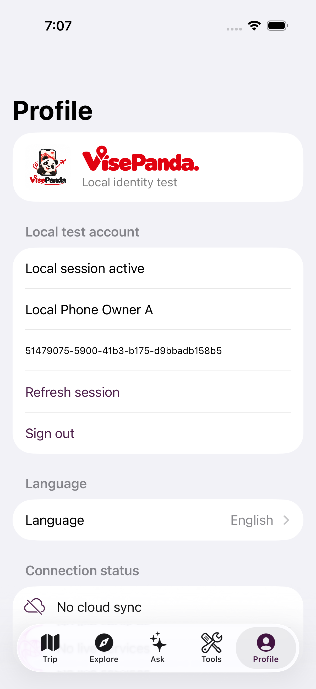

# VPJ-04 local identity verification

Baseline: `e78ee21`. Result: real local SwiftUI Profile → URLSession → Next native v2 API → ordinary Supabase Auth/JWT → persistent mobile epoch and owner RLS. This is local integration, not production or complete #191 acceptance.

## Observed passes

- Two fresh iPhone 17 / iOS 26.5 Simulators: real Keychain login/profile/refresh/restore/account switch/logout (2 tests); phone A Profile login, phone B replacement, phone A restart/old Keychain rejection, phone B logout (4 UI tests). Every selected identity test actually ran, **0 skip**. Successful result bundles are `/tmp/vpj04-native-model-1788995209037.xcresult`, `/tmp/vpj04-phone-a-login-1788995209037.xcresult`, `/tmp/vpj04-phone-b-replace-1788995209037.xcresult`, `/tmp/vpj04-phone-a-rejected-1788995209037.xcresult` and `/tmp/vpj04-phone-b-logout-1788995209037.xcresult`.
- Actual Supabase-signed token naturally expired with the dedicated Auth expiry set to 60 seconds; native session rejected it and refresh preserved the mobile epoch. The environment was restored to 3600 seconds. See `natural-expiry.log` and `environment-root.json`.
- Real owner/other-user RLS, concurrent same-attempt login, second-phone replacement, direct Auth refresh revocation, old direct database writes, old logout isolation and Web coexistence passed. Temporary test barriers observed the real business RPC holding the account lock and replacement waiting on it; no barrier is in the migration.
- Actual already-applied Trip confirmation, repeated Turn start and already-granted consent replay returned no receipt after phone replacement. All 15 existing authenticated-callable public definer RPC entry bodies retain their original hash after removing the sole inserted guard.
- Fresh, separate Supabase **26 → 27 migration** startup succeeded without history repair. All behavior tests then ran against API 59821 / Next 59831: **1 integration test, 0 fail, 0 skip**. Real SDK-produced Web cookies retained same-origin profile read/write, rejected missing/hostile Origin and rejected mixed Bearer credentials. See `replay-root.json` and `fresh-replay-behavior.log`.
- `pnpm check` passed, including lint, typecheck, production build and 22 static tests. Unit 92/92, contract 195/195, security 96/96, repository E2E contract suite 40/40; all those suites had 0 skip. Ten existing identity/Trip/Turn/actor database tests ran against the explicitly selected disposable instance with unchanged business assertions.
- The full integration suite had 29 pass / 0 fail / 11 skip: ten unrelated budget-environment cases and the opt-in native test, which was run separately with real local activation and 0 skip. This aggregate remains **INCOMPLETE**, not a full integration-suite pass.
- Final default native regression passed: 8 navigation/locale contracts, default-disabled identity configuration, and Chinese Profile language switching to English. Final copy-only changes received a fresh unsigned Simulator build. The real Keychain runtime runs used local ad-hoc signing, with no real signing team/profile/certificate.

## Failures and limits retained

The first unsigned native runtime test reached Keychain and failed; ad-hoc Simulator signing resolved it without a memory substitute. First fresh API startup returned non-JSON HTML once; its root cause was not established. Subsequent complete runs passed, and the harness now waits for a read-only native/session `401` JSON `UNAUTHENTICATED` response before creating accounts, checking that its owned server has not exited. No business mutation is retried for startup readiness.

A legacy integration test batch initially auto-discovered the repository's old local instance and created its synthetic accounts there. It executed its `finally` cleanup, but had no deletion-status assertion. Root's read-only follow-up found zero matching temporary accounts and zero orphan Trips; there is no before snapshot proving every old row unchanged. See the incident entry in `environment-root.json`. All ten affected tests and `db:verify` now require an explicit workdir and expected loopback origin; SQL containers come from that same workdir. New test cleanup is registered before signup and asserts zero remaining exact subjects.

`db:verify` reports target availability, not all runtime paths. No visible Web UI changed, so desktop/390×844 browser QA is not claimed. Native actual UI tests and real HTTP Cookie/Origin tests provide the affected-surface evidence. Xcode emitted a diagnostic-collection `simctl` path warning, while test terminal outcomes and result bundles succeeded. Physical-device/VoiceOver and remote acceptance remain unrun.

## Handoff

`docs/contracts/vpj-04.md` owns the local v2 protocol. `commands.jsonl` records concrete commands and outcomes. Runtime defaults remain unavailable unless explicitly enabled against loopback. Keep #191 open for the remaining environments and consumers; do not claim push, C2, native Trip writes, Staging or production activation.
