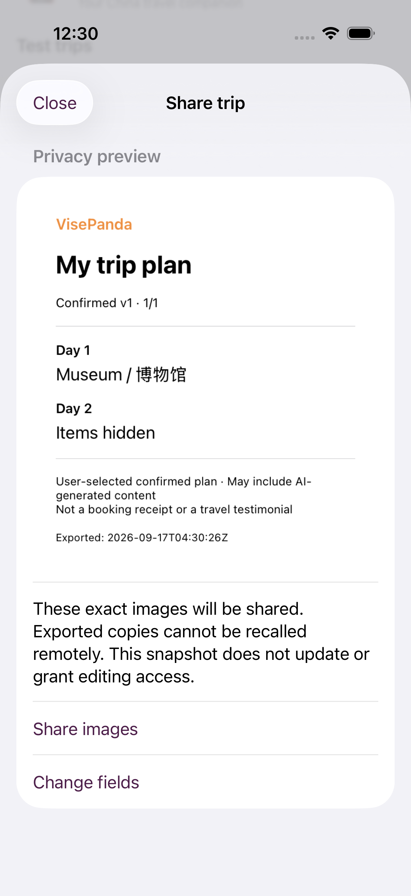
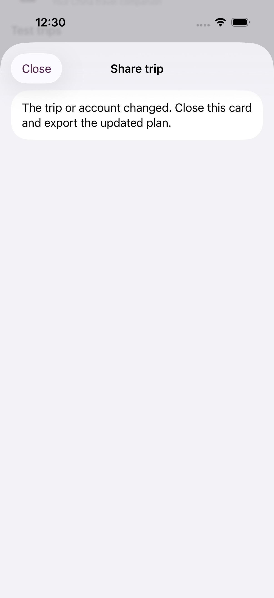
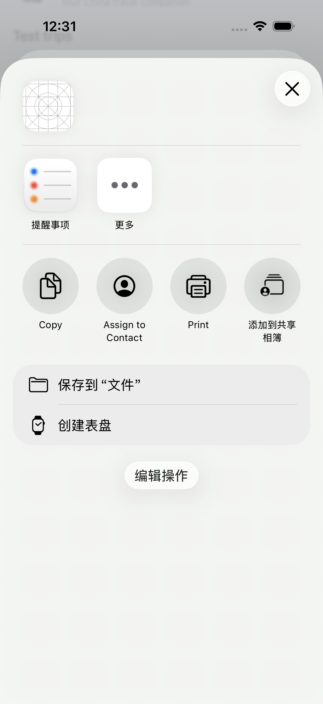

# VPJ-49 / #241 — local confirmed itinerary share cards

2026-09-17. Base: `7758d01`. Implementation branch:
`codex/vpj-49-local-sharing-20260917`. Isolated checkout protects the original
`vp-v4-work` and its untracked `.claude/` folder.

## Acceptance mapped to implementation

| Issue criterion | Real implementation | Evidence |
| --- | --- | --- |
| One Chinese/English local template: choose fields → privacy preview → system Share Sheet | `NativeTripShareView`, `NativeTripSharePreview.render`, `NativeTripShareActivity` | Native UIImage rendering; bilingual Simulator UI tests and system ActivityListView |
| Authorized assets, AI/user disclosure, no invented orders/testimonials | Text-only card using system font and product colors; disclosure on every page | Export image inspection and native assertions; no new external assets |
| Hide hotel/order/companions/dates; exported images cannot be recalled | All titles/items/travel dates hidden by default; per-item opt-in; no private structured fields projected; warning before system handoff | Projection/privacy tests and OCR of actual export pixels |
| 2026-09-17 increment: day/whole trip, version/time, changes require re-export, exact confirmed content, no public hosting/edit grants | Immutable confirmed-only source; single-day filter; page version/time; authenticated read before preview/share; account/content/version fences; images-only activity payload | UI whole-trip and single-day checks, later-version invalidation, source-fence tests, pagination without truncation |

The source data in repeatable UI tests is explicitly synthetic, served only on
127.0.0.1:59941. The app, image rendering, privacy selection and Apple system share
controller are real native runtime behavior, not fixture claims about Supabase.
The feature consumes interfaces already present in `NativeTripStore`; #192/#199
retain their own acceptance, and #189/#359/#360 are untouched.

## Validation

- `pnpm lint`, `pnpm typecheck`, `pnpm build`, `pnpm test`: PASS.
- `pnpm test:unit`: PASS, 15 test files, zero skipped.
- `pnpm test:contract`: PASS, 109 test files, zero skipped.
- `pnpm test:integration`: exit 0, **INCOMPLETE: 76 skipped**.
- `pnpm test:security`: exit 0, **INCOMPLETE: 1 skipped**.
- `pnpm test:e2e`: PASS, 34 test files, zero skipped (source/contract suite).
- `pnpm evals`: PASS, 16 test files, zero skipped.
- `pnpm check:flags`, `pnpm check:assets`: PASS.
- `pnpm exec playwright test --config playwright.config.mjs --workers=1`: PASS,
  9/9 browser tests, after successful Chromium install with bundled Node 24.19.0.
- `xcodebuild -list`, `xcrun simctl list devices available`: PASS.
- Generic iOS Simulator unsigned build: PASS, Xcode 27.0 / SDK 27.0.
- Final native run: **13/13 PASS**, zero skipped, comprising 7 sharing tests,
  4 existing Trip state tests and 2 bilingual native UI tests. The OCR test reads
  the actual generated bitmap and verifies selected Museum text is present while
  hotel/room/order/companion/travel-date/private-ID text is absent.
  Xcode result: `/tmp/vpj49-scoped-final.xcresult`, Simulator iPhone 17 Pro / iOS 26.5,
  UDID `42675EC5-6837-4F73-B478-7D979D5DA392`.
- `pnpm docs:check`, `git diff --check`, new Node/Python runner syntax: PASS.
- Implementer diff review: no unrelated runtime changes, new data grants,
  database writes or unresolved sharing/privacy finding. Sharing revalidates the
  preview identity after async refresh and disables field editing during that read.

## Captured native evidence

Work window: approximately 12:06–12:31 China time, 2026-09-17, to local verification.
Rework: three UI-driver corrections and the Node/Playwright installation retry.
No external approval waiting; CI/merge and user acceptance are separate states.

Earlier failed attempts were diagnosed and corrected, not relabeled as passes.
See [unrun](unrun.md) for precise environmental and delivery boundaries. Raw command
exit codes are in `commands.jsonl`; screenshots are exported from the named xcresults.

## Reproduce native UI

Build with the VisePanda scheme and an available simulator, using an explicit
`-derivedDataPath`. Start `node tests/integration/sharing/native-share-fixture.mjs`,
then run `python3 ios/scripts/run-share-ui-tests.py --derived-data <absolute-path>
--simulator <available-UDID> --result-bundle <new-absolute-xcresult-path>`.
The runner sets only the synthetic-test opt-in; no real credential is used. Stop
the fixture afterward. Native unit tests use the normal VisePandaTests scheme target.

Rollback: revert this PR. No data migration, service configuration, new hosted
surface, purchase or external message is involved.

Post-PR review correction: selection keys include both day ID and item ID. A
malformed snapshot with a repeated item ID on another day cannot cause an
unselected private title to be exported. The new regression and both UI flows
pass on the final code. First-head remote Quality PR also passed; final-head CI
is checked separately on GitHub.
