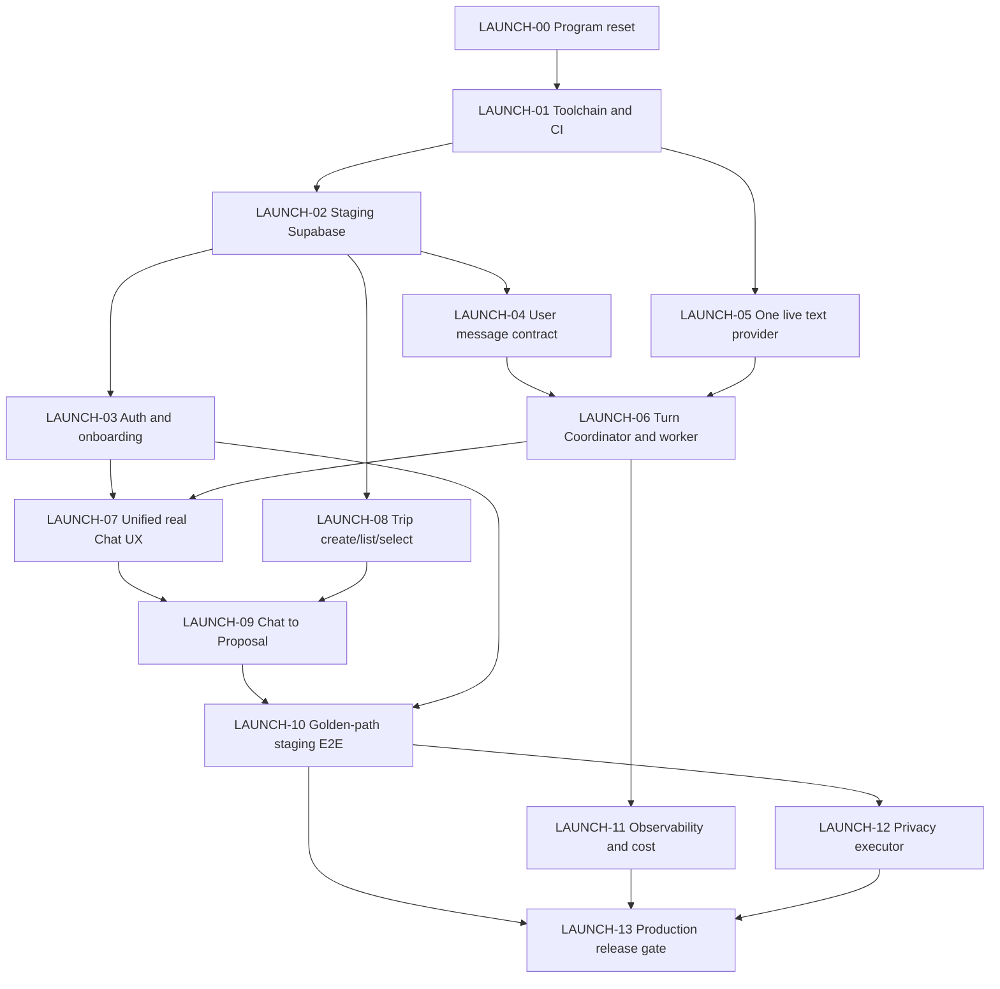

# VP-V4 上线可用性审计与 Issue 路线图

> **修订说明（2026-08-29）：** 本文保留为仓库事实审计。`LAUNCH-00～19` 的执行编号、Supabase 环境策略、Today 范围、Production 门禁和交接要求已由 [Closed Beta 上线 Issue 计划](vp-v4-closed-beta-launch-issue-plan.md) 取代；如两者冲突，以后者为准。

> 审计日期：2026-08-29
> 审计基线：`main@594821cc9ebc76b488c7feb65d1421ed26a3651e`
> 仓库：<https://github.com/JTCAO515/VP-V4>
> 结论状态：`blocked / not launch-ready`
> 偏差等级：D2（Issue 的“完成”定义与真实产品可用性之间存在跨前端、后端、数据、AI、运维的系统性偏差）

## 1. 执行摘要

VP-V4 目前不是“只差部署”的产品，也不是“后端已经完成、只需补前端”。它更准确的状态是：

> **一个视觉完成度较高、契约与安全边界较丰富、具备部分 Supabase 持久化骨架，但没有闭合真实用户主路径的产品预览。**

仓库已经完成了大量有价值的基础工程：Next.js 页面、五语/RTL、登录表单、Supabase 表与 RLS、Trip/Proposal/Memory/Profile/Chat Thread 的部分持久化接口、失败分类、契约测试、安全测试和发布边界文档。这些工作不是无效工作。

但用户仍无法完成最基本的产品任务：

```text
注册/受邀进入
  -> 登录
  -> 输入旅行需求
  -> 收到真实 AI 回答
  -> 生成 Trip Proposal
  -> 在 Canvas 查看 Diff
  -> 确认
  -> 刷新后仍看到已保存行程
```

这条链路当前在“输入旅行需求”之前就断了：

- `/visepanda` 的文本框只写 React 本地 state，不调用 API；
- `/visepanda/ask` 是另一套数据页面，但没有 prompt/message 输入合同，只能创建 thread 和启动空 turn；
- `start_chat_turn` 只把 turn 写成 `accepted`；
- 仓库没有生产 Turn Coordinator、后台 worker 或真实模型 provider transport 去生成 answer/card/proposal；
- fixture ModelGateway、Fake Coordinator、in-memory contracts 没有任何运行时 consumer；
- `CHAT_RUNTIME_ENABLED` 和 `TRIP_PERSISTENCE_ENABLED` 默认关闭，且没有被产品运行路径消费；
- 已经存在的 Trip Canvas 需要一个已存在的 UUID，产品内没有创建/选择 Trip 的完整入口。

因此，当前不能对外声称“Chatbot、AI 行程规划、Trip Canvas、Today、Explore、翻译工具或完整 closed beta 已上线”。

### 1.1 当前成熟度估计

以下百分比是基于本次代码、运行时与部署证据的工程估计，不是业务 KPI：

| 维度 | 估计成熟度 | 判断 |
| --- | ---: | --- |
| 视觉与响应式外壳 | 65%–75% | 首页、登录、Product Shell、五语、RTL 和主要静态状态已存在 |
| 核心交互前端 | 15%–25% | 页面多，但导航割裂、主输入不连 API、多个页面只显示 unavailable |
| 后端领域契约 | 60%–70% | Trip、Proposal、Memory、Profile、Turn 等合同和负例较充分 |
| 后端生产运行时 | 15%–25% | 没有真实 AI 调用、协调器、worker、真实知识/外部数据闭环 |
| 数据与权限基础 | 45%–55% | 有 21 个 migration 和 RLS，但本地运行验证大量跳过，生产迁移/恢复证据不足 |
| 发布与运维 | 10%–20% | Vercel 能部署，但自定义域名、release assets、可观测、canary、回滚和环境保护未闭合 |
| **可用 closed-beta MVP 整体** | **约 25%–35%** | 架构准备多于用户可用能力 |

## 2. 审计范围与判定标准

本次审计读取并核对了：

- 根目录治理、`README.md`、`CONTEXT.md`、`HANDOFF.md`、`docs/handoff.json`；
- 22 个页面、19 个 API route、45 个组件、50 个 server 文件、21 个 Supabase migration；
- GitHub open/closed Issues、PR、Actions、Deployments 和最新 Vercel Production 状态；
- Chat、Auth、Trip、Memory、Profile、Privacy、Today、Explore、Tools、ModelGateway、Knowledge、External Evidence 的源码；
- 现有 parity、R1–R5 acceptance、release gate 和 runbook 文档；
- 本地构建、测试、浏览器、资产和数据库探测。

判定原则：

1. 页面存在不等于能力可用；
2. contract/fixture/in-memory 测试通过不等于生产路径通过；
3. deployment success 不等于产品上线；
4. Issue 关闭只证明其约定范围完成，不自动证明 Issue 标题描述的最终用户能力完成；
5. 最小上线判据必须由真实用户路径、真实数据持久化、权限、可观测和回滚共同证明。

## 3. 已经做好的部分

### 3.1 前端基础

- Next.js 16 App Router、React 19、strict TypeScript 和 Tailwind v4 可正常构建；
- `/`、`/homepage`、`/auth/sign-in`、`/visepanda` 及多项 product route 已生成；
- 首页、长版 Homepage、登录页和 Product Shell 有独立视觉表达；
- 中文、英文、西班牙语、俄语、阿拉伯语和 RTL 基础已存在；
- 320–1440px 的现有 viewport 测试通过；
- Profile、Copilot Memory、Trip Canvas、Chat Thread 页面已经有部分真实 API 读取/写入代码；
- unavailable/degraded 边界表达较诚实，没有用静态价格或假 provider 冒充成功。

### 3.2 后端与数据基础

- Supabase browser/server client 已接入；
- password sign-in/sign-out 已实现；
- Trip、Proposal、Confirm、Revision、Reject、Rollback 的数据库/RPC 基础存在；
- Chat Thread、Turn 状态、event replay、cancel、structured feedback 的表和 API 存在；
- Memory consent/profile/receipt、User Profile、Privacy request receipt 有 owner-scoped schema；
- 多数用户数据 API 从 Supabase claims 获取 actor，并采用 RLS/同源变更保护；
- 失败码、idempotency、CAS、append-only、Evidence eligibility 等安全约束比较系统；
- migration 和安全/契约测试覆盖了较多负例。

### 3.3 工程治理

- ADR、合同、acceptance、runbook、artifact、handoff 文档丰富；
- contract suite 139/139、静态 E2E 29/29、evals 20/20 在本次审计中通过；
- 代码能够在项目声明的 pnpm 9.15.9 下完成 lint、typecheck、build 和基础测试；
- 现有文档已经多次明确声明 `fixture-only`、`unavailable`、`blocked / non-release`，说明仓库内部并未真正证明“已上线”。

## 4. 关键事实：为什么用户仍然无法使用

### 4.1 两套 Chat 页面没有合并

`components/VisePandaChatWorkspace.tsx` 是首页 CTA 打开的产品壳：

- textarea 只更新 `draft`；
- 点击发送只设置 `submitted`；
- 没有 `fetch`、thread、turn、message、SSE 或 Trip API；
- 导航按钮只切换同一组件里的 `surface` state，不进入实际 product route。

`components/chat/ChatThreadWorkspace.tsx` 才连接 `/api/chat/**`，但它：

- 没有自由文本输入；
- 创建 thread 时 body 是 `{}`；
- 启动 turn 时只提交 `turnId`、`idempotencyKey` 和固定 digest；
- 现有 E2E 测试明确把“without prompt submission”当成通过条件。

结果是：预览页面像 Chatbot，但不调用后端；数据页面调用后端，但不是 Chatbot。

### 4.2 没有真实 AI 运行路径

- `lib/server/model-gateway/**` 只有 fixture-only 路由；
- 仓库未发现调用 DeepSeek、Qwen、Kimi、GLM 或其他 LLM 的 outbound transport；
- `runFakeTurn` 和 `createFixtureModelGateway` 没有被 app/API/runtime consumer 使用；
- 没有后台 worker 消费 accepted turn；
- 没有从 user message 到 context/retrieval/model/validation/event/proposal 的应用服务；
- 没有生产 prompt/schema registry 的运行时装配；
- 没有真实 token/cost/latency telemetry。

### 4.3 登录页面存在，但不是完整登录产品

`/auth/sign-in` 实际存在，并且最新 Vercel 部署返回 200；但用户仍会感知“没有登录”：

- 根首页 CTA 直接进入 `/visepanda` 静态预览；
- 没有 middleware/proxy 保护 product routes；
- `returnTo` 查询参数没有被登录页消费，登录后固定去 `/visepanda`；
- `showFirstRun` 默认 false，当前 page 没有传 true；
- `notProvisioned` 状态在 UI 类型中存在，但没有任何代码设置它；
- 没有邀请管理、密码重置、账号恢复或运营侧用户 provisioning 流程；
- 没有对真实 beta 账号完成 browser E2E。

### 4.4 Trip Canvas 有代码，但没有用户入口闭环

- `/visepanda/trips/[tripId]` 可读取、确认、拒绝、修改 Proposal 和 rollback；
- 但产品内没有 Trip list/create/select 的完整用户入口；
- Chat 不会生成 Proposal；
- Product Shell 不导航到真实 Trip route；
- 没有一条自动化测试使用真实登录用户走完 Chat -> Proposal -> Confirm -> Reload。

### 4.5 许多关闭 Issue 实际完成的是“诚实不可用”

现有 parity registry 已如实记录：

- Today：partial，缺 owner reader/live conditions；
- Recovery：in-memory contract；
- Explore：fixture-only/unavailable；
- Tools：fixture-only/unavailable；
- Guide Import：fixture-only/unavailable；
- Offline：planned；
- Privacy：只有 request/receipt，没有导出、删除 executor；
- ModelGateway：fixture-only；
- R2/R5/WEB-11 acceptance：`blocked / non-release`。

关闭这些 Issue 并不等于用户能力完成。测试通过的内容中，很多断言恰好是“页面不得工作或必须显示 unavailable”。

## 5. 前端缺口

| 优先级 | 缺口 | 当前证据 | 上线要求 |
| --- | --- | --- | --- |
| P0 | 统一 Product Shell 与真实 route | `/visepanda` 只切本地 state | 导航必须进入 Ask/Trip/Profile 等真实页面并保留 locale/session/context |
| P0 | 真实 Chat composer | 预览 composer 不 fetch，数据 Chat 无 prompt | 支持发送消息、重试、取消、恢复、错误和流式状态 |
| P0 | 登录与 onboarding | 页面存在但 returnTo/first-run/route guard 断裂 | 邀请用户能登录、回原目标、完成首设、退出并清空用户态 |
| P0 | Trip 创建/选择入口 | Canvas 只能靠 UUID deep link | 用户能创建/选择 Trip，并从 Chat 进入同一个 Trip |
| P0 | Answer/Card/Proposal 渲染 | Chat 只显示 event state | 渲染真实回答、证据卡、澄清和 Proposal CTA |
| P1 | 状态管理与错误恢复 | 页面各自维护局部 state | session expired、provider unavailable、network retry、stale data 有统一行为 |
| P1 | 可访问性真实验收 | 现有浏览器测试只检查 overflow/focus/控件存在 | 核心任务需 keyboard、screen reader、mobile keyboard、RTL 实测 |
| P1 | Profile/Memory/Privacy 导航 | direct routes 存在，Shell 不连通 | 统一信息架构和 authenticated navigation |
| P2 | Today/Explore/Tools/Import/Offline | 多数是 unavailable 页面 | 在主闭环稳定后按真实 provider/data/storage 逐项开放 |

## 6. 后端缺口

| 优先级 | 缺口 | 当前证据 | 上线要求 |
| --- | --- | --- | --- |
| P0 | User message contract 与持久化 | chat migration 明确“不存 raw prompt”，API 没有 message 字段 | 定义安全的 message/revision/content policy、RLS、retention 和删除路径 |
| P0 | 真实 Model Provider Adapter | 只有 fixture ModelGateway | 先接一个 text provider，完成 schema、timeout、retry、usage、cost、safety、redaction |
| P0 | Turn Coordinator | 只有 fake coordinator | 编排 context -> retrieval -> model -> validate -> event -> answer/proposal |
| P0 | 后台执行与流式传输 | 无 `supabase/functions`、worker 或 queue consumer | accepted turn 必须被可靠消费；SSE/replay/cancel 可验证 |
| P0 | Chat -> Trip Proposal | 现有 Proposal 与 Chat 互不相连 | validated model result 只能创建 immutable Proposal，用户确认后原子写 Trip |
| P0 | 环境装配与运行时 feature flags | flags 默认关闭且零 consumer | server-side flag source、kill switch、环境隔离和实际运行路径 |
| P0 | Hosted Supabase migration/RLS 证据 | 本地 integration 跳过 8 项，security 跳过 1 项 | staging/production migration、RLS、rollback、备份恢复均有真实结果 |
| P1 | Knowledge/RAG 持久化与数据 | 以纯合同/fixture 为主 | 最小 reviewed corpus、eligibility、retrieval、引用和更新流程 |
| P1 | Observability | 只有内存/metadata contract | traces、metrics、error capture、provider health、latency/cost dashboard、alert |
| P1 | Privacy executor | migration 注释明确“不会导出或删除” | 异步导出交付、删除、备份/TTL 例外与完成 receipt |
| P2 | 外部实时数据与 Tools | 无真实 provider transport | 每个 provider 先完成 rights/policy/region/TTL，再接 adapter |

## 7. 平台、CI 与上线缺口

1. `packageManager` 声明 pnpm 9.15.9，但普通 `pnpm` 命令可落到 11.19.0；pnpm 11 会忽略当前 overrides 并使 frozen install 失败。
2. `pnpm test:unit` 当前 15/16，通过失败原因是测试把 `handoff.lastUpdated` 写死为 2026-08-28，而实际为 2026-08-29。
3. `pnpm check:assets:release` 失败：9 个 `blocked-release` preview assets 仍在 public output。
4. 最新 Nightly 已失败；当前 commit 没有 GitHub check-run 证明。
5. Next.js 多 lockfile 推断了错误 workspace root，部署追踪根存在不确定性。
6. GitHub `Preview`/`Production` environment 没有 protection rules；main branch protection 未配置或不可访问。
7. Vercel 每次提交均标为 Production deployment，缺少明确的 Preview -> Production promotion gate。
8. 最新 Vercel URL可访问，但 `https://go2china.space/visepanda`、`/auth/sign-in` 和 `/api/chat/threads` 均返回 404 `DEPLOYMENT_NOT_FOUND`；自定义域名/alias 未正确绑定。
9. 没有被接受的 canary、rollback rehearsal、SLO/error budget、报警和观察窗。

## 8. 本次可复现验证结果

| 检查 | 结果 | 说明 |
| --- | --- | --- |
| `corepack pnpm install --frozen-lockfile` | PASS | 使用项目声明的 pnpm 9.15.9 |
| 普通 `pnpm install --frozen-lockfile`（pnpm 11.19.0） | FAIL | overrides/lockfile config mismatch |
| `pnpm check`（pnpm 9 shim） | PASS | lint、typecheck、build、基础 22 tests 通过 |
| `pnpm test:unit` | FAIL | 15 pass / 1 fail，handoff 日期写死 |
| `pnpm test:contract` | PASS | 139/139；大部分是 contract/fixture |
| `pnpm test:integration` | DEGRADED | 12 pass / 8 skip，local Supabase 未运行 |
| `pnpm test:security` | DEGRADED | 67 pass / 1 skip，local RLS 未运行 |
| `pnpm test:e2e` | PASS WITH LIMIT | 29/29，但多数为静态源码/不可用状态断言，不是浏览器用户旅程 |
| `pnpm evals` | PASS WITH LIMIT | 20/20，均为 deterministic/synthetic fixture |
| `pnpm test:e2e:frontend` | PASS WITH LIMIT | 3/3，只覆盖 viewport、focus/RTL、登录控件存在 |
| `pnpm check:assets` | PASS | preview 模式通过 |
| `pnpm check:assets:release` | FAIL | blocked-release assets remain in public output |
| `pnpm db:verify` | DEGRADED | baseline 存在；user/ops/worker 三条连接路径均 `not-configured` |
| 最新 Vercel `/`、`/auth/sign-in` | 200 | 静态/登录页面部署成功 |
| 最新 Vercel `/api/chat/threads` | 401 | Supabase 配置存在，未认证时按预期拒绝；未证明真实用户路径 |
| `go2china.space` 产品/登录/API | 404 | 自定义域名部署未找到 |

## 9. 为什么会出现“Issue 都完成了，但产品不能用”

根因不是单个开发错误，而是完成定义发生了漂移：

1. **Issue 标题写用户能力，验收却允许只交付 contract/unavailable。** 例如“Durable Chat”实际验收为无 prompt 的 thread 状态机；“Offline”实际交付是禁止显示 offline 内容的页面。
2. **安全降级被当成交付终点。** fail-closed 是必要条件，但不是用户价值。
3. **测试结构偏向源码断言。** 大量 E2E 实际读取组件源码或验证 unavailable copy，不执行真实用户旅程。
4. **模块独立完成，没有黄金路径集成 owner。** Auth、Chat、Model、Trip 分别有代码，但没有一个 Issue 对端到端成功负责。
5. **release gate 被关闭为 blocked verdict。** 这在文档语义上诚实，但在 GitHub 状态上容易被误读为“验收完成”。
6. **部署成功被混同为上线。** Vercel 构建成功没有证明账号、数据库、AI、域名、可观测或回滚。

## 10. Issue 处理策略选择

### 方案 A：重新打开全部旧 Issue

优点：标题与最终能力重新对齐。缺点：大量 contract-only 工作会与新 runtime 工作混在一起，历史状态难读，重新估算成本高。

### 方案 B：新建 `LAUNCH-00` Program，旧 Issue 保留为前置证据（推荐）

优点：不抹去已完成的合同/安全工作；每个新 Issue 必须交付一个可观察的真实用户结果；可明确区分 `contract complete` 与 `capability accepted`。缺点：需要一次 tracker/label 迁移。

### 方案 C：新仓库重写

优点：表面上更干净。缺点：会丢失当前有价值的 RLS、Proposal、Memory、契约和安全资产，同时很可能重现相同集成问题。

**推荐方案 B。** 当前架构基础值得保留，但必须以新的 Launch Program 重置完成定义。

## 11. 推荐的上线定义

### 11.1 可用 closed-beta MVP

只有满足以下条件，才可称“可用 closed beta”：

- operator-provisioned 用户能登录并回到原目标页；
- 用户能创建/选择 Trip；
- 用户能提交真实文本 prompt；
- 一个已批准的模型 provider 返回真实回答；
- Turn 过程可恢复、取消、重放，失败诚实可见；
- AI 可生成 immutable Trip Proposal，但不能直接写 Trip；
- 用户能查看 Diff、确认并原子应用；
- 刷新/重新登录后 Trip 仍一致；
- cross-user/RLS、idempotency、冲突和失败测试在真实 staging Supabase 上通过；
- 有错误监控、关键 trace、成本/延迟读数、kill switch 和 rollback；
- 用真实浏览器账号跑通至少一个完整黄金路径。

### 11.2 Public beta

在 closed beta 之上还必须补齐：

- 自定义域名、Preview/Production promotion、环境保护；
- release-approved assets 和权利证明；
- privacy export/delete executor；
- backup/restore、RPO/RTO 和观察窗；
- accessibility、mobile、load、rate limit、abuse/safety；
- 已批准的最小 Knowledge/External Data 来源；
- 对外文案与真实 maturity 一致。

Today、Explore、OCR、语音、Ride、Visa、Network、Offline 和 Human Handoff 不应阻塞第一个文本规划 closed beta；它们应在黄金路径稳定后逐项开放。

## 12. 推荐 Issue 路线图

### 12.1 依赖图



### 12.2 P0：恢复可信工程基线

#### LAUNCH-00：重置 Launch Program 与完成定义

- **Owner：** Product/Architecture；operator 决策。
- **目标：** 新建一个只以真实用户结果关单的 Launch Program；旧 Issue 保留为 contract/security evidence。
- **Scope：** 建立 `maturity:contract`、`maturity:runtime`、`maturity:staging-accepted`、`maturity:production-observed`；任何 release gate 若 verdict 为 blocked，Issue 状态保持 open/blocked，而不是 closed。
- **Do not touch：** 不重写现有合同，不批量删历史 Issue，不声称旧工作无价值。
- **Acceptance：** Program body 包含黄金路径、依赖图、每个 capability 的 owner、真实观测、关单规则；本文档链接为 mandatory reading。
- **Rollback：** 删除新 labels/Program，不改变 runtime 或数据。
- **估算：** S（1 天）。

#### LAUNCH-01：钉死工具链并恢复全绿 CI

- **Owner：** Platform。
- **Scope：** 让所有本地/CI 命令强制使用 pnpm 9.15.9；修复 stale date unit test；配置正确 Next `outputFileTracingRoot`；修复 Nightly；将 release asset check 放进 release candidate gate；启用 main branch required checks。
- **Affected files：** `package.json`、`pnpm-lock.yaml`/pnpm 配置、`next.config.ts`、`.github/workflows/**`、`tests/unit/governance/**`、资产 ledger/check。
- **Acceptance：** fresh clone 上 `pnpm install --frozen-lockfile`、`pnpm check`、unit/contract/integration/security/e2e/evals/docs/flags/assets 全部不失败；允许的 runtime skip 必须按 Issue 明确列出，release gate 不允许 asset skip。
- **Risk：** 包管理器切换导致 lockfile 变化。
- **Rollback：** 回退工具链 PR；不得关闭 required checks 来“恢复”绿色。
- **依赖：** LAUNCH-00。
- **估算：** M（2–3 天）。

#### LAUNCH-02：建立真实 Staging Supabase 与数据库验收

- **Owner：** Backend/Data + operator（账号/region/secret 授权）。
- **Scope：** 独立 staging project；应用全部 migration；配置 auth redirect/site URL；建立 invite-only 测试用户；验证 user/ops/worker 三条连接；运行 RLS、RPC、migration rollback、backup/restore smoke。
- **Do not touch：** 不在仓库写入 URL/key/password；不直接使用 Production 做开发验证。
- **Acceptance：** integration 20/20、security 68/68 在 staging/local runtime 条件下运行；跨用户读写全部拒绝；迁移从空库可重复；记录 project/region/retention owner，不记录秘密。
- **Rollback：** 删除独立 staging project 或回滚追加 migration；Production 不受影响。
- **依赖：** LAUNCH-01。
- **估算：** L（3–5 天）+ operator 配置时间。

### 12.3 P0：登录与真实 Chat 主链

#### LAUNCH-03：完成 closed-beta Auth、route guard 与 onboarding

- **Owner：** Web/Identity。
- **Scope：** 保护 authenticated product routes；消费安全的 `returnTo`；首登展示 first-run；实现 session refresh/expired/sign-out；定义 operator provisioning 流程；根首页根据产品策略进入登录或匿名 preview。
- **Acceptance：** 浏览器真实账号覆盖 login -> returnTo -> first-run -> product -> sign-out；未登录访问受保护 route 回登录；跨用户状态清空；五语、RTL、password manager、mobile keyboard 通过。
- **Risk：** redirect loop、session cookie 不一致。
- **Rollback：** 保留匿名 preview，关闭 authenticated product entry；不恢复 Magic Link。
- **依赖：** LAUNCH-02。
- **估算：** M（2–3 天）。

#### LAUNCH-04：冻结 User Message、Assistant Output 与 retention 合同

- **Owner：** Chat/Data/Privacy。
- **Scope：** 为 thread/turn 增加有版本的 user message；定义文本长度、locale、Trip scope、PII redaction、retention、export/delete；定义 Answer/Clarification/Card/Proposal 输出 envelope；追加 migration/RLS。
- **Do not touch：** 不把任意 raw provider payload、reasoning 或秘密写库；不让客户端写 assistant output。
- **Acceptance：** owner 可创建/读取消息；另一用户不可读；重复 idempotency 不重复创建；超长/空/非法结构拒绝；delete/export scope 包含 message；migration 可回滚。
- **Risk：** 数据分类和保留策略属于 D2，需要 ADR/合同评审。
- **Rollback：** 关闭 message create flag，保持 thread read-only；追加式回滚，不破坏已存在 Trip。
- **依赖：** LAUNCH-02。
- **估算：** L（3–5 天）。

#### LAUNCH-05：接入一个真实文本模型 Provider

- **Owner：** AI Runtime + operator（provider/region/secret）。
- **Scope：** 只接一个 provider、一个 ordinary-text profile；实现 thin HTTP adapter、deadline、abort、Retry-After、schema validation、usage/cost、returned-model drift、safety/error mapping；secret 只在 server environment。
- **Do not touch：** 不同时接四个 provider；不做 OCR/voice/vision；不允许模型直接写 Trip；不记录 raw prompt/reasoning。
- **Acceptance：** sanitized staging smoke 成功；timeout/429/5xx/invalid schema/safety/cancel 均可复现；预算和 kill switch 生效；provider 关闭时返回统一 unavailable。
- **Risk：** 数据地域、DPA、模型别名和成本。
- **Rollback：** provider flag off，Chat 显示诚实 unavailable，Trip 仍只读。
- **依赖：** LAUNCH-01 + operator provider 决策。
- **估算：** L（3–5 天）。

#### LAUNCH-06：实现生产 Turn Coordinator、worker 与 SSE

- **Owner：** AI Runtime/Backend。
- **Scope：** accepted turn 进入可靠 job；组装 actor-scoped context；调用 LAUNCH-05；验证输出；append event；终态只写一次；支持 replay/cancel/retry/lease/quarantine；SSE 与数据库 replay 一致。
- **Do not touch：** 不用 in-memory store 作为生产真理；不允许客户端 append assistant event；不在 route handler 内无界执行整轮。
- **Acceptance：** 输入 message 后依次产生 accepted/planning/generating/validating/completed 或明确失败；刷新可 replay；cancel 后无后续输出；重复 delivery 不重复 answer；worker crash 后可恢复；跨用户不可观察。
- **Risk：** at-least-once、重复输出、serverless timeout。
- **Rollback：** `CHAT_RUNTIME_ENABLED=false` 停止新 turn；保留 history 和只读 Trip。
- **依赖：** LAUNCH-04、LAUNCH-05。
- **估算：** L（4–5 天）；超出必须拆 job 与 SSE 两个 Issue。

#### LAUNCH-07：合并 Product Shell 与真实 Chat UX

- **Owner：** Frontend。
- **Scope：** 删除“本地提交即收到”的假 Chat 行为；Product Shell 导航到真实 routes；实现 message composer、thread list、streaming answer、clarification、cards、retry、cancel、feedback；保留 locale/RTL/mobile。
- **Acceptance：** 真实账号在桌面和 390×844 能发送文本并看到 provider answer；刷新历史仍在；network/provider/session failure 可恢复；静态预览不得冒充已发送；Playwright 使用真实 staging API。
- **Risk：** 两套 Chat UI 合并造成状态/样式回归。
- **Rollback：** 关闭 Chat runtime CTA，回到明确 labelled preview/unavailable；不保留假成功。
- **依赖：** LAUNCH-03、LAUNCH-06。
- **估算：** L（3–5 天）。

### 12.4 P0：Trip 主链

#### LAUNCH-08：实现 Trip 创建、列表、选择与空状态

- **Owner：** Trip Backend + Frontend。
- **Scope：** owner-scoped Trip create/list/read；首次 Chat 可选择创建 Trip；Product Shell 有 Trip 入口；空 Trip 和 archived Trip 有明确状态。
- **Acceptance：** 用户可创建一个 Trip、重新登录后再次进入；跨用户访问 403/404；创建幂等；无 UUID 手工输入；五语/RTL/mobile 通过。
- **Risk：** Trip identity 与初始 snapshot/version 规则。
- **Rollback：** 关闭 create flag，保留已有 Trip 只读。
- **依赖：** LAUNCH-02。
- **估算：** M（2–3 天）。

#### LAUNCH-09：闭合 Chat -> Proposal -> Canvas -> Confirm

- **Owner：** Chat/Trip Integration。
- **Scope：** 模型输出只映射成 validated immutable Proposal；关联 thread/turn/trip/base version/evidence；Chat 显示 Proposal CTA；Canvas 显示 Diff；用户 confirm/reject/revise；确认后 reload canonical Trip。
- **Acceptance：** 不确认则 Trip 不变；确认一次只产生一个新版本；重复确认幂等；stale base version 冲突；reject/revise 保留 lineage；刷新/重登后 canonical Trip 与 audit 一致。
- **Risk：** 这是核心写路径，必须使用真实 staging transaction 和 RLS 证据。
- **Rollback：** 关闭 proposal generation；Chat 仍可只读回答，Trip 不接受新写入。
- **依赖：** LAUNCH-07、LAUNCH-08。
- **估算：** L（4–5 天）。

#### LAUNCH-10：真实黄金路径 Staging E2E Gate

- **Owner：** QA/Release。
- **Scope：** Playwright 使用隔离 beta 用户和 staging；执行 login -> create Trip -> send prompt -> receive answer -> proposal -> diff -> confirm -> reload -> logout/login -> verify；加入 provider unavailable、cancel、session expiry、CAS conflict、cross-user negative。
- **Acceptance：** 黄金路径连续 20 次无数据串扰；0 个重复 Trip version；所有负例返回预期状态；测试产生 trace ID 和清理记录；秘密只来自 CI secret store。
- **Risk：** 测试数据污染和 provider 非确定性。
- **Rollback：** 测试只写隔离 namespace/user；清理测试数据，不触碰 Production。
- **依赖：** LAUNCH-03、LAUNCH-06、LAUNCH-09。
- **估算：** M（2–3 天）。

### 12.5 P1：可运维、隐私与发布

#### LAUNCH-11：生产可观测、预算与 kill switch

- **Owner：** SRE/AI Runtime。
- **Scope：** error capture、structured logs、turn trace、provider latency/token/cost、job backlog、Trip confirm outcome、auth error；内容默认不记录；报警与 dashboard；per-user/per-task quota。
- **Acceptance：** 每个黄金路径 turn 可用 trace ID 定位；无 raw prompt/JWT/password；provider error、job stuck、cost spike 触发 alert；kill switch 演练成功。
- **Rollback：** 关闭 telemetry exporter，保留本地最小错误计数；不得关闭安全/预算 guard。
- **依赖：** LAUNCH-06。
- **估算：** L（3–5 天）。

#### LAUNCH-12：实现 Privacy Export/Delete Executor

- **Owner：** Privacy/Data。
- **Scope：** 异步处理现有 privacy request；导出 Profile/Memory/Trip/Turn/Message/UserArtifact；删除或匿名化；处理 Storage/缓存/备份例外；生成完成/失败 receipt 和用户下载/状态 UI。
- **Acceptance：** 请求不是“提交即完成”；导出内容完整且只属于 owner；删除后在线数据不可读；备份保留例外与到期时间可见；失败可重试且不重复删除。
- **Risk：** 不可逆数据操作，属于 D3，必须 operator/ADR/恢复演练。
- **Rollback：** export 可停 worker；delete 在 dry-run/approval gate 前可停，执行后只能通过已接受的恢复政策处理。
- **依赖：** LAUNCH-10。
- **估算：** L（4–5 天）+ operator retention 决策。

#### LAUNCH-13：Production Release、域名、资产、canary 与观察窗

- **Owner：** Release + operator。
- **Scope：** 清除/替换 blocked-release assets；修复 `go2china.space` alias；Preview/Production 环境保护；required checks；migration plan；canary；rollback alias；SLO、报警、owner、72 小时观察窗；对外 claim matrix。
- **Acceptance：** release asset check 通过；自定义域名的 `/`、登录、Chat API health 正确；Production 只从通过 gate 的 commit promote；rollback rehearsal 可恢复上一 alias；观察窗无 P0/P1 未决故障后才接受。
- **Risk：** 公共发布、版权、域名、用户数据和 provider 成本，需 operator 明确授权。
- **Rollback：** 恢复上一 evidence-backed deployment alias；关闭 Chat/provider flags；数据库采用追加式补偿，不做破坏性回退。
- **依赖：** LAUNCH-10、LAUNCH-11、LAUNCH-12。
- **估算：** L（3–5 天）+ 72 小时观察窗。

### 12.6 P2：主链稳定后再开放的能力

以下能力不得与 P0 黄金路径同时大面积并行：

| 建议 Issue | 用户结果 | 前置条件 |
| --- | --- | --- |
| LAUNCH-14 Knowledge MVP | 两个试点城市的 reviewed facts 可被 Chat 引用 | LAUNCH-10、source/licence/region 决策 |
| LAUNCH-15 Explore MVP | city/POI detail、Ask/Add exact ID 闭环 | LAUNCH-14、LAUNCH-09 |
| LAUNCH-16 Today MVP | 当前 Trip 的一个 eligible next action | LAUNCH-09、真实 fact/observation reader |
| LAUNCH-17 Text Translation Tool | 真实文本翻译与纠错，不先做 voice/OCR | LAUNCH-05、provider/data policy |
| LAUNCH-18 Guide Import | private upload、extract、correct、Proposal | Storage/TTL、LAUNCH-09、LAUNCH-12 |
| LAUNCH-19 Offline Pack | 已确认 Trip/address/safe phrase 的 owner-isolated cache | LAUNCH-13、logout/delete/cache policy |

## 13. 建议的实施顺序与距离评估

### 13.1 第一目标：可用 closed beta

只做 LAUNCH-00 至 LAUNCH-11，暂不开放 Explore、Today、OCR、语音和多数 Tools。

工程量估计：

- 单人全栈：约 8–12 个工程周；
- 2–3 人在接口冻结后并行：约 4–7 个日历周；
- 外加 provider、Supabase、域名、数据地域、retention 等 operator 决策时间。

估计成立的前提是：保留当前 Next.js/Supabase/Proposal/RLS 架构，只接一个文本模型，不扩展新商业能力。

### 13.2 第二目标：public beta

完成 LAUNCH-12、LAUNCH-13，并关闭真实 release observation。预计再需 2–4 个工程周及至少 72 小时观察窗。

### 13.3 第三目标：完整产品承诺

Knowledge、Explore、Today、Translation、Import、Offline 和外部数据逐项上线，预计再需 8–16 个工程周，且高度依赖 provider、版权、数据来源和运营决策。

## 14. 必须停止的做法

- 不再以“页面存在”“PR merged”“contract test passed”关闭用户能力 Issue；
- 不再把 unavailable 页面计为同名产品功能已开发完成；
- 不再新增大规模架构/研究 Issue，直到黄金路径通过 staging；
- 不同时接多个 LLM provider；先证明一个真实路径；
- 不在没有真实账号、数据库和 provider 的情况下把源码断言命名为 E2E；
- 不让 Vercel 的 Production deployment success 代替 release acceptance；
- 不为了让页面“看起来能用”恢复 fixture answer、假 Trip、假价格或客户端直接写 Trip。

## 15. 最终结论与唯一下一动作

VP-V4 的基础不是空白，但当前 GitHub Issue 状态严重高估了产品可用性。最优策略不是推倒重来，而是保留已有 contract/RLS/Proposal 资产，立即把工作重心从“继续补模块”切换为“闭合一个真实黄金路径”。

**唯一下一动作：创建并接受 `LAUNCH-00` Program，以本报告的 closed-beta 定义为新的关单基线，然后先执行 LAUNCH-01 和 LAUNCH-02。**

在 LAUNCH-10 的真实 staging 黄金路径通过之前，产品状态应保持：

> `preview / engineering scaffold / not usable as a real AI travel product`
