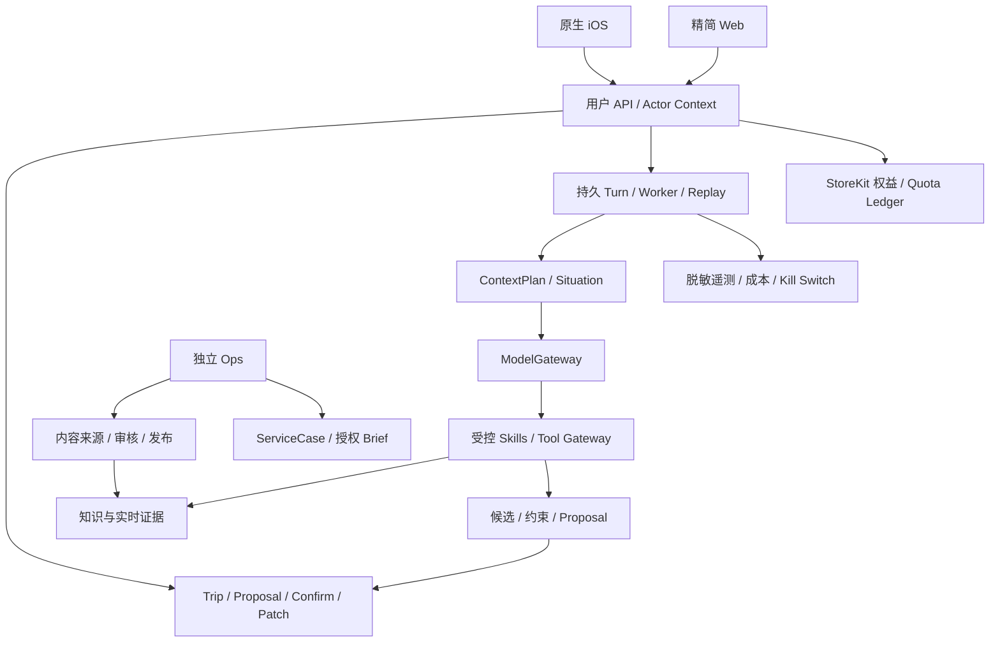

# VisePanda 全项目统筹规划与优化报告

版本：2026-09-05 / VPJ 基线 1.0。负责人：JT。交付 Program：[VPJ-00 #187](https://github.com/JTCAO515/VP-V4/issues/187)。

本文冻结本轮产品与工程组织方向，供产品、设计、iOS、Web、服务端、知识运营、客服与发布人员共同使用。具体商业账户、模型版本、数据保留期限、供应商合同和发布行为仍按对应任务取得事实；本报告不表示这些能力已上线。当前实现证据基于 `origin/main@fb8d2ba227fded32a8df6e4e09f9586ad0150f21`，2026-09-05 重读。

## 1. 总体决定

**VP 定位为面向国际来华自由行旅客的、贯穿整段旅程的 AI 旅行助手。**用户与一个固定身份的 VP 交流，计划、材料、准备、住宿选择、现场沟通、讲解与变化恢复围绕同一个 Trip 持续推进。

对外的一句话建议：

> 从第一份想法到旅途中的每一步，VP 陪你把中国自由行安排得更明白。

英文建议：

> Your China trip, connected—from the first idea to the next step on the road.

在产品介绍中补充具体交付：共同规划和修改行程、带入截图和订单、检查准备缺口、现场翻译和讲解、遇到变化时接回当前计划。预订与付款由旅客在第三方完成。内部详细错误码、供应商字段和模型名称只在需要时展开，不占据主文案。

本轮用户授权调整定位、理念、卖点、价格和使用方式，并明确允许关闭全部旧开放 Issue、建立新队列。因此采用以下统筹决定：

| 范围 | 新基线 |
| --- | --- |
| 产品主线 | 一个 VP + 同一 Trip + 连续旅程；Plan / Ready / Travel 用于组织能力与验收，不限制用户只能使用三个片段 |
| 目标旅客 | 已开始真实来华自由行计划、自己做重要决定、能自执行但受信息和本地环境阻碍；英语为主要招募语言 |
| 平台 | 原生 SwiftUI iOS 为完整首发产品；Web 保留精简的同 Trip Planning Studio；Android 后续独立决策 |
| 语言 | 当前仅中英；其他语言保留历史资产和兼容能力，退出首发质量承诺 |
| 导航 | Trip / Explore / Ask / Tools / Profile，默认 Ask；Today 在 Trip 内 |
| 酒店 | L1a 住宿/房型需求与候选解释 + L1b 经验证的供应商/联盟跳转；无实时接口不宣称当前可售房型 |
| 陪伴 | 连续上下文、合适语气、可纠正记忆、有原因且可关闭的提醒、清楚的失败接续 |
| 知识 | 原子事实、流程、讲解、用户材料与实时数据分层；先真实小语料和直接读取，再由检索失败驱动复杂 RAG |
| 商业 | 首轮以 Free + 30 天 Journey Pass 单次购买试验；暂停把自动续费 Plus 当唯一核心商品 |
| 后台 | 受保护的内容管理、审核、客户服务与运营报告；用户原文访问按用途/任务授权 |
| 社区 | 保留注册用户投稿、全量发布前审核、举报/屏蔽/下架；不在首发建设私信、关注关系和推荐算法社交网 |
| 工程 | 保留现有 Trip、RLS、迁移与安全合同；真实适配器和客户端补齐。代码文件数、合并数不当产品进度 |

## 2. 为什么调整产品理念

之前的讨论不断强调可信、未知和边界，这些是产品基础，但用户不会为了阅读状态标签而买单。VP 的前台应先给一个有帮助的成果：两条路线方向、一个能修改的安排、一张给司机看的地址、一个清楚的房型筛选说明，或一段合适长度的讲解。

可信机制应让这些成果经得起使用：用户需要时能看到依据，改变计划前看得懂改动，不能确认的地方有下一步。把所有内部限制放在首页会显得无能；把它们完全隐藏又会误导。建议按任务风险逐步展开。

温暖也应来自实际行为。用户说“今天有点累”，VP 能保留已订晚餐、减少下午步行、说清改了哪些项，比一个大动画角色更能体现了解用户。VP 可以说“我们接着上次的安排继续”，但不能声称自己亲身去过景点、在后台一直关注用户，或已经替用户完成第三方操作。

一站式的可测价值是减少重新解释、复制资料、反复切换后丢失的决定，以及变化后整份计划重做的成本。市场上 Mindtrip、Wanderlog、Trip.Planner 已具备聊天、计划、资料和地图等组合；这些功能的并集不能成为 VP 独有卖点。[Mindtrip](https://mindtrip.ai/)、[Wanderlog 功能](https://wanderlog.com/pages/help-center)、[Trip.Planner](https://www.trip.com/newsroom/trip-com-launches-trip-planner-smart-itineraries-tailored-to-your-travel-style-with-real-time-recommendations/)

VP 的竞争假设是：中国旅行情境理解、零散材料到可用 Trip 的转换，以及现场沟通/恢复与原计划的连续性。该假设必须由真实旅客任务验证，不能用竞品官网自述证明。

## 3. 用户画像、进入时刻和价值闭环

### 3.1 招募优先级

| 用户段 | 典型状态 | 首个成果 | 验证重点 |
| --- | --- | --- | --- |
| P：Planning | 有明确假期/出行窗口，无需精确日期；已有收藏或零散想法 | 可比较方向或条件性草稿 | 愿不愿用真实计划继续修改 |
| A：Arriving | 已定交通/住宿，临近出发 | 把材料变成准备清单与首日安排 | 能否发现并解决真实缺口 |
| I：In-trip | 已在中国，语言/地点/变动问题出现 | 地址、翻译、讲解或局部恢复 | 是否减少现场停顿，是否接回同一 Trip |

不按年龄或已买机票设绝对门槛。第一批更适合本人承担决策、愿意使用英文工具、近期存在真实旅行任务的人。营销范围可覆盖 12 个月内计划者；在途价值研究优先招未来 90 天出行和已在华者，以便观察真实节点。

### 3.2 第一轮体验

输入可以是一句话、一次 Explore 选择或一张截图；资料上传和准确日期均非必填。VP 先产出一个方向/片段，再用一个可跳过的问题补足最有价值的信息。需要写计划、分享原文、人工联系或外部动作时，才明确所需事实与授权。

用户注册并提问记为 `conversation_started`；采用/保存一份可继续使用的真实 Trip 成果记为 `activated_trip`。有理由拒绝只记 `outcome_recorded`，不能计作激活。自助激活与 Founder assisted 分开。

### 3.3 从开始到结束的完整范围

灵感与探索 → 方向比较 → 全局/局部规划 → 材料导入 → 日期与准备核查 → 第三方选择/预订出口 → 订单回流 → 抵达与移动 → 翻译与讲解 → 用户报告变化后的恢复 → 服务跟进 → 归档/轻分享 → 下一 Trip。

首发必须贯通这条生命周期，但不等于全国所有地点、全部供应商与无限人工。`Supported Journey Matrix` 按城市/到达走廊、场景、语言、事实、地图/工具和人工覆盖标出深度。先用 1–2 个城市和高频场景做真实纵切；矩阵外可以继续讨论，不能把一个 unavailable 页面当作该能力已交付。

## 4. 首发范围与后续范围

### 4.1 交付给首批客户的完整产品

- 原生 iOS 中英账号、Trip 与断网恢复；Web 同 Trip 基本读写、Chat 和差异确认。
- 无材料规划、材料中途加入、全局草稿、手动编辑、局部 Ask、diff 与确认。
- Explore 可浏览内容、收藏、Ask、Add to Trip。
- Ready 的明确场景准备检查；Today 与离线关键资料。
- 中英文字/按需语音翻译、大字展示，首批地点的短讲解与追问。
- 酒店 L1a/L1b、外部订单材料回流；交通/门票正规入口和解释。
- 用户报告变化后的局部恢复；有容量的人工服务请求与状态。
- 用户可控记忆、账号删除/导出、官方 IAP、明确额度和权益。
- 基础投稿/审核/举报/屏蔽/下架与运营后台。
- 从安装到支持、退款/到期、数据退出的完整服务链。

### 4.2 后续能力

复杂 Creator 视频/图片生成、社交关系、多人 Trip Invitation、Android、新语言、全自动主动聊天、持续定位、Live Activities、大规模混合检索、全国内容、多个地图/酒店供应商比价、实时航班、代客执行和 VP 签约履约均单独看证据。基础可分享 Trip 导出不等同复杂 Creator Studio。

后置是排期决定，不是“无用”。之前用户确认的 Community 和轻分享方向保留，不能从清理名单中删除。

## 5. AI-native 产品与 UIUX

### 5.1 稳定导航与情境内容

五个 Tab 保持位置和身份。AI 选择内容和动作组件，不生成任意导航或按钮布局。Ask 是交流入口；Trip 是计划与准备的当前状态；Explore 让用户主动浏览；Tools 直达短任务；Profile 管理用户、记忆、通知、权益和数据。

### 5.2 Chat + Plan

Ask 输出简短解释和一份主要成果卡；“查看计划”进入全宽 Trip 编辑。选中一天或几个项目后“问 VP”，以带选区标签的 sheet 打开；看修改前后与影响，确认后回到原来的对象和滚动位置。小屏不常驻聊天/地图/行程三栏。

每个回答可以包含受控的 Plan、Place、Compare、Phrase、Guide、Readiness、Handoff、ServiceCase、Evidence 卡。卡片只有结构完整并通过验证后才可操作。AI 无权自由换掉确认按钮目标。

### 5.3 必须具备的交互状态

未开始、无 Trip、加载、部分成功、缺少输入、缺依据、冲突、模型失败、权限拒绝、低额度、离线、取消、后台恢复、账号被另一手机顶替、过期 proposal、外部未知、人工未接单、订阅/Pass到期与退款。每个状态都要保持已有成果，并指向一个具体动作。

### 5.4 视觉规范

使用项目现有 VP 原始 Logo/熊猫资产；功能页面以 Cream/Ink 为基础，Plum 强调交互、Gold 少量点睛。颜色来自语义 token，不能由每位 coding agent 独立配色。正文使用 iOS 系统语义字体与 Dynamic Type；重点交互目标至少 44pt。

高级感来自内容层次、留白、清晰字重、对象连续和即时反馈。地图、照片、行程和确认信息是内容层；系统材质/玻璃用于导航和临时控件。户外强光、深色、Reduce Transparency 下都必须读得清。概念图中的错误地名、计数、新导航和生成 Logo 不进入正式资产。

### 5.5 动效语法

| 场景 | 设计意图 | 初始调优范围与中断 |
| --- | --- | --- |
| 选中行程项 | 立即反馈当前操作对象 | 约100–150ms；不等待动画再响应 |
| 对象 Ask sheet | 保留对象来源与返回联系 | 系统sheet/spring优先，约220–320ms候选，可拖回 |
| 新回答 | 按语义块增量展示 | 不逐字弹跳；用户上翻时停止跟底 |
| 查看 diff | 让人看清受影响范围 | 前后标签与位置稳定，不靠颜色独传含义 |
| 确认保存 | 表达服务端已确认的新版本 | 只在回执后播放局部强调 |
| 拖动/移日 | 跟手、落位、可撤销 | 长距离提供“移到某日”替代 |
| Guide/翻译音频 | 表达实际录音/播放状态 | 真实波形；来电/耳机变化可中断 |

上述为待真机调优目标，不是已测性能。Reduce Motion 保留状态与语义，去掉非必要位移。详细35屏矩阵与原生规范见 [iOS交付附件](research/final-ios-product-delivery-2026-09-05.md)。[Apple Generative AI](https://developer.apple.com/design/human-interface-guidelines/generative-ai)、[Apple Motion](https://developer.apple.com/design/human-interface-guidelines/motion)

## 6. 原生 iOS 与 Web 技术结构

SwiftUI + Swift 6；每个 Tab 独立 NavigationStack，路径仅保存 ID；页面数据从当前授权 repository 读取。领域状态与展示状态分离，任务取消和异步结果绑定账号、Trip、request ID。不要用 WKWebView 作为核心 App。

最小结构为 App/Navigation、Features、DesignSystem、Networking、Persistence、Services、Resources 与 Tests。复用本地未跟踪壳的有效结构，经审计迁入，不能把它当 main 已有原生产品。代码审计见 [资产处置附件](research/final-code-reuse-audit-2026-09-05.md)。

Web 沿用 Next.js App Router、React、strict TypeScript、Tailwind；保留已有基本编辑和确认。两端共享序列化领域协议和验收样例，各自原生渲染；不强行共用 UI 代码。

原生鉴权增加 bearer/session 路径；Web cookie 请求继续保留 CSRF/Origin 检查，不能为了 iOS 全局放宽 Origin。手机 session epoch只替换另一个手机，不踢 Web 会话。Keychain、缓存、通知和正在处理的任务在账号切换后不能串用。

Share Extension 只接收/轻量验证/投递材料，长解析由主 App/后端处理。语音按需录音；后台任务由系统调度，不能承诺手机永久驻留。最低运行 iOS17 与构建 SDK 分开；上传 App Store Connect 使用当前允许的稳定 Xcode/SDK。[Apple BackgroundTasks](https://developer.apple.com/documentation/BackgroundTasks/choosing-background-strategies-for-your-app)、[Apple 上传要求](https://developer.apple.com/news/upcoming-requirements/?id=02032026a)

## 7. 服务端总体架构

初期保持模块化单体和一个持久任务系统，不因角色数量拆微服务。用户 API、Ops 与 worker分别使用适合的身份与部署边界；同一个 service key不能代替用户身份。

当前56个server TS文件中许多是fixture或内存合同。下一步是把成熟的权限、Patch、事件和资格语义接到真实数据库、worker与provider。详见 [接口合同](program/2026-09-05/INTERFACES.md)。

## 8. Journey Agent、模型与工具

每轮先构建最小 Situation：用户最新输入、当前Trip版本/选区、固定条件、适用记忆、未决工作和已许可证据。一个 Coordinator 决定本轮任务，调用规划/导游/翻译/讲解/恢复技能。

每个 `SkillManifest` 定义 owner、输入、输出、风险、数据范围、工具白名单、证据要求、调用/时间/成本预算、降级与版本。技能只返候选；用户确认与事务写入由统一提交路径完成。并行可以用于独立检索，不能并行修改同一Trip。

LLM provider限定阿里千问、智谱GLM、DeepSeek；使用任务级实测选择一个主provider及最多一个已授权fallback。强模型处理复杂多日规划/难材料，普通模型处理有依据的解释和简单提取；金额、时间、授权、版本及幂等用代码。不按“免费就允许低正确率”路由。

当前模型具体ID/价格在真实接入任务中锁版本，不把9月早期研究的快照当永久最新。记录visible/thinking/cached tokens、图片、语音、重试和超时的实际计费。供应商故障切换要重新检查接收方授权，不能把敏感材料无条件发三家。

安全/政策拒绝、缺来源、供应商故障、额度不足不是同一类失败。每类对应实际可用的替代路线。第三方网页/截图/检索内容是数据，不能指挥VP调用新工具或越权。

## 9. 统一数据与状态

| 对象 | 拥有什么真相 | 不能混淆 |
| --- | --- | --- |
| Trip/PlanRevision | 用户已确认/待讨论的安排、约束 | 计划确认≠第三方成交 |
| Turn/Task/Event | 输入版本、真实执行、结果与恢复 | metadata replay≠已生成回答 |
| UserArtifact | 用户允许的原材料和校正候选 | OCR≠供应商核验 |
| ReservationReference | 用户声明、凭证确认、供应商核验各自状态 | click≠booked |
| Assertion/SourceRevision | 来源支撑的原子事实与适用范围 | reviewed≠所有用途可用 |
| LiveObservation | 供应商当前观察、时效和权限 | 当前观察≠库存归VP所有 |
| Memory | 适用偏好、来源、范围、纠正历史 | 一次低价搜索≠永久收入画像 |
| ServiceCase | 接单和跟进事实 | 自动回执≠真人受理 |
| Entitlement/Usage | 官方购买与消费账本 | sandbox≠真钱、恢复≠再次赠送额度 |

使用三套正交维度：能力深度（observe/explain/recommend/prepare/handoff/execute）、动作生命周期（proposed/authorized/executing/succeeded/failed/unknown/reconciling/cancelled）、责任角色（信息提供方/代理/合同主体）。一枚绿色勾不能合并这三种含义。

## 10. 陪伴、记忆与主动行为

首发保存当前Trip事实、任务上下文和用户主动保存的长期偏好。反复行为可在当前Trip临时影响排序，显示条件性解释并允许纠正；跨Trip推断需要另行验证。

用户看得见“为什么推荐这个/用了哪些偏好”，可以本次不使用、修改、忘记。纠正立即使旧派生摘要和待提交建议失效；安全约束、记忆纠错、导出/删除不作为付费权益。

主动出现按强度：

1. 打开 App 后的上下文接续与 Next Step。
2. 当前操作产生的重要冲突或已订阅结果的 App 内更新。
3. 用户亲设的时间提醒、已接受服务任务的真实更新；按 Trip、用途、时区、频率和到期控制。
4. 实时自动检测、持续定位、无请求闲聊、Live Activity 后续看事实与用户接受度。

发送前检查Trip版本、当前同意、状态、证据、去重和quiet hours；事情已结束或账号已切换就取消。不得把推广/佣金内容放进旅行紧急通道。[Apple Notifications](https://developer.apple.com/design/human-interface-guidelines/managing-notifications)

## 11. 不知道与失败也要能继续

用户结果统一为 `answered / partial / clarification / blocked / technical_failure`。前四类可包含已知、未知、影响和非执行型下一步；真正技术失败保留已保存成果并允许恢复。旧 unavailable 不能带卡片的合同通过版本迁移调整，不能只改文案。

例如：“这家店明天是否开放，我现在没有可靠的新信息。你可以先保留它作为候选；如果你愿意，我们把附近的另一个地点作为备选。” 不说“我会一直关注”，除非已存在任务、负责人、授权和到期。

`ResolutionIssue` 分 knowledge_missing、source_conflict、source_recheck、provider_incident、user_fact_required、policy_blocked、capability_unavailable、action_reconcile。只有前三种进入知识运营。重复出现按独立任务去重，不能把同一问题重试当十份需求。

Knowledge Gap可积累误解、来源缺口和恢复方法。只有经权限/去标识处理、有人接受、有下一复核时点时才形成跟进服务。未知的价值来自实际改进，不能靠把错误换名降低失败率。

## 12. 知识库与 RAG 全生命周期

### 12.1 从用户任务到语料

先定义8–12个黄金任务，每个列必要用户事实、政策事实、现场观察、失败分支和展示方式。首批10–20个原子内容只是建库试点，不是“能覆盖全国”的宣言；不足就记录缺口和新增内容成本。

来源登记/权利 → 获取修订与定位器 → AI辅助抽取候选 → 作者编辑 → 独立审查 → 当前请求资格判断 → 直接查询/检索 → claim coverage → 展示 → 纠正/来源变化 → 重验/失效。

### 12.2 知识分层

政策/地址等Reviewed Assertion、Procedure、Directory、Safe Phrase、Editorial Guide、用户私有材料和LiveObservation分别管理。事实语言中立，中英为同一事实的表达投影；来源语言可以是中文而输出是英文，无需复制原始文档。

资格按principal、Trip、purpose、field、recipient、region、时间、source revision与policy generation计算。权限/时效必须在召回前落实，模型和重排外发前再检查。支持多片段/多来源，不用重复chunk“投票”放大权威。

### 12.3 检索升级顺序

首批直接读取结构化claim或短完整文档。语料或真实qrels显示不足时，采用exact/alias/拼音/错拼 → trigram/英文FTS → bilingual embedding → RRF；reranker、PGroonga与Contextual Retrieval逐项实验。保持Postgres为唯一初期事实/检索存储，不默认引入第二向量库。

Supabase官方支持FTS/pgvector组合和PGroonga；实际项目的扩展版本/恢复/中文收益仍需实测。Anthropic的Contextual Retrieval实验结果属于其数据集，不能直接当VP提升比例。[Supabase Hybrid Search](https://supabase.com/docs/guides/ai/hybrid-search)、[PGroonga](https://supabase.com/docs/guides/database/extensions/pgroonga)、[Anthropic](https://www.anthropic.com/engineering/contextual-retrieval)

### 12.4 内容运营与维护

AI负责监控候选、结构抽取、差异、蕴含提示和评测候选；人负责来源适用性、内容价值和独立审查；JT负责业务承诺/资源/合同，不因Owner身份自动成为医疗或入境领域专家。

前两批100%审核。6个审查领域可以作为分单分类，不能替代资质；高后果Safe Phrase与事实找得到合适审查者才发布。源变更先区分正文、定位器、样式、访问和权利变化；ETag/hash不是政策生效日期。失效outbox需要consumer ack、重试和Trip evidence binding；现有返回cascade意图的代码不算已完成失效。

## 13. 地图、酒店及其他外部工具

地图按海外行前和境内在途实测高德/百度/腾讯，比较英文与中文POI、入口、路线矩阵、地图SDK、可用性、缓存与二次展示许可和实际成本。默认一主供应商，保留无地图的地址/列表模式；所有坐标标系，防止WGS/GCJ重复转换。

酒店首发分L1a（区域、酒店和房型要求解释）与L1b（实际可保留参数的跳转）。不碰库存的前提下，VP不能承诺某日期某房型仍可售。未来获得实时只读接口再定义L2 Offer，并仍由第三方完成支付/合同。

先验证一家酒店供应商。CTA说明在何处继续、哪些条件要重核、佣金和覆盖范围；不声称全市场最低价。商业元数据在候选生成后连接，不能改变有机适配排序；保留合理无佣出口。打开链接、用户声称已订、导入确认单、供应商核验四态分开。[Booking.com Redirect](https://developers.booking.com/demand/docs/migration-guide/v3/changes-in-v3)、[Trip.com Affiliate](https://www.trip.com/partners/index?locale=en_xx)

航班、天气、列车、门票不由网页随意抓取填成事实；每种predicate有权威来源、TTL和降级。铁路首发使用官方入口和用户材料；未来航班采购与adapter保留新Issue。外部交易不在当前ToolGateway中开放，真实副作用需独立持久adapter和授权。

## 14. 运营后台、客户信息与人工协助

后台分内容工作台、服务工作台、质量/成本视图、权限审计四部分；一个受保护部署即可，不为每项拆系统。内容作者与审者分离，支持上架/下架/版本/权利撤销。客服看ServiceCase及授权Traveler Brief，包含旅程阶段、预算口径、偏好、已确认/待定/未知和下一动作。

用户对话口气可转成“希望简短/详细、当前表达着急”等有来源、有限时效的服务观察，不能升级为永久人格或敏感健康画像。原文查看按case/purpose/字段/员工/到期授权，Owner有授权审计与受控管理权限；普通员工不会因此看到全库。

人工基础能力体现为可请求/可接单/有状态，而非每位用户无限免费人工。接单前显示队列和可用时段，接受后才有负责人及下次更新时间。真实紧急问题先给官方/供应商路线；已发通知不等于有人在处理。

## 15. 定价、用户权益与订阅优化

### 15.1 新商品建议

**首轮采用 Free + Journey Pass。**Journey Pass 为30天单次购买、不自动续费，目标参考价 **US$19.99**；US$14.99用于同类用户的单变量价格实验，不同时上两张难解释的商品卡。各地区最终显示StoreKit商品价格。

选择它的理由是当前用户围绕一趟低频旅行集中使用，自动续费月/年订阅的长期价值尚未证明。Wanderlog有较强免费基础功能，Mindtrip公开提供免费App，单纯“能生成行程”很难构成付费理由。[Wanderlog Free](https://help.wanderlog.com/hc/en-us/articles/13302997563547-Is-Wanderlog-free)、[Mindtrip](https://mindtrip.ai/)

Pass卖的是在集中旅行窗口中持续规划、更多材料、Guide/翻译和恢复使用的容量与便利。AI Guide纳入Pass。人工不是Pass无限附件；后续确有服务产能时再单独推出明确范围的人工商品。

### 15.2 试点权益表

| 能力 | Free | Journey Pass 30天 |
| --- | --- | --- |
| Trip草稿/手动编辑/已保存成果 | 3草稿+1Active；手动操作不限 | 同一账号和Trip规则，不按同行人数收费 |
| 新AI请求 | 6Ask/4小时且30/滚动7天 | 300Ask/购买周期且60/滚动24小时 |
| 材料解析 | 首批3份/Active Trip，每份页数/大小明示 | 首批20份/购买周期，每份页数/大小明示 |
| Guide/翻译 | 可体验，生成按Ask/媒体明示额度 | 纳入统一额度；重播缓存不扣Ask |
| 当前Trip记忆/安全约束/纠错 | 可用 | 可用；明确保存的跨Trip偏好增强 |
| 离线关键计划/地址 | 可读 | 可读；允许的额外内容包按权利提供 |
| 导出删除、账户安全、手动编辑 | 不付费 | 不付费 |
| 人工 | 申请与队列，试点容量内由团队接受 | 不承诺自动优先、24小时或无限任务 |

这是可执行试验配置，不是已有付款用户合同。一次Ask是用户的一次请求；内部重试、schema修复、失败补偿不额外扣。复杂任务先明确工作范围和预计等待，不在任务完成前偷偷加多个credit。完整终态失败返还预留；已交付且用户可用的partial是否计一次必须在商品说明中固定。

Free两个门都显示；下一可用时刻由真正较晚解除的限制决定。达到周限后4小时reset不会恢复额度，不能诱导无效回访。Pass按滚动24小时而非零点重置。严格30天Free重度用量可能接近150Ask，不能按120当成本上界，也不能宣称Pass有十倍容量。

### 15.3 IAP账本

采用non-renewing subscription表达限期数字服务，不能用non-consumable伪装永久解锁。首次购买的已验证交易从可信购买时间开始，30天=720小时。每笔交易独立保存grantId、startsAt、expiresAt和300次额度；提前再次购买排在已有未退款grant之后，新增额度到自己的startsAt才可消费。旧grant到期余额不结转，不能把60天合成任意消费的600次池。每日60次是账号滚动24小时门，购买/恢复不能重置。

服务端按账号串行处理交易，以稳定交易标识防重复；恢复只恢复原grant，不发新额度。退款只撤对应grant，不回收已用结果、不生成负额度、不自动移动其他grant时间；若产生空窗显示当前Free及下一个已购grant的生效时间。迟到/乱序交易在账本对账中恢复原购买语义，不能用本地时钟或重复验证时间延长服务。

媒体试点上限同时明示：单张图片≤10MB、PDF≤10页/20MB、语音输入≤60秒/次、一次默认讲解≤2分钟；超出时让用户拆分或选择范围。它们是VPJ-33/60的测试配置，质量与预算实测后调整，不能以Ask数量替代媒体费用上界。

退款/撤销/账户绑定、pending/cancelled、设备换绑、离线与到账延迟都要验。到期保留Trip和用户资料，降到Free生成额度。不得把TestFlight沙盒交易计为真实付费。[Apple IAP类型](https://developer.apple.com/help/app-store-connect/configure-in-app-purchase-settings/overview-for-configuring-in-app-purchases/)、[Apple主动恢复](https://developer.apple.com/videos/play/wwdc2022/110404/)

### 15.4 成本不能只算token

完整成本=LLM所有attempt+embedding/rerank+地图/实时工具+语音/文件+存储/网络+监控+实际人工。用task receipt对账；财务账、用户Ask额度、旅行预算分离。

US$19.99在15%平台费假设下收入约$16.99，30%假设下约$13.99，税费/退款另算。目标70%贡献率时，每Pass允许的全部变动成本约$5.10或$4.20；满300Ask时，平均每Ask分摊上限约$0.0170或$0.0140，且要先扣语音、材料与工具成本。小企业15%费率需实际资格，不默认已获准。[Apple Small Business](https://developer.apple.com/app-store/small-business-program/)

因此300Ask只是一项容量，不意味着300次无限强模型规划。上线前测P50/P90任务混合与满额最坏预算；不达成本门就调整价格/明确额度/模型路由，并保持质量底线。禁止把用户不使用当盈利前提。

## 16. 安全、隐私与内容信任

用户拥有Trip/材料/记忆；服务只按申明用途处理。Region、retention、敏感字段、模型接收方与人工授权分别可审；默认不开全邮箱/全相册、常驻录音或所有会话训练。

RLS和受验证用户身份为最终权限，模型/按钮不可授予权限。Prompt injection、恶意URL、附件炸弹、重复提交、跨用户事件回放、恢复后已删数据复活、过期权益和联盟open redirect进入对抗用例。

UGC全部发布前审，员工身份披露；举报、屏蔽、删除和争议保留可用入口，用户旅行经验不能直接变公共政策事实。源码许可、地图/内容权利、模型条款、联盟条款、照片/字体各自登记。[FTC披露](https://www.ftc.gov/business-guidance/resources/ftcs-endorsement-guides-what-people-are-asking)

## 17. 网络、存储与离线

按海外规划与境内在途两条真实网络路径测DNS、Web/API、数据、模型、地图、对象存储和语音。中国provider不自动证明整个App在中国可用。记录真实来源网络、时间、失败和p50/p95，不用VPN测试替代普通用户环境。

长期任务由服务端持久执行；App回前台按cursor接续。离线包保存用户选择的计划/中文地址/允许缓存的资料及lastSyncedAt，不保存未获许可地图或第三方数据。静态离线内容不被标成实时。

数据库和对象备份分别演练；恢复后重放删除/撤权tombstone，避免旧备份复活不该存在的资料。RPO/RTO由实际演练给出，不能在报告里承诺未测试分钟数。

## 18. 测试、质量与观测

每项Issue交付业务结果、异常路径、权限/数据、可见UX、成本/日志和回滚。后端纯fixture测试、真实数据库验收、provider实测、原生/浏览器、真实用户任务分别列成熟度。

发布必需测试包括：

- owner/other-user/anon，Web CSRF与native session；
- Proposal双确认/过期/断网/回放、Trip并发与保留编辑；
- source时效/撤权/矛盾/例外和引用位置；
- 真材料日期金额/否定/名字、中英翻译与讲解；
- IAP恢复/重复通知/退款/到期、额度预留/结算/补偿；
- iOS小屏/大屏/VoiceOver/Dynamic Type/Reduce Motion/键盘/音频中断/弱网；
- Web桌面与390×844、键盘、claim和资产扫描；
- Ops作者/审者隔离、case访问、数据删除与备份恢复。

`skip/not-configured/UNRUN`不能变成release passed。代码阶段允许明确fixture证据；发布任务必须要求真实系统与客户路径。关键指标为首值、采用成果、第二自然节点回访、任务耗时、知识支持/诚实拒答、成本与服务分钟；不以总聊天时长作为产品目标。

## 19. 从开发到客户手上的发布链

代码PR与合同 → CI/本地验收 → 真实Staging → 原生Simulator/真机 → TestFlight内部/外部测试 → 独立Production → 正式App Store1.0审核/发布 → 72小时系统观察与7天机会相关用户观察。

Apple要求真正beta/demo走TestFlight，公开AppStore提交完整可用版本。可将Closed Beta作为招募/共创队列名称，但公开版本的支持范围、IAP、隐私、账号删除和主功能必须真实完整。不要等开发完才做AppStore账号/签名/商品/元数据准备。[Apple App Review Guidelines](https://developer.apple.com/app-store/review/guidelines/)

交付包包括安装/入组说明、Supported Journey Matrix、已知限制、支持时段、官方/第三方出口、隐私/删除、购买/到期/退款、反馈方式与版本说明。旅客遇到问题时有人知道哪个队列负责；自动回执不能伪装人工承诺。

## 20. 客户获取与经营节奏

统一 **总35小时/周**：真实客户任务10、研发验收8、招募社区6、内容合作4、知识审查3、客户支持2、复盘2。30小时周减少内容/合作和非关键研究，40小时周增加已约访谈/在途观察/真机验收；不能再把40小时开发叠加在营销时间之外。

每个两周sprint只跑自有/许可转介绍、一个社区、一个伙伴渠道；每周3–4个访谈、1–2个材料/规划交付为首轮起点。个人公开贡献、明确opt-in、管理员许可招募，不用批量冷私信。一个真实主题做英文主内容+平台适配+中文运营摘要。[Reddit Spam](https://support.reddithelp.com/hc/en-us/articles/360043504051-Spam)

营销不会被“全产品未完”阻塞；可明确标Founder-assisted research，用真实材料观察痛点，但不冒充已上线AI。完整产品到位后再验证自助激活。

支持容量=`floor(每周支持分钟预算/P90每Trip支持分钟)`；未取得数据前同时服务5个Active Trips起步。研究分钟、首次交付分钟、每周正常服务分钟分别记录。

## 21. 止损与迭代

| 门 | 有效分母与信号 | 失败对应动作 |
| --- | --- | --- |
| B0问题 | 12名合格旅客；≥8展示实际工作流并愿尝试 | 收窄用户/问题，非改视觉 |
| B1可用性 | 英文用户任务10例；中文输出正确性10例，分别≥8完成 | 修失败路径；中文测试者不计商业人群 |
| B2激活 | 30个started_trip；≥18采用可继续使用的真实成果 | 修首值/信任一次，拒绝只计outcome |
| B3付费 | 每组20个真正有购买机会的用户；≥5净购买为方向信号 | 首组≤1先诊断，下一有效cohort仍≤1才停当前包 |
| B4连续性 | 20个到达真实下一节点的Trip；≥12无需重述即可接续，≥8实际使用 | 若规划强在途弱，收窄陪伴承诺，不抹掉规划价值 |

这些是预登记的经营启发式，不是统计显著性。回访分organic、有效产品触发、Founder催回；未到出行时刻标not_observed。单项失败对应收窄/改渠道/改商品/暂停，不用一个OR表达式杀全产品。

若两轮有效cohort持续显示核心问题、首值和付费/服务可持续性组合失败，再停止当前Program增量建设。任何越权/泄露/错误订单成功/无依据高风险执行立即停相应能力。现金需有12周可损失上限，80%时冻新增承诺、100%停新增支出；PR186中的“现金无上限”不是可执行成本模型。

## 22. 当前代码复用与归档

实测main有816个跟踪文件、56个server TS、20个API route、24条迁移、8个知识模块，main没有已提交iOS。这些仅是库存计数。

| 分类 | 对象 | 处置 |
| --- | --- | --- |
| 复用合同/测试 | TripPatch、diff、RLS、ContextPlan、ToolGateway语义、约束和证据边界 | 保留不变量并补真实适配 |
| 移植行为 | Web Trip、Today、memory/profile、事件replay | iOS用同合同原生重写渲染 |
| 重写运行接缝 | fixture ModelGateway、内存worker/配额/知识导入与审核 | 新持久适配器逐片替换 |
| 归档 | 无运行时消费者的旧Landing；旧产品/Issue组织入口 | 保留原始内容与hash，更新检查器到实际入口 |
| 必须保留 | 24条迁移、拒绝/权限/恢复测试、原始VP品牌资产、原工作树未跟踪iOS/Marketing | 不因新规划而删除 |

当前存在最小`fact_records`RLS探针表，不能称零知识表；但没有生产知识schema/已审核语料。Trip已有Day/Item/snapshot代码，不能采纳PR186“只剩title”作重写理由。SSE当前仅metadata，不代表真实流式回答；Ops原文读取和媒体外发需要新合同。

## 23. Issue 重建与依赖

本轮以新VPJ队列替换全部20个旧开放Issue，保留旧body/comments/native关系快照；关闭原因为superseded/not planned。不会把老的未验收工作标completed。新旧责任见 [迁移表](program/2026-09-05/ISSUE-MIGRATION.md)。

任务单一来源是 [issue-plan.json](program/2026-09-05/issue-plan.json)，人读 [任务依赖和交付](program/2026-09-05/ISSUES.md)，coding agent读 [执行合同](program/2026-09-05/EXECUTION-CONTRACT.md)。每条任务有独立结果、依赖、scope、3项以上验收、回滚和命令，超过5工作日须再拆。

运行依赖与实现依赖要区分：已有冻结合同可做fixture准备，但不能据此将真实provider/RLS验证任务关闭。只有依赖完成、基线合并、没有路径冲突且operator条件满足的任务标ready。旧“所有Issue不受依赖约束可直接执行”退出当前基线。

目前的拆分工时是容量占位，不是AI产出时间或日历承诺。新的多技能/原生/UGC/付费/运营范围明显大于旧文本beta，不能沿用旧14–19周估算。首两周实测完成速度后按关键路径、返工率和人工等待更新预测；客户发现同时开展。

## 24. 多Agent开发与文档维护

未来agent从main创建独立worktree，一条Issue一条branch/PR；先读当前Issue及其执行行，不用整段聊天重建需求。跨模块接口先冻结owner/input/output/error/idempotency/permission/version/consumers；多个skill没有独立修改Trip的权限。

交付必须更新模块文档、Issue evidence、handoff和未验项。任务完成不是“代码能编译”；还要有该任务的实际用户路径。PR不直接包含用户密钥、生产配置、原始对话或旅行凭证。

旧研究和已接受历史ADR按需读，新主报告与ADR0023决定产品/组织范围。工程执行行是唯一文件权限与验证入口；operator actions是唯一外部动作队列。脚本生成任务目录/交接/索引，检查未知依赖、环、链接、重复ID和native关系。

## 25. 对抗评审与本轮调整记录

| 旧倾向/问题 | 处理与原因 |
| --- | --- |
| 只做聊天/只能导入已订行程 | 保留无材料规划、Explore主动浏览、所有旅程进入时刻 |
| 一站式=每个角色完整子产品 | 共用Trip/技能/卡片；全程首发范围保留，深度按支持矩阵 |
| 只中文或继续五语 | 当前中英；发布范围与历史payload兼容分开 |
| 手机完整、Web全面read-only | 精简Web保留同Trip基本读写确认，现场原生能力优先iOS |
| 大头像/主动闲聊代表陪伴 | 先解决记忆连续、语气、正确触发、可关闭与诚实下一步 |
| 无库存也声称找到具体可售房型 | L1a/L1b与L2明确区分；联盟参数真实落地才上线 |
| 给所有问题建Research Case | 分根因队列，只有真实knowledge gap进知识运营 |
| 810条、510小时直接排产 | 首批任务驱动，记录每条内容真实产能与维护成本 |
| 先堆混合RAG/多个Agent | 简单检索和单Coordinator先跑通，复杂部分经消融 |
| 无限聊天/月订阅作为默认 | Free+30天Pass有限明示容量；月/年订阅等待重复价值证据 |
| 用户拒绝成果也算激活 | 分outcome与采用成果；付费/沙盒/退款分账 |
| 一项失败就停止产品 | 按失败原因处理，Program停损看两轮组合反证 |
| 可见页面/merged等于已交付 | 代码、fixture、环境、客户端和用户验收五层分开 |
| 关闭旧Issue即丢未完职责 | 每条链接到新的替代任务，历史可恢复 |

PR #185中依赖调度、ADR编号和文档一致性建议值得继承；该PR仍保留待审，不自动合并。PR #186作为历史产品访谈记录保存，其只中文/酒店未分层/缺成功指标等冲突按本轮授权修订；实际费用、期限与用户证据仍需真实验证。

## 26. 现在开始的顺序

本统筹基线合并后，先并行完成原生壳/双语、现有Staging验证、数据政策、商品配置与客户发现；再接原生登录和真实Ask，然后共同规划/材料/知识与在途能力逐条贯通。每条依赖由Issue队列展示，不让所有任务先等待同一个大平台工程。

产品研发、知识运营和客户接触三条线周周互相反馈。不能等全App完成才见用户，也不能拿人工代办的成功冒充自助App效果。所有本轮变更、验证、归档、tracker结果和下一动作汇总在 [Program入口](program/2026-09-05/README.md)。

## 27. 具体复用设施与退出方式

| 设施 | 怎样复用 | VP保留的责任 | 未证明收益时 |
| --- | --- | --- | --- |
| SwiftUI/URLSession/Keychain/Photo Picker/Share Sheet | 直接采用系统导航、网络、安全存储、材料选择和分享 | 账号/Trip状态、恢复、授权和交互语义 | 保持原生最少封装，不自造一套UI框架 |
| Apple Swift OpenAPI Generator | 以版本化HTTP合同生成Swift client作为VPJ-04/05候选，优先减少两端手写漂移 | 领域模型/授权/错误语义与合同测试 | 简单URLSession typed adapter，schema仍唯一 |
| 现有Trip/RLS/Context/Constraint测试 | 移植行为与golden输入，校验新原生消费者 | 新数据库实际运行与当前用户任务证据 | 不复制旧数据库或解除安全门 |
| Postgres/pgvector | 同一事实存储上构建可重建检索，先小语料直接读取 | source/rights/review/eligibility/evidence binding | 退回结构化lookup，不迁第二向量库 |
| Docling等解析器 | VPJ-55/60在同一批许可内PDF上对照字段、页定位、成本 | PII/TTL/图像模型/权利、关键字段用户校正 | 系统解析/单图模型或人工录入 |
| ProVe模式 | 借句子检索、claim蕴含检查的思路做shadow verifier | 时效、权威、例外与最终发布仍由VP人审/政策控制 | 无shadow收益就不加固定调用 |
| 现有HTTP provider adapter设计 | 每供应商薄适配统一输出，保留原始usage差异 | 数据地域、取消、策略和预算 | 只保留已测主provider；不为多模型而多模型 |
| StoreKit2 | 系统购买、交易签名和恢复流程 | 逐交易Pass账本、退款/到期、两端一致与实际费用 | 关闭未验商品，保留Free和已购用户正常权益 |

上游依据：[Swift OpenAPI](https://github.com/apple/swift-openapi-generator)、[Docling](https://github.com/docling-project/docling)、[pgvector](https://github.com/pgvector/pgvector)、[ProVe](https://github.com/King-s-Knowledge-Graph-Lab/ProVe)。每个版本在接入任务中锁定并核源码/模型权重/内容的不同许可；本轮没有安装这些新依赖或宣称集成完成。

## 28. 工作量与交付波次

本轮新队列含65个子任务：60个覆盖完整首发与经营交付，5个明确后续触发任务；198条任务依赖。逐项占位估算合计247专注工作日，其中首发231日，包含不少外部/经营准备投入，**不是247日开发承诺或按3个Agent除以3的上线日期**。实际观察窗口、审核等待、知识许可和真机/境内网络验证另列。

| 波次 | 可观察的结果 | 代表任务 |
| --- | --- | --- |
| W0 | 客户申请开始收集、原生可安装、数据/商品/环境条件明确 | 01/02/03/33/46/56/62 |
| W1 | 用户在iOS登录→真实Ask→同Trip编辑确认，Web可继续 | 04–11/59/63 |
| W2 | 截图/文件→知识/地点→真实约束计划、Explore和准备 | 12–21/55/60/65 |
| W3 | 酒店出口/订单回流、Today/离线、翻译讲解与恢复、服务/投稿 | 22–32/48/49/57/61/64 |
| W4 | 官方购买权益、全域删除、成本/备份/网络/UX验证 | 34–41/58 |
| W5 | TestFlight完整路径、独立Production、正式商店和客户观察 | 42–45/47 |

波次有并行和前置准备，不是必须完成整个波次才能开始下一波。第一次看见真实iOS成果在W0/W1，不能等全部65任务完成才验证产品。实际首两周吞吐、返工和外部条件会决定是否调整范围或团队容量；每次调整在Program和主报告同步。

本轮页面冒烟还发现：从英文入口跳到`/homepage`会回到中文，属于已有locale连续性缺陷，由VPJ-01/41迁移修复；老页面小字/对比和较多工程语言也进入新视觉/文案验收，不能把当前无水平溢出当成最终UIUX达标。

## 29. 本轮已经完成的仓库与 Tracker 操作

新Program为[#187](https://github.com/JTCAO515/VP-V4/issues/187)，65个子任务实际编号为#188–#252，按依赖顺序创建（VPJ逻辑编号不等同GitHub顺序）。20个旧开放Issue已全部closed/not_planned并链接替代责任；198条native依赖与父子关系、正文在2026-09-05T04:06:51Z完成回读校验。两个原PR185/186保留。

统筹、归档和文档变更在[PR #253](https://github.com/JTCAO515/VP-V4/pull/253)，尚未合并main；后续agent先用[启动说明](program/2026-09-05/AGENT-KICKOFF.md)确认基线，再按依赖认领。旧Landing精确原文和40份其他来源文件保留hash归档，用户原工作树和24条迁移未改。

标准构建/22测试、29单元、161合同、40源码E2E、20eval通过；真实DB相关10个skip仍记incomplete。现有页面桌面/手机冒烟通过基本加载/宽度检查，不能据此声称新原生UI或完整App已实现。所有操作与未验项见Program验证记录。
