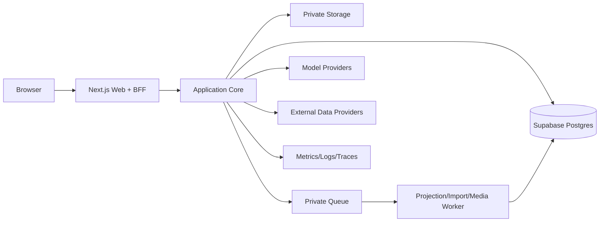
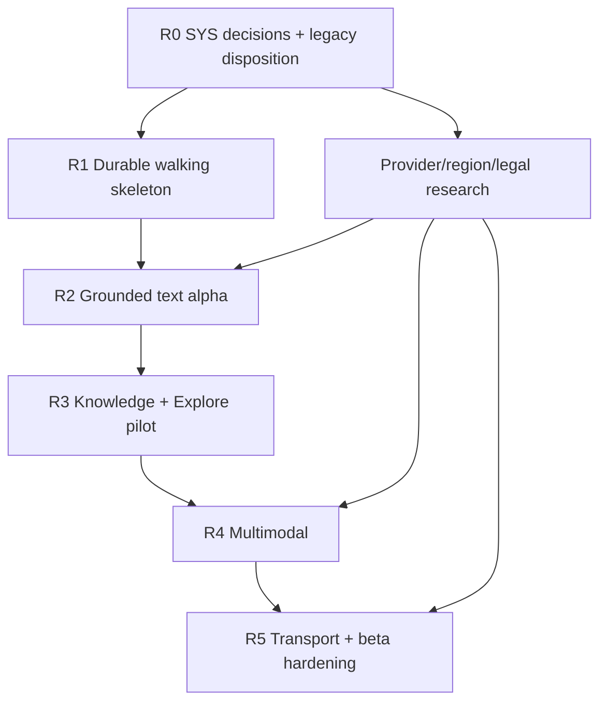

# VisePanda AI Core 软件工程开发、交付与验收报告

- 文档版本：v1.1（第五轮深模块与验收优化）
- 日期：2026-08-23
- 状态：**System 级工程基线提案；待 operator 接受、ADR 与可执行 Issues 冻结**
- 总体研究：[ai-core-integrated-research-report.md](ai-core-integrated-research-report.md)
- 增量证据：[ai-core-deep-optimization-evidence-2026-08-23.md](research/ai-core-deep-optimization-evidence-2026-08-23.md)
- 独立审计：[ai-core-v1.1-independent-audit-2026-08-23.md](research/ai-core-v1.1-independent-audit-2026-08-23.md)
- 当前成熟度：**research/design ready；runtime not implemented；production not accepted**

---

## 0. 工程执行摘要

### 0.1 推荐架构

以当前 Next.js V4 为起点建设 **模块化单体**：

- Next.js App Router：页面、BFF、SSE；
- typed domain/application modules：Chat、Trip、Knowledge、Explore、External Data、Media；
- Supabase：Postgres、Auth、RLS、Storage、pgvector、private Queues；
- provider adapters：DeepSeek/Qwen 首发，Kimi/GLM eval-only；
- private async workers：import、projection、embedding、expiry、media cleanup；
- OpenTelemetry-compatible privacy-safe tracing；
- feature flags + environment promotion + rollback。

不恢复 VP-Final 的完整多-app monorepo，不立即拆微服务。只有 Ops/worker 出现独立部署、权限或容量证据时才抽离。

### 0.2 首个可验收闭环

第一条 tracer bullet 不是“Chat 页面能回答”，而是：

```text
一个 reviewed Fact fixture
 -> Chatbot 精确检索并引用
 -> 生成一个 TripProposal
 -> Canvas 展示 diff
 -> 用户确认
 -> versioned TripPatch transaction
 -> reload 后状态仍存在
 -> trace 可重建版本/attempt 决策且无 raw sensitive data
```

这不是 prompt/response 内容级重放。用户可见消息若另有明确 retention，可按 turn event 查看；通用 trace 只重建 route、versions、digests、outcomes 和成本。

这条闭环通过后，才接真实 provider、RAG、Explore 和外部数据。

### 0.3 总工期判断

工期使用情景而不是单一数字：

| Scenario | Focused engineering | Includes | Excludes |
| --- | ---: | --- | --- |
| Core private alpha | 10–15 weeks | durable Chat/Trip、Fact、text model、basic RAG | Explore production、voice、aviation |
| Two-city closed beta | 20–30 weeks | Explore、OCR/voice、weather/ticket import | aviation contract wait |
| Full planned beta | 24–35 weeks | one approved flight adapter + hardening | content/legal/account waiting |

估算适用于单人 + AI 辅助、WIP=1–2。它不是日历承诺，也不包含城市研究、人工审核、商务/法务、媒体采购和 native app。

---

## 1. G0：目标、范围、反目标与成功

### 1.1 Objective `r`

交付一个可持久、可追溯、可降级的 VisePanda 核心：五语 Chatbot 使用合法证据回答和提案；Trip Canvas 由用户确认后确定性写入；Explore/RAG/外部数据/多模态共享同一权限与事实边界。

### 1.2 Observation `y`

当前只有 frontend landing。现有 `pnpm check` 能验证静态站，但没有业务契约、数据库、provider、eval、RLS、浏览器 product flow 或 production observation。

### 1.3 Deviation `e`

缺少系统 contract 和 runtime，属于跨模块 D2 设计偏差；production region/retention/合同属于 operator D3 决策。不能用一个 provider SDK PR 局部修复。

### 1.4 Scope

- Chat turn、SSE、模型 router/adapters；
- versioned Trip/Proposal/Patch；
- Knowledge/Fact/import/review/RAG；
- Explore city/POI projection；
- Evidence/External Data/transport import；
- OCR translation、push-to-talk translation；
- Auth/RLS/audit/observability/feature flags；
- tests/evals/runbooks/deployment gates。

### 1.5 Anti-goals

- 购票、预订、支付、库存；
- 12306 crawler；
- autonomous general agent；
- 四模型 ensemble；
- nationwide POI/SEO launch；
- microservices-first；
- unreviewed bulk copy of legacy runtime；reuse accepted contracts/tests through disposition matrix；
- 未接受 ADR 前公开 capability promise。

### 1.6 Material assumptions

- Web/PWA 为首发；原生移动端另立项目；
- Supabase 与 Vercel/Next.js 仍是 operator 倾向，但账号/region 未冻结；
- 用户拥有 DeepSeek、Qwen、Kimi、GLM API access，但具体模型权限与合同待实测；
- 首发五语为 zh/en/es/ru/ar；
- 一个普通城市 + 一个热门城市可作为内容 pilot；
- no ticket purchase 仍是 accepted boundary。

---

## 2. G1：架构边界

### 2.1 Context architecture



### 2.2 Quality attributes

| Attribute | Design response | Acceptance signal |
| --- | --- | --- |
| Integrity | immutable Proposal、CAS Trip version、typed claims | 0 unauthorized/invalid writes |
| Provenance | EvidenceReceipt + shared eligibility | citation/receipt precision 100% |
| Privacy | data classes、least privilege、no raw traces | negative tests + deletion receipt |
| Availability | bounded fallback、degraded cards、flags | visible failure, error budget |
| Evolvability | task/model seam、projection rebuild、ADR | consumer contracts survive adapter change |
| Operability | trace、queue visibility、runbooks | incident can be diagnosed/rolled back |
| Accessibility | five locales、RTL、keyboard、audio/text parity | L5 browser/device evidence |
| Cost control | task budgets、accepted-turn accounting | p95 cost + circuit/quotas |

### 2.3 Deep modules and interfaces

模块应隐藏复杂度，调用者只学习小接口。不要为每张表创建一个浅 repository/service/controller 三层转发链。

| Module / seam | Small external interface | Deep implementation hidden | Must not own |
| --- | --- | --- | --- |
| `TurnCoordinator` | `start/observe/get/cancel` | intent、retrieval、model routing、validation、durable events、resume | Trip write、provider types |
| `TripWorkspace` | `get/createProposal/confirmAndApply/applyUserEdit` | immutable revision、CAS、Patch、transaction、audit | free-form model output |
| `KnowledgeSystem` | `resolveEvidence/explore/prepareImport/commitImport/reviewAndPublish` | identity、Fact、eligibility、curation、retrieval/projection | live provider truth、Trip state |
| `ExternalEvidenceResolver` | `resolve(closed DataNeed union)` | provider/policy/cache/TTL/attribution | Fact promotion、Trip mutation |
| `BatchTranslation` | `translateImage/translateAudioClip` | upload、classification、OCR/ASR/MT/TTS、TTL、cleanup | realtime session、durable raw media |
| `RealtimeTranslation` | `open/observe/finish/cancel` | WebRTC/WS signaling、partial/final、reconnect、expiry | Trip/Fact persistence |
| `ModelGateway` seam | `invoke(taskRequest, signal)` | provider adapters、route、repair、fallback、usage/cost | business writes/permissions |
| `JobExecutor` seam | `enqueue(jobSpec)` | one inline fake + one production queue adapter | business truth |
| `OperationalRecorder` seam | `record(allowlistedEvent)` | trace/metric/log sinks | raw content、blocking business commit |
| `ActorResolver` seam | `resolve(request)` | session verification | resource authorization god logic |

每个 production adapter 至少有一个 deterministic fake/contract adapter，形成真实 seam。只有一个实现且没有替换需求的内部逻辑保持私有，不增加 hypothetical port。

Knowledge 的 import、review、publication 与 eligibility 属于同一事务所有者；不能拆成两个互相跨事务调用的浅模块。Explore 是 Knowledge 的公开 read interface，不拥有第二套 POI/Fact。

Batch 与 Realtime 的调用顺序、错误和生命周期不同，是真实 seam。两者共享 TranslationRevision/Evidence/Policy types，但不强行共享一个 request/response method。

Canonical interface sketches：

```ts
interface TurnCoordinator {
  start(actor: Actor, command: StartTurn): Promise<StartTurnOutcome>;
  observe(actor: Actor, turnId: TurnId, afterSeq?: number): AsyncIterable<ValidatedTurnEvent>;
  get(actor: Actor, turnId: TurnId): Promise<TurnSnapshot | null>;
  cancel(actor: Actor, turnId: TurnId): Promise<CancelOutcome>;
}

interface ModelGateway {
  invoke(request: ModelTaskRequest, signal: AbortSignal): Promise<ModelAttemptOutcome>;
}

interface TripWorkspace {
  get(actor: Actor, tripId: TripId): Promise<TripSnapshot | null>;
  createProposal(actor: Actor, command: CreateProposal): Promise<CreateProposalOutcome>;
  confirmAndApplyProposal(actor: Actor, command: ConfirmProposal): Promise<ApplyOutcome>;
  applyUserEdit(actor: Actor, command: ApplyUserEdit): Promise<ApplyOutcome>;
}
```

`ApplyOutcome` 是 closed union：`applied/already_applied/version_conflict/proposal_expired/proposal_rejected/not_found_or_forbidden/invalid_patch/idempotency_key_reuse`。调用者不解析异常字符串。

`ModelAttemptOutcome` 的 validated 仅指 provider protocol、transport 和 requested schema。GroundedClaim、citation、eligibility、domain 与产品 safety validation 仍由 TurnCoordinator/KnowledgeSystem 拥有，ModelGateway 不获得 truth authority。

```ts
interface KnowledgeSystem {
  resolveEvidence(query: EvidenceQuery): Promise<EvidenceResolution>;
  explore(query: ExploreQuery): Promise<ExploreResult>;
  prepareImport(actor: OpsActor, manifest: ImportManifest): Promise<ImportDryRun>;
  commitImport(actor: OpsActor, command: CommitImport): Promise<ImportOutcome>;
  reviewAndPublish(actor: ReviewerActor, command: ReviewChangeSet): Promise<PublishOutcome>;
}

interface ExternalEvidenceResolver {
  resolve(actor: Actor, need: WeatherNeed | FlightNeed | RailNeed): Promise<ObservationOutcome>;
}

interface BatchTranslation {
  translateImage(actor: Actor, task: ImageTranslationTask, signal: AbortSignal): Promise<TranslationOutcome>;
  translateAudioClip(actor: Actor, task: AudioClipTranslationTask, signal: AbortSignal): Promise<TranslationOutcome>;
}

interface RealtimeTranslation {
  open(actor: Actor, command: OpenTranslationSession): Promise<SessionOpened>;
  observe(actor: Actor, sessionId: SessionId, afterSeq?: number): AsyncIterable<TranslationEvent>;
  finish(actor: Actor, sessionId: SessionId): Promise<FinalTranslationOutcome>;
  cancel(actor: Actor, sessionId: SessionId): Promise<CancelOutcome>;
}
```

`DataNeed` 是 closed union，不以 `Record<string, unknown>` 建万能路由。每个 need 冻结 freshness、policy、attribution、degraded result 和 allowed persistence。

### 2.4 Architecture decision threshold

以下变化必须 ADR：Trip state machine、public eligibility、RLS/role model、data region/retention、provider portfolio、POI category、external licence policy、deployment topology、payment/booking boundary。

---

## 3. 推荐仓库结构

首发保持单仓库、单 Next application；按 domain seam 组织，而不是按“前端/后端杂物”堆放：

```text
app/
  (public)/
  (product)/chat/
  (product)/trips/[tripId]/
  explore/
  [city]/[poi]/
  api/chat/route.ts
  api/trips/.../route.ts
  api/media/.../route.ts
components/
  chat/
  canvas/
  explore/
  translate/
lib/
  server/
    turn/contract.ts
    turn/...
    model-gateway/contract.ts
    trip/contract.ts
    knowledge/contract.ts
    external-evidence/contract.ts
    media-translation/contract.ts
    identity/
    observability/
  i18n.ts
supabase/
  migrations/
  seed.sql
  functions/
tests/
  unit/
  contract/
  integration/
  security/
  e2e/
evals/
  fixtures/
  qrels/
  runners/
docs/
  adr/
  contracts/
  runbooks/
  research/
scripts/
```

Rules：

- routes 只做 auth/parse/application-call/response；
- React/browser state 只在显式 client components；
- domain schema 和纯函数不依赖 Next/Supabase/provider SDK；
- server modules 不从 components 导入；
- provider response 先转内部 result，再进入业务；
- R1/R2 不部署 Ops UI；首次真实 import/review 时建立独立受保护 Ops deploy，不能把高权限 secret 放进 public Web project；
- 只有出现第二个真实 runtime consumer 后再抽 `packages/domain`，避免重建旧 monorepo。

当 Ops 成为第二个真实 runtime consumer 时，允许最小演进为 `apps/web + apps/ops + packages/core`。这是基于权限/部署的真实 seam，不是恢复 VP-Final 全部 monorepo。

### 3.1 VP-Final disposition matrix

| Legacy asset | Decision | Reason |
| --- | --- | --- |
| TripPatch schema/apply tests | reuse golden contract/tests | accepted deterministic invariant |
| owner-aware version CAS/events | port behavior, reassess implementation | proven concurrency/audit shape |
| Fact evidence/review/expiry | reuse contract and negative fixtures | core provenance invariant |
| draft-only import/idempotency/conflict | port behavior | proven safety value |
| RLS pgTAP actor tests | reuse patterns/fixtures | negative permission evidence |
| model router implementation | rewrite behind ModelGateway | provider/task contracts changed |
| model-generated direct patch application | reject | violates Proposal confirmation |
| old Explore/static SEO mapping | rewrite | not same projection/source of truth |
| four-app/turbo structure | retire as default | premature for current V4 |

“不复制 legacy runtime”不等于丢弃已验证合同。任何复用都以当前 code/test inspection 和新 interface acceptance 为准。

---

## 4. 冻结接口基线

每个接口需要 owner/input/output/error/idempotency/permission/version/consumer：

| Interface | Owner | Input/output | Failure | Idempotency/version | Permission/consumer |
| --- | --- | --- | --- | --- | --- |
| `Start/Observe/Get/CancelTurn` | TurnCoordinator | message、locale、Trip/media refs -> validated ordered events | auth/rate/scope/model/data | turn id + event sequence | owner / Chat UI |
| `InvokeModelTask` | ModelGateway | task/schema/evidence refs -> validated result/usage | timeout/429/protocol/schema/safety | attempt + route policy | Turn/Media only |
| `ResolveEvidence` | KnowledgeSystem | mode/scope/asOf/filters -> claims/evidence | ambiguity/no evidence/index lag | fact/index/eligibility version | Turn/Explore/Proposal |
| `ResolveExternalEvidence` | ExternalEvidenceResolver | closed need -> policy-stamped observation/card claim | blocked/coverage/stale | provider receipt/expiry | Turn/cards/proposal |
| `CreateProposal` | TripWorkspace | origin + base version + changes + EvidenceReceipts | stale/invalid/unauthorized | proposal/revision/base version | owner/Chat/Explore |
| `ConfirmAndApplyProposal` | TripWorkspace | exact pending revision + selection + idempotency | conflict/expired/invalid/forbidden | key+digest + one transaction | owner/Canvas |
| `Prepare/CommitImport` | KnowledgeSystem | manifest + rows -> dry-run/candidates | schema/licence/conflict | batch/source/hash | Ops author |
| `ReviewAndPublish` | KnowledgeSystem | typed Change Set -> atomic outcome/rebase | stale/no evidence/audit | expected versions | independent reviewer |
| `Explore` | KnowledgeSystem | city/category/facets/sort -> eligible projection | city not ready/lag | projection+eligibility version | public/client |
| `TranslateImage/AudioClip` | BatchTranslation | private object ref + task | invalid/sensitive/provider fail | content hash/revision + TTL | owner/server |
| `Open/Observe/Finish/CancelTranslation` | RealtimeTranslation | locale pair + signaling/session refs -> normalized events | auth/expiry/disconnect/provider | session id + event sequence | owner/client |

所有 contract 先以 schema fixture + consumer test 冻结；provider SDK 不得反向定义 domain schema。

Cross-cutting value rules：time 使用 ISO instant + IANA timezone + source local representation；跨夜区间显式 start/end date。Money 使用 currency + integer minor unit/precision，不用浮点。

Arabic mixed-direction text 保留 logical order，并对 POI 中文名、数字、标点和链接做 bidi UI tests。

### 4.1 Common failure taxonomy

模块不向 UI 暴露 provider 原始错误。统一 closed taxonomy：

```text
UNAUTHENTICATED / FORBIDDEN / RATE_LIMITED
INVALID_INPUT / UNSUPPORTED_MEDIA / AMBIGUOUS_SCOPE
NO_ELIGIBLE_EVIDENCE / DATA_POLICY_BLOCKED / DATA_EXPIRED
PROVIDER_UNAVAILABLE / TIMEOUT_BEFORE_OUTPUT / TIMEOUT_AFTER_OUTPUT
MODEL_OUTPUT_INVALID / SAFETY_BLOCKED / BUDGET_EXHAUSTED / CANCELLED
STALE_TRIP_VERSION / PROPOSAL_NOT_CONFIRMABLE / IDEMPOTENCY_KEY_REUSE
PROJECTION_LAG / INTERNAL_ERROR
```

每个 code 冻结 HTTP/SSE mapping、用户 copy、retryability、metric label 和是否允许 fallback。`SAFETY_BLOCKED`、`DATA_POLICY_BLOCKED` 不得通过换 provider 重试。

### 4.2 Turn stream state machine

```text
accepted -> planning -> retrieving -> generating -> validating
  -> completed | proposal_ready | unavailable | failed | cancelled
```

- 每个 event 带 `turnId/eventId/sequence/schemaVersion`；
- 状态只能单调前进，terminal 后不再发业务事件；
- 断线重连按 `Last-Event-ID` 或 after-sequence replay 已持久事件；
- 重连不能重新执行模型或工具；
- cancel/HTTP abort 传播到 retrieval/provider；terminal cancel 后停止新成本，已提交的独立事务不回滚伪装；
- 同 idempotency key + 同 digest 返回原 turn；不同 digest 返回 409；
- 未验证 JSON 不按 token 流给 Canvas，proposal 只以完整事件发布。

R1/R2 所有模型内容一律 buffered。SSE 只流 `accepted/phase/evidence progress`，验证后一次发送完整 answer/card/proposal；禁止公开 `provider_token_delta`。

未来若要增量正文，必须另立 interface/ADR，只允许可独立验证的完整 segment，并冻结 lane classifier、content schema 和 adversarial tests。后置 validator 永远不能撤回已展示内容。

### 4.3 Proposal lifecycle

```text
ProposalDraft(building, not confirmable)
 -> TripProposal(pending, immutable revision)
 -> applied | rejected | expired | conflicted | superseded
```

用户编辑、逐项选择、rebase 和后台日详情都创建新 revision/child proposal。确认事务锁定 current Trip，比较 `baseTripVersion`，写 snapshot/event/receipts 后一起提交。R1 不写 queue；未来有消费者时才在同一事务发送 domain event。

对外没有“confirm 成功、稍后 apply”两步。`confirmAndApplyProposal` 在同一事务验证 actor/status/expiry/revision/baseTripVersion，执行 CAS，写 Trip snapshot、append-only event、proposal outcome 和最小 audit。任何一步失败都不留下 confirmed-but-not-applied。

```text
BEGIN
  lock proposal; verify actor/status/expiry/revision
  insert idempotency key + request digest
  CAS update trip where head_version = base_trip_version
  insert unique trip_event(trip_id, resulting_version)
  mark exact proposal revision applied
  append PII-minimized audit
COMMIT
```

同 key/同 digest 返回首次结果；同 key/不同 digest 返回 conflict。CAS 失败全部回滚，不自动 rebase AI proposal。数据库 fault injection 必须覆盖每个写点。

### 4.4 Evidence and claim interface

Proposal 与 ExecutionCard 不只保存 `factIds`，而保存判别联合 `EvidenceReceipt`：Fact version、Observation policy/expiry 或 User Artifact confirmation。

关键执行值用 typed `GroundedClaim`。LLM 只解释，地址/时间/金额/支付/入场/航班/Safe Phrase 由确定性 renderer 输出，避免字符串 supporting-value 比对的假安全。

---

## 5. 数据架构

### 5.1 Schema groups

```text
identity: profiles, memberships, sessions/audit refs
turn: threads, turns, turn_events, model_attempts
trip: trips, trip_events, trip_proposals
knowledge: pois, poi_aliases, facts, fact_sources, fact_reviews, guides
content: import_batches, import_rows, poi_candidates, change_sets
retrieval: retrieval_units, embeddings, index_versions
explore: collections, collection_items, featured_placements, city_readiness
external: provider_policies, source_policies, observations, external_refs
media: media_objects, media_jobs, deletion_receipts
ops: audit_events, knowledge_gaps, incident/override records
```

首发避免 `trip_versions + proposal_receipts` 等重复表。当前 Trip snapshot、append-only Trip event 和 applied proposal 的唯一约束已经能承载版本/receipt；只有查询或保留证据证明需要时再拆。

`embeddings` 至少记录 model/deployment/region/dimension/textType/contentHash/indexVersion；`media_objects` 与 provider file reference 分开记录各自 TTL、expiresAt、delete status/receipt。不能用内部对象已删推断 provider file 已删。

`provider_policies/source_policies` 实现 external plan §2.3 的 purpose-bound schema。它覆盖 contract/effective version、trial/public display/purge status/evidence、raw/derived retention、derivative/share-alike 和 combine/backfill。

规则还区分 LLM inference 与 model training，并绑定 display-without-map、author/disclosure attribution、redistribution、field/surface/transformation/region/user class。每次决定都产生 PolicyReceipt。

### 5.2 Write model and projections

Canonical POI/Fact/Trip are write models。Retrieval、Explore、SEO 为 projection，可删除重建。Projection worker 只读 eligible source，不能自行晋级 Draft。

### 5.3 Consistency and transaction matrix

| Operation | Consistency/transaction | Projection behavior |
| --- | --- | --- |
| confirm Proposal | row lock/CAS + one DB transaction | optional pgmq domain event in same transaction |
| publish Fact Change Set | expected versions + atomic all-or-nothing | old unit invalid immediately; rebuild async |
| import Candidates | batch transaction + row audit | no public projection |
| write Observation cache | provider receipt + TTL | request/query hard expiry |
| rebuild retrieval | eventual, versioned index | switch index version atomically |
| rebuild Explore | eventual | expose projection version/readiness |
| delete media/user data | durable deletion job + receipt | derived projections invalidated |

Trip confirmation and Fact publication require strong integrity。Retrieval/Explore 可最终一致，但 query 仍 join current source eligibility，不能在延迟窗口返回 revoked/expired truth。

Knowledge publication 事务同时验证 reviewer != author、每个 expected Fact/POI version、evidence/policy、Change Set 全量，然后写 Fact versions、reviews、audit 和 eligibility queue event。任一 stale/audit/queue 写失败全部回滚并返回 rebase projection。

### 5.4 Migration policy

- append-only migration；
- local -> preview -> staging -> production；
- expand/migrate/contract，避免同一发布破坏消费者；
- expand/contract + old-app compatibility window + roll-forward/PITR rehearsal + data postcondition；只有明确可逆 migration 才运行 down rollback；
- new exposed table 明确 GRANT + RLS；
- view 使用 `security_invoker=true` 或 private schema；
- extension 不 pin version，记录 installed version；
- Supabase Preview skipped 不算通过。

### 5.5 Queue and optional outbox

使用 private Supabase Queue/`pgmq` 处理 embedding、projection、expiry、media deletion；消息至少包含 event id、entity id/version、job kind、attempt、notBefore、trace id。消费者必须幂等，成功后 archive/delete。

Supabase Queues/pgmq 不自动提供满足本产品语义的 DLQ。VisePanda 必须实现 retry count、visibility timeout、max-attempt transition、失败 archive/dead-letter table 和 Ops replay；不能把“消息仍在队列”误当可运维失败处理。

业务 consumer 一律按 at-least-once 设计。Idempotency 至少覆盖 `jobKind/entityId/entityVersion/targetVersion/contentHash`；embedding 还包含 model/region/dimension/textType/indexVersion。不依赖 FIFO；lease 大于正常 p99；crash、expiry、重复和旧 payload 都要测试。

R1 没有异步需求时不引入 queue。首次需要 projection/embedding 时，如果 `pgmq.send` 与业务写在同一 Postgres transaction，就直接把它作为 durable domain-event queue，不再叠加 outbox 或第二队列。

只有未来向 Postgres 之外的 broker 发布且无法同事务时，才引入 outbox。官方 automatic embeddings 可作 spike 参考，但 worker 不使用通用 `SECURITY DEFINER` 绕过权限。[Supabase Automatic Embeddings](https://supabase.com/docs/guides/ai/automatic-embeddings)

### 5.6 Data classification and retention

| Class | Example | Default persistence | Model/provider rule |
| --- | --- | --- | --- |
| C0 public | reviewed public Fact | durable by policy | only if licence allows |
| C1 account | locale、explicit preferences | durable until delete | minimal context only |
| C2 trip-sensitive | itinerary、precise location | owner-scoped | approved region/task only |
| C3 highly sensitive | passport、ticket QR、medical/payment image、voice | shortest TTL/usually none | deny until explicit policy |
| C4 secret | API keys、cookies、OTP | secret store only | never model/log/database content |

DeepSeek Files API omitting `expires_after` keeps a file permanently。Adapter must require explicit TTL, issue DELETE, and write a content-free deletion receipt; “省略参数”必须在 conformance test 中失败。

### 5.7 Backup and recovery

- define beta RPO/RTO only after plan/region selection；
- rehearse database restore、roll-forward/PITR and compensation separately；only explicitly reversible migrations may test a down path；
- Supabase database backups do not include Storage objects；media需要独立 S3-compatible backup or deliberate no-backup TTL policy；
- encrypted off-site backup must respect deletion/retention policy；
- restore test verifies RLS/grants/functions/queues/secrets and object metadata-to-file consistency；
- ephemeral media should not become permanent merely because backup is easier。

[Supabase Backups](https://supabase.com/docs/guides/platform/backups) explicitly excludes Storage objects from database backups.

---

## 6. AI implementation architecture

### 6.1 Internal model registry

Registry 记录：provider、deployment operator、API model id、observed version、release stage、protocol、region、modalities、thinking、schema profile、tool support、max input/output、timeouts、rate/cost snapshot、allowed data classes、status/flag。

`deepseek-v4-flash` 与 `deepseek-v4-flash-vision-exp` 必须是两行；客户端不得从名字推导 modalities。

Flash-0731 标 `public_beta`，Pro-0813 标 `ga`，Vision Exp 标 `experimental`。普通 DeepSeek task 显式 `thinking=disabled`；DeepSeek strict tool 标 `beta endpoint`，不能伪装为通用 strict JSON Schema。

### 6.2 AI SDK decision

建议在 `ML-01` spike 中评估 Vercel AI SDK `streamText` + OpenAI-compatible provider，目标是减少 SSE/tool boilerplate；但采用条件是：

- DeepSeek/Qwen text、vision、strict tool、abort、usage 与 error conformance 通过；
- provider-specific metadata 不丢；
- internal contracts 不暴露 AI SDK message type；
- 无需为兼容库削弱 schema/validator；
- package 版本 pin + lockfile + bundle/latency 评估。

若不通过，保留薄 HTTP adapters。AI SDK 是 adapter 实现选择，不是系统真理层。

若启用 AI SDK experimental telemetry，必须显式 `recordInputs:false`、`recordOutputs:false`。官方当前说明：telemetry 总开关默认关闭，但一旦启用，input/output recording 默认开启；不能依赖默认值保护 Trip、evidence 或 media。[AI SDK Telemetry](https://ai-sdk.dev/docs/ai-sdk-core/telemetry)

AI SDK conformance 只覆盖 Chat plane。`providers/` 内部分为 chat、ocr、translation、embedding、rerank、speech 和 realtime adapters；业务共享的是 Task/Evidence/Policy interface，不是一个万能 `generate()`。

### 6.3 Prompt/version policy

- stable system/tool/schema prefix；
- variable Trip/evidence/message 后置；
- prompt、schema、route policy、safe phrase 均版本化；
- external text 标记为 untrusted data；
- 不记录 reasoning content；
- model alias 漂移触发 conformance/eval，不自动晋级。

### 6.4 Baseline/challenger release

每个 TaskProfile 维护一个 baseline。Challenger 顺序为 offline paired eval -> shadow -> 1% canary -> fixed observation -> promote/rollback。

Promotion record 保存 eval version、最差语言、critical failures、p95 latency/cost、provider region/policy、model returned id 和异议。模型协议变化触发 adapter conformance；能力榜变化不自动触发生产切换。

---

## 7. Security and privacy engineering

### 7.1 Trust boundaries

```text
Browser untrusted
External provider/source untrusted
Model output untrusted
Ops authenticated but least-privileged
Domain validator trusted boundary
Database/RLS final authorization boundary
```

### 7.2 Required controls

- server-only environment keys；provider/environment separate；budget/IP/model scope；
- authn + owner authorization + RLS，不能只用 UI 隐藏；
- service role 仅 private server/worker，绝不浏览器；
- model tools 为 granular read/propose functions，不提供 arbitrary URL/SQL/write；
- CSP、rate limit、upload size/type/magic、malware/EXIF；
- SSRF protection for external image URLs；
- prompt injection fixtures；
- signed/private media URLs + TTL + delete receipts；
- audit for Fact review、Trip apply、policy override；
- dependency/secret scan；
- privacy deletion must cover Trip、media、derived text、trace refs and provider files where supported。

Route Handlers 与 Server Actions 都按公开 HTTP endpoint 处理：每次重新认证/授权、验证 client input，并保留 same-origin/CSRF 控制。不能因为函数只从某个 React 组件调用就假设不可访问。[Next.js Data Security](https://nextjs.org/docs/app/guides/data-security)

### 7.3 Threat-to-control matrix

| Threat | Primary control | Verification |
| --- | --- | --- |
| direct/indirect prompt injection | untrusted evidence envelope、tool allowlist | adversarial eval |
| excessive agency | read/propose tools only、user confirm | 0 direct writes |
| BOLA/IDOR | owner filters + RLS + negative users | cross-user tests |
| SSRF via image/source URL | URL allow/deny、DNS/IP/redirect checks | local metadata targets blocked |
| malicious/oversized upload | magic/type/size/decode limits、scan | fuzz/file fixtures |
| replay/double apply | idempotency digest + proposal CAS | duplicate/concurrent tests |
| data exfiltration by telemetry | no raw input/output、allowlist metadata | trace inspection |
| cost denial | per-user/task quota、deadline、max tool/model steps | load/abuse test |
| poisoned knowledge | candidate/draft isolation、human review | public leakage test |

### 7.4 Actor and database access model

Closed beta 默认 `authenticated-only`，除非 operator 另行接受匿名 durable identity/迁移 ADR。

| Actor | DB credential path | Authorization |
| --- | --- | --- |
| public visitor | publishable key / public projection | explicit grants + RLS/readiness |
| authenticated owner | verified user JWT | owner filter + RLS + module checks |
| content author | separate Ops deployment + JWT role | scoped author permissions |
| reviewer | separate Ops deployment + JWT role | reviewer != author + target scope |
| ops admin | separate Ops deployment | least privilege + audit |
| system worker | server secret/private RPC | explicit entity/version conditions + audit |

Secret/service credentials bypass RLS，只允许 background worker/private admin adapter。用户/Ops 请求不得用 service credential 再在应用层“模拟 RLS”。权限测试覆盖 public、owner、other-user、author、reviewer、ops、worker 的每个 table/RPC operation。

冻结三条 data adapter：

- `UserDataAdapter`：携带 verified user JWT 调用 `security invoker` Data API/RPC；
- `OpsDataAdapter`：独立 Ops deploy，携带 reviewer/author JWT 调用 role-scoped RPC；
- `SystemDataAdapter`：worker-only secret/private schema，显式 resource conditions + audit。

`confirmAndApplyProposal` 等多表事务默认由携带用户 JWT 的单一 Supabase RPC 完成，使 `auth.uid()`/RLS context 与数据库事务同时成立。禁止 BFF 用 service key 开高权限事务后仅靠 TypeScript owner check。

---

## 8. Environment, deployment and release

| Environment | Data/model behavior | Purpose |
| --- | --- | --- |
| local | synthetic fixtures、local DB、fake adapters | fast deterministic development |
| preview | isolated DB branch、synthetic provider fixtures、no prod keys | PR integration/UI |
| staging | scrubbed/synthetic corpus + low-budget real provider keys | conformance/L6 smoke |
| production | approved region/contracts/keys/data | controlled user traffic |

Required feature flags：

```text
CHAT_RUNTIME_ENABLED
TRIP_PERSISTENCE_ENABLED
MODEL_DEEPSEEK_TEXT_ENABLED
MODEL_DEEPSEEK_VISION_ENABLED
MODEL_QWEN_ENABLED
OCR_TRANSLATION_ENABLED
VOICE_TRANSLATION_ENABLED
EXTERNAL_DATA_ENABLED
FLIGHT_STATUS_ENABLED
KNOWLEDGE_IMPORT_ENABLED
RAG_RETRIEVAL_ENABLED
RAG_RERANK_ENABLED
EXPLORE_CITY_ENABLED
EXPLORE_ADD_TO_TRIP_ENABLED
CONTENT_AI_DRAFTS_ENABLED
```

Flags deny capability, not authorization；权限仍由 server/RLS 执行。

这是一份候选 registry，不在 R0 一次创建全部 flags。每个 release slice 只增加必要 flag，并登记 owner、default、dependencies、kill-switch result、observation 和 deletion date；CI 检查非法组合，避免布尔组合爆炸。

Release：contract PR -> module PR -> preview -> staging smoke -> shadow -> canary -> observation -> promote。任何新 provider/model 不能直接 100%。

### 8.1 Request path vs background path

| Path | Runtime | Deadline behavior |
| --- | --- | --- |
| Chat text/SSE | Next.js Node Route Handler | bounded turn deadline + abort |
| Proposal confirm | Next.js -> user-JWT Supabase RPC transaction | short, no model/provider call |
| Explore query | Server Component/BFF -> projection | cache/read deadline |
| import/embedding/projection | private queue worker | retry/quarantine, no browser wait |
| media OCR/translation | signed direct upload -> Storage -> queued/bounded job | explicit job state/cancel/TTL |
| voice streaming | WebRTC-first provider session after conformance spike | signaling/segment/final timeouts |

Vercel Functions 应部署靠近数据库；默认 region 不能被动接受。Chat streaming 不能占用后台作业预算，长 OCR/import 不能因为平台允许长函数就留在交互请求中。[Vercel Functions](https://vercel.com/docs/functions)

Owner/grounded queries default `no-store`。Explore public cache 只缓存 projection candidate IDs；返回前重新检查 authoritative eligibility。若缓存完整卡片，TTL 不超过 displayed Facts 最早 `expiresAt`，并绑定 Fact/eligibility tags 做 deprecate invalidation。

Vercel 当前 function request/response body limits 不适合作为原始图片/音频中继。Browser 使用短时 signed URL 直传 private Storage；BFF 只接收 object reference、digest 和任务声明。Voice 优先使用 provider-supported WebRTC，Next.js 只做授权/signaling，不转发整段媒体。

Qwen raw WebSocket handshake 需要长期 key，只允许 server relay；浏览器不得直连。可评测 AOQ temporary client token。WebRTC 由 BFF 代理 SDP 鉴权，browser只持有短时 session-scoped material；finish/cancel/expiry 必须撤销后续使用。

Transaction pooler 只供需要 direct Postgres 的 `SystemDataAdapter`/worker，不承载用户 JWT/RLS 事务；该模式禁用 prepared statements。Migration/pg_dump 使用 direct connection。三条连接路径在 `PLAT-CONF-00` 分别实测冻结。

### 8.2 Region decision record

Region ADR must jointly record：traveller latency、Supabase region、Vercel function region、DeepSeek/Qwen endpoint、static data storage、cross-border transfer、DPA/retention、failure fallback。不能为降低 100ms 延迟而把 C2/C3 数据送入未批准 region。

---

## 9. CI/CD and quality gates

### 9.1 Target scripts

在当前 `pnpm check` 基础上逐步形成：

```text
pnpm lint
pnpm typecheck
pnpm test:unit
pnpm test:contract
pnpm test:integration
pnpm test:security
pnpm test:e2e
pnpm evals
pnpm db:verify
pnpm docs:check
pnpm build
```

这些脚本在相应 Issue 实现前标 planned，不能把本报告当作已有 CI。

### 9.2 Test pyramid L1-L7

| Level | VisePanda evidence |
| --- | --- |
| L1 | schema/pure function/router/eligibility/patch unit tests、lint/type |
| L2 | Chat SSE、provider、Trip、Knowledge、External Data consumer contracts |
| L3 | Supabase migration/RLS/pooler/direct upload/storage/integration、build |
| L4 | AI/RAG eval、provider protocols、queue replay/poison、security、licence/retention、restore |
| L5 | desktop/390×844、five locales、Arabic RTL、camera/mic、WebRTC/WS、offline/degraded |
| L6 | staging real-provider smoke、queue/expiry/reindex、backup/restore sample |
| L7 | production SLI/error budget、content ops review、user correction/acceptance |

测试通过 deep module interface，不测试内部 adapter choreography。替换旧浅模块后，保留能证明行为的 contract/golden fixtures，删除重复内部实现测试。

### 9.3 Eval governance

每个 eval release 保存：corpus version、source/licence、scenario strata、language/risk labels、expected evidence/answer policy、grader version、model/prompt/schema/route version 和 raw result digest。

- synthetic/public fixtures first；真实用户样本必须去标识化并有授权；
- blind holdout 不参与 prompt 调优；
- 按六个执行时刻、五语、风险和 no-evidence 单独报告；
- human rubric 至少记录标注者和分歧，关键集采用双人复核；
- promotion 比较 paired deltas/置信区间，不用总平均或模型自评分；
- “红线 0”写成 named suite `N/N no observed violations` + runtime invariant，不宣称无限场景零风险。

`LEX-00` 建立中文/阿拉伯文重点 qrels，和 en/es/ru 一起比较 exact alias、`pg_trgm`、native FTS、PGroonga/char strategy、vector/RRF。Embedding conformance 区分 query/document `textType`，没有证据不启用 PGroonga。

### 9.4 CI cadence

| Cadence | Gates |
| --- | --- |
| PR | lint/type/unit/interface contracts/pgTAP/small deterministic eval/build/docs |
| nightly | full multilingual/RAG eval、provider conformance、dependency/security、queue scenarios |
| release candidate | real-provider smoke、E2E、RLS matrix、load、restore、accessibility/device |
| production | synthetic probe、queue/projection lag、error budget、content correction window |

---

## 10. Acceptance matrix

每个 release 必须逐维给证据：

| Dimension | Minimum release evidence |
| --- | --- |
| Functional | end-to-end acceptance scenarios, not only route 200 |
| Interface | schema snapshots + consumer contract + provider conformance |
| Data | migration compatibility/roll-forward/PITR、constraints、RLS、idempotency、projection rebuild |
| Security | authz/RLS negative tests、secret scan、prompt injection/upload abuse |
| Performance | task/region/device p50/p95/p99 and queue throughput |
| UX | real browser/mobile/five-language/RTL/accessibility evidence |
| Observable | trace/metric/log lookup, alert owner/cadence |
| Compliance | provider/license/retention/attribution/privacy review |

### 10.1 Hard gates

以下“0”表示所有 named deterministic suites 中观测为 0，且生产路径有 fail-closed invariant；不是对无限未知场景的零风险保证。

- unauthorized or unconfirmed Trip writes: 0；
- cross-user/private/draft/expired leakage: 0；
- invalid Patch reaches writer: 0；
- unsupported high-risk claim: 0；
- wrong citation/fact receipt: 0；
- prohibited display/cache/persist/prompt/embed/translate/TTS: 0；
- sensitive raw media/secrets in general logs: 0；
- candidate or importer row public: 0；
- expired Explore capability badge: 0。

### 10.2 Proposed quality/performance targets

以下必须经 baseline/operator 接受：

| SLI | Proposed beta target |
| --- | --- |
| Trip skeleton first-pass structural validity | >=99%；最终 invalid 必须 unavailable |
| RAG Recall@5 | >=95% on accepted qrels |
| RAG rank quality | MRR/nDCG reported by query mode, locale and risk; threshold after baseline |
| citation precision | 100% |
| no-evidence precision | >=95%，高风险 100% fail-closed |
| five-language retrieval gap | worst vs best <=5 percentage points |
| time-to-first-status p95 | <=0.8 s in target region |
| time-to-validated-answer p95 | <=8 s；正文 buffered，不使用 token TTFT |
| Trip skeleton p95 | <=10 s；day detail may be async |
| ASR final after release p95 | <=1.5 s |
| TTS first audio p95 | <=1.5 s |
| provider fallback | 0 fallback after output/safety/policy/side effect；per-error outcomes reported before rate target |
| model route availability | observation-only until sample/window supports an SLO |

OCR/ASR/TTS 质量用分语言 fixture：CER/WER、数字/金额/地址/专名 exactness、人工充分性/可懂度。具体阈值在 `EVAL-00` baseline 后冻结；发布前高风险 fixture 必须 0 静默错误。

所有 p95/p99 报告必须写 region、device、network、sample size、time window、warm/cold 和排除项。小 beta 不以虚假的高精度 availability 百分比放行。

---

## 11. Observability and operations

### 11.1 Trace contract

```text
turn/task/route_policy
provider/requested_model/returned_model/observed_version/region
prompt/schema/evidence/index/trip versions
timeout/retry/fallback/degraded reason
tokens/cache/cost snapshot/TTFT/latency/finish
parse/schema/domain/safety status
proposal/confirm/apply outcome
external provider/policy/freshness/attribution path
```

IDs 采用随机/哈希化标识；raw prompt/response/reasoning/media/GPS/ticket 不进通用 span。OTel GenAI mapping 版本化，内部 contract 不跟随实验 semantic convention 漂移。

### 11.2 Runbooks

发布前必须有：

- model provider outage/429/version drift；
- external data stale/license revoked；
- queue stuck/dead-letter；
- embedding full rebuild/model change；
- bad Fact emergency deprecate；
- Trip migration/restore；
- media deletion/privacy request；
- feature flag/canary rollback；
- key compromise/rotation；
- aviation status mismatch；
- Explore thin/expired page removal。

---

## 12. Development program and dependency graph



### 12.1 Work packages

| Phase | Focused time | Scope and exit |
| --- | ---: | --- |
| R0 decisions | 1–2 w | legacy disposition、Proposal/Turn/Evidence、actor/RLS、retention、new-vs-existing Supabase、Ops deployment ADRs |
| R1 durable skeleton | 5–7 w | local/CI Supabase、Trip CAS/events、atomic confirm/apply、Fact fixture、durable Turn + fake model、Canvas reload、RLS/fault tests |
| R2 grounded text | 4–6 w | DeepSeek/Qwen conformance、ModelGateway、LEX-00 exact/alias/pg_trgm/native FTS vs PGroonga、query/document embedding、vector/rerank、claims、staging smoke |
| R3 Knowledge + Explore | 5–7 w | licence registry、10–20 candidates、separate Ops deploy、review/publication、QUEUE-00 host/poll/concurrency/version/replay、projection、Ask/Add |
| R4 multimodal | 5–7 w | private media/TTL/delete、OCR->MT、ASR->MT->TTS vs LiveTranslate、REALTIME-00 authority/resume/credential expiry、vision shadow、device QA |
| R5 transport/beta | 4–7 w + observation | typed weather/ticket/flight observations、approved adapter or official handoff、security/load/restore/accessibility/canary |

R1 不接真实模型、pgvector、queue、外部数据或 Ops UI。每个 >5 focused-day phase 必须拆成不超过 3–5 天、拥有独立 acceptance 的 Issues。单人 WIP 上限 2，同一冻结 interface 只能一条实现 lane。

### 12.2 Release milestones

| Release | Demonstrable result | Exit gate |
| --- | --- | --- |
| R0 Architecture baseline | canonical contracts, actor/data/deployment decisions | operator + ADR acceptance |
| R1 Durable walking skeleton | fixture -> validated Turn -> immutable Proposal -> atomic confirm/apply -> reload/audit | L1–L3 + RLS/fault injection |
| R2 Grounded text alpha | real text providers + grounded answer/RAG baseline | L1–L6 internal |
| R3 Two-city product beta | curation + Explore + Chat/Canvas exact-ID loop | L1–L6 + content acceptance |
| R4 Multimodal beta | image and push-to-talk translation on devices | L1–L6 + five-language human eval |
| R5 Controlled production | transport if approved + runbooks/SLO/observation | L1–L7 |

---

## 13. Traceability matrix

| User outcome | Capability | Modules/contracts | Acceptance | Observation owner/cadence |
| --- | --- | --- | --- | --- |
| trustworthy answer | grounded Chat | Chat/Evidence/ModelResult | citation + no-evidence eval | AI owner weekly |
| safe trip change | Proposal/Canvas/Patch | TripProposal/ApplyTripPatch | 0 unconfirmed writes | product owner per release |
| translate image | OCR->MT | MediaJob/OCR segments | five-language OCR fixture/mobile | AI owner per model release |
| speak translation | ASR->MT->TTS | SpeechSession | WER/entities/latency/human test | product owner weekly beta |
| discover usable POI | Knowledge/Explore | Fact/ExploreQuery | filters/freshness/Ask/Add | content owner weekly |
| know flight journey | Transport/Observation | TransportSegment/DataNeed | coverage/freshness/rights | data owner daily beta |
| preserve privacy | RLS/media/trace | all permission contracts | negative/security/deletion | security owner per release |

同一人可以兼任 owner，但 owner 字段不能消失。

---

## 14. Risk register

| Risk | Severity | Early signal | Control/rollback |
| --- | --- | --- | --- |
| model alias silent drift | high | conformance/eval regression | snapshot/observed version, disable route |
| Vision Exp instability | medium/high | image 400/quality/cost spike | shadow only, flag off, Qwen OCR |
| direct Trip mutation | critical | patch without proposal receipt | writer rejects, audit, tests |
| candidate/draft leak | critical | public row/index mismatch | shared eligibility view, RLS, projection rebuild |
| cross-border sensitive media | critical | raw uploads sent to wrong region | media classification, region gate, disable |
| provider licence violation | critical | policy missing/expired | fail closed, purge, official action only |
| RAG hallucination | high | unsupported claim/citation mismatch | typed supporting validator, unavailable |
| queue/index lag | medium | projection version behind | clear stale vector, lexical fallback, alert |
| solo-founder overbuild | high | WIP/many unfinished modules | tracer bullet, WIP=1, no microservices |
| content quantity over quality | high | unreviewed coverage growth | 10–20 batch, no bulk approve |
| 12306 scraping | critical | crawler code/request pattern | prohibited scope, remove/disable |

---

## 15. Current acceptance report（本轮）

| Item | Status | Evidence/limit |
| --- | --- | --- |
| repository facts inspected | PASS | VP-V4 `2dec7b0`, VP-Final `b5ef081` |
| five-round research synthesis | PASS | master reports + 5 evidence ledgers + 2 independent audits |
| DeepSeek multimodal current fact | PASS | official 2026-08-21 Vision Exp docs/pricing/guide |
| architecture/contract proposal | PASS as proposal | pending operator/ADR, not accepted runtime |
| current landing lint/type/build/tests | PASS | fifth-round `pnpm check`: lint、typecheck、Next build、11/11 tests |
| Markdown links/JSON/diff | PASS | 21-file links、structure/fences、paragraph limit、`jq empty`、`git diff --check` |
| browser/mobile QA | NOT RUN | no UI/runtime change in this report task |
| Supabase migration/RLS | NOT IMPLEMENTED | no project/schema configured |
| paid provider conformance | NOT RUN | no key read or API cost incurred |
| Chatbot/Canvas/RAG/Explore/multimodal | NOT IMPLEMENTED | documents must not be treated as features |
| privacy/legal/provider contracts | NOT ACCEPTED | operator/legal action required |

**Current verdict:**

- Research/design artifact: independent audits applied；deterministic recheck passed；ready for operator decision；
- Runtime release: rejected / not implemented；
- Production acceptance: not eligible；
- Public capability claim: prohibited。

---

## 16. Release acceptance report template

```md
# Release Acceptance — <release/id/date>

## Scope and traceability
- Objective / Issue / ADR:
- Changed modules/contracts:
- Do-not-touch confirmed:
- Build SHA / migration head / config+flag version:
- Provider requested+returned model / region:

## Eight dimensions
- Functional: command/scenario/output/artifact
- Interface: contract/conformance result
- Data: migration/compatibility/restore/postconditions
- Security: authz/RLS/secret/injection/upload result
- Performance: environment/sample/p50/p95/p99
- UX: desktop/mobile/locales/RTL/accessibility evidence
- Observable: trace/metric/log/alert lookup
- Compliance: policy/licence/retention/attribution review

## Red lines
- named suite and sample count:
- unauthorized Trip writes:
- unsupported high-risk claims:
- private/draft/expired leaks:
- prohibited data use:

## Evidence ledger
- command / exit code / environment / timestamp / artifact path:

## Actor and fault matrices
- RLS actor x operation:
- disconnect/cancel/idempotency/concurrency:
- queue crash/duplicate/poison/version:

## Unrun checks and blockers
- ...

## Rollback
- flag/revert/migration/data purge:

## Observation window
- SLI/SLO, owner, cadence, start/end, error budget:

## Verdict
- research artifact: accepted / conditional / rejected
- runtime release: accepted / conditional / rejected / not eligible
- conditional acceptance expiry and known deviations:
```

---

## 17. Operator decisions and exact next action

Before coding, operator decides the master Decision Register, including new-vs-existing Supabase project, authenticated-only beta, Ops deployment, model/data region and retention. Then create `SYS-00`:

> Freeze Turn/Trip/Evidence/Knowledge/External/Media interfaces, actor/RLS paths, immutable Proposal semantics, validated SSE, shared eligibility, deployment/retention decisions, feature flags, acceptance matrix, and legacy disposition. No provider SDK or production data.

`SYS-00` accepted后进入 R1 durable walking skeleton。单人 WIP 不同时启动三条实现 lane；可以并行准备 fixture/研究，但首个 runtime milestone仍是 reviewed fixture 到 atomic confirm/apply/reload/audit 的完整 tracer bullet。

---

## 18. Rollback

本轮只增加/修改文档。若第五轮优化未被接受，可恢复两份主报告 v1.0、模型规划 v2.0，并删除第五轮增量证据；没有数据库、云资源、外部账户或 production 数据需要回滚。
