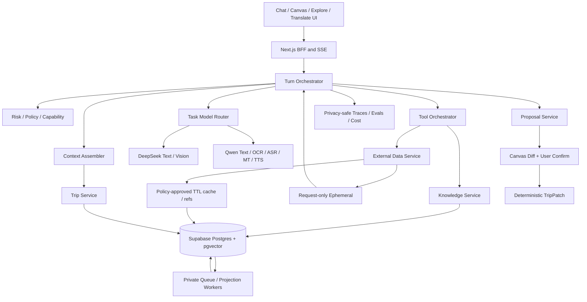

# VisePanda AI Chatbot、Trip Canvas、外部数据、知识库、RAG 与 Explore 整体研究报告

> 历史方案／2026-09-05 起退出当前执行入口。产品、分期、价格及任务队列以 [VPJ 总体规划](VISEPANDA-MASTER-PLAN-2026-09-05.md) 和 [VPJ Program](program/2026-09-05/README.md) 为准。下文保留历史证据；有效安全/数据合同继续沿对应ADR适用，不因方案归档而作废。

- 文档版本：v1.1（第五轮深度优化）
- 核验日期：2026-08-23
- 状态：**总体设计提案，待 operator 接受并通过 ADR/合同 Issue 冻结；不代表任何 AI 或数据能力已经上线**
- 当前仓库：`JTCAO515/VP-V4@2dec7b0`
- 历史参考：`JTCAO515/VP-Final@b5ef081`
- 软件工程配套：[ai-core-engineering-development-acceptance-report.md](ai-core-engineering-development-acceptance-report.md)
- 第四轮证据：[ai-core-system-evidence-2026-08-23.md](research/ai-core-system-evidence-2026-08-23.md)
- 第五轮增量证据：[ai-core-deep-optimization-evidence-2026-08-23.md](research/ai-core-deep-optimization-evidence-2026-08-23.md)

文档权威顺序：本报告负责产品/系统裁决；工程报告负责全局WBS、interfaces与验收；三份分项规划负责领域细节；research记录易变化事实；operator接受后的ADR/contracts才成为规范真理。

---

## 0. 最终总体裁决

### 0.1 产品不是“聊天框 + 行程表”

VisePanda 的产品定义是面向外国独立来华旅行者的 **AI planning and execution workspace**；用户体验承诺是一个在困难时刻提供下一动作的 **execution companion**。Chatbot 与 Trip Canvas 是两个合作核心，不是主从关系，也不是两个独立产品。

```text
旅行者表达目标、当前困难或现场信息
  -> Chatbot 识别执行场景和需要的数据
  -> Knowledge / External Data 提供可追溯证据
  -> 模型解释、比较并形成 Answer 或 TripProposal
  -> Trip Canvas 展示唯一当前 Trip 和待确认 diff
  -> 用户确认
  -> 确定性 TripPatch 应用并留下审计/重检信息
```

Chatbot 负责理解、解释和提案；Trip Canvas 负责可见状态、差异和确认；确定性应用服务拥有最终写入权。模型永远不能直接修改 Trip。

产品覆盖三个时间尺度：

| 时间尺度 | 用户任务 | Chatbot | Trip Canvas |
| --- | --- | --- | --- |
| 行前规划 | 形成路线、约束、节奏和准备项 | 澄清、检索、提案 | 展示和调整唯一 Trip |
| 到达前准备 | 支付、网络、入场、交通、语言准备 | 生成 source-backed readiness | 保存确认项与 recheck |
| 现场执行/恢复 | 翻译、出示、状态变化、失败恢复 | 给出下一动作或 unavailable | 标记变化、重新提案 |

第一批垂直能力仍受六个执行时刻约束：`Payment`、`Show to Local`、`Entry / Booking`、`Translate / Communicate`、`Network`、`Rescue / Human Help`。Explore、外部数据和知识库都必须说明自己支持哪个执行时刻。

| Moment | Required evidence | Structured delivery | Honest failure exit |
| --- | --- | --- | --- |
| Payment | payment instrument/conditions/current guidance | acceptance/fallback card | cash/official check/unavailable |
| Show to Local | reviewed Chinese name/address/entrance | display card + TTS | ask user/official map action |
| Entry / Booking | passport/booking/last-entry/channel | readiness + official action | no inventory claim/recheck |
| Translate / Communicate | OCR/ASR + reviewed safe language | source/translation/audio | correction/manual/Safe Phrase |
| Network | operator/official setup and failure facts | preparation/recovery steps | offline pack/official support |
| Rescue / Human Help | deterministic official/recovery paths | prioritized next action | emergency/official/human boundary |

### 0.2 一套核心系统，不是六个独立功能

| 表面功能 | 实际依赖的共同内核 |
| --- | --- |
| Chatbot | Turn Orchestrator、Model Router、Knowledge Search、External Data Router、Policy、Trace |
| Trip Canvas | versioned Trip、Proposal、Patch、Fact/Observation receipts、recheck |
| Explore | Canonical POI/Fact 的公开投影、城市路由、筛选、Ask/Add exact-ID action |
| RAG | 同一知识库的可重建 Retrieval Projection，不是第二真理源 |
| 图片/语音翻译 | Media intake、OCR/ASR、MT、TTS、隐私、可编辑原文、eval |
| 内容运营 | Candidate import、消歧、Fact Change Set、人工 review、失效与 projection rebuild |

如果分别开发六套数据和状态，最终一定出现“Chatbot 说一个地址、Explore 展示另一个、Canvas 保存第三个”的系统性错误。

### 0.3 暂定模型基线候选

当前最小候选组合是 **DeepSeek + Qwen 两家**，Kimi/GLM 留在离线评测。它不是已冻结 production portfolio；必须经过 `EVAL-00`、真实账号 conformance、region/DPA 与成本门后才可升级为正式决策。

| 任务 | 主候选 | 回退/对测 | 裁决 |
| --- | --- | --- | --- |
| 意图、普通问答、grounded answer | `deepseek-v4-flash` public beta，thinking off | `qwen3.7-plus-2026-05-26` | 待测：DeepSeek 速度/成本优势 |
| Trip skeleton/复杂结构 | `qwen3.7-plus-2026-05-26` strict | DeepSeek Pro strict beta / Kimi K3 offline | 待测：Qwen strict-schema 优势 |
| 日级小结构 | `deepseek-v4-flash` | `qwen3.7-plus` | 小 schema 后验证 |
| 图片 OCR | 北京候选 `qwen3.5-ocr` | DeepSeek Vision Exp shadow、region-approved OCR | region 未定前不冻结 |
| 通用视觉/POI 候选 | DeepSeek Vision Exp 与 Qwen Plus bake-off | 胜出者 canary | 可选能力允许实验路由 |
| 文本翻译 | `qwen-mt-flash` | 低延迟同族候选 | 不用通用 Chat 代替 MT |
| 语音翻译 | ASR -> MT -> TTS 可解释 baseline | Qwen3.5 LiveTranslate realtime challenger | 同一真机 fixture 决定 |
| TTS | 北京 Audio 3.0 / 新加坡 Qwen3-TTS candidates | 显式设备回退 | region + 五语真机验收 |
| 复杂离线 critique | DeepSeek V4 Pro GA | Qwen3.8 Max、Kimi K3、GLM-5.3 | 只找反例，不写 Trip |

DeepSeek 多模态的准确表述是：官方已上线独立实验路由 `deepseek-v4-flash-vision-exp`；基础 `deepseek-v4-flash` 仍是文本模型。[DeepSeek Vision Guide](https://api-docs.deepseek.com/guides/vision)

生命周期也必须准确：Flash-0731 当前是 public beta，Pro-0813 是 GA，Vision Exp 是 experimental。普通 Flash 路由显式关闭默认 thinking；DeepSeek strict tool 仍使用 beta endpoint/Schema 子集，不能写成与 Qwen strict 完全等价。

### 0.4 数据与内容总体裁决

- 外部 POI 是 **导入带来源的候选**，不是批量生成；
- Candidate/Draft 不能公开消费；expired/license-blocked 值不能支撑新 claim/Proposal。Canvas 只可保留历史 receipt 和用户决定并标 `recheck_required`；
- Explore、Chatbot、Canvas、SEO 共享 Canonical POI/Fact IDs 和 eligibility；
- RAG 采用 Postgres exact/alias/FTS/vector hybrid，不先购买第二个向量数据库；
- 航空 schedule/status 用 licensed provider benchmark，不做购买；
- 铁路不爬 12306，使用 Reviewed guidance、用户票据导入和官方 recheck；
- 所有 provider 先进入 Data License Registry，再决定 display/cache/persist/prompt/translate/TTS。

### 0.5 决策置信度与可逆性

| Decision | 当前置信度 | 主要证据 | 可逆路径 |
| --- | --- | --- | --- |
| Proposal -> confirm -> Patch | 高 | 旧 TripPatch、权限和产品不变量 | 只能由新 ADR 取代 |
| 两家生产 provider 起步 | 中高 | 任务分工、数据披露面、运营复杂度 | 单 task shadow 后增减 |
| DeepSeek Vision Exp 仅 challenger | 高 | 官方 experimental、图像缩放限制 | flag off / Qwen baseline |
| Supabase + modular monolith | 中高 | 当前规模、accepted stack、单人维护 | 模块 seam 后续抽离 |
| Postgres hybrid RAG | 中高 | structured facts + exact-first | 达性能门后增加 ANN/服务 |
| 一普通城 + 一热门城 pilot | 高 | 内容审核成本与事实质量门 | pilot 后按证据扩容 |
| 航空买数据、铁路不爬虫 | 高 | 官方 API/条款 | 合同或官方 API 变化再 ADR |

“高”不代表已实现或已通过真实账号测试，只代表当前证据足以支持可逆开发方向。

---

## 1. 当前事实、目标与偏差

### 1.1 当前事实

VP-V4 目前是 frontend-only Next.js 落地页。它没有真实 Chatbot、Trip Canvas state、数据库、登录、知识库、RAG、Explore、外部数据、模型调用、OCR、ASR、TTS 或 production telemetry。

VP-Final 提供了可复用的不变量，但不是可直接搬运的产品：TripPatch、versioned Trip、Knowledge Fact lifecycle、Content AI Change Set 和 model router 值得保留；旧 monorepo、静态 seed、耦合 importer 和分裂 Explore/SEO 不应整体复制。

### 1.2 目标

建立一个能够在五种界面语言 `zh/en/es/ru/ar` 下：

1. 诚实回答来华执行问题；
2. 使用 reviewed/current knowledge 和有权使用的 live data；
3. 生成可解释、可确认、可回滚的 Trip 变化；
4. 完成图片文字翻译及双向语音翻译；
5. 通过 Explore 发现城市/POI，并与 Chatbot/Canvas exact-ID 联动；
6. 在供应商失败、数据过期或证据不足时返回真实 degraded/unavailable。

### 1.3 最大偏差

现在的偏差不是“还差一个模型 SDK”，而是缺少统一领域合同、数据库资格门、真实 eval、权限、异步工作流、可观测和发布门。先接 API 会制造能说话但不可控的 demo。

### 1.4 成熟度矩阵

| Capability | Current | Target beta | 证据缺口 |
| --- | --- | --- | --- |
| Landing/i18n | implemented preview | product shell | product flow browser QA |
| Chatbot | planned | grounded streaming turns | provider/eval/persistence |
| Trip Canvas | visual concept only | versioned visible state | proposal/patch/database |
| Knowledge | historical reference only | reviewed scoped Facts | schema/RLS/Ops review |
| RAG | planned | exact-first hybrid | qrels/embedding/rerank |
| Explore | planned in V4 | city/POI projection | data/review/UI/SEO gate |
| OCR/voice | planned | five-language translation | real-device eval/privacy |
| External data | research only | weather/ticket/flight observations | contracts/adapters |

任何页面、schema 或 adapter 单独存在，都不能把这一行改成 production-ready。

---

## 2. 总体系统设计



总体设计原则：

- deterministic controller，不做自由循环通用 agent；
- task profile 选择模型，模型不能选择自己的权限；
- 写入操作与阅读/生成完全分离；
- external page、provider payload 和用户附件均视为不可信数据；
- 所有重要对象版本化；
- 所有 projection 可重建；
- 所有发布能力可 flag、可降级、可回滚。

### 2.1 四种真理与一致性

| Truth class | System of record | Consistency | Consumer rule |
| --- | --- | --- | --- |
| 用户决定 | versioned Trip/Proposal/Patch | 强一致、事务写入 | Canvas 展示唯一版本 |
| 已审核知识 | Canonical POI/Fact | publish 强一致；projection 最终一致 | query 时仍做 eligibility hard gate |
| 实时观察 | provider-stamped Observation | TTL/request-local | 过期即 unavailable/recheck |
| 模型输出 | Turn/Proposal draft | 非真理 | 必须验证、引用或等待确认 |

Embedding、Explore card、SEO page、模型回答和缓存都不是独立真理源。事实撤销后，消费者必须在 projection 延迟期间通过 source eligibility join 阻止旧值继续使用。

### 2.2 端到端控制闭环

```text
目标：旅行者完成一个规划或执行任务
 -> 输入：message + current Trip + explicit UI action
 -> 证据：eligible Fact / licensed Observation / user artifact
 -> 控制动作：Answer / ExecutionCard / TripProposal
 -> 用户观测：理解、接受、修改、拒绝、执行失败
 -> 系统反馈：trace / knowledge gap / recheck / new Issue
```

点击和模型 confidence 只能决定“下一步研究什么”，不能决定事实真假、自动排名或自动写 Trip。

Knowledge Gap 只保存去标识化 pattern、scope、count 和最后出现时间；低频独特问题、凭证、精确位置和原始 prompt 不进入 Ops。达到最小出现阈值并通过滥用过滤后才成为研究优先级。

### 2.3 Build / Buy / Defer

| Capability | Decision | Reason |
| --- | --- | --- |
| Chat/Trip/eligibility | Build | 产品核心不变量和差异化 |
| Provider transport | Adopt thin library or adapter | 避免协议样板，但保持内部 seam |
| Database/Auth/RLS/Storage | Buy Supabase, validate | 单人运维与 Postgres 能力 |
| Retrieval | Build on Postgres | 结构化过滤、权限和同库事实 |
| Foundation models | Buy | 不训练通用模型 |
| OCR/ASR/MT/TTS | Buy + evaluate | 专业能力、按任务可替换 |
| Aviation status | Buy licensed provider | 不自建全球航班数据 |
| Railway schedule crawler | Defer/prohibit | 12306 当前条款不允许 |
| Content review | Build minimal Ops workflow | 资格、证据和责任不能外包给模型 |

### 2.4 最终统一证据合同

三份分项规划的 `ReviewedFact`、Observation 和 proposal `factIds` 不足以表达完整来源。总报告统一为：

```ts
type EvidenceReceipt =
  | { kind: "fact"; factId: string; version: number; expiresAt: string }
  | { kind: "observation"; observationId: string; provider: string; policyId: string; expiresAt: string }
  | { kind: "user_artifact"; artifactId: string; version: number; confirmedAt: string };
```

`Fact` 只属于 Knowledge write model。外部官方材料先形成 Fact Draft，经人工 review 后成为同一种 Fact；不再建立一个竞争的 `External ReviewedFact` 真理模型。

`LiveObservation`、`EphemeralObservation`、`UserConfirmedArtifact` 和 `ExternalEntityRef` 保持独立生命周期。它们不能因被模型引用而自动晋级 Fact。

`ExternalEntityRef` 只用于解析/刷新，不单独证明业务 claim。需要统一携带时使用 `ContextRef = EvidenceReceipt | ExternalEntityRef`；GroundedClaim 的 supporting evidence 仍必须是前三种 receipt。

### 2.5 关键用户旅程

| Journey | Main sequence | Gate | Degraded outcome |
| --- | --- | --- | --- |
| New Trip | clarify -> skeleton draft -> immutable proposal -> confirm/apply | dates/domain/user confirm | save minimal trip/manual edit |
| Explore Add | exact POI ID -> readiness -> proposal -> Canvas | eligible projection/current version | user place/ref with unknowns |
| Ticket import | private upload -> OCR -> user correction/confirm -> artifact -> proposal | owner/TTL/no QR/ID leakage | manual segment entry |
| Flight change | live Observation -> diff card -> recheck proposal | policy/TTL/base version | official status link |
| Image/voice translation | media task -> final revision -> translation/audio | region/consent/final only | editable text/Safe Phrase |
| Knowledge correction | private report -> research/review -> Fact version -> invalidation | reviewer/evidence/audit | keep old unavailable |

---

## 3. Chatbot 运行协议

### 3.1 每轮固定阶段

```text
Authenticate / rate limit
 -> normalize locale, trip and attachment references
 -> risk/capability classification
 -> exact entity resolution
 -> DataNeed and KnowledgeQuery planning
 -> retrieve eligible evidence
 -> select TaskProfile and model route
 -> stream answer or build structured proposal
 -> citation/schema/domain/safety validation
 -> persist turn metadata and proposal
 -> user-visible success/degraded/unavailable
```

LLM 不能自由决定访问哪个 URL、调用哪家 provider、扩大检索城市、改变数据许可或执行 Trip 写入。

### 3.2 输出分为三类

- `Answer`：基于 evidence pack 的解释，不改 Trip；
- `TripProposal`：待确认的结构化变化；
- `ExecutionCard`：天气、航班、官方 action 等可确定性渲染内容，不必交给 LLM 改写。

服务端最终组合统一的 `AssistantTurn`：message、citations、cards、optional proposal、suggestions、availability。分项规划中缺少 `cards` 的旧类型由本定义取代。

### 3.3 稳定答案来自系统

“最好答案”不是四模型投票。质量来自：合格输入、精确 scope、当前 Trip、eligible evidence、任务级 prompt/schema、validator、诚实降级、真实用户反馈。模型换代不能修复缺证据或直接写入问题。

### 3.4 上下文与记忆分层

| Context | 保存内容 | 不保存/不自动推断 | Owner |
| --- | --- | --- | --- |
| request | 本轮 message、action、短证据包 | 完整历史重复注入 | Turn Orchestrator |
| conversation | 最近 turns + compacted summary/version | raw provider reasoning | Chat module |
| Trip | 用户确认的日期、地点、约束、receipts | 未确认模型建议 | Trip module |
| user preference | 用户明确保存的稳定偏好 | 从单轮行为推断敏感属性 | Profile module |
| knowledge | reviewed scoped Facts/Guides | conversation 私有内容 | Knowledge module |

Compaction 只压缩对话，不改变 Trip、Fact 或用户确认。摘要必须保留未解决问题、已确认决定和版本；无法验证摘要时重新从 source objects 装配。

### 3.5 明确不调用 LLM 的路径

- TripPatch 应用、版本比较与幂等；
- Fact eligibility、license/freshness、RLS；
- Safe Phrase exact lookup；
- Explore 默认筛选与排序；
- 航班/天气卡片的时间、状态和 attribution；
- 地址、金额、营业时间等 supporting-value validation；
- provider/model/modalities 资格判断。

这类路径用模型只会增加延迟、成本和不可解释失败。

### 3.6 统一失败体验

| Failure | Server decision | User experience | Retry |
| --- | --- | --- | --- |
| entity ambiguous | 不扩大 scope | 让用户选地点/城市 | user action |
| no eligible evidence | 不生成事实 | “尚未核验” + official action | after content review |
| provider blocked by policy | 不调用 provider/LLM | unavailable，解释数据限制 | no automatic retry |
| model/schema invalid | bounded repair/fallback | 延迟提示或 unavailable | at most policy limit |
| Trip version stale | 不应用 Patch | 显示变化并 rebase | new proposal |
| live data expired | 不显示 current | recheck required | explicit refresh |
| media sensitive/invalid | 不上传模型 | 本地提示/删除 | corrected input |
| database write unavailable | 禁止确认/修改 | Canvas read-only + retry later | no blind retry |
| text model unavailable | 不伪造回答 | Trip/Explore read + deterministic cards | bounded fallback |
| RAG/index unavailable | exact eligible lookup or unavailable | 不扩大到模型常识 | after recovery |
| queue/projection lag | authoritative eligibility wins | 旧 badge/value 不显示 | worker replay |
| external provider unavailable | Reviewed Fact/official action only | stale/unavailable disclosure | policy retry |

### 3.7 Streaming safety boundary

R1/R2 所有模型正文 buffered；SSE 只发送 accepted/phase/progress。完整 answer/card/proposal 通过 schema、domain、evidence 和 safety 后一次发布。

未来增量正文需要新 ADR，只能流可独立验证的完整 segment。POI、地址、时间、价格、路线、支付、入场、证件和预警保持 typed claim + deterministic rendering；后置 validator 不能撤回已展示内容。

---

## 4. Trip Canvas 联动

### 4.1 三个状态对象

- `TripState`：用户已接受的唯一当前行程；
- `TripProposal`：基于 `baseTripVersion` 的待确认变化；
- `TripPatch`：用户确认后由确定性服务应用的 operations。

### 4.2 Proposal 不可变规则

可确认 Proposal 必须是不可变 revision：

```ts
type TripProposal = {
  id: string;
  revision: number;
  origin: "chat" | "explore" | "user_edit" | "system_recheck";
  status: "pending" | "applied" | "rejected" | "expired" | "conflicted" | "superseded";
  tripId: string | null;
  baseTripVersion: number | null;
  changes: ProposalChange[];
  evidence: EvidenceReceipt[];
  modelRunId?: string;
};
```

后台生成使用不可确认的 `ProposalDraft(building)`。发布为 `pending` 后冻结；用户编辑、逐项选择或后台新增日详情都创建新 revision/child proposal，不能继续修改用户正在确认的对象。

每个 `ProposalChange` 绑定自己的 EvidenceReceipts 和 assumptions；proposal-level evidence 只是去重索引。用户选择部分 changes 时，服务端重新验证依赖并生成闭合 revision，不能确认一个破坏领域不变量的任意子集。

### 4.3 写入过程

```text
Chat/Explore action
 -> proposal with assumptions, evidence receipts and diff
 -> Canvas displays additions/deletions/moves/unknowns
 -> user accepts/rejects/edits
 -> revalidate baseTripVersion, POI and evidence freshness
 -> deterministic patch transaction
 -> append audit event
```

模型输出结构通过不等于可写。还必须经过 domain invariant、权限、版本、引用、freshness 和用户确认。

### 4.4 Canvas 保存与不保存

保存：Canonical POI ID、用户决定、Fact/version receipts、合法 ExternalEntityRef、recheckAt。

不保存：Imported Candidate、raw provider payload、整段 Guide、过期 live value、未确认建议、禁止持久化字段。

Fact/Observation 过期时，Canvas 保留用户已经确认的地点和决定，但把相关执行值标为 `recheck_required`。这不等于继续把过期值当 current，也不自动删除用户 Trip。

用户也可以保存尚未进入公共知识库的私有地点：

```ts
type TripPlaceRef =
  | { kind: "canonical"; poiId: string }
  | { kind: "user_place"; userPlaceId: string }
  | { kind: "unresolved"; label: string; cityId?: string };
```

`UserPlaceRef/UnresolvedPlaceRef` 只属于该用户 Trip，不进入 Explore、public RAG、SEO 或 reviewed coverage。后续匹配 Canonical POI 仍需用户确认，不能后台静默合并。

---

## 5. 模型层与多模型治理

### 5.1 Provider Adapter

所有模型经过统一内部接口，但不假设协议等价：

```text
task / provider / model / region
thinking / timeout / input modalities
messages / tools / output schema
usage / returned model / finish reason
provider metadata / errors
```

每个 adapter 必须通过：文本 streaming、vision、tool call、strict schema、usage、cache、timeout、429、5xx、content filter、returned model、abort 和 malformed stream conformance。

Vercel AI SDK 可用于 streaming 和 provider ergonomics，但 VisePanda 的 `TaskProfile`、contracts、validators 与 trace 不能依赖该库的内部类型；必要时可以替换 adapter 而不改领域层。[AI SDK provider architecture](https://ai-sdk.dev/docs/foundations/providers-and-models)

Registry 额外记录 `releaseStage/deploymentOperator/protocol/region/dataClasses`。模型名相同但 deployment、region 或协议不同，视为不同 conformance target。

Transport 分三条平面：

```text
Chat plane: AI SDK candidate + HTTP chat adapters
Specialized batch: OCR / MT / embedding / rerank / batch TTS
Realtime media: ASR / LiveTranslate / realtime TTS / WebRTC-WS state
```

AI SDK 只可能减少 Chat plane 样板，不能证明专业 DashScope/Responses/Realtime 协议等价。

### 5.2 路由与回退

- 路由键：`task + risk + modality + schemaProfile + locale + region`；
- 网络/429/5xx 可回退；
- schema 失败先一次 bounded repair，再跨供应商；
- safety refusal 不 provider-hop 绕过；
- vision/text model ID 不兼容在发送前失败；
- 每个 route 有整体 deadline，不能让串行 fallback 形成一分钟等待。

### 5.3 DeepSeek Vision 的具体影响

Vision Exp 可读取截图、图片文字和图表，且与文本 Flash 同价格档；但官方仍是实验模型，且图像缩放/token 规则可能不利于细小文字。最终处理：

- POI 图片识别：可选、候选制，允许较早 shadow/canary；
- 通用截图理解：与 Qwen Plus 对测；
- OCR 翻译：Qwen OCR 基线，Vision Exp challenger；
- 证件/票据/支付码：默认敏感，不直接进入普通 visual QA。

### 5.4 Kimi 与 GLM

当前候选更新为 `kimi-k3` 与 `glm-5.3`。两者 always-thinking，更适合异步 critique/复杂长任务，不适合首屏普通回答。Kimi K2.5/Moonshot V1 正在 sunset，不再规划新 production 依赖。

它们只保留 adapter spike 和相同 eval。只有在某一个明确 task 上同时改善质量、成本/延迟和红线，才从 eval-only 晋级；不建设四家 ensemble。

### 5.5 Baseline / Challenger 模型治理

每个 `TaskProfile` 只有一个 production baseline、零到两个 offline/shadow challengers。选择顺序：

1. 红线与 provider conformance；
2. 任务质量及五语最差分组；
3. 端到端 p95，而非单次 provider latency；
4. accepted-turn 总成本；
5. 稳定性、地域、retention、运维复杂度。

Challenger 先跑同 fixture paired evaluation，再 shadow。只有置信区间表明关键质量没有退化，且至少一个成本/延迟/质量指标改善，才进入 1% canary。模型多数票没有意义。

### 5.6 Provider scorecard

| Dimension | Hard gate / score | Evidence |
| --- | --- | --- |
| Data permission/region | hard gate | contract、DPA、allowed data class |
| Schema/tool/vision protocol | hard gate | conformance suite |
| Critical failure | hard gate = 0 | frozen eval |
| Task quality | primary score | paired fixtures + human rubric |
| Worst-locale quality | primary score | zh/en/es/ru/ar strata |
| Latency/reliability | secondary | p50/p95/timeout/429/5xx |
| Accepted-turn cost | secondary | usage + repair/fallback + price snapshot |
| Operational burden | secondary | keys、regions、alerts、version drift |

权重必须在 `EVAL-00` 由 operator 接受，不能根据单一榜单或宣传页预设。

---

## 6. 必选多模态

### 6.1 图片文字翻译

```text
camera/upload
 -> file/type/size/malware check + EXIF strip + crop/rotate
 -> OCR text + geometry + reading order + optional unknown markers
 -> user-correctable source text
 -> machine translation
 -> original + translated text + copy + optional TTS
```

不首发做像素级原图覆盖。它难以发现 OCR/翻译错误，也降低无障碍和纠错能力。

Provider 未返回通用 confidence 时字段保持 `missing`；不得让模型生成概率。低清、遮挡或冲突字符使用 unknown/`?` 并要求用户确认。

DeepSeek Files API 如果省略 `expires_after` 会永久保留文件。VisePanda 不得使用默认值：上传时显式设置允许的最短业务 TTL，完成后主动 DELETE，并记录不含图片内容的删除 receipt。[DeepSeek Files API](https://api-docs.deepseek.com/guides/files_api)

图片进入 provider 前按数据级别路由：普通菜单/路牌可以在用户同意后进入批准 region；护照、二维码、登机牌、医疗和支付材料默认本地裁剪/遮挡并限制用途，未冻结数据政策时不发送。

### 6.2 语音翻译

首发 push-to-talk：`VAD -> streaming ASR -> final transcript -> optional correction -> MT -> identical on-screen text -> TTS`。

- partial 不入 Trip/Knowledge；
- 原始音频默认不保存；
- 过敏、医疗、证件和紧急场景优先 reviewed Safe Phrase；
- 服务失败退回手动文本，不显示假 listening 状态；
- 五语数字、金额、地址、专名、code-switch、噪声和弱网必须真机验收。

TTS 播放文本必须等于屏幕最终译文。任何后处理、数字读法或安全替换都先更新可见文本，再生成音频，防止“屏幕说 A、语音说 B”。

新增 `qwen3.5-livetranslate-flash-realtime` challenger：官方列北京/新加坡、60语种，项目五语均支持音频+文本，并支持 manual commit，适合 push-to-talk。[Qwen3.5 LiveTranslate](https://help.aliyun.com/en/model-studio/qwen3-5-livetranslate-flash-realtime)

它不能直接取代分段 baseline。两者用相同真机录音比较 source transcript、翻译充分性、数字/实体、first audio、final latency、断线恢复、成本和可纠错性。Tentative event 只显示，不持久化；关闭前必须完成 provider finish handshake。

生产 region 是前置条件：Qwen3.5 OCR 和 Qwen Audio 3.0 TTS 当前有北京限制；新加坡需重新选择 OCR 和 Qwen3-TTS 路由。不能先冻结型号再把 region 留到部署末期。

### 6.3 跨阶段版本合同

`locale` 只表示界面语言，不能替代 `sourceLanguage/targetLanguage/autoDetect`。Media/Speech job 至少记录：

```text
jobId/status/owner/sourceLanguage/targetLanguage
mediaObjectVersion/ASR-or-OCR-outputVersion/userCorrectionVersion
MT-inputVersion/translationVersion/TTS-textHash
provider/model/region/retention/deleteReceipt
```

只有 final ASR/OCR revision 可进入 MT。用户修正后，旧 MT/TTS 立即 superseded。取消或断线必须停止采集并完成 cleanup；敏感字段自动遮挡在有独立可靠检测前只作为辅助，不能当作隐私保证。

### 6.4 可选 POI 识别

视觉模型只返回 `nameCandidate/cityCandidate/visualClues/textClues`；随后结合当前城市、用户位置同意、OCR clues 和 Canonical POI aliases 解析。无唯一结果就请求用户确认。

---

## 7. 外部数据系统

### 7.1 五类数据

| 类型 | 生命周期 | 能否进 RAG | 能否进 Canvas |
| --- | --- | --- | --- |
| Knowledge Fact | Knowledge review + expiry | 可以 | 引用 fact receipt |
| LiveObservation | TTL、provider receipt | 本轮证据包，可选 | 只保存允许的 ref/receipt |
| EphemeralObservation | request-only | 默认不进入 | 不得保存 |
| UserConfirmedArtifact | 用户私有、已确认 | 私有上下文 | 可以保存必要结构 |
| ExternalEntityRef | provider/source identity | 用于解析 | 许可允许时保存 |

这是五种消费者证据类别，不是五套彼此继承的数据表。Knowledge Fact 由 Knowledge 模块拥有；其他四类由 External/User Artifact 模块拥有，并通过统一 `EvidenceReceipt` 被 Proposal 或 Turn 引用。

### 7.2 Data License Registry

每个 dataset 明确：display、cache、persist、sendToLlm、embed、translate、TTS、attribution、region、retention、deleteOnTermination。policy 不完整即 fail closed。

实际授权不能只做 dataset 级 boolean。Policy decision 至少绑定：`provider/dataset/field/surface/purpose/transformation/modelRegion/userClass/TTL/contractVersion`，并生成 policy receipt 随 EvidenceReceipt 传播。

Registry 还要表达 `evaluationOnly/trialEndsAt/publicDisplayDuringTrial/rawVsDerivedRetention/derivativeDatabase/shareAlike/combineWithOtherProvider/backfillAllowed/redistribution/purgeOnEnd/purgeEvidence`。航空、OSM 和地图数据在这些字段上差异很大。

合同撤销或 policy 变更必须触发缓存清除、Retrieval/Explore/SEO 失效和新 Proposal 禁用。历史 Trip 只保留法律允许的最小 receipt，并显示 unavailable/recheck。

### 7.3 大交通

- 不做机票/火车票购买；
- 先做用户已订航班/火车的手动、ICS、PDF/截图导入和确认；
- 航空 schedule/status 对 Cirium/FlightAware/Amadeus/OAG 做同一中国航线 benchmark，只接一家；
- 铁路没有获准公开开发者 API 时不自建爬虫，12306 当前条款明确禁止未认可 crawler；
- Today 状态必须显示 retrieved/observed/expiry 和 official recheck。

“当前不能爬 12306”不等于永久不存在铁路数据合作路径。继续研究铁路官方合作、持牌分销商或合同 feed；在权利和质量通过前，产品保持用户票据 + reviewed corridor guidance + official recheck。

航空 benchmark 的各家 trial 输出独立存放、仅内部评测。不得把 OAG trial 对外，也不默认用第二家实时源 backfill/融合 FlightAware；生产组合权以签署合同为准。

### 7.4 其他外部数据

天气/预警、节假日、汇率、官方支付与应急信息均通过同一 EvidenceEnvelope 和 TTL；实时值不写成长期 Fact。

OSM 在 ODbL derivative/collective database、attribution 和 proprietary knowledge boundary 未审定前，只能进入隔离 staging dataset。不能因为“开放数据”就直接合并进 production Canonical POI 库。

---

## 8. 知识库、内容生产与 RAG

### 8.1 统一链路

```text
licensed/official source
 -> Imported/Operator POI Candidate
 -> identity resolution and licence review
 -> Canonical POI
 -> typed Fact Change Set
 -> human review
 -> reviewed/current Fact
 -> Retrieval / Explore / SEO projections
 -> Chatbot / Explore / Canvas
```

Importer lifecycle 还必须覆盖 source update/delete、external ID collision、merge lineage、merge undo/split 和 tombstone。导入 replay 不能覆盖 reviewed identity；source 删除也不能直接删除用户 Trip，只触发 curation/recheck。

旅行者、场地方或权利人提出纠错/删除请求时，只创建私有 Report。Ops 先验证身份/证据和权利范围，再 deprecate/update/tombstone；用户报告不能直接改 public Fact，合法权利请求也要传播到缓存、媒体、RAG、Explore 与 SEO。

### 8.2 内容结构

五个 primary category 继续使用 `food/attraction/hotel/shopping/experience`。语言、翻译、Apple Pay、Visa、passport、booking、step-free 等是 typed Fact facets，不是 category 或宽泛 boolean。

一个 Fact 只表达一个 claim，并有 source locator、evidence summary、verifiedAt、expiresAt、version 和 status。unknown 保持 missing；AI 不能自审或补来源。

执行 Fact 还需要 `validDuring/conditions/timezone/supersedes/conflictGroup`。明确“不接受/不可用”也是带证据和期限的 negative Fact；没有正面证据是 unknown，不自动解释为 false。

内容语义进一步拆分：

| Content kind | Example | Can support execution claim? |
| --- | --- | --- |
| `OperationalFact` | Visa accepted onsite、last entry | yes, within conditions/validity |
| `ObservedFact` | operator observed English menu | yes, with source/expiry/limits |
| `EditorialAssessment` | first-timer fit、atmosphere | no; recommendation context only |
| `DerivedFacet` | low-Mandarin fit | only as deterministic projection with supporting IDs |
| `Guide` | editor-composed explanation | only its bound Facts support critical values |

Guide 必须绑定 supporting Fact IDs。关联 Fact 过期、撤销或冲突时，Guide 的对应执行句同步失效；无 Fact 支撑的叙述不能证明地址、营业、支付、入场、交通或安全结论。

“逐 Fact review”与“Change Set 原子发布”并不冲突：reviewer 逐条作出 approve/edit/reject；只有 Change Set 中所有必需操作都有明确决定且版本仍 current，系统才一次事务发布。不存在跳过逐条证据检查的 bulk approve。

Canonical POI 只拥有最小 identity。名称、坐标或地址如果来自第三方且可变/受许可约束，必须保留 source receipt；不能因写入 `pois` 表就丢失 provenance。

### 8.3 RAG

首发：Canonical ID/alias exact -> `pg_trgm`/FTS + exact vector -> RRF -> eval-gated Qwen rerank -> small evidence pack -> citation/claim validator。

Embedding 建议以 `qwen3.7-text-embedding` 1024 维做五语 spike；是否使用 HNSW 必须等真实 row/p95/recall 触发。[Supabase Hybrid Search](https://supabase.com/docs/guides/ai/hybrid-search)

RAG 不能返回 Candidate、Draft、expired、conflict、无 `mayEmbed/maySendToLlm` 权利或其他用户私有内容。

Embedding adapter 保存 `model/deployment/region/dimension/textType/contentHash/indexVersion`。Qwen 的 `query/document text_type` 在专用 API 与 OpenAI-compatible transport 中能力不同，必须做 protocol conformance。

五语 lexical 不假设原生 Postgres FTS 覆盖中文和阿拉伯语。`LEX-00` 对比 exact alias、`pg_trgm`、native FTS、PGroonga/char strategy 和 vector；没有 qrels 前不增加扩展。[Supabase PGroonga](https://supabase.com/docs/guides/database/extensions/pgroonga)

检索不强制每次解析单一 POI，而是四种明确模式：

| Retrieval mode | Scope resolution | Example |
| --- | --- | --- |
| exact entity | 一个确定 POI/city | “故宫几点停止入场？” |
| scoped discovery | city + typed facets | “上海能刷 Visa 的餐厅” |
| comparison | 解析多个 entity IDs | “虹桥和浦东哪个更适合？” |
| scene/national | scene/city/national scope | “付款失败怎么办？” |

歧义 entity 不得静默变为 discovery；明确 discovery 也不应被错误要求先选一个 POI。

#### 8.3.1 Typed GroundedClaim

字符串 `supportingValues` 只能发现部分表面匹配，不能保证执行事实正确。关键值统一为 typed claim：

```ts
type GroundedClaim = {
  claimType: string;
  subjectId: string;
  value: unknown;
  asOf: string;
  evidence: EvidenceReceipt[];
};
```

地址、时间、支付、入场、航班状态和 Safe Phrase 由 typed claim 通过确定性模板生成 ExecutionCard。LLM 可解释限制，但不能重新生成关键 value。

### 8.4 证据权威与冲突

| Source class | 可做什么 | 不能直接证明什么 |
| --- | --- | --- |
| venue/operator official | 目标 venue 的规则候选 | 现场一定执行、实时库存 |
| government/transport official | 国家/城市/线路规则 | 某商户具体服务 |
| licensed structured feed | 合同允许的字段/观察 | 超出字段或期限的衍生结论 |
| operator verified | 有审计的现场/人工确认 | 永久有效或全场景泛化 |
| reputable editorial | research lead/低风险背景 | 高风险执行事实 |
| user report/model output | gap/candidate lead | reviewed Fact |

冲突时不让 LLM“综合猜一个答案”。系统按 scope、source、verifiedAt、expiry 和 conflict policy 返回单一 current Fact、并列限制或 unavailable；冲突进入 Ops 队列。

### 8.5 RAG eval 应按执行时刻分层

总 Recall@k 会掩盖高风险弱点。qrels 必须按六个执行时刻、五语、城市/POI、正例/无证据/冲突/过期分层报告。Payment、Entry、Rescue 的 unsupported claim 门保持 0，不能用平均分抵消。

---

## 9. Explore

Explore 是同一知识库的 city-first 产品投影：

```text
/explore
/explore/[city]
/[city]/[poi]
```

城市页包含城市选择、五大类、实用能力筛选、结果数量、排序、热门城市 Collections 和真实空状态。卡片显示最多三项 current reviewed capability、last verified、Ask、Add 和 Detail。

排序先 eligibility，再 exact filter、editorial placement、执行信息完整度、freshness、scene fit、足量行为数据和稳定 tie-breaker。LLM 不在请求时决定默认排序。

`FeaturedPlacement` 是有 owner/期限的 editorial arrangement。未来 sponsored placement 必须使用不同对象、明显披露，并且不能改变 relevance/Fact eligibility；当前不实现 sponsored rank。

`Ask VisePanda` 与 `Add to Trip` 传 exact Canonical POI ID；Chatbot 不重新猜地点，Canvas 不直接写入。

### 9.1 Explore 与 Trip 的双向联动

- 从已有 Trip 进入 Explore：默认当前城市/日期和明确 scene，但不隐藏其他结果；
- 从 Explore Ask：传 POI ID + filter reasons，不传营销文案让模型重解析；
- 从 Explore Add：创建 Proposal，显示缺失 readiness；
- 从 Canvas 打开 POI：显示当前 Fact 变化和 recheck；
- 从 Chat 推荐：只返回 Canonical POI IDs，由 Explore Projection 渲染。

### 9.2 城市成熟度不是 POI 数量

城市从 `candidate_only -> catalog_ready -> explore_ready -> curated` 晋级。门槛同时包含 identity、required Fact coverage、freshness、媒体权利、五语 presentation 和 Ops capacity。候选行或模型描述数量不能替代质量门。

UI 不写“42 reviewed places”，而写“42 places with reviewed information”并展示 coverage。每个关键 badge 显示自己的 verified/expiry；卡片级日期若存在，定义为当前展示关键 Facts 中最早的复核/到期门，不能暗示整个 POI 被整体认证。

---

## 10. 安全、隐私与许可

- 服务器端 key，环境隔离、模型/IP scope、预算；不进 `NEXT_PUBLIC_*`；
- public/owner/ops/service 权限分离；RLS、security-invoker view/RPC；
- raw prompt、reasoning、image、audio、ticket、GPS、API key 默认不进通用 trace；
- 媒体 intake 去 EXIF、短 TTL、用户 deletion；
- 外部网页内容是 data，不是 system instruction；
- 模型工具最小化，写操作不能作为自由 agent tool；
- 所有高影响操作需要独立确定性验证和用户确认，符合 OWASP 对 excessive agency 的缓解方向。[OWASP GenAI Top 10](https://genai.owasp.org/initiatives/top-10-for-llm-and-genai/)

媒体拓扑：Browser 从 authenticated BFF 获取一次性 owner-scoped signed upload，直接上传 private Storage；BFF 只保存 object ref/digest/task。Worker 使用短期 URL 调批准 provider，完成后删除对象和 provider file。

Realtime API key 不下发浏览器。Web/PWA 优先由 BFF 完成 WebRTC SDP 鉴权，使音频直达 provider；浏览器只获得短时 session material。AOQ 可评测 temporary client token；原生 WebSocket 仍需长期 key，只能服务端 relay，不能浏览器直连。

语音使用逐语言评测后的固定 provider-supplied voice，禁止用户 voice cloning。过期/取消后 session material 不可复用。

Vercel Function 4.5MB body 和 Next.js Server Action 默认 1MB 限制进一步支持 direct upload；大文件不能通过普通 Chat route 中继。[Vercel Function Limits](https://vercel.com/docs/functions/limitations)

生产地域、跨境数据、retention、DPA、媒体权利和 provider contract 都需要 operator/法务决策；技术实现不能替代授权。

高风险 taxonomy 覆盖医疗/过敏/紧急、移民/签证、法律、金融/支付、严重天气、证件、无障碍承诺和精确导航。不同类别有独立 evidence/wording/fallback；不能用一个 `highRisk=true` 掩盖责任差异。

---

## 11. 质量、成本与可靠性

模型选择按 **accepted outcome** 比较：包含主调用、repair、fallback、重试、缓存与失败成本，不看单次标价。

核心红线：

- 未确认 Trip 写入 0；
- cross-user/private/draft/expired 泄漏 0；
- unsupported high-risk claim 0；
- wrong citation ID 0；
- prohibited provider data 被持久化/翻译/TTS/LLM 0；
- raw sensitive media/secret 进入通用日志 0。

初始延迟、结构、RAG、OCR、ASR/TTS 和成本目标必须先跑 baseline，再由 operator 接受；没有真实遥测前全部标 `proposed`。

### 11.1 产品假设与观测

| Hypothesis | Leading observation | Failure signal | Review window |
| --- | --- | --- | --- |
| Chat + Canvas 比纯文本规划更可信 | proposal review/accept/edit | 用户找不到变化或绕过 Canvas | 每个 beta cohort |
| source-backed execution 有真实价值 | execution card used / recheck success | 高频 no-answer、错误纠正 | weekly |
| Explore 能为 Chat/Trip 提供上下文 | Explore -> Ask/Add -> applied | 浏览多、无 applied proposal | 2–4 weeks |
| OCR/voice 解决现场语言摩擦 | completed translation + correction | abandon、关键实体修改 | per device/locale |
| 两家 provider 足够首发 | route availability/cost/quality | 同一任务频繁第三家救场 | monthly |

产品完成不能以“调用成功率”替代。必须观察旅行者是否理解、确认并完成下一动作，同时记录 correction、rejection、recheck 和 unavailable。

### 11.2 Stop conditions

- 任一未确认 Trip 写入、跨用户泄漏或 prohibited data use；
- 高风险 unsupported claim；
- DeepSeek Vision/OCR 在关键数字或地址上出现未标记静默错误；
- candidate/draft 进入 public projection；
- 真实内容 review capacity 跟不上导入；
- provider/region 合同不支持既定数据流；
- error budget 耗尽或无法定位失败原因。

命中后关闭对应 flag、保留 truthful degraded path，并把偏差分为 D1/D2/D3；不能通过换模型绕过。

---

## 12. 最终优先级

### P0：闭环内核

1. 领域/接口/权限/eligibility ADR；
2. versioned Trip + Proposal/Patch；
3. Chat SSE + provider adapters + eval harness；
4. Knowledge/Fact + external evidence；
5. grounded answer；
6. OCR translation 与 push-to-talk translation；
7. 一普通城市 + 一热门城市 Explore pilot。

### P1：执行数据

- 天气/预警；
- 用户票据导入；
- aviation provider benchmark 和单 adapter；
- RAG rerank、Content AI private Change Set；
- DeepSeek Vision POI canary。

### 暂不做

- 购票/预订/支付；
- 12306 crawler；
- 全国 POI 导入；
- 四模型 ensemble；
- 自由循环通用 agent；
- 黑箱 AI Explore 排名；
- 独立向量数据库；
- 无证据批量 SEO 页面；
- 未授权评论/图片摄取。

---

## 13. 需要 operator 接受的总体决策

| ID | Decision needed | Recommended default | If deferred |
| --- | --- | --- | --- |
| DEC-01 | Product definition/core | planning+execution workspace, companion promise, two cores/six moments, immutable Proposal -> atomic apply | no runtime write path/public positioning change |
| DEC-02 | Model baseline | DeepSeek/Qwen provisional candidates; Kimi/GLM eval-only | fake adapters only |
| DEC-03 | Model/data region and retention | purpose/data-class decision before keys | no C2/C3 provider flow |
| DEC-04 | Supabase lineage | decide new project vs VP-Final migration | local DB only |
| DEC-05 | Beta identity | authenticated-only | no durable anonymous Trip |
| DEC-06 | Deployment shape | public Web; separate Ops when curation UI begins | no Ops UI |
| DEC-07 | Knowledge/RAG | one Fact truth + candidate-first + Postgres hybrid | fixture-only knowledge |
| DEC-08 | Content pilot | one ordinary + one curated city, 10–20/batch | no public coverage claim |
| DEC-09 | Transport | licensed aviation benchmark; rail no crawler; no purchase | official handoff only |
| DEC-10 | Multimodal release | modular baseline + realtime challenger eval, device gates | text translation only |
| DEC-11 | Definition of done | five-language eval + L1–L7 + observation | cannot claim complete |

接受后应将以上决策拆成 ADR 与 contract Issues；在此之前，本报告仍是 proposal。

---

## 14. 相关研究材料

- [模型层、Chatbot 与 Canvas 规划](model-layer-plan.md)
- [外部数据、航空与铁路规划](external-data-chatbot-plan.md)
- [知识库、RAG 与 Explore 规划](knowledge-rag-explore-plan.md)
- [模型供应商证据](research/model-provider-evidence-2026-08-22.md)
- [外部数据证据](research/external-data-evidence-2026-08-23.md)
- [知识/RAG/Explore 证据](research/knowledge-rag-explore-evidence-2026-08-23.md)
- [第四轮整体复核证据](research/ai-core-system-evidence-2026-08-23.md)
- [第五轮深度优化增量证据](research/ai-core-deep-optimization-evidence-2026-08-23.md)
- [v1.1 独立审计与处置](research/ai-core-v1.1-independent-audit-2026-08-23.md)

## 15. 成熟度声明

- **已完成：** 五轮仓库/一手资料研究、两次独立报告审计、总体架构建议、模型与数据边界、开发与验收基线；
- **待 operator：** 架构、地域、retention、外部合同、发布目标与 pilot 城市决策；
- **未实现：** 本报告描述的全部 Chatbot、Canvas、模型、数据库、RAG、Explore、多模态和外部数据 runtime；
- **未验证：** 真实账号调用、五语质量、生产 SLO、成本、合同和用户效果。
