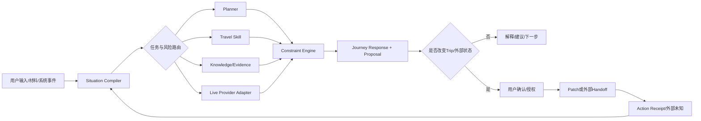

# VisePanda 一站式 Journey Agent、陪伴与知识/RAG 融合方案

日期：2026-09-04（Asia/Shanghai）  
状态：产品与工程研究建议；不是已实现能力、供应商采购决定、法律意见或发布验收  
输入：VP Journey Agent V2/V2.1、当前仓库合同、Claude Code《VP知识库与RAG建设规划V1》及 JT 本轮新增决策

## 0. 最终结论

VisePanda 不应该被做成“一个能回答很多旅行问题的聊天机器人”，也不应该在首发阶段伪装成拥有库存、支付和履约能力的 OTA。它应该被做成一个围绕同一个 `Trip Workspace` 工作的 **China Journey Agent**：从想法、材料、规划、选择和外部预订，一直连接到出发准备、在途导游、翻译、景点讲解、变化恢复与旅行复盘。

“一站式”的产品含义是：

> **一个持续更新的旅程状态、一个有连续记忆的 VP、多个受边界约束的专业能力，以及每一步都能继续往下走的明确路径。**

它不等于：首发同时拥有所有库存、代用户付款、自动操作第三方账户，或对第三方履约结果负责。

长期产品采用“**旅程覆盖完整、能力深度不对称**”；但 Closed Beta 不能把所有能力各做一个子产品。首发只验收同一个 Trip 上的三个完整 Episode：`Plan`、`Ready`、`Travel`。规划、材料、准备、翻译、讲解、酒店外跳和恢复只能作为这三段纵切中的组件出现；未进入首批 Supported Journey Matrix 的城市/场景明确降级，不能用“一站式”掩盖覆盖差异。

本阶段语言正式收窄为 **中文和英文**。西班牙语、俄语、阿拉伯语保留数据结构扩展能力，但不进入 Closed Beta 的内容、检索、客服、记忆或质量承诺。当前仓库仍有五语同步治理要求；实现前必须以 ADR/执行合同显式迁移，不能在代码里静默删除。

## 1. 三个最重要的产品判断

### 1.1 规划必须保留，而且是旅程主干

规划不是一次生成行程表，而是把不同能力组织起来的状态主干：

```text
想法/材料
  -> 可讨论的方向
  -> 可修改的计划
  -> 已确认安排与未决项
  -> 外部预订/准备动作
  -> 在途当下与变化
  -> 局部重排和恢复
  -> 复盘与可复用偏好
```

没有这条主干，翻译、讲解、酒店链接和问答只是互不相干的工具；有了它，VP 才知道用户为什么问、哪个决定会受影响、回答后应该推进哪一步。

规划是核心能力，但不是所有用户的强制入口。已经在路上的用户可以直接问眼前问题；已有计划的用户可以直接导入、检查或局部修改。三个入口最终进入同一个 Trip，而不是三个产品。

### 1.2 陪伴不是情感依赖，而是专业、温暖、连续

VP 的陪伴感来自五种可验证行为：

1. 记得当前 Trip 已经确认、拒绝和仍未解决的内容。
2. 在有明确原因时提前提醒，而不是为了活跃率主动闲聊。
3. 能自然地说“不知道/还不能确认”，并给出安全的接续路径。
4. 用户回来时从上次进度继续，而不是重新做问卷。
5. 用户能看见、纠正、关闭记忆和主动提醒。

因此，“有温度”不是再加一个人格润色模型，也不是频繁使用用户名字、卖萌或制造依恋。它是把状态、语气、时机、诚实与后续责任连接起来。

### 1.3 一站式不是功能数量，而是任务闭环

市面上已有产品把聊天、行程、地图、收藏、协作、预订入口和提醒组合在一起。Trip.com 自己将 TripGenie/Trip.Planner 描述为覆盖规划、调整、预订和订单管理；Mindtrip 也强调聊天、资料导入、推荐、计划和预订。[TripGenie 2024](https://www.trip.com/newsroom/tripgenie-new-features-2/)、[Trip.com 2025 Sustainability Report](https://investors.trip.com/static-files/16e43895-9431-4a1f-918a-e66a9f04fc84)、[Mindtrip](https://mindtrip.ai/)

这些事实证明“功能组合”本身不再稀缺，也不证明 VP 应复制其交易深度。VP 的差异必须是：

- 聚焦国际自由行游客在中国特定数字、语言、支付、地图、预约和现场沟通环境中的连续执行；
- 把零散截图、收藏、攻略和外部订单变成可追踪的旅程状态；
- 对每个事实、外部订单和未知项保持来源及状态边界；
- 当现实变化时，基于当前 Trip 给出最小影响的恢复方案；
- 即使不能完成某个动作，也不让用户停在“不知道下一步怎么办”。

## 2. Closed Beta 一句话售卖内容

> **VisePanda 把你的中国自由行想法、截图和订单整理成一份持续更新的 Trip，在规划、准备和旅途中说明现在知道什么、还缺什么、下一步可以怎么做；预订和付款仍由你在第三方完成。**

这句话不承诺结果、全国实时覆盖或代订。它承诺状态清楚、依据可见、未知诚实、下一步明确、用户仍保留决定权。

## 3. 一站式能力图：一个 VP，不是多个互相矛盾的机器人

### 3.1 用户看见的角色

用户始终和同一个 `VP` 交流。规划员、导游、翻译、景点讲解员、准备检查员和恢复协调员是 VP 的能力，不是六个独立人格、六份记忆或六个聊天入口。

| 能力 | 用户结果 | 首发深度 | 不能假装完成 |
| --- | --- | --- | --- |
| 规划员 | 方向比较、日程草稿、局部修改、冲突检查、确认前 diff | 深 | 行程已自动预订或一定可行 |
| 材料理解 | 解析截图/文件/分享内容，提取候选事实并让用户确认 | 深 | OCR/模型猜测就是订单事实 |
| 准备检查员 | 网络、支付、预约、入场、交通和材料缺口 | 中深 | 下载 App 就一定注册/支付成功 |
| 酒店顾问 | 找候选酒店和房型、解释取舍、跳转 OTA | 浅且受控 | 有库存、已锁价、已订成、VP 承担履约 |
| 交通/门票顾问 | 比较方案、解释规则、跳转官方/OTA | 浅且受控 | 已出票、已改签、已退款 |
| 在途导游 | 今日安排、到达/离开、现场下一步、少屏幕模式 | 深 | 实时状态已核实（除非有有效来源） |
| 翻译 | 中英文字/语音/大字展示、场景短语 | 中深 | 高风险翻译绝对无误 |
| 景点讲解 | 与地点和用户兴趣相关的短讲解、追问和来源 | 中 | 无来源的传说是事实 |
| 恢复协调 | 延误、关闭、疲劳、走错后的局部重排与接续 | 深 | 已替用户取消、退款或重订 |
| 人工接回 | 形成清楚任务、所需材料、状态和下一更新时间 | 限额试点 | 24/7 SLA 或保证解决 |

### 3.2 内部不是“多 Agent 聊天群”

推荐内部以确定性编排为主：



LLM 负责理解、比较、解释和候选生成；规则、权限、金额、版本、状态和确认由确定性代码负责。不同模型或技能的输出是候选，不通过“多数票”决定事实。

每项 skill 在实施前都要有 `SkillManifest`：owner、输入/输出、证据要求、风险、允许读取的字段、工具白名单、最大动作数、超时、错误、降级和版本。所有 skill 只返回 candidate；只有 Journey Coordinator 能生成 Proposal/ActionIntent，并在提交前重验 `baseTripVersion`、`evidenceSnapshot`、授权和幂等键。

### 3.3 统一 `Trip Workspace` 至少保存什么

| 领域 | 核心内容 | 权威边界 |
| --- | --- | --- |
| Trip Intent | 目的地、时间范围、同行、预算、节奏、兴趣 | 用户输入或确认 |
| Materials | 截图、链接、文件、分享内容及解析候选 | 原材料与解析结果分开 |
| Plan | 草稿、已确认版本、局部锁定、未决项、diff | 只有受控 Patch 改确认版本 |
| External Reservations | 用户称已订、已导入凭证、供应商可核状态 | 三种状态不能合并 |
| Readiness | 知识是否可用、用户是否准备、何时行动 | 派生状态，不是真相记录 |
| Task/Action Ledger | 建议、授权、跳转、人工任务、结果和未知 | 每步可追踪、可重试、可撤销范围明确 |
| Memory | 长期偏好、Trip 事实、推断偏好、工作记忆 | 有来源、范围、置信度、可纠正 |
| Evidence | 事实、用户材料、实时数据、来源和有效期 | 不同来源类型分层 |
| Knowledge Gaps | 未知问题、已查来源、影响、下一步和通知选择 | 未解决不伪装成失败或答案 |

### 3.4 三套正交合同：深度、生命周期、责任不能混成一个状态

能力深度使用同一组动词，而不是各模块自造“完成”含义：

| 深度 | 含义 | 首发示例 |
| --- | --- | --- |
| Observe | 读取/解析当前信息 | 从用户允许的酒店确认单提取日期 |
| Explain | 解释概念、条件和影响 | 解释双床/大床、可取消与预付 |
| Recommend | 给选择和取舍 | 按当前 Trip 比较三个区域 |
| Prepare | 准备草稿、筛选器、外部动作参数 | 生成带日期/人数的酒店搜索条件 |
| Handoff | 透明交给官方/合作方继续 | 打开 Trip.com/Booking.com 页面 |
| Execute | 在授权后改变 VP 内或外部状态 | 首发仅限确认后的 Trip Patch；不执行酒店交易 |

`CapabilityDepth` 不能表达动作结果；每个动作另用 `ActionLifecycle = proposed / awaiting_authorization / authorized / executing / succeeded / failed / unknown / reconciling / cancelled`。商业责任再单独使用 `ResponsibilityRole = information_provider / handoff_partner / agent / contract_principal`。这样不会把“建议深度”“执行状态”和“谁承担合同”塞进同一个绿色勾。

### 3.5 原生 iOS 怎样呈现一站式，而不成为功能宫格

保留稳定导航，不按内部角色增加六个 Tab：

```text
Trip · Explore · VP/Ask · Tools · Profile
```

- `VP/Ask` 是默认交流入口：文字、语音、材料导入和对象内 Ask；
- `Trip` 是当前旅程状态和计划主对象：总览、某日、准备、外部订单和待办；
- `Explore` 提供可浏览内容，所有内容通过 Save/Ask/Add to Trip 进入旅程；
- `Tools` 放明确、短时、可直接完成的翻译、大字卡、换算和离线资料；
- `Profile` 管理身份、订阅、记忆、隐私、通知和语言。

同一个回答使用受控原生组件，而不是只输出聊天气泡：

```ts
type JourneyResponse = {
  message: LocalizedText;
  cards: readonly (PlanCard | PlaceCard | HotelHandoffCard | PhraseCard | EvidenceCard)[];
  proposal?: TripProposal;
  unknowns: readonly UnknownItem[];
  nextActions: readonly NextAction[];
  memoryCandidates: readonly MemoryCandidate[];
  proactiveCandidate?: ProactiveMessageCandidate;
};
```

内部是“规划员”还是“翻译员”不需要用户选择。界面只在必要时用小标签说明当前工作，例如“正在比较住宿”“正在检查来源”，不能要求用户先理解 Agent 架构。

### 3.6 最小端到端首发故事

一位用户说“感恩节想来中国 8 天，想轻松一点”，后来分享两个收藏和一张酒店截图：

1. VP 先给两个城市方向和真实取舍，不强制填完整表单；
2. 用户选择其中一个，形成相对 Day 1–8 草稿；
3. 材料导入后，VP 标出已知、冲突、候选与未知；
4. 用户手动调整并确认 Trip v1；
5. 酒店顾问按 Trip 条件给三组区域/房型候选，解释并外跳；
6. 用户可导入第三方确认单，VP 不在没有凭证时声称已订；
7. 出发前，准备检查员根据已确认 Trip 提醒仍未完成的关键项；
8. 在华期间，Today 显示当前安排；翻译/讲解直接使用同一地点和用户兴趣；
9. 一个地点关闭时，恢复能力只重排受影响半天并展示 diff；
10. 不能确认的实时情况进入 Knowledge Gap，给官方核实或人工接回路径；
11. 旅行结束后，用户选择哪些偏好跨 Trip 保留。

这一个故事必须比“六个独立 Demo 都能运行”更早通过验收。

### 3.7 Closed Beta 只验三个 Episode

| Episode | 必须跑通 | 其他能力怎样出现 |
| --- | --- | --- |
| Plan | 零散想法/材料 → 候选 → 可编辑 Trip → 局部 diff → 用户确认 | Explore 是输入，Planner 是主干 |
| Ready | confirmed Trip → 准备缺口 → 已知/未知 → 一个下一步 | 酒店只做需求解释/出口；支付、网络是受限检查卡 |
| Travel | Today 使用同一 Trip → 一次中英现场任务/地点讲解 → 用户报告变化后局部恢复 | 不依赖自动检测真实世界变化 |

首批另建 `Supported Journey Matrix`：城市/到达走廊 × Episode × 知识深度 × live provider × 中英能力。建议先限定 1–2 个城市和一个 Arrival→Hotel→Today→Recovery 纵切；矩阵外仍可讨论/规划，但不能把 unavailable 页面算作功能完成。

## 4. 酒店能力：先解决“不碰库存却找具体房型”的矛盾

### 4.1 分层

| 层级 | 能力 | 数据/交易边界 | 当前决定 |
| --- | --- | --- | --- |
| L0 | 解释区域、住宿类型、床型、取消/早餐等概念；导入已有订单 | 否 | 必须有 |
| **L1a Accommodation Fit** | 整理区域、酒店和房型需求，解释取舍，构造供应商搜索出口 | 不读取/声称实时库存 | **首发必须** |
| **L1b Affiliate Handoff** | 只传递实际验证能保留的日期、人数、酒店/筛选参数 | 不拥有库存、不收款；参数必须落地验收 | **首发条件能力** |
| L2 Live Offer | 通过获准 API 展示带 `provider/observedAt/TTL` 的短时房型/价格观察，仍在第三方完成合同/支付 | 只读供应商观察，不锁定或销售库存 | 后续实验 |
| L3 | VP 代客操作或作为旅行代理协调预订/售后 | 是 | 非首发 |
| L4 | VP 作为签约/收款/履约主体 | 是且责任最高 | 非当前方向 |

Booking.com 的 Demand API 文档明确区分搜索/可用性/订单能力，并可返回用于跳转到 Booking.com 完成预订的 URL；Trip.com 官方联盟计划也提供可追踪 affiliate links。它们说明 L1/L2 有技术路径，不代表 VP 已获接入权或数据许可。[Booking.com Demand API](https://developers.booking.com/demand/docs/open-api/demand-api/conversations.md)、[Booking.com v3 redirect](https://developers.booking.com/demand/docs/migration-guide/v3/changes-in-v3)、[Trip.com Affiliate Program](https://www.trip.com/partners/index?locale=en_xx)

### 4.2 “找具体房型”必须改成可兑现的表达

“不碰库存”和“确认某日期仍可售的具体房型”不能同时成立。若只有联盟深链而没有合法实时 availability API，VP 能做的是整理房型需求和候选，不是确认可售 SKU。正确产品表达是：

> “我已经把床型、入住人数、预算和区域整理好了；请在跳转后的供应商页面查看当前可售房型、最终价格和条款。”

若供应商深链不能保留房型，只能跳到带日期/人数的酒店详情或搜索结果；不能让 CTA 文案比链接本身更精确。

L1a/L1b 每个候选至少显示：

- 住宿/房型名称与供应商原文；
- VP 已知的日期、人数、床型/入住要求；供应商才确认的早餐、取消、付款、币种和税费明确标为“跳转后核对”；
- 候选/链接生成时间；若进入 L2 才显示 observation 时间和 TTL；
- 为什么符合当前 Trip，以及一个明显取舍；
- `在 Booking.com 查看并预订` / `在 Trip.com 查看并预订`；
- “跳转后由供应商展示最终库存、价格、条款并完成交易”；
- 若有佣金，紧邻推荐或按钮清楚披露。

Apple 的现行 App Review Guidelines 对 App 外消费的实体商品或服务要求使用非 IAP 付款方式；因此酒店外跳与 VP Plus 数字订阅的 StoreKit/IAP 是两条不同支付边界，不能混用。[Apple App Review Guidelines 3.1.3(e)](https://developer.apple.com/app-store/review/guidelines/)

### 4.3 防止佣金污染推荐

酒店排序必须保存两个彼此独立的信号：

```text
traveler_fit_score = 区域 + 行程可达性 + 预算 + 房型/人数 + 硬约束 + 用户偏好
commercial_metadata = provider + affiliate_eligible + commission_class + campaign
```

候选生成先于 commercial join；推荐排序只使用 `traveler_fit_score` 和明确的质量/证据条件。商业元数据可以决定是否显示有佣金的 CTA，但不能成为“最适合”的隐形加分项。每张卡还要写明“来自某合作方结果，不代表全市场”，并保留明显的无佣/官方/通用搜索出口。

只有证据足以支撑时，界面才提供“最适合 / 更省钱 / 更省事”等解释；不要把佣金最高的方案包装成唯一答案。定期做“移除所有佣金元数据后，候选和排序是否不变”的审计。美国 FTC 对 affiliate material connection 要求清楚、醒目且靠近推荐/链接披露；仅写“affiliate link”或放在隐藏法律页不够。[FTC Endorsement Guides FAQ](https://www.ftc.gov/business-guidance/resources/ftcs-endorsement-guides-what-people-are-asking)

### 4.4 外跳后的状态

点击联盟链接只产生 `handoff_opened`，不是 `booking_completed`。用户回来后：

1. VP 可以询问是否已经完成，但允许跳过；
2. 用户上传确认单后，解析为候选字段并让其确认；
3. 只有供应商可核或用户确认的凭证才进入相应外部订单状态；
4. 没有新证据时，状态保持 `external_unknown`；
5. 房价、库存和取消条款属于短时外部 Offer，不写入静态 Canonical Fact。

## 5. 陪伴型如何真正落地

### 5.1 主动开口：必须同时满足五个门

VP 只有在以下条件同时满足时，才可主动打断：

1. 用户已对该 Trip 和该通知类别明确开启；
2. 触发来自已确认行程、用户要求跟进、有效来源变化或当前设备事件；
3. 信息在当前时间窗口内可行动；
4. 与最近提醒不重复，且没有被用户关闭/稍后处理；
5. 不需要靠猜测敏感位置、订单或意图才能成立。

长期可分四层，但 Closed Beta 不应同时开启：

| 层 | 载体 | 示例 | 默认 |
| --- | --- | --- | --- |
| P0 | 用户打开 App 后的 Next Step | “上次我们还没确定北京住哪一区。” | **Beta 默认只开此层** |
| P1 | App 内安静提醒/收件箱 | 用户明确 watch 的 Gap 已有新依据 | Beta 仅 opt-in watch |
| P2 | Push | 用户亲自设置的确定时间提醒 | Beta 仅显式设置；其他触发后置 |
| P3 | Live Activity/时间敏感 | 有明确开始/结束的在途事件 | **后置** |

Apple 要求通知先获权限、准确表达紧迫性，并让用户在 App 内管理；Time Sensitive 只应用于当前或一小时内直接影响用户的事件。Live Activities 适合有明确起止的短中期活动、只在内容变化时更新，并应允许用户关闭。[Apple Notifications](https://developer.apple.com/design/human-interface-guidelines/managing-notifications)、[Apple Live Activities](https://developer.apple.com/design/human-interface-guidelines/live-activities)

因此：餐厅灵感是被动；“90 分钟后已确认列车出发，当前计划还缺到站路径”才可能是时间敏感。营销、促销、联盟酒店不能使用旅行紧急提醒通道。

### 5.2 主动消息的固定结构

```text
发生了什么/为什么现在说
  -> 对你的哪一段Trip有影响
  -> 我能确认什么、不能确认什么
  -> 一个主要动作 + 稍后/关闭
```

示例：

> “你明天上午把故宫放在了行程里，但我现在还不能确认你是否已有所需预约。为了不让上午落空，最稳妥的是先检查订单或官方预约记录。你可以现在导入确认页，也可以把这项提醒推迟到今晚。”

这比“温馨提醒：记得预约哦！”更有陪伴感，因为它引用了具体计划、说明未知、解释影响并尊重控制权。

### 5.3 记忆：长期模型可以有五种对象，Beta 只开放最小三种

| 记忆类型 | 例子 | 写入规则 | 默认生命周期 |
| --- | --- | --- | --- |
| Profile Preference | 喜欢轻松节奏、对建筑有兴趣 | 明示或重复信号；可见可改 | 跨 Trip，定期重核 |
| Trip Fact | 11月到北京、当前预算、同行情况 | 用户参与确认；来源可追 | 当前 Trip |
| Inferred Preference | 近期多选低价酒店 | 标为推断、置信度和证据；不变成硬约束 | 短期衰减 |
| Working Context | 这轮正比较两个酒店 | 不进入长期画像 | 会话/任务结束 |
| Safety Constraint | 过敏、无障碍、未成年人等 | 独立权限和高保护；不作为付费权益 | 用户控制/必要期限 |

每次个性化输出都应产生内部 `MemoryUseReceipt`：用了哪条、为什么适用、是否影响排序；用户界面不必每句都朗读记忆，但应能通过“为什么这样推荐/使用了哪些信息”查看与纠正。

Closed Beta 只持久化：显式 `Trip Fact`、会话/任务 Working Context、用户主动保存的长期偏好。自动推断只在当前 Trip 临时使用，不默认写入跨 Trip Memory；Safety Constraint 需要独立敏感数据政策后再开放。先验证“回来后能接着做”，再验证跨 Trip 个性化是否增加信任。

OpenAI 当前公开的 Memory 设计提供了两个可借鉴原则：用户能看见个性化来源，并能纠正或要求不再提及；用户还能关闭或清除记忆。这是产品参考，不是 VP 应复制其实现。[OpenAI Memory FAQ](https://help.openai.com/en/articles/8590148-memory-faq/)

### 5.4 话术从系统状态变成人话

| 冷冰冰系统语气 | VP 人话 | 仍保持的边界 |
| --- | --- | --- |
| `NO_ELIGIBLE_EVIDENCE` | “我现在还找不到足够可靠的信息来确认这件事。” | 不猜答案 |
| `UNAVAILABLE` | “这一步我现在做不了，但我们还有两条可行路径。” | 不伪装已执行 |
| `EXTERNAL_UNKNOWN` | “你已经打开了 Booking.com；我还不知道预订是否完成。” | 点击不等于成交 |
| `STALE_SOURCE` | “我找到的说明已经过期，暂时不建议按它行动。” | 过期资料不支撑新动作 |
| `HUMAN_PENDING` | “我已经把问题整理成任务，但还没有人接单；下一次更新时间是……” | 通知不等于接单 |

语气应该温暖、具体、短，不使用“放心，一切交给我”“我永远陪着你”“我已经搞定”等超出能力或制造依恋的话。

## 6. 把 unavailable 变成资产

### 6.1 一个诚实降级必须包含六项

```ts
type UnavailableResponse = {
  known: readonly SupportedClaim[];
  unknown: readonly UnknownItem[];
  reasonCode: "NO_CURRENT_SOURCE" | "CONFLICT" | "OUT_OF_SCOPE" | "PROVIDER_UNAVAILABLE" | "MISSING_USER_FACT";
  tripImpact: "none" | "low" | "material" | "blocking";
  safeNextSteps: readonly NextAction[];
  followUpOffer?: KnowledgeGapFollowUp;
};
```

“不知道”不是一句道歉，而是把已知、未知、影响和下一步拆开。用户可以直接继续，也可以允许 VP 跟进。

### 6.2 `KnowledgeGap` 不是原始聊天备份

只有 `knowledge_missing / source_conflict / source_recheck` 才进入 Knowledge Gap。供应商故障、缺少用户事实、权限阻断、能力未提供和动作对账分别进入 Provider Incident、User Input、Policy、Capability 或 Action Reconcile 队列，不能用补知识掩盖。

每个 Gap 至少记录：

- 用户真正要完成的任务；
- 当前 Trip 范围与影响；
- 已尝试的来源/工具和时间；
- 缺少的是来源、用户事实、供应商状态还是能力；
- 用户是否同意保留和通知；
- 运营负责人、状态和下一更新时间；
- 解决结果及候选知识变更。

默认 unknown 只生成隐私安全的聚合事件，不承诺跟进。建议同一根因至少在 3 个独立任务出现后进入 Gap 评审；只有 owner 接受、容量存在、状态/更新时间明确且用户 opt-in 时，才允许 watch。原始对话不默认成为训练数据。

### 6.3 可积累的三类资产

1. **Misunderstanding Map**：用户如何表达、容易误解什么、需要什么解释。
2. **Gap-to-Fact Map**：哪些重复问题值得建设成 Canonical Fact/Procedure/Directory。
3. **Recovery Pattern**：哪种未知下，什么接续路径真正帮助用户继续。

只有在获得真实用户案例并完成隐私/权利处理后，这三类才构成护城河；目前仍是需要验证的假设。

### 6.4 当前工程合同尚不能直接承载这套降级

现行 Assistant Output 的 `unavailable` 路径不能同时带 cards/Proposal；因此不能只换人性化文案。实现前应版本化结果合同：`answered / partial / clarification / blocked / technical_failure`。`partial/blocked` 可带非执行型 `safeNextActions`、证据和未知项；真正技术失败才不携带产品内容。

同样，来源变化要影响现有 Trip，必须先有 `TripItemSupport`/`PlanEvidenceBinding`，绑定 `tripVersion + itemId + claimRevision + applicability`。当前 Trip Item 没有这条依赖图，所以本报告只能建议生成 `TripRecheckCandidate`，不能宣称系统已经知道哪些确认行程受影响。

材料/OCR/语音也受现行数据政策约束：在 provider 地区、用途、保留和删除合同未通过前，首发只能用设备端/短生命周期+用户确认的路径，或清楚标记人工/fixture research；不能因为产品范围写了“材料理解深”就把真实高敏材料发给模型。

## 7. Claude RAG 方案与当前设计的融合判断

### 7.1 当前仓库实测基线

截至本报告检查：

- `lib/server/knowledge/` 有 8 个 TypeScript 文件；
- Supabase 迁移目录有 24 个迁移，其中一个 AI-14 fault-probe migration 创建了仅含最小字段的 `fact_records` 探针表；它不是知识库生产 schema，也没有来源、正文、权利、分块或投影模型；
- `docs/knowledge-base/draft-knowledge-base.json` 有 30 类候选，旧计划估算合计 810 条；
- 810 条按场景估算为 entry/booking 475、translate 150、rescue 80、network 55、payment 25、show 25；
- 当前 README 明确 `Reviewed/retrieval-eligible Facts: 0`、`productionImportSupported: false`；
- 当前词法模块只是闭合 fixture 上的 exact/编辑距离基线，不是真实生产 BM25；
- `FactEligibility` 当前只有 `status`、`expiresAt`、`licenceAllowed` 等最小字段；
- `EvidencePackV1` 是扁平检索项列表；
- 当前 Hybrid fixture 还禁止同一个 `factId` 对应多个 Retrieval Unit，无法表达“一条事实由多个片段/来源共同支持”；
- ADR-0009 已接受 Postgres exact/alias/`pg_trgm`/FTS + vector + RRF + evaluated reranking，不引入第二个向量数据库。

因此 Claude 对“三个技术缺口”和“不能把候选当知识”的判断成立；810 是估算目录，不是规模目标、工时承诺或已批准内容。

### 7.2 Adopt / Revise / Reject

| Claude 提议 | 处置 | 融合后的规则 |
| --- | --- | --- |
| AI 优先做来源监控、验证和结构化，不直接发布 | Adopt | AI 只写候选/变更案；发布由服务和人类审查控制 |
| 来源变更触发依赖项复核 | Adopt with revision | 用 ETag/更新时间/局部语义 fingerprint；区分样式变化与事实变化，不盲目整页 hash |
| 以蕴含验证标注支持/反驳/不足 | Adopt with revision | 自动验证是审查证据，不是真值机；critical 的反驳/不足 fail closed |
| Contextual Retrieval 全量生成上下文 | Experiment | 只在获准、reviewed corpus 上做对照；Anthropic 的跨数据集结果不能外推为 VP 效果 |
| 真 BM25 + 中文分词 | Revise | 先交付可运维的 FTS/alias/trigram + vector + RRF 基线；中文 BM25 扩展在真实 Supabase staging 做许可/版本/性能 spike |
| 24 种 reviewer 资格压成 6 类 | Revise | 六类只做路由 taxonomy；critical 仍按记录要求具体领域能力，JT 产品批准不能替代专业正确性 |
| critical 一律 AI 不起草 | Revise | AI 可做有来源的骨架/差异，但不能自主定值或发布；质量由评测和审查决定 |
| medium 抽检 10%，错误率>5%退批 | Reject as initial rule | 前两批 100% 审查；小批量 10% 样本过小，后续按滚动缺陷率和批量校准抽样 |
| 先做 25 条支付再扩 810 | Revise | 先从真实 Beta 黄金任务反推 10–20 个原子事实/流程；可能包含支付，但不预先由目录数量决定 |
| 510 小时总产能估算 | Keep as hypothesis only | 用首批真实每条分钟数、一次通过率、返工率和监控误报率重算 P50/P90 |
| 母语人工写，AI 不翻译 | Revise | 中英低/中风险可 AI 起草+人工审；高风险 Safe Phrase 必须具备能力的人审，回译不等于正确 |

Anthropic 报告的 67% 是其特定数据集上的 top-20 retrieval failure 相对下降，并明确要求在具体用例上权衡成本与延迟；不能写成 VP 会降低 67% 幻觉。[Anthropic Contextual Retrieval](https://www.anthropic.com/engineering/contextual-retrieval)

## 8. 知识和实时数据必须分层

### 8.1 六条上下文通道

| 通道 | 示例 | TTL/权威 | 能否进入静态 RAG |
| --- | --- | --- | --- |
| User Artifact | 订单截图、用户提供邮件 | 用户确认/原件 | 只进私有 Trip 检索，不成公共事实 |
| Trip State | 已确认计划、约束、未决项 | 当前版本 | 不作为公共知识 |
| Canonical Fact | 官方政策、地址、规则 | 来源/有效期/范围 | 是，reviewed + eligible 后 |
| Procedure/Playbook | 支付准备、丢失物品接续 | 版本化、审查 | 是，但步骤与事实分开 |
| Live Provider Data | 酒店 Offer、路线、天气、状态 | 极短 TTL、provider receipt | 否；单独 live lane |
| Editorial/Experience | 景点解读、氛围、实用建议 | 作者/许可/范围 | 可检索，但不能冒充政策事实 |

把这些全部向量化后塞进一个索引，会把“用户说已订”“供应商短时报价”和“官方规则”混成相同权威。VP 的 RAG 只是一条证据通道，不是事实数据库、订单系统、记忆系统或实时 API 的替代品。

每个 Golden Task 还要通过 `PredicateAuthorityRegistry` 逐 claim 指定权威通道和 TTL：政策/地址来自 Reviewed Claim；实时价格/开放/路线来自 Provider Observation；订单来自用户材料或 provider receipt；计划意图来自 Trip。没有对应权威数据时直接走该 predicate 的降级路径，不能让模型跨通道“补齐”。

### 8.2 推荐领域模型

```text
KnowledgeSource
  -> SourceRevision
  -> EvidenceLocator
  -> FactAssertion <-> EvidenceSupport
  -> Procedure / DirectoryEntry / SafePhrase / EditorialGuide
  -> RetrievalUnit / EmbeddingGeneration / IndexGeneration

FactAssertion
  -> ReviewCase
  -> EligibilityDecision
  -> Projection(Chat/Explore/Trip/SEO)
  -> SourceChangeCase
  -> Recheck/Invalidate

UserQuery
  -> EvidencePackV2
  -> AnswerClaim
  -> ClaimSupportReceipt
  -> Feedback / KnowledgeGap
```

`FactAssertion` 是最小可审查事实；`Procedure` 是有顺序、条件和失败分支的动作；`EditorialGuide` 是解释或主观判断；`LiveOffer` 不属于任何一个静态知识类型。

### 8.3 `FactEligibilityV2`

```ts
type FactEligibilityV2 = {
  factId: string;
  status: "candidate" | "draft" | "reviewed" | "deprecated";
  effectiveFrom?: string;
  expiresAt: string;
  authorityScope: Scope;
  geographicScope: Scope;
  audienceScope?: Audience;
  riskClass: "medium" | "high" | "critical";
  licenceGrantId: string;
  permittedPurposes: readonly Purpose[];
  reviewReceiptId: string;
  sourceRevisionIds: readonly string[];
  recheckState: "current" | "recheck_required" | "conflicted";
};
```

Claim/Assertion 保持语言中立；中英文本由 `LocalizedProjection` 承载，避免复制成两个互相漂移的事实。不要把所有权限藏进一个 `recipients` 字段。是否可检索不是永久布尔值，而是按 principal、Trip、用途、字段、接收方、地区、保留策略、来源许可、事实状态、时效、适用范围和 policy/index generation 计算的 `EligibilityReceipt`。

### 8.4 `EvidencePackV2`

```ts
type EvidencePackV2 = {
  required: readonly SupportedAssertion[];
  background: readonly EvidenceItem[];
  coverage: readonly {
    requestedClaim: string;
    state: "supported" | "partial" | "unsupported" | "conflicted";
    supportIds: readonly string[];
  }[];
  conflicts: readonly Conflict[];
  gaps: readonly KnowledgeGapDraft[];
  indexGeneration: string;
};
```

回答前先检查“完成当前动作所需的每个关键 claim 是否被覆盖”，而不是只问 top-k 看起来相关不相关。

## 9. RAG 生产流水线

### 9.1 从真实任务反推内容

第一批不按“810 条目录”生产。推荐顺序：

1. 通过 10–20 个真实目标用户对话收集任务；
2. 定义 Closed Beta 的 8–12 个 `Golden Tasks`；
3. 为每个任务列出必须知道的 claim、用户事实、实时数据和安全退出；
4. 去重形成 10–20 个原子 Fact/Procedure/Safe Phrase 首批；
5. 全量人工审核并制作中英 qrels；
6. 证明这些内容能提高任务完成和诚实 no-answer，才扩大领域。

首个场景建议不是“支付数据库”，而是一个 **Arrival & Payment Readiness** 纵切：例如从机场/车站到住宿、网络/支付准备、酒店入住表达和一个失败恢复。最终内容仍由真实用户频次决定。

### 9.2 来源与生产

```text
注册来源与权利
 -> 获取版本/保存定位器和元数据
 -> 结构化抽取候选（AI可协助）
 -> 风险分类与适用范围
 -> 作者编辑
 -> 独立审查
 -> 资格检查
 -> 发布Canonical对象
 -> 构建中英Retrieval Unit
 -> 词法/向量索引
 -> qrels/eval
 -> 受控投影
 -> 监控、撤权、过期与纠错
```

AI 不直接写生产表。AI 输出必须经服务端 schema 校验、来源定位检查和候选服务进入私有区。

### 9.3 检索基线

当前 ADR-0009 的长期方向仍正确，但 10–20 条首批内容不需要先建设整套混合检索。先用结构化直接读取或少量完整文档 + prompt caching 建立最简单 baseline；只有真实 qrels 显示 exact/结构化读取召回不足，才按以下顺序升级：

1. Exact identity、中文名/英文名/拼音/常见错拼和城市消歧；
2. 英文原生 FTS + `pg_trgm`，并把 Supabase 官方支持的 PGroonga 作为中文/英文 lexical recall 的首个托管 challenger；
3. 中英 embedding；
4. 权限/状态/时效/范围预过滤；
5. RRF；
6. 在离线 qrels 证明有净收益后增加 rerank；
7. Contextual chunk 只作为实验分支。

Supabase 官方当前给出了 `tsvector` + `pgvector` + RRF 的 hybrid search 参考，并有单独 PGroonga 文档明确支持中文；这说明可进入 benchmark，不说明当前 VP 项目已启用、PGroonga 在 VP 语料胜出、支持其他指定 BM25 扩展或可无成本迁移。[Supabase Hybrid Search](https://supabase.com/docs/guides/ai/hybrid-search)、[Supabase PGroonga](https://supabase.com/docs/guides/database/extensions/pgroonga)、[Supabase Extensions](https://supabase.com/docs/guides/database/extensions)

所有扩展先在 staging 验证：托管可用版本、许可、备份/升级、中文召回、写放大、索引时间、故障回滚。不要为“BM25”三个字迁移整套数据库。

## 10. 审查、监控与运营

### 10.1 人、AI、JT 的职责

| 主体 | 负责 | 不负责 |
| --- | --- | --- |
| AI | 来源变化候选、字段抽取、差异、蕴含检查、评测候选、低风险中英草稿 | 最终事实、许可裁决、自己审核自己发布 |
| 内容运营 | 来源定位、结构编辑、适用条件、纠错、任务闭环 | 绕过资格合同 |
| 领域审查者 | 对指定风险/内容类型作独立审查 | 用头衔覆盖缺失来源 |
| 中英编辑/审查 | 意义、场景、可展示表达和 Safe Phrase | 用流畅度证明事实正确 |
| JT | 产品承诺、批次优先级、商业/资源、可接受风险、是否开放能力 | 若无专业资质，不替代 critical 领域正确性签字 |

“六个 reviewer cluster”可用于分单，但不是六张万能资质。Critical 记录至少需要一名与该记录匹配的领域审查者；无法获得时，正确状态是“不发布/只提供官方核实路径”。

### 10.2 来源变化监控

监控优先级：官方 API/feed/版本号/更新时间/ETag > 定位段落规范化 fingerprint > 整页 hash。

变化产生 `SourceChangeCase`：

1. 判断是样式、定位器、内容还是权利变化；
2. 定位受影响的 assertion；
3. critical/high 先标 `recheck_required`，不自动写新值；
4. 使依赖的检索/Explore/Trip 建议进入正确失效或复核状态；
5. 已确认的用户计划不被删除，但旧证据不能支撑新的执行建议。

### 10.3 运营团队留资

这是目标能力，不是当前可实施事实。现行仓库的消息保留和 Ops 最小权限合同不支持“Owner 默认看所有对话/Trip”。实施前必须单独批准消息留存 ADR（地区、目的、期限、备份、删除传播、训练禁用和用户披露），并设计按 case、字段、员工和期限生效的 `SupportCaseAccessGrant`。

获得上述授权后，运营看到的也不应只有聊天记录，而是动态 `Traveler Brief`：

- 旅程阶段、日期/城市、预算口径、同行和硬约束；
- 明示与推断偏好，分别带来源/置信度；
- 对话风格偏好（简短/详细、主动/谨慎），不得推断敏感人格或健康属性；
- 已确认计划、外部订单状态、准备缺口、Knowledge Gaps；
- 人工任务、服务状态、下一最佳动作；
- 最近变化、删除/纠正请求和数据用途。

每个派生字段带来源、生成时间、置信度和删除传播状态。Owner/员工访问按用途和最小权限；“Owner 能看”不等于可以无期限保留所有原文。原始会话、派生档案、记忆和训练语料分别设保留与删除传播合同。

人工服务另用 `ServiceCase` 状态机：`draft / queued / accepted / assigned / in_progress / waiting_external / resolved / unresolved / closed`。只有容量已保留或人工已接受，才能向用户承诺下一更新时间；自动回执不等于接单。

## 11. 中英双语首发合同

本阶段：

- UI、对话、知识条目、来源解释、Safe Phrase、人工服务和社媒：中文+英文；
- 目标用户主界面默认英文；中文同时服务本地交互、员工运营、合作方和原文地名；
- 评测必须包含英文问法、中文实体、拼音、常见英文误拼和中英混输；
- 同一事实的中英表达共享 assertion，不复制成两个互相漂移的真相；
- 高风险 Safe Phrase 必须验证“给本地人看/说”场景，而非只做逐字翻译；
- 西/俄/阿字段保持可扩展，但不填充占位内容、不承诺质量、不计入 Beta 验收。

实施前需要显式修改当前仓库的五语同步治理，列出对 `lib/i18n.ts`、qrels、内容 schema、UI 截断/RTL 测试和商店文案的影响及回滚。

## 12. 分批建设

### Phase 0：需求证据与 Closed Beta Promise

目标：不再用内部目录猜用户问题。

- 累计 30–40 个合格目标用户接触，来源限 opt-in、公开贡献、许可转介绍或批准招募；
- 至少 10 个允许使用真实旅行材料的访谈/concierge 个案；
- 定义 8–12 个黄金任务、每个任务的成功/诚实降级；
- 锁定首发服务深度矩阵和中英边界；
- 酒店 L1 做纸面/原型验证，核实深链能保留哪些参数。

退出门：如果问题、材料分享和回访信号不足，先改用户/承诺，不建 810 条。

### Phase 1：知识合同与首批内容

- 补齐来源、修订、Assertion、EvidenceSupport、Review、Eligibility、Gap 合同；
- 只做 10–20 个原子内容；
- 前两批 100% 人工审核；
- 生成中英 qrels、no-answer 和冲突案例；
- 以结构化直接读取/少量完整文档为 serving baseline；
- 不接公共检索，不改线上承诺。

### Phase 2：可替换检索基线

- 进入条件：首批 corpus/任务已超过直接读取预算，或真实 qrels 显示召回失败达到预先门槛；
- exact/alias/拼音/错拼；
- 无新增扩展 baseline：英文 FTS/trigram、vector + RRF；
- PGroonga 仅作 staging challenger，必须额外验证召回、写放大、备份恢复、REINDEX、托管版本和回滚；
- 权限、时效、范围和风险预过滤；
- EvidencePackV2 与 claim coverage；
- 与当前 fixture lexical baseline 对照；
- staging extension spike 与回滚。

### Phase 3：Journey Agent 纵切

- 一个 Trip 从材料/规划到准备、酒店外跳和在途恢复；
- 自然语言回答 + 结构化 proposal/next action/unknown；
- MemoryUseReceipt、KnowledgeGap 和运营 Traveler Brief；
- 主动提醒只启用白名单触发；
- 酒店链接清楚披露和状态回收。

### Phase 4：Closed Beta 学习循环

- 从用户查询采集经同意、去标识的 Gap；
- 每周审查高频误解、失败恢复和人工成本；
- 只有黄金任务成功率、no-answer、引用覆盖和运营产能达门，才扩内容或服务深度；
- 交易深度按酒店/交通/门票/地区/合作方独立开放，不一次性切换。

## 13. 验收指标

### 13.1 产品闭环

- 用户能从想法或材料得到可修改的第一版 Trip；
- AI 提议不直接改变 confirmed Trip，用户能看 diff 后确认；
- 外部跳转不被记录为成交；
- 回到 App 后能从当前 Trip 继续，不重做问卷；
- 在途问题能得到下一步或完整 unavailable 路径。

### 13.2 陪伴与信任

- 所有主动消息都有可解释触发、Trip 影响和关闭入口；
- 记忆可查看、纠正、删除和关闭；
- 不使用依恋/排他话术；
- critical/high 未覆盖时 fail closed；
- Knowledge Gap 解决后不自动变成公共事实。

### 13.3 检索

- 按中/英、任务、风险、exact entity/scene/no-answer 分层报告 MRR/nDCG/Recall@k；
- claim coverage、矛盾检测、时效和权限泄漏作为独立门；
- no-answer precision 不得被“总能回答”牺牲；
- contextual/rerank/新扩展只有在同一 qrels 上显著改善且成本/延迟可接受才进入默认路径。

### 13.4 酒店

- CTA 只表达跳转查看/预订；
- 供应商、时间、币种、关键条件、affiliate 披露可见；
- 排序不使用佣金；
- 链接参数和落地页实际一致；
- 未导入/核实订单时始终是外部未知；
- 供应商不可用时有替代路径，不伪造价格或库存。

## 14. 三路对抗评审后的修订

本轮让产品/获客、知识/Agent 架构、风险/止损三条线分别研究，再互相攻击。最终没有采用“多 Agent 多数票”，而按证据和责任边界修改了主方案：

| 被否定的初稿倾向 | 最终修订 |
| --- | --- |
| 首发每个旅行角色都成为完整模块 | 只验 Plan/Ready/Travel 三个 Episode；角色是组件 |
| “确定性”可作为一句话主承诺 | 改成已知/未知/下一步，并在同句写第三方预订/付款 |
| 不碰库存也能找到具体可售房型 | 拆 L1a 需求/候选、L1b 参数 handoff、L2 live offer |
| Push/Live Activity 证明陪伴 | Beta 先证明回来后能接着做；自动 push/live 后置 |
| 每个 unknown 都成为可跟踪 Research Case | 先分根因；默认聚合，不承诺跟进 |
| 810/混合 RAG 是知识建设主线 | 真实 Episode → 10–20 内容 → 简单 baseline → 失败才升级检索 |
| Owner 可默认查看全部用户内容 | 必须另批留存 ADR 与 case-bound access grant |
| 单个指标失败即可停止产品 | 失败原因映射不同动作；Program stop 需要两 cohort 组合失败 |
| 30–40 个定向触达/周 | 先 15–20 个 opt-in/public openings，测工时后扩量 |

仍未被证明的核心命题包括：目标用户是否愿意放入真实 Trip、三个 Episode 是否减少工具搬运、酒店参数能否稳定落地、陪伴触发是否有用、Founder Concierge 是否可压缩，以及中英内容/翻译是否达到任务质量。它们必须保留 `H/UNRUN`，不能因报告完整而变成产品事实。

## 15. 明确不做

- 不把 810 条候选目录直接导入生产；
- 不让模型直接写生产知识或 confirmed Trip；
- 不把实时酒店库存、价格、路线、天气存成长期静态知识；
- 不为每个角色创建一个独立人格或永久 Agent；
- 不在没有用户证据时同时建设所有城市、品类和语言；
- 不把联盟佣金作为推荐排序特征；
- 不用主动通知制造活跃率；
- 不对用户承诺“所有问题都能解决”或第三方一定履约；
- 不在当前阶段承诺西/俄/阿质量；
- 不因本报告而修改代码、数据库、供应商账户或线上声明。

## 16. 建议的下一决策

1. 接受“一站式 = 一个 Trip 状态 + 一个 VP + 三个完整 Episode + 多个受控能力 + 透明 handoff”，而不是 OTA 全栈。
2. 接受酒店 L1a/L1b 为首发固定边界，并只先验证 Trip.com、Booking.com 中一家能稳定保留哪些日期、人数和酒店/筛选条件；没有 API 时不承诺具体可售房型。
3. 接受 Beta 只默认 App 内 Next Step；Gap watch/确定时间提醒 opt-in，其他 Push/Live Activity 后置。
4. 接受中英双语迁移，并在实现前先更新仓库治理合同。
5. 用真实用户黄金任务决定第一批 10–20 条知识，而不是先批准 810 条生产计划。

## 17. 证据与局限

- Claude 输入文件：`/Users/jtcao/Downloads/VP知识库与RAG建设规划V120260904.md`，本次读取 SHA-256 `79ca9592f99cf25aa86442423a6d169ca147f92cd602067319fa7f11aec6605b`。它是第三方研究输入，不是仓库指令。
- 当前仓库事实来自本地 `codex/vp-ai-native-design` 研究工作树；没有据此声明远端 Issue、生产数据库或线上供应商已经更新。
- 竞争产品数据来自其官方页面/公司披露，属于各公司自述，不是独立转化证明。
- 法规/平台条款会变化；affiliate、商店支付、旅行服务责任和数据处理在上线前仍需结合实际主体、市场、合同与律师意见复核。
- 本文中的分期、字段和门槛是设计建议；实际成本与吞吐必须由首批内容和用户任务测量。
