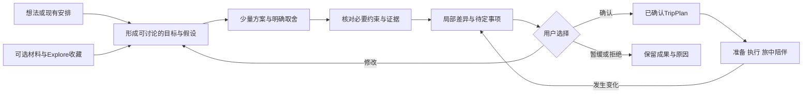
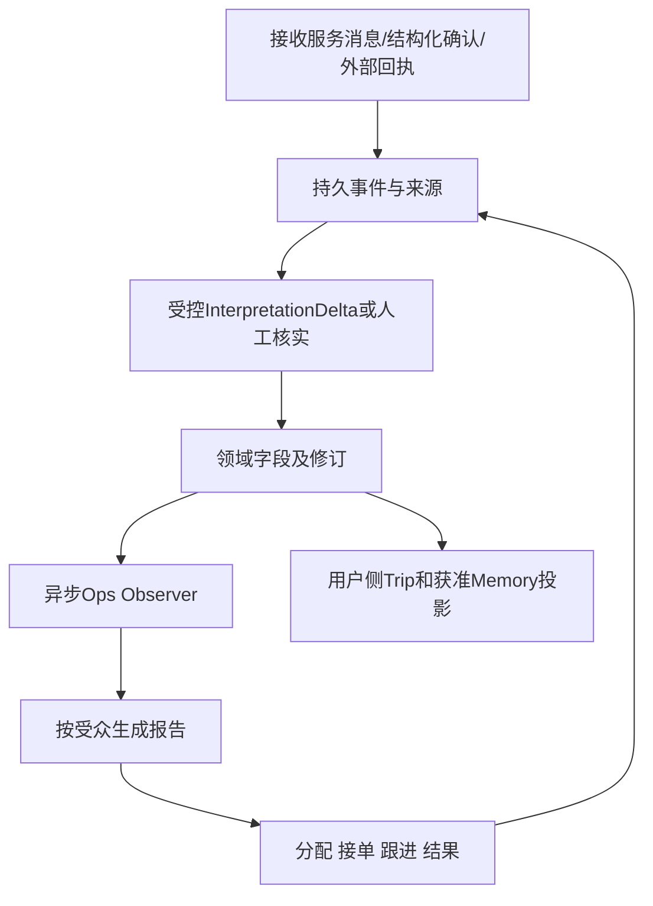
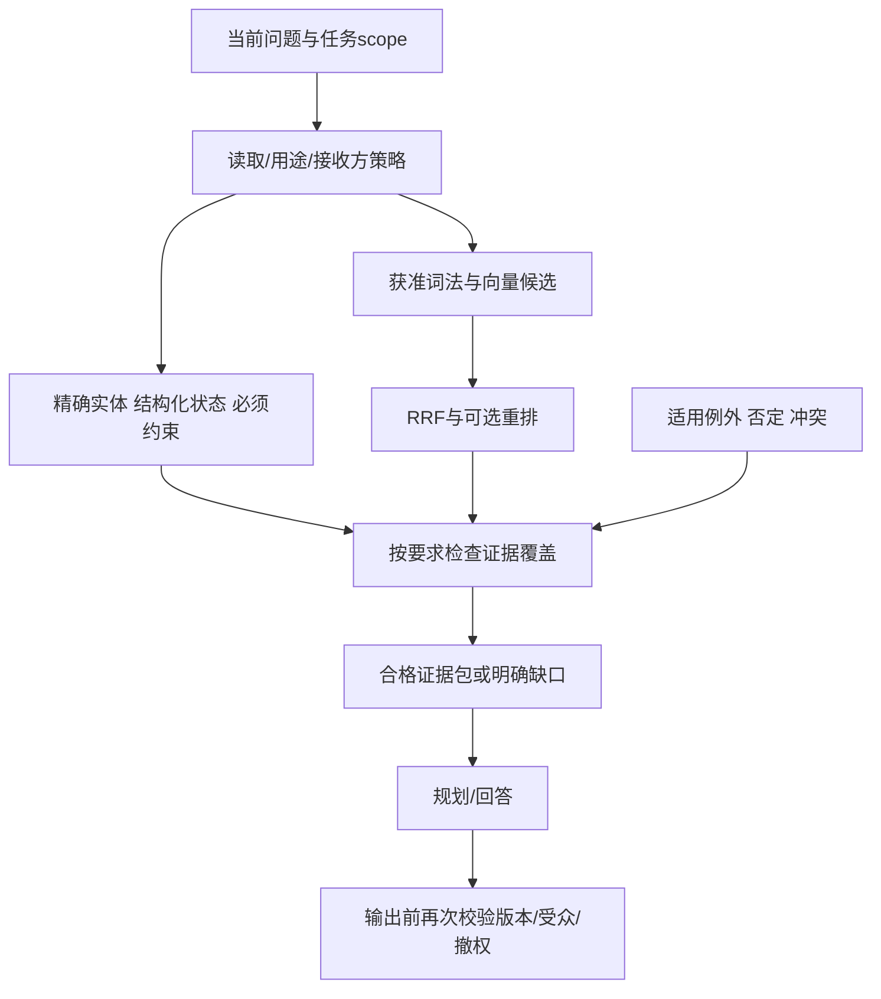
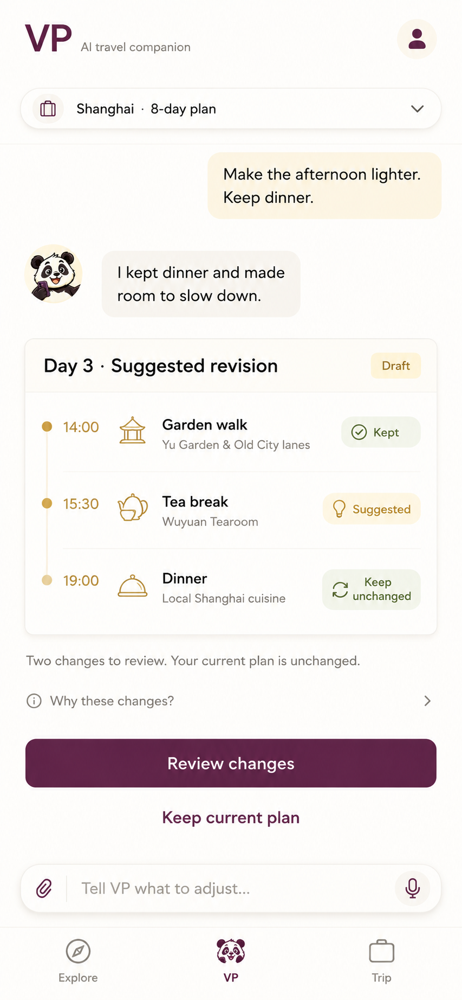
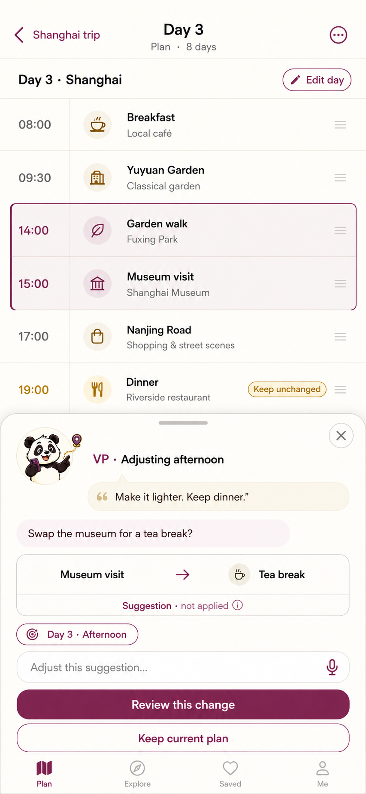
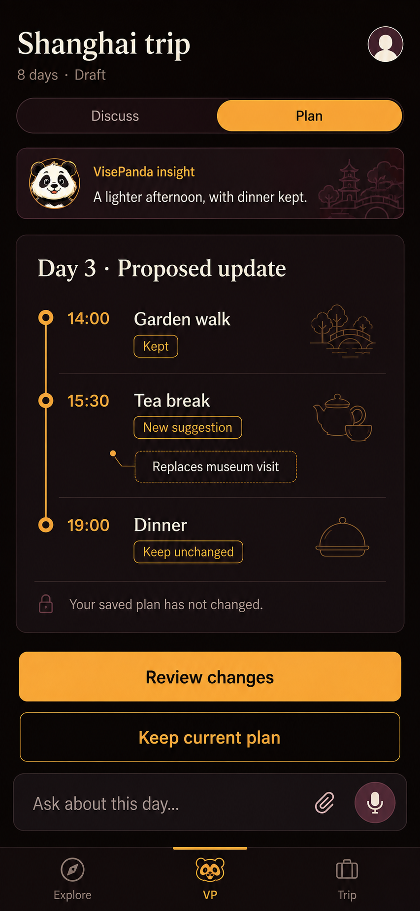

# VisePanda VP Journey Agent V2：规划、执行与陪伴的完整设计

> **V2.1增补｜2026-09-03：AI-native与原生iOS UIUX。**最新研究在第17～25节，包含同类产品、Chatbot＋规划的展示结构、三张静态效果图、原生前端/动效规格、对抗评审和验收方案。第1～16节保留原V2正文与当时的证据状态；本轮不重定模型/地图/价格，不实施App。三张图是设计候选，未选定、未实现，也不证明真机交互。

建议先读第19节的展示结构、第20节的原生用户路径、第21～22节的视觉/动效，再看第25节的取舍与下一步。原临时工作区失效后，部分V2历史附录链接尚未恢复；本轮新附件与效果图存于稳定研究目录，不再依赖临时目录。

日期：2026-09-03（北京时间）。读者：JT、产品设计、iOS、服务端、知识运营与客服团队。

状态：**研究与设计建议；不是已实现、已采购、已通过模型实测或获准发布的工程基线。**本轮仅修改研究文档、交接索引和研究验证脚本，未改变产品运行代码、数据库、线上服务、供应商账户、支付或用户数据。

本文承接 [第一版 Agent 研究](VISEPANDA-VP-AGENT-ARCHITECTURE-RESEARCH-2026-09-02.md)，更新其模型、地图、运营、RAG、复用与分期建议。JT已同意第一版第17节的 VP Journey Agent 总体方向。本轮新增要求及对规划能力的修正优先于旧研究建议；原始 Grill-Me 记录不改写，当前工程ADR和LAUNCH计划也不因本文自动改变。

## 阅读导航

- 产品方向与规划主路径：第1～3节。
- 千问、GLM、DeepSeek如何选择及成本：第4～5节。
- 留资、客户档案、管理后台：第6节。
- 三家地图比较：第7节。
- 知识库与RAG落地：第8节。
- 具体复用哪些设施：第9节。
- 原生iOS前端、UIUX、离线与多端：第10～11节。
- 实验、分期、评审、待决项：第12～16节。

## 1. 结论：规划不是被替换的旧能力，而是组织整段旅程的主线

**推荐把VP定义为：能与你一起规划中国旅行、帮助安排落地，并在旅途中持续接回上下文的智能旅行管家。**

规划负责把模糊愿望变成可讨论、可修改的安排；执行负责把安排变成真实结果；陪伴负责在变化与困难中保持连续。这三者是同一产品的不同工作状态，不是三个相互割裂的App。

这次需要纠正的，是“打开VP→导入材料→管理已有行程”容易造成的偏移。它会把没有订单、只有想法的用户排除，也会把VP误做成一个资料整理器。**材料是规划的输入之一，不是开始使用的门票。**

但“规划是核心”不等于“每次都先规划”。已经走出地铁站、需要找到酒店入口的人，应直接获得现场帮助；已经有安排的人，应直接检查或局部修改。

### 1.1 七项要求与本轮处置

| JT要求 | 本轮建议 | 决策状态 |
| --- | --- | --- |
| LLM限定千问、GLM、DeepSeek | 三家内比较；Qwen优先试验，两档路由，其他家按任务竞争 | Provider范围已明确；具体模型尚待实测 |
| 保留对话并向管理人汇报客户情况 | 服务会话原文＋动态断言＋有来源的运营报告＋服务任务 | 功能方向明确；期限、用途及访问合同待定 |
| 高德/百度/腾讯均可 | 单主供应商；高德先测，百度英文方案为强挑战者 | 不再限定高德；采购未决定 |
| 深化知识库/RAG | 一个领域事实体系，分域检索，多用途投影，按要求检查证据覆盖 | 详细提案，未建设真实检索 |
| 深化复用 | 明确库、接入位置、VP保留责任、失败退出方式和验收 | 未安装依赖 |
| 接受VP Journey Agent | 保留一个VP身份、领域真相、有限动态推理和受控执行 | 总体方向已确认 |
| iOS优先 | 第一条完整用户路径在原生iOS完成，不先交Web替代品 | 开发优先级已调整；其他首发范围需同步治理 |
| 补充：规划仍是主要工作能力 | 无资料起步、材料中途加入、全局/局部规划、比较与确认都进入iOS核心 | 保留规划明确；具体UX仍是建议 |

### 1.2 我推荐的组合，而不是“全部都上”

1. 一个VP、一个服务端协调入口；普通问题一个模型加必要工具。
2. 强模型先建立规划质量基线；通过实测后再把适合的任务交给普通档。
3. 一个主地图体系；第二家只有在权限、效果和恢复收益明确后参与。
4. 关系数据库持有用户、Trip、订单、权限和事实；检索索引与运营报告可重建。
5. 原生SwiftUI；手机上能完成完整规划，Web以后提供更舒展的同Trip操作面。
6. 运营人员从报告接回真实工作，不依靠无限制读取所有人的全部数据。
7. 第一版先做完整的小闭环；全国内容、所有预订品类、复杂社交和多Agent协同逐项证明收益。

“最完善”应理解为关键路径、失败处理和验证方法完备，不是第一版组件数量最多。

## 2. 补足此前容易遗漏的维度

| 维度 | 为什么会改变设计 | 本轮处理 |
| --- | --- | --- |
| 规划入口与阶段成果 | 只围绕订单会漏掉最重要的行前用户；无限优化又会失控 | 三入口、四类阶段成果、迭代停止条件 |
| 真实中国网络路径 | 中国LLM不等于App、API、数据库在中国稳定可用 | 分开评估整条网络链路，见第11节 |
| 海外行前与境内在途 | 同一地图能力可能有不同终端地区许可 | 采购按用户使用范围核对，不只看服务器地域 |
| 语义更新滞后 | 用户已纠正，结构化档案可能尚未更新 | 输入已接收/已解释的前沿门，见第6节 |
| 来源预览的权限 | 能看预算字段不等于能下载整张私人截图 | SourceViewRef与原附件权限分开 |
| 设备与账号切换 | 服务端RLS正确仍可能发生本地缓存、推送或语音泄漏 | 本地命名空间和通知绑定主体 |
| 成本的分母 | 一次问题可产生多次检索、模型和矩阵调用 | 用户权益、平台成本、旅行资金三账分离 |
| 内容维护而非仅入库 | 昨天正确的信息可能不适用于下月某天 | 来源版本、适用时点、例外、撤销及索引同步 |
| 运营容量 | AI发出了转人工通知，不等于员工已接单 | accepted与下一更新时间、工作队列、未解决状态 |
| 跨语言的真实理解 | 五语UI不等于五语地图、OCR、ASR、TTS都合格 | 能力×语言×OS版本验收，不作整体推断 |
| 退出与回滚 | 更换模型/地图/框架不能带走用户旅程真相 | VP领域合同保留权威，供应商适配可替换 |

## 3. 规划能力应怎样造

### 3.1 三个入口，共享同一个Trip工作空间

| 用户当下的状态 | 打开VP后的主要动作 | 第一个应得到的成果 |
| --- | --- | --- |
| 有出行想法，缺少具体安排 | 说一句想法；也可浏览Explore找灵感 | 两个有区别的方向，或带明确假设的初步安排 |
| 已有攻略、收藏、订单或部分行程 | 带入现有内容，可在对话中继续补 | 哪些已确定、哪些冲突、下一处值得调整 |
| 已在路上 | 说眼前问题，使用现场表达、路线或讲解 | 可以执行的下一步，或清楚的核实/接管路径 |

三条入口可相互切换。不要让“创建Trip”“填写日期”“上传文件”成为所有交互的强制前置步骤。需要长期保存时再进入相应账户与Trip范围；这不自动开放当前工程尚未批准的匿名写入。

公开产品也支持这一方向：TripGenie把规划、加入已订项目、共同修改和旅中提醒结合；Mindtrip同时提供想法规划与材料入口。这证明组合方式有先例，**不证明VP一定有转化优势，也不证明对方内部用了什么Agent架构。**[TripGenie功能说明](https://www.trip.com/newsroom/tripgenie-new-features-2/)、[Mindtrip产品入口](https://embedded.mindtrip.ai/home)

### 3.2 “规划”包含什么

| 层次 | VP应帮助用户决定 | 不应假装已经完成 |
| --- | --- | --- |
| 旅程方向 | 城市组合、主题、旅行节奏、停留天数 | 用户已经选定 |
| 空间与时间 | 住宿区域、城市间交通、每日区域安排、合理缓冲 | 未来交通时间已保证 |
| 实际准备 | 预约、支付工具、网络、入场条件、所需材料 | 下载软件就一定注册/支付成功 |
| 费用与取舍 | 预算构成、住宿档次、交通与活动的替代方案 | 估算就是当前成交价 |
| 既有安排 | 已订酒店/车票、不可轻易移动的项目 | 用户说“订了”就是供应商核验成功 |
| 变化与恢复 | 天气、疲劳、延迟、关闭后的最小调整 | 已自动取消、退款或重新购买 |

手机不需要完整复制桌面大画布，但必须具备等效能力：加减项目、调整日期/顺序/时间、设定不可移动项目、比较方案、修改局部、检查影响、确认及恢复。

### 3.3 一轮规划的完整流程



推荐四类阶段成果，而非每次都生成“最终完美行程”：

- **方向比较**：例如两个城市组合，各说明旅行感受、移动负担和费用构成。
- **条件性草稿**：使用相对Day 1/Day 2或日期范围；未知项明确，不制造具体营业时刻。
- **定日安排**：用户给出日期后，重新核对受到日期影响的预约、营业与交通条件。
- **局部修改**：只调整用户希望改变的部分，同时说明影响范围。

日期从相对日变成具体日，本身就是重新检查依赖的触发器，不能等到购买时才检查。用户可以确认自己的安排，但“用户已确认”与“当前证据支持可行”始终分开。

### 3.4 Agent内部如何分工

| 模块 | 职责 | 必须守住的边界 |
| --- | --- | --- |
| SituationCompiler | 当前目标、最新表达、已确认安排、有效偏好、未决事项组成最小上下文 | 不以运营摘要替代最新原始输入 |
| Planner | 生成方向、方案或局部变更候选 | 只能提出候选，不把建议写成订单或授权 |
| PlaceResolver | 别名、中文原名、地点及入口消歧 | 同名结果要结合城市/地点，不能靠向量最高分决定 |
| EvidenceService | 按每项要求寻找适用证据与例外 | 资料相关不等于适用于此人、此票种、此时刻 |
| ConstraintEngine | 时间、移动、预算、预约、固定项目等确定性校验 | unknown不能当pass；真实路线与缓冲必须覆盖间隔 |
| ProposalService | 生成与当前Trip的差异，供用户比较与确认 | confirmed Trip仅经受控确认与原子Patch |
| Journey/Service任务 | 接回准备、现场帮助和已接受人工协助 | 通知已发不等于已履约 |

这些是逻辑模块，**不要求七个常驻LLM Agent、七套服务或每轮七次调用**。许多步骤只需SQL、规则或状态机。

### 3.5 如何既聪明又不形成审问感

先给基于当前信息有用的结果，再把最能改变结果的问题做成可跳过选项。不反复索取预算、日期或同行人数；没提供就说明采用的口径和未知范围。预算估算可先按每人/每晚表达，但不能擅自折算成全团成交金额。

例如用户说“暑假可能来中国八天，想轻松一点”：先比较两种城市组合及移动成本，而不是先连续追问十个字段。收到“已有上海入境机票”后再调整起点，不推翻用户已接受的全部偏好。

每轮只推进一个明确成果。没有新约束、新证据或新的比较目标时，停止内部反复优化，呈现真实取舍。用户要求再次改稿可以开启新迭代，但平台自己的失败修复、检索重试不是用户多问了一次。

“用户拒绝建议”只证明控制权受到尊重，不自动证明规划成功。拒绝错误方案与主动暂缓一个合格方案必须分别统计。

## 4. LLM：三家竞争，先质量基线，再决定路由

### 4.1 推荐顺序

**优先研究Qwen主线，不宣称Qwen已经质量最好。**理由是同一供应商下多模态、结构输出、向量/重排和语音接入较集中，便于先验证完整任务。用户体验和总成本若被DeepSeek或GLM超越，应允许换主线。

| 工作 | 首选试验候选 | 挑战者/备用候选 | 上线前证据 |
| --- | --- | --- | --- |
| 全局多日规划、复杂取舍 | `qwen3.8-max-0902` | `deepseek-v4-pro`、`glm-5.3`；中档`qwen3.7-plus-2026-05-26` | 同任务事实/约束、五语、重复可靠性及完整成本 |
| 轻探索、解释、导游追问 | `qwen3.8-flash`，简单任务关思考 | DeepSeek Flash非思考；GLM Flash低思考强度 | 不能因便宜默认合格；也不能用简单问答掩盖规划失败 |
| 图片/材料理解 | Qwen Flash；关键/困难材料对照Max | `glm-5.3-flash` | 日期金额、跨页条款、否定、实体与覆盖率 |
| 增量字段候选 | Qwen Flash起测；模板生成报告 | GLM Flash；便宜Qwen版本作为消融 | 不把推测、员工观察升级成事实 |
| 向量/重排 | Qwen独立Embedding/Rerank模型 | 同供应商不同规格作对照 | 不是让聊天模型兼做所有检索工作 |
| 确认、权限、金额与订单状态读取 | 确定性逻辑，不调用LLM | 无需“更强模型审批” | 状态、权限、幂等、来源与版本测试 |

初期产品路由最多维持普通/强档两层，中档只有证明能替换相应流量才常驻。三家入围不意味着每个用户请求都发给三家，更不意味着三家都自动获得所有私人数据。

### 4.2 当前标准价

单位：每百万tokens；普通输入/输出，不假设优惠或缓存。**人民币和美元不混加。**

| 账户/模型 | 输入 | 输出 | 备注 |
| --- | ---: | ---: | --- |
| 百炼北京 Qwen3.8 Flash | ¥0.8 | ¥2.7 | 多模态；普通缓存读¥0.1 |
| 百炼北京 Qwen3.7 Plus快照 | ¥2 | ¥8 | 单请求≤256K；超过后¥6/¥24，不只给超出部分换档 |
| 百炼北京 Qwen3.8 Max快照 | ¥12 | ¥36 | 普通缓存读¥1.5；显式读¥1、创建¥15 |
| DeepSeek Flash峰时 | ¥3 | ¥9 | 谷时半价；峰缓存读¥0.10 |
| DeepSeek Pro峰时 | ¥9 | ¥27 | 谷时半价；峰缓存读¥0.30 |
| Z.AI GLM5.3 Flash标准价 | $0.15 | $0.50 | 缓存读$0.03；不用限时半价作长期预算 |
| Z.AI GLM5.3 | $1.40 | $4.40 | 缓存读$0.26 |

来源：[Qwen Flash](https://help.aliyun.com/zh/model-studio/qwen3-8-flash)、[Max](https://help.aliyun.com/zh/model-studio/qwen3-8-max)、[百炼总价表](https://help.aliyun.com/zh/model-studio/model-pricing)、[DeepSeek人民币价](https://api-docs.deepseek.com/zh-cn/quick_start/pricing/)、[GLM国际价](https://docs.z.ai/guides/overview/pricing)。DeepSeek峰时为北京时间工作日9–12、14–18时。BigModel中国人民币价本轮未核得，不用美元自行换算冒充中国报价。

两个新发现需要明确修订旧研究：Qwen3.8单模型页已列缓存价格；但Flash显式创建¥1.25与通用125%规则计算出的¥1.0不一致，Batch页面也有支持/不支持冲突。因此冷缓存、非Batch为基准，优惠另作待核分支。[缓存说明](https://help.aliyun.com/zh/model-studio/context-cache)

### 4.3 不能用一个“兼容接口”抹平的差异

- Qwen与DeepSeek相关模型默认可开启思考，普通路径应显式设置，不依赖默认。DeepSeek思考工具往返可能要求回传历史reasoning，后续输入账不能漏。
- GLM5.3及Flash不能关闭思考；低档任务也不能假设思考tokens为零。GLM强档仅文本，Flash才是原生多模态。
- DeepSeek严格工具输出仍有Beta入口与schema子集要求；其视觉实验模型是独立ID，不等于文本Flash附图即可用。
- Qwen列有JSON Schema支持；GLM本轮核得JSON模式与客户端校验，未核得同等服务端严格Schema保证。正确JSON仍可能是错误事实。

来源：[Qwen思考](https://help.aliyun.com/zh/model-studio/deep-thinking)、[Qwen结构输出](https://help.aliyun.com/zh/model-studio/qwen-structured-output)、[DeepSeek思考](https://api-docs.deepseek.com/zh-cn/guides/thinking_mode/)、[严格工具](https://api-docs.deepseek.com/zh-cn/guides/tool_calls/)、[GLM5.3](https://docs.bigmodel.cn/cn/guide/models/text/glm-5.3)、[GLM Flash](https://docs.bigmodel.cn/cn/guide/models/vlm/glm-5.3-flash)、[GLM结构输出](https://docs.bigmodel.cn/cn/guide/capabilities/struct-output)。

每个ModelProfile应记录：供应商与合同主体、账户/地域、请求ID与观测版本、输入模态、思考设置、schema能力、上下文阈值、价格版本、usage归约规则、超时/取消、数据用途和允许的接收方。密钥只在服务端。

### 4.4 路由不是按“Free用笨模型、Plus用聪明模型”

用户档位决定可用额度、工作深度和商品范围；任务风险、复杂度及证据决定合格模型。两者分开。

处理顺序建议：

1. 先查权限、用途、地区、能力与权益。
2. 精确读状态/规则能完成的，不调用模型。
3. 选择通过该任务切片验收的最简单路线；复杂规划可直接进强档，不必先让小模型失败一次。
4. 只有允许的失败可升级；升级前重新检查接收方、数据、剩余预算及用户输入前沿。
5. 有限重试仍不合格时，保存已完成成果、未知项和接续路径，不静默降质量或虚报成功。

供应商故障切换、schema修复、任务难度升级是三件事，应分别计量。安全拒绝或政策限制不应通过换模型绕过。

## 5. 成本：按“完成一段旅行工作”计算

### 5.1 统一公式与任务口径

```text
一次尝试模型费 = (普通输入×入价 + 缓存读取×读价 + 缓存创建×写价
                + 已计费输出×出价) / 1,000,000
完整任务成本 = 所有模型尝试 + 工具/检索/地图 + 媒体
             + 存储/后台/恢复 + 分摊的人工和固定费用
```

已计费输出若已包含思考，不再另加一遍。模型取消不保证供应商不计费；usage尾包缺失记待核账，不当零。用户一次Ask、内部attempt、实际供应商调用、地图计算对分别有ID和计数。

下面均是**人工设定负载，已复算算术，未做模型或用户实测**。I是全部调用累计输入，Y可见输出，R计费思考假设，不能由图片张数直接推断图像tokens。

| 任务 | I / Y / R | Qwen候选模型费，CNY | DeepSeek文本主线，CNY峰/谷 |
| --- | --- | ---: | ---: |
| 零资料探索 | 4K / 600 / 0 | 0.00482 | 0.0174 / 0.0087 |
| 全局多日规划，3次调用合计 | 44K / 4.8K / 12K | 1.1328 | 0.8496 / 0.4248 |
| 局部修改 | 24K / 2.4K / 6K | 0.5904 | 0.4428 / 0.2214 |
| 可选资料提取 | 8K / 1.6K / 0 | 0.01072 | 同左，Qwen视觉路径 |
| 确认后自然语言说明 | 5K / 600 / 0 | 0.00562 | 0.0204 / 0.0102 |
| 新导游追问，含下述语音 | 6K / 800 / 0 | 0.10086 | 0.1191 / 0.1065 |

全局/局部用Max或Pro，其他用Flash。纯确认和状态读取可无LLM。若Qwen Plus在局部修改上通过非劣，同一假设为¥0.1152，不能先省钱后再证明质量。

语音按北京ASR Streaming ¥0.00033/秒、TTS Plus ¥1.4/万计费字符，30秒输入＋600计费字符输出为¥0.0939。计费字符不是所有语言统一的字数，中文计数规则需按供应商归约。新追问与播放已生成片段分开；Realtime端到端计费不能再叠加同一音频的ASR/TTS。[语音价格](https://help.aliyun.com/zh/model-studio/model-pricing)、[TTS规格](https://help.aliyun.com/zh/model-studio/tts-model)

### 5.2 一个活跃旅行周期，不是“平均用户每月”

假设40次轻探索、4次全局规划、10次局部修改、10次资料提取、30次接回说明、60次新的导游语音追问；各项互不重复计数。

| 路线 | 模型＋指定语音子账 | 不能据此推导 |
| --- | ---: | --- |
| 所有任务Qwen Max参考 | ¥28.8852 | 参考模型自动合格 |
| Qwen Flash/Max候选 | ¥16.9554 | 已经不损失质量 |
| 其中局部修改改Plus | ¥12.2034 | 可直接降档上线 |
| DeepSeek文本＋Qwen图像/语音 | ¥11.0644～16.3876 | 所有请求都能享谷价 |
| GLM主线 | 模型$1.50118，另北京语音¥5.634 | 可以不核汇率/地区就与人民币合并 |

GLM轻任务不能R=0，上表另假设探索/导游/导入/接回思考分别1.2K/1.6K/0.8K/0.8K；复杂规划沿用相同假设。GLM使用国际标准价，不是中国人民币报价。

若Qwen全局规划思考量翻倍且完整重跑一次，模型费变为¥3.1296；局部变为¥1.6128。连续20次此类全局规划是¥62.592，尚未计其他费用。这个反例只说明无限内部优化有真实成本，不是预测某用户会产生多少亏损。

### 5.3 知识与运营的后台账

- 10,000个片段、每个450 tokens，北京Embedding ¥0.5/百万：首次向量化约¥2.25。
- 100,000次查询、每次90 tokens：查询向量约¥4.50。
- **100,000次实际重排调用**，每次24个候选、每候选450＋重复查询90 tokens：约¥648。若每个用户问题调用三次重排，则对应¥1,944，而不是¥648。
- 100,000个1024维float32向量原始值约390.625 MiB；不含索引、元数据、备份和副本，不能当数据库所需总内存。
- 12K-token会话分20次更新：每次重读累计历史共126K输入；每次新增600＋当前字段500共22K输入。每次输出200，共4K输出，用Qwen Flash示例为¥0.0284；不含重试、回查和存储。不能凭输入更少推断提取质量相等。

Embedding和Rerank价格/计量依据：[Embedding API](https://help.aliyun.com/zh/model-studio/text-embedding-synchronous-api)、[Rerank API](https://help.aliyun.com/zh/model-studio/text-rerank-api)。对小规模知识库，内容审核和维护往往比一次向量化更值得经营关注；这是成本结构推论，需以实际工时确认。

### 5.4 Free、Plus与经营边界

本轮不重新冻结售价和额度。保留三本账：用户权益、VP计算费用、旅行资金/履约义务。

Free也应完成一个有意义的阶段成果，而不是每一步都被配额切断。Plus可提供更多规划迭代、资料处理、讲解和有触发依据的旅程服务；事实诚实、已知风险、停止操作、纠正信息、隐私控制、已有订单的必要状态与售后不能作为劣质免费体验。

每一档都要按普通用户、重度规划、语音用户、免费奖励/试用、滥用和尾部失败分别算。服务端内部修复不等于用户追加付费Ask；反过来，用户长期要求新全局方案也不是零成本。

完整经营式应使用实际净收入和实际合同：净收入减模型、地图、媒体、存储、人工、退款、支付/税费和免费用户补贴；没有这些参数，不声称利润率或“无限聊天一定可持续”。

## 6. 运营留资：做成动态服务档案，而不是一篇不可核实的画像

### 6.1 应该保留什么

支持保留具有适当处理依据、已向用户说明的完整服务对话，让管理人能真正了解情况。**保存原文、长期个性化、员工查看、外部伙伴转交、营销和训练是不同用途，不能因为允许其中一个就默认全部允许。**

| 数据对象 | 内容 | 是否为权威 |
| --- | --- | --- |
| ServiceConversation | 用户实际提交的消息、已交付的AI/员工回复、必要附件引用 | 是沟通过程的记录，不证明消息里的外部事实成立 |
| ProfileAssertion | 需求、预算、偏好、表达方式、来源与确定性 | 是有来源的陈述/推测；不同字段权威不同 |
| TripPlan | 用户确认的安排和版本 | 是用户意图权威，不是供应商已成交证明 |
| OrderReality | 已核订单、状态、报价或供应商回执 | 外部现实单独维护，不能由聊天摘要覆盖 |
| ServiceCase | 请求、接单、负责人与下一步 | 是服务工作状态，不与聊天结束混同 |
| OpsReport | 管理人或员工可见的当前摘要、变化、冲突与待办 | 可重建投影，不另造客户真相 |

系统提示、隐藏思考、未播放/未展示的草稿、ASR临时片段不能被记成客户听过的答复或作出的授权。语音播放记录也只证明交付进度，不证明理解或同意。

### 6.2 一个字段需要保留的结构

建议字段合同如下，属于设计草案：

```text
ProfileAssertion
  id, subjectRef, scope(user/trip/task)
  facet(goal/budget/dates/party/constraint/preference/communication)
  representation(wish/discussable_assumption/draft/confirmed_plan/order_reference)
  epistemicStatus(user_stated/inferred/externally_verified/disputed/stale)
  typedValue, sourceRefs(message/event/span), sourceOccurredAt
  revision, supersedes, conflictsWith, validUntil
  purpose, audiencePolicyRef, lawfulBasisRef, consentRef?
  sensitivity, retentionPolicyRef, lifecycle
```

`representation`与`epistemicStatus`是两根轴。例如“用户说已订的机票”是order_reference＋user_stated，不因为看起来是订单就变externally_verified。愿望、假设、草稿、确认和订单也不是一个“客户成熟度评分”。

预算至少同时保存金额、币种、人数口径、周期、包含/不含项目、是否可讨论。¥12,000/两人/8天/不含国际机票，不能摘要为“高预算用户”，也不能误记成每人预算。

### 6.3 对话口气：记录服务方式，不诊断人

可记录：用户明确要求先结论、最多两个选项、偏好文字或语音、希望减少重复提问、本次对等待提出投诉。反复短答偏好可作为短效、可见、可纠正的软推测。

不应推断：收入高低、人格好坏、心理诊断、容易被说服、适合加价、宗教或健康等敏感特征。尤其不能把反复找便宜酒店推成“经济能力低”，更不能让这个推测改变报价公平性。

推测标签必须贯穿档案、模型上下文、卡片和语音。不能Profile写“可能”，到了VP回答却说“我记得你最喜欢”。运营摘要也不能回灌为新的独立证据，反复摘要同一消息不增加可信度或刷新有效期。

### 6.4 动态更新：一个解释入口，一个投影Observer



Observer负责增量候选、索引、报告，不应是第二个自由写事实的Agent。普通候选经共同领域校验才能提交；前台已提交的解释结果直接消费，不重复猜一遍。

建议节拍：结构化确认/撤权事务即时生效；有实质新增内容的提取在Turn结束或空闲30～90秒合并；转人工生成明确截止点的交接包；管理日报以字段和任务聚合为主。时间只是试验配置，不是24小时服务SLA。

**关键新增门：不能只让报告显示“尚未整理”，却继续执行旧指令。**

- 收到消息即推进相应scope的`acceptedInputSeq`，无需先猜它是不是纠正。
- 解释提交记录`interpretedThroughSeq`及变更/无相关变更的依据。
- 新的确认、采购、对外承诺检查所依赖scope的输入前沿；仍有未解释输入时，先处理或由获权人工核实。
- 自然语言纠正不可能在模型识别前神奇地成为准确结构字段。报告标明截止点和待处理；重要后果动作受门控制。
- 不阻断讨论性规划、查状态、必要交易对账。不要因为一句无关闲聊永久锁死所有Trip；解释结果应缩小影响范围。
- 额度耗尽仍保留停止、结构化纠正、隐私和已有服务入口；不能迫使用户付费才能阻止旧指令。

人工也要提交已核实到哪个输入前沿的回执，不能有绕过新输入检查的“万能执行”按钮。服务有明确负责人，但不承诺创始人永不睡觉。

**模型故障时仍有免费、无模型的用户自助路径。**向本人展示逐条待处理输入，可明确撤销本人某条规划指令，或用完整的结构化字段重新表达该指令；服务端记录逐事件的withdrawn/reexpressed处理回执，清理其未执行的派生意图，再推进连续已处理前沿。不能一键跳过全部未读输入，也不能借此处理其他主体的授权或把隐私/资金指令当普通规划文字略过；这些走各自专用确认。已经发生的外部动作不能撤销历史，需要正常退改流程。之后手动确认仍检查当前版本、证据和权限，不依赖模型重新上线才能继续。

### 6.5 管理员一页报告示例

以下用户、消息与回执均为虚构，用于设计验收。

> **Alex / U-024｜当前在比较城市组合**
>
> 用途：本次协作规划与已请求服务。已整理至m58；另有2条待解释，不可据旧条件新增购买。
>
> 负责人：Mei，14:18已接单；下一更新：16:00。未获购买授权。

| 管理人要知道什么 | 当前记录 |
| --- | --- |
| 旅行愿望 | 建筑、茶文化、慢节奏；希望少搬酒店。[m12] |
| 暂定条件 | 11月上旬约8天、两名成人；日期仍可讨论。[m17] |
| 预算口径 | ¥12,000/两人/全程，不含国际机票；不是每人。[m44纠正] |
| 两个草稿 | 上海＋杭州，或成都及周边；均未最终确认。[draft-v3] |
| 已确认取舍 | 最多两个住宿城市，避免连续两天早起。[c7] |
| 外部订单情况 | 用户说已有国际机票，未核验；与“日期可调整”有待澄清处。[m51/m55] |
| 表达偏好 | 用户明确希望先给结论、最多两个选项。[m38] |
| 最近服务问题 | 对重复询问日期提出不满；不是人格标签。[m56] |
| 可以立即推进 | 不必等精确日期，先比较城市组合、移动负担、费用构成 |
| 下一关键澄清 | 机票是已出票、暂留还是候选？不要重新发整套问卷 |
| 联系边界 | 允许站内服务联系；未同意营销邮件 |

动作：查看获准来源、核实字段、比较草稿、接单/转交、安排获准跟进、记录实际结果。报告的价值是让员工少问重复问题、及时接住工作，而不是把所有字段都填满。

### 6.6 权限：Owner可全面管理，但不把所有人的数据无差别散出去

| 角色 | 正常权限 | 额外门 |
| --- | --- | --- |
| Owner/服务负责人 | 获准服务用途下的客户报告、任务和服务原文 | 敏感附件、批量导出、临时扩权单独控制和审计 |
| 已分配规划顾问 | 对应客户/Trip/任务的必要字段与相关沟通 | 不自动获得其余私人Trip、全部Memory或整库搜索 |
| 内容编辑/社区审核 | 公开内容候选、审核队列、去敏知识缺口 | 不因审核UGC就能看用户聊天 |
| 财务/售后 | 对应订单、金额、退款及必要资料 | 不需要全部旅行偏好与对话口气 |
| 营销 | 获准营销联系资料及拒收状态 | 不直接使用服务原文、敏感信息或情绪弱点 |
| 外部伙伴 | 已分配任务的最小履约包 | 不直接访问整个客户档案 |

同一人可兼多个角色，但读、改、导出、分配、权限管理仍分开记录。不能把“管理系统登录成功”当行级/字段级权限。

**来源钻取要单独设计。**`SourceRef`定位证据；`SourceViewRef`是当前访问者获准看到的片段。员工能看预算，不能顺着链接下载包含同行者隐私的整页PDF。预览保留必要表头和限定条件，遮蔽无关私密内容；若遮蔽后证据不再完整，就标证据不足或请求授权，不拼出误导性摘录。原附件下载、旧链接、导出都重新鉴权。

共享Trip按数据主体和用途处理。组织者提到同行者健康需求，不自动代表同行者同意长期画像。运营服务处理也不能成为绕过用户关闭个性化、关闭长期记忆或现有Free记忆权益限制的后门。

### 6.7 后台应由哪些工作区组成

第一版运营后台推荐：**客户与会话、规划与服务任务、知识与内容审核、用户权利与权限、运行质量与成本**五个工作区。共享身份和审计，不为了菜单拆五套系统。

客户工作区的三个主视图：今天该推进的服务、用户目前在决定什么、最近发生的重要变化。排序优先明确期限、已承诺更新和无人接单问题，不把无日期、无订单或预算少的用户自动判为低价值。

知识/内容工作区允许上架下架、修订、来源比对、失效传播；用户工作区提供查阅、更正、导出/删除请求及实际执行进度。成本工作区优先看不含正文的聚合数据。平台审核不意味着所有员工必须读取全部私人内容。

### 6.8 如何复用客服/CRM能力

借Intercom的服务节点摘要思路；借Chatwoot的联系人/会话属性区分、负责人、等待状态和提交后事件。不把“会话摘要”当完整的跨会话客户档案。[Intercom摘要](https://www.intercom.com/help/en/articles/8414839-trigger-ai-conversation-summaries-using-workflows)、[摘要能力边界](https://www.intercom.com/help/en/articles/6955446-ai-features-available-in-the-inbox)、[Chatwoot属性](https://www.chatwoot.com/hc/user-guide/articles/1677502327-how-to-create-and-use-custom-attributes)

Chatwoot可作人工收件箱候选，但VP保留Trip、授权和报告的权威。其公开“结单必填属性”不对API执行同样检查，message webhook会携带正文/private标记/附件；不能照接后默认满足VP规则。[结单说明](https://www.chatwoot.com/hc/user-guide/articles/1769161760-required-conversation-attributes)、[固定源码](https://github.com/chatwoot/chatwoot/blob/bfd9d9e0ae1918db62c22abea98d1565315f14d8/app/models/message.rb#L174)。核心与企业能力许可分开，审计日志不能想当然地视为免费核心。[许可证](https://github.com/chatwoot/chatwoot/blob/bfd9d9e0ae1918db62c22abea98d1565315f14d8/LICENSE)

### 6.9 保存期限、删除与法律输入

不要在代码里写“永久保存全部”。本轮建议设计可配置期限：活动服务对话按服务需要保留；结案后设置明确复核/删除期限；无Trip的会话另设窗口；长期偏好、敏感附件、质检样本、订单必要记录各自适用规则。**具体天数尚未由JT及法律/运营负责人确认，本文不制造一个已生效的90天或三年承诺。**

用户能看清保留了什么、为什么、谁会看到、如何纠正或停止使用。删除应覆盖原文、派生断言、检索索引、报告、缓存和可控制的连接器副本；必要留存例外单独隔离用途。逻辑停用可先行，物理清理/备份轮转进度真实展示，不写请求已接收就等于全部删除。

法律设计输入包括个保法的目的与最小必要、处理依据、保存期限、敏感信息、自动化决策、更正删除和访问控制；普通服务摘要不自动等同于被禁止的重大自动化决定。适用GDPR也不能只看国籍。[个保法](https://www.cac.gov.cn/2021-08/20/c_1631050028355286.htm)、[GDPR原文](https://eur-lex.europa.eu/eli/reg/2016/679/oj/eng)

出境需逐活动判断，不是一揽子同意或旅行行业全部豁免。2026年网信办问答说明特定法定处理依据下可不取得个人同意但仍须告知；酒店机票的必要活动豁免也不自动覆盖海外CRM全量画像同步。[2026问答](https://www.cac.gov.cn/2026-07/24/c_1786638883119336.htm)、[2024跨境规定](https://www.cac.gov.cn/2024-03/22/c_1712776611775634.htm)。这些是设计依据，具体适用须专业审查。

## 7. 地图：单主体系，按外国旅客任务比较

### 7.1 先拆开五种采购对象

底图展示、地点搜索、路线/矩阵、导航、离线能力不是同一接口；商业授权、增量流量、QPS和英文高级服务也不是同一费用。不能拿SDK能运行证明商用许可，也不能把一笔年费理解为所有能力全包。

| 公开项目 | 高德 | 百度 | 腾讯 |
| --- | --- | --- | --- |
| 基础年度授权 | ¥50,000 | ¥50,000 | ¥50,000 |
| 高阶套餐 | ¥100,000 | ¥100,000 | ¥70,000 |
| 对应公开授权期 | 372天 | 372天 | 372天 |
| 普通地点搜索额度 | 搜索组50万/月共享 | 5万/日 | 地点搜索5万/日；详情另列额度 |
| 路线配额口径 | 基础LBS组900万/月共享 | 相应路线/矩阵表列30万/日 | 步行/公交等各表列50万/日 |
| 普通增量搜索示例 | ¥30/万次 | ¥300/12万次包 | ¥300/10万次包，阶梯另核 |
| 矩阵计量 | 本轮未核清相关批量端点扣量 | 起点×终点计算对 | 起点×终点计算对 |

资料：[高德定价](https://lbs.amap.com/upgrade)、[计费细则](https://lbs.amap.com/pages/base_service_price)、[百度授权](https://lbs.baidu.com/cashier/auth)、[百度配额](https://lbsyun.baidu.com/cashier/quota)、[腾讯授权FAQ](https://lbs.qq.com/faq/authorizationFaq)、[腾讯配额](https://lbs.qq.com/dev/console/quotaImprove)。数字为公开档位，实际签约、阶梯、适用端点和增项尚未取得。额度内不再重复计费；升级可能性不当默认权益。

### 7.2 对VP最重要的差异

| 任务 | 高德 | 百度 | 腾讯 |
| --- | --- | --- | --- |
| 中国境内英文地图 | 国内旧iOS接口有中/英，英文栅格与样式有限制 | 明确的境内矢量英文高级付费服务 | 当前核到的是海外图语言接口，不能当境内英文证明 |
| 英文POI/步行/公交 | POI2.0列zh/en高级服务；完整指引要核具体套餐 | 英文POI、iOS步行导航、公交均有官方高级服务说明 | API存在，但境内英文完整链路待核 |
| 找到真正入口 | 导航点、入口、出口字段 | 导航位置、父子点 | to_poi引导点；无效时可能退回坐标 |
| iOS原生接入 | SDK/桥接与原生封装 | SDK，官方有Swift配置 | QMapView及检索SDK |
| 离线 | SDK离线地图包 | SDK离线地图包 | SDK离线地图包 |

来源：[高德英文图](https://lbs.amap.com/api/ios-sdk/guide/create-map/english-map)、[高德POI2](https://lbs.amap.com/api/webservice/guide/api-advanced/newpoisearch)、[百度英文图](https://lbs.baidu.com/faq/api?title=englishmap/map/ios)、[英文步行](https://lbs.baidu.com/faq/api?title=englishmap/nav/walking-ios)、[英文POI](https://lbs.baidu.com/faq/api?title=englishmap/nav/geo)、[英文公交](https://lbs.baidu.com/faq/api?title=englishmap/nav/transit)、[腾讯iOS手册](https://mapapi.qq.com/sdk/map/iOS/doc/interface_q_map_view.html)、[腾讯路线](https://lbs.qq.com/service/webService/webServiceGuide/route/webServiceRoute)。

三家均未证明中国境内完整五语底图＋POI＋路线＋导航。VP应保留中文准确原名及可复制地址，在获准范围内提供用户语言说明，不能假装翻译后的地名就是供应商官方名称。离线看图也不等于离线获取实时公交、营业或库存。

### 7.3 许可可能先于效果决定可选范围

百度2026-08-24隐私政策第三部分（二）要求：向中国境外其他国家/地区自然人提供集成开放平台服务的应用，不能仅依线上协议，需要另行事先书面许可。子代理和主代理均在官方HTML复核到。这直接影响VP海外行前使用与全球分发，不能和“外国人在中国境内用英文地图”混为一谈。[百度隐私政策](https://lbs.baidu.com/docs/pcsa?title=compliance/openprivacy)

三家都应书面确认：海外最终用户、应用商店地区、服务端地域、中文/英文产品范围、长期地点ID映射、缓存与衍生、翻译/摘要/向量化、离线包、跨地图叠加展示、归属标识。**没有找到通用条款可直接批准VP把三家数据任意混在一起。**也不能反过来把官方允许的SDK缓存一概说成禁止。[高德条款](https://lbs.amap.com/pages/terms/)、[百度条款](https://lbsyun.baidu.com/docs/pcsa?title=law/open/law)、[腾讯商业协议](https://lbs.qq.com/userAgreements/agreements/commercialAgreement)

### 7.4 选一家还是多家

**推荐：单主供应商架构，高德先测，百度英文体系作强挑战者。**高德优先只是试验顺序，不因为旧代码已经选过就锁定。如果百度明显减少外国旅客的理解和走错路成本，且完整报价与全球使用许可合格，百度可以成为主供应商。腾讯保留为特定路线/矩阵和生态场景挑战者。

| 架构 | 收益 | 代价与启用条件 |
| --- | --- | --- |
| 单家 | 坐标/实体/归属一致、集成及合同较简单 | 要测覆盖缺口；故障时有诚实降级 |
| 主家＋备用 | 对特定故障、城市或能力缺口有帮助 | 第二份授权、保活测试及一致性；先证明收益 |
| 三家同时查 | 可能发现互补信息 | 多付查询成本；共同错误、来源关联及冲突难解；不默认采用 |

按公开基础档各买一份，单/双/三家的授权预算是5万/10万/15万元每372天；不是联合合同报价，不假设相互抵扣。单家5万元按30天摊约¥4,032.26；每30天100/1,000/10,000个Trip分别约¥40.32/4.03/0.40每Trip，未计其他地图费用。这是摊销假设，不是实际现金付款节拍，提示早期固定授权可能比文字LLM更重。

搜索流量示例：每Trip 30次搜索，月5万Trip共150万次；高德超过月搜索组50万的部分约¥3,000。百度/腾讯若均匀30天，普通搜索可能在所列日额度内；若集中15天，各有75万超额，按公开单包起购，百度需7包¥2,100、腾讯8包¥2,400，余量保留但受有效期/实际合同限制。不能拿均匀月均值覆盖节假日高峰。

### 7.5 MapProvider合同要防的具体错误

```text
ProviderPlaceRef = provider + providerPlaceId + providerDataset/version?
Coordinate = value + CRS + axisOrder + precision/source
RouteObservation = endpoints/entrances + mode + departureBasis
                 + durationUnit + status + checkedAt + applicability + rights
```

切换供应商时重建整套provider context：实体映射、坐标、入口、路线与归属。不能用A的POI ID、B的坐标、C的路线拼出似是而非的地图。VP自己的CanonicalPlace ID不意味着有权永久保存所有外部字段。

百度与腾讯矩阵按计算对数计量；腾讯某些失败结果可能只给直线距离、无duration，百度无结果可能给0，高德步行distance有5km范围约束。必须规范化为具体不可用原因，不能让0秒、直线距离或缺失时长通过规划检查。[百度矩阵](https://lbsyun.baidu.com/docs/webapi?title=routematrix/routchtout)、[腾讯矩阵](https://lbs.qq.com/service/webService/webServiceGuide/route/webServiceMatrix)、[高德distance](https://lbs.amap.com/api/webservice/guide/api/direction)

验证城市建议覆盖北京、上海、广州、深圳、成都、重庆、西安、桂林/阳朔，重点测同名酒店、航站楼、高铁站、景区入口、末班车、过街/台阶、弱网和五语用户输入。**这些是测试计划，不是已经测试八座城市。**

## 8. 知识库与RAG：详细建设方案

### 8.1 先明确：RAG不是事实数据库，也不是全部记忆

**VP要建设的是“有来源、适用范围和使用权的知识系统”；RAG只是把其中合格证据送入当前任务的方式。**

住宿订单、用户确认的日期、明确预算不能依靠语义相似度碰运气。它们应精确读取。相关游记可以辅助灵感，但不能证明某天某入口可以入场。一个旅行产品不能把全部信息统一成“相似片段”。

| 知识域 | 示例 | 保存/使用方式 |
| --- | --- | --- |
| 公共审核知识 | 中国旅行操作指南、地点稳定介绍、官方政策的适用解读 | 来源与权利登记、审核、版本化；许可内公开展示/检索 |
| 用户私人材料 | 截图、订单、PDF、收藏、用户计划 | 私有来源与解析结果；用户授权范围内使用，不进入公共库 |
| 用户/Trip记忆 | 明确偏好、当前旅程条件、短期软推测 | 类型化记录；按scope/用途/权益读取，不代替订单 |
| 供应商短效观察 | 路线、报价、营业、库存、交通状态 | 按次请求、时间与条件约束；不默认长期向量化 |
| UGC与运营经验 | 真实感受、避坑、问题反馈、员工内容 | 审核与身份披露；事实主张另核验，未经核验不升公共Fact |

这里是五类数据，不是五套数据库或五个Agent。一个关系库可以分schema/表/策略管理，关键是不能共用一条无差别资格判断。

### 8.2 核心数据模型

| 对象 | 关键字段 | 解决什么 |
| --- | --- | --- |
| KnowledgeSource | 来源主体、URL/文件定位、获取方式、权利、允许用途、更新时间 | 公开可看不等于可存储/衍生/训练 |
| SourceRevision | 内容hash、原文版本、获取时间、实际生效/适用时间 | 今天抓取不等于今天生效 |
| CanonicalPlace | VP实体ID、中文原名、获准别名、城市/区域 | 不把不同城市同名点合并 |
| ProviderPlaceRef | 供应商ID、CRS、入口、许可与期限 | 可替换供应商，不污染内部实体 |
| FactAssertion | 主体、谓词、值/单位、条件、有效期、来源、冲突、审核 | 一个事实主张及其适用条件 |
| GuideDocument/Playbook | 标题、目标、前提、步骤、分支、退出/求助、来源 | 能执行的流程，不是一长段旅游常识 |
| EvidenceChunk | sourceRevision、文档/Fact/Guide引用、页区/表格/段落、内容与受众 | 检索单元不伪装成独立事实 |
| IndexGeneration | 模型、维度、归一化、chunker版本、覆盖水位与状态 | 重建/部分完成可追溯，不混不同向量空间 |
| KnowledgeGap | 问题类型、缺失实体/字段、影响任务、去敏上下文、处理状态 | 为运营提供有价值的补库队列 |

Fact、Guide和chunk是不同层级。一份证据文档可支撑多个Fact，一个Fact也可需要多段证据。来源引用数量不是独立佐证数量；同一来源的重复转载不能当三次独立核验。

### 8.3 入库流水线

1. **接收与隔离**：允许类型、大小、页数；文件安全与来源/权利判断。附件文本、二维码、网页均视为不可信输入，不执行其中指令。
2. **原件登记**：私有对象引用、内容hash、来源版本、访问策略。原件不会因模型摘要而失去来源。
3. **解析**：数字PDF先取文本/结构；扫描件走OCR；复杂布局由Docling/PaddleOCR候选处理；模型只处理需要解释的区域。
4. **抽取候选**：地点、日期、金额、条件、步骤及不确定字段，保留页区定位和未解析区域。
5. **消歧与校验**：地点/主体、币种单位、日期时区、否定、表格条件、跨页例外。
6. **审核与发布**：公共库必须经过来源、许可和内容审核；私人材料可供本人使用，但不能伪装为已核公共知识。
7. **生成投影**：Explore、RAG、Guide片段分别按允许用途生成；用户材料不自动出现在Explore。
8. **索引与观察**：记录覆盖水位、失败原因、版本；未完成向量化时，合格精确/词法读取仍可工作。

Docling可借用结构化文档、页区、表头与token-aware切片。固定源码的`HybridChunker`默认`repeat_table_header=true`、`merge_peers=true`、`omit_header_on_overflow=false`；VP应给合并加相同来源版本、权利、主体与作用域限制。上游已有表头与切片测试，**本轮读了源码和测试，未运行它们。**[Docling切片](https://github.com/docling-project/docling/blob/c09ddfabff27b1ba6217ab47e207cb646b4ba023/docs/concepts/chunking.md)、[实现](https://github.com/docling-project/docling-core/blob/4210158d492f40e1b52d3d8a5ec2c1b6096d4d19/docling_core/transforms/chunker/hybrid_chunker.py)、[测试](https://github.com/docling-project/docling-core/blob/4210158d492f40e1b52d3d8a5ec2c1b6096d4d19/test/test_hybrid_chunker.py)

这些参数仍不能证明未漏掉第二页的“不可退款”。因此解析结果需要`coverage / unresolvedRegions / conflictingCandidates`；关键判断允许在原授权范围回取相邻条款和原片段。无法取得完整上下文就未知，不让强模型只读轻模型已经丢信息的摘要。

### 8.4 Chunk怎么切

以下是实验起点，不是固定万能尺寸：

- 稳定知识：按标题/段落和主题切，候选约300～600 tokens，保留上级标题及原始定位。
- 步骤指南：一个可完成步骤及前提/例外为单元，必要时保留整段短流程。
- 表格：行数据和表头绑定，币种/每人每晚/适用房型不能拆散。
- 政策/退改：适用条件、例外、否定和义务关联，不因为相似度较低就丢例外。
- 原子事实：优先结构化精确读；不要为了“每条必须有向量”机械复制。
- 用户材料：限定主体与Trip；不为提高召回而拼接无关用户或整段私人历史。

不默认对每个chunk额外调用LLM生成“背景摘要”。先使用可信标题、实体、城市与版本元数据；若试验表明上下文补全有效，再把生成内容标为派生背景，不能作为新事实引用。

### 8.5 检索链路：必须的证据不参加普通Top-K淘汰



具体步骤：

1. 解析意图、实体、当前Trip/探索范围、时间与用户语言；不把整个私人对话发给公共搜索。
2. 精确读已确认Trip、订单、明确预算与必要约束。
3. alias/中文名/拼音/地点范围先做实体召回和消歧；再进行FTS、trigram与向量检索。
4. 词法和向量两条分支都应用资格过滤；通过RRF合并，不比较不可比原始分值。
5. 需要时对例如24个合格候选重排；发给重排服务之前再次检查接收方、地区和用途。
6. 例如6～8条仅作为**可选背景**预算；9条必要证据不能因“只留8条”被删掉。
7. 独立读取例外/否定/冲突；对齐主体、入口、日期、票种、旅客条件和queryBasis。
8. 按要求返回覆盖、冲突、缺证或需现场核实，不用一个相关性分数当真实性概率。
9. 输出/保存/确认时重新校验权限代次和来源版本；检索时有权不等于一分钟后仍有权。

Supabase官方hybrid示例为Postgres全文检索＋向量＋RRF；其中`ts_rank_cd`不是BM25。不要把普通FTS写成已经实现BM25。ANN在过滤条件下可能少返回结果；需要按真实语料测exact scan、HNSW和有界iterative scan，不靠加大Top-K替代权限。[Supabase hybrid](https://supabase.com/docs/guides/ai/hybrid-search)、[RAG权限](https://supabase.com/docs/guides/ai/rag-with-permissions)、[pgvector过滤](https://github.com/pgvector/pgvector#filtering)

### 8.6 Embedding与Rerank推荐

| 环节 | 基线候选 | 挑战者 | 验收重点 |
| --- | --- | --- | --- |
| 文本向量 | `qwen3.7-text-embedding`，1024维 | `text-embedding-v4`；3.7 Flash | 五语跨语言召回、中文别名、错拼、否定、长文关键条件 |
| 词法/精确 | Postgres FTS＋pg_trgm＋alias表 | 有实际分词缺口再评估其他引擎 | 中文/混语不能仅靠默认英文分词 |
| 文本重排 | 北京`qwen3.7-text-rerank` | `qwen3-rerank`，或无重排对照 | 召回后任务相关性；关键例外不得丢 |
| 图片检索 | 首期优先OCR/结构化文本 | Qwen VL embedding/rerank | 仅在文本丢失空间/视觉信息时证明增益 |

模型支持的语言数量不是VP五语质量保证；1024维也不是证明最优。变更模型/维度/归一化需要新索引空间，双读比较后切换，不能把同维度不同模型的向量混在一起。[向量规格](https://help.aliyun.com/zh/model-studio/text-embedding-synchronous-api)、[排序规格](https://help.aliyun.com/zh/model-studio/text-rerank-api)

Rerank模型之间的端点、请求形状和响应包不同；不能只换model字符串。官方说明分数主要用于同次请求相对排序，不作跨请求绝对置信度。

### 8.7 版本、空结果与撤销

每个检索结果绑定`sourceRevision + chunkRevision + embeddingProfile + indexGeneration`。Fact更新到rev11而向量还在rev10，不能只检查Fact当前状态后，把旧chunk包装成新证据。

区分：无匹配、未进入知识库、合法材料尚未索引、权限不允许、供应商不可用、来源冲突和内容过期。它们的用户下一步不同，不能统一回复“没有这个地方”。

撤销来源或权限时先逻辑停用相关投影、缓存和待确认依据，再处理物理清理。已经确认的行程可保留历史事实/回执，但必须显示需要重查。已提交订单的迟到回执仍进入最小交易义务账，不因RAG删除而丢失。

### 8.8 现有仓库能复用什么，哪里不能直接接

当前`lib/server/knowledge/retrieval/hybrid/index.ts`是纯函数：接收候选rank、先资格过滤、再exact优先/RRF；不是数据库检索运行时。当前`FactEligibility`只有status、expiresAt、licenceAllowed，不能代替新的逐用途/受众/地区资格合同。

本轮两个真实纯函数复现：

- 两个不同RetrievalUnit引用同一个fact.id → `TypeError: duplicate fact id`。
- `units=[]` → `TypeError: units must be a non-empty array`。

所以不能声称“把Docling接上现有RAG即可”。新版需要明确Fact/Guide/chunk层级、空集合语义及多域结果；保留旧RRF/资格过滤的性质测试，不保留不适用的一对一假设。不能用伪造Fact ID或把所有私人记忆标为reviewed Fact绕过去。这是新旧合同不兼容证据，**不是已发现线上泄漏，也没有在本轮修代码**。[现有实现](../../lib/server/knowledge/retrieval/hybrid/index.ts)

第一版已复现的ConstraintEngine“30分钟间隔允许90分钟路线”反例仍需进入未来修复验收；本轮未重新实施修复，不能让新规划依赖这个未修检查器作可信承诺。

### 8.9 自建组合、百炼知识库、RAGFlow/Dify怎么选

| 方案 | 能省什么 | 必须自己负责 | 本轮推荐 |
| --- | --- | --- | --- |
| VP领域＋Postgres/pgvector＋独立模型/解析器 | 使用现有关系/授权/版本模型，按需组合 | 来源、权限、发布、检索质量、运维 | **主线**；不是从零写向量库 |
| 百炼托管知识库 | 托管解析/索引/检索工作流 | 同步/删除、调用成本、权限与地区匹配、外部事实边界 | 适合隔离的公共知识试验，不直接托管全部用户真相 |
| RAGFlow | 文档解析、可视切片、引用与工作流 | 额外数据栈、VP权限/事实合同、同步和安全 | 可作解析/知识工作台挑战者，先评估整个成本 |
| Dify | 非工程人员配置应用/知识流程 | 特定许可、用户/Trip权限、领域状态、发布门 | 运营内部原型候选，不默认成为VP运行时 |

百炼知识库规格费不含所有模型调用；多库检索可重复产生query embedding/rerank费用。其PostgreSQL连接器文档要求高权限，不适合把VP生产库直接作为方便的Agent数据源；使用经过审核的有限投影/专库或封闭API。[知识库计费](https://help.aliyun.com/zh/model-studio/billing-for-knowledge-base)、[连接器](https://help.aliyun.com/zh/model-studio/data-connection)

RAGFlow当前文档列出额外服务依赖与4核/16GB/50GB起始环境，不等于VP小型知识库必须这样部署。Dify为修改版Apache许可，workspace多租户与前端标识有条件；VP多用户不自动等于多workspace，但不能把许可当纯Apache无条件使用。[RAGFlow固定README](https://github.com/infiniflow/ragflow/blob/383a441dabae30ec8a405393e8d409f3c52097ae/README.md)、[Dify固定许可证](https://github.com/langgenius/dify/blob/6536ffc422ce7a20c5c122b5a824659981acdfd2/LICENSE)

### 8.10 内容生产和维护计划

第一批建议围绕约20个真实任务情境、少量优先城市建设，而不是先生成全国POI。每个情境同时准备成功、缺证、冲突、不同语言和变化场景。

内容优先级：入境后第一段行动、住宿区域选择、城市间交通、预约/入场、支付/网络、饮食表达、轻松行程、延误恢复。文化讲解与可浏览Explore内容也保留；不能把全库做成规章FAQ。

每个Playbook包含：服务目标、需要什么、用户可跳过什么、步骤与分支、已知限制、退出/官方或人工路径、来源及更新时间。每个城市集合包含少量真正有帮助的地点/区域比较，不以页面数衡量覆盖。

运营队列按“影响核心任务×近期需求×证据缺口×维护风险”排序，评分是运营启发式，不伪装为统计真理。KnowledgeGap允许未解决，但要标负责人、状态和是否承诺回复；反复出现的缺口才优先维护，不把每个问答都变人工研究单。

高变化信息按任务触发重查；低变化文化内容按来源变更/周期复核。模型起草、编辑核验与发布职责分开；允许小批审核，但不以AI审核过就自动取得数据权或现实真实性。

### 8.11 RAG验收与停用条件

至少测试：实体准确、跨语召回、约束覆盖、否定/例外保留、原文引用、无答案、冲突、权限/接收方、撤回、旧索引、空集合、跨页条款、未授权URL/指令注入、库内外来源组合。

分别记录Recall/nDCG、关键条件漏检、错误事实、过度拒绝、用户任务结果、每次实际检索成本。高检索分不能抵消错误入口或错误票种。某语种或来源不合格时，关闭相应能力/回到精确读取或核实路径，不用更流畅回答掩盖。

## 9. 不重复造轮子：具体复用与退出计划

### 9.1 原则与依赖预算

优先顺序：**现有合格领域合同/测试 → 平台原生能力 → 窄库 → 托管/完整平台 → 必要自研。**反过来，从完整Agent平台开始往里塞Trip真相，容易把框架状态变成产品状态。

第一期不同时安装LangGraph、Mastra、Mem0、Graphiti、RAGFlow、Dify、LiveKit和Pipecat。领域模块和接口可以先明确，只有出现真实需要且证据支持时才添加依赖。

| 能力 | 具体借用方式/接入缝 | VP仍拥有 | 放行与退出 |
| --- | --- | --- | --- |
| 原生导航/状态 | 复用本地SwiftUI shell的TabView、独立NavigationStack、Observation、五语基础 | 产品导航选择、任务状态、服务端权威 | 真机/无障碍/账号切换验收；旧preview断言按新需求改，不当回归通过 |
| HTTP与流 | URLSession消费封闭VP事件；服务端先保留薄HTTP基线 | Turn ID、语义事件、取消/重放、usage归约 | 分片/断线/重连测试；可替换transport而不换Trip模型 |
| 模型协议适配 | 现有ModelGateway外接每家transport；AI SDK只作受控spike | 领域schema、权限、工具和计费 | 五项conformance不过保留薄HTTP；不把SDK类型泄入数据库 |
| 文档解析 | Docling worker输出VP `ParsedArtifact`，保留文档层级/页区/表格 | 来源、主体、许可、覆盖与事实认定 | 解析器替换只重建派生结果，不改原件；跨页/坏文件/超限测试 |
| OCR | iOS Vision用于本地预览，服务器PaddleOCR候选处理受支持场景 | 语言/精度路由、关键字段核验 | 无语言支持时不得静默假成功；模型权重许可另核 |
| 向量检索 | pgvector存可重建Embedding；FTS/trigram/alias处理精确召回 | 资格与Fact版本 | 新索引影子对比后切；可回退旧合格空间/词法，不混空间 |
| Memory提取 | 先复用领域模型；Mem0只作为提取/检索挑战者 | 记忆状态、同意、受众、纠正与删除 | 不导入其全部权限/事实假设；导出断言与来源后可移除 |
| 图关系 | 有跨材料关系任务证据后再评Graphiti | 时间、主体、授权和订单真相 | 无显著任务增益则不引入图数据库 |
| 人工收件箱 | Chatwoot对接ServiceCase与受限报告链接；只同步必要字段 | 业务状态、数据权限、证据、接单定义 | webhook合同测试；解绑CRM不丢服务记录 |
| 复杂读侧编排 | 简单循环先测；需要暂停/分支时LangGraph JS单独对照 | 任务预算、领域写权限、停止条件 | 一个主循环；可回到简单Coordinator，不以checkpoint代表订单完成 |
| 长交易 | 成熟交易阶段评估Temporal，领域ledger仍独立 | Quote/授权/资金/订单/补偿的业务语义 | unknown、迟到回执、重放、重启和人工接管；不在首个聊天切片强装 |
| 实时媒体 | 首期原生按住说话＋ASR/TTS；全双工需要时LiveKit/Pipecat二选一 | 回合、播放与业务批准的独立代次 | 来电/蓝牙/打断/五语测试；明确关闭非必要录制/正文日志 |
| 可观测与评测 | 现有确定性测试＋Promptfoo；Langfuse仅收去敏跟踪 | 正确性oracle、权限审计、订单ledger | 缺前提/未适用不能计通过；框架可换，证据与任务ID保留 |
| 本地离线库 | 简单快照先用原生文件；需要事务/增量/检索再评GRDB | 本地scope、删除、同步、冲突策略 | GRDB迁移/观察可借；默认不等于SQLCipher已加密 |

新核源码：Docling `c09ddfab…`、docling-core `4210158d…`、GRDB `0d8cf958…`、Dify `6536ffc4…`、RAGFlow `383a441d…`、Chatwoot `bfd9d9e0…`。GRDB固定Package使用Swift tools 6.1，SQLCipher配置默认未开启。[GRDB配置](https://github.com/groue/GRDB.swift/blob/0d8cf958b4b66a0473ec6e6986eb9da462171da9/Package.swift)

其他框架的具体源码与许可沿用上一轮已核底稿，本轮没有把它们全部重新克隆/执行：[编排与OSS证据](../research/vp-agent-orchestration-oss-evidence-2026-09-02.md)、[Memory与语音证据](../research/vp-agent-memory-persona-voice-evidence-2026-09-02.md)、[知识证据](../research/vp-agent-knowledge-grounding-evidence-2026-09-02.md)。采纳时仍须锁实际版本、检查安全公告及新许可。

### 9.2 五个最值得先做的复用验证

1. **Native Transport**：用同一份VP事件fixture驱动SwiftUI；证明断线/后台/账号切换后不重复提交、不串Trip。
2. **Provider Adapter**：三家分别测试文本、图片、结构化输出、usage/取消、无正文日志；模型输出永不直接拥有工具权限。
3. **ParsedArtifact**：同批旅行材料对照Docling/OCR/多模态；检查每个关键日期金额和条款的来源与缺失。
4. **EvidencePack V2**：多chunk同Fact、空结果、来源更新、撤权、重排接收方和例外覆盖；先解决现有合同不匹配。
5. **Ops Projection**：同一段虚构规划会话产生用户视图、Owner报告、员工片段；修改与删除后所有可控副本同步失效。

每个spike的交付不是“成功安装”：要有输入集、版本、结果差异、失败模式、成本、采纳/拒绝理由，以及退出路径。

### 9.3 不应该复用的部分

不要复制陪伴产品的依恋/排他机制、旅行demo里的任意Python执行、研究数据的未获商用部分、旧平台的全部用户画像默认策略，或把源码许可证当模型权重/地图/照片授权。

不要为短任务增加一个“人格润色Agent”和一个“审核Agent”作为固定税。先让主模型按照统一对话策略和证据合同输出；只有消融实验证明独立步骤有净收益，再添加。

## 10. iOS前端与UIUX：手机就是完整产品

本节是原生产品与交互规格建议，**没有生成视觉定稿、实现这些界面或完成真机QA**。需要视觉方案时，以现有VI和这些用户路径制作可比较设计，再进入实现，不把本文表格冒充已验证UI。

### 10.1 现有资产的真实状态

本轮核对：main及remote main均为`fb8d2ba227fded32a8df6e4e09f9586ad0150f21`，主线没有`ios/`。用户工作区 `/Users/jtcao/Documents/VP - V4/ios/VisePanda` 有未跟踪的原生preview shell：SwiftUI、Swift 6、iOS 17、Observation、独立NavigationStack、五语；Ask发送按钮禁用，没有账号、AI或真实Trip连接。

可借其原生基础、资产目录、语言及无障碍模式；不直接覆盖用户未提交工作，也不能称为已有完整iOS产品。其旧导航为Today/Trip/Ask/Explore/Profile，与历史产品讨论及本轮推荐并不完全一致，需要后续显式统一。

VI已具备Plum/Gold/Cream/Ink色彩、熊猫角色和场景姿态。旧原生theme硬编码色值与品牌token也不完全一致，未来做语义token映射，不照抄两份互相漂移的色值。[品牌token](../../brand/tokens/visepanda.tokens.json)

### 10.2 信息架构：首选三入口，保留五Tab对照

| 方案 | 顶层结构 | 优点 | 风险 |
| --- | --- | --- | --- |
| **本轮首选** | Explore · VP · Trip；Profile右上；Tools在情境入口与工具抽屉 | 发现、协作、安排三种心智清楚；VP居中；规划不埋在工具里 | 工具发现性要实测，不是少Tab就自然更好 |
| 历史五Tab对照 | Explore · Trip · Ask · Tools · Profile | 工具与个人资料容易找到，符合早期明确讨论 | 容易看成多个工具拼盘；主任务状态分散 |
| 不推荐作唯一结构 | 只有聊天页，其他能力均靠对话发现 | 看起来简单 | 用户不知道能做什么，浏览、比较和行程编辑困难 |

**三Tab是研究推荐，不是已经获准替换历史五Tab。**JT接受第一版第17节，不应被解释为自动同意所有导航变化。后续只需用同样几个任务对照，不以审美投票决定。

Apple建议Tab用于稳定的顶层导航，不作一次性动作，避免动态隐藏/禁用Tab造成不可预测。由此推导：Today应是Trip内的当前段落/视图，不能因为到了旅行日就突然把所有Tab改名。Apple并没有规定VP必须三个Tab。[Apple标签页栏](https://developer.apple.com/cn/design/human-interface-guidelines/tab-bars)

### 10.3 第一次打开VP：不是空白输入框，也不是强制表单

默认进入VP协作页。建议首屏只承担三件事：介绍能一起做什么、让用户容易开始、让他知道随时可浏览和修改。

主入口文案可测试“Plan a trip with VP / 和VP一起规划”；次入口“Improve a plan / 优化已有安排”“Help me right now / 解决眼前问题”。它们预填意图或打开对应工作状态，不是固定人格模式，也不要求用户先选择自己是哪类人。

主输入支持文字；可选添加图片/文件；语音在用户需要时请求麦克风。旅行日期、人数、预算均允许稍后补充。没有材料，也可以先获得方向比较。已存在任务时先展示“上次讨论到哪里”及继续入口，不生成假进度。

首次需要向第三方AI发送个人资料时，简洁说明接收方/目的/保存情况与控制方式；不一开始堆满所有系统权限弹窗。[Apple生成式AI指南](https://developer.apple.com/design/human-interface-guidelines/generative-ai)、[App Review隐私要求](https://developer.apple.com/app-store/review/guidelines/)

**披露后须先取得适用的第三方AI共享许可，再发送。**许可绑定接收方、用途、数据范围和版本，覆盖资料上传、推理、Embedding/Rerank及fallback；已有有效许可可复用，不必逐条消息弹窗。法定处理依据的例外不能直接替代平台规则。用户拒绝时仍能使用无需该共享的手动规划、已保存资料和隐私入口。

### 10.4 核心页面与状态规格

| 页面 | 用户要完成的事 | 关键内容/动作 | 必须覆盖的状态 |
| --- | --- | --- | --- |
| VP协作页 | 把想法说清并得到下一成果 | 当前Trip/探索范围、对话、阶段成果卡、输入、可选澄清 | 无Trip、已有草稿、生成中、可继续、需核实、额度不足、离线 |
| 方案比较 | 理解真正不同的取舍 | 城市/节奏/移动/费用/不可确定项；选择/调整/暂存 | 两方案都不合适、证据冲突、日期未定 |
| Trip总览 | 知道哪些已定、哪些还要处理 | 日程、材料、准备事项、订单、需要关注的变化 | 草稿与确认清楚；无订单不显示错误 |
| Day编辑 | 手机上完整调整一天 | 加减、移时、移日、排序、锁定/解锁、备注、撤销草稿操作 | 拖拽与按钮等效；跨午夜；冲突；大字体 |
| 局部修改比较 | 看清改了什么及影响 | 变更前后、不可移动项目、费用/时间变化、确认 | 旧版本、依赖过期、新输入未处理 |
| 材料收件箱 | 随时把材料加入规划 | 选图/文件/分享导入、解析预览、字段纠正、去向 | 解析中、重复、部分可读、语言不支持、敏感内容 |
| 地点详情/地图 | 识别地点并判断是否加入 | 中文原名、用户语言说明、地点/入口、来源、Save/Ask/Add | 同名、无英文、定位拒绝、离线、供应商不可用 |
| Explore | 主动形成新想法 | 城市/主题集合、搜索、收藏、真实来源与UGC标识 | 无当前Trip、资料不足、未核实体验、不可加入 |
| Guide讲解 | 边走边听，必要时追问 | 片段、字幕、播放进度、暂停/继续、问VP | 来电、蓝牙断开、锁屏、听到一半、离线 |
| 现场表达 | 给现实中的人看/听 | 清楚的大字中文、用户原意、朗读/复制 | 隐私内容不自动广播、数字/地址不走错方向 |
| 服务任务 | 知道谁在处理、何时更新 | 请求、接单、负责人、范围、更新、未解决与退出 | 无人接单、等待用户、合作方处理中、失败/撤回 |
| Profile/Memory/隐私 | 查看并纠正理解，管理使用边界 | 显式/推测、按Trip、暂停、删除/导出进度 | 删除请求与实际完成不同；过期/撤回不复活 |
| 付费与权益 | 清楚购买什么及如何恢复 | StoreKit商品、权益范围、恢复、订阅管理 | pending、取消、失效、退款、账号关联冲突 |

这里的“完整规划”不要求一次屏幕显示七天所有内容。以总览→某日→局部编辑→影响比较逐层展开，减少缩放大画布、长距离拖拽和横向挤压。保留手动操作，不强迫每个编辑都要问一次AI。

### 10.5 一条手机端黄金路径

用户输入：“11月想来中国八天，想轻松一点，没有具体计划。”

1. VP先给两个方向及取舍，日期暂定，不声称未来营业已核。
2. 用户浏览Explore，收藏两个地点；返回VP能接上上下文，不再问他在哪个城市。
3. 用户在规划中导入一张机票截图；预览提取的机场/日期，请其纠正低确定字段。
4. VP保护入境起点，生成条件性日程；用户手动把一项活动移到下午。
5. 用户确定日期，受影响的预约/开放/交通依赖重新检查；只提示受到影响的项目。
6. VP提出局部修改diff；用户确认后收到服务端版本回执，Trip显示已确认安排。
7. 退出App再回来，看到相同Trip、版本和待办。源自截图的外部订单仍显示用户提供/待核验。
8. 管理人看到一致且有来源的报告，用户之后改预算，旧条件不能继续用于新的后果动作。

首版必须实测这条链，而不只是“iOS能调通模型”。

### 10.6 有温度怎样落实

温度来自具体帮助和连续理解，不来自假装真人或每轮喊用户名字。

| 场景 | 推荐表达方式 | 避免 |
| --- | --- | --- |
| 开始规划 | 先给可讨论方向，“日期还没定也可以先比较” | 十连问、空白等待用户自己想需求 |
| 记得偏好 | 与当前选择有关时引用，允许此次例外 | 每次提旧记忆制造“很懂你”的感觉 |
| 局部改变 | “我保留了你已经选好的上午，只调整下午” | 没有说明就重写全部行程 |
| 未知 | 说明已知、未知、可核实路径 | 温柔但没有内容的保证 |
| 服务失败 | 承认具体问题，告诉用户现在谁负责/下一步 | 反复道歉、假装人工已接手 |
| 完成 | 告诉用户成果已保存，允许结束对话 | 用愧疚、依恋或推送迫使用户留下 |

保持固定VP身份和场景适配语气，不提供多个关系角色。界面的小动画只表达听取、思考、完成、等待等真实交互状态，不把熊猫摆动当“已经联系酒店”。

Persona Contract应包含：语气、信息密度、是否先结论、可选问题频率、记忆引用条件、未知表达、禁止拟人欺骗/操纵、五语例句。先用prompt/few-shot/对话评测调优；只有稳定的行为缺陷仍无法解决，且有合法高质量数据，才考虑SFT/DPO。运营留资不自动授权训练。

### 10.7 原生前端架构

建议SwiftUI＋Swift 6＋iOS 17基线延续已有shell；较新OS的材质/动画/系统能力渐进增强，不为了追新排除能正常使用核心功能的设备。

| 层 | 具体责任 |
| --- | --- |
| App/Navigation | 当前账号、Tab与每Tab导航历史、深链路由 |
| Feature State | VP、Trip、Explore、Guide、Materials、ServiceCase的展示状态 |
| Domain DTO | 与服务端共享语义的封闭版本合同，不共享React组件 |
| API/Transport | URLSession、身份、请求幂等、SSE归约、恢复查询 |
| Local Store | 可恢复草稿与获准快照、离线包索引、账户隔离 |
| Native Services | PhotosPicker/Share Extension、Vision、Core Location、音频、StoreKit、通知 |

按最窄范围拥有状态：局部控件用值状态，真正跨页面状态用注入服务/Observation；别为每个组件建全局ViewModel。异步搜索随输入取消；跨页面的规划任务、解析和订单状态属于服务/任务层，不随View销毁而被误判失败。SwiftUI模式指导本轮采用这一状态归属，未编写UI代码。

一个turn的流事件包含稳定turnId、sequence和类型；客户端允许重复接收但不能重复应用。模型流文本、可编辑草稿、待确认Proposal、已确认Trip和外部订单分开存放。点击“停止回答”取消生成，不等于取消车票。

五语采用同一语义文案ID与可审查的翻译源，生成/核对Web资源与iOS String Catalog；不要手工维护两套互相漂移的产品含义。中文地点、拉丁订单号、数字币种在阿语界面独立处理双向文本和复制内容。

地图SDK可能要求随App分发、绑定Bundle ID的公开应用标识/App Key，它与必须保密的服务端Secret不是同一类凭据。具体准入需纳入原生合同，不能把服务端密钥打包进App，也不能假装所有SDK都无需客户端配置。需要用户许可的SDK初始化与出站应在许可之后；凭据限制、SDK网络行为及隐私清单要一起验证。

### 10.8 Native Auth不是在Web接口里补一个Origin就结束

当前Trip确认路由有same-origin guard，用户适配器从Cookie建立身份。不能声称现有HTTP路由已天然支持原生Bearer，也不能为了iOS删除Web的CSRF防护。[确认路由](../../app/api/trips/[tripId]/confirm/route.ts)、[请求守卫](../../lib/server/identity/request-guards.ts)、[身份适配器](../../lib/server/identity/user-data-adapter.ts)

建议独立冻结原生认证入口/适配合同：验证签发者、audience、时效、当前用户与会话/安装代次，再调用相同领域服务；浏览器Cookie路径保持原有同源保护。客户端不能通过伪装头部自报用户或拿service-role直写数据库。

手机单设备规则采用服务端安装/会话代次：新手机成功登录后，旧安装失去新的服务请求权限；Web会话规则保持独立。安装ID是应用生成的标识，不引入IP/硬件指纹限制。刷新、并发登录、重装、旧流回包都要测；旧设备离线已持有的内容无法保证即时远程消失。

### 10.9 离线、缓存与旧账号数据

本地所有任务/缓存使用`LocalScope = principal + install + trip/exploreScope + authorizationGeneration`。账号切换先原子切换可见命名空间、停止旧同步和播放、清空旧UI；保留的旧加密草稿也不能自动认领到新账号。

| 内容 | 推荐离线方式 | 重新联网后 |
| --- | --- | --- |
| 已同步Trip与用户明确保存地址 | 显示快照版本/同步时间 | 拉取新版本和冲突；不把本地旧快照覆盖服务端 |
| 未确认编辑 | 保存为本地草稿 | 重新验证当前版本后生成Proposal |
| 自有/获授权文化讲解 | 可下载播放，记录片段进度 | 内容失效时按策略更新 |
| 地图包 | 仅用供应商明确许可的SDK离线能力 | 不导出/跨地图转用未获准数据 |
| 报价、库存、实时路线 | 不作为离线当前事实 | 重查才能用于新的后果动作 |
| 私密会话/敏感附件 | 不默认全量离线；用户显式保存与保护策略另定 | 权限与删除传播，不许承诺收回已交付信息 |

离线期限是应用策略，不是可证明的物理擦除。绑定服务器时点、设备和数据范围；系统时间回拨、重启导致时间不可信时，高敏感数据需重新验证，但不因此封锁公开文化内容。数据库文件保护、Keychain、SQLCipher是不同层次；加密库未配置就不能声称已经加密。[Apple Keychain](https://developer.apple.com/documentation/security/ksecattraccessible)

### 10.10 语音与推送

首版按住说话、可看转写、可编辑，再回答/播放；审核导览片段与实时追问分开。Qwen Audio ASR语言支持与TTS系统音色支持不同；西/俄/阿语不能由一个“多语”标签视为已交付。[ASR规格](https://help.aliyun.com/zh/model-studio/asr-model)、[TTS规格](https://help.aliyun.com/zh/model-studio/tts-model)

音频需要独立播放代次、实际已交付位置、来电/蓝牙断开/耳机切换行为。不同内容类别选择合适文件保护：可锁屏播放的普通导览与需要解锁的私人资料不要共用一个保护等级。[Apple音频中断](https://developer.apple.com/documentation/AVFAudio/handling-audio-interruptions)

App进后台不保持SSE长连接来保证任务完成。后台由服务端推进；重新前台查询权威状态；APNs是提醒而非任务数据库，系统不保证后台通知交付。[后台通知](https://developer.apple.com/documentation/usernotifications/pushing-background-updates-to-your-app)、[后台文件下载](https://developer.apple.com/documentation/foundation/downloading-files-in-the-background)

推送注册绑定主体、设备注册ID、受众及通知策略版本；APNs token只是投递地址。默认通知不放预算、住宿细节或私人摘要。旧账号推送点击后先核当前账号和服务器权限，不先显示缓存。只有真实触发事件才提醒，可关闭；已结束旅行不继续无意义催问，未完售后仍由独立状态处理。

### 10.11 UI细节与验收底线

以既有品牌色和熊猫资产为基础；原生系统字体保证Dynamic Type，避免大段使用装饰字体。Gold不做唯一状态信号或低对比小字。触控区域至少44pt；主要操作不靠hover、颜色或只靠拖拽。错误、生成、保存、需要确认分别表达，不用一个不断转圈的加载态。

长回答按语义段落/卡片呈现；VoiceOver不逐token抢读。地图和结果列表互为替代，不获得定位权限也可手动指定地点。Vision按实际OS/语言能力检测；iOS 17使用适用的VN接口，较新结构体API需availability分支，不能直接照最新文档编译到旧目标。[Vision语言与接口说明](https://developer.apple.com/documentation/vision/recognizing-text-in-images)

至少测试小屏、大字体、五语/混语/阿语RTL、VoiceOver、Reduce Motion/Transparency、深色、高对比、键盘、单手、锁屏、来电、网络切换、低电量、权限拒绝、重复点击、旧账号回包。390×844网页截图不能替代这些原生验收。

## 11. 部署与支付：iOS完成不只在手机端

### 11.1 中国供应商不自动解决中国网络

Vercel官方明确其没有中国大陆基础设施，不能保证境内可用性；Supabase托管区域列表中也不能直接推导有中国大陆项目。因此即使LLM用北京接口，iOS→境外API→数据库→模型仍可能有网络、延迟和数据跨境问题。[Vercel中国访问说明](https://vercel.com/kb/guide/accessing-vercel-hosted-sites-from-mainland-china)、[Supabase地域](https://supabase.com/docs/guides/platform/regions)

本轮不擅自迁移平台。建议同时评估：现有架构的合规APAC部署；若真实中国网络目标不满足，再评估中国境内合规服务端/数据部署。保持单个账户/Trip明确的权威数据位置，不根据旅客GPS自动搬库或自动全球复制敏感资料。

评估整条链：海外行前、入境本地SIM、漫游、酒店Wi-Fi、弱网；分别测登录、取Trip、流式规划、文件上传、地图、语音、推送恢复。自定义域名或CDN不等于解决所有可用性；未测就不能宣传在中国处处稳定。

阿里也区分接入/存储地域与推理部署范围；“不用数据训练”不等于零留存。fallback不能把原本限定某接收方的数据自动发到其他地区或供应商。[百炼地域](https://help.aliyun.com/zh/model-studio/regions/)、[隐私说明](https://help.aliyun.com/zh/model-studio/privacy-notice)

### 11.2 App Store与实际旅行交易分开

继续保留官方App Store数字权益支付方向。Plus/数字导览等用StoreKit商品和服务端权益账；购买、验证、恢复、pending、退款/撤销和账号关联都要覆盖。`appAccountToken`用于关联VP账户，不把设备或App Store账号简单视为同一个VP用户；consumable不出现在currentEntitlements，需独立权益/消耗账。[appAccountToken](https://developer.apple.com/documentation/storekit/transaction/appaccounttoken)、[currentEntitlements](https://developer.apple.com/documentation/storekit/transaction/currententitlements)

酒店、机票等在App外消费的实体服务与数字权益不同，Apple条款3.1.3(e)规定使用IAP之外的支付方式；这不是重新引入私人收款，而是未来正规旅行交易独立支付/主体合同。Human Task的具体商品形态也须按服务方式审查，不把所有东西塞进同一credit收款规则。[App Review支付条款](https://developer.apple.com/app-store/review/guidelines/)

TestFlight与公开App Store是不同发布门。可以完成后尽快提交，但审核时间与结果不由VP保证。公开分发范围、邀请码/Early Access、隐私标签、第三方AI披露、SDK隐私清单、账号删除、支持联系和真实商品都需一致。若首发包含UGC，还要具备过滤、举报、处置/屏蔽与联系方式，不因“内容预审”就省略。[App Review](https://developer.apple.com/app-store/review/guidelines/)、[隐私manifest](https://developer.apple.com/documentation/bundleresources/privacy-manifest-files)

### 11.3 三种真相继续分开

**TripPlan是确认的意图，OrderReality是真实订单，TripView是给用户看的组合投影。**下单已成功但Trip更新冲突，不能把订单抹掉；一项活动被从草稿移除，也不代表退款完成。

保留第一版的工具授权、供应商幂等窗口、未知结果对账、同订单并发修改隔离、最小交易义务账和人工接管。第一期规划可以没有自营代订，但不能把产品终局退回只有建议和跳转；成熟执行逐供应商、能力、地区开启，而不是一次宣布全品类代办。

## 12. 验证：怎样知道设计真的更好

### 12.1 四种判据，不能互相抵消

| 判据 | 看什么 | 错误替代物 |
| --- | --- | --- |
| 用户任务结果 | 方向/草稿/局部变更是否合格，是否减少搬运和重复解释 | 文本变长、用户多聊几句 |
| 事实与执行安全 | 条件/金额/日期/入口、确认、数据接收方、实际操作轨迹 | 最后一句“已完成”或正确JSON |
| 体验与温度 | 用户是否知道已定/待定、可控制、可纠正、被理解 | 熊猫动画次数、人格好感一个总分 |
| 全部经济与运营成本 | 所有尝试、后台、地图、语音、人工、失败恢复与固定摊销 | 单次最便宜tokens报价 |

安全退出成功不等于规划成功；正确拒绝越权不等于订到票；诚实unknown不能全部记为已解决。目标应该允许合法多解，而不是指定唯一工具顺序。

### 12.2 两阶段模型实验

**第一阶段：绝对质量基线。**Qwen Max、DeepSeek Pro、GLM强档分别做同样的规划任务；困难视觉另测相应多模态模型。参考模型也必须达标，不因价格贵或名字Max自动成为标准答案。

**第二阶段：任务级路由与消融。**强档直达对照普通档/中档/升级；同样证据和工具，分别记录初次失败、内部修复、所有调用、最终结果、重复可靠性、首个有用成果和尾延迟。再比较缓存、不同RAG和语音方案，不把所有变量一起改。

建议核心情境家族包括：无资料规划、未定日期、材料中途加入、多个城市取舍、已有订单约束、局部修改、疲劳/延迟、景点/入口问题、导游追问、记忆纠正、人工接管、跨端/离线恢复。

五语、输入质量、旅行阶段、难度和故障做重要交互覆盖；翻译、改写、重复运行按同一情境家族聚类，不能虚增独立样本。

### 12.3 没有证据就不降档，也不无限做实验

结果明确分为`passed / regressed / inconclusive / unrun`。绝对质量与相对非劣分开。未获授权的质量容差不能擅自设为“允许下降2%”；也不能把“不显著”说成相等。

证据不足的切片：若有已合格路线则保持该路线；否则继续限定试验或诚实限制能力。预先登记关键切片、样本扩充上限和停止规则；不是对每个稀疏组合永远追求统计显著性。模型裁判只作辅助，关键事实/授权用确定性检查，柔性语气由五语人评校准。

### 12.4 必做的跨层反例

| ID | 情境 | 预期结果 |
| --- | --- | --- |
| V2-01 | 没有日期/材料就请求规划 | 给方向/条件性方案，不强制完整问卷 |
| V2-02 | 相对Day2绑定到具体关闭日 | 立即重验受影响依赖，不直接沿用“可行” |
| V2-03 | 用户只改下午 | 上午已确认安排保留；影响明确 |
| V2-04 | 新消息改预算，解释任务故意延迟 | 新确认/购买/对外承诺不能使用旧条件抢跑 |
| V2-05 | 用户拒绝劣质方案 | 控制权合格，规划质量仍失败 |
| V2-06 | 强模型仅收到漏了退款脚注的摘要 | 能回取必要原片段或保持未知，不凭强档自信通过 |
| V2-07 | 同Fact多个chunk、合法空集合 | 新合同正确分层和返回；不伪造ID |
| V2-08 | 9条必要证据，背景预算仅8 | 必要覆盖独立保留；不静默丢一条 |
| V2-09 | 景区/票种/入口/日期各来源不同 | 对齐组合条件；不拼成虚假的可入场结论 |
| V2-10 | Fact rev11，向量仍rev10 | 不包装成当前证据；允许明确词法/精确回退 |
| V2-11 | 用户可读票据，但未准发给重排供应商 | 不出站；更换处理路线或请求必要授权 |
| V2-12 | 员工只可看预算，原图另含同行者私密信息 | 来源预览遮蔽，下载独立鉴权 |
| V2-13 | 用户关闭记忆，旧报告/缓存再次被处理 | 不复活推测，不通过Ops回灌绕过 |
| V2-14 | 同一消息重复提取 | 不产生新独立证据或刷新TTL |
| V2-15 | A退出、B登录，随后A旧推送/音频/草稿回包到达 | 不显示、播放或合并到B |
| V2-16 | 离线时间回拨/重启 | 不宣称远程擦除；高敏感缓存按可信时间策略处理 |
| V2-17 | 原生Bearer请求Web Cookie路由 | 不放宽同源门；走明确的原生认证合同 |
| V2-18 | 地图矩阵0/缺duration/直线距离 | 不按有效路线通过时间检查 |
| V2-19 | 主地图失败，备用缺海外终端许可 | 不擅自切换；提供获准的降级路径 |
| V2-20 | 推送未送达、App被系统终止 | 服务端任务可查，前台恢复不重复提交 |
| V2-21 | 工具/模型尾包丢失 | 成本/结果unknown按各自账处理，不无穷重试 |
| V2-22 | Trip确认冲突，但供应商已出票 | OrderReality保留，不能当未购买后再买一次 |
| V2-23 | 人工任务通知已发无人接单 | 显示requested/offered，不假装accepted |
| V2-24 | IAP退款/恢复/切账号 | 权益正确归属与撤销，consumable不靠currentEntitlements补发 |
| V2-25 | 自然语言/语音把“推测喜欢”省成“你最喜欢” | 不把推测升级为确认 |
| V2-26 | 佣金改变，实际价格/服务/用户条件不变 | 不使需求形成、证据选择、排序和售后偏离用户利益 |
| V2-27 | 模型故障留下未解释消息，用户改用手动规划 | 本人可逐条撤销/结构化重表达，服务端记录回执；不一键跳过其他权限指令 |
| V2-28 | 尚未许可第三方AI处理资料或fallback更换接收方 | 发出前检查许可；拒绝后仍有无需该共享的手动/资料/隐私路径 |

这些为验收设计，除第14节标注的纯函数/算术外均未执行。本轮不把设计检查表算作通过记录。

### 12.5 运营与用户实验

以同一批规划任务比较：VP与用户现有工具组合；中性表达与具体温暖表达；无长期记忆/显式记忆/获准软推测；三Tab与五Tab；按住说话与全双工；单地图与特定备用。

测第一次合格阶段成果、理解取舍的能力、重复解释次数、修改控制感、错误依赖、最终保留的安排、员工接手时间、来源纠错与任务漏接。付费意愿需要真实选择/使用研究；本轮模型成本低不等于用户愿意付费。

## 13. iOS优先的分期：先完整纵向切片，再扩面

**iOS优先不等于先做一个漂亮空壳，再等Web接通一切。**服务端必要能力与原生客户端一起完成第一条规划链。下面是建议替换旧研究第21节的实施顺序；不是本轮擅自重排GitHub Issue或承诺具体日期。

| 阶段 | 用户/运营可验收成果 | 同期后端与数据 | 不应先做 |
| --- | --- | --- | --- |
| N0 合同与任务样本 | 原生完整规划路径、20类左右情境、UI状态/权限/权益清单可审 | 原生身份、消息/解释、Proposal、证据、报告合同；供应商资格与评测 | 新做多个空壳或全国内容 |
| N1 原生规划主闭环 | iPhone上从想法到方向、草稿、手动编辑、diff确认、退出重载 | 真模型、Trip持久化、成本、可恢复Turn；服务原文合法保存与Owner最小查看 | 先做完整Web Canvas当替代验收 |
| N2 材料与知识闭环 | 规划中导入材料，Explore发现，地点消歧与证据；员工读准确报告 | ParsedArtifact、EvidencePack V2、小型合法语料、单主地图、增量档案 | 所有地图同时接、全量自动UGC入库 |
| N3 在途陪伴与服务 | 授权记忆、离线必要资料、讲解/追问、服务任务与恢复 | 原生媒体/通知、LocalScope、ServiceCase、来源/删除传播 | 全双工常开、每用户常驻LLM、24小时人工保证 |
| N4 数字权益与发布准备 | IAP购买/恢复/退款、隐私控制、稳定原生核心，TestFlight与公开商店提交包 | 权益服务、实际行权、支持/监控、SDK清单、设备/网络证据 | 私人付款、把审核提交写成已上架 |
| N5 Web同Trip能力与扩面 | 按批准范围提供更大屏的同Trip浏览/编辑/确认；不造第二套真相 | 共享领域合同，Web保留CSRF路径，跨端冲突与恢复 | 将服务端完成错误地等同于跨端完成 |
| N6 合格执行品类 | 一条完整报价/批准/订单/unknown/退改/人工接管链 | 供应商合同、持久workflow与账本 | 只测支付成功就开放所有代订 |
| N7 证据驱动增强 | 有实测增益的模型/检索/协作/图关系/训练/社区增强 | 消融、迁移和观测窗口 | 因为新技术热门自动加层 |

**对既有首发要求的处理：**之前明确过同一Trip的Web/iOS操作与官方IAP。当前指令明确“先把iOS做出来”，尚不足以推导“公开首发可以永久不含任何Web操作”。因此N5表示开发优先级较后；若同Trip Web验收仍属首发门，应在公开发布前并入，不能在研究中悄悄取消。此前其他Closed Beta承诺也需进入统一发布矩阵逐项保留/调整，不由这张表自动删除。

三Tab、原生认证、推测Memory、内容留存、模型transport、地图合同和真实RAG均与既有部分合同不同，实施前需要相应ADR/合同与Issue。现有LAUNCH文档里的Web-only假设应被显式治理，而不是让开发者任选一份执行。

### 13.1 每阶段的退出证据

- 不是只有本地build：必须有对应用户完整路径、权限/失败检查、可观测点、回滚、负责人。
- 有真实数据前用合成/获准样本；有真实供应商前不把fixture当实测。
- 对本轮复现的检索合同、上一轮可行性问题，先补反例和合同再接消费者。
- 地图/模型/隐私资格未完成时保持该能力关闭，不能为了App Store截图伪装连接。
- Android可以继续在原生iOS与服务端合同稳定后再规划，不能用跨端壳替代本次原生iOS目标。

### 13.2 未来实施工作包草案（未创建Issue）

1. Native身份与单安装规则：不削弱Web同源防护。
2. 输入/解释前沿与可恢复Turn：用户新条件优先于旧后果动作。
3. 规划/局部Proposal/确认与真实Constraint修复。
4. 三家模型transport conformance与规划质量基线。
5. ParsedArtifact和EvidencePack V2：多chunk、空集合、版本与例外。
6. 单地图采购核对、iOS SDK与实际路线计量。
7. 对话留存、ProfileAssertion、OpsReport、SourceView与权限审计。
8. iOS材料/Explore/Trip/Guide/离线/账号切换整体体验。
9. StoreKit权益、用户行权、通知和发布证据。
10. 同Trip Web验收及后续交易workflow。

只能在合同冻结后让消费者并行；本轮没有向GitHub写入任何工作包。

## 14. 本轮研究、对抗和实际验证记录

### 14.1 实际研究组织

受环境限制同时最多三个子代理，本轮使用三条独立调查：模型与经济性、地图、运营数据/安全。主代理同时研究规划主路径、RAG、开源接入、原生iOS和跨地域运行。没有宣称六个子代理同时运行，也没有把多Agent一致视为事实证据。

本轮使用research、jtcoding-skills等流程做来源核验、系统边界与反例审查；产品设计/SwiftUI指导用于原生状态和体验规格。它们推动了“领域合同先于库”“真正原生而非网页适配”“来源权限覆盖到预览”的设计，但未触发产品实现。

### 14.2 多轮后真正改变的设计

| 阶段/发现 | 吸收的修订 | 证据状态 |
| --- | --- | --- |
| 首轮：材料入口挤压规划 | 三入口，规划为主；材料可随时加入；手机完整编辑确认 | 产品设计建议，未用户实验 |
| 首轮：Qwen新缓存价已公开但有冲突 | 更新旧价格未知表述，保留计费冲突，标准无缓存作基准 | 官方页面已核，真实账单未核 |
| 首轮：百度境内英文/海外许可 | 英文强挑战者；境外使用书面许可先于全域备用 | 官方文档/HTML已双重核查 |
| 第二轮：自然语言更新早于字段更新 | acceptedInputSeq/interpretedThroughSeq及后果动作门 | design_resolved_unrun |
| 第二轮：字段权限被原文链接绕过 | SourceViewRef、片段投影、附件下载独立权限 | design_resolved_unrun |
| 第二轮：旧账号缓存/推送/音频 | LocalScope、通知主体绑定、旧回包隔离 | design_resolved_unrun |
| 第二轮：离线期限被当远程擦除 | 可信时间策略、分数据类别、不承诺收回已交付信息 | design_resolved_unrun |
| 第二轮：旧RAG一Fact一Unit/空集合 | 新合同分层与空结果；保留性质测试而非直接拼接 | 纯函数已复现，代码未改 |
| 第二轮：重排出口未获准/检索后撤权 | 读取、模型接收方、输出受众、撤权代次四道检查 | design_resolved_unrun |
| 第二轮：Top-K挤掉例外与硬证据 | 必需约束/订单精确读取，按要求覆盖，背景预算独立 | design_resolved_unrun |
| 第二轮：旧向量包装新Fact | 绑定source/chunk/profile/index版本与覆盖水位 | design_resolved_unrun |
| 第二轮：参数齐全仍漏跨页条款 | 解析覆盖/未解析区域/最小原片段回取 | design_resolved_unrun |
| 第二轮：拒绝劣质方案被计成功 | 控制权、规划成果、拒绝原因分开计量 | design_resolved_unrun |
| 第二轮：日期落定却未重验 | relative→calendar触发相关依赖重验 | design_resolved_unrun |
| 第二轮：无限“再优化” | 每轮阶段成果、停止条件、预算与接续 | design_resolved_unrun |
| 第二轮：摘要/语音抹掉推测标签 | 推测状态贯穿全链，不逐条强制确认，也不隐性晋级 | design_resolved_unrun |
| 第二轮：零损失证据不足 | 绝对基线与非劣分开，inconclusive不自动降档 | design_resolved_unrun |
| 主代理：原生与Web认证不等价 | 新Native适配合同，原Web同源门保留 | 当前代码已读，原生运行未验 |
| 第三轮：解释模型故障把手动规划也锁住 | 免费无模型的逐事件撤销/结构化重表达，保留其他授权和隐私指令 | design_resolved_unrun，已定向回读 |
| 第三轮：仅披露第三方AI共享仍不完整 | 发送前取得适用许可，覆盖上传/重排/fallback；拒绝仍可手动规划 | design_resolved_unrun，已定向回读 |

第三轮三条研究线均实际回读完整1040行候选稿：模型/产品与地图/知识未发现新增P0/P1，运营/安全确认前轮修订后再提出上述两个P1。主代理修订后，安全研究线实际定向回读，确认两项均为design_resolved_unrun，没有报告原反例仍存在的文字阻断点。研究经过独立调查、交叉质疑、全文回读和定向闭合；这不是运行安全或模型效果证明。

### 14.3 已执行与未执行

已执行：当前git/remote main核对；读取原生preview和现有服务端关键合同；一手模型、地图、Apple、法规、RAG及OSS资料核验；固定SHA源码抽查；独立复算任务、语音、RAG、运营增量和地图摊销；两个hybrid纯函数反例本地复现。

未执行：真实模型质量/延迟/计费、供应商开户/合同/采购、地图八城实测、中国SIM与漫游、原生构建/模拟器/真机UI、数据库/RLS/实际删除、CRM集成、真实订单退改、支付/商店提交、真实用户实验。本轮文档验证不能替代这些验收。

研究范围内的完成定义：七项要求与规划修正都有具体方案、取舍、证据和验证路径；重要反例被吸收或明确留门；文档索引和交接同步。不是宣称未来产品所有情况都已穷尽或绝不会出错。

复算与文档检查脚本：[checks.mjs](../../artifacts/VP-AGENT-V2-RESEARCH-2026-09-03/checks.mjs)。已执行`node --experimental-strip-types artifacts/VP-AGENT-V2-RESEARCH-2026-09-03/checks.mjs`、`pnpm docs:check`、`git diff --check`；算术、旧合同反例断言、章节/案例/本地链接/代码围栏检查通过。初次脚本发现两处Markdown行尾空格，已修正并复跑。30个表格列数检查通过；未制作视觉原型，因此无UI渲染通过结论。

## 15. 尚需负责人确认的事项与安全操作包

| 待确认项 | 本轮推荐 | 执行前需要的证据 |
| --- | --- | --- |
| 模型主路线 | Qwen优先试验，DeepSeek/GLM按任务竞争 | 账户/地域/数据条件＋真实任务质量和计费 |
| 地图 | 单主；高德先测，百度英文强挑战者 | VP实际全球终端/语言/缓存/衍生/组合书面报价与许可 |
| 客户数据 | 服务原文可保留，增量档案与按用途报告 | 处理依据、告知、保留期限、员工权限及实际行权流程 |
| iOS导航 | 三入口为首选研究方案，五Tab为对照 | 规划/工具发现/在途任务测试及JT确认 |
| 首发矩阵 | iOS优先开发；既有Web同Trip/IAP门显式协调 | 一份统一的发布范围，而不是两套互相冲突计划 |
| 部署地区 | 先测完整APAC链路，不自动迁移 | 中国/海外网络结果、数据位置和合同审查 |

上述不是要求现在停下来回答一串新问题，而是给未来实施负责人一个清楚的决策界面。

### 15.1 模型账户准备

前提：确定经营主体和拟用地区。操作：在各官方平台查看可用模型、实际限额、标准价格、数据条款及账单维度；向团队提供不含密钥的确认记录。预期：每个候选有可审核ModelProfile。验证：先用合成样本做最小请求、取消、usage和错误测试。回滚：停用试验路由/撤销对应凭据。常见误区：把Coding Plan当生产API额度、把alias当固定版本、把国际美元价当中国人民币价。

### 15.2 地图采购核对

前提：列清海外行前＋境内在途、iOS/Web、目标语言、调用估算。操作：把同一需求表发给三家正式商务，索取逐项报价与使用范围，包括百度境外最终用户书面许可。预期：可比较的整包条件，不只是年费截图。验证：在获准试验环境用同一地点/路线样本核计量和输出。回滚：关闭该适配并保留已许可的其他能力。常见误区：免费额度当商用权、计算对当HTTP次、基础授权当英文高级服务。

### 15.3 留资与员工访问

前提：确定服务/个性化/质检/营销/训练各自用途。操作：审阅字段清单、原文范围、保存期限、角色和告知；用虚构会话演练Owner、员工、外部伙伴与用户本人视图。预期：每类信息都有来源、用途、责任人与行权路径。验证：跨主体/撤权/旧链接/导出/后台重建测试。回滚：停止可选画像与连接器，按既定政策保留必要服务/订单记录。常见误区：Owner权限等于无限处理权、屏幕已遮蔽等于原图下载也安全。

### 15.4 iOS发布准备

前提：原生核心与后端真实可用、供应商和隐私门已过。操作：准备开发者主体、签名/商品、隐私清单、支持信息、账号删除和审查演示；分别走TestFlight与App Store。预期：用户可实际完成已宣称能力。验证：真机、五语、弱网、IAP恢复/退款、同Trip约定路径。回滚：服务端能力flag、兼容旧客户端、停止不合格版本分发；不删除真实订单或用户数据。常见误区：提交即上架、网页截图即原生验收、把所有旅行收款当IAP。

本轮不需要也不会要求把密码、API key、Token或用户真实聊天贴到对话中。

## 16. 最终建议

保留并加强规划，而不是在“规划工具”和“执行管家”之间二选一。VP最值得建立的差异是：**能把用户尚不清楚的想法逐步变成好安排，理解并保留取舍，在现实变化时接回任务；遇到边界时清楚说明并继续提供可行下一步。**

因此，最先造的不是万能Agent、全国知识库或三家地图聚合器，而是一个原生iOS上的完整规划闭环：能从零开始、能接材料、能手动改、能比较确认、能恢复上下文，运营人员也能准确接手。模型、RAG、记忆、地图和UI都围绕这条链证明自己的价值。

下一步应先把这条原生规划闭环及其模型/数据/权限合同转成可验收设计包；确认后再创建工程Issue和接入真实供应商。

---

## 17. AI-native：VP真正要改变的是什么

本轮给出的不是一个行业公认认证标准，而是**可用于设计和验收的VP工作定义**：AI直接参与理解用户目标、形成和修改旅行对象、处理跨步骤约束，并在获准范围接回任务；用户不必自己把每条建议翻译成下一套搜索、表单和行程记录。

**推荐定位：以共同规划为主线、以可共同操作的旅程对象为媒介的原生AI旅行管家。**

“原生iOS”与“AI-native”是两根轴：SwiftUI App可以只是传统表单；一个AI工作流也可能被包在难用的网页里。VP两者都要达到，但不能用原生外观证明AI价值，也不能用强模型补偿糟糕的手机操作。

### 17.1 八个可检验特征

| 特征 | VP中的具体表现 | 不成立的替代物 |
| --- | --- | --- |
| 意图先行 | “八天，轻松一点，不想频繁换酒店”能形成方向与初稿 | 先让用户熟悉十个功能菜单 |
| 上下文随对象走 | 选中Day3下午后说“轻松一点”，VP知道修改范围并显示它 | 每次复制整份行程进聊天 |
| 结果可操作 | 生成的是可编辑的日程、比较、待确认变更，而非只有文字 | 一长段建议让用户自己另开表格 |
| 人机共同编辑 | 用户直接拖动、改时间、选择候选；AI尊重这些操作 | 所有修改必须重新写prompt |
| 连续任务 | 从愿望、材料到安排、准备和旅中变化，使用同一套对象和ID | 每个工具各自新建一次会话 |
| 有边界的主动性 | 根据真实变化给局部建议；用户可暂停或拒绝 | 频繁推送、擅自改计划、替用户买单 |
| 可校准的信任 | 清楚呈现草稿、依据、未核实、待确认、已保存与实际订单 | 流畅语气、发光动画和假进度 |
| 用户可撤回控制 | 保留手动、纠正、撤销、离线查看与暂停渠道 | 模型故障后整个App都不能用 |

“把AI发挥到最大”的目标应是**减少用户的表达、搬运、核对和恢复负担**，不是增加AI调用率或聊天占比。读取已保存行程、修改一个确定时间、复制中文地址，普通原生控件可能更好；把它们强行变成聊天反而降低产品质量。

### 17.2 与传统旅游产品的区别，必须说得准确

| 典型目录/搜索式流程 | VP的目标流程 | 验证问题 |
| --- | --- | --- |
| 用户逐类搜索酒店、景点、路线，再自己组合 | 从整体目标产生可讨论组合，逐步展开 | 是否减少重复填写与跨页面搬运？ |
| 用户自己发现住宿/路线/时间互相冲突 | AI指出受影响关系，生成局部修订 | 是否减少真实冲突，且没有制造新冲突？ |
| 问答结束后用户手工落实 | 回答与同一计划对象、差异和确认关联 | 建议是否真的转成正确的用户安排？ |
| 切换功能就丢失上下文 | Explore、材料、规划、Guide接回同一任务 | 是否少问已回答问题，且不串Trip？ |
| 个性化主要用于排序和成交 | 个性化用于形成方案、解释取舍和尊重节奏 | 没有购买时是否仍给出好的结果？ |

这不是说所有OTA都停留在左列。**Trip.com已公开推出可编辑canvas＋浮动AI＋可选材料/订单导入的Trip.Planner。**所以“聊天＋地图＋可编辑行程”不能单独构成VP的独家优势。[Trip.Planner官方发布](https://www.trip.com/newsroom/trip-com-launches-trip-planner-smart-itineraries-tailored-to-your-travel-style-with-real-time-recommendations/)

VP可以争取的优势是特定任务的完成质量：独立来华用户不用了解复杂本地软件体系就能形成可行安排；修改不丢已定内容；现场表达、中文地点、资料、订单和人工服务能接上。**这些是需要验证的差异化假设，不是AI-native标签自带的护城河。**

### 17.3 三个反事实检验

1. 去掉聊天框、改用语音或选中对象，核心协作是否还能成立？若不能，可能只是聊天壳。
2. 保留相同模型，把界面改成普通聊天，用户是否明显需要更多搬运/复述/核对？若没有差异，新前端可能只是装饰。
3. 关闭模型，用户是否仍能看资料、手动改草稿、停止动作、处理隐私？若不能，产品把可用性不必要地绑给模型。

第三个检验并不否定AI-native：AI可以是主要价值来源，而确定性控件仍是不可缺的协作与恢复基础。

## 18. 同类产品与人机研究：借机制，不复制界面

以下产品研究以官方发布、帮助、更新记录和公开示意为主，区分平台与版本；没有把网站宣传或用户证言当独立效果实验。主代理还观察了Mindtrip iOS官方介绍页和Raycast官方iOS对话示意；未登录、购买或运行它们的原生App。Raycast单独图片URL在浏览器被阻止，后续仅观察原文章中正常显示的嵌入示意，没有绕过限制。

### 18.1 初步已核、会改变设计的例子

| 产品/来源 | 已核机制 | 对VP的启发 | 不应该照搬/推导 |
| --- | --- | --- | --- |
| Mindtrip iOS | 对话、附近发现、收藏、旅行安排和材料组织组合 | 浏览不是聊天的附属；地点与计划是可操作对象 | 不复制其页面几何/图片/品牌，也不信口保证实时正确 |
| TripGenie / Trip.Planner | 从旅行条件生成方案，canvas可改项目，AI伴随编辑，可选加入材料 | 规划与AI不必成为两座孤岛；完整手动编辑仍重要 | 这些能力已有先例，不能称VP独家发明 |
| Raycast iOS | 语音/文字、附件、Notes与AI命令、系统分享入口；近期改进流式/键盘/同步 | AI能力需渗入对象和系统入口；高频小细节决定原生品质 | 不把Mac能力照搬成iOS无限跨App权限 |
| Granola iPhone | 会话转为持续可查看的笔记，并可围绕笔记提问 | AI与持久成果共同构成产品，不必全程聊天 | 部分编辑/分享设置仍依赖桌面，不能当手机功能完备证明 |
| Comet iOS | 页面与助手线程关联，官方移动版本记录强调逐对象/滚动位置接回 | 恢复的是工作位置与语境，不只聊天文本 | 浏览器任务能力不等于VP可任意控制其他App或代付款 |
| Claude Artifacts | 产物独立于消息，能围绕指定产物继续协作；移动端已有相关入口 | 行程应能作为独立对象打开、修改和引用 | HTML/React产物不是SwiftUI原生；不能把桌面高级能力补给iPhone |

来源：[Mindtrip iOS](https://mindtrip.ai/ios)、[Trip.Planner](https://www.trip.com/newsroom/trip-com-launches-trip-planner-smart-itineraries-tailored-to-your-travel-style-with-real-time-recommendations/)、[Raycast iOS发布](https://www.raycast.com/blog/raycast-for-ios)、[最新iOS更新](https://www.raycast.com/changelog/ios)、[Granola iPhone](https://docs.granola.ai/help-center/ios/getting-started)、[Granola笔记编辑](https://docs.granola.ai/help-center/taking-notes/ai-enhanced-notes)。

Raycast近期更新中出现流式首次显现、键盘、工具与账号切换恢复等具体修订，这支持把这些列为VP前端验收重点；不能据此推断其所有问题都已解决，或同样问题在VP发生的概率。

Granola当前帮助说明中国App Store不可用；其机制可以研究，不等于该产品能作为VP目标用户在中国的直接替代。不同产品的地区、端和版本都必须分开看。

Comet与Artifacts的具体平台/版本证据及官方示意入口见 [六产品研究附件](../research/vp-ai-native-products-evidence-2026-09-03.md)。Comet主代理复核发布页一次超时，未冒充观看完整App；采用研究线已核的官方发布及商店开发者记录。Artifacts的通用帮助与新Cowork产物系统也不能混成同一种移动能力。[Comet商店开发者记录](https://apps.apple.com/us/app/comet-ai-browser-assistant/id6748622471)、[Artifacts帮助](https://support.claude.com/en/articles/9487310-what-are-artifacts-and-how-do-i-use-them)

### 18.2 研究比“看起来更AI”提供了什么

DirectGPT研究把选择对象、直接操作、常用指令和撤销结合到LLM编辑，支持“让用户指着对象改，而非每次重新描述”的方向；其小规模编辑实验不能证明VP旅行任务会获得同样收益。[原论文](https://arxiv.org/abs/2310.03691)

Apple当前生成式AI指南也强调在结果附近提供Edit/Undo/Retry/Adjust，以及让用户知道纠正何时生效。它支持**结果就地可改**，不是要求每个页面都变成聊天。[Apple Generative AI](https://developer.apple.com/design/human-interface-guidelines/generative-ai)

因此本文不以“对话更像真人”“解释更多”“模型更多”直接等同于更好。需要分别验证用户是否理解当前状态、是否能准确表达修改范围、是否更容易纠正错误，以及是否因包装更可信反而更容易接受错建议。

最新补核的直接操作/自然语言研究也提示，两种输入方式应该互补，不应追求对话占比；其18人地图程序编辑实验中，6.14%指自然语言产生的结构化diff比例，并非用户或prompt比例，也不是VP目标。论文2026年上传不意味着全部实验用的是最新模型。[原论文及方法](https://arxiv.org/html/2608.26359v1)

## 19. Chatbot＋规划：推荐一种共同工作方式，而不是两块页面拼接

### 19.1 比较五种结构

| 结构 | 擅长什么 | 主要问题 | VP处置 |
| --- | --- | --- | --- |
| 纯聊天，行程都是消息 | 初次表达容易，入口简单 | 长对话难找当前计划；改稿靠复述，版本不清 | 仅作基准，不作完整产品 |
| Chat与Planner彼此独立 | 每个页面容易开发 | 用户搬运与重复说明；两份状态容易冲突 | 不采用独立真相/独立上下文 |
| 会话内嵌行程卡 | 想法→方案很自然，成果立即可见 | 长计划会撑高聊天流；不能把每条消息都当最新版 | 用于起步、局部结果和摘要 |
| 计划上呼出VP | 选中范围清楚，适合“改这两项” | sheet/键盘容易遮住目标；可能变成强模态助手 | 用于对象内局部协作 |
| **一个Journey Workspace，两种呈现** | 同一Trip有Discuss/Plan视角，切换保留位置；对象Ask随处可用 | 若简单增加双层Tab和巨型状态对象，也会复杂 | **首选产品结构，需原型验证** |

我的推荐不是把五种界面全部叠起来，而是明确职责：**讨论时用会话内成果卡，编辑时让计划占满可用宽度，局部求助时呼出绑定对象的VP。**用户看到的是同一趟旅程的不同视角，不是三个独立工具。

### 19.2 前台的三个层次

1. **稳定的产品导航**：保留Explore、VP/Ask、Trip等逻辑目的地。三Tab与五Tab仍待确认，不能因效果图画了三个就改需求。
2. **当前工作空间**：清楚显示正在讨论哪趟Trip、哪一版草稿或哪个探索主题；没有Trip也能开始形成想法。
3. **当前对象与动作**：某一天、几项活动、一个住宿选择、一个资料字段。输入框显示范围，VP只对获准对象提出变更。

Discuss/Plan只在有可讨论计划的工作空间显示，不要求初访用户先理解双层导航。全局Trip是旅程库/总览；当前工作空间的Plan是该Trip的编辑视角，二者共用对象与导航回返，不开重复副本。

### 19.3 一条回复应该长什么样

以“下午轻松一点，晚饭别动”为例：

- 先短答：**“可以，下面只调整下午，晚饭保留。”**
- 给一份局部建议：原项目→建议项目、时间变化及取舍；明确未应用。
- 标明影响：哪些项目不变，哪些还缺资料，是否影响已订项目。
- 提供明确动作：查看改动、调整建议、保留当前安排；不要只有“继续”。
- 需要更多信息时才显示一两个可跳过选项，不自动开启一连串问卷。

对话是解释和协商渠道；**计划对象才是当前安排的载体**。历史消息里的行程卡要标生成版本并可跳到当前版，不能让过去卡片偷偷变成今天状态，也不能让用户从聊天截图误认旧方案为最新版。

### 19.4 “这一天”“这两个”“换成它”如何不含糊

触摸选择后显示对象标签，例如`Day3 · 下午2项`。发送消息时绑定对象ID与版本；范围变化必须可见，不能由AI静默扩大。无触摸选择的代词有歧义时，就地展示候选范围让用户轻点选择。

用户明确编辑时间、顺序、备注时，直接用原生控件；“更轻松”“不想换酒店”这类跨约束目标交给AI准备方案。两种方式互相补充，不让AI成为所有控件的收费中介。

### 19.5 当前计划、正在试的方案、已经保存的安排

至少区分：

| 状态 | 用户可做 | 表达 |
| --- | --- | --- |
| 在讨论的想法 | 增补、比较、放弃 | “方向建议” |
| 工作草稿 | 自由编辑、分支比较、保存草稿 | “草稿，未更新已确认安排” |
| 待确认变更 | 查看局部diff及影响、确认/拒绝 | “有1处改动待确认” |
| 服务端已确认计划 | 查看版本、继续准备或再发起修改 | “行程已保存” |
| 外部已提交/已核订单 | 查真实状态、正规退改/服务 | “供应商处理中/已核实”等实际状态 |

UI本地编辑和草稿撤销可以即时；确认后的回退要产生新的受控变更，真实订单取消/退款另走服务流程。一个Undo按钮不能混同三种后果。

### 19.6 稳定性比“每次生成新界面”重要

AI选择合适的表达形式，不自由生成任意布局代码。常用对象采用有限的原生组件：方案比较、日程摘要、地点、材料字段、变更预览、依据说明、服务进度、讲解播放器。

同类动作的位置、名称、手势、确认语义应一致；AI可选择内容与必要控件，不随意改变导航、调换确认/取消位置或制造无障碍无法识别的新控件。AI-native不是让用户每次重新学习一个App。

## 20. 原生iOS用户路径：从第一句话到可调整的旅程

### 20.1 首访、继续与在途不是同一张静态首页

保留稳定入口，不重新引入一张塞满功能的Adaptive Home。默认VP页根据**明确任务状态**显示开始/继续的内容，但不动态改主导航或强迫用户选模式。

| 状态 | 首屏重心 | 一次主要操作 | 不应出现 |
| --- | --- | --- | --- |
| 新用户，无资料 | 能共同做什么＋几个自然起点 | 说出想法，或浏览形成想法 | 精确日期/订单/长问卷门槛 |
| 已有讨论但未成稿 | 上次目标、已选取舍、下一步 | 继续形成方向或初稿 | 又从头介绍产品、又问预算 |
| 有计划草稿 | 当前计划缩略＋未决事项 | 打开Plan或继续Discuss | 多个看起来都“最新”的卡片 |
| 有待确认变更 | 变化摘要＋明确未应用 | 查看改动 | 自动点击/自动保存到正式安排 |
| 在途 | 当前问题/当天安排/正在处理的服务 | 问眼前问题或查看已保存资料 | 强迫重做完整规划 |

界面适配的是相关内容，而不是替用户假定必须去哪里。“今天”可在Trip里直接到达；不是每次打开都需要主动发话。

### 20.2 无资料起步：先产出方向，再共同收敛

示例为虚构研究场景：“想来中国八天，节奏轻松些，对建筑和茶感兴趣。”

1. **表达**：文字/语音均可；主输入不立即索取所有权限。用户也可从Explore选两个感兴趣主题。
2. **第一次有用结果**：给两种真正不同的方向，说明移动负担、体验差异与尚未确定的条件，不写一篇长攻略。
3. **共同选择**：点一个方向或说“喜欢第一个，但少换酒店”；选择成为有来源的本次旅程条件。
4. **形成计划对象**：产生相对天数的草稿摘要；可展开某日并直接编辑，不需要重复发送“帮我保存”。保存草稿与确认正式安排的语义明确区分。
5. **继续而非重来**：后续输入材料、具体日期或新偏好时，从当前对象版本推进；只显示必要变化。

当日程还不存在时，以会话为主；当用户开始比较和手动调整时，Plan视角自然成为主要工作面。**不让用户先学会“Canvas”这个词，才知道在哪里改行程。**

### 20.3 手机Planner不是缩小的桌面画布

推荐三级信息层级：旅程总览→某日→选中项目/范围。全宽显示当前层，避免390pt屏幕左右常驻分栏。

- 总览：城市组合、天数、关键固定点、准备/订单状态；每日只给摘要。
- 某日：时间/区域分组的原生列表，可插入、移动、改时、移日、删除、标记不能变动。
- 局部：选中对象后显示短操作栏，“问VP”“更换”“移到”“编辑”；不是每行始终展示十个图标。
- 比较：纵向列出变化前后和影响，不在小屏塞多列表格；需要横向比较时明确其范围和操作替代。
- 跨天：用“移到哪一天”的清楚选择器，不要求用户把卡片拖过八个屏幕。

“不能变动”是显式硬约束；普通手动编辑只是当前决定，不应把用户每次拖动都永久锁死。AI可以发现新冲突并建议改变，但必须说明为什么要触碰用户决定。

### 20.4 对象内Ask的完整交互

**选择→确认范围→表达→局部建议→看差异→确认→回到原位置。**

选中某两项后，边框/勾选与文本标签共同显示范围。Ask以原生sheet/工作面呼出，依然看得到关联对象；输入框上方保留范围chip并允许修改。用户要看完整计划时可收起助手，不丢对话草稿和选择。

生成期间保留原计划；建议先成为独立preview，不直接顶替原行程。进入正式确认界面后冻结此次待确认范围，后台不能因新建议到达换掉按钮目标。确认回执到达后再显示“已保存”，对应项目回到原位置并短暂强调变化。

若另一端或用户手动修改使版本过期，说明需要重新比较，不把旧建议静默“适配”后继续执行。关掉sheet只是关闭显示，不等于撤销已提交的服务任务。

### 20.5 材料：在规划中随时接入

相册选择、文件和系统Share Extension进入同一材料收件箱。先展示导入对象与去向，再做解析；关键字段可点回获准原片段并纠正。

候选地点、截图里的用户意图、用户说已订、供应商已核订单分别显示。材料合并以新增条件/候选/冲突呈现，不把整张截图变成覆盖当前Trip的新指令。

Share Extension主要负责接收、轻量校验与保存待处理入口；长期解析属于服务端/主App任务，不假设扩展可以无限后台运行。来自其他App的内容只有在用户明确分享/上传后进入VP，不借AI-native承诺持续读取整个手机屏幕或其他App。

### 20.6 流式内容、键盘和滚动：最容易毁掉原生体验的接缝

| 接缝 | 推荐规则 |
| --- | --- |
| 新tokens到达 | 增量更新当前回复，不重建整个列表或每个字做出现动画 |
| 用户向上读历史 | 暂停自动跟底，给“有新内容”入口；不抢走阅读位置 |
| 长表格/结构卡未完整 | 不把半截JSON或不断换宽的列暴露为可点控件；完整验证后呈现 |
| 打字与数据刷新同时发生 | 保留输入、选择和光标；不因新结果重置composer |
| 键盘弹起 | composer随安全区布局，主要结果可滚动；不用硬编码键盘高度 |
| sheet展开与内容滚动 | 一个明确手势拥有者；避免同方向拖动同时滚列表又收sheet |
| 切换Discuss/Plan | 保留各自滚动锚点、编辑草稿、当前对象与返回位置 |
| 新计划版本到达 | 提醒存在更新，不在用户正编辑的位置插入/移走目标 |

Raycast官方更新中的流式/键盘/来源呈现修订，是这些问题值得认真对待的真实产品线索。具体实现借SwiftUI原生安全区、FocusState和稳定列表身份，不照搬网页CSS布局。[Raycast更新](https://www.raycast.com/changelog/ios)、[Apple键盘设计](https://developer.apple.com/videos/play/wwdc2023/10281/)

### 20.7 在途：少盯屏幕，仍然能控制

讲解使用可寻址片段、字幕、暂停/继续与按需追问。短时“听不懂这句话”“给司机看这个地址”直接使用大字/朗读卡；不要先把用户带进完整聊天历史。

临时调整优先给一两个可选下一步，涉及路线/开放/订单时保留对应未知与核实状态。语音可以更自然，但不能据此假定更准确或更值得信任。结束问题后允许用户离开，不靠主动闲聊制造粘性。

### 20.8 必须补入的边缘状态

无定位、无麦克风、仅文字、无日期、无材料、配额为零、离线、模型不可用、长输出、中文地名夹阿语、共享Trip、换账号、旧推送、过期建议、用户刚改口、后台返回、来电、低电量都属于主要设计范围。

一屏只显示当下有关的状态；不是把所有警告始终贴在聊天页。风险较高时提高确认信息密度，低风险探索仍保持轻松。好用与审慎不是两套互斥界面。

## 21. 视觉系统与三张效果图

### 21.1 推荐视觉方向：温暖的精密感

主界面以清楚的内容、轻盈层次、精确对齐和可感知反馈呈现科技感；熊猫带来识别与温度。不是把金融仪表盘、科幻HUD或豪华酒店宣传页搬进旅行工具。

**我的设计推荐：功能页面以明亮Cream/Ink及Plum重点为默认研究方向，Gold引导选择；深色作为等价主题，而非只有深色才有科技感。**真实户外可读性需在设备与光照下测，不能凭效果图决定。

### 21.2 排版、颜色与密度

| 项目 | 建议起点 | 必须验证 |
| --- | --- | --- |
| 正文 | 原生系统语义Body，默认17pt；避免整段装饰字体 | Dynamic Type、五语、混合地名、长译文 |
| 标题 | 22～28pt为主要层级；大标题只用于少量入口 | 不挤占规划工作空间、不出现大量衬线装饰 |
| 辅助文字 | 约13～15pt，关键状态不用细小低对比字 | 状态含义与读屏顺序清楚 |
| 水平边距 | 约16～20pt，常规间距8/12/16/24 | 小屏、大字号下不被固定尺寸限制 |
| 点击 | VP自行采用至少44pt目标，主要动作建议48～56pt | 密度、误触、左右手、语音/辅助操作等效 |
| 行程列表 | 原生分组与分隔线优先，重要对象少量独立卡 | 不做卡片套卡片，选择范围不只靠颜色 |
| 材质 | 导航/临时控件适量系统材质，核心内容保持可读 | Reduce Transparency、复杂背景、对比度 |
| 图片/熊猫 | 小而有职责；探索可较丰富，编辑/确认页收敛 | 权利、语境、不卡内容、不误导当前能力 |

这些尺寸是VP的设计起点，不是Apple统一强制值。Apple当前表将iOS 44×44pt列为默认控件尺寸，28×28pt列为最低值；VP为在途和单手使用选择更严格的44pt以上目标。[Apple无障碍](https://developer.apple.com/design/human-interface-guidelines/accessibility)、[字体指南](https://developer.apple.com/design/human-interface-guidelines/typography)

本轮按现有不透明token计算：Plum/Cream约9.28:1，Ink/Gold约10.50:1，Gold/Cream约1.84:1，深Gold/Cream约5.03:1。因此亮Gold适合引导和深色文字按钮，不适合Cream上的关键小字。**这些是纯色对比计算，不是对生成图片、透明材质或最终App的无障碍认证。**

### 21.3 Liquid Glass如何用才符合产品

Apple把Liquid Glass定位为导航和控件的功能层，不建议铺满内容层。VP可以让当前对象操作栏、导航、短时输入/播放控件具有轻微空间感；行程、来源、价格和确认信息不靠透明玻璃承载。[Apple Materials](https://developer.apple.com/design/human-interface-guidelines/materials)

iOS17保持完整的标准材质/原生布局；iOS26及以上再按系统能力增强Glass。新API不应改变动作语义或成为核心规划的门槛。科技感来自对象变化的连续性，不来自全屏模糊、重阴影或无意义发光。

### 21.4 三个独立概念——按主对话实际展示顺序

三张均以“上海某日，下午轻松些，晚饭保留”为概念任务；生成器添加的地点/行程细节只是虚构示意，不是现实推荐或已核路线。请求逻辑画布390×844，实际输出853×1844，未裁切、重绘或拉伸。

**第1张：会话里的行程**



优点：第一次说想法到看到成果的联系清楚，解释与计划距离近。弱点：长计划会占满对话；图内“Two changes”与可见一项新建议未严格对应，部分状态容易被读成已应用。下一次修订应将数量绑定真实diff，并用“建议中保留晚饭”表达，不用“I kept…”制造完成感。

“Two changes”可能包含替换项目与改时间，但当前图没有原值，不能核验；不能武断认定只有一个字段变化后只把two改one。应明确计数口径并提供真正的前后差异。

**第2张：行程上的VP**



优点：选中下午范围与修改建议关联直接，保留原日程，适合精确局部调整。风险：须验证sheet与键盘的空间分配；生成器增加的底部Plan/Explore/Saved/Me不是已确认导航。正式设计应统一导航和手势，不照图原样实现，也不因效果图新增Saved顶层模块。

图2仅选中14:00和15:00两项，17:00仍在范围外，scope却写“Afternoon”。下一稿应明确“已选2项”及对象清单，或真的选中完整下午。晚餐旁的“Keep unchanged”也要区分本次AI不改、用户硬锁定和实际已订；三者不能靠同一个锁定外观混用。

**第3张：双层旅程工作台**



优点：当前计划是主对象，Discuss/Plan关系清楚，能保留短解释及就地输入。弱点：衬线标题、金色装饰和重卡片显得偏酒店宣传；部分辅助文案较弱；上下层导航可能带来额外理解负担。建议保留对象/视角机制，功能字体和密度回归原生，不把深色皮肤视为已选主题。

**三图不是因果A/B实验刺激。**它们同时改变了结构、密度、文案和主题，适合发现偏好及问题；真正比较结构时，要统一内容、状态、导航、字体、颜色与任务难度。当前没有哪个方案已被用户选择，也没有任何一张达到了生产视觉验收。

图1与图3主要露出Review/输入，没有充分表达可直接编辑/多选的能力；下一稿应增加清楚的Edit或对象操作入口，不能指望用户猜到。静态图没有键盘，不能据此断言遮挡已经发生，也不能声称已经解决。

效果图中的logo/图标只作概念表达；开发时使用经批准的原始资产与系统图标，不从生成图截取重新绘制的标记作为正式品牌资源。完整提示词与引用记录见本轮视觉附件。

## 22. 动效与手势：让人看懂变化，而不是观看表演

### 22.1 动效设计原则

每个动效回答五个问题：由什么事件触发、哪个对象在变、最终停在哪里、用户如何打断、减少动态效果时用什么替代。动画完成回调不能作为业务已成功的证据。

Apple强调短、精准、符合手势期待、可取消，并避免频繁操作上的多余运动；SwiftUI spring适合可中断的交互，不需要把CSS曲线搬进原生代码。[Apple Motion](https://developer.apple.com/design/human-interface-guidelines/motion)、[Animate with springs](https://developer.apple.com/videos/play/wwdc2023/10158/)

### 22.2 VP的动效语法

下列时长是待原型/真机调优的起点，不是已测最优值，也不是业务延迟承诺；系统控件优先使用原生默认交互。

| 场景 | 触发与动效目的 | 终态/可中断规则 | 减少动态效果 |
| --- | --- | --- | --- |
| 点击/选中对象 | 立即高亮，约100～150ms轻反馈 | 绑定对象ID；不等待动画才接收下一动作 | 直接状态＋文字标签 |
| 对象内Ask | 从选中对象到sheet形成视觉联系；约220～320ms候选 | 拖拽可回退；输入草稿不丢；返回到同一对象 | 短淡入/直接呈现 |
| Discuss/Plan切换 | 约180～260ms轻过渡，保持当前Trip线索 | 不做全屏3D翻转；各自保留滚动位置 | 直接切换＋保留上下文标题 |
| 新生成结果 | 按语义块出现，不逐字弹跳、不让每行轮流飞入 | 用户向上读时不自动滚到底 | 静态增量，提示有新内容 |
| 查看局部diff | 对应行保持空间位置，显示旧→新关系 | 未确认前原计划仍在；关闭不应用 | 明确前后标签与差异文本 |
| 确认已保存 | 服务端回执之后，约180～250ms局部强调并更新版本 | 点击时先pending；失败不能先播成功再撤销 | 版本/保存状态文字 |
| 手动排序 | 跟随手势，落位短spring，邻项让位 | 拖拽可取消；长列表提供“移到”替代 | 列表按钮移动与结果播报 |
| 附件解析 | 显示实际接收/解析/待核字段阶段 | 不虚构百分比；可离开并从收件箱接回 | 阶段文字与静态进度 |
| 语音输入/播放 | 波形只代表实际音频活动，播放位置可见 | 来电/耳机/中断按实际状态；停播不取消订单 | 文本转写/字幕与按钮 |
| 熊猫反馈 | 少量点头/姿态用于欢迎、解释、低风险完成 | 不遮内容、不持续要求关注、不替代错误说明 | 静态合适姿态 |
| 地图定位/建议 | 用户触发定位或选对象时关联位置 | 不随每段AI输出自动飞地图；保持用户视角 | 标记/列表对应，无飞行 |

### 22.3 一次局部改稿的动态分镜

1. 用户点选下午两项：范围即时可见，底部出现“问VP/编辑”等操作；没有昂贵模型调用。
2. 呼出VP：保留被选对象的空间线索，显示scope chip。键盘出现时工作区重新分配空间，而非盖住按钮。
3. 提出“轻松一点”：显示已接收及真实任务阶段；不演示假的多Agent思考过程。
4. 新方案到达：以单个局部建议出现，原行程不移走；用户可看取舍或继续改。
5. 点击查看差异：打开稳定的变更视图；确认目标绑定对象/版本，不让异步内容换位。
6. 点击确认：立即进入提交中；收到服务端回执后才更新已保存计划和状态。
7. 返回：定位到原来那一天/那几项，短暂强调真实改变；非目标内容不重新入场。

若用户在第4步切到别的Trip，结果只留在原任务，不弹到新Trip。若第6步断网，则进入可查询的pending/unknown状态，不重复提交，也不因为动画播完而显示成功。

### 22.4 三种关键冲突必须在原型中试出来

- **拖动sheet vs滚动列表 vs滑动返回**：不能同一手势触发两个状态机；系统返回保持可靠，复杂手势都有可见替代按钮。
- **模型流更新 vs用户正在输入/选择**：禁止抢焦点、自动选择新对象或移动确认控件；稳定ID比漂亮过渡更重要。
- **本地乐观反馈 vs服务器结果**：按下可立即有触觉反馈，业务成功只随回执发生；警告、成功、选择的触觉不能混用。

触觉辅助状态理解，不每个token震一次，不把有触觉等同于已保存。支持关闭/设备不支持情况，并以文字/视觉提供等效含义。[Apple Haptics](https://developer.apple.com/design/human-interface-guidelines/playing-haptics)

### 22.5 本轮没有交付什么

本轮交付静态效果图和动效规格，**没有实现可交互动画或测试真实手感**。选定方向后，下一份原生原型应优先证明输入、滚动、选中、sheet、diff、返回和中断，不先制作长开场动画或整套角色表演。

## 23. 原生前端怎样实现这种AI协作

### 23.1 三种状态，不能压成一个聊天数组

| 状态 | 保存什么 | 不应该承担 |
| --- | --- | --- |
| ConversationLog | 交互过程、已交付回复、引用到哪个历史对象版本 | 当前Trip真相、完整编辑器状态 |
| WorkingDraft/EditorSession | 正在试的方案、本地编辑、选中项、Undo、未提交意图 | 实际订单状态或绕过确认写入 |
| CanonicalTrip/TaskProjection | 服务端确认版本、Proposal、实际任务/订单读投影 | 跟随每个token随意变动 |

同一对象在聊天卡、Plan和地图中通过稳定ID关联，不各存一份文字副本。UI可以展示历史快照和当前版，但必须让用户分辨。后端保存什么、客户端缓存什么、外部订单发生了什么，继续遵守V2边界。

**草稿也必须有自己的身份与版本。**同一个Trip可能有多个比较分支，且本地编辑并不会立即改变服务端确认版本。WorkingDraft至少记录draftId、draftRevision、所基于的确认版本和作者/LocalScope；切换草稿与编辑都推进对应修订。保存到本机、草稿已同步、正式计划已更新使用不同回执与文案，不能都只写“已保存”。

### 23.2 最少的原生职责划分

| 职责 | 主要内容 | 复用/限制 |
| --- | --- | --- |
| JourneyWorkspace | 当前Trip、Discuss/Plan呈现、返回位置 | 稳定NavigationStack和轻量路由，不建全局万能ViewModel |
| SelectionScope | 对象/范围、选择修订、当前作用对象 | 选择不自动发请求，更不等于批准 |
| DraftEditor | 原生列表编辑、移日、改时、Undo、候选分支 | 不依赖每次LLM；不直接写确认Trip |
| TaskPresentation | 流事件归约、分块内容、真实阶段、暂停和恢复 | 界面消失不代表任务取消；旧回包按scope隔离 |
| ProposalReview | 前后差异、影响、来源、版本、确认 | 任何异步新版本都不能偷换被批准内容 |
| Evidence/SourceView | 来源片段、未知与冲突呈现 | 按当前受众取片段，不因卡片可见就下载整份私密文件 |
| Native Services | PhotosPicker、分享、音频、定位、通知、StoreKit | 按用途准入，不让效果图隐含新系统权限 |

这些是责任边界，不必各自建成一套框架或服务。先围绕一条真实规划路径组合原生组件，不先搭通用AI应用搭建器。

### 23.3 AI可选择内容形态，不能控制任意UI代码

建议一个封闭的展示合同，示意而非本轮已冻结API：

```text
PresentationEnvelope
  schemaVersion, presentationId, taskId, turnId
  subjectScope, objectRefs, selectionRevision
  basis: confirmedTrip(version) OR workingDraft(id, revision, snapshotRef, baseTripVersion?)
  contentParts: allowed native component kinds only
    each part has its own objectRefs, sourceVersion and server-resolved stateRefs
  proposedActions: typed intent + exact target + expected revision
  evidenceRefs, data/permission revisions
  deliveryState: receiving | complete | interrupted | failed
```

组件种类可包括：短答、可跳过选项、方向比较、行程摘要、地点候选、材料字段、局部diff、证据说明、服务状态、讲解播放器。服务端校验语义/权限；iOS用已编译原生组件渲染。

Envelope只描述本次交付是否完整，**没有一个向全部卡片继承的“confirmed”或绿色状态**。同一回复可同时含已确认Trip、未应用Proposal和结果未知的订单，各部分从服务器解析的对象状态/回执呈现；证据是否充分、计划是否确认、订单是否成功仍分轴。模型生成的状态词不能作为可信stateRef，显示前须核对主体、对象版本及相应回执。

不接受模型任意下载Swift/JavaScript执行、HTML替代核心确认页、伪造成功状态、任意URL作为工具或客户端自造授权。未知组件用可理解的安全fallback，不直接让整个任务白屏。一个结构合法的Envelope仍不证明内容真实或可执行。

原有`assistant-output-v1`等合同未必能表达全部新组件/相对日草稿，需要独立的兼容性设计和消费者测试；本轮不把文档里的新枚举悄悄塞进旧接口。

### 23.4 提交时绑定语境，返回时不抢用户当前工作

发送时记录当前用户、Trip/探索scope、目标对象、baseRevision与selectionRevision。任务运行中用户换到别的对象，旧结果仍属于旧任务；新界面可提示有结果，不把它覆写成当前对象的建议。

发送还必须声明基于已确认Trip还是哪份工作草稿，并冻结这一份输入快照。草稿快照在授权范围内传给服务端、校验后取得可追溯引用，不以客户端给出的hash代替身份或内容验证。回包/预览/应用都检查draftId＋draftRevision＋snapshotRef；即使Trip版本和选择没有变化，本地改时或切分支也不能让旧结果污染新草稿。发现不匹配时保留为旧分支候选，用户可明确比较/重新生成，不能自动当成当前建议应用。

手动改动与AI生成并发时保留草稿分支，不能悄悄自动重排；确认前检查最新输入前沿、对象版本、权限及证据。如果允许只采纳部分改动，要重新检查剩余组合的依赖和转场，不能把相互依赖的两项当独立勾选后直接拼接。

重要的前端错误不只是“接口失败”，还包括用户看到A、请求作用于B，或按钮文案说预览、实际提交。合同测试要验证**呈现对象与后果一致**。

### 23.5 性能预算：以真实原生手感测，不凭效果图说流畅

- 稳定对象ID用于列表、选择、转场和diff；重排不能用数组index当对象身份。
- 缩小Observation范围，避免一个token刷新整个Trip/地图；解析与大规模格式化离开主线程。
- 流式文本可合并小增量渲染，但取消/错误/权限变化不能为了视觉平滑被延迟吞掉。
- 首个有用成果、帧卡顿、输入延迟、峰值内存、耗电、图片解码、长聊天和多日列表分别测。
- 60/120Hz设备与系统自适应刷新率不同；不存在一张PNG可以证明的“始终120fps”。
- 优先系统导航/手势/材质。只有测到具体瓶颈再优化，不先自研滚动、手势或文本排版引擎。

### 23.6 iOS17主能力，新OS只做渐进增强

| 能力 | 版本边界 | 处理 |
| --- | --- | --- |
| NavigationStack / PhotosPicker / sheet detents | iOS16起 | 可用于17基线 |
| Observation / scrollPosition / sensoryFeedback | iOS17起 | 可做主要状态、锚点和反馈 |
| sheet背景交互 | iOS16.4起 | 只在安全的局部协作阶段使用，确认时不允许背景偷换范围 |
| 连续zoom转场 / onScrollGeometryChange | iOS18起 | 17用系统push/兼容锚点，不剥夺任务能力 |
| Liquid Glass | iOS26起 | 原生导航/控件增强；17使用标准材质 |
| Live Activity push-to-start | iOS17.2起 | 不对17.0/17.1无条件调用；活动不是后台任务保证 |
| AppIntent supportedModes | iOS26起 | 对17采用适当兼容入口；实际用户/Trip权限仍由VP检查 |

版本来自Apple官方文档metadata与WWDC资料，详见 [原生iOS证据附件第10节](../research/vp-ai-native-ios-ux-evidence-2026-09-03.md)。其中zoom是iOS18，不是某些本地参考误写的26。[Apple连续转场](https://developer.apple.com/documentation/uikit/enhancing-your-app-with-fluid-transitions)

原生iOS不要求采用Apple Foundation Models作为VP推理后端，本轮仍保留Qwen/GLM/DeepSeek范围。App Intents和系统输入只是窄入口；锁屏解锁、VP登录、Trip权限、购买批准不是同一件事。

## 24. 先验证什么，才值得继续做完整前端

### 24.1 第一份原生原型只验证这一条链

**无资料说想法→形成可编辑草稿→选中两项→Ask局部调整→看diff→手动改一处→确认→离开后接回。**

这条链要在iPhone完成，而不是点击网页按钮模拟原生。可以先使用明确标记的fixture/可控回放检查人机交互，但它不能证明模型质量、RAG、真实保存或订单执行；下一阶段必须接真实领域服务验证。

原型内优先解决：计划全宽编辑、对象scope、输入器/键盘、滚动保持、局部差异、返回与中断、真实状态含义。暂不优先：巨大3D熊猫、全屏地图飞行、复杂开场、整套社交、每个工具独立主页、模型选择器。

这不是删除这些长期可能性，而是不让装饰性工作掩盖“Chatbot到底能不能正确作用于计划”这个最关键问题。

### 24.2 同模型、同证据的交互对照

先比较一个认真设计的稳定Planner＋AI辅助与本轮对象协作方案，不用故意难用的纯空白聊天当唯一对照。使用相同模型、证据快照、工具权限和预算；先隔离结构，再比较主题/动效/语音，避免把更好模型的收益归给UI。

当前三张概念图只用于访谈和发现问题，不直接用于量化证明。后续实验统一数据与状态，平衡使用顺序，保留重复使用/回访，不能只测第一次新鲜感。

| 指标 | 具体测什么 | 不应优化成什么 |
| --- | --- | --- |
| 第一阶段成果 | 从表达目标到可讨论/可编辑的合格结果 | 首token或“正在帮你”出现速度 |
| 少搬运 | 重复输入地点、日期、金额、约束的次数 | 把必要确认都算无效步骤 |
| 少复述 | 已回答且仍适用的信息被重复询问多少次 | 不问就盲猜 |
| 局部控制 | 正确目标、非目标变化、手改是否保留 | 一次重写很多内容看起来更聪明 |
| 接回 | 找回当前对象、版本、位置与下一步的成本 | 只保存聊天全文 |
| 适当信任 | 能接受好建议，也能识别错误/未知 | 人格好感或总体安心分数 |
| 原生可用性 | 小屏/键盘/辅助技术/手势/长内容完成率 | 静态截图看起来整齐 |
| 经营效率 | 完整模型/工具/后台和人的核对时间 | 对话越多或按钮越少越好 |

语音与拟人化不能自动当成信任增益。一手研究发现的感知准确、总体信任和实际正确依赖不相同；有些解释也会增加接受错误建议的风险。研究方法及局限见 [人机协作附件](../research/vp-ai-native-human-ai-review-2026-09-03.md)，不把其中任何比例直接移植为VP目标。

### 24.3 新前端的18条验收情境

均为待执行设计用例，不是已通过结果。

| ID | 操作 | 验收重点 |
| --- | --- | --- |
| AN-01 | 无日期/无材料起步 | 可产出方向，不强制表单 |
| AN-02 | 不想聊天，直接浏览/建草稿 | 核心入口仍可发现 |
| AN-03 | 选两项后发“轻松一点” | 只绑定选中对象，范围可核验 |
| AN-04 | 选A发请求后立刻切B | A结果不覆盖B |
| AN-05 | 生成时手动改时间 | 旧候选不回写覆盖手改 |
| AN-06 | 只采纳局部diff的一部分 | 重验依赖，不产生断裂计划 |
| AN-07 | 上滑读历史时持续流入结果 | 不抢滚动/读屏焦点 |
| AN-08 | 375pt小屏＋大字号＋键盘 | 输入、变更、确认/退出都可达 |
| AN-09 | sheet/滚动/边缘返回并发 | 手势归属稳定，草稿不丢 |
| AN-10 | 阿语＋中文地点＋车次/币种 | 不反转数字/地图、不截掉待核含义 |
| AN-11 | Reduce Motion/Transparency | 相同状态可理解、无装饰依赖 |
| AN-12 | 确认中断网/重连/重复点击 | 不假成功、不重复提交 |
| AN-13 | Free配额为零或模型故障 | 能看成果、直接编辑、纠正/停止与管理隐私 |
| AN-14 | 耳机断开/来电/锁屏 | 正确暂停与恢复，私密内容不意外外放 |
| AN-15 | 换账号、旧通知/旧流返回 | 不串对象、不泄漏旧数据 |
| AN-16 | 看到“建议保留”“已保存”“已订” | 用户能区分三者和下一动作后果 |
| AN-17 | 同Trip同选区，生成期间切草稿或本地改时 | 检查draftId/revision/冻结快照，旧结果不污染新分支 |
| AN-18 | 一条回复同时含已确认计划、未应用diff和unknown订单 | 各对象独立状态/回执，整包完成不变成全部确认 |

### 24.4 实施顺序建议

1. 先选结构与视觉方向，并修正三图已知语义问题；不把选择一张图当采购/权限/导航全部批准。
2. 冻结最小对象/展示/选择/变更合同，明确iOS17兼容；不擅改已接受领域接口。
3. 做一条原生可交互规划原型，验证输入、选择、编辑、diff和恢复；fixture状态明确。
4. 接入合格服务端路径，跑版本/权限/失败、真正保存和跨端验收。
5. 再优化语音、系统入口、动效与探索密度；只有实测收益支持才增加动态布局或更复杂框架。

本轮未创建工程Issue、修改App/服务器代码、安装依赖、部署、进行付费模型测试或商店提交。

## 25. 取舍、评审与最终推荐

### 25.1 对V2的真正增量

不是推倒已有Journey Agent。V2已要求规划、连续记忆、可控执行和原生iOS，本轮把前端缺少的细节补成可检验设计：

- 从“Ask页＋Trip页”进一步明确为**同一对象上的多种协作视角**。
- 从“可编辑行程卡”明确为**可见scope、手动与自然语言互通、历史/当前版本分离**。
- 从“有温度的动画”明确为**选择、预览、确认、回归的因果动效与打断合同**。
- 从“更有科技感”明确为**层次、对比、原生字体、稳定状态和及时反馈**。
- 从“AI-native差异化”明确为**少搬运、少复述、少错误重做，并接受OTA同样可能做到**。

### 25.2 本轮独立研究与对抗记录

三条独立研究线分别覆盖六个产品机制、Apple原生交互/动效及人机协作反证；主代理核查现有品牌/原生代码边界、官方示意，制作三张独立图片、计算品牌token纯色对比并综合方案。三条线随后实际回读新增17～25节：产品与iOS线没有报告新增阻断研究建议的P0/P1；人机协作线发现下表最后两项P1，修订后已再次定向回读，确认设计闭合。已知图片问题仍保留，等待视觉选择后的下一稿，不冒充图片已修或原生已验收。

| 已发现问题 | 当前修订/处置 | 状态 |
| --- | --- | --- |
| 把chat＋canvas当独家AI-native | 加入Trip.Planner实际反证，差异改为任务质量假设 | 研究已吸收，用户比较未做 |
| 把桌面能力直接写成iPhone能力 | Granola/Artifacts/Comet逐平台、版本说明 | 资料核验，不是原生亲测 |
| 动态UI移动用户正在操作的对象 | 稳定骨架、对象ID、异步提示、确认目标冻结 | 设计建议，未实现 |
| 手机Planner缩成两列 | 全宽Discuss/Plan＋局部对象Ask，不常驻左右分栏 | 待原型比较 |
| 图1改动数量不可核验 | 必须从真实diff给对象/字段口径与原值 | 图片未修，记录为下一稿必改 |
| 图2选中两项却写完整Afternoon | 绑定选中ID/范围，明确17:00未选项 | 图片未修，记录为下一稿必改 |
| 图2擅自生成四Tab | 不采纳；导航另行确认，图不作需求权威 | 图片未修，不得照图实现 |
| 图3偏厚重酒店感、状态弱 | 推荐回到原生sans/高对比、减少装饰 | 视觉建议，未定稿 |
| “Keep unchanged”混淆保留/硬锁/订单 | 三类语义分开，拖动是否合理按真实状态决定 | 设计已说明，未测试 |
| 新OS特效成为旧设备门槛 | iOS17完整任务；18转场/26Glass渐进增强 | API版本已核，运行未测 |
| 同Trip/选区不变但本地草稿已变 | basis绑定draftId/revision/冻结快照；旧结果只留原分支 | design_resolved_unrun，已定向回读 |
| 整包maturity让混合卡片都像confirmed | Envelope只交付状态，part分别解析计划/证据/订单stateRefs | design_resolved_unrun，已定向回读 |

### 25.3 已做与未做

已做：一手资料及方法局限核验；现有报告/品牌/原生preview代码读取；3张图片生成并实际视觉检查；独立视觉批评；5组不透明色token对比度复算；形成UI、动效、前端职责和验收方案。

未做：竞品账户内完整流程、VP原生实现/编译/真机、动态录屏、键盘/VoiceOver/弱网/耗电测量、模型效果/真实旅程/付款或发布、用户偏好实验。效果图不代表这些项目通过。

原始V2保留为桌面备份；更新版在稳定研究工作树并回存下载目录，不再把临时目录作为唯一交付位置。正文保留历史数值的原证据时点，不因本轮界面研究把旧报价重新认证为未来有效。

### 25.4 研究附件

- [六产品的前端机制与平台差异](../research/vp-ai-native-products-evidence-2026-09-03.md)
- [原生iOS、动效合同、系统版本及三图静态评审](../research/vp-ai-native-ios-ux-evidence-2026-09-03.md)
- [人机协作、20个反例、11项一手研究与否决条件](../research/vp-ai-native-human-ai-review-2026-09-03.md)
- [三张效果图的生成提示词与顺序记录](../research/vp-ai-native-visual-prompts-2026-09-03.md)

### 25.5 最终推荐

**主结构选择“一个Journey Workspace，多种协作呈现”；初始讨论用轻量成果卡，完整编辑用全宽Planner，局部改稿用绑定对象的VP。**不要把三套装饰叠在同一屏幕，也不要让用户每次在三个产品之间搬运。

视觉推荐温暖、明亮、精确的原生工作界面，深色提供等价主题；科技感靠内容与操作之间的连续性。三张图都只是候选，其中已知问题需在选定方向后修正，当前不宣布任何一张是最终视觉。

下一步只需先选择希望深化的视觉/结构方向，再制作能真正点选、改稿、比较、确认和接回的原生原型；不要从静态图直接开始全量App开发。
