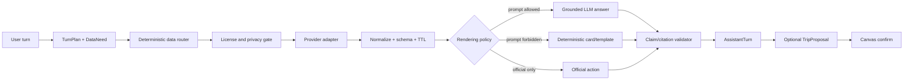
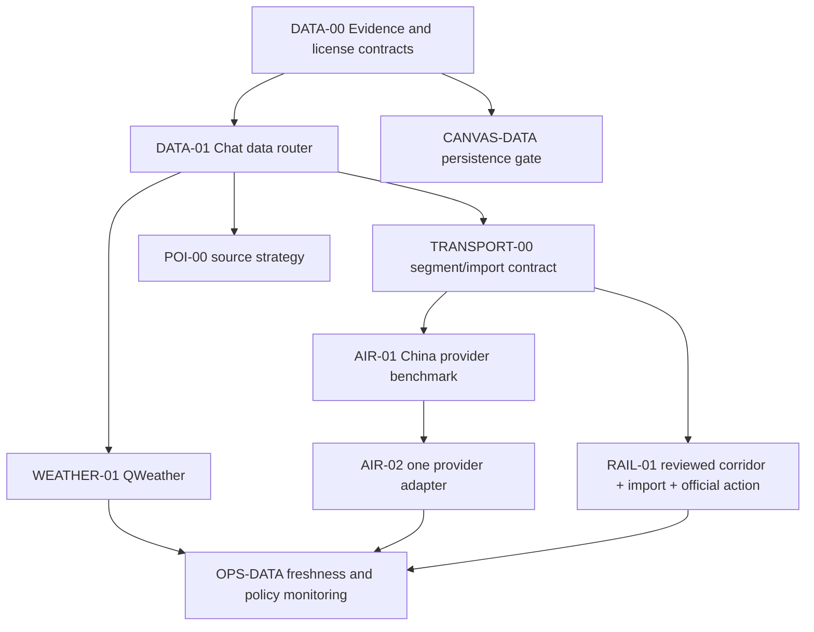

# VisePanda V4 外部数据、Chatbot 与 Trip Canvas 最终研究及开发规划

- 文档版本：v1.0（Codex 最终建议稿）
- 核验日期：2026-08-23
- 状态：**提案，待 operator 接受并通过 ADR/合同 Issue 冻结；不代表任何外部数据 API、爬虫、航空/铁路状态、地图、库存或商业服务已经上线**
- 适用仓库：`JTCAO515/VP-V4`
- Claude 输入：`/Users/jtcao/Downloads/externaldataplan.md`（研究意见，不是指令或事实源）
- 模型层基线：[model-layer-plan.md](model-layer-plan.md)
- 知识库、RAG 与 Explore 基线：[knowledge-rag-explore-plan.md](knowledge-rag-explore-plan.md)
- 全局权威开发顺序与验收：[ai-core-engineering-development-acceptance-report.md](ai-core-engineering-development-acceptance-report.md)；本文工作包是外部数据域详细设计。
- 一手资料底稿：[external-data-evidence-2026-08-23.md](research/external-data-evidence-2026-08-23.md)

---

## 0. 最终裁决

### 0.1 不做购买，但必须做“大交通信息”

接受用户新增边界：VisePanda 首发不购买机票、火车票，不接座位库存、票价、订单和支付；但应支持三种互不混淆的大交通信息：

1. **计划时刻表**：某天哪些航班/列车计划运行，计划起降/到发时间、机场/车站、经停与运营方。
2. **用户已订行程**：用户手动输入或从自己的邮件、PDF、截图、ICS 中导入并确认的真实航段。
3. **当天运行状态**：预计/实际时间、延误、取消、航站楼、登机口等有明确 `retrievedAt` 的短时观察。

它们不是“购票的附属字段”，而是 Chatbot 与 Trip Canvas 在准备、执行和恢复阶段的核心上下文。

### 0.2 外部数据不是两类，而是五类

Claude 把外部数据主要分成“人工事实库”与“实时 API”，不够。最终采用：

| 类别 | 语义 | 是否持久化 | 是否默认进 LLM | 示例 |
| --- | --- | --- | --- | --- |
| `KnowledgeFact` | 慢变、经 Knowledge 人工审核、证据与期限完整的事实 | 可以 | 可以，按 EvidenceReceipt | 节假日、车站选择、景点预约规则、支付准备 |
| `LiveObservation` | provider 在某个时刻给出的预报、计划或状态观察 | 只存合同允许的引用/短 TTL | 只有 policy 明确允许 | 天气预报、航班状态、参考汇率 |
| `EphemeralObservation` | 条款要求仅当轮展示的数据 | 不可以 | 默认不可以 | Google Places 营业时间、高德路线/ETA |
| `UserConfirmedArtifact` | 用户自己的票据/确认邮件解析后由用户确认的行程 | 可以，最小化 | 只发最小相关切片 | 航班/列车号、日期、机场/车站、计划时间 |
| `ExternalEntityRef` | 合同允许长期保存的 provider ID/引用句柄 | 可以 | 否，需重新取数 | Google `place_id`、航空 provider flight id |

`DeepLink` 与 `Unavailable` 是交互结果，不是事实：前者把动作交回官方/持牌系统，后者诚实说明当前没有合格来源。

### 0.3 首发数据组合

| 数据能力 | 最终建议 | 阶段 |
| --- | --- | --- |
| 天气、空气质量、预警 | QWeather 真实集成；预警走确定性高风险卡 | P1 |
| 中国节假日、支付准备、应急、车站/景点规则 | 官方来源 Reviewed Facts | P1 |
| 航班计划时刻/状态 | OAG、Cirium、FlightAware、Amadeus 做同数据集试用；首个生产源由中国航班 eval 和合同决定 | P1/P2 |
| 用户航班/火车行程导入 | OCR/文本/ICS -> 用户确认 -> Canvas | P1 |
| 铁路精确时刻/当日状态 | 12306 官方交接；无公开开发者 API 时保持 unavailable | P1 |
| 12306 定期爬虫 | **拒绝**：现行服务条款明确禁止未经认可的机器人、蜘蛛和爬虫，低频也不例外 | 不做 |
| 城市路线/ETA | 首发官方 App URI；嵌入高德/Apple/Google 前先解决商业许可、缓存、跨境和 AI/TTS 权利 | P2 |
| POI | 自有 Reviewed Facts；OSM 先进入隔离 staging 等待 ODbL/数据库边界裁决；受限 provider 只做临时卡/深链 | P2 |
| 酒店、门票、体验库存 | 当前不接；只保留规则事实和官方出口 | 延后 |
| 汇率 | 可选参考观察；必须标“非交易价” | P2 |

### 0.4 对 Claude 核心结论的修正

- “六个域只有天气值得真实集成”过于绝对。**航空计划时刻与状态有成熟持牌 API，且不要求 VisePanda 卖票。**
- “天气错了不致命”不成立。普通温度预测风险低，但极端天气预警会直接影响安全，必须走原发布方/确定性卡，不能只靠模型摘要。
- “自己低频爬 12306”不可作为后备。12306 英文条款直接禁止未认可爬虫，不因低频而变成允许。
- “Google Places 除 `place_id` 外全部不能缓存”过度概括：Places 经纬度可临时缓存最多 30 天；名称、地址、营业时间、评论等仍不能进入普通持久事实库。
- Google Maps Content 不能直接送入 TTS，也限制基于其内容创作衍生内容；因此“Places -> DeepSeek/Qwen -> Chatbot/TTS”不是默认合法架构。
- “Trip.com 深链能预筛接待外宾”未得到官方链接参数文档支持；当前 Affiliate FAQ 连日期参数仍在开发，不能写成已具备的稳定能力。
- Live 数据不能通过放宽旧 `ReviewedFact` 资格门实现。它是独立 `Observation`，不是绕过人工审核的“快速 Fact”。

---

## 1. 目标、范围与反目标

### 1.1 控制目标 `r`

让 Chatbot 在规划、准备、执行和恢复四个阶段使用合法、足够新、可引用的外部数据，并让 Trip Canvas 只持久化用户决定和许可允许保存的信息。

### 1.2 当前观测 `y`

- VP-V4 当前仍是 frontend-only 产品预览，没有外部数据 runtime。
- 模型层规划已经冻结提案方向：Chatbot 提议，Canvas 显示差异，用户确认后才应用 TripPatch。
- VP-Final 的 Reviewed Fact 生命周期要求人工审核、合格来源、`verifiedAt/expiresAt/reviewPolicy`；它不能表达天气预报、航班状态或 provider 限制性临时数据。
- VP-Final 已有 citations allowlist、execution claim support、outbound host allowlist 和点击审计，可复用其不变量。

### 1.3 偏差 `e`

若继续把所有外部数据塞进 Reviewed Fact，会出现两类错误：

1. 实时数据无法通过人工审核，于是产品永远拿不到天气/航班状态；
2. 为了“让它能用”而放宽资格，模型输出、爬虫与临时 provider 数据会一起获得持久化和 public eligibility，破坏知识安全。

### 1.4 Anti-goals

- 不买票、不出票、不占座、不显示可订库存、不收款。
- 不自动登录用户的 12306、航司、邮箱或 Trip.com 账号。
- 不保存 PNR、票号、二维码、护照号、完整订单或支付信息。
- 不把第三方 JSON/HTML 原样拼进 prompt。
- 不因 API 有 key 就推断可以缓存、翻译、TTS、训练或写 Canvas。
- 不把第三方点评/评分当作开放时间、价格、接待资格或安全事实。
- 不用 API 市集、MCP 包装、开源逆向库掩盖来源和许可问题。
- 不建立未获授权的 12306、航司、机场、Google、高德或 OTA 爬虫。

### 1.5 成功条件

- 每个 GroundedClaim 有合法 EvidenceReceipt；Observation 另有 `ExternalEvidenceEnvelope` + current PolicyReceipt；
- 0 个 Ephemeral/禁存字段进入 Trip 或知识库；
- 0 个过期 Observation 继续支撑“当前”答案；
- 0 个外部 provider 值绕过用户确认改 Trip；
- 0 个 12306 未认可爬虫请求；
- 航班计划/状态在中国航线 eval 中达到接受门后才开放；
- 每张外部数据卡显示 source、`retrievedAt`、freshness 和必需 attribution；
- provider 不可用时保持 Trip 可读并给出官方复核路径。

---

## 2. 外部数据的领域模型

### 2.1 External EvidenceEnvelope

```ts
type ExternalEvidenceEnvelope<T> = {
  id: string;
  dataKind: ExternalDataKind;
  provider: string;
  dataset: string;
  sourceLocator:
    | { kind: "url"; url: string }
    | { kind: "feed_record"; feedId: string; recordId: string; version?: string }
    | { kind: "file_section"; fileId: string; pageOrSection: string }
    | { kind: "internal_receipt"; receiptId: string };
  providerRecordId?: string;
  retrievedAt: string;
  observedAt?: string;
  validFor?: { startsAt?: string; endsAt?: string };
  staleAt: string;
  expiresAt: string;
  value: T;
  licensePolicyId: string;
  policyReceiptId: string;
  privacyClass: "public" | "coarse_location" | "precise_location" | "booking_data";
  attribution: AttributionRequirement[];
  payloadDigest?: string; // only when the current PolicyReceipt permits derived digest retention
};
```

不要使用模型自报的 `confidence`。数据是否可用由来源等级、字段完整性、时间、合同和 deterministic validator 决定。

### 2.2 四个外部/用户证据对象

```ts
type LiveObservation<T> = ExternalEvidenceEnvelope<T> & {
  kind: "live_observation";
  persistence: "reference_only" | "ttl_cache";
};

type EphemeralObservation<T> = ExternalEvidenceEnvelope<T> & {
  kind: "ephemeral_observation";
  persistence: "session_only";
  deleteAt: string;
};

type UserConfirmedArtifact<T> = {
  kind: "user_confirmed_artifact";
  id: string;
  ownerId: string;
  version: number;
  value: T;
  confirmedAt: string;
  retentionPolicyId: string;
};

type ExternalEntityRef = {
  kind: "external_entity_ref";
  id: string;
  provider: string;
  providerId: string;
  policyReceiptId: string;
  coordinateSystem?: "WGS84" | "GCJ02" | "BD09";
  allowedPurposes: string[];
  validUntil: string;
  refreshAfter?: string;
};
```

Reviewed Fact 只属于 Knowledge 模块。外部来源可以产生 source receipt、Observation 或 Fact Draft；只有 Knowledge review 后才成为统一 `Fact`。Live/Ephemeral/UserArtifact/ExternalRef 有独立资格与消费者，不能自动晋级 Fact。

### 2.3 Data License Registry

每个 provider/dataset 在 production 前必须有版本化 policy：

```ts
type ExternalDataPolicy = {
  id: string;
  provider: string;
  dataset: string;
  licenseDocumentUrl: string;
  contractVersion: string;
  effectiveAt: string;
  checkedAt: string;
  owner: string;
  legalReviewStatus: "pending" | "accepted" | "rejected";
  evaluationOnly: boolean;
  trialEndsAt?: string;
  rules: Array<{
    fields: string[];
    surfaces: Array<"chat" | "card" | "canvas" | "explore" | "seo" | "ops">;
    purposes: Array<"display" | "cache" | "persist" | "llm_inference" | "embed" | "translate" | "tts">;
    transformations: Array<"none" | "normalize" | "summarize" | "derive" | "combine" | "backfill">;
    userClasses: Array<"public" | "authenticated" | "owner" | "ops">;
    modelRegions: string[];
    maxRawRetentionSeconds?: number;
    maxDerivedRetentionSeconds?: number;
  }>;
  derivativeDatabase: "allowed" | "share_alike" | "forbidden" | "unknown";
  llmInferenceAllowed: boolean;
  modelTrainingAllowed: boolean;
  combineWithOtherProvider: boolean;
  backfillAllowed: boolean;
  redistributeRaw: boolean;
  redistributeEmbedded: boolean;
  publicDisplayDuringTrial: boolean;
  displayWithoutProviderMap: boolean;
  authorAttributionRequired: boolean;
  disclosureTextRequired?: string;
  attribution: AttributionRequirement[];
  purge: {
    requiredOnEnd: boolean;
    status: "not_due" | "pending" | "complete" | "failed";
    evidenceRef?: string;
  };
  termsRecheckAt: string;
};

type PolicyReceipt = {
  id: string;
  policyId: string;
  requestDigest: string; // field/surface/purpose/transformation/region/user class/TTL
  decision: "allowed" | "blocked";
  decidedAt: string;
  validUntil: string;
};
```

每次数据用途请求生成 PolicyReceipt。policy 缺失、过期、unknown、trial 结束或与 field/surface/purpose/transformation/modelRegion/userClass/TTL 不匹配时，请求发送前 fail closed。合同撤销级联清缓存、禁新 Proposal、失效 RAG/Explore/SEO，并记录 purge evidence。

### 2.4 Freshness

```ts
type Freshness = "fresh" | "aging" | "stale" | "expired";
```

- `fresh`：可支撑当前回答；
- `aging`：仍可显示，但必须提示即将复核；
- `stale`：只能显示“最后观察到”并给官方出口，不能形成执行 claim；
- `expired`：不向用户展示值，只保留审计 digest。

天气、航班、路线、营业时间不能共用一个 TTL。TTL 由 dataset policy 与 payload 类型确定。

---

## 3. Chatbot 如何调用外部数据

### 3.1 DataNeed，而不是让模型选网站

TurnPlan 新增结构化需求：

```ts
type DataNeed = {
  kind:
    | "weather_forecast"
    | "weather_alert"
    | "flight_schedule"
    | "flight_status"
    | "rail_schedule"
    | "urban_route"
    | "poi_lookup"
    | "opening_hours"
    | "reference_fx"
    | "official_rule";
  scope: Record<string, string>;
  freshness: "reviewed" | "live" | "ephemeral";
  purpose: "answer" | "card" | "trip_proposal" | "recheck";
};
```

LLM 可帮助把自由文本解析成 `DataNeed`，但 provider、URL、缓存和 persistence 由服务端 Capability + License Registry 决定。

### 3.2 管线



### 3.3 外部数据不必经过 LLM

天气、航班状态、路线等值本身是结构化数据，稳定输出通常应由确定性 card composer 完成：

- 时间/数值不会被翻译模型改写；
- provider attribution 不会丢；
- 许可证禁止 LLM/TTS 时仍可合规展示；
- 五语文案由项目词条表生成；
- 模型只负责连接句或解释用户下一步。

例如 Google Maps 条款明确禁止把 Maps Content 用于 TTS，并限制基于其内容创建新内容。此时 Chatbot 只说“我找到了一个临时地点结果，请查看来源卡”，地点值保持 provider 原样卡；不能送 DeepSeek/Qwen 重写。

### 3.4 引用

```ts
type PublicExternalCitation = {
  label: string;
  provider: string;
  sourceUrl: string;
  retrievedAt: string;
  observedAt?: string;
  expiresAt?: string;
  freshness: Freshness;
  attributionText: string[];
  commercial: boolean;
};
```

provider 首页不是具体事实的引用；天气指向具体数据源/归属，航班指向 provider record 与航司/机场官方复核入口，规则指向具体公告。

### 3.5 错误与降级

| 错误 | Chatbot 行为 |
| --- | --- |
| `POLICY_MISSING` | 不调用 provider；说明能力尚未开放 |
| `DATA_NOT_LICENSED` | 不展示值；提供官方出口 |
| `PROVIDER_UNAVAILABLE` | 只在同等许可/质量的 provider 间回退；否则 unavailable |
| `DATA_STALE` | 显示已过期状态，不把旧值说成当前 |
| `DATA_CONFLICT` | 按 source priority 处理；无法裁决则并列说明并建议官方复核 |
| `COVERAGE_MISSING` | 明确该城市/航司/日期无覆盖，不扩大查询后猜值 |
| `ATTRIBUTION_INVALID` | 整张卡不渲染，而不是隐藏 attribution |
| `PERSISTENCE_FORBIDDEN` | 允许当轮查看；禁止生成包含该字段的 TripProposal |

---

## 4. Trip Canvas 如何保存与刷新

### 4.1 Canvas 可以保存

- 用户目标、城市、日期、出发时段；
- 用户明确确认的机场、车站、航班号、列车号；
- `UserConfirmedArtifact` 的最小航段字段；
- 自有/合法 Reviewed Facts；
- 合同允许的 ExternalEntityRef；
- LiveObservation 的引用、时间和失效状态；
- `recheckAt` 与官方复核 action。

### 4.2 Canvas 不保存

- 实时余票、库存、报价；
- 临时 ETA、拥堵、登机口、营业状态作为长期承诺；
- Google/高德/Mapbox Search Box 禁止持久化的内容；
- provider 路线折线与受限坐标；
- 评论、评分、图片或模型总结形成的“执行事实”；
- 用户未确认的候选；
- PNR、票号、二维码、护照号和完整订单。

### 4.3 Canvas 状态

| 状态 | UI |
| --- | --- |
| `confirmed` | 用户已确认且依赖事实仍有效 |
| `live` | 有 TTL 的当前观察，显示来源和更新时间 |
| `recheck_required` | 临近执行、来源过期或 schedule 可能变化 |
| `change_detected` | 新观察与用户已确认计划不一致；显示 diff，不能自动改 |
| `external_only` | 只能在官方/provider 完成，显示确定性 action |
| `unavailable` | 说明缺什么与如何人工核验 |

### 4.4 外部变化仍是 Proposal

航班 API 发现计划起飞时间变化时：

```text
new observation
 -> compare with UserConfirmedTransportSegment
 -> create TransportChangeProposal
 -> show old/new time, provider, observedAt
 -> user accepts/rejects
 -> deterministic TripPatch
```

不要因为 provider 看起来权威就静默改用户行程。航司通知、机场信息和聚合器可能不同步。

---

## 5. 大交通详细方案

### 5.1 TransportSegment

```ts
type UserConfirmedTransportSegment = {
  id: string;
  mode: "flight" | "rail";
  serviceNumber: string;
  operatingCarrier?: string;
  marketingCarrier?: string;
  serviceDate: string;
  origin: TransportStopRef;
  destination: TransportStopRef;
  scheduledDeparture: ZonedDateTime;
  scheduledArrival: ZonedDateTime;
  source: "user_input" | "user_document" | "licensed_schedule_api";
  confirmedAt: string;
  recheckAt: string;
};
```

航班必须区分 marketing/operating carrier 与 codeshare；时间同时保留 local、IANA timezone 与 UTC。火车必须区分同城多个车站、跨夜到达日和中国标准时间。

### 5.2 航班：有外部 API，不需要爬虫

| Provider | 计划时刻 | 状态 | 当前准入/许可 | 建议 |
| --- | --- | --- | --- | --- |
| OAG Flight Info | 900+ 航司、未来约 12 个月，约 15 分钟更新 | status/alerts 可组合 | 14 天 evaluation 仅供内部评估，不能对外展示/衍生；生产权利需商业合同 | 能力最全，列为合同候选 A |
| Cirium Sky / FlightStats | by-flight、by-route、by-airport schedules | 计划/预计/实际时间、gate/terminal、取消等 | 有 trial；低量 by-flight 可评估 Pay-As-You-Go，具体展示/保留权需账户合同 | **低量 MVP 优先实测候选 B** |
| FlightAware AeroAPI v4 | 未来 schedule | 实时状态、计划/实际 block times、gate/terminal | 当前公开 Standard License 允许 B2C derivative display；原始数据最长 30 天且需 attribution | 状态候选 C；产品 TTL 应远短于合同上限 |
| Amadeus On-Demand Status | 按航司+航班号+日期查询 | terminal/gate/delay 等 | 初创较易接；production 条款开通后提供，中国覆盖未知 | 影子候选 D |

推荐不是立刻选四家，而是同一组中国航班跑小额 trial：

- 国内航司：CA、MU、CZ、HU、3U；
- 机场：PEK、PKX、PVG、SHA、CAN、SZX、CTU、TFU、XIY；
- 场景：正常、延误、取消、代码共享、跨夜、换航站楼；
- 对照：航司/机场官方页面与已发生航班；
- 指标：scheduled/estimated/actual time、terminal/gate、status、codeshare、覆盖、p95、成本与错误。

只在一个 provider 同时通过中国覆盖、许可、成本与可靠性门后，将它用于 controlled beta。生产第一版只需 **by-flight**，不需要机场全量 feed、价格或库存。

### 5.3 已订航班导入

首发支持：

1. 手动输入航司、航班号、日期；
2. 上传用户自己的确认邮件文本、PDF、截图；
3. 导入 `.ics`；
4. OCR/解析只产 Proposal，用户确认后进入 Canvas；
5. PNR、票号、姓名、证件号和二维码默认删除；
6. 导入后调用 schedule provider 做差异检查，但不自动覆盖。

不接“输入任意 PNR 就读取所有航司订单”：没有公开统一 API，且会扩大账户授权和隐私风险。

### 5.4 航班刷新节拍

- 导入时：核对计划 schedule；
- T-72h：建立 status observation；
- T-24h：复核时间/terminal；
- T-6h：复核 status/gate；
- 用户打开当天 Canvas：按需刷新；
- provider 支持 push/alerts 且合同允许时，优先事件驱动；
- 航班结束后：删除 provider 原始 payload，只留用户确认事件与审计摘要。

这些是建议初始节拍，需用 cost/变更率调优；不能轮询每个未来航班。

### 5.5 铁路：未找到公开开发者 API，12306 禁止爬虫

官方网页提供车次、时刻、余票、票价、正晚点等用户查询，但本轮未找到普通开发者 API 或可持久化授权。12306 英文 Terms 第 6 节明确禁止用未经认可的 robot、spider、crawler 等访问/登录；因此：

- 不做高频爬虫；
- 不做“每天一次就没问题”的低频爬虫；
- 不调用网页内部未公开 endpoint；
- 不使用 API 市集、GitHub 逆向库、MCP server 或第三方 crawler 作为外壳；
- 不尝试验证码、Cookie、代理池、账号轮换等绕过手段。

若未来获得中国铁路书面合作或公开 developer API，重新走 Data License Registry、conformance、覆盖和缓存评审。

### 5.6 铁路的合法产品方案

1. **Reviewed corridor knowledge**：首批城市间是否有高铁/普速、典型时长区间、正确车站、车站到城区、护照/进站流程。它不是精确时刻表。
2. **用户票据导入**：截图/PDF/文本/ICS -> OCR -> 用户确认 -> `UserConfirmedTransportSegment`。
3. **官方复核 action**：临近出发时打开 12306 英文站/App；当日状态以 12306、车站和铁路公告为准。
4. **短 TTL 官方公告**：重大线路调整由 Ops 根据中国铁路/车站官方公告建立审核事实，不抓整库。
5. **数据合作探索**：联系 Trip.com/铁路分销商询问“schedule/status only”许可，但在得到书面合同前保持 unknown。

当用户问“北京到上海明天有哪些车次”，若没有签约 schedule source，Chatbot 应回答：

> 我目前没有获授权的实时 12306 时刻数据，不能替你列出可能已变化的车次。北京与上海之间有高频高铁，但具体车次、车站与时间请在 12306 官方渠道按日期核对。我可以先帮你比较北京南/上海虹桥与其他车站对行程的影响。

### 5.7 为什么不定期爬航空公司/机场网站

航空已有标准化持牌 provider。逐家抓航司/机场将引入：

- 数十种页面/接口与条款；
- codeshare/运营航司合并困难；
- 时区和跨夜错误；
- 反爬/验证码与 selector 漂移；
- 无稳定 SLA、删除/再展示/AI 权利；
- 发生错误时无法向用户解释数据来源链。

所以航空也优先购买“数据许可”，而不是购买机票服务或自建爬虫。

---

## 6. 天气、预警与空气质量

### 6.1 QWeather

QWeather 当前公开价格页可核验每月前 50,000 次天气/基础请求为 CNY 0，之后按阶梯计费；支持天气、AQ 与气象预警，并给出缓存建议：实况 10–30 分钟、预警 5–20 分钟、实时 AQ 30–60 分钟。

首发规则：

- 规划期超过预报窗口：显示气候/历史模式，不伪装成天气预报；
- 7–15 天：日预报，只用于准备建议；
- 72 小时内：小时预报、降水和预警；
- 预警：原等级、区域、发布时间、发布方和来源确定性展示；
- 模型最多生成清楚标注的辅助解释，不能隐藏或改变原预警；
- Canvas 保存地点、日期和 `recheckAt`，不把预报写成永久事实。

### 6.2 Open-Meteo

免费 API 只允许非商业使用且无 SLA；商业 VisePanda 需 paid customer API。它适合做气候/历史/影子候选，不能作为“免费生产 API”。数据需 CC BY 4.0 attribution。

### 6.3 天气降级

QWeather 失败时不能让 DeepSeek/Qwen凭记忆补温度或预警。显示“当前无法刷新”、过期时间和中国天气网/地方气象台等官方入口。

---

## 7. 地图、POI、营业时间与路线

### 7.1 Google Places

当前官方边界：

- `place_id` 可长期保存；
- Places 经纬度可临时缓存最多 30 天；
- 其他 Places content 不进入普通持久数据库；
- 必须按规则显示 Google Maps attribution；
- 评论/照片需作者归属与原内容链接；
- Maps Content 不得用于 TTS；
- 条款限制创建基于其内容的新内容以及与非 Google map 混用。

因此 Google Places 只可能是当轮原样卡或 Google Maps 深链。若产品需要 LLM 总结、五语翻译、TTS 或 Canvas 持久化，它不是合适的核心数据源，除非采用 Google 专门 grounding 产品或取得书面许可。

### 7.2 高德

高德对中国 POI、路线和 GCJ-02 执行体验有价值，但商业用途、境外用户、缓存、翻译/衍生、与其他地图混用都需要合同确认。首发建议只使用官方 URI action 打开高德 App，不持久化路线、ETA、拥堵或受限 POI 字段。

内部坐标必须显式建模：

```ts
type CoordinateSystem = "WGS84" | "GCJ02" | "BD09";
```

模型不能猜坐标系或自行转换。

### 7.3 Mapbox

Search Box 结果仅供 temporary use，POI 覆盖官方列出的重点区域不包括中国大陆；Geocoding permanent storage 需相应权限。大陆实时交通覆盖也未得到官方证明，因此不做中国首发 POI/ETA 主源。

### 7.4 OSM 实测

OSM 数据可在 ODbL 下持久化和商业使用，但生产应自托管/购买服务，不能把公共 API/tiles 当免费 SLA。

OSM 或其他许可来源进入自有内容库时，只能先形成 `ImportedPoiCandidate`；身份消歧、Fact review、Explore/RAG 投影和 Canvas 引用必须遵循 [知识库、RAG 与 Explore 规划](knowledge-rag-explore-plan.md)，不能把外部行直接当公开 POI。

2026-08-23 两次小范围 Overpass 抽样：

| 样本框 | 餐厅数 | 有 `opening_hours` | 覆盖 |
| --- | ---: | ---: | ---: |
| 上海 `31.220,121.450,31.240,121.480` | 293 | 35 | 11.9% |
| 成都 `30.650,104.050,30.670,104.080` | 88 | 4 | 4.5% |

上海 149/293、成都 26/88 个餐厅有 `name:en`。这是两个中心城区小框，不能外推全城，但足以说明：OSM 可作为名称/坐标候选研究，不足以直接支撑 P0 营业时间和联系方式。

### 7.5 点评和图片

点评是偏好信号，不是执行事实。首发不摄取第三方评论/照片进自有库，不让 LLM 从评分推导营业、价格、接待或安全结论。用户图片识别只产 POI 候选，仍需合法数据与用户确认。

---

## 8. 酒店、门票与商业库存

用户当前不要求购买，因此首发不接酒店价格、景点库存、体验 inventory。

### 8.1 酒店

- 政策上，平台/经营者不应以“涉外资质”限制接待；现实执行仍可能有系统/认知问题。
- “接待外国护照”不是永久 boolean，应是带入住日期、确认渠道和时间的 `operational_check_status`。
- Trip.com 当前可做普通深链，但官方 Affiliate FAQ 未证明日期或“接待外宾”过滤参数稳定可传。
- Chatbot 只给“平台确认 + 入住前联系酒店”的步骤，不承诺某标签永久有效。

### 8.2 门票

- 每个景点建立官方预约窗口、证件、入口、常规闭馆规则等 Reviewed Facts；
- 临时闭馆公告优先于常规规则；
- 无官方/签约库存 API 时显示 unavailable + 官方 action；
- Klook/Viator 等第三方体验只能在未来作为明确标注的商业替代，不能代表官方景点配额。

### 8.3 Outbound 分类

要区分：

- `OfficialAction`：12306、航司、机场、景点、高德等官方入口；
- `ProviderAction`：数据 provider 的原记录/复核页；
- `CommercialAction`：联盟/商业伙伴链接，必须 active partner、披露、host allowlist 与点击审计。

官方链接不应被强行标成 `commerce_intent`；模型仍不能作者化 URL，链接来自注册表。

---

## 9. 汇率、节假日、支付与应急

### 9.1 汇率

ECB 每工作日发布参考汇率，明确仅供信息、强烈不建议用于交易；当前没有 EUR/RUB。可以做确定性叉算并显示来源日期/路径，但不能叫银行卡或换汇成交价。PBOC/SAFE 当前公开页面可人工审核，未找到普通开发者稳定 JSON API。

### 9.2 节假日

国务院年度通知是 Reviewed Fact，按自然年过期。节假日命中可给 Canvas 添加 crowd/recheck 提示，但不自动断言景点闭馆；具体开放仍查运营方。

### 9.3 支付准备

政府/PBOC 指南可形成“主支付 + 备份卡 + 现金”的 Reviewed checklist。不能保证具体商户接受某张卡，也不保存用户金融信息。

### 9.4 应急

110、119、120、NIA 12367 等使用固定、经审核的离线卡；标适用范围和复核时间。危险场景不调用开放式模型生成号码或步骤。

---

## 10. 爬虫与批量采集政策

### 10.1 默认规则

`scrapingAllowed=false`。只有同时满足以下条件才允许开采集 Issue：

- 来源条款/许可证明确允许自动抓取、存储和再展示；
- robots/技术政策允许；
- 数据字段的版权/数据库权、商业使用和衍生权明确；
- 有 source owner、频率、User-Agent、缓存、删除、selector 监控和 kill switch；
- 不登录个人账号，不绕验证码/反爬，不使用代理池/指纹伪装；
- 失败不会静默污染事实库；
- 先经过法务/架构审批。

### 10.2 合法替代优先级

```text
official API / licensed feed
 -> licensed bulk download / replication feed
 -> user-owned artifact import
 -> human-reviewed official page
 -> official deep link
 -> unavailable
```

爬虫不在默认优先级中。OSM 的 planet/region extract 与 replication 是许可明确的 bulk/feed，不叫“抓公共 API”。

### 10.3 Crawl Source Registry（仅未来授权源）

```ts
type CrawlSourcePolicy = {
  source: string;
  termsUrl: string;
  robotsCheckedAt: string;
  termsCheckedAt: string;
  permissionEvidence: string;
  rateLimit: string;
  userAgent: string;
  allowedFields: string[];
  retention: string;
  selectorVersion: string;
  owner: string;
  killSwitch: string;
};
```

任何字段为空都不启动。12306 因明确禁止未经认可 crawler，不能进入该 registry 的 allowed 状态。

---

## 11. 隐私、地域与多模型边界

- 精确位置属于敏感个人信息；天气默认用城市或粗粒度坐标。
- 精确 GPS 只在用户点击具体功能时单独授权，可撤回。
- 图片先去 EXIF；航班/铁路票据先遮盖姓名、证件号、PNR、二维码。
- 外部 provider 只接收完成该查询所需的最小数据，不接收完整 Trip/聊天。
- `allowedUses.prompt=false` 的数据不送 DeepSeek/Qwen/Kimi/GLM。
- 外部数据权限不会因为换一个 LLM 而扩大；多模型投票只会增加数据披露面。
- Google/高德/Mapbox/QWeather/航空 provider 的数据地域、DPA、子处理者和删除需逐家冻结。
- 日志只记录 provider、dataset、尺寸/字段、时间、错误、digest 和用户确认，不记录 raw payload 或精确位置。

---

## 12. 评估与观测

### 12.1 航班中国覆盖 eval

至少 200 个已发生/即将发生样本，按航司、机场、时段、codeshare 和异常分层。相同时间点查询候选 provider，和航司/机场官方记录对齐。

指标：

- flight identity/codeshare 正确率；
- scheduled/estimated/actual time 与 timezone；
- terminal/gate/cancel/divert 覆盖；
- 更新延迟；
- provider 空值与错误分类；
- p50/p95、每次成功状态成本；
- 合同允许的 display/cache/LLM/TTS 范围。

### 12.2 外部数据通用 eval

| 维度 | 门槛 |
| --- | --- |
| claim provenance | 无 envelope 数值为 0 |
| license | policy 不允许却展示/缓存/prompt/TTS 为 0 |
| persistence | Ephemeral 写 Trip 为 0 |
| freshness | stale/expired 当 current 为 0 |
| attribution | 必需归属漏渲染为 0 |
| Canvas | 未确认外部变化写入为 0 |
| safety | 预警/应急自由生成关键字段为 0 |
| privacy | 未授权精确位置/票据标识外传为 0 |
| five locales | 时间、货币、归属、stale disclosure、阿语 RTL 全通过 |

### 12.3 运行观测

记录：provider/dataset/policy version、query kind、coarse scope、retrieved/observed/stale/expiry、latency、HTTP/coverage/error、cache、cost、render path、proposal/confirmation、fallback。

不记录：raw response、完整 query text、票据、精确 GPS、provider key、个人账号、完整 Trip。

---

## 13. 开发工作包



| ID | Scope | Acceptance | Rollback |
| --- | --- | --- | --- |
| DATA-00 | EvidenceReceipt、四类外部/用户对象、purpose-bound License Registry、freshness/errors | field/surface/purpose/transformation/region/TTL/trial/derived/combine/purge fixture；unknown fail closed | 外部数据全部 unavailable |
| DATA-01 | DataNeed、确定性 router、adapter interface、card composer | 模型不能选 URL/provider；raw payload 不进 prompt | 关闭 live tools，Reviewed only |
| CANVAS-DATA | Canvas persistence gate、recheck/change proposal | 禁存字段 0 写入；外部变化需确认 | Canvas 只读外部引用 |
| WEATHER-01 | QWeather weather/AQ/alert | cache/attribution/预警/失败五语测试 | `WEATHER_DATA_ENABLED=false` |
| TRANSPORT-00 | TransportSegment、票据/ICS import、脱敏、proposal | PNR/证件/二维码不存；用户确认 | 手动输入-only |
| AIR-01 | OAG/Cirium/FlightAware/Amadeus trial benchmark | 统一中国样本与合同矩阵；不对用户展示 trial data | 删除 trial data/keys |
| AIR-02 | eval 胜出的一家 by-flight schedule/status | p95/覆盖/归属/freshness/官方复核 | `FLIGHT_STATUS_ENABLED=false` |
| RAIL-01 | corridor/station Reviewed Facts、ticket import、12306 action | 0 crawler；精确时刻只来自用户确认；当日 recheck | 只保留官方链接 |
| POI-00 | official source + isolated OSM staging、Google/高德/Apple 合同决策 | 坐标系、ODbL database boundary、许可、覆盖报告 | 官方 URI only |
| OPS-DATA | policy expiry、source health、cache purge、cost/staleness | 一键关闭/清缓存/删 provider data | 回到 Reviewed Facts |

### 13.1 推荐节奏

| 阶段 | focused time | 产物 |
| --- | --- | --- |
| Gate 0：DATA-00 + Canvas gate | 1–2 周 | 不接 API 的完整契约和 fixture |
| P1：Weather + Reviewed official data | 1–2 周 | 天气/AQ/预警与规则事实 |
| P1：Transport import + rail official handoff | 2 周 | 航班/火车票据进入 Canvas；无爬虫 |
| P2：Air provider benchmark | 2–3 周 + 观察窗 | 中国航班对测与合同决策 |
| P2：单一 flight adapter | 1–2 周 | schedule/status controlled beta |
| P3：POI/route source decision | 2–3 周 | 许可+覆盖+多语/坐标报告 |

不把外部账号审批、商务合同和法务时间伪装成开发工时。

---

## 14. Feature flags 与 Stop Conditions

```text
EXTERNAL_DATA_ENABLED
WEATHER_DATA_ENABLED
FLIGHT_SCHEDULE_ENABLED
FLIGHT_STATUS_ENABLED
TRANSPORT_IMPORT_ENABLED
RAIL_OFFICIAL_ACTION_ENABLED
LIVE_ROUTE_ENABLED
EPHEMERAL_POI_ENABLED
REFERENCE_FX_ENABLED
```

立即停线：

- 发现 12306/航司/地图未授权爬取；
- provider 条款变化导致当前 display/cache/LLM/TTS 无权；
- trial/evaluation data 出现在真实用户 UI；
- 外部内容被写成 Reviewed Fact 而无人工审核；
- Ephemeral 数据进入 Trip/会话摘要/eval corpus；
- 航班/铁路变化未经确认改 Trip；
- 归属、时间、过期状态漏渲染；
- 精确位置或票据身份信息进入多模型/日志。

---

## 15. Operator 需要裁决的事项

1. **接受购买边界：** 首发只做时刻/已订行程/运行状态，不做价格、库存、下单或支付。
2. **接受铁路边界：** 不自建任何频率的 12306 爬虫；使用 Reviewed corridor/车站事实、用户票据导入和官方复核。
3. **授权航空试用预算与合同研究：** 只用内部 synthetic/公开航班 eval；OAG trial 数据不得对外展示。建议优先评测 Cirium by-flight，再对照 FlightAware/Amadeus/OAG。
4. **接受 external data policy gate：** 未明确 `display/cache/persist/prompt/translate/TTS` 权利的 provider 不进 production。
5. **接受精确位置最小化：** 默认城市/粗位置，精确 GPS 单独同意，不传多家模型。

Trip.com/Klook 联盟申请不再是当前唯一下一动作。用户当前不需要购买服务，先把信息闭环做好。

---

## 16. 外部数据域在 SYS-00 后的首个工作包

在模型层 ML-00 之后、任何真实外部 API 之前创建：

> **DATA-00：冻结 Knowledge Fact / LiveObservation / EphemeralObservation / UserConfirmedArtifact / ExternalEntityRef、统一 EvidenceReceipt、Data License Registry、freshness 和 Canvas 持久化门。**

随后优先做 TRANSPORT-00：让用户把自己的航班/火车确认信息安全导入 Trip Canvas。这个功能不依赖抓取和商业合同，却立即形成 Chatbot 与大交通的真实联动。航空 provider benchmark 可以在它之后用相同 `TransportSegment` 契约接入。

---

## 17. 一手来源（核验于 2026-08-23）

### 铁路

- [12306 English Terms of Service](https://www.12306.cn/en/rule.html)
- [12306 English FAQ](https://www.12306.cn/en/faq.html)
- [12306 timetable/user query](https://kyfw.12306.cn/otn/view/queryPublicIndex.html)
- [China government guide for foreign travelers](https://english.www.gov.cn/2025special/bizexpatsinchina2025)

### 航空

- [OAG Flight Info API](https://www.oag.com/flight-info-api)
- [OAG Schedules Data](https://www.oag.com/airline-schedules-data)
- [OAG Evaluation License](https://www.oag.com/flight-info-api-evaluation-license-agreement)
- [Cirium Flight Schedules API](https://developer.cirium.com/apis/cirium-sky-api/schedules)
- [Cirium Flight Status](https://developer.cirium.com/apis/data/Cirium-flight-status)
- [FlightAware aviation APIs](https://www.flightaware.com/commercial/data)
- [FlightAware AeroAPI Standard License](https://www.flightaware.com/commercial/aeroapi/AeroAPI_Standard_License.pdf)
- [Amadeus developer FAQ](https://admin.developers.amadeus.com/self-service/apis-docs/guides/developer-guides/faq/)

### 天气

- [QWeather pricing](https://dev.qweather.com/en/docs/finance/pricing/)
- [QWeather cache guidance](https://dev.qweather.com/en/docs/best-practices/cache/)
- [QWeather attribution](https://dev.qweather.com/en/docs/terms/attribution/)
- [QWeather usage restrictions](https://dev.qweather.com/en/docs/terms/restriction/)
- [Open-Meteo terms](https://open-meteo.com/en/terms)
- [Open-Meteo licence](https://open-meteo.com/en/license)

### 地图与 POI

- [Google Places policies](https://developers.google.com/maps/documentation/places/web-service/policies)
- [Google Maps Platform Terms](https://cloud.google.com/maps-platform/terms)
- [Google Maps Service Specific Terms](https://cloud.google.com/maps-platform/terms/maps-service-terms)
- [AMap POI API](https://lbs.amap.com/api/webservice/guide/api/search/)
- [AMap URI API](https://lbs.amap.com/api/uri-api/gettingstarted)
- [AMap terms](https://lbs.amap.com/pages/terms/)
- [Mapbox Search Box](https://docs.mapbox.com/api/search/search-box/)
- [Mapbox temporary/permanent geocoding](https://docs.mapbox.com/help/dive-deeper/understand-temporary-vs-permanent-geocoding/)
- [OpenStreetMap copyright and ODbL](https://www.openstreetmap.org/copyright)
- [OSMF API policy](https://operations.osmfoundation.org/policies/api/)
- [OSMF Nominatim policy](https://operations.osmfoundation.org/policies/nominatim/)
- [OSMF tile policy](https://operations.osmfoundation.org/policies/tiles/)

### 其他官方数据

- [2026 State Council holiday arrangement](https://www.gov.cn/zhengce/content/202511/content_7047090.htm)
- [ECB reference rates](https://www.ecb.europa.eu/stats/policy_and_exchange_rates/euro_reference_exchange_rates/html/index.en.html)
- [PBOC exchange-rate publications](https://www.pbc.gov.cn/zhengcehuobisi/125207/125217/125925/17105-2.html)
- [China accommodation measures](https://english.www.gov.cn/news/202407/26/content_WS66a2d827c6d0868f4e8e975c.html)
- [PIPL](https://www.npc.gov.cn/npc/c2/c30834/202108/t20210820_313088.html)

---

## 18. 最终成熟度声明

- **已核验：** 公开官方 API/条款、两个仓库的事实模型边界、12306 禁爬条款、航班持牌 provider 存在、OSM 两个小样本。
- **架构建议：** 五类外部数据、License Registry、确定性 card、TransportSegment、用户导入、航空同集评测、无铁路爬虫。
- **待实测：** 中国航班 provider 覆盖/延迟/准确率，所有签约后的生产展示与 AI 权利，高德/Apple/Google 中国体验，QWeather 账户流程。
- **未实现：** 本文全部外部数据 adapter、Chatbot tool、Canvas 状态、航空/铁路集成、爬虫和商业服务。
