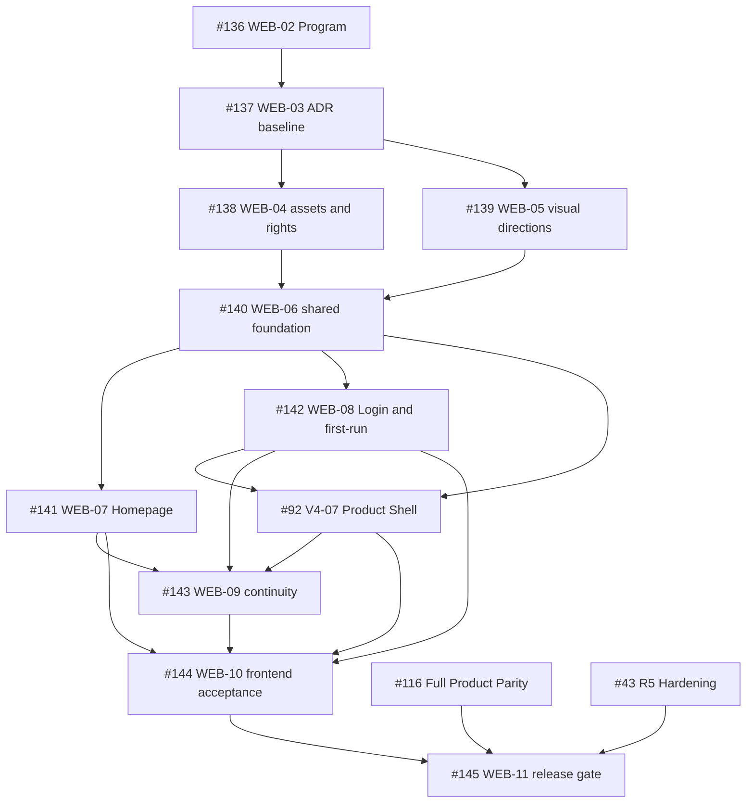

# VP-V4 complete frontend redesign Issue plan

Status: published to GitHub; implementation not started.
Date: 2026-08-27.
Parent: [WEB-02 #136](https://github.com/JTCAO515/VP-V4/issues/136), under [AI-00 #2](https://github.com/JTCAO515/VP-V4/issues/2).
Decision baseline: [ADR-0018](adr/ADR-0018-independent-frontend-redesign-baseline.md).

## 1. Objective and boundary

Deliver one independently expressed frontend across Homepage, closed-beta Login, first-run, the six-surface Product Shell, mobile/global states, Profile/Privacy and store release. Functional and information relationships remain equivalent to the accepted VisePanda product; physical expression is independently redrawn from VisePanda VI + Golden Route + Guide.

The current Homepage and `/visepanda` are stop-ship. Map is off by default. `Open VisePanda` is the Homepage primary CTA.

This plan reuses [#87](https://github.com/JTCAO515/VP-V4/issues/87) as Demo parity truth, updates [#92](https://github.com/JTCAO515/VP-V4/issues/92) as the only Product Shell, and reuses #93-#116 for production capability slices. It does not import Demo fixtures or create a second Auth, Trip, Fact, Memory, provider or capability source.

## 2. Published mapping

| Plan | GitHub Issue | Phase | Initial status | Outcome |
| --- | --- | --- | --- | --- |
| Program | [#136 WEB-02](https://github.com/JTCAO515/VP-V4/issues/136) | R0-R5 | ready / human-owned | Complete frontend redesign program |
| F0 | [#137 WEB-03](https://github.com/JTCAO515/VP-V4/issues/137) | R0 | ready / agent | ADR, numbered DAG, tracker and handoff freeze |
| F1 | [#138 WEB-04](https://github.com/JTCAO515/VP-V4/issues/138) | R0 | blocked by #137 | Asset quarantine, rights ledger, fonts, SBOM/NOTICE |
| F2 | [#139 WEB-05](https://github.com/JTCAO515/VP-V4/issues/139) | R0 | blocked by #137 | Three VI directions and operator selection |
| F3 | [#140 WEB-06](https://github.com/JTCAO515/VP-V4/issues/140) | R1 | blocked by #138/#139 | Shared tokens, brand, locale, motion and primitives |
| F4 | [#141 WEB-07](https://github.com/JTCAO515/VP-V4/issues/141) | R1 | blocked by #140 | Homepage independent rewrite and Open VisePanda entry |
| F5 | [#142 WEB-08](https://github.com/JTCAO515/VP-V4/issues/142) | R1 | blocked by #140 | Closed-beta Login, first-run and global auth states |
| F6 | [#92 V4-07](https://github.com/JTCAO515/VP-V4/issues/92) | R2 | blocked | Existing Product Shell; additionally blocked by #140/#142 |
| F7 | [#143 WEB-09](https://github.com/JTCAO515/VP-V4/issues/143) | R2 | blocked by #141/#142/#92 | Entry context, locale and auth continuity |
| F8 | #93-#116 | R2-R5 | existing DAG | Demo parity production capability slices |
| F9 | [#144 WEB-10](https://github.com/JTCAO515/VP-V4/issues/144) | R2 | blocked by #141/#142/#143/#92 | Mobile, accessibility, motion and global-state acceptance |
| F10 | [#145 WEB-11](https://github.com/JTCAO515/VP-V4/issues/145) | R5 | blocked by #144/#116/#43 | IP, map, store and Production cutover gate |

## 3. Dependency graph

Native sub-issue and dependency links are authoritative. Every body retains textual `Blocked by #N` for portability.

## 4. Ownership and WIP

- #136 is a sub-issue of Program #2. #137-#145 are sub-issues of #136.
- Only one Issue may own a path at a time. #138 owns removal/licence/asset checks; #140 consumes only approved assets.
- #92 continues to own `app/(product)/**` and `components/product-shell/**`; no WEB Issue creates a second shell.
- #93-#116 retain Chat, Canvas, Memory, Today, Tools, Explore, User, Privacy, Offline and final-parity runtime ownership.
- #57 is superseded by #141. Its map-first local Preview does not authorize production.
- Open PR #124 applies VisePanda assets to the old stop-ship Landing/Chat surfaces. It must not merge as-is or run in parallel on the same paths. Approved derivatives may be reused through #138/#140 after review.
- One Issue = one branch = one reviewable PR; no stacked PRs on unmerged work.

## 5. Frontier rules

After this baseline reaches `main` and #137 closes:

- #138 becomes `status:ready` + `ready-for-agent`.
- #139 becomes `status:ready` + `ready-for-human` because operator selection is part of acceptance.
- #140 remains blocked until both close.
- #92 remains blocked by its existing #91 dependency plus #140/#142.
- Later Issues remain blocked until every native dependency closes.

No frontend child may fall back to Demo fixture success, blocked source assets, map-on behavior or competitor fidelity to appear complete.

## 6. Required release evidence

- source/hash denylist, rights ledger, font licences, SBOM and NOTICE;
- three independent visual directions and operator selection record;
- five locales, Arabic RTL, keyboard, screen-reader labels and reduced motion;
- 320, 390x844, 430x932, tablet, 1280x800 and 1440x900 evidence;
- Login/session/returnTo/privacy negative paths;
- truthful implemented/degraded/unavailable/hidden capability behavior;
- #87 parity registry freshness and #116 full-product evidence;
- store screenshot claim matrix, map-off/map-on decision evidence;
- Preview smoke, cutover/rollback rehearsal, owner and observation window.

## 7. Rollback

Each implementation Issue is independently reversible. Before cutover, keep a compliant evidence-backed production route as rollback. If no compliant prior release exists, show truthful unavailable/Early Access rather than republishing either stop-ship surface. Frontend rollback never rewrites accepted Trip, Proposal, Fact, Memory, Auth, RLS or audit data.
