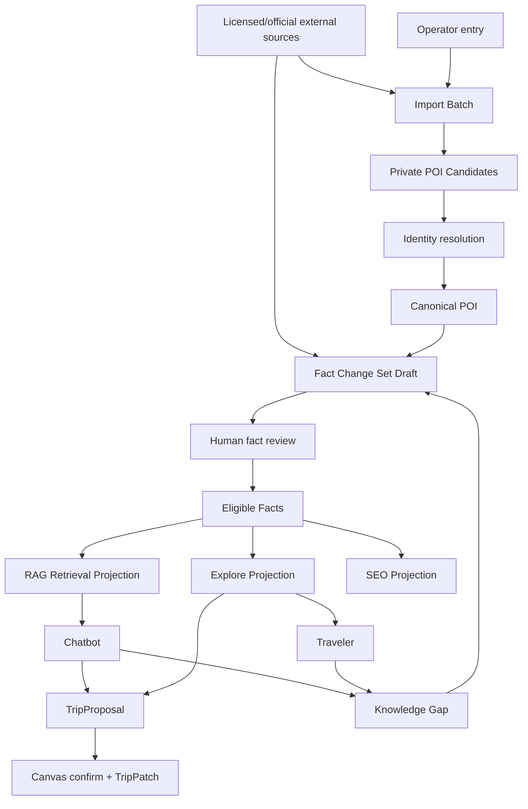
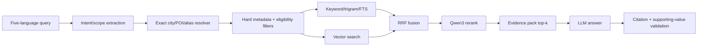
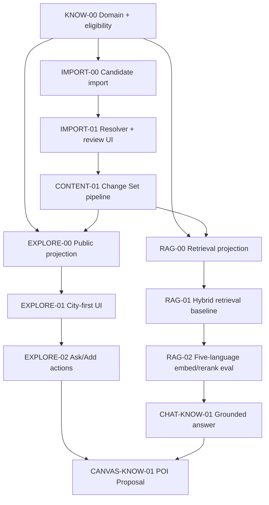

# VisePanda V4 知识库、RAG、Explore 与 Trip Canvas 联动最终规划

> 历史方案／2026-09-05 起退出当前执行入口。产品、分期、价格及任务队列以 [VPJ 总体规划](VISEPANDA-MASTER-PLAN-2026-09-05.md) 和 [VPJ Program](program/2026-09-05/README.md) 为准。下文保留历史证据；有效安全/数据合同继续沿对应ADR适用，不因方案归档而作废。

- 文档版本：v1.0（Codex 第三步最终建议稿）
- 核验日期：2026-08-23
- 状态：**提案，待 operator 接受并通过 ADR/合同 Issue 冻结；不代表知识库、RAG、Explore、外部 POI 导入或数据库已经在 VP-V4 上线**
- 适用仓库：`JTCAO515/VP-V4`
- 历史实现参考：`JTCAO515/VP-Final` 当前 `main`（核验提交 `b5ef081`）
- 用户纠正：问题 4 是“批量导入带外部来源引用的 POI”，**不是批量生成 POI**
- 模型层基线：[model-layer-plan.md](model-layer-plan.md)
- 外部数据基线：[external-data-chatbot-plan.md](external-data-chatbot-plan.md)
- 全局权威开发顺序与验收：[ai-core-engineering-development-acceptance-report.md](ai-core-engineering-development-acceptance-report.md)；本文工作包是知识/RAG/Explore 域详细设计。
- 一手证据底稿：[knowledge-rag-explore-evidence-2026-08-23.md](research/knowledge-rag-explore-evidence-2026-08-23.md)
- Claude方案处置与draft catalogue：[knowledge-base/README.md](knowledge-base/README.md)；30类和18条规则均为candidate，production import与runtime execution均关闭。

---

## 0. 最终结论

### 0.1 一套知识资产，四个产品消费面

VisePanda 不应该建设三套互相复制的数据：

```text
外部来源/人工材料
  -> Imported POI Candidate + Fact Draft
  -> 身份消歧、来源/许可校验、人工审核
  -> Canonical POI + reviewed/current Fact（唯一真理）
       ├─> RAG Retrieval Projection -> Chatbot
       ├─> Explore Projection -> 城市/POI 页面
       └─> TripProposal -> 用户确认 -> Trip Canvas
```

- **知识/内容库**是唯一事实源；
- **Chatbot**通过从 eligible knowledge 生成的可重建 RAG 投影获得证据；
- **Explore**通过同一 knowledge 生成的可重建公开展示投影获得内容；
- **Trip Canvas**保存用户确认的 POI 引用、Fact 引用和行程状态，不复制一个脱离来源的 POI 文本快照；
- **SEO**只发布满足同一 eligibility 与内容质量门的 city/POI 投影；
- Candidate、Draft、过期 Fact、受限外部 provider 数据都不能通过 RAG 或 Explore 绕过审核。

### 0.2 不存在“批量 POI”和“手工 POI”两种实体

批量导入和人工输入只是**候选进入系统的方式**：

- `ImportedPoiCandidate`：从许可允许的外部数据源批量导入；
- `OperatorPoiCandidate`：热门城市中人工补充的对象；
- 两者都必须带来源、稳定 source id、license policy、导入批次和证据；
- 完成消歧/审核后都成为同一种 `CanonicalPoi`；
- 公开消费者不能根据“批量/人工”推断质量。

热门城市的差异不是拥有另一种 POI，而是增加：

- 人工补缺候选；
- `ExploreCollection`（例如“第一次来上海”）；
- `FeaturedPlacement`；
- 城市级 Guide/执行场景；
- 更高的 Fact 覆盖和媒体质量。

### 0.3 RAG 最终技术选择

首发建议使用 **Supabase Postgres + pgvector + Postgres FTS/pg_trgm + hybrid search + rerank**，不引入第二个独立向量数据库。

推荐候选：

| 环节 | 首选候选 | 理由 |
| --- | --- | --- |
| Embedding | `qwen3.7-text-embedding`, 1024 维 | 官方覆盖 201 种语言/方言，包含中、英、西、俄、阿；1024 维兼顾质量、成本和 pgvector |
| Keyword/exact | alias table + `pg_trgm` + Postgres FTS | POI 名、中文名、拼音、常见拼错和精确执行术语不能只靠向量 |
| Fusion | Reciprocal Rank Fusion | 合并 lexical 与 vector rank，不比较不可比原始分数 |
| Rerank | `qwen3-rerank` | 官方支持 100+ 语言和 RAG/Q&A 排序 |
| Vector index | 初期 exact scan；达到实测阈值后 HNSW | 当前城市/Fact 规模没有证据需要 ANN；exact search 有完美 recall |

具体模型和维度仍需用五语 VisePanda eval 决定。Embedding 模型、维度或规范化方式改变时必须全量重建索引；不同模型生成的向量不能混用。

### 0.4 Explore 最终产品形态

Explore 改为 **city-first、evidence-backed discovery**：

```text
/explore
  -> 选择城市 / 从当前 Trip 进入城市
/explore/[city]
  -> 搜索 + 五大分类 + 实用筛选 + Featured/全部地点
/[city]/[poi]
  -> 一个地点的可执行事实、来源、更新时间与 Chatbot/Canvas 动作
```

Explore 默认排序不由 LLM 决定。先过 eligibility，再按筛选匹配、编辑精选、执行信息完整度、freshness 和真实用户行为排序。没有足够事实的城市/POI 不进入 sitemap，也不通过“批量页”填满网站。

### 0.5 内容生产原则

- 一个 Fact 只表达一个事实；
- AI 可以抽取、规范化和起草 Change Set，不能创造来源、POI ID、地址、支付能力或 review；
- 外部来源导入只建立 Candidate/Draft；
- 未经 operator 确认不立即生成或发布大量内容；
- 评审以 10–20 个 POI 或一个执行场景为一批；
- `missing` 比合理猜测更有价值；
- 只有未过期、reviewed、证据合格的 Fact 才能支撑 Chatbot、Explore、SEO 和新 Canvas Proposal。Canvas 可保留已确认地点和历史 receipt，但过期值必须标 `recheck_required`，不能继续当 current。

---

## 1. 当前仓库事实与需要纠正的偏差

### 1.1 VP-V4

当前 VP-V4 是 frontend-only 落地页，没有：

- Canonical POI 数据库；
- Fact review workflow；
- Supabase persistence；
- embedding、hybrid retrieval 或 rerank；
- Explore 城市路由；
- Chatbot/Canvas 实际状态。

本文只是实施基线。

### 1.2 VP-Final 可复用资产

| 资产 | 复用 |
| --- | --- |
| `Poi`, `PoiFact`, `ScopedExecutionFact` | 保留 identity 与 atomic fact 思路；补 Candidate、license、projection contract |
| evidence/source/review/expiry eligibility | 直接保留为硬门 |
| `placeResolver` | 保留 exact/alias/ambiguity 先行；用数据库 alias 取代代码内少量常量 |
| Knowledge service / Ops review | 保留权限、draft、单条确认、renew/deprecate、audit 思路 |
| CSV bulk import | 保留 dry-run、幂等、冲突、全量失败原则；拆分 candidate import 与 fact import |
| Content AI Change Set | 保留“模型只能私有提案、人工查看 diff、原子发布” |
| Explore public Fact projection | 保留 only-current-reviewed、来源与 verification date |
| knowledge gaps | 保留“没有答案 -> 内容缺口”，不保留 raw prompt |
| outbound gateway | Explore 商业链接如未来启用，仍走 active partner/host allowlist/disclosure/audit |

### 1.3 旧 Explore 的问题

旧页面已有正确基础：Fact eligibility、来源时间、真实 unavailable、scene tags 来源于 Fact。但截图和代码显示：

- 北京/上海 POI 混在一个平面列表，不是 city-first；
- 没有城市 selector、搜索、分类层和结果数量；
- scene tags 同时承担筛选/推荐语义，层次不清；
- 卡片只有少量 Fact，信息密度差异大且空白多；
- `Ask Copilot` 是通用入口，没有携带 POI ID/城市/用户意图；
- 没有 `Add to Trip`/Proposal；
- 没有媒体、district、freshness 状态、排序说明或事实缺失表达；
- 页面存在 `/explore` 与 POI SEO 路由，但当前 POI SEO 仍依赖 seed/映射，不是同一动态知识投影的完整闭环。

### 1.4 旧导入的结构问题

旧 CSV 一行同时承担 POI identity 和一个 Fact，因此外部来源大批候选会被迫伪造 Fact 才能导入。第三步应拆成：

1. `POI Candidate Import`：只导入可追溯候选身份；
2. `Canonicalization`：匹配已有 POI 或人工创建 Canonical POI；
3. `Fact Import/Change Set`：对 Canonical POI 创建 atomic draft Facts；
4. `Human Review`：逐 Fact 批准；
5. `Projection`：Explore/RAG/SEO 更新。

---

## 2. Canonical Domain Language

### 2.1 Imported POI Candidate

从一个许可允许的外部来源导入、尚未完成身份合并与公开审核的地点候选。

_Avoid_: generated POI、public POI、verified POI。

### 2.2 Operator POI Candidate

由内容人员在热门城市中补充的地点候选；同样需要来源和消歧，不比批量候选天然更可靠。

_Avoid_: manual truth、editor-approved POI。

### 2.3 Canonical POI

VisePanda 对一个真实地点的稳定内部身份。它本身不是关于该地点所有信息都正确的证明。

_Avoid_: listing、external place、POI page。

### 2.4 Fact

关于一个 National/City/Scene/POI target 的单一、可证据化声明，具有来源、版本、审核和期限。

_Avoid_: description、tip、AI knowledge。

### 2.5 Retrieval Unit

从 eligible Fact 或 reviewed Guide 派生、供 lexical/vector retrieval 使用的可重建索引记录。

_Avoid_: knowledge source、document of truth、chunk database。

### 2.6 Explore Projection

从 Canonical POI、eligible Facts、licensed media 和 editorial placements 派生的公开读取模型。

_Avoid_: Explore database、generated listing。

### 2.7 Explore Collection

面向一个城市/场景的人工编排 POI ID 列表，例如“第一次来北京”，不改变 POI 或 Fact 的资格。

_Avoid_: category、AI recommendation list。

### 2.8 Featured Placement

经编辑批准的排序关系，只影响指定 Explore surface/时间窗口，不是事实质量分数。

_Avoid_: best POI、verified rank。

### 2.9 Knowledge Gap

用户反复提出但当前没有足够 eligible evidence 的规范化问题模式。

_Avoid_: failed prompt、automatic research task。

### 2.10 Trip Place Reference

Trip/Canvas 中指向 Canonical POI 的稳定引用，并携带用户确认和必要的 Fact reference。

_Avoid_: copied POI card、model place blob。

---

## 3. 知识/内容库总体架构

### 3.1 写模型与三个投影



POI/Facts 是写模型；RAG、Explore、SEO 是 read projections。Projection 可以删除重建，不能反向修改 truth。

### 3.2 建议最小关系

| Relation | 责任 |
| --- | --- |
| `poi_candidates` | 私有 Imported/Operator 候选、source/许可/批次/状态 |
| `pois` | Canonical identity：id、city、category、canonical names、可持久化坐标 |
| `poi_aliases` | 多语别名、拼音、常见拼写、来源；只用于解析 |
| `facts` | atomic scoped facts、evidence、review、expiry、version |
| `fact_sources` | source locator、license policy、retrieval metadata |
| `fact_reviews` | 私有 reviewer/action/version/audit |
| `media_assets` | attribution/license/rights/target/status |
| `import_batches` / `import_rows` | dry-run、hash、幂等、冲突、counts |
| `explore_collections` / `collection_items` | 热门城市人工集合与排序关系 |
| `retrieval_units` | 可重建 lexical/vector projection |
| `knowledge_gaps` | 规范化缺口与 resolution target |

不要在第一版创建“标签、主题、榜单、推荐、内容块”十几张自由表。能从 facts/collections 投影的就不建立第二真理源。

### 3.3 权限边界

- Candidate、Draft、review identity、raw source notes、media rights 仅 Ops/private；
- public/Chatbot/Explore 只能读 projection；
- RAG similarity search 仍受 RLS/eligibility，而不是 service role 全库扫完后再过滤；
- Supabase 文档确认 pgvector 查询可继续服从 RLS；
- exposed schema 的新表必须明确 GRANT + RLS，不能假设自动暴露；
- views 使用 `security_invoker=true` 或放 private schema；
- `SECURITY DEFINER` 不能用来解决检索权限报错。

---

## 4. POI 与内容类目

### 4.1 保留五个主分类

当前 Canonical category 继续使用：

```text
food | attraction | hotel | shopping | experience
```

机场、火车站、支付、网络、救援不是为了 Explore 方便就新增 POI category；它们仍属于 City/Scene/Transport domain。热门专题通过 Collection/Fact facet 表达，不污染 category enum。

### 4.2 Facet 不是 Category

用户说的“外语服务”“Apple Pay”“接受信用卡”“有翻译服务”都是可筛选 Fact facet，不是地点类别。

建议 Explore facet group：

| Facet group | 示例 |
| --- | --- |
| Communication | staff language、English menu、multilingual signage、audio guide、translation desk |
| Payment | cash、Visa、Mastercard、UnionPay、Apple Pay、Alipay、Weixin Pay |
| Entry & booking | booking required、passport accepted、official channel、last entry |
| Local presentation | Chinese name/address、district、metro exit、taxi display |
| Accessibility | step-free entry、wheelchair route、accessible toilet、elevator |
| Food communication | menu language、vegetarian option、halal claim source、allergy process |
| Time & environment | opening hours、closed days、indoor/rain fit、crowd pattern、duration |
| Traveler fit | first-time、low-Mandarin、family、luggage, late-arrival |

每个执行 badge 只能来自 eligible Operational/Observed Fact，或来自带 supporting Fact IDs 的 deterministic DerivedFacet。EditorialAssessment 只能作为编辑理由，不能冒充执行能力。

### 4.3 Identity 与定位 Facts

- `official_name_en`
- `official_name_zh`
- `district`
- `local_name_zh`
- `local_address_zh`
- `local_address_district`
- `local_address_nearest_metro_exit`
- `local_address_visibility_note`
- `correct_entrance`
- `coordinate_reference`（必须带坐标系与许可）

Alias 不是 Fact evidence；外部 provider ID 也不是地址真相。

### 4.4 Language/translation Facts

不要只有 `english_support: true`。建议：

```ts
type LanguageSupportValue = {
  language: "en" | "es" | "ru" | "ar" | "zh" | string;
  channel:
    | "staff"
    | "menu"
    | "signage"
    | "audio_guide"
    | "human_guide"
    | "website"
    | "booking_flow"
    | "translation_device";
  scope: "always" | "scheduled" | "on_request" | "unknown";
  availabilityNote?: string;
};
```

一个 POI 有英文官网不等于现场员工会英语；英文菜单不等于过敏沟通安全；机器导览不等于人工翻译服务。每个 channel 单独成 Fact。

建议 Fact types：

- `staff_language_support`
- `menu_language_available`
- `multilingual_signage`
- `audio_guide_language`
- `human_guide_language`
- `booking_flow_language`
- `translation_device_available`
- `communication_fallback`

### 4.5 Payment Facts

不要创建 `accepts_credit_card: true`。银行卡和 Apple Pay 需要更精确：

```ts
type PaymentAcceptanceValue = {
  instrument:
    | "cash_cny"
    | "unionpay"
    | "visa"
    | "mastercard"
    | "amex"
    | "jcb"
    | "apple_pay"
    | "alipay"
    | "weixin_pay";
  channel: "onsite_pos" | "online_booking" | "deposit";
  foreignIssued: "supported" | "not_supported" | "unknown";
  contactlessRequired?: boolean;
  network?: string;
  conditions?: string;
};
```

Apple 官方说明：门店设备必须启用 NFC contactless，且商户还要接受底层卡组织；即使读卡器有图标也可能未配置。因此 `apple_pay` 不能由“看到 contactless”推断，必须 POI/运营方或 operator 实测。

建议 Fact types：

- `payment_instrument_acceptance`（一 instrument 一 Fact）
- `foreign_card_direct_acceptance`
- `mobile_wallet_acceptance`
- `cash_fallback`
- `deposit_requirement`
- `payment_failure_fallback`

支付/营业时间属于 `volatile-30d-v1`；过期后 badge 自动消失，不保留一个漂亮但过时的图标。

### 4.6 Entry/booking Facts

- `booking_required`
- `reservation_helpful`
- `accepted_identity_document`
- `passport_requirement`
- `ticket_name_matching`
- `official_booking_channel`
- `booking_window`
- `last_entry_time`
- `security_check_notes`
- `no_ticket_fallback`

实时库存不是静态 Fact；无正式 API 时仅显示规则和官方 action。

### 4.7 Accessibility Facts

- `step_free_entrance`
- `wheelchair_route`
- `elevator_available`
- `accessible_toilet`
- `stroller_fit`
- `mobility_assistance`
- `sensory_access_note`

“accessible”不能作为一个总 boolean。缺任何一项保持 unknown。

### 4.8 Food 与高风险边界

- `menu_language_available`
- `vegetarian_option_observed`
- `halal_certification`（必须直接证据）
- `dietary_confirmation_process`
- `allergen_information_channel`

餐厅宣称有素食不等于无交叉污染；菜单翻译不等于过敏安全。过敏/医疗/紧急表达仍走 Safe Phrase exact lookup 与专业审核，不走普通 RAG。

### 4.9 Environment/fit content kinds

Operational/Observed Facts：`indoor_outdoor`、`luggage_restriction`、有时间/地点/来源的 `crowd_pattern_observation` 与 `queue_observation`。

EditorialAssessment：`suggested_duration`、`first_timer_fit`、`family_fit`。它们需要 editor/revision，但不支撑开放、支付、入场或安全 claim。

DerivedFacet：`rainy_fit`、`low_mandarin_fit`、`heat_rain_preparation`。它们由版本化规则和 supporting Fact IDs 生成；规则输出 unknown 时不显示。模型不能从“博物馆”或“网红店”标签自由推导。

### 4.10 Media

图片必须有 target、author/source、attribution、license、commercial-use 权利、POI match、alt text draft 和 review status。地图/OTA/社交平台图片不能默认复制。长尾城市宁可用无图卡或有授权城市图，不使用版权未知素材。

---

## 5. 外部来源 POI 导入

### 5.1 Source 资格

可进入 candidate import 的来源：

- 官方景点/商户/政府/运营方目录；
- 明确允许持久化/商业使用的 licensed feed；
- OSM/ODbL extract 先进入隔离 staging（需 attribution、derivative database/share-alike 与 production service 评估后再合并）；
- operator retained evidence；
- 用户报告仅作 candidate lead。

不能批量导入：

- Google Places/高德/Mapbox Search Box 等当前条款禁止持久化的结果；
- 搜索结果 snippet；
- API 市集/逆向爬虫；
- 模型列出的“热门地点”；
- 无许可图片、评论、评分、价格。

### 5.2 Candidate schema

```ts
type ImportedPoiCandidate = {
  id: string;
  importBatchId: string;
  sourceKey: string;
  sourceRecordId: string;
  sourceLocator: string;
  licensePolicyId: string;
  retrievedAt: string;
  rawContentHash: string;
  cityCandidate: string;
  categoryCandidate: PoiCategory;
  names: Array<{ locale: string; value: string; sourceField: string }>;
  externalIds: Record<string, string>;
  coordinates?: { lat: number; lng: number; system: CoordinateSystem };
  status:
    | "imported"
    | "needs_match"
    | "possible_duplicate"
    | "matched"
    | "rejected";
  matchedPoiId?: string;
};
```

候选不携带 `reviewed`，也不出现在 Explore/RAG。

### 5.3 导入流程

```text
Upload CSV/JSONL/provider feed snapshot
 -> license policy gate
 -> dry-run schema/encoding/size/vocabulary
 -> normalize names/city/category/coordinate system
 -> stable source ID dedupe
 -> candidate matching
 -> human merge/create/reject preview
 -> Canonical POI identity write
 -> separate Fact Change Sets
 -> per-Fact review
 -> projections rebuild
```

### 5.4 去重层级

1. 同 source + sourceRecordId：幂等 replay；
2. 已知 external ID 命中：候选匹配；
3. normalized city + exact official name/alias：候选匹配；
4. 名称相似 + 小距离：标 `possible_duplicate`；
5. 多个候选：人工选择；
6. 模型只能对已给定候选排序，不能决定 merge/create。

地理 proximity 不能跨坐标系直接计算。

### 5.5 批次与幂等

- `batch_id + source_record_id + raw_hash` 为稳定审计键；
- unchanged replay 是 duplicate/no-op；
- 同 source record 内容变化创建 diff/conflict，不静默覆盖；
- 已 reviewed POI/Fact 永远不由导入覆盖；
- 一个错误是否阻断全 batch：identity import 建议 all-or-nothing；后续 Fact publication 必须逐 Change Set 原子；
- dry-run 报告：created candidates、matched、possible duplicates、rejected、errors、license blocked、coordinate blocked。

### 5.6 大城市/普通城市的共存

**普通城市：**

- 主要由 Imported POI Candidates 建立基础覆盖；
- 仍按 Fact review gate 才公开；
- 没有媒体/执行事实时保持简洁或不发布；
- 不生成城市介绍/推荐语来掩盖空数据。

**热门城市：**

- 同样先导入外部来源候选；
- operator 补充遗漏候选和关键执行事实；
- 创建 Explore Collections/Featured Placements/City Guides；
- 更高 review cadence 与媒体权利投入；
- 不建立单独数据库或特殊 POI schema。

建议先用一个普通城市 + 一个热门城市做对照 pilot，每批 review 10–20 个 POI，未经用户确认不扩到全中国。

---

## 6. Content AI 的安全用途

Content AI 只处理已经进入授权工作区的来源：

```text
source material
 -> bounded extractor
 -> POI candidate suggestions / Fact operations
 -> typed private Change Set
 -> diff + evidence + risk
 -> human edit/reject/approve
 -> atomic publication + audit
```

模型可以：

- 从来源文本抽取名称/字段候选；
- 归一化枚举；
- 提议 fact type；
- 发现缺字段/冲突；
- 把已有 source locator 和 evidence summary 放进 draft；
- 在 bounded existing POI candidates 中排序。

模型不能：

- 自己寻找/选择未授权网页后当 evidence；
- 创建 Canonical POI ID；
- merge 两个 POI；
- 生成 source/reviewer/verifiedAt；
- 把“Apple Pay 可能支持”写成 Fact；
- 自动批准、批量批准、发布、删除或改权限；
- 把外部页面中的 prompt injection 当指令。

---

## 7. RAG 架构

### 7.1 RAG 不是所有数据的搜索框

进入 public Chatbot RAG 的内容：

- eligible POI Facts；
- eligible National/City/Scene Facts；
- reviewed Guide chunks；
- canonical POI identity/aliases（只用于解析）；
-允许进入 prompt 的 external observations 通过 direct tool，不写入长期 index。

不进入：

- POI Candidates；
- Draft/rejected/expired/conflicted Facts；
- raw external pages/JSON；
- Google/高德等禁止 LLM 的内容；
- reviews/ratings；
- commercial offers；
- raw user reports、Trips、private media；
- Safe Phrase 高风险值（走 exact key lookup）。

Guide 是 editorial composition，不是第二事实源。每个涉及执行值的 Guide sentence/chunk 必须绑定 Fact IDs；关联 Fact 过期、撤销或冲突时，该句失去检索资格。无 Fact 支撑的叙述只能提供低风险背景/选择理由。

### 7.2 Retrieval Unit

Execution Fact 默认一 Fact 一 Retrieval Unit，附最小 entity context：

```ts
type RetrievalUnit = {
  id: string;
  sourceType: "fact" | "guide_chunk";
  sourceId: string;
  sourceVersion: number;
  target: { scope: "national" | "city" | "scene" | "poi"; id: string };
  city?: string;
  category?: PoiCategory;
  factType?: string;
  locale: string;
  text: string;
  citationFactIds: string[];
  eligibilityVersion: string;
  contentHash: string;
  embeddingModel: string;
  embeddingDimensions: number;
  embedding: number[];
  indexedAt: string;
};
```

不要把 20 个不同来源 Fact 拼成一段“POI 简介”后只留一个 citation。Guide 可按标题段落切片；执行 Fact 保持原子性。

### 7.3 Index lifecycle

```text
Fact reviewed/renewed/edited/deprecated/expired
 -> index event
 -> rebuild/delete Retrieval Unit
 -> update lexical fields
 -> embedding job
 -> projection version advances only after success
```

- edited Fact 立即回 draft，旧 retrieval unit 下线；
- expiry 不等 cron 才发现，query 仍有 `expiresAt >= now()` hard filter；
- embedding job 失败不会让未审核内容可见；
- model change 建立新 index version，完成 eval 后原子切换；
- RAG index 可全部删除重建。

### 7.4 Query pipeline



顺序很重要：先 exact entity 与 eligibility，再 semantic。不能先在全库向量检索，再让模型决定哪个 POI/城市。

该顺序适用于 `exact_entity`。统一 QueryMode 还包括 `city_discovery`、`comparison/trip_set`、`scene_national` 和 `ambiguous`：discovery 先冻结 city/facets，comparison 先解析多个 IDs，scene/national 不强迫选择 POI；ambiguous 必须澄清，不能静默扩大为 discovery。

### 7.5 Hybrid retrieval

- exact name/source ID match 始终优先；
- aliases/拼写使用 normalized column + `pg_trgm`；
- English/Russian等可用对应 FTS config；中文/阿语不要假设英文 tokenizer 有效；
- vector 负责跨语言/同义表达；
- lexical 与 vector 各取 top-N，用 RRF 合并；
- rerank top 20 左右，最终给模型 4–8 个 evidence units；具体 N 由 eval 决定；
- structured filters（city/category/factType/payment instrument/language）在 SQL 中完成，不交给向量“理解”。

### 7.6 Embedding/rerank

`qwen3.7-text-embedding` 官方支持 201 种主要语言/方言，包括 zh/en/es/ru/ar；建议以 1024 维进入 eval。`qwen3-rerank` 支持 100+ 语言。

选择它们的理由是当前模型栈已有 Qwen，且五语覆盖公开明确；不是因为官方 benchmark 能证明 VisePanda 质量。

必须测试：

- 五种语言问同一事实；
- 中文/英文 POI 名互搜；
- 拼音/常见错拼；
- Apple Pay/Visa/foreign card 的精确区分；
- 空证据应返回 0；
- city/POI ambiguity；
- high-risk phrase 不进入普通结果；
- Arabic RTL 只影响显示，不改变检索 entity ID。

### 7.7 pgvector 策略

pgvector exact search 提供 perfect recall；HNSW/IVFFlat 用速度换 recall。当前计划规模先用 exact：

- 先建立真实 rows、p95 和 recall baseline；
- 若 p95 或 rows 达到明确触发，再评估 HNSW；
- HNSW filtering 可能导致返回不足，需要 iterative scans/分区/partial index；
- 索引维度必须与 embedding 一致；
- Supabase extension version 不显式 pin（当前 changelog 已弃用 version pinning）。

### 7.8 RAG 权限

- public retrieval：只读 eligible public units；
- Ops retrieval：可读自己有权查看的 drafts，但使用独立 endpoint/index namespace；
- user Trip/private notes：不是 public knowledge，单独 RLS 与上下文通道；
- 不用 service role 从浏览器查询；
- vector search function 默认为 `security invoker`，RLS hard filter 保留；
- RAG projection 没有发布/写 Fact 权限。

### 7.9 RAG 输出

Evidence pack：

```ts
type EvidenceItem = {
  retrievalUnitId: string;
  factIds: string[];
  targetId: string;
  text: string;
  claims: GroundedClaim[];
  sourceLabel: string;
  verifiedAt: string;
  expiresAt: string;
};
```

模型只引用 pack 内 EvidenceReceipt IDs。地址、时间、价格、线路、支付、入场和 Safe Phrase 等执行值由 typed `GroundedClaim` + 确定性 renderer 生成；字符串匹配不再作为安全门。无法构造 typed claim 时 unavailable。

---

## 8. Chatbot、Explore 与 Trip Canvas 联动

### 8.1 Explore -> Chatbot

每张卡的 “Ask VisePanda” 发送：

```ts
{
  capability: "ask_about_poi",
  args: { poiId, city, source: "explore", exploreStateVersion }
}
```

不发送卡片文案让模型重新猜 POI。Chatbot exact-filter 该 POI 后检索事实。

### 8.2 Explore -> Canvas

“Add to Trip” 不直接写入：

```text
POI ID + selected day/intent
 -> retrieve current eligible facts
 -> TripProposal
 -> Canvas diff (place, day, assumptions, missing readiness)
 -> user confirm
 -> TripPatch
```

接受时再次验证 POI 仍存在、Fact 未过期、Trip version 未冲突。

用户手动保存的地点可以使用私有 `UserPlaceRef/UnresolvedPlaceRef` 进入 Trip，但不能进入 Explore、public RAG、SEO 或 reviewed coverage。后续匹配 Canonical POI 需要用户确认，不能静默合并。

### 8.3 Chatbot -> Explore

Chatbot 推荐只返回 Canonical POI IDs；UI 用 Explore Projection 渲染卡片。模型不能临时创造 POI card 或把一个未审核外部地点当 Explore 结果。

### 8.4 Chatbot -> Canvas

RAG evidence 支撑的计划仍是 Proposal。POI 缺地址、预约或支付 Fact 时：

- 允许把 POI 作为灵感候选加入 draft；
- 对缺失字段显示 `unknown/needs_attention`；
- 不生成看似完整的地址/时间；
- Today 执行前 readiness gate 可能阻止导航/入场动作。

### 8.5 Canvas -> knowledge freshness

Canvas 打开时按 Fact ID 检查：

- current：正常；
- aging：显示 upcoming recheck；
- expired/deprecated：标 `recheck_required`，不删除用户地点；
- changed reviewed Fact：显示变化通知；
- no evidence：保留用户决定，但收紧执行 action。

事实变化不自动重写 Trip。

### 8.6 Feedback loop

```text
Explore view/save/ask
 + Chatbot no-answer/correction
 + Canvas recheck/failure
 -> privacy-safe observation
 -> Knowledge Gap / Fact Report Draft
 -> editor research/review
 -> Fact version
 -> projections rebuild
```

用户报告、点击和高频查询只决定“先研究什么”，不能决定事实真假或直接提高 public rank。

---

## 9. Explore 信息架构与页面设计

### 9.1 路由

```text
/explore                       city selector / current Trip cities
/explore/[city]                canonical city Explore page
/[city]/[poi]                  canonical POI detail
/[city]/[poi]/[intent]         only when evidence-backed SEO matrix qualifies
```

Filter query params 不自动产生可索引页面。Google 官方说明 faceted URLs 易产生无限 crawl space；默认 canonical 到 city page，并对无价值过滤组合 noindex/robots policy。Sitemap 只列 eligible city/POI/intent pages。

### 9.2 Desktop wireframe

```text
┌ Header ─ VisePanda / Explore / Trip ─ locale ┐
├ City selector: Shanghai ▼    Search places... ┤
├ City summary: 42 places with reviewed information ┤
├ Categories: All Food Attractions Hotels ...    ┤
├ Practical filters: Language Payment Booking ...├
├ Featured collection (curated cities only)      ┤
├ Sort: Recommended / Freshest / Name            ┤
├ Result list/cards                      Map opt. ┤
│ Card: image, name, district/category            │
│ 2-3 verified practical facts + freshness        │
│ Ask VisePanda · Add to Trip · Details           │
└ Honest missing/unavailable state                ┘
```

### 9.3 Mobile

- sticky city/search bar；
- horizontal category chips；
- filters in bottom sheet with applied count；
- list-first，map is explicit toggle；
- action row stays reachable with 44px minimum target；
- Arabic mirrors layout and keeps mixed Chinese POI names readable；
- filter/result count announced with `aria-live`；
- long POI names/translated badges must wrap，not truncate critical facts。

### 9.4 Card anatomy

必须：

- name in interface locale + Chinese name；
- city/district + canonical category；
- licensed image or intentional no-image placeholder；
- at most 3 practical badges from eligible Facts；
- each critical badge has its own verified/expiry；card summary must not imply the whole POI was reviewed；
- `Ask VisePanda`、`Add to Trip`、`Details`。

不得：

- 无来源星级/评分；
- “Best”“Top” 之类未经定义排名；
- expired payment/language badges；
- partner CTA 抢占核心 actions；
- 把 fact count 当“verified place”总质量；
- 用 AI 营销语补足缺数据卡片。

### 9.5 POI detail

```text
Identity + local name/address readiness
Why it may fit this trip (derived, not fact)
Language & communication
Payment
Entry/booking
Getting there / local display
Accessibility
Hours/crowd/weather readiness
Sources & last checked
Ask VisePanda / Add to Trip / official action
```

只有有 Fact 的 section 展示；没有就显示必要的 unknown，不能从 category 模板填值。

### 9.6 City selector 与城市成熟度

导入了 candidate 不等于城市公开。建议状态：

| State | 公开行为 |
| --- | --- |
| `candidate_only` | Ops 可见；Explore 不显示 |
| `catalog_ready` | 具备足够 Canonical POIs/identity，可作为 noindex preview |
| `explore_ready` | 类别和 Fact coverage 达接受门，城市进入 selector/sitemap |
| `curated` | 热门城市有 Collections、媒体和更高事实覆盖 |

具体数量门应由 pilot 决定。可沿用旧六城计划的 launch minimum 30 POI/每类 6 个作为评估起点，但不能把数量替代 required Fact coverage。

---

## 10. Explore 筛选、排序与搜索

### 10.1 Structured filters

以下必须 SQL typed filter，不能用 RAG 猜：

- city、category、district；
- language/channel；
- payment instrument/channel/foreign-issued；
- booking/passport；
- accessibility item；
- indoor/rain fit；
- reviewed freshness。

只有存在 current eligible Fact 的 POI 才匹配 filter。

### 10.2 Text search

- exact POI/alias/nameZh/pinyin first；
- typo uses pg_trgm；
- natural-language “适合不会中文的雨天餐厅”可走 same hybrid retrieval，但最终结果仍投影为 eligible POI cards；
- result must show matched reasons from facts，not hidden vector similarity。

### 10.3 Default ordering

使用 lexicographic gates，而不是一个无法解释的 AI score：

1. eligibility；
2. exact city/filter match；
3. active FeaturedPlacement（curated city only）；
4. required execution-fact completeness；
5. freshness；
6. traveler-scene fit；
7. verified behavior signal after adequate volume；
8. stable tie-breaker（canonical name/id）。

LLM 不在请求时排序。Editorial boost 有 owner、surface、有效期；过期自动退出。

### 10.4 Behavior signals

未来可以用：detail opened、Ask、Proposal created、Proposal accepted、recheck success。不能用单纯 page impression 或 partner click 证明 POI 更好。

新城市数据少时不要让少数点击形成 feedback lock-in；在达到最低样本前只记录，不参与排序。

### 10.5 SEO

- city base、eligible POI detail、evidence-backed intent pages可 index；
- candidates/drafts/empty/thin/duplicate pages noindex；
- filters/sort URL 不进入 sitemap；
- canonical slug 来自 reviewed identity，不随翻译模型变化；
- 五语 alternates 只有真实完整 locale page 时才发布；
- Fact 过期导致页面承诺不足时，从 sitemap 移除或 noindex，不保留薄页。

---

## 11. Review、发布与失效

### 11.1 Candidate review

内容人员确认：source rights、identity、city、category、names、coordinate system、duplicate/merge。确认身份不批准 Facts。

### 11.2 Fact review

一条一条 review：source class/locator、evidence summary、value、fact type、confidence（证据强度）、verifiedAt、expiry、conflict、public wording。

不提供 bulk approve。

### 11.3 Publication

Change Set 可能包含多条 operations，但 publication 必须 all-or-nothing；任一 expected version stale 全部 rebase。Importer 的 `reviewed` collection metadata 也不直接让 new Fact public，它仍走系统 review transition。

### 11.4 Invalidation

Fact edit/deprecate/expiry：

- public projection 立即排除；
- retrieval unit 立即删除/禁用；
- Explore badge 消失；
- SEO matrix 重算；
- Canvas reference 标 recheck；
- already-generated answer 不被当持久知识。

---

## 12. Eval 与可观测性

### 12.1 Import

- schema/encoding/header/size；
- source/license missing；
- exact replay/idempotency；
- changed source row conflict；
- duplicate IDs/name/geo；
- coordinate-system mismatch；
- existing reviewed data overwrite attempts；
- candidate never public。

### 12.2 RAG

| Metric | Purpose |
| --- | --- |
| entity resolution accuracy | exact POI/city before retrieval |
| Recall@k | relevant eligible Fact appears |
| Precision@k | irrelevant/other-city Fact excluded |
| MRR/nDCG | rank quality |
| rerank gain | qwen3-rerank value over RRF baseline |
| cross-language parity | zh/en/es/ru/ar same task |
| no-evidence precision | empty must remain empty |
| citation precision | cited Fact supports claim |
| unsupported claim rate | target 0 for execution facts |
| retrieval latency/cost | accepted-turn total cost |

### 12.3 Explore

- filters only match supported facts；
- expired badge count 0；
- city selector coverage；
- Ask/Add carries exact POI ID；
- no horizontal overflow/RTL；
- empty/unavailable distinction；
- sitemap contains only eligible pages；
- filter URL crawl policy；
- card/source/freshness accessibility。

### 12.4 Product observations

- Explore -> Ask rate；
- Explore -> Proposal -> accepted rate；
- no-answer/gap rate；
- Fact correction/rejection/staleness；
- recheck completion；
- query reformulation；
- no-result by city/category/facet。

这些决定内容优先级，不自动决定事实或排名。

---

## 13. 推荐开发工作包



| ID | Scope | Acceptance | Rollback |
| --- | --- | --- | --- |
| KNOW-00 | Canonical language、POI/Fact/source/license/projection contracts | candidate/draft cannot be public; one Fact one claim | current preview only |
| IMPORT-00 | external-source candidate CSV/JSONL dry-run + batch/hash/audit | no generation；license/source required；idempotent | disable import |
| IMPORT-01 | exact/external-id/name+geo candidates、human match/create/reject | model cannot merge/create ID | manual single POI entry |
| CONTENT-01 | source -> typed private Change Set -> human atomic publication | no auto review/publish；conflict rebase | private drafts retained/cancelled |
| RAG-00 | retrieval_units lifecycle/invalidation/RLS | only eligible units；delete on expiry/edit | keyword exact only |
| RAG-01 | alias/trigram/FTS + exact vector + RRF | baseline Recall/Precision/latency | lexical only |
| RAG-02 | qwen3.7 embedding + qwen3 rerank five-language eval | red lines 0；gain over baseline | keep RAG-01 without rerank |
| CHAT-KNOW-01 | evidence pack/citation/support validation | no-evidence honest；fact ID allowlist | grounded QA disabled |
| EXPLORE-00 | Explore Projection、city readiness、filters/ranking/SEO contract | same eligibility as Chatbot；no thin pages | current static preview |
| EXPLORE-01 | city-first responsive page/detail/filter | desktop/mobile/five locales/RTL/accessibility | feature flag |
| EXPLORE-02 | Ask VisePanda/Add to Trip exact POI actions | no text re-resolution；no direct Trip write | hide actions |
| CANVAS-KNOW-01 | POI Proposal/fact references/freshness/recheck | confirm + version + eligibility recheck | Canvas read-only |

### 13.1 实施顺序

1. KNOW-00；
2. IMPORT-00 小批外部来源候选；
3. EXPLORE-00 projection + 一个普通城市/一个热门城市 fixture；
4. RAG-00/RAG-01 lexical + exact vector baseline；
5. EXPLORE-01 city-first UI；
6. RAG-02 五语 embedding/rerank；
7. Explore/Chatbot/Canvas actions；
8. Content AI Change Set 自动化辅助。

不要先做通用爬虫、全国城市导入、向量数据库 SaaS、AI 推荐排序或大规模媒体管线。

---

## 14. 推荐里程碑

| Milestone | focused time | Result |
| --- | --- | --- |
| M0 Domain + candidate import contract | 1–2 周 | 不接 production source 的 dry-run/fixture |
| M1 One ordinary + one curated city pilot | 2–3 周 | external-source candidates -> reviewed subset -> projection |
| M2 RAG lexical/hybrid baseline | 2–3 周 | exact/FTS/vector/RRF + eval |
| M3 City-first Explore | 2–3 周 | responsive five-language city/POI flow |
| M4 Chatbot/Canvas knowledge actions | 2 周 | POI ID Ask/Add/Proposal/recheck |
| M5 Content AI guarded assistance | 2–3 周 | source-backed Change Sets only |

外部数据授权、内容研究、人工 review 和媒体许可不计入纯编码工时。

---

## 15. Feature flags 与 Stop Conditions

```text
KNOWLEDGE_IMPORT_ENABLED
RAG_RETRIEVAL_ENABLED
RAG_RERANK_ENABLED
EXPLORE_CITY_ENABLED
EXPLORE_ASK_ENABLED
EXPLORE_ADD_TO_TRIP_ENABLED
CONTENT_AI_DRAFTS_ENABLED
```

立即停线：

- external source 无持久化/AI 权利却导入；
- candidate/draft 出现在 Explore/RAG；
- importer 覆盖 reviewed data；
- 模型创建/merge POI ID；
- payment/language badge 无 current Fact；
- high-risk phrase 进入普通 RAG；
- embedding model 混用；
- RAG/Explore eligibility 不一致；
- Explore Add 直接写 Trip；
- filters 产生大规模可索引薄页；
- 用户报告或点击自动变成事实/排名。

---

## 16. Operator 需要裁决

1. 接受“Imported POI Candidate，不是生成 POI”的规范语言和候选/真理边界。
2. 接受 Explore/RAG/SEO 是同一知识库的 projections，不建立独立内容数据库。
3. 接受首发保留五个 POI categories，外语/支付/翻译/无障碍作为 typed Fact facets。
4. 接受 Postgres/Supabase hybrid RAG 起步，不先采购独立 vector DB。
5. 接受一个普通城市 + 一个热门城市的小批 pilot，评审批次 10–20 POI；通过后再扩城市。
6. 接受热门城市差异在 Collections/Featured/Guides/Fact coverage，不建立“手工 POI”特殊类型。

---

## 17. 知识域在 SYS-00 后的首个工作包

在 ML-00、DATA-00 之后创建：

> **KNOW-00：冻结 ImportedPoiCandidate -> CanonicalPoi -> Fact -> RetrievalUnit/ExploreProjection -> TripPlaceReference 的领域契约、eligibility 和失效传播。**

然后用一个普通城市和一个热门城市各导入不超过 20 个带外部来源引用的候选，仅做 dry-run、消歧和 draft review。不要先做全国批量导入，也不要先生成页面。

---

## 18. 一手来源与仓库证据

### RAG/Postgres/Supabase

- [Supabase Hybrid Search](https://supabase.com/docs/guides/ai/hybrid-search)
- [Supabase RAG with Permissions](https://supabase.com/docs/guides/ai/rag-with-permissions)
- [Supabase pgvector](https://supabase.com/docs/guides/database/extensions/pgvector)
- [pgvector upstream](https://github.com/pgvector/pgvector)
- [PostgreSQL Full Text Search](https://www.postgresql.org/docs/current/textsearch-controls.html)
- [PostgreSQL pg_trgm](https://www.postgresql.org/docs/17/pgtrgm.html)
- [PostgreSQL unaccent](https://www.postgresql.org/docs/17/unaccent.html)

### Embedding/rerank

- [Alibaba/Qwen Embedding](https://help.aliyun.com/en/model-studio/embedding)
- [Alibaba/Qwen Rerank](https://help.aliyun.com/en/model-studio/rerank)
- [Alibaba Knowledge Retrieval](https://help.aliyun.com/en/model-studio/rag-knowledge-retrieval)

### Explore/SEO

- [Google faceted navigation crawling](https://developers.google.com/crawling/docs/faceted-navigation)
- [Google noindex](https://developers.google.com/search/docs/crawling-indexing/block-indexing)
- [Next.js Metadata](https://nextjs.org/docs/app/getting-started/metadata-and-og-images)
- [Next.js sitemap](https://nextjs.org/docs/app/api-reference/file-conventions/metadata/sitemap)

### POI/payment/source rights

- [Apple Pay usage requirements](https://support.apple.com/en-us/120364)
- [China government payment guide](https://english.www.gov.cn/2025special/bizexpatsinchina2025)
- [Google Places policies](https://developers.google.com/maps/documentation/places/web-service/policies)
- [Google Maps Terms](https://cloud.google.com/maps-platform/terms)
- [AMap terms](https://lbs.amap.com/pages/terms/)
- [OpenStreetMap ODbL](https://www.openstreetmap.org/copyright)

### Current workspace/history

- VP-Final `packages/domain/src/knowledge/*`
- VP-Final `apps/server/src/modules/knowledge/*`
- VP-Final `apps/web/src/app/explore/*`
- VP-Final `docs/architecture/content-ai-dependency-map.md`
- VP-Final `docs/constraints/content-ai.md`
- VP-Final `docs/planning/six-city-knowledge-expansion-plan.md`
- 广州模板 README/CSV/JSONL 与独立审计结果

---

## 19. 最终成熟度声明

- **已核验：** 旧仓库事实/导入/Explore/Content AI 边界；广州模板失败原因；Supabase/Postgres/pgvector hybrid/RLS；Qwen embedding/rerank 官方能力；外部来源许可限制。
- **架构建议：** Candidate/Canonical/Fact/projection 分层；typed service facets；Postgres hybrid RAG；city-first Explore；小批 external-source import。
- **待实测：** qwen3.7 embedding/rerank 五语质量，exact search 性能，普通/热门城市 pilot，外部数据源完整许可，Explore 排序与用户行为。
- **未实现：** 本文全部数据库、importer、RAG、Explore、Content AI、Chatbot/Canvas 联动能力。
