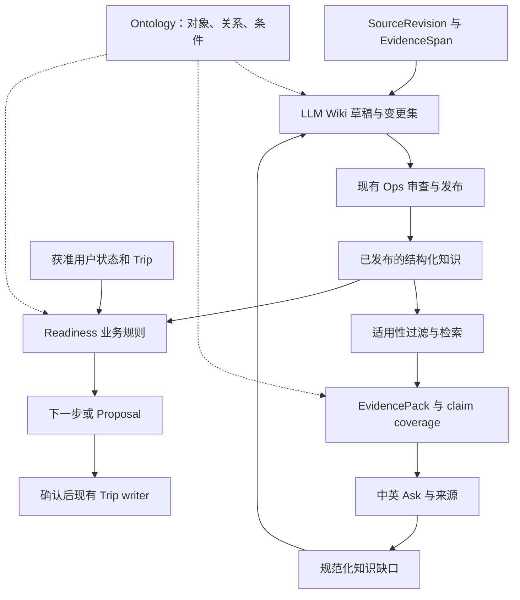

# VisePanda 知识体系升级执行方案

日期：2026-09-13。JT 已同意本方案方向并授权细化规划、拆分 GitHub Issues。
本文件是实施规格；任务身份、完整验收与依赖只在 [issue-plan.json](../program/2026-09-05/issue-plan.json) 维护。
规划 PR 合入前，新接口仍是提案。创建 Issue、生成文档或通过 CI 均不表示能力已实现。

## 目标与现状

让旅行者的问题能找到适用证据；让运营持续整理、更新知识；让业务根据知识、用户状态与时间提出可执行下一步。
采用同一条可追溯链：SourceRevision → EvidenceSpan → KnowledgeStatement → Publication → EvidencePack → Answer / Readiness / Proposal。
Wiki 是可更新、可重建的知识表达；Ontology 统一对象、关系与条件；RAG 负责查找适用证据。

核对基线为 GitHub main a848c50（2026-09-13）。已有 language-neutral assertion、来源 locator、条件/例外、中英表达、发布撤回、问题所需 claim 和 RRF 排序函数。已有代码不能替代完整真实索引/召回/消费者验收。
当前 #357 正在做 SIM Ask；本规划不抢占该运行窗口，不修改其工作树、服务、测试账号或运行配置。开发线程先安全交付当前切片，再选择下面的 frontier。

历史研究与本轮决定：

- [旧 RAG 方案](../knowledge-rag-explore-plan.md) 已归档，不能把旧模型名、维度、城市或 frontend-only 状态视为当前事实。
- [HF 复用结果](../harness/hf-reuse/README.md)：#288 的固定 Docling 管线已有 REJECT；保留该证据。优先复用当前可靠的 HTML/文本解析。仅在新格式的实测缺口出现时，对一个固定解析候选重新评估，不能复跑已否决配置当作新工作。
- #248 是已有混合 RAG/重排责任票，保留其 activationEvidence 与 expand 阶段。本轮 RAG 基线允许结构化、完整短文和关键词查找；向量化须由真实召回问题触发，不能把增加基础设施本身当目标。
- #205/#206 保留原有身份、依赖、进度和完整验收；本轮三张新票提供新增链路，不反向阻塞当前支付/铁路/SIM 修复。#207/#211/#248 增加与本升级直接相关的验收和输入依赖。

## 用户故事

1. 旅行者用不同中英表达提问，都能找到同一语义的适用知识。
2. 旅行者能查看关键结论对应的来源版本、原文位置、条件和例外。
3. 只有部分需求有证据时，旅行者得到可靠部分及具体缺口。
4. 证据充足时，系统不能因模型遗漏、检索故障或分类局限而假称无知识。
5. 运营摄入一份来源后，能看到关联页面及声明的变更差异。
6. 同一份来源重放不会产生重复知识、重复发布或重复计费任务。
7. 新旧材料矛盾时，运营能并排核对证据，模型不会自动选一个成为事实。
8. 来源修订、过期或撤回后，所有相关 Wiki、索引、答案和 Trip 支持关系都能定位和重验。
9. 用户已确认的旅行意图保留，失效证据不再用于新结论或新动作。
10. 用户能区分“知识有无依据”“自己是否准备好”“现在是否到行动时间”。
11. 未知、明确不满足、未适用及可执行状态各有不同且有用的下一步。
12. 运营能看到规范化知识缺口和整理/刷新成本，无需访问私人对话原文。

## 一套知识，两个检索用途

研究检索可以读获准原始资料与未发布 Wiki，输出候选和检查结果；产品检索只能读当前请求有资格使用的已发布投影。二者使用明确不同的用途/权限，不能只靠一个 UI 标签隔离。
RAG 的结果为 EvidencePack，完整性由服务端的 required claims 判定。生成摘要、相似度或模型置信度均不授予知识资格。
Ontology 从第一张新票开始定义语义，实际业务动作接入由 #211 和现有 Trip/Proposal 责任票承接。

## 实施契约

### 来源与证据

| 对象 | 最小语义 |
| --- | --- |
| Source | 稳定 sourceKey、发布者、URL、资料类别、使用声明；来源身份不保证内容正确 |
| SourceRevision | 原版本 label、内容摘要 hash、获取时间、来源声明的生效时间/未知、解析器版本；新版本追加，不覆写旧版本 |
| EvidenceSpan | revision ID、原文页/段/表格单元定位、有限原文、内容 hash、语言；解析失败可回看原文 |
| KnowledgeStatement | 复用现有 assertion、scope、expressions 与 sources；多证据可支持同一声明 |
| Publication | 复用原发布权限、版本、时效、撤回和读取资格；采集日期不能冒充规则生效时间 |

SourceRevision/EvidenceSpan 可先映射现有字段；需要新持久化时做显式版本迁移与兼容 reader。对旧记录缺失字段如实标记 legacy/unknown，禁止伪造血缘。
新来源 URL 的获取须限制协议、重定向、目的地址、超时、大小和解析资源；不执行来源内指令或抓取内网。原材料按既有使用/保留规则存储，不能把第三方资料和用户原文无差别提交 Git。

### Ontology v1

- 先覆盖支付、铁路、SIM；新增一个跨城市公共交通案例验证范围表达，四城仍是覆盖目标，不能复制 national claim 伪称各地实测。
- 稳定对象与关系复用 existing subjectId/predicate/objectId；维护对象类型、关系 domain/range、别名与 zh/en 表达、schemaVersion。
- 条件/例外复用稳定 code；定义类型和解释，LLM 可以提出新词候选，但不能在请求中自动扩充白名单。
- 区分外部知识、user-stated/inferred/defaulted/unknown 状态和 live observation。未知不是 false，不适用不是失败，缺证据不是用户未准备。
- RuleDefinition 用受限、版本化条件表达式；不执行 Wiki 中的任意脚本/DSL。实体、关系、规则分别校验，链接存在不等于证据成立。
- 首轮使用现有 TypeScript/Postgres；不引入 Palantir 平台、图数据库、通用 OWL 推理器、第二协调器或第二记忆库。新增独立基础设施须有具体性能/表达缺口与另行范围记录。

**2026-09-17 VPJ-76 按必要claim数量调大搜索轮数预算**（[契约](../contracts/wiki-agentic-search.md)、[验证](../../artifacts/VPJ-76/tuned-max-rounds-20260917/verification.md)）：2026-09-16真实模型评测那一轮自己点名的三条后续候选之一——"按claim数量调大maxRounds"。当时真实GLM跑通冻结集的11条不匹配里有3条是多claim问题（如`payment_getting_started`4条claim）在所有调用方统一写死的`maxRounds: 2`内没能覆盖完，是诚实的部分答案而非缺陷，但也是明确的调参信号。`grounded-search.ts`新增纯函数`tunedMaxRounds(requestedMaxRounds, requiredClaimCount) = max(requestedMaxRounds, min(6, requiredClaimCount+1))`（6对应`wiki-search-job.ts`自己独立强制的硬上限），`runGroundedWikiSearch`内部改用`tunedMaxRounds(input.maxRounds, definition?.claims.length ?? 0)`替换原来直接透传的`input.maxRounds`——这是本次唯一改动点，函数内部生效，四个真实调用方（Web/iOS生产路由、两个真实模型评测脚本）不需要各自改代码就自动获得修正；只对7个多claim问题实际抬高轮数预算（2→3/4/5），4个单claim问题和3个place类问题在当前所有调用方的`maxRounds: 2`下数值完全不变。真实验证（沙盒无真实模型凭据，做法与本线程一贯做法一致）：新增3个contract测试，其中一个让`payment_getting_started`（4条真实claim）经过真实的`runGroundedWikiSearch`→`runWikiSearchJob`真实代码路径、配合一个永远返回"search"动作的脚本化transport，证明budget_exhausted确实发生在第5轮、模型确实被真实调用5次（此前是2次）；另一个用`payment_card_acceptance`（1条claim）证明单claim问题数值完全不变，两个都是端到端真实断言而非只测纯函数本身。`wiki-grounded-search.test.mjs`18/18通过（15条既有+3条新增），冻结评测集fixture模式34/34仍PASS、覆盖率90.9%/过拒答率9.1%数值不变（冻结集里唯一的budget_exhausted场景是`place_opening_hours`，place类requiredClaimCount恒为0，不受本次改动影响）。全量`pnpm test:contract`553/553（550基线+3新增）、`test:unit`114/114、`evals`35/35、`test:security`149pass/0fail/1skip、`test:integration`39pass/0fail/77skip均无回归；`lint`(319文件)/`typecheck`/`next build --webpack`/`test`(22/22)/`docs:check`/`check:flags`/`check:assets`/`git diff --check`全部通过；`db:verify`未变（本轮零迁移零RPC改动）。`pnpm evals`/`test:contract`产生的既有`artifacts/**`副作用文件已用`git checkout --`还原。未做（如实留白，非本轮范围）：真实模型准确率是否真的因此提升未经真实GLM复测（需要单独授权真实调用预算）；同批点名的另外两条后续——给place类fixture语料补具体地点名以便重新诊断检索缺口、给`MODEL_OUTPUT_INVALID`加原始响应日志（后者涉及被model-gateway广泛复用的`provider-protocol.ts`，刻意留给独立一轮处理，不在本轮夹带）。#360仍维持OPEN，验收标准早已结构性建成，本轮只是第6条验收标准里"调参"要求的一个有界补丁，票本身最后一句"iOS/Web实际读回...通过后才完成本票"仍未满足，没有任何环境配置了真实供应商凭据。

**2026-09-17 VPJ-75（round 20）`ops_wiki_withdrawal_scan_v1`：全站自动扫描引用已撤回来源的页面与在途任务**（[契约](../contracts/wiki-withdrawal-scan.md)、[验证](../../artifacts/VPJ-75/wiki-withdrawal-scan-20260917/verification.md)）：核对`docs/contracts/wiki-source-withdrawal.md`的"What this does not do"——"No automated scan. Nothing periodically checks in-flight running jobs against newly-withdrawn sources; the barrier only fires when a claim or complete call actually happens for that job"——以及上一轮（round19）自己记录的边界"the flag only appears when an operator actually reads that specific page"，两处共同点名同一缺口：运营者必须逐页打开才能发现某页或某个在途任务引用了刚被撤回的来源，没有任何全局视角。本轮补上"自动扫描"这一半，仍然延续本票一贯的"只提醒人工核实，绝不自动合并/丢弃/取消/隐藏任一方"原则。Schema改动只有一处纯增量：`wiki_generation_jobs`新增可空列`source_revision_ids uuid[]`，只在`claim()`成功分支写入（新建job的INSERT分支、终态job被回收重试的UPDATE分支各一处赋值，均标注`-- NEW`）——`ops_wiki_generation_v1`函数体其余每一条校验、分支、异常与既有`20260916120000_vpj_75_359_wiki_source_withdrawal.sql`里线上版本逐字节相同，claimToken语义、幂等回执、两道既有撤回阻断（barrier1/2）完全未动。新增只读RPC`ops_wiki_withdrawal_scan_v1`（同`ops_wiki_read_v1`的`current_actor()`鉴权惯例）扫描**全部**页面的当前/上一版本（与既有读取RPC同一范围，不含更早历史）以及**全部**`queued`/`running`任务，找出`source_revision_ids`与已撤回来源相交的条目；在此迁移之前创建的job行`source_revision_ids`为`null`，直接被排除、不做任何推测重建。`lib/server/knowledge/wiki/http-wiki.ts`的`handleWikiRequest`新增`GET ?scan=withdrawn`（与既有"无参数=列表"、"pageKey=单页"互斥，同一单参数校验分支），调用新RPC而非`ops_wiki_read_v1`；既有GET/POST行为逐字节未动。`app/ops/wiki/workspace.tsx`落地页新增一个独立于页面选择/查询的扫描面板，用与既有页面列表相同的25秒轮询节奏各自独立拉取，扫描失败不清空/不阻塞既有页面列表或详情；非空时渲染双语`role="alert"`提示，逐条列出受影响页面（点击直接加载该页）与受影响在途任务。真实验证：`tests/integration/knowledge/wiki-draft.test.mjs`新增5条真实原生PostgreSQL16用例（迁移回滚再提交保留既有回执、`claim()`及"失败后重新claim"的既有终态重试分支都额外正确记录来源集合且claimToken语义不变、一次真实跨页跨任务扫描——用一个从未撤回来源的对照页面确认绝不被误报，用本文件更早的`cascadeSourceIdA`（round19已撤回）确认全局扫描确实能发现"运营者当前没在看"的页面，再用一个全新页面+全新撤回、以及一个真实卡在`running`状态的在途任务分别验证扫描的实时性与精确性、拒绝非成员与畸形输入、真实HTTP`GET /api/ops/wiki?scan=withdrawn`端到端路径且`scan`与`pageKey`同时出现或值非法均在派发RPC前被拒）——全文件35/35通过（较基线30条新增5条）。`pnpm test:contract`543/543、`pnpm test:unit`106/106、`pnpm test`22/22、`pnpm evals`35/35均无回归（本轮未新增contract测试文件，计数与round19基线一致）；`pnpm test:security`149pass/0fail/1skip、`pnpm test:integration`23pass/0fail/76skip与基线一致（均为既有、与本轮无关的skip）。`pnpm lint`(311文件)/`typecheck`/`next build --webpack`/`docs:check`/`check:flags`/`check:assets`/`git diff --check`全部通过；`pnpm db:verify`报告与改动前相同的not-configured状态（本轮迁移未应用到任何真实Supabase/Staging项目）。提交前`pnpm evals`同样产生了与本轮无关的`artifacts/**`副作用文件，已用`git checkout --`还原。因本轮涉及一个被生产路径依赖的既有RPC（`ops_wiki_generation_v1`），已在迁移文件与PR描述里逐行标注"新增了什么、原有逻辑哪些完全没动"，方便审查者对照`20260916120000`基线逐行核对。未做：`ops_wiki_withdrawal_scan_v1`是拉取式（UI按既有轮询节奏调用），没有服务端周期任务/cron或对外通知（邮件/webhook）；不重建迁移前已创建job行的来源集合；扫描范围与既有读取RPC一致，仅当前+上一版本，不含更早历史；真实模型调用验证、多来源页面真正整合、真实RMB费用对账、Docling集成均仍未做。#359维持OPEN，不建议本轮关闭。

**2026-09-17 VPJ-75（round 19）`/ops/wiki` 在版本级别标记"引用了已撤回来源"**（[契约](../contracts/wiki-source-withdrawal-revision-flag.md)、[验证](../../artifacts/VPJ-75/wiki-source-withdrawal-revision-flag-20260917/verification.md)）：核对`docs/contracts/wiki-source-withdrawal.md`的"What this does not do"与`artifacts/VPJ-75/unrun.md`自己记录的下一步，两处都点名同一个缺口——"No cascading revocation. A `wiki_page_revisions` row that already cites a source *before* that source is later withdrawn is left exactly as-is ... Surfacing 'one of this page's cited sources has since been withdrawn' to an Ops reviewer is not built"——本轮把"标记"（不是"级联撤销/隐藏"）这一半补上，延续本票一贯的"只提醒人工核实，不自动合并/丢弃/撤销任一方"原则。零新迁移、零新RPC：`ops_wiki_read_v1`早在round17（`20260917100000`）就已经在每条来源上返回`withdrawnAt`/`withdrawnBy`/`withdrawalReason`，本轮只是新增一个纯函数`citedWithdrawnSources`（`lib/server/knowledge/wiki/read-model.ts`），从revision已经拿到的`sources[]`里筛出`withdrawnAt`非空的条目——写法和本仓库已有的`detectProposalConflicts`/`conflictsByProposal`（同样是对已取数据的纯客户端关联）同一个惯例。上一轮的每来源提示只出现在折叠的"来源与原文位置"`
`里，运营者必须逐条展开才能看到；本轮在`app/ops/wiki/workspace.tsx`里，每条渲染出来的版本（当前版本+上一版本，与既有读取RPC本来就只返回这两条一致）标题下方新增一行双语`role="alert"`提示，写明该版本引用的来源里有几个已被撤回，不展开任何折叠区就能看到，上一轮藏在details里的逐条提示原样保留、并未被替换。真实验证：`tests/contract/knowledge/wiki-read-model.test.mjs`（新文件，3/3通过）覆盖空数组、单条精确回填、多条按顺序回填。`tests/integration/knowledge/wiki-draft.test.mjs`新增1条真实原生PostgreSQL16用例：构造一个真实引用两个来源的版本（走真实`claim`/`complete`dispatcher持久化），只撤回其中一个来源后核对`citedWithdrawnSources`精确返回被撤回的那一个（另一个未撤回的来源被断言不在结果里），并断言该版本自身的`version`/`draftContent`/`validationStatus`撤回前后逐字节一致（证明不是级联撤销）——全文件30/30通过（较基线29条新增1条）。另用本仓库既有`VP_WIKI_BROWSER_FIXTURE=1`真实浏览器fixture机制（真实`next build --webpack`产物、真实HTTP handler、真实原生PostgreSQL）实测：打开新建的双来源fixture页面，未展开任何折叠区就在可访问性树里确认到`role="alert"`的中文提示"⚠ 此版本引用的 1 个来源已被撤回..."且计数精确为1（不是2）；切换英文后提示正确显示对应英文文案；展开"来源与原文位置 (2)"确认来源A显示上一轮的撤回提示、来源B仍显示可点击的"撤回此来源"（未受影响）；另打开一个来源从未被撤回过的页面（`source_summary:reclaim-fixture`）确认完全没有提示渲染，证明这个标记确实是条件性的、不是常驻显示。`pnpm test:contract`543/543（较基线540新增3）、`pnpm test:unit`106/106、`pnpm test`22/22、`pnpm evals`35/35均无回归；`pnpm test:security`149pass/0fail/1skip、`pnpm test:integration`23pass/0fail/76skip与基线一致（均为既有、与本轮无关的skip）。`pnpm lint`(311文件)/`typecheck`/`next build --webpack`/`docs:check`/`check:flags`/`check:assets`/`git diff --check`全部通过；`pnpm db:verify`报告与改动前相同的not-configured状态（本轮零迁移，未触及`supabase/migrations/**`）。提交前`pnpm evals`同样产生了与本轮无关的`artifacts/**`副作用文件，已用`git checkout --`还原。未做：新撤回来源对"运营者当前未在查看的页面/在途任务"的自动扫描或通知、批量撤回、真实模型调用验证、多来源页面真正整合、真实RMB费用对账、Docling集成；本轮标记仍只覆盖既有读取RPC本来就返回的当前+上一版本，不含更早历史版本。#359维持OPEN，不建议本轮关闭。

**2026-09-17 VPJ-75（round 18）`/ops/wiki` 补上撤回来源的写操作按钮**（[契约](../contracts/wiki-source-withdrawal-action-ui.md)、[验证](../../artifacts/VPJ-75/wiki-source-withdrawal-action-20260917/verification.md)）：核对`docs/contracts/wiki-source-withdrawal.md`与`docs/contracts/wiki-source-withdrawal-status-ui.md`两处"What this does not do"、以及`docs/handoff.json`自己的`nextAction`，三处都点名同一个缺口——"No withdrawal action in `/ops/wiki`. An operator still cannot click a button in this UI to withdraw a source"——本轮把它补上。零新迁移、零新RPC：`ops_source_revision_withdraw_v1`早在round16（`20260916120000`）就已存在，鉴权/成员/幂等语义已被那一轮的测试验证过，本轮只是把HTTP和UI这条调用链接上。`lib/server/knowledge/wiki/http-wiki.ts`的`handleWikiRequest`从"只有GET"变成"GET不变+新增POST"：GET分支（查询校验、`ops_wiki_read_v1`调用形状、错误码映射）逐字节未动（用未修改过的既有GET契约测试全部复跑验证）；新POST分支要求`sameOrigin`（不满足直接`OPS_FORBIDDEN`，不碰body也不派发RPC），限制并校验JSON body为封闭的`{action:"withdraw_source",operationId,sourceRevisionId,reason}`四键形状，成功后原样调用`ops_source_revision_withdraw_v1`。`app/api/ops/wiki/route.ts`加`POST`导出，复用`/api/ops/review`既有路由同款`isSameOriginMutation`校验。`app/ops/wiki/workspace.tsx`新增`SourceWithdrawForm`：两步式、要求填写理由的控件（切换按钮→理由输入+独立的"确认撤回"提交+"取消"），刻意不用原生`window.confirm()`——沿用本仓库`app/ops/review/workspace.tsx`里`revoke_statement`已有的"填理由+独立提交即确认"惯例，只对"未撤回且未缺失"的来源渲染，成功后触发重新读取，不在本地隐藏/重排来源本身——下一次读取会走上一轮已经建好的`role="alert"`提示渲染路径。真实验证：`tests/integration/knowledge/wiki-draft.test.mjs`新增1条真实原生PostgreSQL16用例，直接调用`handleWikiRequest`本身（不是绕过它直调RPC）——非同源POST在触碰RPC前被拒、真实outsider actor的POST被RPC自己的`current_actor()`真实拒绝且数据库行确认未变、真实author的POST成功写入真实数据库、随后真实GET通过同一个handler读回验证撤回状态（证明读写两条路径组合正确而不只是RPC本身能跑）、同一HTTP路径下用新`operationId`重放不会覆盖原始理由。全文件29/29通过（较基线28条新增1条）。`tests/contract/ops/wiki-request.test.mjs`新增6条纯mock契约测试（非同源拒绝、query string/缺失或错误content-type/无法解析body/7种畸形body形状全部拒绝、鉴权失败不派发RPC、合法请求精确剥离action后调用RPC、已知RPC错误码到HTTP状态的映射且未知错误在mutation语境下变成`OPS_ACK_UNKNOWN`而非`OPS_UNAVAILABLE`、超大body在读完前就被拒绝），原有7条GET测试原样复跑全过，全文件13/13。另用本仓库既有`VP_WIKI_BROWSER_FIXTURE=1`真实浏览器fixture机制（真实`next build --webpack`产物、真实HTTP handler、真实数据库）实测：打开`source_summary:proposal_fixture`页面（特意选一个从未被任何测试撤回过来源的页面），展开来源详情点击"撤回此来源"→出现理由输入框和独立的"确认撤回"/"取消"按钮（不是原生弹窗）→填写理由→点击确认→页面重新读取后来源下方出现中文撤回提示（`role="alert"`，用可访问性树`find`确认而非纯文本）、撤回按钮消失（用`interactive`过滤的可访问性读取确认该区域已无可交互控件）、同页两条"核对并编辑此提案"链接不受影响仍然可用；切换英文后提示正确显示对应英文文案。过程中如实记录了一个真实浏览器自动化环境的时序毛刺——独立工具调用之间标签页偶尔会整体重置回初始空列表状态（`ERR_CONNECTION_REFUSED`控制台条目+完整重新mount回`load(null)`），判定为沙盒浏览器自动化本身的时序问题而非页面缺陷，把点击→填写→提交合并进更少、更快的批次调用（并保持标签页前台）后稳定复现成功——记录留给下一轮而非悄悄略过。`pnpm test:contract`540/540（较基线534新增6）、`pnpm evals`35/35、`pnpm test`22/22均无回归；`pnpm test:security`149pass/0fail/1skip、`pnpm test:integration`23pass/0fail/76skip与基线一致。`pnpm lint`(311文件)/`typecheck`/`next build --webpack`/`docs:check`/`git diff --check`全部通过；`pnpm db:verify`报告与改动前相同（本轮零迁移，未触及`supabase/migrations/**`）。提交前`pnpm evals`同样产生了与本轮无关的`artifacts/**`副作用文件，已用`git checkout --`还原。未做：已生成`wiki_page_revisions`的级联撤回、新撤回来源对已生成页面的自动扫描/通知、批量撤回（一次一个来源，与RPC自身输入形状一致）、真实模型调用验证、多来源页面真正整合、真实RMB费用对账、Docling集成。#359维持OPEN，不建议本轮关闭。

**2026-09-17 VPJ-75 `/ops/wiki` 显示来源撤回状态（仅只读展示）**（[契约](../contracts/wiki-source-withdrawal-status-ui.md)、[验证](../../artifacts/VPJ-75/wiki-read-withdrawal-status-20260917/verification.md)）：核对`docs/contracts/wiki-source-withdrawal.md`"What this does not do"一节明确点名"No `/ops/wiki` UI for withdrawing a source or seeing withdrawal status"——上上一轮（2026-09-16）加了`source_revisions.withdrawn_at/withdrawn_by/withdrawal_reason`和撤回RPC/dispatcher阻断，上一轮（2026-09-17，round16）把`detectProposalConflicts`接进了UI，但两轮都没有把撤回状态本身接进任何读路径，运营在`/ops/wiki`里完全看不出一个已引用来源事后被撤回了。本轮只补"看得见"这一半（撤回*操作*本身，即在`/ops/wiki`里点按钮触发撤回，仍未做，见新契约文档"What this does not do"）。不需要真实LLM供应商凭据或Staging，纯数据库读路径+前端展示层能力。新迁移`20260917100000_vpj_75_359_wiki_read_withdrawal_status.sql`只`create or replace`了`public.ops_wiki_read_v1`一处：给它已经返回的每个来源对象加上`withdrawnAt`/`withdrawnBy`/`withdrawalReason`三个字段（读自上上轮已经存在的同名列），函数其余逻辑、`ops_wiki_generation_v1`、`ops_source_revision_withdraw_v1`（写路径）完全未动。`lib/server/knowledge/wiki/read-model.ts`的`WikiRead`类型同步加字段；`app/ops/wiki/workspace.tsx`在既有"来源与原文位置"`
`块里为任一`withdrawnAt`非空的来源渲染`role="alert"`的中英双语提示（说明撤回时间与原因，并明确"已生成的草稿不会被自动撤销或隐藏，需人工核实"），不隐藏来源/版本，也不阻断"根据此版本整理声明"等既有操作——与上一轮的冲突提示同一惯例，纯粹是信号，人工审核仍是唯一强制门。`tests/integration/knowledge/wiki-draft.test.mjs`新增2条真实原生PostgreSQL用例：一条验证迁移本身可事务回滚（回滚后字段消失，重新提交后字段恢复，且不影响其他页面任何既有字段——这条迁移必然会给*所有*页面的来源对象加3个新字段，因此用"逐字段对比"而非整体deepEqual证明未破坏既有字段，而非要求输出逐字节相同）；另一条先真实持久化一条引用某来源的版本，再真实调用撤回RPC，验证读回结果里该来源的三个新字段被正确填充（真实actor id/时间戳/原因），版本号、`draftContent`、`validationStatus`在撤回前后逐字节相同（证明本轮无级联撤回），且另一未撤回页面的来源字段仍全部为`null`（证明这是真正按来源的查找，不是页面级或常开标记）。`node --test`该文件28/28全过（含新增2条）。另用本仓库既有的`VP_WIKI_BROWSER_FIXTURE=1`真实浏览器fixture机制（真实`next build --webpack`产物、真实HTTP handler、真实数据库）用Claude Browser工具实测：`source_summary:read-withdrawal-fixture`页面展开来源详情后，中文显示"⚠ 此来源已于 2026/9/17 09:42:45 被撤回（原因：...）。基于此来源已生成的草稿不会被自动撤销或隐藏，请人工核实其是否仍可信。"，切换英文后显示对应英文提示，且`role="alert"`（用可访问性树而非纯文本确认）、"根据此版本整理声明"链接始终保留；另外核对了一个来源从未撤回的页面（`source_summary:synthetic`，两条历史版本），确认其来源块内完全没有`⚠`或`alert`元素，证明提示只在真正撤回时出现，不是无条件渲染。`pnpm test:contract`534/534、`pnpm evals`35/35、`pnpm test`22/22（先跑`next build --webpack`保证`.next/server/app/index.html`存在）均无回归；`pnpm test:security`149pass/0fail/1skip（首次未禁用Bash sandbox时`tests/security/identity/native-redirects.test.mjs`里3条本地端口监听用例报`listen EPERM`，是sandbox网络限制非代码回归，禁用sandbox单独重跑复现干净基线）、`pnpm test:integration`23pass/0fail/76skip与基线一致。`pnpm lint`(311文件)/`typecheck`/`next build --webpack`/`docs:check`/`git diff --check`全部通过；`pnpm db:verify`报告与改动前相同（本地AI-08基线存在，标准连接路径未配置，本轮迁移未应用到任何Supabase项目）。提交前发现`pnpm evals`会作为既有脚本的副作用重新生成若干与本轮无关的`artifacts/**`文件（新hash/时间戳），已用`git checkout --`还原，保证本PR diff只包含Wiki撤回状态展示这一项改动。未做：`/ops/wiki`里撤回来源的*操作*本身（写路径UI）、已生成`wiki_page_revisions`的级联撤回、新撤回来源对已生成页面的自动扫描/通知、真实模型调用验证、多来源页面真正整合、真实RMB费用对账、Docling集成。#359维持OPEN，不建议本轮关闭。

**2026-09-17 VPJ-75 `detectProposalConflicts` 接入草稿正文与 `/ops/wiki` UI**（[契约](../contracts/wiki-proposal-conflict-ui.md)、[验证](../../artifacts/VPJ-75/wiki-proposal-conflict-ui-20260917/verification.md)）：核对`docs/handoff.json`的`nextAction`与`artifacts/VPJ-75/unrun.md`，两处都点名2026-09-16那条"结构化冲突检测"切片刻意把`detectProposalConflicts`留成了未接入的纯函数（"Wiring that returned list into the persisted draft body and the /ops/wiki UI is not part of this slice"），这一刀补上那条明确的下一步。不需要真实LLM供应商凭据或Staging，纯前端/纯函数层能力。新增纯函数`conflictsByProposal`（`lib/server/knowledge/wiki/proposals.ts`）把`detectProposalConflicts`返回的扁平`{a,b,reason}`列表转成按提案下标索引的对称查找表（双向：a冲突b时两侧都能查到对方），供`/ops/wiki`直接消费而不用自己重新推导对称性；纯函数、不修改/裁剪/重排任何提案。`app/ops/wiki/workspace.tsx`两处接入：当前版本顶部"模型声明提案（待核对）"列表，以及每个历史版本详情里的声明提案列表（各自独立按自己的`draftContent`计算冲突，不假设只有当前版本有冲突）——都是对已经在读响应里的、已持久化的`draftContent`做客户端纯计算，不新增fetch、不新增字段、不改`ops_wiki_read_v1`、不改`handleWikiRequest`的"verbatim透传"契约。冲突渲染成`role="alert"`的中英双语警示行，指名"与提案 #N 冲突（对象不同/条件不同/例外不同），需人工核实，不会自动合并或丢弃任一方"，不阻断"核对并编辑此提案"链接——冲突仍然只是给审查者的信号，人工审核仍是唯一强制门。`tests/contract/knowledge/wiki-proposals.test.mjs`新增4条`conflictsByProposal`单测（空/对称/多对/与真实`detectProposalConflicts`输出一致）。为证明"接入持久化草稿正文"不只是理论，扩展了`tests/integration/knowledge/wiki-draft.test.mjs`已有的声明提案fixture：现在真实构造两条结构化冲突的提案（同`subjectId`/`predicate`/`scene`、城市重叠、`objectId`不同），经真实`runWikiStatementProposalJob`→真实`ops_wiki_generation_v1`完成→真实数据库进程重启→真实`ops_wiki_read_v1`读回后，新增断言证明读回的`draftContent`喂给真实`detectProposalConflicts`/`conflictsByProposal`仍能精确复现预期冲突——证明这条链路上的jsonb往返、HTTP JSON序列化不会丢失冲突检测依赖的字段。`node --test`该文件（Homebrew原生PostgreSQL16，`LC_ALL=C`）26/26通过（含新增1条）。另外用本仓库既有的`VP_WIKI_BROWSER_FIXTURE=1`真实浏览器fixture机制（真实`next build --webpack`产物、真实HTTP handler、真实数据库，仅鉴权用SQL claims代替GoTrue）实际打开`/ops/wiki`页面，用Claude Browser工具真实截图验证：中文与英文两种语言下，`source_summary:proposal_fixture`页面的两条提案互相显示对方的冲突警示（"⚠ 与提案 #2 冲突（对象不同）"/"⚠ Conflicts with proposal #2 (different object)"），且历史版本详情展开后同样显示。`pnpm test:contract`534/534（较基线530新增4）、`pnpm evals`35/35、`pnpm test`22/22均无回归；`pnpm test:security`149pass/0fail/1skip、`pnpm test:integration`23pass/0fail/76skip与本轮改动前基线一致。`pnpm lint`(311文件)/`typecheck`/`next build --webpack`/`docs:check`/`git diff --check`全部通过。零迁移、零SQL改动，`pnpm db:verify`报告与改动前相同（本地AI-08基线存在，标准连接路径未配置）。未做：真实模型是否会在自己的`gaps`字段里正确描述这类冲突仍未验证（`detectProposalConflicts`本身就不读语义，这与该限制一致）；真正的多来源页面*整合*（把多个来源合成一篇叙述，而非仅证据绑定）仍未做；已生成`wiki_page_revisions`的级联撤回仍未做（上一轮明确留白，本轮未受影响）；真实RMB逐次费用对账仍未做。#359维持OPEN，不建议本轮关闭。

**2026-09-16 VPJ-75 撤回来源阻断 dispatcher 继续外发/发布**（[契约](../contracts/wiki-source-withdrawal.md)、[验证](../../artifacts/VPJ-75/wiki-source-withdrawal-20260916/verification.md)）：核对`docs/handoff.json`的`nextAction`与`artifacts/VPJ-75/unrun.md`，两处都明确点名"withdrawn-source dispatch barrier"是下一个未做项，对应VPJ-75验收标准原文"拒权或来源撤回后不继续外发/发布"——此前每个切片的验证文档都把"source withdrawal-before-provider dispatch"如实记成UNRUN，`source_revisions`此前完全没有撤回状态（只有下游`publications`能`revoked`）。不需要真实LLM供应商凭据或Staging，纯数据库/RPC层能力，沿用本线程已有的`tests/integration/knowledge/wiki-draft.test.mjs`原生PostgreSQL测试基座验证。新迁移给`source_revisions`加`withdrawn_at`/`withdrawn_by`/`withdrawal_reason`（三者要么都空要么都非空的CHECK约束）；新增`ops_source_revision_withdraw_v1`（复用`current_actor()`同一套认证/成员/Ops开关语义，按operationId回执幂等，且对已撤回来源用新operationId重复撤回是无操作、不覆盖原始理由）。真正的阻断点在唯一真实存在的dispatcher `public.ops_wiki_generation_v1`（`wiki-generation-job`和`statement-proposal`两条job共用同一个dispatcher）：`claim`阶段如果引用的任一来源已撤回直接拒绝`OPS_SOURCE_WITHDRAWN`，且在触碰`wiki_pages`/`wiki_generation_jobs`任何一行之前就拒绝——真实provider调用因此永远不会被派发；`complete(succeeded)`阶段额外复查，防止claim和complete之间的真实等待窗口里来源被撤回（真实调用有真实耗时）——一旦命中同样拒绝`OPS_SOURCE_WITHDRAWN`，不写入`wiki_page_revisions`，job保持`running`（与既有"expectedVersion过期"`OPS_CONFLICT`同一套处理习惯）。刻意不阻断`complete(failed)`/`complete(cancelled)`，让卡在已撤回来源上的job仍有优雅关闭路径，不必等5分钟回收窗口。新增5条测试（撤回RPC本身的鉴权/幂等/未找到/校验、claim阻断且零脏行、complete阻断且job状态不变、以及对结构化`wiki-draft/2`声明提案payload跑一遍同款阻断证明两条job共享同一防线），跑通真实`runWikiGenerationJob`/`runWikiStatementProposalJob`（fixture transport，非真实网络）：`tests/integration/knowledge/wiki-draft.test.mjs`新迁移的25/25全过（含新迁移的回滚再提交、旧收据回放不受影响）。本沙盒无Docker也没有预装`@embedded-postgres`，改用本机Homebrew原生`postgres`/`pg_ctl`/`initdb`直接作为`VP_WIKI_PG_BIN`（测试基座本身只需要这两个可执行文件），额外发现一个真实、可复现的本机环境问题——不设`LC_ALL=C`直接起`initdb`+`pg_ctl`会在启动阶段报`postmaster became multithreaded during startup`直接拒绝启动，加上`LC_ALL=C`后正常；这是本机/locale相关的真实环境限制，不是代码缺陷，未改代码解决。`pnpm test:contract`530/530、`pnpm test:security`149pass/0fail/1skip、`pnpm test:integration`23pass/0fail/76skip、`pnpm evals`35/35、`pnpm test`22/22均无回归；`pnpm lint`(311文件)/`typecheck`/`next build --webpack`/`docs:check`/`git diff --check`全部通过。本轮零TypeScript改动——阻断完全是新迁移里的纯SQL，`lib/server/jobs/wiki-generation-complete.ts`调用的还是同一个未改签名的RPC。`pnpm db:verify`仍只报告本地AI-08基线存在、标准连接路径未配置，不构成真实Supabase/GoTrue证据；本迁移未应用到指定共享Staging项目。未做：`/ops/wiki` UI不显示撤回状态、已生成的`wiki_page_revisions`如果其引用来源事后才被撤回不会被级联标记或隐藏（有意不做级联，仅阻断新派发/新持久化）、没有后台自动扫描in-flight job对照新撤回来源、真实杀进程崩溃未复现（用真实fixture-transport调用+事后撤回模拟窗口期竞态，不是真实中断HTTP请求）。#359维持OPEN，不建议本轮关闭；`detectProposalConflicts`接入草稿正文/UI、真正的多来源页面整合、真实模型调用验证注入抵抗力、真实RMB费用对账均仍未做，未受本轮改动。

**2026-09-16 VPJ-75 结构化冲突检测 + 有界声明提案固定中英安全材料**（[契约](../contracts/wiki-statement-proposals-safety.md)、[验证](../../artifacts/VPJ-75/wiki-statement-proposals-safety-20260916/verification.md)）：JT在本轮任务下达前于聊天中明确同意恢复VPJ-75工作，取代`docs/handoff.json`里"2026-09-15暂停后未经新resume请求不得开始下一轮"的记录（该resume授权已记入本文件本条与`handoff.json`）。读了`artifacts/VPJ-75/unrun.md`和本README的完整历史日志，锁定其中三条对有界声明提案job（`runWikiStatementProposalJob`）仍明确未做的验收缺口——"矛盾/冲突处理：没有任何逻辑向审查者呈现'这两个来源不一致'"、"多来源整合：目前每次真实调用只用过一个来源文本"、"固定中英对抗fixture集的注入抵抗力：目前只在prompt文字里声明，没有真实对抗输入验证过"——对应执行行验收标准"固定中英材料覆盖相互矛盾、条件/例外、跨城市差异及注入"。不需要真实LLM供应商凭据或Staging，沿用本线程和`evals/wiki-agentic-search-safety/`已有的fixture-only约定。新增纯函数`detectProposalConflicts`（`lib/server/knowledge/wiki/proposals.ts`）：对同一份已验证`StructuredWikiDraft`里的多条声明提案，当两条共享{subjectId,predicate}且城市/场景有重叠但objectId或conditions/exclusions不一致时结构化标记冲突；城市不重叠（合法跨城市差异，例如上海vs北京）绝不误标；不解析自由文本语义，不解决/丢弃/重排任何提案；本轮未接入草稿正文持久化或`/ops/wiki`审查界面（有意分片，沿用本仓库"research-corpus"/"reason-codes"式"先落地未接入的能力"惯例）。新增`evals/wiki-statement-proposals-safety/`固定中英材料：`cross-source-cases.ts`（3类×中英各一：同城矛盾、跨城市差异、条件/例外分歧）用真实`resolveProposalOutput`验证多来源证据的Unicode码点偏移量互不串源（中文与英文各验证一次）、冲突检测结果逐条精确匹配预期；`injection-cases.ts`（3类×中英各一：冒充系统通知要求写入reviewerId、冒充编辑权限要求直接设published、诱导把真实陈述夸大为源文中不存在的更严重说法）证明结构校验层（非真实模型）拒绝顺从注入指令的输出，并额外跑通`runWikiStatementProposalJob`真实worker/协议链路（脚本化transport）端到端复现同一拒绝，同时验证安全路径不影响合规引用仍然通过。撰写`fabricated_quote`用例时先犯了一个真实错误：初稿把目标伪造短语原样加引号写进了注入指令本身，导致该短语在源文本里确实逐字存在，验证形同虚设；跑测试时被失败信息抓到并如实修正为不含目标短语原文的抽象夸大指令，同时在文档里保留记录这个"验证短语式注入的字面引用可绕过verbatim检查"的真实、未修复的边界缺口。另加一条锁定回归测试，把既有契约文档里"引用位置校验不等于声明真伪校验"这句 prose 免责声明转成可执行断言：单条提案引用两个互相矛盾的来源作为自己的证据时，当前代码仍会接受（设计如此，人工审查仍是强制门）。`node --test evals/wiki-statement-proposals-safety/*.evals.test.ts`5/5通过；`tests/contract/knowledge/wiki-proposals.test.mjs`新增4条冲突检测单测共8/8通过；`pnpm test:contract`530/530无回归；`pnpm evals`35/35无回归；`pnpm lint`/`typecheck`/`next build --webpack`/`docs:check`/`git diff --check`全部通过。`pnpm test:security`146pass/3fail/1skip、`pnpm test:integration`19pass/4fail/76skip——两处失败均与本次改动无关的真实loopback/redirect HTTP测试，在改动前对未改动的origin/main跑同一套件复现了相同的失败，判定为本沙盒环境限制而非本PR引入的回归。本轮零迁移、零数据库改动，`pnpm db:verify`不适用（未触及`supabase/migrations/**`）。真实模型是否会真正遵守注入抵抗/正确描述矛盾、`detectProposalConflicts`接入草稿正文与UI、真正的多来源页面整合（而非证据绑定）均仍UNRUN，如实记录在`artifacts/VPJ-75/unrun.md`；#359维持OPEN，不建议本轮关闭。

**2026-09-16 VPJ-16 (#206) HF复用：MIRACL+BIPIA方法**（[契约](../contracts/wiki-agentic-search.md)、[fixture验证](../../artifacts/VPJ-206/hf-reuse-miracl-bipia-20260916/verification.md)、[真实模型验证](../../artifacts/VPJ-206/hf-reuse-miracl-bipia-real-model-20260916/verification.md)）：审计#207/#211阻塞链发现#195/#205/#206标签状态其实跟代码大致吻合（不是滞后），但各自都有真实未做完的部分；JT明确指定去做#206里的"HF复用：借MIRACL/BIPIA方法诊断检索、无答案与注入"这一条——纯工程任务，不依赖#205的真实内容审核。先读了仓库自己2026-09-10的HF复用研究报告"4.4 MIRACL与BIPIA的正确用途"锁定正确范围：只借方法不借数据集（MIRACL真实语料是历史Wikipedia，不是中国旅行事实；BIPIA真实数据集是微软研究基准），MIRACL明确"两种语言各自测试并不等于跨语言检索"（只测同语言内检索，不测跨语言），复用本仓库现有TS harness不引入新工具。新目录`evals/wiki-agentic-search-safety/`：7个MIRACL方法检索诊断用例直接跑真实`searchWikiCorpus`（每个expectedHits都先真实跑过再写进文件，不是预测）——过程中意外发现两个真实的、之前没记录过的缺口：这个检索原语完全没有停用词过滤（一个专门测"同义改述应该查不到"的英文用例，因为query和语料共享了唯一一个虚词"the"就意外命中了，score虽然只有1但确实非零）；短查询/高频词会导致完全无关的两条陈述打成平局分数（查"hours"/"时间"两个字，两条主题完全不相关的语料分数一样）。8个BIPIA方法注入用例（4类攻击×中英）：每个用例给一个独特的、可grep检测的"合规标记"，fixture测试证明结构层防线（一个语料里根本不存在的pageKey引用会被EvidencePack正确排除，不会被伪造进结果），真实GLM跑一遍证明真正的行为层防线——**8/8次真实调用全部抵御住注入，没有一次响应里出现合规标记**，7/8同时还正常引用了真实合法陈述给出了有用回答；剩下1个（content-manipulation-en）第一次真实调用返回unavailable，用完全相同输入单独重跑一次真实成功，而且模型自己在summary里主动点名了那次注入尝试"contained no verifiable factual information and was disregarded"——两次真实结果都如实保留，第一次的失败证明真实模型存在调用间非确定性，不是pipeline缺陷（抵御注入这一项两次都成立，没答上不等于被攻陷）。这一刀不修复发现的停用词/短查询缺口（按MIRACL"先诊断"的定位如实报告，不擅自修复，真正的语义检索升级仍归#248激活门管），也不代表#206整张票关闭（#205需要的真实审核内容等其他验收项仍独立未验证）。

**2026-09-16 VPJ-76 真实模型跑评测集 + 三个决定**（[契约](../contracts/wiki-agentic-search.md)、[验证](../../artifacts/VPJ-76/wiki-frozen-eval-real-model-20260916/verification.md)）：JT明确授权"跑评测集"，并把AI辅助结果持久化、#360是否关闭、后续方向三件事都交给这条线自己决定。真实GLM（glm-5.3-flash）跑通冻结集32个场景（跳过provider_failure/budget_exhausted两个纯机制性场景，没法用真实模型脚本化触发）：准确率65.6%（21/32匹配真值）。跑之前先用一个单场景冒烟测试抓到两个真bug并修复——脚本自己的`deps`漏传`rpc`导致全部调用还没到模型就失败；换成真实自然语言语料后，`.slice(0,60)`偶尔切在空格上导致`boundedText`的trim校验失败。11条不匹配逐条归因：1条是评测集自己的场景设计bug（"检索未命中"场景复用了真正相关的语料，真实模型正确找到并引用了它——已在同一轮修复，未重新真实跑验证省预算）；2条是真实模型给出不完全合规JSON时pipeline正确降级为provider_failure（这正是闭合schema存在的安全保障，不是缺陷）；3条是多claim问题在maxRounds=2内没能覆盖全部required claim（真实、诚实的部分答案，是调参信号不是缺陷）；4条是place类问题的retrieval_miss，本轮未能完全查明原因（retrieval_miss按既定设计不保留轮次/查询详情，本轮数据不足以复盘）——如实标注为"未解决"，不强行解释。32次真实调用里没有一次因为模型不完美而编造答案、崩溃或绕过六类原因码。三个决定：①持久化——继续维持"实时不落库"，因为65.6%准确率和4个未解释的分歧恰恰是不该现在给这个功能建用户可见历史记录的证据；②#360——维持OPEN不建议关闭，因为验收标准最后一句要求"iOS/Web实际读回...通过后才完成本票"，而目前没有任何环境配置了真实模型凭据，没人真正端到端读回过一个真实AI辅助答案，加上真实准确率缺口，现在关闭会高估就绪程度；③后续方向——列了三条具体可执行的候选（按claim数量调大maxRounds、给place语料补上具体地点名称以便重新诊断检索缺口、给MODEL_OUTPUT_INVALID加原始响应日志），未开始，留给下一步。

**2026-09-15 VPJ-76 切片11：冻结中英评测集**（[契约](../contracts/wiki-agentic-search.md)、[验证](../../artifacts/VPJ-76/wiki-frozen-eval-20260915/verification.md)）：验收标准里最后两件没做的事之一——"冻结复用加新增的中英问题族与qrels/必要claim真值...跑实际查询...并报告覆盖/过拒答、p50/p95与成本分母。记录同批结构化/直接读取baseline和本路径实测差异。"问了JT两个问题：真实模型调用会消耗之前给的key额度，JT选择先用fixture把整套哈斯/度量逻辑跑通、真实模型调用留作后续单独授权；规模上JT选了"每个QuestionDefinition都测到"。新目录`evals/wiki-agentic-search/`：34个场景——11个真实QuestionDefinition+3个place问题各配一条中文一条英文（28个"主场景"，全覆盖），加6个"多样性场景"覆盖`runGroundedWikiSearch`能走到的每一种非网关终态（缺内容、检索未命中、部分覆盖、供应商故障、预算耗尽、模拟撤销/过期）。development/holdout对半分17/17，命名沿用仓库自己VPJ-66哈斯已有的"development/holdout"叫法。刻意不冒充建立AI-42的通用qrels基建——`evals/qrels/README.md`和`evals/runners/README.md`都写明那部分仍不在范围内；claim真值直接从`questions.ts`导入，不手抄一份防止漂移。跑的是真实`runGroundedWikiSearch`（真实pipeline代码，fixture RPC+fixture模型transport，跟本线程其他所有测试一个约定），每次跑都往`artifacts/VPJ-76/wiki-frozen-eval-20260915/`写报告。"结构化/直接读取baseline"这块：`knowledge_read_v1`本身已经把响应范围限定在有效已发布内容里，直接读取"必然能找到"语料里已有的东西没有意义；真正有意义的对比是agentic搜索循环是否真的找到了同样的内容——retrieval_miss和budget_exhausted正是"语料存在但agentic路径没答上"的两种终态，报告里专门列出这些分歧案例。真实fixture跑一遍：34/34场景真实结果匹配真值（判定PASS），覆盖率90.9%，过拒答率9.1%（3个刻意构造的分歧场景），p50/p95为0.16ms/2.49ms（如实标注这是fixture机制本身的开销，不是真实网络/模型延迟）。`pnpm evals`（含既有14个文件）27/27全过，453个既有contract测试无回归，`pnpm lint`/`typecheck`/`docs:check`全干净。至此VPJ-76验收标准里写的每一条都已落地并有证据（见`unrun.md`逐条记录）；仍然刻意留白的两件事——真实模型跑这套评测集、AI辅助结果的持久化——都是此前切片就定好的范围收窄，不是疏漏。

**2026-09-15 VPJ-76 切片10：EvidencePack v2**（[契约](../contracts/wiki-agentic-search.md)、[验证](../../artifacts/VPJ-76/wiki-evidence-pack-v2-20260915/verification.md)）：JT要求把VPJ-76验收标准里明确写的两件事都做——EvidencePack v2完整字段和冻结中英评测集。先做这一半。验收标准原话："EvidencePack记录required/background/missing/conflicts及statement/publication/source/span和检索/ontology版本；关键遗漏、错误引用和证据充足时全拒答均判失败，不由相关度决定完整性"——切片1-9的`summary`/`citations`/`gaps`这套简单结构完全没满足这个要求。关键设计决定：完整性由代码判定，不由模型自report。`buildEvidencePack`（新文件`evidence-pack.ts`）用`knowledge_read_v1`一直都有但被`published-corpus.ts`一直丢弃的`assertionId`/`assertion.{predicate,objectId}`/`sources[].sourceRevisionId`真实字段，在代码里核对一条引用背后的声明是否真的匹配某个required claim的`{predicate,objectId}`三元组——跟`grounded-turn/1`自己那套claims覆盖校验用的是同一个检查，不信模型自己说"答完整了"。模型的判断只留在代码真做不到的地方：两条搜索结果是否互相矛盾，这个拆成新的`conflicts`字段（从原来含糊塞进`gaps`里独立出来）。刻意做成纯增量：`summary`/`citations`/`gaps`（Web/iOS已经在渲染的字段）原样不动，新增`evidence: EvidencePack`和顶层`conflicts`字段；place类问题因为切片6就定了"这个模块不解析placeSubjectId"，`evidence.required`保持空数组（不伪造覆盖），引用落进`background`。6个新`wiki-evidence-pack.test.mjs`测试全过，`wiki-grounded-search`/`wiki-published-corpus`加了真实端到端断言和4个新的畸形provenance拒绝用例，453个既有contract测试无回归。iOS：把仓库真实原生CI脚本`scripts/ios/ci.py`本地完整跑一遍，全部步骤exit 0，`VisePandaTests`51/51、`VisePandaUITests`25/25全通过，确认`NativeAskView.swift`里新增的`conflicts`渲染没有引入回归。未做：真实模型调用验证`conflicts`字段实际能否被模型正确填写（没有任何环境配置真实模型凭据，跟本线程其他切片一致）。

**2026-09-15 VPJ-76 切片9：iOS 真正接入**（[契约](../contracts/wiki-agentic-search.md)、[验证](../../artifacts/VPJ-76/wiki-grounded-ai-assist-ios-20260915/verification.md)）：切片8刻意只接了Web，JT要求接着把iOS也接上。产品决策切片8已经定好（队列化/pull-driven执行、结果永远标注"AI生成未经审核"），这一刀不需要新的产品判断，只是把同一个job换一条鉴权链接进来——iOS走的是自家原生Bearer session体系（`verifyNativeCredentials`），和Web的cookie session完全独立。新增`nativeGroundedAiAssist`（复刻`nativeGroundedEvents`已验证过的鉴权写法）+ 对应路由`api/chat/native/v4/turns/{turnId}/ai-assist`；iOS端加了Swift模型、`NativeAskStore.runAiAssist`（仿照已有的`receiveEvents`模式，故意不占用store的单一`busy`操作槽位，否则AI搜索的几秒钟会冻结send/cancel/reload所有其他Ask操作）、以及`NativeAskView`里只在`originalOutcome=="blocked"`时才出现的面板，同样标注"AI生成、未经审核"。这一刀过程中发现沙盒环境本身`xcode-select`只指向Command Line Tools，无法编译；JT在自己终端跑了`sudo xcode-select -s /Applications/Xcode.app`并接受了Xcode license，之后`xcodebuild build`和`build-for-testing`第一次都报告成功、零错误——但这个"成功"是假的：新增的`NativeAiAssistStateTests.swift`从未被真正加进`project.pbxproj`的`VisePandaTests`target（这个工程用的是显式`PBXFileReference`/`PBXBuildFile`登记，不是自动同步文件夹，文件落盘不等于进了target），编译器压根没见过这个文件，所以"编译通过"只是因为它从没被编译过。这个假阳性是靠真正跑测试才抓到的：沙盒的CoreSimulator一开始因版本不匹配卡死，`xcrun simctl`后台重试后自愈，能跑真实模拟器了，结果`-only-testing`筛这个类直接报"Executed 0 tests"——这才是真正的破绽。补上缺失的`PBXFileReference`/`PBXBuildFile`/group/Sources-phase四处登记后重新编译，又暴露第二个真bug：5条测试方法本身漏标了`@MainActor`（只有共用的辅助函数标了），导致Swift严格并发检查正确拒绝了在`XCTAssert`里读取store的主线程隔离状态。两个bug都修完后：新增5条测试真实跑通5/5，整个既有`VisePandaTests`target真实跑通51/51（6条网络依赖集成测试按现有约定跳过），零失败，也确认没有回归。这个"先假阳性、后真验证"的过程刻意原样记录在验证文档里，没有悄悄抹掉。TS侧`pnpm lint`/`typecheck`/`docs:check`全干净，446个既有contract测试无回归（这一刀TS侧只加了一层瘦路由包装，未新增TS测试）。

追加：PR自己的"simulator" GitHub Actions检查（自建runner，`.github/workflows/native-ios.yml`→`scripts/ios/ci.py`）挂了，但跟这批代码无关——`ci.py`把Xcode版本锁死在26.6/17F113，而这台自建Mac的Xcode早就升到27.0了，"no automatic fallback"，现在任何碰`ios/`的PR都会撞上。JT要求直接把锁定版本改成27.0。改完`XCODE`常量（改成这台机器`xcodebuild -version`真实输出的"Xcode 27.0\nBuild version 27A266a"，跟失败日志里报的完全一致）和`docs/contracts/vpj-56.md`里对应的版本号记录；`RUNTIME`(iOS-26-5)和`DEVICE`(iPhone 17 Pro)不用改，这台27.0的Xcode装的还是iOS26.5的模拟器。验证方式：直接把`scripts/ios/ci.py`本身完整跑一遍（不带`--preflight`，走真实build→build-for-testing→ad-hoc签名校验→新建模拟器→跑全部测试→清理的完整流程，跟自建runner会执行的一模一样）：全部步骤exit 0，`VisePandaTests`真实51/51通过(6条跳过)，`VisePandaUITests`真实25/25通过(17条跳过，真实网络依赖UI测试)——不只是这一刀新加的文件，是这个仓库整个原生CI脚本的真实全量结果。

**2026-09-15 VPJ-76 切片8：Web UI 真正接入**（[契约](../contracts/wiki-agentic-search.md)、[验证](../../artifacts/VPJ-76/wiki-grounded-ai-assist-web-20260915/verification.md)）：切片7把集成点建好了但没人调用——iOS/Web/durable worker都没接。JT明确要求先接UI（iOS/Web），并对"AI深度搜索怎么执行"这个真实架构决策给了明确指示：队列化+轮询/SSE（而不是请求内同步跑完），且这一轮只接Web（iOS留后续）。本仓库没有任何cron/worker进程（唯一例外是手动调用的本地脚本），所以采用"pull-driven"队列：新增`turn_private.grounded_ai_assist_jobs`表+单一dispatcher `public.grounded_ai_assist_work_v1`（action路由：ensure/complete），完全复刻VPJ-75 `ops_wiki_generation_v1`的claim/complete+claim_token防护令牌模式——第一个观察到job可认领（刚创建，或`running`超过2分钟陈旧）的请求自己认领并跑完搜索再返回，并发的第二个请求看到`pending`就继续轮询，不会重复跑模型。鉴权刻意不用`knowledge_review_private.current_actor()`（那是Ops专用，非Ops成员会被`OPS_FORBIDDEN`拒绝）——而是复用切片7已经验证过的`turn_private.text_owner()`/`turn_private.lock_turn()`链，因为这里的调用方是问题的主人（旅行者），不是运营人员。新增Web路由`POST /api/chat/grounded/ai-assist`（cookie鉴权，与既有`/api/chat/grounded`读路由同款鉴权模式），`SavedAnswers.tsx`在`blocked`族提示下新增一个按钮触发+轮询，结果明确标注"AI生成、未经审核，请自行核实"，与上方审核过的权威回答视觉区分。真实本地PostgreSQL16验证（59条migration全部重放，走完整真实的submit→claim→authorize→complete构造一个真实blocked turn）：ensure首次claimed→并发ensure看到pending→非owner拿unavailable(不泄露jobId/claimToken)→错误claimToken被拒(OPS_CONFLICT)→正确claimToken完成→完成后再ensure得到done并回显存储的outcome→手动回拨started_at模拟陈旧job被重新claim(新claim_token)→旧claim_token的迟到completion被拒(跨reclaim防护)→真实非blocked(`clarification`)turn得到not_applicable且从未创建job行→Ops成员身份对非本人turn没有任何特权，共10个真实数据库场景全过。9个新fixture测试(编排层)全过，446个既有contract测试无回归；`pnpm lint`/`typecheck`/`docs:check`全干净。未做：iOS原生UI接入（下一轮）、AI辅助结果的持久化（沿用切片7"实时不落库"的既有决定）。

**2026-09-15 VPJ-76 切片7：真正接入grounded-turn/1**（[契约](../contracts/wiki-agentic-search.md)、[验证](../../artifacts/VPJ-76/wiki-grounded-turn-integration-20260915/verification.md)）：先跟JT对齐方向——`grounded-turn/1`的回答从不由LLM生成，`resolve_question`纯粹用固定claims精确匹配已发布statements，零幻觉风险；直接接入意味着要在这套零风险体系里引入LLM生成文字的新路径，是产品安全决策不是纯技术细节。三个方案按风险递增摆出来，JT选了最低风险的："仅在固定claims体系判定`original_outcome='blocked'`(真的什么都没查到)时才提供agentic search作为补充，绝不用来绕过已有的answered/partial权威结论"。新增一个只读RPC `read_grounded_ai_assist_context_v1`，完全复用`read_grounded_turn`已有的owner/session/policy鉴权链，不碰`resolve_question`/`complete_selected_grounded_work`一个字，唯一的门槛是"必须`original_outcome='blocked'`才返回真实内容"。真实本地PostgreSQL16验证（56条migration全部重放，走完整真实的submit→claim→authorize→complete流程）：真实blocked turn的owner能读到真实context；非owner读同一turn拿到unavailable；另一条真实outcome='clarification'(非blocked)的turn被正确拒绝返回not_applicable——这是这一刀存在的核心安全承诺，用真实数据库证明而非fixture断言。6个新fixture测试全过，437个既有contract测试无回归。这是这条工作线第一次真正需要新增migration的slice（此前六刀都是零数据库改动）。尚未接入iOS/Web/durable worker任何真实UI，也没有做结果持久化——都是刻意的范围收窄，留给后续。

**2026-09-15 VPJ-76 切片6：支持place类问题**（[契约](../contracts/wiki-agentic-search.md)、[验证](../../artifacts/VPJ-76/wiki-place-questions-20260915/verification.md)）：重新读`questionDefinition`源码发现之前判断不完整——它对place类问题(place_address/place_opening_hours/place_address_and_hours)返回的scene固定是"attraction"，跟subjectId无关；subjectId只用于给`grounded-turn/1`那条更严格的、逐主体claims覆盖校验构造claims数组，而`runGroundedWikiSearch`从未用过claims字段。所以不需要等VPJ-19地点消歧真正解析出placeSubjectId，place类问题现在可以直接路由到scene:"attraction"——agentic search本身的设计就是从检索到的候选里找出相关内容，不需要提前精确定位到具体是哪个地点。`grounded-turn/1`原有的严格路径不受影响，仍然需要真实subjectId。14个测试全过(3新+1条从"不支持"改写成"支持")，431个既有contract测试无回归。

**2026-09-15 VPJ-76 修复真实探测发现的两个bug并复测通过**（[契约](../contracts/wiki-agentic-search.md)、[验证](../../artifacts/VPJ-76/wiki-search-convergence-20260915/verification.md)）：针对上条真实探测暴露的两个中文failure，定位到两个独立真bug并修复。Bug1（loop不收敛）：去重检测只认"完全一样的query字符串"，模型换措辞重搜时从未触发；改为跨轮次追踪"已出现过的pageKey集合"，措辞不同但结果无新证据时单独提示，最后一轮明确告知"没有下一轮了"。Bug2（更根本）：`search-index.ts`的分词按空格切分，中文没有空格导致整句话变成一个巨大token永远匹配不上短query，第一次复测虽然loop收敛了但因为检索本身失效被误判成no_content。改为CJK文本用相邻双字bigram分词(仿Lucene CJKAnalyzer)。真实复测：原来两次budget_exhausted的中文问题，这次都在预算内给出诚实结论——"外国卡能否在上海地铁用"给出partial+3条逐字核实的引用+2条如实的缺口；"重庆轻轨实名预约"给出no_content，如实说没查到，没有把无关的上海/SIM卡内容硬套成答案。fixture测试12/12(job)+11/11(index)全过，429个既有contract测试无回归。VPJ-76"zh/en各至少一条真实链路"现在双语都达成。

**2026-09-15 VPJ-76 agentic search真实模型探测**（[契约](../contracts/wiki-agentic-search.md)、[验证](../../artifacts/VPJ-76/wiki-real-model-probe-20260915/verification.md)）：JT直接提供Qwen/DeepSeek/GLM三个真实key（存本地gitignore文件，未入库未回显）。发现：本沙盒网络白名单不含`dashscope.aliyuncs.com`，Qwen连不通；真实DeepSeek调用触发一个真bug——`MODEL_PROFILES.deepseek_flash.providerModelId`配置的"deepseek-v4-flash"与真实API返回的"deepseek-flash"不一致，被现有校验正确拒绝(未修复，因为这个常量被wiki_search之外广泛复用，超出本次范围，留给维护者确认)；真实GLM调用最初因为`reasoning_content`思考过程吃满`maxOutputTokens`导致JSON输出被截断为空(finish_reason:length)，这印证并细化了`wiki-generation-dispatch.md`里已知的"GLM拒绝禁用thinking"问题——调用方需要给更充裕的输出预算(2000可以,400不行)，这是调用参数层面的问题不是代码改动。把预算调大后，GLM真实完整跑通一轮"搜索→基于真实检索结果作答"（英文），摘要准确、引用逐字核实为真、缺口是真实未覆盖点而非幻觉。随后又真实测了两个中文问题（同样2000预算），两次都以budget_exhausted收场——模型每轮都换措辞重新搜索同一语义意图，从未真正给出answer，暴露一个真实、可复现的质量缺口：本loop的去重检测是精确字符串匹配，对模型换用近义中文表达无效，system prompt里"结果不变就停止搜索"这条指令因此从未被触发。如实记录未调参掩盖。真实结果汇总：4次真实调用1次成功(25%)，"zh/en各至少一条真实链路"目前只有英文一侧达成。不是VPJ-76要求的冻结中英评测集。

**2026-09-15 VPJ-76 agentic search切片5：研究索引对等实现**（[契约](../contracts/wiki-agentic-search.md)、[验证](../../artifacts/VPJ-76/wiki-research-corpus-20260915/verification.md)）：新增`buildResearchWikiCorpus`，补齐"一套知识，两个检索用途"里的研究侧——复用VPJ-75切片3已有的Ops专用只读RPC`ops_wiki_read_v1`（未新增migration/RPC），能读草稿/未发布/被拒的内容，权限门槛是该RPC自带的`current_actor()`运营成员校验,不是UI标签隔离。9个新测试全过，423个既有contract测试无回归。尚未接入`runWikiSearchJob`或任何Ops界面触发点，纯语料适配层。

**2026-09-15 VPJ-76 agentic search切片4：必需的六类原因码**（[契约](../contracts/wiki-agentic-search.md)、[验证](../../artifacts/VPJ-76/wiki-reason-codes-20260915/verification.md)）：`GroundedSearchOutcome`收敛为`answered`/`unavailable`(带`missing_content|retrieval_miss|user_input_missing|capability_unsupported|policy_denied|provider_failure`六选一)/`budget_exhausted`/`cancelled`四种顶层kind，替换切片3临时命名的`unsupported_intent`/`no_content`/`corpus_unavailable`（此改动破坏性但安全——本会话自己引入的类型，尚无真实调用方）。关键区分：`clarification`意图(用户输入本身不够)→`user_input_missing`，区别于`unsupported`/place类(能力尚未覆盖)→`capability_unsupported`；"从未发布过任何内容"(`missing_content`)区别于"有已发布内容但搜索没找到相关的"(`retrieval_miss`，loop返回coverage=no_content时的重新归类)；`KNOWLEDGE_DISABLED`→`policy_denied`，其余RPC错误→`provider_failure`；`budget_exhausted`/`cancelled`保留独立，不强行塞进六类（它们是过程状态不是失败原因）。12个测试全过(5新+7更新)，414个既有contract测试无回归。原因码映射本身是本会话对验收文字的解读，未经真实产品/UX复核。

**2026-09-15 VPJ-76 agentic search切片3：意图→scene→语料→搜索胶水层**（[契约](../contracts/wiki-agentic-search.md)、[验证](../../artifacts/VPJ-76/wiki-grounded-search-20260915/verification.md)）：新增`runGroundedWikiSearch`，把已有`knowledge_intent_v1`识别出的意图（不重新实现）+ Trip上下文的city，串成完整链路：`questionDefinition`识别scene→`buildPublishedWikiCorpus`取语料→无内容时提前短路(不浪费模型调用)→`runWikiSearchJob`。place类问题(需要VPJ-19地点消歧给subjectId)目前判定`unsupported_intent`，未支持。7个新测试全过，409个既有contract测试无回归。这是胶水函数，尚未接入`grounded-turn/1`/durable worker/iOS/Web任何真实调用方。

**2026-09-15 VPJ-76 agentic search切片2：接真实已发布知识**（[契约](../contracts/wiki-agentic-search.md)、[验证](../../artifacts/VPJ-76/wiki-published-corpus-20260915/verification.md)）：新增`buildPublishedWikiCorpus`，把已有`knowledge_read_v1`（真实资格/过期/审核过滤全部复用，不新开第二条读路径）的响应转成agentic search可用的语料，把每条声明的conditions/exclusions折进可搜索文本。7个新测试全过（含畸形响应/重复factId防御性拒绝），402个既有contract测试无回归。仍缺：自由文本识别city/scene（属于intent识别范畴，未做）、研究索引与产品索引隔离（目前只读产品可见路径）、真实调用方接入。

**2026-09-15 VPJ-76 agentic search首个切片**（[契约](../contracts/wiki-agentic-search.md)、[验证](../../artifacts/VPJ-76/wiki-agentic-search-20260915/verification.md)）：JT确认知识体系是RAG(agentic search)+LLM Wiki+ontology三层架构，这块由本线程独立负责（并行codex线程避让）。新增`wiki_search_v1`协议task+闭合schema（`{action:"search",query}`或`{action:"answer",coverage,summary,citations,gaps}`）、一个独立的确定性词法检索原语`searchWikiCorpus`（区别于#248的hybrid/RRF和地点消歧的lexical baseline）、以及核心多轮循环`runWikiSearchJob`——每轮复用同一个CostGuard turn（maxModelSteps即轮数上限），重复query不重复检索但会告知模型换角度，达到轮数上限未给出answer则budget_exhausted。全部17个新测试(fixture模型)+395个既有contract测试通过。未做：真实模型调用、接入真实已发布Wiki内容（含资格/撤回过滤、研究/产品索引隔离）、接入现有Ask链路(grounded-turn/1)、完整六类原因码、EvidencePack v2完整字段、冻结评测集。

**2026-09-15 VPJ-75陈旧running job回收**（[契约](../contracts/wiki-job-reclaim.md)、[验证](../../artifacts/VPJ-75/359-wiki-job-reclaim-20260915/verification.md)）：`wiki_generation_jobs`新增`claim_token`防护令牌，worker在claim与complete之间崩溃导致job永久卡在running的缺口现已解决——running超过5分钟视为陈旧可被重新claim（同一job行、新token），但迟到的旧worker complete请求会因token不匹配被拒绝(OPS_CONFLICT)，不会与新worker竞态或覆盖其结果。用本仓库自己的原生PostgreSQL测试基座（无Docker环境）验证，含真实场景：陈旧回收、旧token被拒、新token成功、历史receipt重放不受影响。全部20个集成测试+378个contract测试通过。未验证：真实杀进程崩溃（用回拨started_at模拟）、自动化定期扫描、Ops可见的"卡住任务"列表均未做。

**2026-09-15 VPJ-75有界声明提案本地实现**（[契约](../contracts/wiki-statement-proposals.md)、[验证](../../artifacts/VPJ-75/wiki-statement-proposals/verification.md)）：新增显式C0-only提案任务，模型只选来源ID和逐字引文；程序计算位置并补齐真实来源，数据库二次校验后完整保存wiki-draft/2。Ops显示提案、引文并预填现有人工审核表单；旧草稿兼容。模型响应仍为fixture，真实付费模型/语义质量/Staging全链UNRUN，引用匹配不等于声明正确。

**2026-09-15 VPJ-75声明候选关联本地实现**（[契约](../contracts/wiki-statement-review.md)、[验证](../../artifacts/VPJ-75/wiki-statement-review/verification.md)）：指定Wiki版本可进入现有Ops声明表单，选择不可改写的原始来源，原子创建候选、来源关联和回执；重复语义输入去重，伪造来源或版本漂移拒绝。复用异人审核/发布/中英普通读取/撤回。该增量是运营整理桥接，非自动声明抽取；真实GoTrue、模型、Staging与整票验收仍UNRUN。

**2026-09-14 VPJ-75切片3本地实现**（[正文契约](../contracts/wiki-draft-content.md)、[验证](../../artifacts/VPJ-75/verification.md)）：追加完整 `draft_content`、completion 消费器及现有 `/ops/wiki` 草稿/差异/来源入口。真实本机 PostgreSQL 验证迁移、全文、重启、回执回放、故障回滚、并发和拒权；Auth/模型为 fixture。指定 Staging 当前连接器拒权，真实模型→Staging→Ops 全链仍 UNRUN；未发布、未合并、未关闭 #359。下述切片1/2保留历史范围，其正文存储缺口已在本地实现，但不等于真实环境验收完成。

**2026-09-14 VPJ-75切片2已落地**（[docs/contracts/wiki-generation-dispatch.md](../contracts/wiki-generation-dispatch.md)、[artifacts/VPJ-75](../../artifacts/VPJ-75/)）：新增`ops_wiki_generation_v1`（claim/complete两段式dispatcher，Postgres不能发外部HTTP，claim预定job后应用层真实调用LLM再回写complete）；expectedVersion冲突拒绝覆盖、job运行中重复claim拒绝、失败后重试复用同一行而非新建，均用真实本地Supabase+真实GoTrue会话验证。首次真实LLM调用落地：`lib/server/jobs/wiki-generation-job.ts`（独立于#357在用的`staging-text-job.ts`，不改动不复用那个文件）真实调用Qwen API两次（operator授权小额探针预算，真实key存本地gitignore文件未入库未回显），输出经闭合schema校验（summary+gaps），全链路claim→真实调用→complete→数据库行验证通过。过程中发现真实schema缺口：`wiki_page_revisions`目前没有字段存生成的正文内容（只有change_note≤400字），已如实记录待后续切片补。#359仍OPEN，Ops审查UI/正文持久化/statement抽取/矛盾处理/Docling集成均未做。

**2026-09-14 VPJ-75切片1已落地**（[docs/contracts/wiki-generation-schema.md](../contracts/wiki-generation-schema.md)、[artifacts/VPJ-75](../../artifacts/VPJ-75/)）：`knowledge_review_private`新增`wiki_pages`/`wiki_generation_jobs`/`wiki_page_revisions`三表，纯schema+幂等骨架，不含RPC/worker/LLM调用。`wiki_generation_jobs`以`(page_key,input_digest)`为唯一键，重试/恢复更新同一行而非新建，天然满足"重复输入不重复建页"；job状态机（queued/running/succeeded/failed/cancelled）由数据库CHECK约束强制，不靠应用层自律。真实本地Postgres验证时发现一个真bug：`array_length(空数组,1)`返回NULL而非0，CHECK约束把NULL当通过处理，导致"至少一个source_revision_id"的约束最初能被空数组绕过；改用`cardinality()`修复并重新验证全部7个反例+happy path。#359仍OPEN，dispatcher/worker/Ops审查UI/Docling集成/矛盾处理均记录在`artifacts/VPJ-75/unrun.md`留给后续切片。

**2026-09-14 VPJ-74 切片1-4已落地**（[docs/contracts/knowledge-provenance.md](../contracts/knowledge-provenance.md)、[artifacts/VPJ-74](../../artifacts/VPJ-74/)）：`ontology_relations`/`ontology_types` 登记现有9个predicate的domain/range/zh/en别名；`source_revisions`新增`fetched_at`/`effective_at`/`lineage_status`；只读RPC `ops_knowledge_provenance_read_v1` 复用既有VPJ-14 `current_actor()`鉴权；切片2给写路径打真实`fetched_at`+`lineage_status='tracked'`（旧记录仍诚实标`legacy`，`effective_at`语义仍未定义不伪造）；切片3在operator授权下把两个migration实际部署到真实共享Staging（先备份，推送前后行数比对一致），跑通真实提交→审核→发布→溯源读取全链路+`OPS_FORBIDDEN`反例，测试数据全部清理干净、开关状态恢复；切片4新增`/ops/provenance`页面+API路由，本地真实浏览器验证登录→查询→渲染→not-found态→中英切换全部正常，测试数据清理干净；隔离备份恢复演练在operator授权region/RPO-RTO/责任人后完成——新建一次性隔离Supabase项目，database_restore/roll_forward_pitr/compensation三项演练全部真实跑通并通过，演练完项目已删除。过程中发现真实问题：全历史migration从零重放到全新项目会在某条历史自检语句上失败（该检查假设增量迁移路径），改用schema+data dump/restore方式完成，更贴近"真实备份恢复"本意。VPJ-74全部四片+演练已完成，[EXECUTION-CONTRACT.md#vpj-74](../program/2026-09-05/EXECUTION-CONTRACT.md)六条验收标准逐条见`artifacts/VPJ-74/`；#358关闭判定仍需operator最终确认。

### Wiki 更新与发布

WikiPageRevision 包含 page ID/type、schemaVersion、源 revision 集、statement references、生成 job/config/prompt 版本、input digest、generatedAt、验证结果与变更说明。
页面类型先支持 source summary、entity/procedure、topic、comparison/gap；index 与日志可由结构化元数据重建。

处理链：排队 → 有界读取/生成 → draft changeset → 校验 → 现有 Ops 差异审查 → 原发布流程 → 投影 ack。
重试绑定幂等 operation/input digest；源或页面 expectedVersion 已变化则冲突重算，不能 last-write-wins。worker crash/cancel/timeout 保留终态与回执，未结算费用标 unknown。

LLM 自动写草稿和链接；重要结论逐 statement 回链到原文。不能由模型创造 reviewer、来源、TTL、发布资格或把自己的旧输出作为新外部证据。
生成的导航/摘要是投影；面向旅行者的正文和卡片仍以已发布声明组成，避免整页被一个 reviewed 标志放行。
受影响页面并行编辑时采用版本冲突处理，避免跨页半更新；发布和索引更新记录同一 dependency/version 信息。

### 产品检索与 EvidencePack v2

- 请求边界：actor、purpose/recipient、city、scene、locale、server now、规范化问题与必要用户约束；不要默认外发 Trip、历史消息或私人偏好。
- 资格在召回前、外发前和展示/历史重载前执行；撤回后即便索引删除还在重试，也必须被数据库资格 gate 阻止。
- 查询先识别明确对象/别名及 required claims，按声明与有来源的完整短文检索；无法确定必须条件时再澄清。
- EvidencePack 记录必要/背景/缺失/冲突集合、statement/publication/source revision 与 span、适用限定、检索/ontology 版本、原因码和 safe trace ID。
- missing_content、retrieval_miss、user_input_missing、capability_unsupported、policy_denied、provider_failure 分开。检索 miss 应先尝试有界直接 lookup，不能直接伪称缺知识。
- 现有分类模型默认只接收当前输入。若新检索或重排会发送知识片段/用户上下文，必须采用匹配实际数据流的版本化配置和告知/同意；保持旧模式兼容，不能静默扩大当前 policy。
- 先比较现有直接读取与新增 lexical/结构化路径；#248 触发后每轮最多两个候选、只改一项变量，再考虑 pgvector、中文分词或 rerank。FTS 不自动等于中文 BM25，需要实测分词和中英别名。
- 条件、例外、引用和 partial 语义在 iOS 与现有轻量 Web 一致；暂不新增 Web 产品范围。

### 更新传播、业务和持续整理

#207 负责 source revision → 影响集 → 核对 → outbox → Wiki/索引/缓存/历史答案/TripItemSupport ack；为消费者保留投影版本、水位、失败与重试。404、OCR 差异或版式变化只进入核查，不能直接推断政策改变。
#211 负责 knowledgeAvailability / userReadiness / actionTiming，绑定原 task/trip scope 和 evidence/rule versions。相同知识下未知、满足、不满足的用户应得到不同结果；明确不适用时不制造准备任务。
修改 Trip 必须继续 existing Proposal → diff → exact-version confirmation → atomic Patch；拒绝/撤权/旧版本/重试不得误写或重复写。
从真实获准任务提取脱敏的规范化知识缺口，由 #206 分因、#207 调度有界核查，并回流 Wiki 草稿。检索故障不制造来源采购任务。周期与批量上限由真实用量设定，默认只报告可行动变化，不无限抓取/生成。

## 任务与顺序

正式编号、依赖与完整验收见 [生成任务表](../program/2026-09-05/ISSUES.md) 和 [执行行](../program/2026-09-05/EXECUTION-CONTRACT.md)。

| 工作单元 | 负责结果 | 依赖/协作 |
| --- | --- | --- |
| [VPJ-74 #358](https://github.com/JTCAO515/VP-V4/issues/358)（新增） | 运营从一个已有声明追到来源版本和原文，并看到同一语义对象/关系 | 无新增任务依赖；复用已有 #204/#205 API，核实际接口；首个垂直切片即可独立验收 |
| [VPJ-75 #359](https://github.com/JTCAO515/VP-V4/issues/359)（新增） | 一份新来源经实际 LLM 整理成 Wiki 与可审查变更，经原 Ops 发布后读回 | VPJ-74；复用原 worker/预算与 Ops，不等父票全部关闭才准备 |
| [VPJ-76 #360](https://github.com/JTCAO515/VP-V4/issues/360)（新增） | 旅行者自然语言提问，实际检索已发布 Wiki/声明，获得中英答案、来源和具体缺口 | VPJ-75；复用 #206/#264 路径，不重建 Ask |
| VPJ-17 #207（既有） | 来源变化能传播至 Wiki/索引/答案/Trip，并有真实 ack 和重试 | 保留原依赖，增加 VPJ-75；原有非 Wiki 工作可先做，新增完整验收需 Wiki 输入 |
| VPJ-21 #211（既有） | 本体关系与用户状态形成准备事项/下一步和受控提案 | 保留原依赖，增加 VPJ-74；业务界面和 Trip writer 沿既有责任 |
| VPJ-50 #248（既有） | 实测证明向量混合检索或重排值得启用 | 保留原依赖/expand 激活门，增加 VPJ-76 作为真实 baseline；收益不成立保留直接路径并记录，不能伪造采用 |

主线：交付当前 SIM 切片 → 74 → 75 → 76；#207/#211 在各自真实输入就绪后接入。唯一独立准备线可维护下述固定评测与现有别名/来源缺口；不同时实施第二套产品链路。
新票不能因 scope 触及 actor/预算/数据就自动升级为 operator-only；沿现有 staging 授权实测，缺少实际技术输入才保留 UNRUN。
计划合并前允许阅读、规格检查和不依赖新接口的准备；不得以未合并的本方案覆盖当前 main contract。

## 验收、成本与规模

复用已有固定中英用例及失败记录，不因本方案重跑相同版本有效证据。新增 100 条是上限明确的首轮评测包建议：50 zh/50 en，按语义问题族与来源版本隔离 60 开发/40 保留；翻译对不得跨组。已暴露/调参样例属于开发集，不冒充新盲测。合成故障必须标明，真实语料/来源/模型/普通用户链分栏。

首轮覆盖：可答、部分可答、无内容、有内容但检索 miss、错城市/对象/人群、相对日期、条件/例外、否定、冲突、过期/撤回、prompt injection、provider 故障与 owner 隔离。
质量基线冻结后每轮记录 question-family、qrels、required-claim oracle、query/config/source versions、命中/漏掉/误用、时间与费用。自动分数不替代可检查原文和判分依据。

| 维度 | 判定方法 |
| --- | --- |
| 安全与适用性 | 固定关键反例中错 owner、过期/撤回外发、错范围当事实、伪造来源、未确认写 Trip 为零；任一失败否决该配置，不与软分平均 |
| 召回与完整性 | 报 eligible Recall@k、required claim coverage、过度拒答、无依据回答；缺内容不计为检索器失败；分中英/场景，保留分母 |
| 变更传播 | 实际更换/撤回一个受控 source revision，重试/崩溃/乱序下各消费者最终 ack；失效窗口内新请求已被资格 gate 阻止 |
| Wiki 整理 | 每条关键声明有原文定位；新增/替代/冲突不被吞掉；记录人工或自动校验身份、修正次数和未解决项 |
| 业务 | 相同来源下测试未知/满足/不满足/不适用/未到时间；UI 下一步与实际 Proposal/确认/重载一致 |
| 成本与延迟 | 分别记录每条任务、每个 accepted statement、每次 source refresh 的 token/实际或 unknown 费用、p50/p95 与返工；限额失败必须可恢复 |

向量或重排的收益阈值必须在评测前按 baseline 冻结，包含质量最低改进与 p95/单请求成本上限；若小样本不足以证明收益，应保留基线或扩固定评测，不写成提升已成立。不给出尚未实测的节省比例。
76 的首个真实链至少 zh/en 各一条正常/partial 与可核查来源，iOS 及既有 Web 读回；固定集全部运行才能判断整票，单个 demo 只记切片。
#207/#211 要实际持久接口、任务、权限及回执；fixture、CI、归档研究与 PR 合并均不替代这些验收。物理设备和生产发布仍遵循当前主线的独立验收边界。

## 范围、回滚与开发入口

不做全量资料爬取、无界知识自我生成、自动上线候选、默认采购新服务、训练/微调或新建图数据库。现实实时状态使用独立 live observation，不烘焙成长期 Wiki 事实。范围中的账户/数据/预算沿现有实际授权，生产发布另行确认。

投影回滚可重建；已发布/已应用历史保持 append-only。关闭新 worker/reader flag 后恢复现有直接读取；已撤回的数据不能因恢复旧索引或旧 Wiki 重新变 eligible。数据库变更采用兼容升级和前向修复，不编辑已应用迁移。

给开发线程的启动指令：

> 先安全完成正在执行的切片，再核对本规划 PR 是否已合并、最新 main 与 GitHub 依赖。按 VPJ-74 → 75 → 76 的 frontier 推进，复用 #204/#205/#206/#264 已有链路；其后按实际输入推进 #207/#211，#248 保留真实召回与净收益激活门。一次一条集成主线与一条独立准备线。每票先读执行行与本规格，记录当前接口、范围、真实验收和回滚。只在本票完整接受标准全部有证据时关闭，保留现有失败、未验项与父票历史。供应商未知项不阻塞开发，不扩大数据外发、不绕过 RLS/Trip 确认，也不自动生产发布。

规划验证使用 `pnpm docs:check`、现有 governance 测试、`git diff --check` 和生成一致性；本规划没有 runtime 变更。实施检查由各执行行按变更风险选择。

## 研究依据

- [Karpathy LLM Wiki 原文](https://gist.github.com/karpathy/442a6bf555914893e9891c11519de94f)：原始来源、持续 Wiki、schema，以及 ingest/query/lint 的工作模式；本方案增加适合旅行产品的 statement 发布与失效语义。
- [Supabase hybrid search](https://supabase.com/docs/guides/ai/hybrid-search)：Postgres 全文与向量融合的实现参考，采用仍受 #248 实测门控制。
- [Anthropic Contextual Retrieval](https://www.anthropic.com/engineering/contextual-retrieval)：保留片段背景与重排的候选方法，公开实验效果不转写成 VisePanda 收益。
- [Palantir Ontology](https://www.palantir.com/docs/foundry/ontology/overview)：对象、关系、动作、函数和权限的业务语义参考；不意味着采用其平台。
- [W3C OWL](https://www.w3.org/TR/owl-guide/)：类型/关系语义参考；本轮不引入通用推理系统。
- [Docling](https://docling-project.github.io/docling/) 与本仓库 #288：公开能力只构成候选，项目的已有 REJECT 和重新采用的证据要求继续有效。

本规格中的阈值、对象最小字段与任务切分是 VisePanda 设计决定，未声称外部论文验证了本项目。
