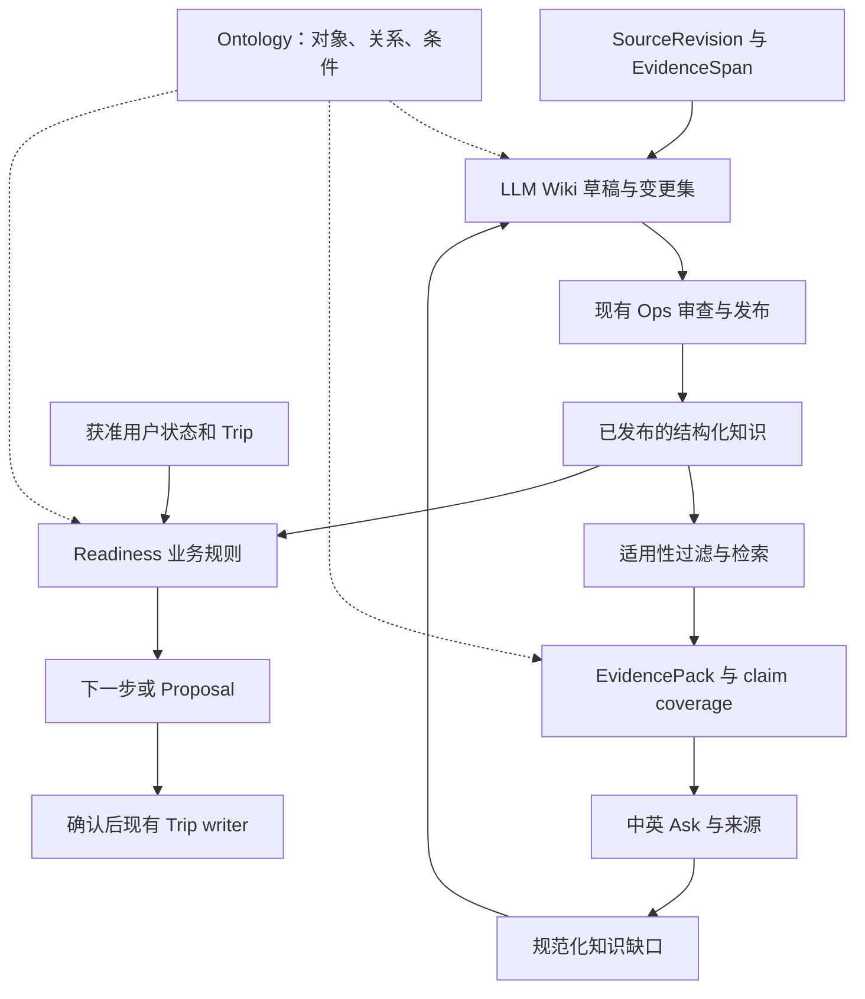

# VisePanda 知识体系升级执行方案

日期：2026-09-13。JT 已同意本方案方向并授权细化规划、拆分 GitHub Issues。
本文件是实施规格；任务身份、完整验收与依赖只在 [issue-plan.json](../program/2026-09-05/issue-plan.json) 维护。
规划 PR 合入前，新接口仍是提案。创建 Issue、生成文档或通过 CI 均不表示能力已实现。

## 目标与现状

让旅行者的问题能找到适用证据；让运营持续整理、更新知识；让业务根据知识、用户状态与时间提出可执行下一步。
采用同一条可追溯链：SourceRevision → EvidenceSpan → KnowledgeStatement → Publication → EvidencePack → Answer / Readiness / Proposal。
Wiki 是可更新、可重建的知识表达；Ontology 统一对象、关系与条件；RAG 负责查找适用证据。

核对基线为 GitHub main a848c50（2026-09-13）。已有 language-neutral assertion、来源 locator、条件/例外、中英表达、发布撤回、问题所需 claim 和 RRF 排序函数。已有代码不能替代完整真实索引/召回/消费者验收。
当前 #357 正在做 SIM Ask；本规划不抢占该运行窗口，不修改其工作树、服务、测试账号或运行配置。开发线程先安全交付当前切片，再选择下面的 frontier。

历史研究与本轮决定：

- [旧 RAG 方案](../knowledge-rag-explore-plan.md) 已归档，不能把旧模型名、维度、城市或 frontend-only 状态视为当前事实。
- [HF 复用结果](../harness/hf-reuse/README.md)：#288 的固定 Docling 管线已有 REJECT；保留该证据。优先复用当前可靠的 HTML/文本解析。仅在新格式的实测缺口出现时，对一个固定解析候选重新评估，不能复跑已否决配置当作新工作。
- #248 是已有混合 RAG/重排责任票，保留其 activationEvidence 与 expand 阶段。本轮 RAG 基线允许结构化、完整短文和关键词查找；向量化须由真实召回问题触发，不能把增加基础设施本身当目标。
- #205/#206 保留原有身份、依赖、进度和完整验收；本轮三张新票提供新增链路，不反向阻塞当前支付/铁路/SIM 修复。#207/#211/#248 增加与本升级直接相关的验收和输入依赖。

## 用户故事

1. 旅行者用不同中英表达提问，都能找到同一语义的适用知识。
2. 旅行者能查看关键结论对应的来源版本、原文位置、条件和例外。
3. 只有部分需求有证据时，旅行者得到可靠部分及具体缺口。
4. 证据充足时，系统不能因模型遗漏、检索故障或分类局限而假称无知识。
5. 运营摄入一份来源后，能看到关联页面及声明的变更差异。
6. 同一份来源重放不会产生重复知识、重复发布或重复计费任务。
7. 新旧材料矛盾时，运营能并排核对证据，模型不会自动选一个成为事实。
8. 来源修订、过期或撤回后，所有相关 Wiki、索引、答案和 Trip 支持关系都能定位和重验。
9. 用户已确认的旅行意图保留，失效证据不再用于新结论或新动作。
10. 用户能区分“知识有无依据”“自己是否准备好”“现在是否到行动时间”。
11. 未知、明确不满足、未适用及可执行状态各有不同且有用的下一步。
12. 运营能看到规范化知识缺口和整理/刷新成本，无需访问私人对话原文。

## 一套知识，两个检索用途

研究检索可以读获准原始资料与未发布 Wiki，输出候选和检查结果；产品检索只能读当前请求有资格使用的已发布投影。二者使用明确不同的用途/权限，不能只靠一个 UI 标签隔离。
RAG 的结果为 EvidencePack，完整性由服务端的 required claims 判定。生成摘要、相似度或模型置信度均不授予知识资格。
Ontology 从第一张新票开始定义语义，实际业务动作接入由 #211 和现有 Trip/Proposal 责任票承接。

## 实施契约

### 来源与证据

| 对象 | 最小语义 |
| --- | --- |
| Source | 稳定 sourceKey、发布者、URL、资料类别、使用声明；来源身份不保证内容正确 |
| SourceRevision | 原版本 label、内容摘要 hash、获取时间、来源声明的生效时间/未知、解析器版本；新版本追加，不覆写旧版本 |
| EvidenceSpan | revision ID、原文页/段/表格单元定位、有限原文、内容 hash、语言；解析失败可回看原文 |
| KnowledgeStatement | 复用现有 assertion、scope、expressions 与 sources；多证据可支持同一声明 |
| Publication | 复用原发布权限、版本、时效、撤回和读取资格；采集日期不能冒充规则生效时间 |

SourceRevision/EvidenceSpan 可先映射现有字段；需要新持久化时做显式版本迁移与兼容 reader。对旧记录缺失字段如实标记 legacy/unknown，禁止伪造血缘。
新来源 URL 的获取须限制协议、重定向、目的地址、超时、大小和解析资源；不执行来源内指令或抓取内网。原材料按既有使用/保留规则存储，不能把第三方资料和用户原文无差别提交 Git。

### Ontology v1

- 先覆盖支付、铁路、SIM；新增一个跨城市公共交通案例验证范围表达，四城仍是覆盖目标，不能复制 national claim 伪称各地实测。
- 稳定对象与关系复用 existing subjectId/predicate/objectId；维护对象类型、关系 domain/range、别名与 zh/en 表达、schemaVersion。
- 条件/例外复用稳定 code；定义类型和解释，LLM 可以提出新词候选，但不能在请求中自动扩充白名单。
- 区分外部知识、user-stated/inferred/defaulted/unknown 状态和 live observation。未知不是 false，不适用不是失败，缺证据不是用户未准备。
- RuleDefinition 用受限、版本化条件表达式；不执行 Wiki 中的任意脚本/DSL。实体、关系、规则分别校验，链接存在不等于证据成立。
- 首轮使用现有 TypeScript/Postgres；不引入 Palantir 平台、图数据库、通用 OWL 推理器、第二协调器或第二记忆库。新增独立基础设施须有具体性能/表达缺口与另行范围记录。

**2026-09-15 VPJ-75有界声明提案本地实现**（[契约](../contracts/wiki-statement-proposals.md)、[验证](../../artifacts/VPJ-75/wiki-statement-proposals/verification.md)）：新增显式C0-only提案任务，模型只选来源ID和逐字引文；程序计算位置并补齐真实来源，数据库二次校验后完整保存wiki-draft/2。Ops显示提案、引文并预填现有人工审核表单；旧草稿兼容。模型响应仍为fixture，真实付费模型/语义质量/Staging全链UNRUN，引用匹配不等于声明正确。

**2026-09-15 VPJ-75声明候选关联本地实现**（[契约](../contracts/wiki-statement-review.md)、[验证](../../artifacts/VPJ-75/wiki-statement-review/verification.md)）：指定Wiki版本可进入现有Ops声明表单，选择不可改写的原始来源，原子创建候选、来源关联和回执；重复语义输入去重，伪造来源或版本漂移拒绝。复用异人审核/发布/中英普通读取/撤回。该增量是运营整理桥接，非自动声明抽取；真实GoTrue、模型、Staging与整票验收仍UNRUN。

**2026-09-14 VPJ-75切片3本地实现**（[正文契约](../contracts/wiki-draft-content.md)、[验证](../../artifacts/VPJ-75/verification.md)）：追加完整 `draft_content`、completion 消费器及现有 `/ops/wiki` 草稿/差异/来源入口。真实本机 PostgreSQL 验证迁移、全文、重启、回执回放、故障回滚、并发和拒权；Auth/模型为 fixture。指定 Staging 当前连接器拒权，真实模型→Staging→Ops 全链仍 UNRUN；未发布、未合并、未关闭 #359。下述切片1/2保留历史范围，其正文存储缺口已在本地实现，但不等于真实环境验收完成。

**2026-09-14 VPJ-75切片2已落地**（[docs/contracts/wiki-generation-dispatch.md](../contracts/wiki-generation-dispatch.md)、[artifacts/VPJ-75](../../artifacts/VPJ-75/)）：新增`ops_wiki_generation_v1`（claim/complete两段式dispatcher，Postgres不能发外部HTTP，claim预定job后应用层真实调用LLM再回写complete）；expectedVersion冲突拒绝覆盖、job运行中重复claim拒绝、失败后重试复用同一行而非新建，均用真实本地Supabase+真实GoTrue会话验证。首次真实LLM调用落地：`lib/server/jobs/wiki-generation-job.ts`（独立于#357在用的`staging-text-job.ts`，不改动不复用那个文件）真实调用Qwen API两次（operator授权小额探针预算，真实key存本地gitignore文件未入库未回显），输出经闭合schema校验（summary+gaps），全链路claim→真实调用→complete→数据库行验证通过。过程中发现真实schema缺口：`wiki_page_revisions`目前没有字段存生成的正文内容（只有change_note≤400字），已如实记录待后续切片补。#359仍OPEN，Ops审查UI/正文持久化/statement抽取/矛盾处理/Docling集成均未做。

**2026-09-14 VPJ-75切片1已落地**（[docs/contracts/wiki-generation-schema.md](../contracts/wiki-generation-schema.md)、[artifacts/VPJ-75](../../artifacts/VPJ-75/)）：`knowledge_review_private`新增`wiki_pages`/`wiki_generation_jobs`/`wiki_page_revisions`三表，纯schema+幂等骨架，不含RPC/worker/LLM调用。`wiki_generation_jobs`以`(page_key,input_digest)`为唯一键，重试/恢复更新同一行而非新建，天然满足"重复输入不重复建页"；job状态机（queued/running/succeeded/failed/cancelled）由数据库CHECK约束强制，不靠应用层自律。真实本地Postgres验证时发现一个真bug：`array_length(空数组,1)`返回NULL而非0，CHECK约束把NULL当通过处理，导致"至少一个source_revision_id"的约束最初能被空数组绕过；改用`cardinality()`修复并重新验证全部7个反例+happy path。#359仍OPEN，dispatcher/worker/Ops审查UI/Docling集成/矛盾处理均记录在`artifacts/VPJ-75/unrun.md`留给后续切片。

**2026-09-14 VPJ-74 切片1-4已落地**（[docs/contracts/knowledge-provenance.md](../contracts/knowledge-provenance.md)、[artifacts/VPJ-74](../../artifacts/VPJ-74/)）：`ontology_relations`/`ontology_types` 登记现有9个predicate的domain/range/zh/en别名；`source_revisions`新增`fetched_at`/`effective_at`/`lineage_status`；只读RPC `ops_knowledge_provenance_read_v1` 复用既有VPJ-14 `current_actor()`鉴权；切片2给写路径打真实`fetched_at`+`lineage_status='tracked'`（旧记录仍诚实标`legacy`，`effective_at`语义仍未定义不伪造）；切片3在operator授权下把两个migration实际部署到真实共享Staging（先备份，推送前后行数比对一致），跑通真实提交→审核→发布→溯源读取全链路+`OPS_FORBIDDEN`反例，测试数据全部清理干净、开关状态恢复；切片4新增`/ops/provenance`页面+API路由，本地真实浏览器验证登录→查询→渲染→not-found态→中英切换全部正常，测试数据清理干净；隔离备份恢复演练在operator授权region/RPO-RTO/责任人后完成——新建一次性隔离Supabase项目，database_restore/roll_forward_pitr/compensation三项演练全部真实跑通并通过，演练完项目已删除。过程中发现真实问题：全历史migration从零重放到全新项目会在某条历史自检语句上失败（该检查假设增量迁移路径），改用schema+data dump/restore方式完成，更贴近"真实备份恢复"本意。VPJ-74全部四片+演练已完成，[EXECUTION-CONTRACT.md#vpj-74](../program/2026-09-05/EXECUTION-CONTRACT.md)六条验收标准逐条见`artifacts/VPJ-74/`；#358关闭判定仍需operator最终确认。

### Wiki 更新与发布

WikiPageRevision 包含 page ID/type、schemaVersion、源 revision 集、statement references、生成 job/config/prompt 版本、input digest、generatedAt、验证结果与变更说明。
页面类型先支持 source summary、entity/procedure、topic、comparison/gap；index 与日志可由结构化元数据重建。

处理链：排队 → 有界读取/生成 → draft changeset → 校验 → 现有 Ops 差异审查 → 原发布流程 → 投影 ack。
重试绑定幂等 operation/input digest；源或页面 expectedVersion 已变化则冲突重算，不能 last-write-wins。worker crash/cancel/timeout 保留终态与回执，未结算费用标 unknown。

LLM 自动写草稿和链接；重要结论逐 statement 回链到原文。不能由模型创造 reviewer、来源、TTL、发布资格或把自己的旧输出作为新外部证据。
生成的导航/摘要是投影；面向旅行者的正文和卡片仍以已发布声明组成，避免整页被一个 reviewed 标志放行。
受影响页面并行编辑时采用版本冲突处理，避免跨页半更新；发布和索引更新记录同一 dependency/version 信息。

### 产品检索与 EvidencePack v2

- 请求边界：actor、purpose/recipient、city、scene、locale、server now、规范化问题与必要用户约束；不要默认外发 Trip、历史消息或私人偏好。
- 资格在召回前、外发前和展示/历史重载前执行；撤回后即便索引删除还在重试，也必须被数据库资格 gate 阻止。
- 查询先识别明确对象/别名及 required claims，按声明与有来源的完整短文检索；无法确定必须条件时再澄清。
- EvidencePack 记录必要/背景/缺失/冲突集合、statement/publication/source revision 与 span、适用限定、检索/ontology 版本、原因码和 safe trace ID。
- missing_content、retrieval_miss、user_input_missing、capability_unsupported、policy_denied、provider_failure 分开。检索 miss 应先尝试有界直接 lookup，不能直接伪称缺知识。
- 现有分类模型默认只接收当前输入。若新检索或重排会发送知识片段/用户上下文，必须采用匹配实际数据流的版本化配置和告知/同意；保持旧模式兼容，不能静默扩大当前 policy。
- 先比较现有直接读取与新增 lexical/结构化路径；#248 触发后每轮最多两个候选、只改一项变量，再考虑 pgvector、中文分词或 rerank。FTS 不自动等于中文 BM25，需要实测分词和中英别名。
- 条件、例外、引用和 partial 语义在 iOS 与现有轻量 Web 一致；暂不新增 Web 产品范围。

### 更新传播、业务和持续整理

#207 负责 source revision → 影响集 → 核对 → outbox → Wiki/索引/缓存/历史答案/TripItemSupport ack；为消费者保留投影版本、水位、失败与重试。404、OCR 差异或版式变化只进入核查，不能直接推断政策改变。
#211 负责 knowledgeAvailability / userReadiness / actionTiming，绑定原 task/trip scope 和 evidence/rule versions。相同知识下未知、满足、不满足的用户应得到不同结果；明确不适用时不制造准备任务。
修改 Trip 必须继续 existing Proposal → diff → exact-version confirmation → atomic Patch；拒绝/撤权/旧版本/重试不得误写或重复写。
从真实获准任务提取脱敏的规范化知识缺口，由 #206 分因、#207 调度有界核查，并回流 Wiki 草稿。检索故障不制造来源采购任务。周期与批量上限由真实用量设定，默认只报告可行动变化，不无限抓取/生成。

## 任务与顺序

正式编号、依赖与完整验收见 [生成任务表](../program/2026-09-05/ISSUES.md) 和 [执行行](../program/2026-09-05/EXECUTION-CONTRACT.md)。

| 工作单元 | 负责结果 | 依赖/协作 |
| --- | --- | --- |
| [VPJ-74 #358](https://github.com/JTCAO515/VP-V4/issues/358)（新增） | 运营从一个已有声明追到来源版本和原文，并看到同一语义对象/关系 | 无新增任务依赖；复用已有 #204/#205 API，核实际接口；首个垂直切片即可独立验收 |
| [VPJ-75 #359](https://github.com/JTCAO515/VP-V4/issues/359)（新增） | 一份新来源经实际 LLM 整理成 Wiki 与可审查变更，经原 Ops 发布后读回 | VPJ-74；复用原 worker/预算与 Ops，不等父票全部关闭才准备 |
| [VPJ-76 #360](https://github.com/JTCAO515/VP-V4/issues/360)（新增） | 旅行者自然语言提问，实际检索已发布 Wiki/声明，获得中英答案、来源和具体缺口 | VPJ-75；复用 #206/#264 路径，不重建 Ask |
| VPJ-17 #207（既有） | 来源变化能传播至 Wiki/索引/答案/Trip，并有真实 ack 和重试 | 保留原依赖，增加 VPJ-75；原有非 Wiki 工作可先做，新增完整验收需 Wiki 输入 |
| VPJ-21 #211（既有） | 本体关系与用户状态形成准备事项/下一步和受控提案 | 保留原依赖，增加 VPJ-74；业务界面和 Trip writer 沿既有责任 |
| VPJ-50 #248（既有） | 实测证明向量混合检索或重排值得启用 | 保留原依赖/expand 激活门，增加 VPJ-76 作为真实 baseline；收益不成立保留直接路径并记录，不能伪造采用 |

主线：交付当前 SIM 切片 → 74 → 75 → 76；#207/#211 在各自真实输入就绪后接入。唯一独立准备线可维护下述固定评测与现有别名/来源缺口；不同时实施第二套产品链路。
新票不能因 scope 触及 actor/预算/数据就自动升级为 operator-only；沿现有 staging 授权实测，缺少实际技术输入才保留 UNRUN。
计划合并前允许阅读、规格检查和不依赖新接口的准备；不得以未合并的本方案覆盖当前 main contract。

## 验收、成本与规模

复用已有固定中英用例及失败记录，不因本方案重跑相同版本有效证据。新增 100 条是上限明确的首轮评测包建议：50 zh/50 en，按语义问题族与来源版本隔离 60 开发/40 保留；翻译对不得跨组。已暴露/调参样例属于开发集，不冒充新盲测。合成故障必须标明，真实语料/来源/模型/普通用户链分栏。

首轮覆盖：可答、部分可答、无内容、有内容但检索 miss、错城市/对象/人群、相对日期、条件/例外、否定、冲突、过期/撤回、prompt injection、provider 故障与 owner 隔离。
质量基线冻结后每轮记录 question-family、qrels、required-claim oracle、query/config/source versions、命中/漏掉/误用、时间与费用。自动分数不替代可检查原文和判分依据。

| 维度 | 判定方法 |
| --- | --- |
| 安全与适用性 | 固定关键反例中错 owner、过期/撤回外发、错范围当事实、伪造来源、未确认写 Trip 为零；任一失败否决该配置，不与软分平均 |
| 召回与完整性 | 报 eligible Recall@k、required claim coverage、过度拒答、无依据回答；缺内容不计为检索器失败；分中英/场景，保留分母 |
| 变更传播 | 实际更换/撤回一个受控 source revision，重试/崩溃/乱序下各消费者最终 ack；失效窗口内新请求已被资格 gate 阻止 |
| Wiki 整理 | 每条关键声明有原文定位；新增/替代/冲突不被吞掉；记录人工或自动校验身份、修正次数和未解决项 |
| 业务 | 相同来源下测试未知/满足/不满足/不适用/未到时间；UI 下一步与实际 Proposal/确认/重载一致 |
| 成本与延迟 | 分别记录每条任务、每个 accepted statement、每次 source refresh 的 token/实际或 unknown 费用、p50/p95 与返工；限额失败必须可恢复 |

向量或重排的收益阈值必须在评测前按 baseline 冻结，包含质量最低改进与 p95/单请求成本上限；若小样本不足以证明收益，应保留基线或扩固定评测，不写成提升已成立。不给出尚未实测的节省比例。
76 的首个真实链至少 zh/en 各一条正常/partial 与可核查来源，iOS 及既有 Web 读回；固定集全部运行才能判断整票，单个 demo 只记切片。
#207/#211 要实际持久接口、任务、权限及回执；fixture、CI、归档研究与 PR 合并均不替代这些验收。物理设备和生产发布仍遵循当前主线的独立验收边界。

## 范围、回滚与开发入口

不做全量资料爬取、无界知识自我生成、自动上线候选、默认采购新服务、训练/微调或新建图数据库。现实实时状态使用独立 live observation，不烘焙成长期 Wiki 事实。范围中的账户/数据/预算沿现有实际授权，生产发布另行确认。

投影回滚可重建；已发布/已应用历史保持 append-only。关闭新 worker/reader flag 后恢复现有直接读取；已撤回的数据不能因恢复旧索引或旧 Wiki 重新变 eligible。数据库变更采用兼容升级和前向修复，不编辑已应用迁移。

给开发线程的启动指令：

> 先安全完成正在执行的切片，再核对本规划 PR 是否已合并、最新 main 与 GitHub 依赖。按 VPJ-74 → 75 → 76 的 frontier 推进，复用 #204/#205/#206/#264 已有链路；其后按实际输入推进 #207/#211，#248 保留真实召回与净收益激活门。一次一条集成主线与一条独立准备线。每票先读执行行与本规格，记录当前接口、范围、真实验收和回滚。只在本票完整接受标准全部有证据时关闭，保留现有失败、未验项与父票历史。供应商未知项不阻塞开发，不扩大数据外发、不绕过 RLS/Trip 确认，也不自动生产发布。

规划验证使用 `pnpm docs:check`、现有 governance 测试、`git diff --check` 和生成一致性；本规划没有 runtime 变更。实施检查由各执行行按变更风险选择。

## 研究依据

- [Karpathy LLM Wiki 原文](https://gist.github.com/karpathy/442a6bf555914893e9891c11519de94f)：原始来源、持续 Wiki、schema，以及 ingest/query/lint 的工作模式；本方案增加适合旅行产品的 statement 发布与失效语义。
- [Supabase hybrid search](https://supabase.com/docs/guides/ai/hybrid-search)：Postgres 全文与向量融合的实现参考，采用仍受 #248 实测门控制。
- [Anthropic Contextual Retrieval](https://www.anthropic.com/engineering/contextual-retrieval)：保留片段背景与重排的候选方法，公开实验效果不转写成 VisePanda 收益。
- [Palantir Ontology](https://www.palantir.com/docs/foundry/ontology/overview)：对象、关系、动作、函数和权限的业务语义参考；不意味着采用其平台。
- [W3C OWL](https://www.w3.org/TR/owl-guide/)：类型/关系语义参考；本轮不引入通用推理系统。
- [Docling](https://docling-project.github.io/docling/) 与本仓库 #288：公开能力只构成候选，项目的已有 REJECT 和重新采用的证据要求继续有效。

本规格中的阈值、对象最小字段与任务切分是 VisePanda 设计决定，未声称外部论文验证了本项目。
