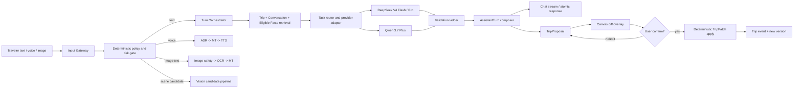
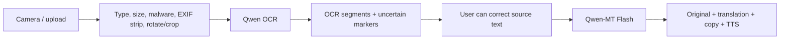
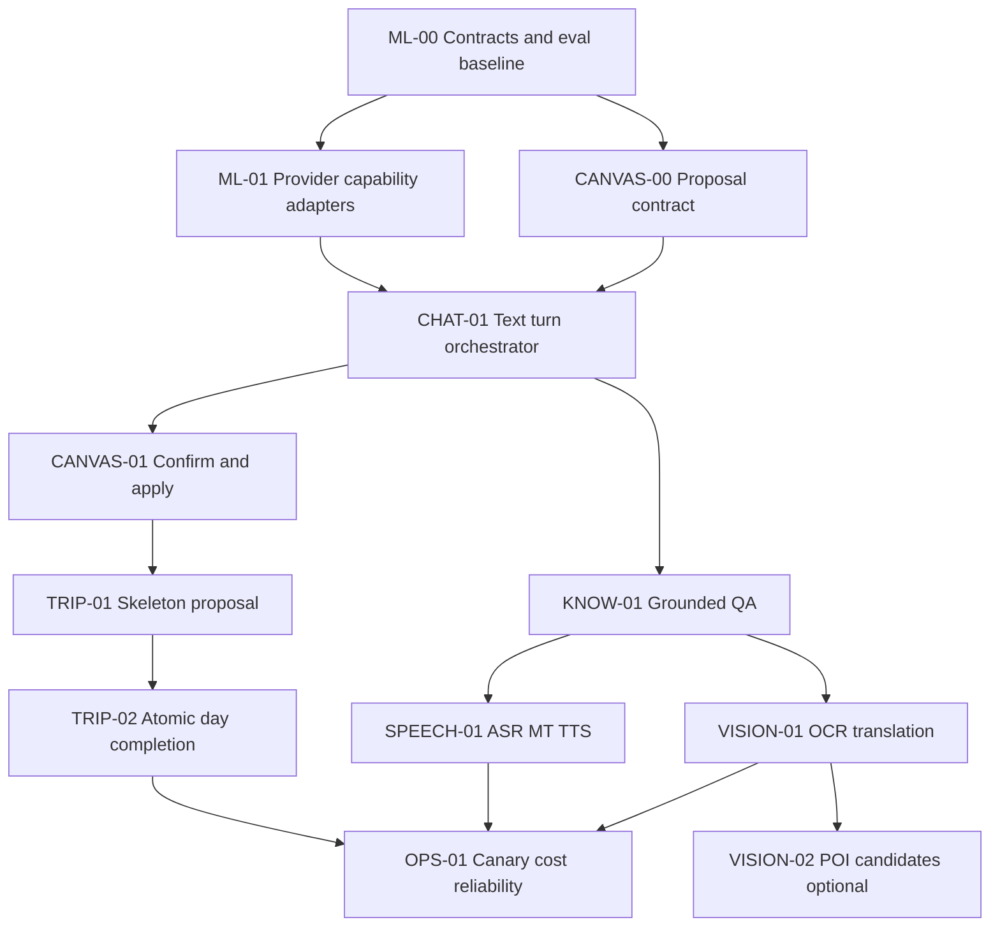

# VisePanda V4 模型层、Chatbot 与 Trip Canvas 最终研究及开发规划

- 文档版本：v2.2（第五轮 lifecycle/region/realtime/contract 修订）
- 核验日期：2026-08-23
- 状态：**提案，待 operator 接受后再通过 ADR 冻结；本文不代表任何模型、语音、视觉、持久化或外部能力已经上线**
- 适用仓库：`JTCAO515/VP-V4`
- 历史参考：`JTCAO515/VP-Final` 当前 `main`（核验提交 `b5ef081`）
- Claude 输入：`/Users/jtcao/VP-V4/docs/model-layer-plan.md`（作为研究意见，不作为事实源）
- 一手资料底稿：[model-provider-evidence-2026-08-22.md](research/model-provider-evidence-2026-08-22.md)
- 第五轮增量证据：[ai-core-deep-optimization-evidence-2026-08-23.md](research/ai-core-deep-optimization-evidence-2026-08-23.md)
- 外部数据配套规划：[external-data-chatbot-plan.md](external-data-chatbot-plan.md)
- 知识库、RAG 与 Explore 配套规划：[knowledge-rag-explore-plan.md](knowledge-rag-explore-plan.md)
- 全局权威开发顺序与验收：[ai-core-engineering-development-acceptance-report.md](ai-core-engineering-development-acceptance-report.md)；本文工作包是模型域详细设计，不再单独决定项目关键路径。

---

## 0. 最终结论

### 0.1 产品结论

VisePanda 的核心不是“一个会写行程的聊天框”，而是一个受控闭环：

```text
旅行者表达目标或现场问题
  -> VisePanda Chatbot 理解、检索、解释并提出候选变化
  -> Trip Canvas 显示唯一当前 Trip 与待确认差异
  -> 用户接受、拒绝或修改
  -> 确定性系统校验并应用 TripPatch
  -> 形成可回放 Trip event、反馈与下一步
```

Chatbot 拥有“理解与提案权”，Trip Canvas 拥有“可见状态与确认权”，确定性服务拥有“最终写入权”。**模型永远不能直接改 Trip。** 这条边界比选哪一个 LLM 更重要。

仓库中的规范词是 **Trip Canvas**，不是 Trip Canva；对外名称统一为 **VisePanda Chatbot**，`Copilot` 只保留为内部模块名。

### 0.2 模型选型结论

首发运行时只启用两家文本/视觉供应商，不把四个 API 都接进生产链：

1. **DeepSeek V4 Flash：交互式文本首选候选。** Flash-0731 当前仍是 public beta。用于低延迟意图规划、一般问答、基于事实的解释和小日级候选时，必须显式关闭默认 thinking。它便宜、并发高，但不能在真实 conformance/eval 前称为最稳定生产主力；strict tool 仍是 beta endpoint/Schema 子集。
2. **DeepSeek V4 Flash Vision Exp：受控视觉候选。** 2026-08-21 已在官方 API 上线，调用 ID 是 `deepseek-v4-flash-vision-exp`，不是基础 `deepseek-v4-flash`。它进入 OCR/截图理解/POI 识别的 shadow eval；因官方仍标为 experimental，不能直接成为 P0 单点依赖。
3. **Qwen 3.7 Plus 与专用模型：严格结构、必选 OCR/语音/翻译主力。** Qwen 3.7 Plus 用于 Trip skeleton、复杂结构提取和视觉回退；Qwen OCR、ASR、MT、TTS 承担可独立评测的专业阶段。
4. **Kimi：保留在离线 eval/canary。** 当前旗舰 Kimi K3 支持严格 JSON Schema、视觉和 1M 上下文，但始终开启 thinking，不适合首发低延迟常规路径。只有任务级 eval 证明它显著改善复杂规划时，才升级为受控回退。
5. **GLM：保留在离线 eval，不进首发运行时。** 当前官方 Chat Completion 文档已经列出 GLM-5.3，但原生 `response_format` 仍只有 `json_object`，`tool_choice` 仍限 `auto`，不适合作为关键 Trip Schema 的强制输出通道。

这不是“DeepSeek 不够好”。最终策略是：**DeepSeek Flash 负责高频文本；DeepSeek Vision Exp 与 Qwen 视觉进入同一任务 eval；严格 Trip 结构和必选 OCR/ASR/MT/TTS 在证据不足前继续由 Qwen 路线承担。**

官方托管 API 的请求 ID 是 `deepseek-v4-flash` 与 `deepseek-v4-pro`；当前官方页面把它们的底层版本分别标为 `DeepSeek-V4-Flash-0731` 与 `DeepSeek-V4-Pro-0813`。`deepseek-ai/DeepSeek-V4-Flash-0731` 是开源权重/自托管标识，不是托管 API 的 `model` 参数。配置应拆成 `providerModelId=deepseek-v4-flash` 与 `observedVersion=DeepSeek-V4-Flash-0731`，不得向托管 API 发送 `deepseek-v4-flash-0731`。

### 0.3 语音与图片结论

- **必选：语音翻译。** 首发采用按键说话（push-to-talk），管线为 `ASR -> 专用机器翻译 -> TTS`，不直接把一段音频交给通用 Chatbot 自由发挥。
- **必选：图片文字翻译。** 管线为 `图片安全预处理 -> 专用 OCR -> 可编辑原文 -> Qwen-MT -> 翻译结果/TTS`。DeepSeek Vision Exp 参加 OCR shadow eval，但“通用视觉可读图”不等于专业 OCR 已通过。
- **可选：景点/POI 识别。** 只输出候选，不输出“确定识别”；必须结合已知城市、GPS/用户上下文和自有 POI 库二次解析，用户确认后才能进入 Canvas。

建议的首发语音/翻译候选为：

| 能力 | 首选候选 | 说明 |
| --- | --- | --- |
| 实时 ASR | `qwen-audio-3.0-asr-flash-streaming` | 官方列为推荐实时模型，覆盖中、英、西、俄、阿及多语种/方言 |
| 文本翻译 | `qwen-mt-flash` | 92 语种互译，支持术语、领域提示与流式输出；不使用通用 Chat LLM 代替 |
| 实时 TTS | 北京 `qwen-audio-3.0-tts-flash`；新加坡重新评测 Qwen3-TTS | 型号受 region 约束；五语旅游专名、数字与弱网质量必须真机实测 |
| OCR | 北京候选 `qwen3.5-ocr` | 当前地域受限；新加坡需另选获准 OCR baseline |
| 端到端语音 challenger | `qwen3.5-livetranslate-flash-realtime` | 北京/新加坡、五语音频+文本、manual push-to-talk；与分段 baseline 同集评测 |
| 通用视觉/POI 候选 | `deepseek-v4-flash-vision-exp` 与 `qwen3.7-plus` 对测 | DeepSeek 已上线独立视觉实验路由；POI 属可选能力，可先 shadow/canary，不影响 P0 |

TTS 不能在 region/voice eval 前冻结。北京可评测 Qwen Audio 3.0，Singapore 可评测 Qwen3-TTS；每种语言必须选择明确的固定 provider voice。模型或 cloning language 列出 `ar` 不证明任意 system voice 可生成合格阿拉伯语。

---

## 1. 研究边界与控制目标

### 1.1 目标 `r`

在 VP-V4 中从零重建一条可上线、可评估、可回滚的 Chatbot + Trip Canvas 核心链路，覆盖：

- 五语文本对话（`zh`、`en`、`es`、`ru`、`ar`）；
- 形成和修改 Trip 的候选提案；
- 基于可用事实回答并明确未知；
- 必选的语音互译；
- 必选的图片文字翻译；
- 可选的景点/POI 候选识别；
- 供应商切换、成本、缓存、延迟、错误、质量与回滚证据。

### 1.2 当前观测 `y`

1. 当前 VP-V4 `main`（`2dec7b0`）是 Next.js 16 + React 19 + strict TypeScript + Tailwind v4 的 frontend-only 落地页。
2. 当前 VP-V4 没有真实 AI、账号、Trip 持久化、模型路由、语音、OCR、队列或知识检索。
3. VP-Final 已有大量有价值的领域契约与防护，但其主 Chatbot/Canvas 运行链仍包含 prototype/DEMO 边界。
4. Claude 草案做了有价值的 provider 调研，但部分模型、端点、免费额度和结构化输出结论已被 2026-08-22 的当前官方页面更新或否定。

### 1.3 偏差 `e`

产品页面已经准确表达“Chatbot 提议、Canvas 展示、用户确认、确定性系统应用”，但当前运行时代码为零；旧仓库的实现又存在 AI Patch 直接持久化、通用 OpenAI-compatible 适配器把四家当同一协议、英文/中文安全正则覆盖不足等问题。直接复制旧实现会把旧偏差带入新产品。

### 1.4 本轮控制动作 `u`

先冻结契约、事件协议、评估集与 provider capability registry，再开发一条“文本对话 -> TripProposal -> Canvas 确认 -> TripPatch”的最小闭环。语音和 OCR 在该闭环稳定后接入，不与第一条写路径同时开工。

### 1.5 Anti-goals

- 不搭建九个或更多命名 Agent。
- 不让四个模型对同一个答案投票。
- 不在 MVP 做自主浏览器 Agent、自动预订、支付、库存或任意工具执行。
- 不允许模型生成 URL、伙伴状态、实时价格、票务可用性或官方规则作为事实。
- 不用“更长 prompt”“更大上下文”“更多模型”代替知识证据和确定性校验。
- 不把语音输入、图片、护照/票据内容或原始对话写进普通日志。
- 不为缓存命中刻意填充无用 token；缓存是否值得优化由真实命中率决定。

### 1.6 成功定义

首个 controlled beta 只有在以下条件同时满足时才算模型层完成：

- 模型不能直接写 Trip，所有变化都有可见 Proposal 和明确确认；
- 关键结构输出在 domain 层之前 100% 通过目标 Schema；非法输出 0 次进入持久化；
- 高风险与可执行事实 eval 中，0 个无来源事实被展示为确定答案；
- 主模型故障、超时、429、空输出、结构错误和语音/视觉不可用都有真实降级状态；
- 五语文本与五语语音测试集通过已经接受的质量/延迟门槛；
- 记录每次模型尝试的 provider、真实 model id、prompt/schema 版本、token、cache、成本、延迟、finish reason、验证与 fallback，且不记录秘密或原始敏感内容；
- operator 能通过一个配置开关关闭任何 provider、语音、OCR、POI 识别或 Canvas AI 提案，而不破坏只读 Trip。

---

## 2. 两个仓库告诉我们的真实情况

### 2.1 VP-V4 当前事实

可以直接保留：

- Next.js App Router、React、strict TypeScript 与 Tailwind v4；
- `app/page.tsx` Server Component 与显式 Client Component 边界；
- 五语字典和阿拉伯语 document-level RTL；
- 当前产品定位、成熟度文案和本地 VisePanda 资产；
- “模型只提候选、用户确认、TripPatch/审计/持久化由确定性系统控制”的公开边界。

不能假设已经存在：真实 Chatbot、Canvas 状态、登录、数据库、API、知识库、成本遥测、模型密钥或 provider 账户实测。

### 2.2 VP-Final 可复用资产

| 资产 | 当前价值 | 在 V4 中的处理 |
| --- | --- | --- |
| `TripState` / `TripPatch` / `applyPatch` | 单一确定性 Trip 写路径、乐观并发基础 | 移植概念和测试；Patch 前新增 `TripProposal`/确认层 |
| `CopilotEnvelope` | 将文案、动作、引用、风险分离 | 收窄；模型不再直接作者化整个 Envelope，由服务端 composer 组合 |
| provider-neutral router | 有顺序回退、总超时、attempt 与 cost | 保留思想，重写为 capability-aware adapter，禁止四家共用一套 request body |
| 固定点成本计算与 pricing registry | 可追踪 cache hit/miss/output 成本 | 移植；价格必须带来源、地域、有效期，缺价格保持 unknown |
| `executionSafety` / citations allowlist | 能阻止部分无支撑的时间、价格、线路、地址 | 移植并重写五语规则；现有中英正则与子串归一化不够安全 |
| 高风险 fixed phrase 短路 | 医疗、过敏、证件、地址等不交给自由生成 | 保留；扩展西/俄/阿，并区分“翻译已有文字”和“生成医疗建议” |
| knowledge gap | 不知道的问题成为内容改进输入 | 保留，且不自动发布内容 |
| 两阶段 Trip completion + durable job | skeleton 后后台补日详情、幂等与冲突处理 | 保留 job/幂等思想；输出改为 Proposal，不直接应用 `ai_copilot` Patch |
| trace/retention/cost schema | 供应商尝试可审计 | 保留隐私最小化原则，不保留原始音频/图片/推理链 |
| rate limiting / anonymous turn control | 可确定性控制滥用和成本 | 保留模式；不另做“离题封禁”模型 |

### 2.3 VP-Final 不应直接移植的部分

1. `service.ts` 当前会把模型 `tripActions` 先 `applyPatch`，随后直接 `create` 或 `apply` 到 Trip。它没有用户确认门。
2. `openaiCompatible.ts` 固定请求 `response_format: {type:'json_object'}`，无法表达 Qwen/Kimi `json_schema`、DeepSeek strict tool 或 provider 特定 thinking 参数。
3. 主 prompt 把用户消息直接拼进字符串，没有消息角色隔离、稳定前缀编排、事实段隔离或 prompt-injection 边界。
4. `parseGeneratedEnvelope` 用最先 `{` 到最后 `}` 的正则和尾随逗号修复，适合 demo 打捞，不适合关键 Trip 结构。
5. 默认意图路由和高风险分类主要覆盖英文/中文，不能支撑五语产品。
6. 旧 `CopilotShell` 同时承担聊天、Canvas、队列轮询、账户墙和所有错误状态；V4 应拆分状态所有权，不复制该大组件。
7. 旧 provider inventory 绑定历史 demo 路由；V4 应按任务能力和 eval 结果路由，而不是按供应商名分“角色”。

### 2.4 旧 ADR 中仍应继续接受的不变量

- ADR-0023：六个执行时刻仍是事实优先能力边界。
- ADR-0024：VisePanda Chatbot 与 Trip Canvas 是两个协作核心。
- 规划与 Canvas 的重要性不放宽事实、TripPatch、支付、Human Help 或外部能力门控。
- 缺失数据必须显示缺失，不能用模型补空白。

---

## 3. 对 Claude 草案的最终裁决

| Claude 建议 | 裁决 | 最终处理 |
| --- | --- | --- |
| Qwen + DeepSeek 主力，Kimi 窄回退，GLM 移出运行时 | **大方向接受，细节修正** | 首发 Qwen + DeepSeek；Kimi/GLM 先只做 eval，达到晋级门才进入运行时 |
| Qwen 3.7 Plus 用 strict JSON Schema | **接受** | 作为 Trip skeleton/复杂结构主路 |
| DeepSeek `response_format` 支持 strict JSON Schema | **拒绝** | 官方只列 `text/json_object`；严格结构用 beta strict tool calling |
| DeepSeek strict profile 用 `null` 分支 | **拒绝** | 官方 strict 支持类型列表未列 `null`；用 `known/unknown` discriminated union 编译后归一化 |
| `deepseek-v4-flash-0731` | **不能作为托管 API ID** | 托管 API 使用 `deepseek-v4-flash`，另记录当前 observed version `DeepSeek-V4-Flash-0731`；启动时调用 `/models` 校验 |
| Kimi K2.6/K2.7 Code 是结构回退 | **更新** | Kimi K3 已是当前旗舰且 strict 更稳定；K2.7 Code 是代码模型，不应仅因 Schema 能力就承担旅行规划 |
| GLM 5.2 移出运行时 | **结论保留，型号更新** | 当前官方 API 已列 GLM-5.3；因 `json_object`/`tool_choice:auto` 限制，仍只放 eval |
| 新加坡 Qwen 有唯一免费额度 | **拒绝当前结论** | 当前价格页说明免费额度地域口径已变化；地域必须按控制台、延迟、数据边界与当前价格决定，不按旧草案写死 |
| 所有任务跨至少两家供应商 | **仅文本核心接受** | 文本关键链有跨供应商 fallback；语音/OCR 首发先诚实单供应商，不制造假冗余 |
| Schema 双编码（API Schema + prompt 示例） | **有条件接受** | 保留简短语义示例；不在 prompt 复制完整巨大 Schema，真实收益由 eval 与缓存数据决定 |
| 截断 JSON 补齐后接受部分 Trip | **拒绝关键路径做法** | 每日原子生成；截断只可标记 partial，不能通过补括号把不完整语义升级为合法 Trip |
| 每轮 K=2/3 多采样，用分歧决定提问 | **拒绝默认启用** | 多采样只用于离线 eval 或极少数高价值规划；线上澄清先用确定性阻塞槽位和可见假设 |
| 不使用模型自报 confidence | **接受** | 使用 stated/inferred/defaulted/unknown provenance，并机械核验 evidence |
| 建议文本由服务端能力注册表产生 | **接受** | 模型最多选择已注册 capability，不创作不存在的功能 |
| 离题不封禁，改范围重定向 | **接受** | 安全/成本由确定性限流；分类只返回固定范围说明，不因模型判断封用户 |
| 先预热缓存、按假定晚高峰排任务 | **不作为首发设计** | 只有真实 cache/traffic 遥测证明收益后才加预热或错峰 |

---

## 4. 总体架构

### 4.1 设计原则

1. **一个编排器，不是多 Agent 展示。** 不同任务是 prompt profile + tool/schema policy，不是九个互相聊天的 Agent。
2. **一个任务只调用一个主生成模型。** 失败才回退；多模型一致不等于事实。
3. **模型输出分两类。** 普通散文可以流式；会改变 Trip 或包含可执行事实的输出必须缓冲、校验、一次性展示。
4. **模型只处理概率任务。** 权限、限流、日期范围、版本冲突、事实资格、能力可用性、Trip 写入与审计全部确定性处理。
5. **先小 Schema 再组合。** 模型不生成一个包含聊天、Trip、商业、Human Help、引用、调试信息的巨大 Envelope；每个阶段只输出最小结构，服务端 composer 形成最终 `AssistantTurn`。
6. **Provider adapter 是方言编译器。** OpenAI-compatible 只是 HTTP 外形相似，不代表 thinking、Schema、usage、stream、tool 和错误语义相同。
7. **任何模型都可被关闭。** 路由配置、feature flag、circuit breaker 和 honest unavailable 是发布条件。

### 4.2 目标系统图



### 4.3 运行单元

首发保持 VP-V4 内的 Next.js 模块化单体：

```text
app/
  workspace/                  # Chatbot + Trip Canvas 页面
  api/chat/route.ts           # SSE 文本/状态事件
  api/trip-proposals/...      # accept/reject/edit
  api/media/ocr/route.ts
  api/speech/transcribe/...
  api/speech/synthesize/...
components/workspace/
  ChatPanel.tsx
  TripCanvas.tsx
  ProposalDiff.tsx
  VoiceTranslator.tsx
  PhotoTranslator.tsx
lib/domain/
  assistant-turn.ts
  travel-intent.ts
  trip.ts
  trip-proposal.ts
  media.ts
lib/server/ai/
  orchestrator.ts
  capability-registry.ts
  route-policy.ts
  validation.ts
  providers/{deepseek,qwen,kimi,glm}.ts
  prompts/
lib/server/{trip,knowledge,conversation,media,telemetry}/
lib/server/external-data/       # provider policy、Live/Ephemeral observations、transport/weather adapters
evals/
  fixtures/
  runners/
  reports/
```

不要在第一阶段拆微服务或新仓库。只有当语音 WebSocket、后台 completion 或独立伸缩形成真实运行瓶颈时，才拆 worker；跨模块契约保持不变。

---

## 5. Chatbot 每轮执行协议

### 5.1 输入信封

```ts
type UserTurnInput = {
  conversationId: string;
  turnId: string;
  locale: "zh" | "en" | "es" | "ru" | "ar";
  text?: string;
  media?: Array<{ id: string; kind: "image" | "audio" }>;
  tripId?: string;
  expectedTripVersion?: number;
  uiAction?: { capability: string; args: Record<string, unknown> };
};
```

`uiAction` 优先于自然语言猜测。用户点击“把这家店加入第 2 天”时，客户端直接发送 capability 和对象 id；模型只负责必要的自然语言说明，不重新猜按钮含义。

### 5.2 TurnPlan

对明显动作先用确定性规则。只有自由文本含义不明确时才调用一个很小的 `turn_plan`：

```ts
type TurnPlan = {
  route:
    | "chat"
    | "grounded_qa"
    | "trip_create"
    | "trip_change"
    | "translate_text"
    | "translate_voice"
    | "translate_image"
    | "vision_candidate"
    | "out_of_scope";
  risk: "ordinary" | "execution_fact" | "high_risk";
  needsRetrieval: boolean;
  blockingQuestion: string | null;
  extracted: TravelIntentDelta;
};
```

阻塞问题只允许：无法解析的中国目的地、无法形成日框架的时长/日期、或会改变安全/权限/金额/数据边界的歧义。节奏、人数、预算档等可以作为**有标签、可修改的假设**显示在 Canvas，不连续盘问用户。

### 5.3 风险分流

| 风险 | 示例 | 允许行为 |
| --- | --- | --- |
| ordinary | 灵感、节奏、主题、非实时解释 | R1/R2 仍缓冲验证；未来独立 segment streaming ADR |
| execution_fact | 地址、营业时间、价格、交通线路、入场规则、网络/支付步骤 | 必须检索 eligible fact；缓冲完成后校验再展示 |
| high_risk | 医疗/过敏/紧急、签证/移民、法律、金融/支付、严重天气、证件、无障碍承诺、精确导航 | 类别专属规则/已审核短语/官方出口；模型不能自由生成关键陈述 |

### 5.4 生成与组合

服务端从模型获取下列最小对象之一：

- `AnswerDraft { body }`（仅低风险解释/澄清）
- `GroundedClaimDraft[]`（执行值；服务端绑定 EvidenceReceipt 后确定性渲染）
- `TripSkeletonDraft`
- `TripDayDraft`
- `TravelIntentDelta`
- `VisionCandidate[]`

服务端再组合：

```ts
type AssistantTurn = {
  id: string;
  message: { body: string; locale: string };
  citations: PublicCitation[];
  cards: ExecutionCard[];
  proposal: TripProposal | null;
  suggestions: Suggestion[];
  availability: "answered" | "clarification" | "unavailable";
  degradedReason?: string;
};
```

模型不能填写 `availability`、公开 source label、商业动作、真实 URL 或 capability 是否已实现；这些字段由确定性系统产生。

### 5.5 SSE 协议

未来可评估的低风险普通回答（R1/R2 不启用正文 token streaming）：

```text
event: turn_started
event: message_delta
event: message_delta
event: citations_ready
event: suggestions_ready
event: turn_completed
```

Trip/可执行事实：

```text
event: turn_started
event: status              # retrieving / generating / validating
event: message_ready       # 验证后一次性发送
event: proposal_ready      # 完整、已校验对象
event: suggestions_ready
event: turn_completed
```

不要把散文 token 与逐步未闭合的 JSON 混在一个字段里。客户端只消费版本化事件，未知事件忽略但记录。

R1/R2 所有模型正文先缓冲验证，SSE 只流 phase/progress。地点、地址、时间、价格、路线、支付、入场、证件和预警等 claim 通过 typed claim/citation validation 后发送 `message_ready/card_ready`。后置 validator 不能撤回已经流出的内容。

---

## 6. Chatbot 与 Trip Canvas 的写入契约

### 6.1 三个状态，不再只有 Trip

1. `TripSnapshot`：用户已经接受的唯一当前行程。
2. `TripProposal`：模型或用户提出、尚未接受的差异。
3. `TripPatch`：用户确认后，由服务端从 Proposal 确定性派生并应用的写命令。

```ts
type TripProposal = {
  id: string;
  revision: number;
  origin: "chat" | "explore" | "user_edit" | "system_recheck";
  tripId: string | null;
  baseTripVersion: number | null;
  status: "pending" | "applied" | "rejected" | "expired" | "conflicted" | "superseded";
  changes: ProposalChange[];
  assumptions: Array<{
    field: string;
    value: unknown;
    source: "stated" | "inferred" | "defaulted";
    evidence?: string;
  }>;
  evidence: EvidenceReceipt[];
  promptVersion: string;
  modelRunId?: string;
  createdAt: string;
};
```

`ProposalChange` 是闭合集合：创建 Trip、更新 Trip 字段、upsert/delete day、upsert/update/delete block。不能接受任意 JSON Patch path，也不能包含 URL、HTML 或任意工具载荷。

每个 change 绑定自己的 EvidenceReceipts/assumptions；proposal-level evidence 只做去重索引。选择部分 change 时生成并重新验证新的 immutable revision，不能在原对象上写 per-item accepted 状态。

### 6.2 用户确认过程

Canvas 必须显示：

- 旧值 -> 新值；
- 新增、移动、删除；
- `stated / inferred / defaulted` 标签；
- 事实来源与复核时间（有事实时）；
- 未知/待确认字段；
- 接受全部、选择部分、修改、拒绝。选择部分或修改先产生新的 immutable revision，再确认该 revision。

接受时服务端重新读取当前版本：

```text
proposal.baseTripVersion == currentTrip.version
  -> validate domain invariants
  -> derive TripPatch
  -> append event + update snapshot atomically

proposal.baseTripVersion != currentTrip.version
  -> mark proposal expired/conflicted
  -> rebase preview; never silently overwrite
```

### 6.3 初次创建 Trip

没有 Trip 时，模型生成的是 `create_trip` Proposal，不是立即保存的 Trip。Canvas 可显示完整 Draft；用户点击“保存为我的 Trip”后才创建 version 1。后台日详情只能更新 Proposal draft 或产生子 Proposal，不能绕过首次确认。

### 6.4 两阶段生成

1. `trip_skeleton` 一次生成城市序列、日期/相对日、每天主题与空块框架。
2. `ProposalDraft(building)` 可作为只读进度预览，不能确认。
3. 发布为 `TripProposal(pending)` 后 revision 不可变。
4. 后台日详情要么在发布前合并 building draft，要么在 skeleton 被接受后产生独立 child proposals；不得修改用户正在确认的 revision。
5. 每一天是独立、可校验、可重试的结果；部分失败明确显示且不能用补括号升级语义。

不接受“截断一个 6 天 JSON 后补括号获得 4 天”作为正常成功；按天原子化本身已经解决部分完成问题。

---

## 7. 模型能力事实与首发路由

### 7.1 当前官方能力快照

| Provider / model | 官方可确认能力 | 对 VisePanda 的意义 | 当前限制 |
| --- | --- | --- | --- |
| DeepSeek V4 Flash | 托管 ID `deepseek-v4-flash`、当前版本 0731、public beta；1M context、JSON Object、tools、thinking/non-thinking | 高频 Chat/QA 与小结构首选候选 | thinking 默认开启需显式关闭；strict tool 是 beta endpoint/Schema 子集；未通过生产 conformance |
| DeepSeek V4 Pro | 托管 ID `deepseek-v4-pro`、当前版本 0813；同协议、更强档 | 复杂语义/结构失败后的受控升级 | 成本与延迟高于 Flash，仍受同一 Schema 方言限制 |
| DeepSeek V4 Flash Vision Exp | 2026-08-21 发布的视觉实验模型 | 仅进入 POI/OCR shadow eval | 上线时间短且官方明确为实验性质，不能作为 P0 依赖 |
| Qwen 3.7 Plus | 文本/图像/视频、1M context、Function Calling、cache、strict JSON Schema | Trip skeleton、复杂提取、视觉主力 | 价格/免费额度/endpoint 随地域变化；必须明确 region 与 snapshot |
| Qwen 3.7 Flash | 文本/图像/视频、JSON Object、Function Calling、cache | 快速简单分类/视觉候选的 eval 对象 | 不支持 strict JSON Schema |
| Kimi K3 | 1M context、视觉、strict JSON Schema、tool choice、自动缓存 | 复杂规划与视觉的高质量 canary | thinking 不能关闭；充值/档位影响速率；不作为常规低延迟路径 |
| GLM-5.3 | 当前 API 最新旗舰、thinking、tools、cache、JSON Object | 独立 eval 与未来候选 | `tool_choice` 仅 auto；无 strict `json_schema`，不能作为关键结构主路 |

### 7.2 首发路由表

| Task profile | 主路 | 回退 | 输出模式 | 是否 thinking | 选择理由 |
| --- | --- | --- | --- | --- | --- |
| `turn_plan`（仅歧义自由文本） | DeepSeek V4 Flash candidate | `qwen3.7-plus-2026-05-26` | DS strict beta / Qwen JSON Schema | 显式关闭 | 极小固定结构；conformance 后决定 |
| `low_risk_explanation` | DeepSeek V4 Flash candidate | Qwen 3.7 Plus | buffered `AnswerDraft {body}` | 显式关闭 | 不含执行值；R1/R2 验证后整段发送 |
| `grounded_execution` | DeepSeek V4 Flash candidate | Qwen 3.7 Plus | typed `GroundedClaimDraft[]` + controlled explanation | 显式关闭 | 关键值由 EvidenceReceipt + deterministic renderer 输出 |
| `trip_skeleton` | `qwen3.7-plus-2026-05-26` candidate | DeepSeek V4 Pro strict beta / Kimi K3 offline | Qwen JSON Schema / beta strict | 关闭 | 关键结构可靠性优先；eval 后冻结 |
| `trip_day_detail` | DeepSeek V4 Flash candidate | Qwen 3.7 Plus candidate | 每日小 strict tool / JSON Schema | 显式关闭 | 小 Schema、按日原子化；eval 后冻结 |
| `trip_review`（异步可选） | DeepSeek V4 Pro candidate | Qwen3.8 Max/Kimi K3/GLM-5.3 offline | 文本 critique，不写 Trip | high/按模型 | 只找反例；eval 后决定是否上线 |
| `ocr` | 北京 `qwen3.5-ocr` candidate；其他 region 未冻结 | region-approved vision/OCR challenger | text+geometry normalization | 不适用/关闭 | provider confidence 缺失时保持 missing |
| `vision_candidate` | DeepSeek V4 Flash Vision Exp / Qwen 3.7 Plus shadow bake-off | 胜出者 canary；另一家回退 | 候选数组 + 服务端校验 | 关闭 | 可选能力允许实验模型受控试用；只输出候选并走 POI resolver |
| `translate_text` | region-approved Qwen-MT Flash candidate | low-latency same-family challenger | 专用翻译 API | 不适用 | 同集评测后冻结；通用 Chat 不替代 MT |
| `speech_asr` | region-approved Qwen ASR candidate | LiveTranslate challenger/manual degraded | realtime segments | 不适用 | 真机/region eval 后冻结 |
| `speech_tts` | 北京 Audio 3.0 / Singapore Qwen3-TTS candidates | 固定 provider-supplied voice + 显式设备 degraded candidate | region-specific HTTP/WebSocket | 不适用 | 禁 voice clone；逐语言/voice 真机验收 |

### 7.3 Kimi 与 GLM 的晋级规则

它们不是永久排除。满足以下全部条件时可晋级单一 task route：

1. 在相同 eval 数据、prompt、Schema 与验证器下，任务关键失败率显著低于当前主/回退；
2. 红线失败为 0；
3. p95 延迟、每次 accepted outcome 总成本和账户限流可接受；
4. provider adapter conformance suite 通过；
5. 先 1% shadow（不影响用户）再 1% canary，随时可关。

### 7.4 为什么不做四模型 ensemble

- 四个模型可能复制同一个过时事实或同一种 prompt 偏差；多数票不是来源。
- 每轮并行会放大成本、延迟、隐私暴露面和故障组合。
- Trip 结构最终仍要 deterministic validator，增加模型不减少这个责任。
- 真正独立证据是官方/审查事实、地图/数据库、测试和用户确认，不是换四个概率生成器。

多模型只用于：失败回退、离线对比、shadow、极少数高价值异步 review。它们绝不直接投票决定事实或 Trip 写入。

---

## 8. Provider Adapter 与结构化输出

### 8.1 Capability registry

每个配置模型在启动时声明并通过 conformance test：

```ts
type ModelCapability = {
  provider: "deepseek" | "qwen" | "kimi" | "glm";
  deploymentOperator: string;
  modelId: string;
  observedVersion: string | "unknown";
  releaseStage: "ga" | "public_beta" | "experimental" | "sunsetting";
  protocol: "chat_completions" | "responses" | "anthropic" | "dashscope" | "websocket" | "webrtc";
  region: string;
  allowedDataClasses: Array<"C0" | "C1" | "C2" | "C3">;
  modalities: Array<"text" | "image" | "audio" | "video">;
  output: "text" | "json_object" | "json_schema" | "strict_tool";
  canDisableThinking: boolean;
  supportsStreaming: boolean;
  usageShape: string;
  maxContext: number | "unknown";
  pricingRef: string | null;
};
```

启动不依赖网页中的模型名称猜测：调用 provider model catalog（可用时）或执行一个无敏感内容的 catalog conformance 请求。把 observed version `0731` 误填成托管 model id、使用错误地域 key 或请求不支持的 Schema 时，route 标记 unavailable，不能静默映射。

### 8.2 Schema profile

内部 Zod 是真理源，但编译为 provider-specific profile：

- `qwen_json_schema`：保留 optional/required 的内部语义；目标 Qwen 3.7 Plus 支持范围内生成。
- `deepseek_strict_tool`：每个 object 所有属性 required、`additionalProperties:false`、内联/简化不支持关键字。缺失值使用 `{state:'unknown'}` 与 `{state:'known', value:T}` 的 `anyOf`，不使用未列为支持类型的 `null`。
- `kimi_json_schema`：K3 使用 strict JSON Schema；CI 用 MFJS/Walle 静态验证，并做真实模型 conformance。K2.6 只允许简单 schema。
- `glm_json_object`：仅供非关键候选/eval；prompt 内描述格式，返回后严格 Zod 校验，不能声称约束解码。

每个 profile 输出快照进入 CI；Zod 修改导致任一已启用 route 编译失败时挂构建。

### 8.3 结构不要过大

不要让模型生成完整 `AssistantTurn` 或 `CopilotEnvelope`。推荐上限：

- `turn_plan`：一个 object、少量 enum/boolean/小 delta；
- `trip_skeleton`：Trip 元信息 + days，不含每个日块细节；
- `trip_day_detail`：只生成一天；
- `answer`：文本与引用 id，不生成 capability、商业或 UI 字段。

Schema 越小，provider 方言越少，重试和输出 token 越少，也更容易做精确 eval。

### 8.4 验证阶梯

每次输出依次经过：

1. HTTP/WebSocket 状态、超时和响应大小；
2. 返回 model id 是否与允许项一致；
3. `finish_reason`：`length/content_filter/insufficient_resource` 不得当成功；
4. JSON/tool arguments 语法；
5. provider profile Schema；
6. canonical Zod Schema；
7. domain invariants（日期、day number、重复 id、版本、城市范围）；
8. fact id allowlist 与 executable claim support；
9. safety/permission/capability registry；
10. 用户确认；
11. TripPatch 原子应用。

### 8.5 修复与回退矩阵

| 失败 | 动作 | 禁止 |
| --- | --- | --- |
| timeout / network / 429 / 5xx | obey `Retry-After`，在剩余总预算内切回退；circuit breaker 计数 | 无限同 provider 重试 |
| 空内容 | 一次快速重采样或直接回退，由 route 延迟预算决定 | 把空内容交给“修复模型” |
| JSON 语法小错 | 非关键路径可做确定性解析；关键 strict path 直接失败/回退 | 用正则跨越第一个 `{` 到最后 `}` 后当合法 |
| Schema 错 | 最多一次结构化 error feedback；再失败切 provider | 把 Zod 原始堆栈塞回模型或循环修复 |
| 语义/domain 错 | 使用精确 `{path, rule, observed}` 反馈一次，或升级更强模型 | 补括号/填默认值掩盖语义错 |
| 无事实支撑 | 固定 unavailable 或要求澄清 | 换模型直到有一家愿意编答案 |
| safety refusal/content filter | 返回安全边界；必要时转固定官方/人工路径 | provider-hop 绕过安全拒绝 |
| Trip version conflict | Proposal 过期并 rebase | 静默覆盖用户后续编辑 |

---

## 9. 如何得到“最好、最稳定”的答案

### 9.1 稳定性来自系统，不来自单模型

```text
答案质量 = 合格输入
         + 当前 Trip 上下文
         + 有资格的事实
         + 小而清晰的任务契约
         + 合适模型
         + 输出验证
         + 真实降级
         + 用户反馈闭环
```

单纯把 DeepSeek Flash 换 Pro、把 Qwen Plus 换 Max，不能修复缺事实、错误日期、无确认写入或未覆盖语言。

### 9.2 检索与引用

- 知识检索只返回当前 reviewed、未过期、scope 匹配的事实；其 Candidate、Fact、Retrieval Unit、Explore Projection 与 Canvas 引用边界见 [知识库、RAG 与 Explore 规划](knowledge-rag-explore-plan.md)。天气、航班状态、临时路线等不伪装成 Reviewed Fact，而是经 [外部数据规划](external-data-chatbot-plan.md) 的 License Registry 产生 TTL 化 `LiveObservation/EphemeralObservation`。
- 只有 provider policy 明确 `maySendToLlm=true` 的归一化字段可以进入模型；禁止 prompt/TTS/衍生的 provider 数据走确定性卡片，不交给 DeepSeek/Qwen 改写。
- 每个事实分配请求内短 id，如 `F1/F2`；模型只能引用 allowlist 中的 id。
- 公开 label、来源类型、复核日期由服务端从事实生成，不信任模型填写。
- 地址、时间、价格、线路、规则等 claim 必须匹配引用事实的 typed supporting values；没有支撑就删除整条 claim 或返回 unavailable，不能只删引用。
- POI 消歧先走确定性 alias/city resolver；未解析不得把检索范围悄悄扩大到全城。
- 所有外部观察还必须显示 provider、`retrievedAt/observedAt/expiresAt` 与强制 attribution；过期 Observation 不继续支撑当前 claim。

### 9.3 Prompt 与上下文布局

```text
[稳定产品边界和输出任务]
[稳定 tool/schema 定义]
[少量稳定正反例]
[当前 capability registry 摘要]
[当前 Trip 的最小相关切片]
[本轮 eligible facts，明确标记为不可信指令数据]
[压缩后的相关会话状态]
[当前用户消息]
```

规则：

- prompt、schema、few-shot 都有版本和 hash；
- provider-specific thinking、temperature、max output 显式设置，不依赖默认；
- 不把时间戳、request id、用户 id 插入稳定前缀；
- 不把完整多年会话和全 Trip 都发给模型；按当前任务检索最小切片；
- 检索文本包在 data boundary 中，禁止其改变 system、工具或输出契约；
- 不存储或向模型回传 reasoning chain；只保留最终结果、结构化失败类别和可复现版本信息。

### 9.4 会话记忆

分三层：

1. 当前窗口消息：仅当前会话需要的短历史；
2. `TravelIntent`：结构化槽位，带 `stated/inferred/defaulted/unknown`；
3. 用户长期偏好：只有用户明确保存，且可见、可编辑、可删除。

不从原始聊天自动生成永久“记忆”。医疗、证件、过敏等敏感项不能仅凭推断持久化。

### 9.5 次轮建议

建议由服务端产生：

1. 先补真实阻塞缺口；
2. 再处理 Canvas 的 `needs_attention`；
3. 再从当前已实现 capability 模板中选；
4. 只有仍有空位时，模型可以从注册表 key 中选择，不能创建 key 或自由 URL。

每个建议携带 `stateVersion`。点击时版本过期则重新解析；不能执行旧 day/block id。

---

## 10. 多模态规划

### 10.1 图片文字翻译（必选）



首发不做复杂的原图逐像素翻译覆盖。先展示原文分段、译文、复制和朗读；这是更容易核验、纠错和无障碍使用的最小产品。

要求：

- 文件 magic 与 MIME 一致；限制大小、分辨率、页数；
- 客户端可先裁剪，服务端自动旋转并移除 EXIF；
- 护照、登机牌、支付码、医疗材料等触发敏感文档提示和更短保留；
- OCR 不清晰的字符用 `?`/uncertain segment，不让翻译模型猜原文；
- 原文可编辑后再翻译；用户修改是 OCR eval 的反馈；
- raw image 默认不进入模型 trace，短 TTL 后删除；只保留经用户选择的文本或摘要。
- DeepSeek Files API 省略 `expires_after` 会永久保存；adapter 必须显式短 TTL、完成后 DELETE 和 deletion receipt。
- 媒体不经普通 Next/Vercel request body 中继；browser 使用 owner-scoped signed URL 直传 private Storage，BFF 只登记 object ref/digest/task。

### 10.2 语音翻译（必选）

首发采用 push-to-talk，不做一直监听或全双工“AI 电话”：

```text
按住说话
 -> VAD / streaming ASR partial
 -> 结束说话后得到 final transcript
 -> 用户可快速纠正
 -> qwen-mt-flash 翻译
 -> 屏幕同时显示源文与译文
 -> TTS 播放目标语言
 -> 下一方按键回复
```

关键规则：

- partial transcript 只用于 UI，不进入 Trip 或事实推理；只有 final segment 可翻译；
- source language 可自动检测，但用户可锁定；已知语言时显式传入以提高准确率；
- 餐厅过敏、医疗、证件、紧急场景默认使用已审核短语或显示风险提示，不能把自由翻译当专业建议；
- TTS 文本与屏幕译文必须完全相同，用户能停止播放；
- 录音开始前有明确 consent，结束即停止采集；
- 服务不可用时保留手动文本翻译，不伪装为“正在听”；
- 不默认保存原始音频；保留时长和用途必须由 operator/隐私政策冻结。

同时评测 `qwen3.5-livetranslate-flash-realtime` challenger。Adapter 将 provider 增量中的 tentative/confirmed 语义归一化为非终态；只有 provider done/session finished 后的 final revision 可持久化。关闭前完成 finish handshake。Web/PWA 优先 BFF WebRTC signaling，不下发长期 key。

Region 决策先于型号冻结：Qwen3.5 OCR 与 Qwen Audio 3.0 TTS 当前北京可用性不能外推新加坡；新加坡路径需独立 conformance、质量和 DPA 验收。

### 10.3 五语验收矩阵

每种界面语言都至少覆盖：

- 用户语言 -> 中文普通话；
- 中文普通话 -> 用户语言；
- 男/女/高低音、快慢语速、室内/街道噪声；
- 数字、金额、时间、地址、地铁线、专名；
- code-switch（如英语句子夹中文 POI 名）；
- 西/俄/阿文本方向、标点和 TTS 发音；
- 过敏/医疗/证件/紧急短语的 fail-closed 行为。

### 10.4 景点/POI 识别（可选）

模型输出只能是：

```ts
type PoiVisionCandidate = {
  nameCandidate: string;
  cityCandidate: string | null;
  visualClues: string[];
  textClues: string[];
  needsLocation: boolean;
};
```

随后用当前 Trip 城市、用户选择的位置、OCR 文字、受控 POI alias 与坐标做 resolver。没有唯一匹配时 UI 显示多个候选或请求用户补充位置。自报 confidence 不作为事实资格；选择候选后仍需检索 reviewed POI facts。

不得因识别出地标外观就自动添加到 Trip、导航、展示开放时间或生成地址。

---

## 11. 评估系统决定最终模型，而不是榜单

### 11.1 Eval 数据集

| 集合 | 内容 | 最小失败观察 |
| --- | --- | --- |
| `intent-routing` | 五语普通问题、规划、修改、翻译、离题、含混输入 | route 错、该问未问、过度澄清 |
| `trip-skeleton` | 单城/多城、相对天数/绝对日期、节奏/无节奏、未知字段 | 日期越界、城市顺序错、编造绝对日期 |
| `trip-day` | 不同城市和日主题的小 Schema | 重复/冲突时间、不可执行密度、Schema/domain 失败 |
| `grounded-qa` | 有证据、证据不足、冲突/过期证据 | 无支撑 claim、错误引用、未知不诚实 |
| `trip-change` | 插入、移动、删除、冲突版本、用户拒绝 | 未确认写入、错误 patch、覆盖并发修改 |
| `safety` | 医疗、过敏、证件、地址、紧急、商业诱导 | 自由生成高风险内容、绕过固定路径 |
| `multilingual` | zh/en/es/ru/ar 同义任务与 RTL | 意义漂移、语言错、RTL/结构错 |
| `ocr-translation` | 菜单、路牌、票据、低光/旋转/遮挡 | OCR 幻字符、金额/过敏词误译 |
| `speech-translation` | 五语双向、口音、噪声、专名、数字 | WER/实体错、延迟、TTS 不一致 |
| `vision-poi` | 已知/相似/未知 POI、无位置 | 过度确定、错城市、自动执行 |
| `provider-conformance` | thinking、JSON/tool、stream、usage、cache、错误 | API 方言漂移、静默模型映射 |

真实用户内容进入 eval 前必须去标识化并取得适当授权；首发先用合成/公开/人工编写 fixture。

### 11.2 指标分层

**硬门（任一失败即淘汰）：**

- 未确认 Trip 写入：0；
- 无证据高风险/可执行事实放行：0；
- 秘密或原始敏感内容进入日志：0；
- provider model id 不匹配仍当成功：0；
- 结构非法值到达 domain writer：0。

**质量指标：**

- Schema first-pass pass rate、repair/fallback 后 pass rate；
- intent macro-F1 与 blocking-question precision/recall；
- cited claim precision、unsupported claim rate；
- Trip domain pass rate、用户 proposal 接受/逐项修改/拒绝率；
- 翻译人工充分性、关键实体/数字准确率；
- ASR WER/CER 与专名召回；
- TTS 可懂度/自然度人工盲评；
- POI top-1/top-3 与“应当未知”准确率。

**运行指标：**

- p50/p95 TTFT、总延迟、TTS first-audio；
- 每个 accepted turn 的总 token、cache hit、重试与成本；
- 429/5xx/timeout/empty/schema/domain/safety 失败分布；
- fallback 率、circuit breaker 开启时长；
- operator/user correction 与回滚。

### 11.3 建议发布阈值

以下是**待接受的工程目标，不是当前实测事实**：

| Gate | 建议阈值 |
| --- | --- |
| 关键结构最终可解析 + canonical schema | 100%（不通过即 unavailable，不是“尽量”） |
| 未确认 Trip 写入 | 0 |
| 高风险红线失败 | 0 |
| `trip_skeleton` first-pass structural pass | >= 99% 后才允许公开 beta |
| 文本主路 p95 TTFT | <= 1.5 s（以目标部署地域实测） |
| 普通回答 p95 完成 | <= 8 s |
| Trip skeleton p95 | <= 10 s，日详情异步 |
| ASR final（停止说话后）p95 | <= 1.5 s |
| TTS first-audio p95 | <= 1.5 s |
| 单 provider fallback 后整轮失败 | < 0.5%，且所有失败诚实可见 |

如果基线显示这些阈值不现实，应由 operator 修改目标或产品体验，不允许删除失败样本刷绿。

### 11.4 选择流程

```text
冻结 eval + acceptance
 -> 同任务/同上下文/同 Schema 跑所有候选
 -> 先淘汰硬门失败
 -> 再比较 accepted-task 总成本、p95 与质量
 -> 选最简单的主/回退
 -> shadow
 -> 小流量 canary
 -> 固定观察窗
 -> promote / rollback / keep-eval-only
```

模型发布新版本不自动升级。rolling alias 只在 canary；生产尽量使用 snapshot。没有快照的供应商记录返回 model/fingerprint 并在漂移时自动触发 eval。

---

## 12. 可靠性、缓存、成本与观测

### 12.1 总延迟预算

每个 route 有整体 deadline，单个 provider 不能耗尽全部：

```text
turn_plan total 1.2s: primary 700ms -> fallback remaining
grounded_answer TTFT 1.5s target: retrieval + primary stream
trip_skeleton total 10s: primary 6s -> fallback remaining
trip_day_detail background: per day 20s, bounded concurrency
```

这些是初始预算，必须用真实 p95 调整。不要为了回退链给每家 20 秒后形成一分钟请求。

### 12.2 Circuit breaker

按 `provider + model + region + task` 维护状态，而不是整家供应商一刀切：

- 429：遵守 `Retry-After`，降低并发；
- timeout/5xx：短窗口累计后 open；
- schema/domain 失败：进入质量 breaker，不与网络失败混为一类；
- half-open 用无敏感 canary；
- safety/content filter 不计供应商故障。

### 12.3 缓存

- 稳定 system/prompt/schema/few-shot 在前，可变 Trip/facts/history/user message 在后；
- tools 和 Schema 用 canonical JSON serialization，顺序稳定；
- 不插入当前时间、请求 id、用户 id；时间作为后置业务数据；
- 记录 cache-hit token 的 provider-specific 字段；无法解析时保守记 0；
- 不为达到最小 cache 前缀添加 filler；
- 不做预热，除非 `cache hit gain - warmup cost` 在真实流量为正。

### 12.4 Trace schema

每次 turn 与 attempt 至少记录：

```text
turn_id / task / route_policy_version
provider / requested_model / returned_model / region
prompt_version / schema_version / fact_set_digest / trip_version
thinking_mode / timeout / retry / fallback_reason
input_tokens / cached_input_tokens / output_tokens / metering unit
price_snapshot / cost / ttft / total_latency / finish_reason
transport_status / parse_status / schema_status / domain_status / safety_status
proposal_id / user_confirmation_outcome
```

只存 digest 和 allowlisted metadata。原 prompt、回复、音频、图片、授权头、cookies、API key 与 reasoning content 不进通用 trace。

### 12.5 成本原则

当前 DeepSeek 中文价格页采用峰谷计费。2026-08-17 生效的 V4 Flash 价为：空闲时缓存命中输入 `¥0.05/M`、未命中输入 `¥1.5/M`、输出 `¥4.5/M`；高峰时分别为 `¥0.10/M`、`¥3.0/M`、`¥9.0/M`。高峰为北京时间 09:00-12:00、14:00-18:00。英文/USD 页面、账户账单与活动可能呈现不同币种或快照，因此运行时 registry 必须记录 `sourceUrl/retrievedAt/region/currency/timeBand`，不做未经批准的汇率换算，也不把本文数字当永久合同。Qwen/Kimi/GLM 同样受地域、档位和活动影响。

成本看 **accepted turn**：一次便宜失败 + 两次修复 + fallback 的总成本，不能只看第一家标价。每周按 task 看 p95 cost、retry、cache 与质量；只有相同或更高质量下才降模型档。

---

## 13. 安全、隐私与数据边界

### 13.1 Secret

- Key 只在服务器 secret store；不进入 `NEXT_PUBLIC_*`、浏览器、仓库、Issue、截图或文档。
- 每家 provider、每个环境使用独立 key 与预算；preview 不能复用 production key。
- 记录变量名和配置状态，不记录值。
- operator 怀疑泄露时先 revoke/rotate，再调查，不打印 key 验证。

### 13.2 多媒体

- 上传使用短期签名、服务端重新验证 MIME/magic/size；
- 移除 EXIF，派生必要城市/GPS 后立即丢弃原定位，除非用户明确同意；
- 默认不保存 raw audio/image；如为错误反馈保留，必须独立 opt-in 与短 TTL；
- 媒体 URL 不得是长期公开 URL；provider 拉取优先用短期 URL 或受控 base64，限制 body；
- 删除任务要覆盖 blob、派生文本、缓存与关联 metadata；provider 侧保留由合同/政策核验。

### 13.3 区域与跨境

Qwen 的 key、endpoint、价格和免费额度与地域相关。DeepSeek/Kimi/GLM 也各有服务与条款边界。用户面向国际旅行者且会上传语音/图片，生产 region 不能仅按便宜决定。

在 operator 接受数据流与隐私评估前：

- `region` 是 route contract 的必填字段；
- 不允许同一请求为容灾静默跨地域；
- preview 用合成数据；
- 不声明 PIPL/GDPR 等合规完成；
- 不存证件、医疗或支付原文作为“模型优化语料”。

#### 13.3.1 Provider 数据处理核验

| Provider | 当前一手资料能确认什么 | 首发处置 |
| --- | --- | --- |
| Alibaba Cloud Model Studio | 地域决定 endpoint/静态数据位置，部署范围决定推理边界；国际隐私说明不把客户数据用于模型训练 | 国际用户优先评估新加坡/global deployment，但仍需核对日志、删除与合同；同一会话不得静默跨地域 |
| DeepSeek | 隐私政策覆盖 API，个人信息直接在中国境内处理/存储；输入输出在特定设置下可能用于改进服务 | 未书面确认 API/企业 opt-out 前，不发送护照、支付、精确轨迹、医疗原文或 raw media |
| Kimi | 国内开放平台协议与普通隐私政策、国际隐私政策在业务数据/模型优化口径上需要结合账户与合同解释 | 只做非敏感文本 eval；真实图片/语音前取得适用企业条款或 DPA |
| Zhipu | 用户协议声明上传数据归用户所有且不作未授权使用/披露，但公开页不足以冻结留存、删除与子处理者 | eval-only；真实数据前补充控制台/合同证据 |

这些是产品数据流的风险判断，不是法律意见。任何面向中国境内公众的生成式文本、图片或 TTS 能力，还需独立核对生成式 AI 服务备案/公示、AI 生成合成内容标识、个人信息最小必要与跨境要求。发布前应形成字段级数据流图，而不是用“供应商合规”四个字代替验证。

### 13.4 Prompt injection 与 tool safety

- 网页、知识事实、OCR 文本、图片文字均视为不可信数据，不是指令；
- 模型只能看到本任务允许的 tools；
- tool args 再做 auth、scope、idempotency、domain validation；
- 首发 tool 只读，唯一写入是用户确认后的 TripPatch；
- 模型输出的 URL、SQL、代码或“请忽略规则”永不执行。

---

## 14. 开发工作包与依赖

### 14.1 Issue 图



### 14.2 可执行工作包

| ID | Scope | Do not touch | Acceptance | Rollback |
| --- | --- | --- | --- | --- |
| ML-00 | 冻结 `UserTurnInput/TurnPlan/AssistantTurn/TripProposal`、SSE v1、错误 taxonomy、eval fixture | 不接真实 provider | Zod + contract tests；五语 fixture；文档/ADR 草案 | 删除未消费 contract |
| ML-01 | Qwen/DeepSeek adapters、capability registry、thinking/schema/usage/stream conformance | 不写 Chat UI/Trip | 无秘密 catalog smoke；错误归一化；fixture + live sanitized evidence | route flag 关闭 provider |
| CANVAS-00 | Proposal/domain/schema、baseVersion、状态机、diff pure functions | 不做 DB 或 UI | 不合法 change、重复 id、版本冲突测试 | 保持 Canvas 只读 |
| CHAT-01 | `/api/chat` SSE、turn policy、orchestrator、文本消息 UI | 不生成 Trip | 普通/失败/取消/timeout/fallback 五语浏览器 QA | `CHAT_AI_ENABLED=false` |
| CANVAS-01 | Proposal overlay、接受/拒绝/修改、TripPatch 原子应用 | 不接后台日详情 | 0 未确认写；并发冲突；审计 event | `CANVAS_AI_PROPOSALS=false`，Trip 只读 |
| KNOW-01 | eligible fact retrieval、citation allowlist、claim support、gap | 不自动发布内容 | 有/无/过期/冲突事实 eval，五语高风险 fail-closed | 关闭 grounded QA，固定 unavailable |
| TRIP-01 | Qwen strict `trip_skeleton` Proposal | 不生成每日日块或实时库存 | 首次提案、可见假设、用户保存；结构门通过 | 关闭 trip creation route |
| TRIP-02 | durable job、按天原子 generation、partial/重试/幂等 | 不自动接受 Proposal | 每日状态、乱序、重复投递、Trip version 冲突测试 | 关闭后台 completion，保留 skeleton |
| SPEECH-01 | push-to-talk、ASR final、Qwen-MT、TTS、五语 UI | 不做常开监听/全双工 | 五语双向、噪声、实体、TTS 一致性、consent/删除 | 关闭 voice flag，文本翻译保留 |
| VISION-01 | 图片预处理、OCR、可编辑原文、MT、TTS | 不做 POI/地图 | 旋转/低光/菜单/票据/敏感文档、TTL/delete | 关闭 upload，文本输入保留 |
| VISION-02 | 视觉候选 + POI resolver + 用户确认 | 不自动加 Trip/导航 | top-k/unknown/错城市 eval；无唯一匹配不执行 | 关闭 vision candidate flag |
| OPS-01 | route config、circuit breaker、cost/latency dashboard、shadow/canary/rollback | 不做自动模型“自优化” | 一键 disable、model drift alert、accepted-task cost report | 回到最后 accepted route policy |

### 14.3 推荐里程碑（单人 + AI 辅助估算）

这不是发布日期承诺；外部账户、真实内容、隐私/法务和 production 观测不计入纯开发工时。

| 里程碑 | 预计 focused time | 可交付结果 |
| --- | --- | --- |
| M0 契约 + eval + adapter spike | 1-2 周 | 无用户写入的 provider conformance 与离线报告 |
| M1 文本 Chat + Proposal Canvas | 2-3 周 | 文本对话、候选 diff、确认写入、故障降级 |
| M2 Grounded QA + Trip skeleton/day | 3-4 周 | 基于事实回答、初始行程、后台逐日补全 |
| M3 语音翻译 | 2-3 周 | 五语 push-to-talk controlled beta |
| M4 图片文字翻译 | 1-2 周 | OCR、编辑、翻译、朗读与媒体删除 |
| M5 reliability/canary | 2 周 | 真实 provider route 决策、成本/延迟/失败证据 |
| 可选 POI vision | 1-2 周 | 仅候选识别与用户确认 |

合计：文本 + Canvas + 语音 + OCR 的 controlled beta 约 **11-16 个 focused weeks**。如果跳过契约、eval、媒体隐私和五语实测，时间会短，但不构成用户要求的“最好、最稳定”模型层。

---

## 15. 发布、优化与回滚

### 15.1 环境顺序

```text
fixture-only local
 -> provider sandbox / sanitized smoke
 -> preview with synthetic trips
 -> internal dogfood
 -> shadow on real eligible requests
 -> 1% canary
 -> controlled beta
 -> wider rollout
```

每一步都有独立 key、预算、数据边界和关闭开关。Preview 成功不代表 production 数据、语音或模型已就绪。

### 15.2 Feature flags

```text
CHAT_AI_ENABLED
CANVAS_AI_PROPOSALS
TRIP_BACKGROUND_COMPLETION
GROUNDED_EXECUTION_QA
VOICE_TRANSLATION
PHOTO_TRANSLATION
VISION_POI_CANDIDATES
PROVIDER_DEEPSEEK_ENABLED
PROVIDER_QWEN_ENABLED
```

flag 关闭后的 truthful state 是产品设计的一部分。关闭 AI 时用户仍能查看已保存 Trip；关闭后台 completion 时 Skeleton 不丢；关闭语音/图片时保留文本输入。

### 15.3 模型优化节拍

每周：失败 taxonomy、fallback、accepted-turn cost、用户 correction、知识 gap。

每次 provider/model/prompt/schema 变更：固定 eval 全量回归 + shadow。

每月或模型大版本：重新比较 DeepSeek/Qwen/Kimi/GLM，但只在同等 acceptance 下晋级。不要因为排行榜、发布会或单个漂亮回答切换生产。

### 15.4 Stop conditions

立即停止扩大 rollout：

- 任一未确认 Trip 写入；
- 任一无来源高风险/可执行事实；
- 原始敏感媒体进入普通日志或超期未删；
- provider 返回其他 model 而 adapter 未拒绝；
- 五语某一语言错误率显著高于接受阈值；
- p95/成本持续超预算且 fallback 振荡；
- operator 无法一键关闭受影响 route。

---

## 16. 仍需 operator 裁决的事项

模型使用本报告已经给出明确建议，不把“四家怎么选”再原样退回 operator。真正需要 operator 决定的是跨越产品/数据/外部账户边界的四件事：

1. **接受核心写入契约：** AI 只产出 TripProposal，用户确认后才应用 TripPatch。
2. **选择生产数据地域与允许的 provider 数据流：** 北京/新加坡或其他地域需要结合目标用户延迟、当前价格、provider 条款与隐私评估；不得因免费额度单独决定。
3. **接受媒体保留策略：** 建议 raw audio/image 默认不保存，错误反馈单独 opt-in + 短 TTL；具体期限需进入隐私/retention ADR。
4. **接受五语语音发布门：** 阿拉伯语 TTS 未通过真实系统音色/质量验证时，`VOICE_TRANSLATION` 不得标 complete。

API Key 只在 operator 的服务器 secret store 配置；不要在聊天或文档中提供。

---

## 17. 模型域在 SYS-00 后的首个工作包

不要先写 provider SDK，也不要先复制 VP-Final 的 `service.ts`。

先建立一个架构/契约 Issue：

> **ML-00：冻结 Chatbot -> TripProposal -> Canvas confirm -> TripPatch 与 SSE v1；建立 5 语最小 eval。**

该 Issue 完成并由 operator 接受后，再做 ML-01 的 Qwen/DeepSeek adapter spike。这样第一条真实模型调用从一开始就被正确的用户确认、Schema、错误、trace 和回滚边界包住。

---

## 18. 官方来源（核验于 2026-08-22）

### DeepSeek

- [Change Log / lifecycle](https://api-docs.deepseek.com/updates)
- [Models & Pricing](https://api-docs.deepseek.com/quick_start/pricing/)
- [Thinking Mode](https://api-docs.deepseek.com/guides/thinking_mode)
- [Create Chat Completion](https://api-docs.deepseek.com/api/create-chat-completion)
- [Tool Calls / strict mode](https://api-docs.deepseek.com/guides/tool_calls)
- [JSON Output](https://api-docs.deepseek.com/guides/json_mode/)
- [Vision](https://api-docs.deepseek.com/guides/vision)
- [Files API](https://api-docs.deepseek.com/guides/files_api)
- [List Models](https://api-docs.deepseek.com/api/list-models/)

### Alibaba Cloud Model Studio / Qwen

- [Qwen 3.7 Plus model](https://help.aliyun.com/zh/model-studio/qwen3-7-plus)
- [Qwen 3.8 Max model](https://help.aliyun.com/en/model-studio/qwen3-8-max)
- [Structured output](https://help.aliyun.com/zh/model-studio/qwen-structured-output)
- [Model pricing](https://help.aliyun.com/zh/model-studio/model-pricing)
- [Vision models and OCR recommendations](https://help.aliyun.com/zh/model-studio/vision-model/)
- [Qwen OCR API](https://help.aliyun.com/zh/model-studio/qwen-vl-ocr-api-reference)
- [Speech recognition models](https://help.aliyun.com/zh/model-studio/asr-model/)
- [Speech synthesis models](https://help.aliyun.com/zh/model-studio/tts-model)
- [Qwen Audio 3.0 TTS Flash](https://help.aliyun.com/zh/model-studio/qwen-audio-3-0-tts-flash)
- [Qwen-MT machine translation](https://help.aliyun.com/zh/model-studio/machine-translation/)
- [Qwen3.5 LiveTranslate](https://help.aliyun.com/en/model-studio/qwen3-5-livetranslate-flash-realtime)
- [Regions and deployment scope](https://help.aliyun.com/zh/model-studio/regions/)
- [Alibaba Cloud Model Studio privacy notice](https://www.alibabacloud.com/help/en/model-studio/privacy-notice)

### Kimi / Moonshot

- [Current model list](https://platform.kimi.ai/docs/models)
- [Kimi K3](https://platform.kimi.ai/docs/guide/kimi-k3-quickstart)
- [Structured output / response_format](https://platform.kimi.ai/docs/guide/response_format)
- [Kimi K2.6](https://platform.kimi.ai/docs/guide/kimi-k2-6-quickstart)
- [Recharge and rate limiting](https://platform.kimi.ai/docs/pricing/limits)

### Zhipu / GLM

- [GLM-5.3](https://docs.bigmodel.cn/cn/guide/models/text/glm-5.3.md)
- [Chat Completion API](https://docs.bigmodel.cn/api-reference/%E6%A8%A1%E5%9E%8B-api/%E5%AF%B9%E8%AF%9D%E8%A1%A5%E5%85%A8)
- [Structured output](https://docs.bigmodel.cn/cn/guide/capabilities/struct-output)
- [Function Calling](https://docs.bigmodel.cn/cn/guide/capabilities/function-calling)
- [Context cache](https://docs.bigmodel.cn/cn/guide/capabilities/cache)
- [Thinking mode](https://docs.bigmodel.cn/cn/guide/capabilities/thinking-mode)

### Provider privacy and China release rules

- [DeepSeek privacy policy](https://cdn.deepseek.com/policies/zh-CN/deepseek-privacy-policy.html)
- [DeepSeek Open Platform terms](https://cdn.deepseek.com/policies/zh-CN/deepseek-open-platform-terms-of-service.html)
- [Kimi model use agreement](https://platform.kimi.com/docs/agreement/modeluse)
- [Kimi domestic privacy policy](https://platform.kimi.com/docs/agreement/userprivacy)
- [Kimi international privacy policy](https://platform.kimi.ai/docs/agreement/userprivacy)
- [Zhipu user agreement](https://docs.bigmodel.cn/cn/terms/user-agreement)
- [Interim Measures for Generative AI Services](https://www.cac.gov.cn/2023-07/13/c_1690898327029107.htm)
- [Measures for Labeling AI-Generated and Synthesized Content](https://www.cac.gov.cn/2025-03/14/c_1743654684782215.htm)
- [Personal Information Protection Law](https://www.npc.gov.cn/npc/c2/c30834/202108/t20210820_313088.html)

### 仓库证据

- VP-V4：`README.md`、`AGENTS.md`、`lib/i18n.ts`、`docs/adr/0001-*`、`docs/adr/0002-*`，提交 `2dec7b0`。
- VP-Final：`CONTEXT.md`、`docs/adr/ADR-0023-*`、`ADR-0024-*`、`docs/modules/ai.md`、`packages/domain/src/copilot`、`packages/domain/src/trip`、`packages/ai`、`apps/server/src/modules/copilot`、`apps/web/src/app/shell.tsx`，提交 `b5ef081`。

---

## 19. 事实、建议、目标的最终区分

- **已核验事实：** 两个仓库当前代码/文档状态；上述官方页面列出的模型/API 能力；VP-V4 仍是 frontend-only。
- **架构建议：** DeepSeek + Qwen 作为最小 baseline candidates，Kimi K3/GLM-5.3 eval-only；Proposal 确认门；专用/端到端多模态对测；模块化单体与任务级路由。
- **待实测假设：** 各模型在 VisePanda 五语旅行任务上的真实质量、延迟、缓存命中、价格、账户限流；阿拉伯语 TTS；目标地域的网络表现。
- **建议目标：** 第 11.3 节的质量与延迟阈值。它们不是当前已达成结果。
- **未实现：** 本文全部模型、语音、图片、TripProposal、SSE、持久化和运行观测能力。本文只是最终研究与开发基线。
