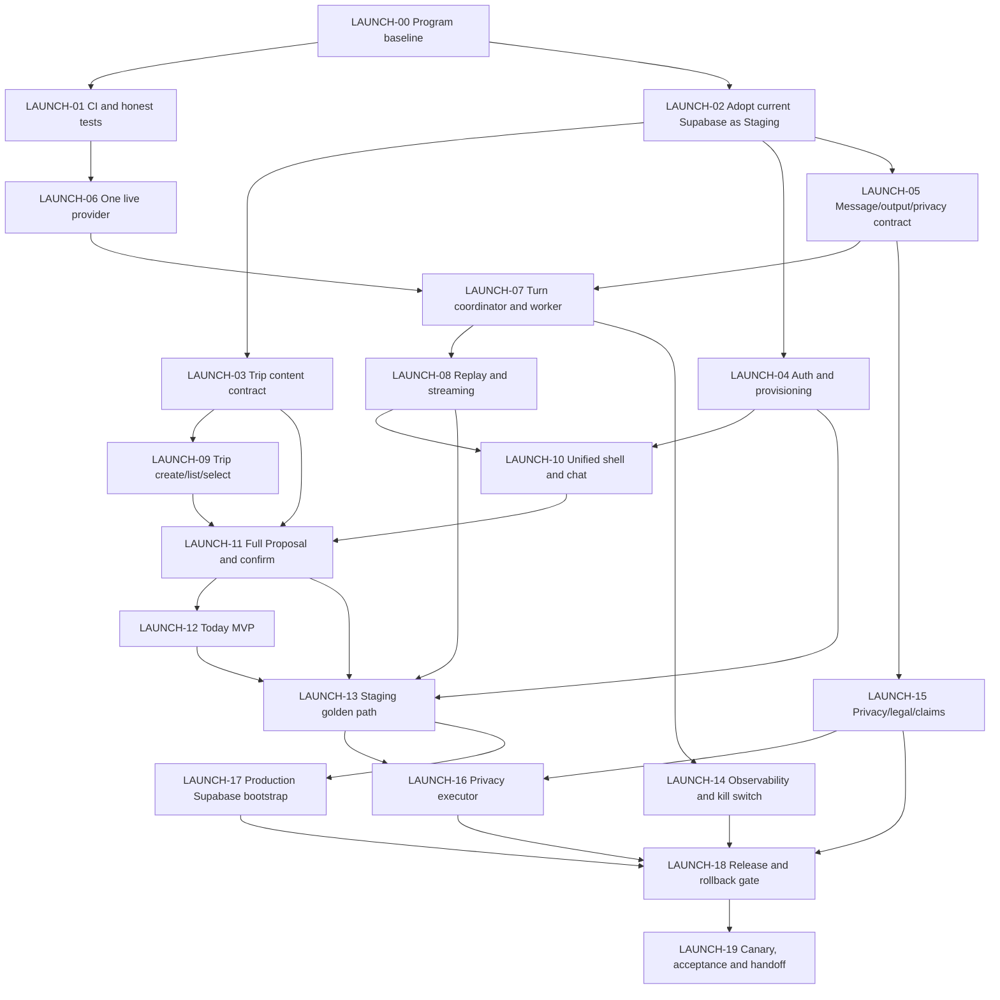

# VP-V4 Closed Beta 上线优化与 LAUNCH-00～19 Issue 计划

> 状态：accepted planning baseline
> 日期：2026-08-29
> 代码基线：`main@594821cc9ebc76b488c7feb65d1421ed26a3651e`
> 上游审计：[VP-V4 上线可用性审计](2026-08-29-vp-v4-launch-readiness-audit.md)
> 外部输入：`C:\Users\jtcao\Downloads\vpv4closedbetalaunchplan.md`，只作为分析材料，不作为授权或仓库事实

本文件是 LAUNCH-00～19 的唯一执行计划；与早期
`docs/vp-v4-closed-beta-launch-plan.md` 的评估或编号冲突时，以本文件为准。

## 1. 本轮最终目标

本轮结束时，VisePanda 必须是一个可以邀请真实测试用户使用、可以观测、可以回滚的 closed beta 产品。测试用户能够完成：

```text
受邀账号登录
  → 创建或选择 Trip
  → 输入真实旅行需求
  → 收到真实 AI 回复
  → 生成结构化 Trip Proposal
  → 在 Canvas 查看完整日程差异
  → 明确确认
  → 刷新/重新登录后仍能看到行程
  → 在 Today 看到基于已确认行程的一个可解释下一步
  → 导出数据或提交可真正执行的删除请求
```

“上线”不再由页面、PR、部署或静态断言定义，而由真实 Staging 黄金路径、RLS、Production 隔离、可观测、回滚演练和观察窗共同定义。

### 1.1 本轮承诺能力

- invitation-only password sign-in、session、route guard、first-run；
- 一个真实文本模型 Provider；
- 可输入、可恢复、可取消的 Chat；
- 包含“天 + 有序条目”的 Trip 内容模型；
- Trip 创建、列表、选择、Canvas、Proposal diff、confirm/reject/revise；
- 基于已确认 Trip 的 Today MVP；
- Profile/Memory 的既有安全能力接入主链；
- 数据导出、删除执行、隐私政策、服务条款；
- Staging、独立 Production、CI、遥测、预算、kill switch、canary 和回滚。

### 1.2 明确不在本轮承诺

- Explore、城市/POI 公共知识库和大规模 RAG；
- 天气、航班、铁路、地图、库存、预订、支付和 Human Help；
- 语音、OCR、图片识别和实时翻译；
- Guide Import 和 Offline Pack；
- 公共注册、社交登录、Magic Link 和自助找回密码；
- 自动修改 Trip、模型直接写数据库、客户端直接更新 Trip；
- 全国城市覆盖、专业建议、SLA 或“全能旅行管家”宣传。

未纳入的入口必须从 closed-beta 主导航和对外文案中隐藏；深链接可以返回五语、RTL 正确的诚实 unavailable 状态，但不能看起来像已发布能力。

## 2. 对 Claude 方案的处理结论

### 2.1 采纳

- Trip 数据库目前只有标题级内容，是最高优先级的产品缺口；
- 真实 Provider、Turn Coordinator、worker、流式事件和 Chat 输入必须形成一条运行链；
- Trip 创建/列表和 Chat → Proposal → Confirm 必须先于 release；
- 大量源码字符串测试不能继续冒充 E2E；
- 隐私执行器、可观测、资产权利和 release gate 都是上线条件。

### 2.2 调整

- **不新建 Staging Supabase。** 当前尚未承载真实用户的 Supabase Project 暂定为 Staging，用于 migration、RLS、测试账号和端到端验证。
- **正式发布前新建独立 Production Supabase。** 两个 Project 的用户、数据、Storage、密钥、回调地址和部署变量不得复用。
- `LAUNCH-16～19` 不再承载扩展功能，改为 Production、release、canary 和交接，保证整组 Issue 只有一个上线结果。
- Today 纳入本轮，但只读取已确认 Trip，暂不依赖外部实时事实。

### 2.3 不视为已决定

- Provider 尚未选定；DeepSeek 只是候选，不是批准结果；
- chat 90 天、audit 24 个月、telemetry 30 天、备份 35 天等保留期限尚需 operator/隐私评审；
- `beta_allowlist` 尚不存在，是否新增表必须在 Auth 接口基线中决定；
- `go2china.space` 是否已绑定并可用必须重新验证；不能继承文档中的成功声明；
- 任何账号、密钥、付费、域名、Production Project、migration 应用和公开发布动作仍需 operator 明确执行或授权。

## 3. 系统控制基线

| 项目 | 定义 |
| --- | --- |
| 目标 `r(t)` | 真实测试用户可完成完整闭环，并在 Today 看到已确认 Trip 的下一步 |
| 当前观测 `y(t)` | 静态外壳较完整，但无真实 prompt→provider→answer→full Trip persistence 运行路径 |
| 偏差 `e(t)` | D2：Issue 完成状态与用户可用性、数据内容模型、生产运行时和发布证据系统性不一致 |
| 控制动作 `u(t)` | LAUNCH-00～19，一 Issue/分支/PR，先冻结接口再实现消费者 |
| 外部扰动 `d(t)` | Provider 条款/区域/成本、Supabase/Vercel 配置、域名、数据保留与资产权利 |
| 观测节拍 | PR checks；每次 Staging smoke；canary 日内观测；72 小时 release observation |
| Owner | 工程 owner 负责仓库实现和证据；operator 负责账号、密钥、数据政策和生产发布决定 |

## 4. 产品与数据边界

### 4.1 最小 Trip 内容模型

第一版只支持：

- Trip：`id`、`owner_id`、`title`、`timezone`、`start_date`、`end_date`、`version`；
- Day：稳定 ID、日期、顺序；
- Item：稳定 ID、day ID、顺序、可选时间、标题、文字地点、备注、完成状态；
- Proposal：base version、immutable revision、结构化 `TripPatch`、可见 diff、evidence/assumption 状态；
- Event/Snapshot：append-only audit、可恢复的版本快照。

本轮不加入交通段、预订、地图坐标、价格或外部证据。数据库、domain contract、API、Canvas 和 AI structured output 必须使用同一版本化形状。

### 4.2 Today MVP

Today 只从当前用户已确认的 Trip 读取数据，以明确时钟和每个 Day 的已记录 timezone 计算：

- 当前/下一条尚未到达其日程日期的 itinerary item；
- 为什么选中该条目的可解释原因；
- 打开对应 Trip/Day 的导航；
- 没有 eligible item、日期不在行程内或数据不完整时的诚实空状态。

Today 不推断实时营业、延误、天气、安全或交通事实，不自动修改 Trip。当前闭合 Trip 模型没有用户手动完成字段；本轮将日程日期已过表达为没有剩余日期条目，而不会把它声称为用户完成，手动完成状态另行建模。

### 4.3 环境拓扑

```text
Local/CI → fixture + local tests
              ↓
Current Supabase Project = Staging
  - migrations / RLS / test users / seeded synthetic trips / E2E
  - Vercel Preview only
              ↓ release candidate + accepted evidence
New independent Supabase Project = Production
  - clean migration replay / production users / no Staging data copy
  - Vercel Production only
```

## 5. LAUNCH-00～19 依赖图



## 6. Issue 规格

所有 Issue 都必须引用本计划、使用匹配交付波次的 `phase:R0`～`phase:R5`、`priority:*`、`status:*` 和标准 triage label；实现前必须加入 `docs/agents/issue-execution-contract.md`。估算超过五个 focused days 时必须继续拆 child Issue，不能扩大原 Issue。

### 6.1 GitHub Issue 索引

Program：[LAUNCH-00 #149](https://github.com/JTCAO515/VP-V4/issues/149)，作为 [AI Core Program #2](https://github.com/JTCAO515/VP-V4/issues/2) 的 native sub-program。#149 下有 19 个 native sub-Issues，依赖同时使用 GitHub blocked-by 和正文引用。

| LAUNCH | GitHub | LAUNCH | GitHub | LAUNCH | GitHub | LAUNCH | GitHub |
| --- | ---: | --- | ---: | --- | ---: | --- | ---: |
| 00 | #149 | 05 | #155 | 10 | #160 | 15 | #164 |
| 01 | #150 | 06 | #156 | 11 | #161 | 16 | #165 |
| 02 | #152 | 07 | #157 | 12 | #169 | 17 | #170 |
| 03 | #153 | 08 | #158 | 13 | #162 | 18 | #166 |
| 04 | #154 | 09 | #159 | 14 | #163 | 19 | #171 |

旧 #151 的 `LAUNCH-01b` 已并入 #150 并以 `status:superseded` 关闭；#158 原 `07b` 原位升级为 `LAUNCH-08`；#168 已移出本轮并改为 post-launch `EXPAND-01`。

### LAUNCH-00：重置 Program、上线定义与 claim 边界

- **Owner / 估算：** Product + Architecture / S。
- **目标：** 用真实用户结果替代“页面/PR 已完成”的关单标准。
- **Scope：** 建立 Program、20 个 Issue 的依赖、milestone、标签、operator decision queue、release checklist；把扩展入口设为 hidden/unavailable；记录旧 Issue 只完成 contract/fixture 的真实成熟度。
- **Acceptance：** 每个 Issue 有 owner、依赖、接口、allowed paths、验收、风险、回滚和 evidence；Program 只有一个终点 `closed-beta-accepted`；claim matrix 默认 deny。
- **风险 / 回滚：** 仅治理变更；回滚为恢复 tracker，但不得恢复虚假的 maturity 声明。
- **依赖：** 无。

### LAUNCH-01：可信工具链、CI 与测试语义

- **Owner / 估算：** Developer Experience / M。
- **目标：** 所有后续完成声明可复现。
- **Scope：** 固定 pnpm/Node；修复当前 unit stale-date 失败；把源码字符串检查命名为 static/contract；增加真实 browser E2E lane；把 flags、release assets、frontend browser、docs 加入 required checks；保存 skipped/unrun 原因。
- **Acceptance：** clean checkout 的 lint、typecheck、build、unit、contract、integration、security、static E2E、browser E2E、eval、docs、flag 和 asset non-release checks 全部有明确结果；required checks 不能被 skipped 冒充通过。
- **风险 / 回滚：** CI 时间增加；可回滚 job 并保留原命令，不得降低检查标准。
- **依赖：** LAUNCH-00。

### LAUNCH-02：把现有 Supabase 正式纳入 Staging 基线

- **Owner / 估算：** Data + Security + operator / M。
- **目标：** 不新建 Staging，用当前无真实用户 Project 获得可重复数据库证据。
- **Scope：** 记录 Project ref/region 但不记录秘密；核对其无真实用户/生产数据；绑定 Preview 环境；从空 schema 重放 migrations；建立合成 seed/reset；创建至少 owner/other-user 测试账号；运行 migration、RLS、RPC、fault 和恢复探针。
- **Acceptance：** `db:verify` 与所有本地 Supabase skip 在 Staging lane 中变成执行结果；owner/other-user 隔离通过；Preview 不读取 Production 配置；测试数据可重置；无秘密进入代码、日志或证据。
- **风险 / 回滚：** 错认含真实数据的 Project；发现真实用户/不可解释数据立即停止并升级 D3。回滚为断开 Preview、撤销测试账号并按安全 runbook 清理合成数据，不删除 Project。
- **依赖：** LAUNCH-00、LAUNCH-01 的最小 CI lane。

### LAUNCH-03：冻结并持久化完整 Trip 内容模型

- **Owner / 估算：** Domain + Data / L（4–5 天）。
- **目标：** Trip 从“标题”升级为可编辑的日程表。
- **Scope：** ADR；Day/Item schema；versioned TripPatch；Proposal revision/diff；snapshot/event；RLS；CAS；atomic confirm-and-apply；旧 title-only Trip 兼容投影；五语日期/timezone 表达边界。
- **Acceptance：** migration 在空库和现有 Staging 数据上可重复；同一 patch 在 TS/SQL 产生相同结果；stale version、cross-owner、重复 confirm、非法顺序全部 fail closed；快照可恢复但不改写历史。
- **风险 / 回滚：** D2 接口变化；先做 additive migration 和双读兼容，回滚消费者到 title-only projection，新增表/列保留不破坏删除。
- **依赖：** LAUNCH-02。

### LAUNCH-04：Closed-beta Auth、provisioning 与 route guard

- **Owner / 估算：** Identity + Web / M。
- **目标：** 受邀用户可靠登录并回到合法目标；未授权用户不能进入私有路由。
- **Scope：** server-side session guard；安全 `returnTo`；signed-in/out/expired/not-provisioned；first-run；登出；五语/RTL；手动账号开通 SOP。是否新增 `beta_allowlist` 先以接口基线和最小权限评审决定，不能只靠前端状态。
- **Acceptance：** anonymous/private、valid/invalid/expired、owner/other-user、removed-access、open-redirect、refresh/deep-link 矩阵通过；登录后进入 first-run 或原目标；无公开 signup/recovery；service role 不进浏览器。
- **风险 / 回滚：** 用户被锁死或 route loop；feature flag 恢复到安全 sign-in/unavailable，不放开匿名私有数据。
- **依赖：** LAUNCH-02。

### LAUNCH-05：冻结 Message、Assistant Output 与数据保留合同

- **Owner / 估算：** AI Platform + Privacy / M。
- **目标：** 用户输入、模型输出、Proposal 和隐私承诺有一个安全、版本化的数据形状。
- **Scope：** UserMessage/AssistantMessage、validated structured result、stream events、usage、error、content classification、redaction、retention state machine；明确通用 telemetry 不记录原 prompt/answer/reasoning；形成待 operator 决策的 retention option matrix。
- **Acceptance：** 长度、locale、幂等、取消、重试、恶意输入、structured-output validation 合同通过；retention 未批准时 fail closed，不把 Claude 建议期限写成既定政策。
- **风险 / 回滚：** 一旦存储内容即产生隐私义务；可关闭 content persistence 并保留 content-free receipt，不伪称历史可恢复。
- **依赖：** LAUNCH-02；retention 最终值需 operator 决策。

### LAUNCH-06：接入一个真实文本 Provider

- **Owner / 估算：** Model Platform + operator / L（3–5 天）。
- **目标：** server-only 真实调用产生可验证回答，不让模型获得数据库写权限。
- **Scope：** 候选对比与 operator 选择；transport adapter；server env；timeout/abort/retry/rate limit；structured output；usage/cost；错误归一；five-locale smoke；synthetic travel eval；no-secret logging。
- **Acceptance：** Staging 对至少 20 个五语/安全/拒答样例产生可复现结果；超时、限流、余额不足、schema error 和取消均可观测并 fail closed；前端 bundle、日志、数据库无 key/reasoning。
- **风险 / 回滚：** 成本、区域、条款和供应商故障；provider flag 一键关闭并显示 honest unavailable。
- **依赖：** LAUNCH-01；operator provider/region/budget 决策。

### LAUNCH-07：生产 Turn Coordinator 与可靠 worker

- **Owner / 估算：** Backend / L（4–5 天）。
- **目标：** accepted turn 最终可靠到达 terminal result。
- **Scope：** claim/lease、幂等 job、actor-scoped context、provider call、validation、event append、terminal-once、retry/quarantine/cancel、worker auth、bounded concurrency；禁止 fake coordinator 进入 live flag。
- **Acceptance：** duplicate delivery、worker crash、lease expiry、cancel race、provider failure、validation failure 和 replay 集成测试通过；任何失败不产生 Trip write；跨用户不可观察。
- **风险 / 回滚：** 重复计费/重复结果；关闭 worker/flag，保留 durable accepted state 和安全重试能力。
- **依赖：** LAUNCH-05、LAUNCH-06。

### LAUNCH-08：真实事件 replay、SSE 与断线恢复

- **Owner / 估算：** Backend + Web / M。
- **目标：** 用户看到真实进度，刷新或断线后状态不丢。
- **Scope：** 实现已冻结的 `turn-sse-v1` 或以 ADR 明确替换；Last-Event-ID/replay；heartbeat；terminal close；polling degraded path；取消；客户端 reducer 单一状态源。
- **Acceptance：** 正常流、断线重连、重复 event、慢客户端、取消和 provider unavailable browser 测试通过；SSE 和 canonical replay 收敛到相同终态。
- **风险 / 回滚：** serverless 连接限制；降级到 bounded polling，但不得展示 fixture progress。
- **依赖：** LAUNCH-07。

### LAUNCH-09：Trip 创建、列表、选择与空状态

- **Owner / 估算：** Trip + Web / M。
- **目标：** 用户无需知道 UUID 即可进入自己的 Canvas。
- **Scope：** owner-scoped create/list endpoints；first Trip；列表、recent/current selection、empty/error/loading；route deep link；创建 v0 snapshot；server-side validation。
- **Acceptance：** create/list/reload、zero/one/many Trip、owner/other-user、duplicate submit 和 invalid range 通过；创建后可直接进入 Canvas；客户端无 direct table write。
- **风险 / 回滚：** 重复/空 Trip；用 idempotency key 和 server transaction，flag 关闭创建但保留读取。
- **依赖：** LAUNCH-03、LAUNCH-04。

### LAUNCH-10：统一 Product Shell 与真实 Chat UX

- **Owner / 估算：** Web / L（4–5 天）。
- **目标：** 删除两套断裂聊天体验，主输入只连接真实 API。
- **Scope：** 合并 `/visepanda` 与 `/visepanda/ask` 的职责；prompt composer、message list、stream state、retry/cancel、thread history、Trip selector、mobile keyboard/safe-area、a11y、五语/RTL；隐藏非本轮入口。
- **Acceptance：** 键盘、桌面、390×844、Arabic RTL；输入→真实 turn→answer；refresh/reopen；错误/取消/empty；无 fixture answer、假卡片或静态“已完成”。
- **风险 / 回滚：** 大 UI surface；保留旧 route redirect 到新 canonical workspace，flag 可切到 truthful unavailable。
- **依赖：** LAUNCH-04、LAUNCH-08、LAUNCH-09。

### LAUNCH-11：Chat → 完整 Proposal → Canvas → Confirm

- **Owner / 估算：** Trip + AI + Web / L（4–5 天）。
- **目标：** AI 建议成为用户可审查、可拒绝、可确认的完整日程变更。
- **Scope：** validated structured itinerary→TripPatch；immutable Proposal revision；Day/Item diff；evidence/assumption 状态；confirm/reject/revise；atomic apply；canonical reload；用户手动编辑也走同一 patch boundary。
- **Acceptance：** 新建/修改多天行程；逐项 diff；confirm 后 version +1 且刷新持久；reject 不改 Trip；revision 保留历史；stale/cross-owner/duplicate confirm fail closed；模型永不直接写 Trip。
- **风险 / 回滚：** 模型生成非法 patch；validator 拒绝并保留自然语言 answer，关闭 proposal flag 不影响 Chat。
- **依赖：** LAUNCH-03、LAUNCH-09、LAUNCH-10。

### LAUNCH-12：Today MVP

- **Owner / 估算：** Today + Web / M。
- **目标：** 用户从已确认行程得到一个可信、可解释的当前/下一步。
- **Scope：** durable Trip reader；explicit clock/Day timezone；eligible scheduled-item selection；before/during/after date states；打开 Trip/Day；empty/outside-trip/incomplete-data 状态；五语/RTL/mobile。手动完成/取消状态不在当前闭合 Trip 模型内。
- **Acceptance：** before/during/after trip、timezone boundary、no items、no remaining dated items、malformed date 和 cross-owner 测试；Today 与 Canvas 使用同一 canonical Trip version；不调用外部事实、不自动写 Trip。
- **风险 / 回滚：** 过度暗示实时正确性；隐藏 Today nav 或显示 honest unavailable，Trip 不受影响。
- **依赖：** LAUNCH-11。

### LAUNCH-13：真实 Staging 黄金路径 Gate

- **Owner / 估算：** QA + Release / M。
- **目标：** 用真实 Supabase、真实账号和真实 Provider 证明完整用户结果。
- **Scope：** Playwright seeded owner/other-user；登录→创建 Trip→Chat→answer→Proposal→diff→confirm→reload→Today→logout/login；desktop、390×844、RTL；network/API/database assertions；failure screenshots/traces。
- **Acceptance：** 黄金路径连续三次全绿；RLS negative matrix 全绿；无 skip、fixture provider 或 source assertion；失败可复现；所有 unrun 显式记录。
- **风险 / 回滚：** flaky/成本；固定合成输入、预算上限和串行 lane，失败阻止 release 而非跳过。
- **依赖：** LAUNCH-04、LAUNCH-08、LAUNCH-11、LAUNCH-12。

### LAUNCH-14：可观测、预算、SLO 与 kill switch

- **Owner / 估算：** Platform / M。
- **目标：** 知道系统是否可用、慢、贵或泄漏，并能快速止损。
- **Scope：** content-free request/turn/provider/worker traces；latency/error/cancel/retry/token/cost；SLO；alerts；dashboard/query；per-user/rate/budget guard；runtime flags 实际消费；runbook。
- **Acceptance：** 真实故障注入能触发 alert；trace 可跨 API/worker/provider 关联但不含内容/PII/key；预算阈值自动拒绝新调用；kill switch 在 Staging 演练成功。
- **风险 / 回滚：** telemetry 泄漏或高基数；关闭 exporter、保留本地 bounded metrics，默认不记录内容。
- **依赖：** LAUNCH-07、LAUNCH-08。

### LAUNCH-15：隐私政策、服务条款、retention 与 claim matrix

- **Owner / 估算：** Product + Privacy + operator / M。
- **目标：** 对用户的承诺与实际执行能力一致。
- **Scope：** operator 决定保留/删除/备份期限；五语 privacy/terms；AI 风险声明；closed-beta/no-SLA；cookie/telemetry；claim matrix；首页/登录链接；隐藏未发布能力。
- **Acceptance：** 政策每项可追溯到 schema/job/runbook；无法执行的承诺不得发布；五语/RTL 链接可访问；对外文案不超出 `staging-accepted` 能力；operator 记录批准。
- **风险 / 回滚：** 法律/政策 D3；保持 private closed beta 和旧的更窄承诺，不能由工程 agent 自行批准期限。
- **依赖：** LAUNCH-05；operator 决策。

### LAUNCH-16：Privacy Export/Delete Executor

- **Owner / 估算：** Privacy + Data / L（4–5 天）。
- **目标：** 现有 request receipt 从“只记录请求”升级为可执行生命周期。
- **Scope：** export Profile/Memory/Trip/Chat/Artifact；异步 delete/anonymize；status/receipt；retry/idempotency；撤销窗（若政策采用）；Storage/cache；backup exception；dry-run 和 approval gate。
- **Acceptance：** export 只含 owner 数据且完整；删除后在线数据不可读；失败可重试不重复删除；状态对用户可见；other-user 拒绝；对 Staging 合成用户完成恢复演练。
- **风险 / 回滚：** 不可逆 D3；Production delete 默认关闭，先 dry-run。执行前可停 worker；执行后只能依批准的恢复/备份政策，不声称可恢复已删除主数据。
- **依赖：** LAUNCH-13、LAUNCH-15。

### LAUNCH-17：创建独立 Production Supabase 并验证迁移

- **Owner / 估算：** Data + Security + operator / M。
- **目标：** Production 与 Staging 物理隔离，且可从空 Project 重放到 release schema。
- **Scope：** operator 创建 Production Project；region/PITR/backup 决策；Auth URL；Vercel Production-only secrets；empty-project migration replay；RLS/security smoke；最小管理员/测试用户；禁止复制 Staging 用户和数据；cutover/compensation runbook。
- **Acceptance：** Project ref 与秘密不进仓库；Preview 不能访问 Production，Production 不能访问 Staging；空库 migrations 全绿；RLS owner/other-user smoke；未开始公开流量；migration manifest/hash 与 Staging accepted revision 一致。
- **风险 / 回滚：** 外部账号/Production 数据 D3；发布前可断开 Production env 并删除测试用户。数据库 schema 只做追加式补偿，不做破坏性 down migration；是否删除 Project 仅由 operator 决定。
- **依赖：** LAUNCH-13；LAUNCH-15 的 region/retention 决策。

### LAUNCH-18：Production Release、资产、域名与回滚 Gate

- **Owner / 估算：** Release + Security + operator / L（3–5 天）。
- **目标：** 只有通过证据的 commit 能进入 Production，并能恢复上一安全版本。
- **Scope：** required checks；release asset rights/SBOM/NOTICE；domain/TLS 实测；env protection；migration plan；provider production budget；feature flags；Preview→Production promotion；health/smoke；previous alias rollback rehearsal；release checklist。
- **Acceptance：** 所有 required checks 与 release asset check 全绿；`/`、sign-in、workspace、Chat health、Trip、Today smoke；域名以现场证据而非旧声明验收；rollback 恢复上一 alias；DB compensation 和 provider-off degraded path 演练。
- **风险 / 回滚：** 公共流量、版权、成本和数据；未获 operator cutover 授权只做到 ready，不执行发布。回滚 alias + provider/chat flags；数据库追加式补偿。
- **依赖：** LAUNCH-14、LAUNCH-15、LAUNCH-16、LAUNCH-17。

### LAUNCH-19：Closed-beta canary、72 小时观察、最终验收与交接

- **Owner / 估算：** Product + Release + operator / M + 72 小时。
- **目标：** 少量真实测试用户使用后，项目有明确接受结论和下一阶段接手材料。
- **Scope：** canary cohort；support/incident channel；SLO/成本/漏斗；P0/P1 triage；72 小时观察；Go/No-Go；release notes；`docs/handoff.json`、`HANDOFF.md`、`CONTEXT.md`；post-launch backlog 重估。
- **Acceptance：** 真实邀请用户至少完成登录→Trip→Chat→Proposal→confirm→Today；观察窗无未决 P0/P1；预算与错误率在批准阈值内；回滚未失效；所有 unrun、风险、owner、唯一下一动作写入交接；Program 状态才可改为 `closed-beta-accepted`。
- **风险 / 回滚：** 真实用户暴露系统缺陷；立即停止邀请、关闭 AI/Proposal/Today flag 或回滚 deployment，保留数据和事件用于受控诊断。
- **依赖：** LAUNCH-18。

## 7. 里程碑与发布门禁

| Gate | Issue | 必须得到的证据 | 未通过时产品状态 |
| --- | --- | --- | --- |
| G0 目标冻结 | 00 | Program、范围、claims、operator queue | engineering scaffold |
| G1 可信基础 | 01–05 | CI、Staging、Trip/Auth/Message 接口 | private preview |
| G2 真实 AI 主链 | 06–10 | provider、worker、stream、Trip entry、Chat UX | internal alpha |
| G3 产品闭环 | 11–13 | full Proposal、Today、真实 Staging E2E | staging-accepted closed beta candidate |
| G4 可运营/隐私 | 14–16 | observability、policies、privacy executor | release blocked |
| G5 Production ready | 17–18 | isolated Production、asset/domain/rollback | canary ready |
| G6 Closed beta accepted | 19 | real-user canary + 72h + handoff | closed-beta-accepted |

任何 Gate 失败都不能用“已部署”“手工看起来正常”或“先上线再补”绕过。

## 8. 工期与并行策略

- 单人全栈：约 11–15 个 focused engineering weeks，外加 operator 决策和 72 小时观察窗；
- 2–3 人：接口冻结后约 7–10 个日历周，外加外部等待；
- 第一并行面：LAUNCH-01、LAUNCH-02；
- 第二并行面：LAUNCH-03、04、05、06；
- 第三并行面：LAUNCH-07/08 与 LAUNCH-09；
- LAUNCH-10/11/12/13 以集成为主，不大面积并行；
- LAUNCH-14/15 可并行；LAUNCH-16/17 在 G3 后并行；18/19 串行。

## 9. 本轮结束后的未完成任务规划

以下 backlog 在 LAUNCH-19 交接时按真实反馈重新排序，不占用 `LAUNCH-00～19`。每项仍需独立接口、数据许可、隐私和 release gate。

| 建议 ID | 能力 | 最小第一版 | 关键前置 |
| --- | --- | --- | --- |
| EXPAND-01 | Knowledge MVP | 两个试点城市的 reviewed/current/licensed facts 可被 Chat 引用 | source/licence/region/Fact review |
| EXPAND-02 | Explore MVP | city/POI detail、Ask/Add exact Canonical POI ID | EXPAND-01、可读 POI projection |
| EXPAND-03 | Today Live Evidence | 对 Today 的天气/营业/延误提供带时间戳的 evidence，不确定时 fail closed | External Evidence + freshness + licences |
| EXPAND-04 | Text Translation | 真实文本翻译、纠错和复制，不做语音/OCR | provider/data policy/evals |
| EXPAND-05 | Safe Phrase Tool | reviewed phrase、display=TTS text、offline-safe subset | reviewed corpus/licence/TTS |
| EXPAND-06 | Guide Import | private upload、extract、correct、Proposal | Storage TTL、injection defense、privacy executor |
| EXPAND-07 | Offline Pack | confirmed Trip/addresses/safe phrases 的 owner-isolated cache | logout/delete/cache purge policy |
| EXPAND-08 | Voice/OCR Translation | push-to-talk 与 OCR→MT，final-only persistence | region/media retention/quality benchmark |
| EXPAND-09 | Recovery & Disruption | 延误/关闭等 evidence-backed Proposal | official/live sources、RL-04/05/06 |
| EXPAND-10 | Public Beta Growth | public onboarding、support、analytics、abuse controls | closed-beta metrics、privacy/legal/ops capacity |

仍然不自动规划购买、支付、代订、医疗/法律建议或无许可内容扩张；这些属于新的产品/商业 D3 决策。

## 10. 交接要求

每个 LAUNCH Issue 结束时必须更新 machine-readable handoff；LAUNCH-19 必须交付：

1. 当前 accepted commit、deployment、Supabase migration revision 和 flags；
2. 已实现、降级、隐藏、计划中能力表；
3. changed files、实际运行命令、通过/失败/skip/unrun；
4. Staging/Production 拓扑与不含秘密的配置清单；
5. SLO、dashboard、预算、告警、support owner 和观察结果；
6. 数据 retention/export/delete/backup 的实际行为；
7. canary 用户路径与 P0/P1 处置；
8. 回滚 alias、provider-off、worker-off、migration compensation；
9. `EXPAND-01～10` 的重估顺序、证据和反对意见；
10. exactly one next action。

### Mandatory reading order

1. `AGENTS.md`
2. `CONTEXT.md`
3. `HANDOFF.md`
4. `docs/handoff.json`
5. 本计划
6. `docs/agents/issue-execution-contract.md`
7. 当前被接受的 LAUNCH Issue
8. 该 Issue 指向的 ADR、contract、runbook 和 artifacts

## 11. 当前唯一下一动作

LAUNCH-01 #150 已在通过 CI 和 Preview 验证后合并关闭。当前没有 `ready-for-agent` 的 Launch
Issue；唯一下一动作是由 operator 完成 [LAUNCH-02 #152](https://github.com/JTCAO515/VP-V4/issues/152)
的 Staging 配置与验收。不要先接 Provider、改 Trip schema、创建 Production Project 或公开发布。
