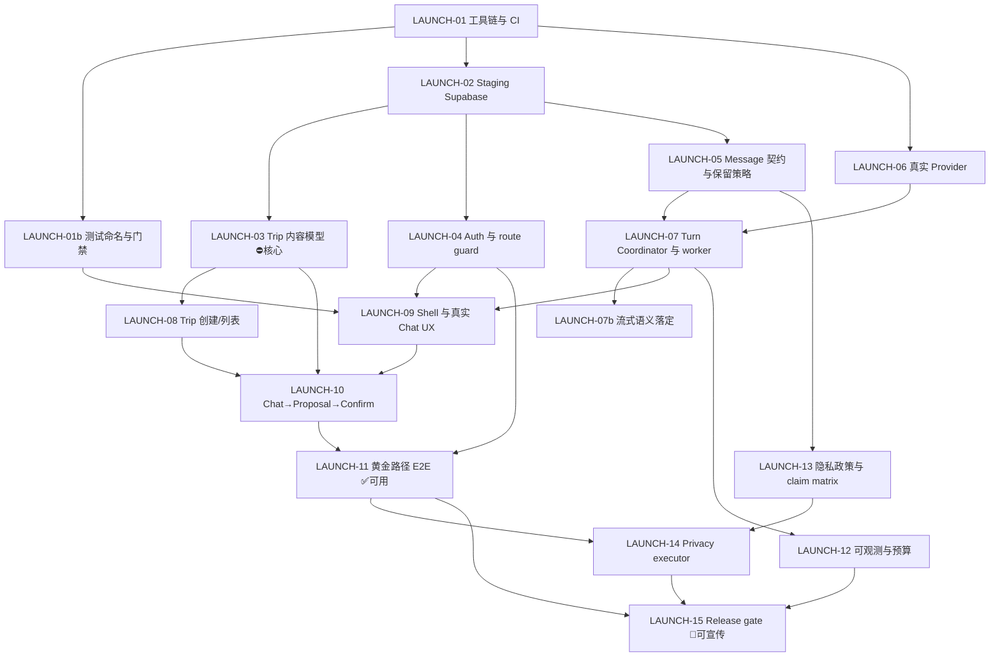

# VP-V4 Closed Beta 上线计划

> 复核日期：2026-08-29
> 基线：`main@594821cc9ebc76b488c7feb65d1421ed26a3651e`
> 目标：让 VP-V4 达到**可用且可对外宣传的 closed beta**
> 当前状态：`preview / engineering scaffold` — 距离 closed beta 有确定的、可枚举的差距
> 方法：完整克隆源码逐文件核实，含 22 个页面、19 个 API 路由、21 个 migration、17 个数据库函数、26 个 e2e 文件

---

## 0. 先说三句最重要的话

**第一句：这份文档是路径，不是产品。** 写完它，产品还是不能用。按第 5 节的 Issue 执行完 `LAUNCH-01` 到 `LAUNCH-11`，才能开 closed beta。

**第二句：最大的障碍不是"没接 AI"，是"没有行程"。**

我核对了 `trips` 表、`confirm_and_apply_trip_proposal` 函数、`TripCanvas` 组件和 `TripPatch` 契约，四处互相印证同一个事实：

> **VP-V4 的 Trip 目前只有一个内容字段：`title text`（最长 160 字符）。**

RLS、不可变 Proposal、CAS 版本控制、幂等键、append-only 审计、版本快照、回滚——这一整套精密机械，目前服务的是**一个字符串的重命名**。「Trip Canvas 的 Diff」在界面上就是 before/after 两行标题文字；「修改 Proposal」的表单是一个 `maxLength=160` 的单行输入框。

一句「第 2 天上午 9 点去故宫，步行 15 分钟到景山」，在当前 schema 里**无处可放**。

这不是批评。安全和并发的地基打得很扎实，那是最难补的部分。但一个 AI 行程规划产品，核心对象是「行程」，而这个对象还不存在。它必须成为第一优先级（`LAUNCH-03`）。

**第三句：好消息是 Trip 的创建权限其实已经就绪。**

数据库里 `authenticated` 已有 `trips` 的 `insert` 权限、有 owner policy、insert 后有 trigger 自动写 v0 快照。缺的只是 adapter 方法、API 路由和前端入口——**不需要新 migration**。这让 `LAUNCH-08` 比预想的小得多。

---

## 1. 已经做好的部分

这些是真资产，不该被推翻重来。

### 1.1 安全与并发地基（最有价值的部分）

| 能力 | 证据 |
|---|---|
| owner-scoped RLS | 21 个 migration，每张用户表都有 `auth.uid() = owner_id` 策略 |
| 不可变 Proposal | `trip_proposals` 表 + `status` 六态机（pending/applied/rejected/expired/conflicted/superseded） |
| CAS 并发控制 | `confirm_and_apply_trip_proposal` 里 `head_version <> base_trip_version` 直接判 `version_conflict` |
| 幂等 | `trip_idempotency` 表；同 key 不同 digest 抛 `IDEMPOTENCY_KEY_REUSE` |
| append-only 审计 | `trip_audit_events`、`trip_events`、`trip_version_snapshots` |
| 权限收紧 | `revoke update on public.trips from authenticated` — 用户**不能**直接改 Trip，只能通过 RPC 原子应用 |
| 事件写入隔离 | `append_chat_turn_event` 只授权 `service_role`，客户端无法伪造 assistant 事件 |
| 失败分类 | `lib/server/identity/failure-response.ts` 统一失败码 + 五语文案 |
| 同源变更保护 | `isSameOriginMutation` 用于所有变更类路由 |

这套东西做对了很难、做错了要命。它是 VP-V4 相对于任何"能跑但不安全"的原型的核心优势。

### 1.2 前端

- Next.js 16 / React 19 / Tailwind v4 / strict TS，构建通过；
- 五语（zh/en/es/ru/ar）+ RTL 文案体系完整（`lib/i18n.ts`）；
- 首页、长版 Homepage、登录页有独立视觉表达；
- 320–1440px viewport 测试通过；
- **6 个组件接了真 API 且写得规范**：`ProfileWorkspace`、`CopilotMemoryWorkspace`、`TripCanvas`、`TripPlaceView`、`TripActionsView`、`ChatThreadWorkspace`；
- `unavailable` 状态表达诚实——没有用假价格、假 POI、假 provider 冒充成功。**这是很值得肯定的工程操守**，比"看起来能用但全是假的"好得多，也是能诚实宣传的前提。

### 1.3 登录

`/auth/sign-in` 页面存在，密码登录/登出闭环已实现，五语文案齐全，明确标注 invitation-only。

---

## 2. 阻塞 closed beta 的九个缺口

按修复顺序排列。每一条都给了可复现的证据。

### 缺口 1：Trip 没有内容模型 ⛔ 最高优先级

**证据链（四处互相印证）：**

1. `supabase/migrations/20260825052328_ai14_actor_rls_fault_probes.sql:2` — `trips` 表全部字段：
   ```sql
   id, owner_id, head_version, title text, created_at, updated_at
   ```
   内容字段只有 `title`。

2. `confirm_and_apply_trip_proposal` 的核心语句：
   ```sql
   update public.trips set title = next_title, head_version = head_version + 1 ...
   ```
   确认 Proposal 唯一的效果就是改 `title`。而且它先校验
   `jsonb_typeof(proposal.patch->'title') <> 'string'` 就判 `invalid_patch` —— **patch 里除了 title 什么都不看**。

3. `components/canvas/TripCanvas.tsx:13` — Proposal 的类型定义：
   ```ts
   proposal: { ... titleDiff: { before: string; after: string } ... }
   ```
   界面上的 "Diff" 就是这两行字符串。修改表单是 `<input id="proposal-title" maxLength={160}>`。

4. `lib/server/trip/patch/contract.ts` — 内存契约支持三种操作
   （`set_title` / `upsert_day` / `delete_day`），`TripSnapshot.days` 的元素是 `{id, date}`
   ——**day 里没有任何内容**，而且这个契约与数据库**完全不通**：DB 的 RPC 不解析 `operations` 数组，也不存 days。

**这意味着：** 就算 AI 明天就能返回完美的行程 JSON，也没有地方存它，没有 Diff 能展示它，`confirm` 会把它当 `invalid_patch` 拒掉。

**必须做：** 设计并落地 Trip 内容模型（天 → 有序条目 → 时间/标题/地点/备注），重写 patch 契约让内存与数据库统一，重写 `confirm_and_apply` 让它应用真正的 operations，重写 Canvas 让它渲染真正的行程与 Diff。→ `LAUNCH-03`

---

### 缺口 2：没有创建 Trip 的入口

`app/api/trips/` 目录下**只有 `[tripId]/`，没有 `route.ts`** —— 即没有 `POST /api/trips`，没有 `GET /api/trips`。
`user-data-adapter.ts` 导出 24 个能力，其中**没有 `createTrip`**。

数据库里 17 个函数中，没有 `create_trip`，也没有创建**第一个** Proposal 的函数——
只有 `revise_trip_proposal`（改已有的）和 `create_trip_rollback_proposal`（回滚已有版本）。

这形成一个死锁：**Trip 要靠 Proposal 才能改，Proposal 要挂在 Trip 上才能建，而两者都没有创建入口。**

**好消息**（§0 第三句）：数据库权限已经就绪——
`grant insert on public.trips to authenticated` + policy `"trip owner inserts" with check (auth.uid() = owner_id)` +
`after insert` trigger 自动写 v0 快照。**不需要新 migration**，只需接线。→ `LAUNCH-08`

---

### 缺口 3：Chat 有两套页面，一套不连后端，一套不能输入

**`/visepanda`**（首页 CTA 的落点）：`components/VisePandaChatWorkspace.tsx` **全文 30 行**。
`textarea` 的 `onChange` 只写 `setDraft`，提交只写 `setSubmitted`，全文件 `fetch` 出现 **0 次**。
用户以为自己发出了消息，实际上什么都没发生。

**`/visepanda/ask`**：`ChatThreadWorkspace.tsx` 确实连 `/api/chat/**`，但——
创建 thread 的 body 硬编码为字符串 `"{}"`；启动 turn 只提交
`{turnId, idempotencyKey, digest: "chat-state-control-v1"}`。**没有任何 message 字段，界面上没有输入框。**

→ `LAUNCH-09`

---

### 缺口 4：没有真实模型调用

`lib/server/model-gateway/` 六个文件里，`deepseek` / `qwen` 只作为**字符串字面量**出现在 profile 元数据和路由判断中。全仓没有任何一处 `fetch` 指向 provider 域名。

全仓环境变量引用只有 7 个：
```
NEXT_PUBLIC_SUPABASE_URL, NEXT_PUBLIC_SUPABASE_PUBLISHABLE_KEY, SUPABASE_DB_URL,
VISEPANDA_PUBLIC_ORIGIN, NODE_ENV, VP_ARTIFACT_ISSUE, VP_CI_SUITE
```
**一个 provider key 都没有**——连变量名都还没定义。→ `LAUNCH-06`

---

### 缺口 5：没有后台执行载体，turn 在数据库层面就是死链

`lib/server/turn/` 只有 4 个文件，其中一个叫 `fake-coordinator.ts`。
没有 `supabase/functions/`，没有队列消费者，没有定时任务。

更关键的是权限设计：
```sql
grant execute on function public.append_chat_turn_event(...) to service_role;
```
推进 turn 状态的权限**只给 `service_role`**。这个设计是对的（客户端不能伪造 assistant 事件），
但它的前提是**必须有一个持 service_role 的后台进程**。这个进程不存在。

**结果：** `start_chat_turn` 能把 turn 写成 `accepted`，然后**永远停在 accepted**——
没有任何东西既有权限、又有能力推进它。→ `LAUNCH-07`

---

### 缺口 6：SSE 协议冻结了，但一行流式代码都没有

Issue #8 `[AI-06] Durable Turn 与 Buffered SSE v1 协议` 已关闭，
migration 里也硬编码了 `schema_version = 'turn-sse-v1'`。

但 `app/api/chat/turns/[turnId]/events/route.ts` 的实现是 `NextResponse.json(...)`——
返回 `application/json`，没有 `text/event-stream`，没有 `ReadableStream`。
客户端 `ChatThreadWorkspace.tsx:78` 也是普通 `fetch` 靠 `afterSequence` 轮询。

**文档说 SSE，代码是轮询。** 这必须二选一并落定，否则后续所有关于"流式体验"的验收都失去意义。→ `LAUNCH-07b`

---

### 缺口 7：登录页存在，但周边接线全断

| 断点 | 证据 |
|---|---|
| 没有路由保护 | **全仓无 `middleware.ts`** —— 未登录可直接访问任何 product route |
| `returnTo` 不生效 | `lib/navigation/workspace-entry.ts` 实现了安全白名单，但**全仓零 import**（死代码）；`PasswordSignInForm.tsx:140` 登录后固定跳 `/visepanda` |
| first-run 永不显示 | `PasswordSignInForm` 接受 `showFirstRun` 参数，但 `page.tsx` 不传，默认 `false` |
| `notProvisioned` 无人触发 | 该状态在 UI 类型和五语文案里都有，但**没有任何代码会设置它** |

→ `LAUNCH-04`

---

### 缺口 8：26 个 e2e 里 16 个是读源码字符串

`tests/e2e/` 下 26 个 `.test.mjs`，其中 **16 个** import `node:fs` 的 `readFileSync`——
它们打开 `.tsx` 源文件，用正则断言里面有没有某个字符串。真正启动浏览器的只有
`tests/e2e/frontend/web-10-viewport.spec.mjs` 的 3 个 Playwright 用例。

最需要注意的一行在 `tests/e2e/chat/v4-08-ask-route.test.mjs:20`：

```js
assert.doesNotMatch(workspace, /textarea|TripPatch|.../);
```

**「Chat 工作区里不许出现输入框」是这个测试的通过条件。**
而它对应的 Issue #93 标题是 `[V4-08] Durable Chat Threads、History、Reconnect 与 Cancel`。

这条断言会在 `LAUNCH-09` 加输入框时**直接把 CI 打红**，所以必须先处理（`LAUNCH-01b`）。

---

### 缺口 9：对外宣传的法务与门禁前提缺失

既然目标包含"宣传"，这些就是硬前提：

| 缺失 | 现状 |
|---|---|
| 隐私政策页面 | **不存在**（`app/` 下只有 `api/privacy`，没有面向用户的政策页） |
| 服务条款页面 | **不存在** |
| 数据保留承诺 | 未定义（本文 §4 已给出建议方案） |
| 对外 claim matrix | 未定义——哪些能力可以宣传、哪些不能，没有依据 |
| CI 门禁 | `check:flags` 和 `check:assets:release` **写好了但没接进任何 workflow**；`Quality Release Candidate` 只能手动 `workflow_dispatch` 触发；真浏览器测试 `test:e2e:frontend` 不在任何 workflow 里 |
| 资产权利 | 9 个 `blocked-release` 资产仍在 public 输出 |
| main 分支保护 | 未配置 |

→ `LAUNCH-01b`、`LAUNCH-13`、`LAUNCH-15`

---

## 3. 成熟度评估

| 维度 | 完成度 | 依据 |
|---|---:|---|
| 视觉与响应式外壳 | 65%–75% | 首页/登录/产品壳/五语/RTL 完整 |
| 安全与并发地基 | **70%–80%** | RLS/CAS/幂等/审计/权限收紧都到位，缺 staging 真实验证 |
| 核心交互前端 | 15%–20% | 22 个页面里登录后真正有用的是 2 个（profile、copilot） |
| **Trip 领域模型** | **10%–15%** | 只有 title 字段；patch 契约与数据库不通 |
| 后端生产运行时 | 5%–10% | 写路径四个入口（Trip 创建、message 契约、provider、worker）全部不存在 |
| 发布与合规 | 5%–10% | 无隐私政策/条款；关键 CI 检查未接门禁 |
| **可用 closed-beta 整体** | **15%–20%** | 架构准备远多于用户可用能力 |

---

## 4. 数据保留策略（已定）

操作者授权由我定案。以下方案已写入 `LAUNCH-05` 的验收标准，是保守且符合常规实践的取值。

| 数据类别 | 保留期 | 理由 |
|---|---|---|
| **用户消息 + 助手输出** | **90 天滚动删除** | 对话是敏感度最高的数据。90 天足够用户回看和工程 debug；再长只是在无谓地扩大泄露面。用户可随时导出。 |
| **Trip / 版本快照 / Proposal** | **用户主动删除前长期保留** | 这是用户的产出物，是产品价值本身，不设自动过期。 |
| **Memory / Profile** | **用户控制，随时可删** | 已有 consent 机制，保持用户主权。 |
| **审计事件**（`trip_audit_events` 等） | **24 个月** | 安全取证与合规需要。**只存事件不存内容**——记录"谁在何时确认了哪个 proposal"，不记录 proposal 内容本身。 |
| **运行日志 / telemetry** | **30 天** | 默认不含 prompt 内容、不含 JWT、不含密码。 |
| **账号删除 SLA** | **7 天可撤销窗口 → 30 天内在线数据删除完成** | 7 天防误删和防账号被盗后的恶意删除；30 天是常见法规上限内的稳妥承诺。 |
| **备份** | **35 天滚动自然过期** | 备份技术上无法单条删除。这一点**必须在隐私政策里明示**：删除请求清空在线数据，备份副本在 35 天内自然过期。含糊其辞比说清楚风险大得多。 |

**两条约束：**

1. 删除必须是**真删除或不可逆匿名化**，不是加个 `deleted` 标记。
2. 隐私政策上线前不得对外宣传——`LAUNCH-13` 是 `LAUNCH-15`（公开）的硬前置。

---

## 5. Issue 规划

### 5.1 标签体系

新建四个成熟度标签，每个 LAUNCH Issue 挂且仅挂一个：

| 标签 | 含义 | 可以关单吗 |
|---|---|---|
| `maturity:contract` | 契约/测试存在，用户路径未闭合 | ❌ |
| `maturity:runtime` | 运行时代码写完，未在 staging 验收 | ❌ |
| `maturity:staging-accepted` | 真实 staging + 真实账号验收通过 | ✅ |
| `maturity:production-observed` | 生产观察窗通过 | ✅ 已上线 |

**关单铁律：release gate 判定为 `blocked` 时，Issue 必须保持 open。**
过去「gate 判 blocked 但 Issue 关了」是完成定义漂移的制度成因——96 个 Issue 关闭而产品不可用，根源在此。

**旧 Issue 全部保留 closed，作为 contract/security 证据，不重开。** 它们交付的合同和安全约束是真实的，只是不等于用户能力。

---

### 5.2 P0：可信工程基线

#### LAUNCH-01：钉死工具链并恢复全绿 CI

- **Owner**：Platform ｜ **依赖**：无 ｜ **估算**：M（2–3 天）
- **Scope**：
  1. 强制所有本地/CI 命令使用 pnpm 9.15.9（普通 `pnpm` 可能落到 11.x，会忽略 `overrides` 并使 frozen install 失败）；
  2. 修 `tests/unit/governance/` 里把 `handoff.lastUpdated` 写死为固定日期的测试（改为读实际值或允许区间）；
  3. 配置正确的 Next `outputFileTracingRoot`，消除多 lockfile 导致的 workspace root 误判；
  4. 修复失败的 Nightly；
  5. 为 `main` 开启 required checks。
- **验收**：fresh clone 上 `pnpm install --frozen-lockfile` + `pnpm check` + 全部测试套件不失败；允许的 runtime skip 必须逐条在 Issue 里列明。
- **回滚**：回退工具链 PR。**不允许通过关闭 required checks 来"恢复绿色"。**

#### LAUNCH-01b：测试命名与门禁诚实化

- **Owner**：QA/Platform ｜ **依赖**：LAUNCH-01 ｜ **估算**：S（1–2 天）
- **背景**：缺口 8 与缺口 9。
- **Scope**：
  1. 把 16 个源码断言测试从 `tests/e2e/` 移到 `tests/static-guard/`，脚本改名 `test:static-guard`。**`e2e` 这个名字留给真浏览器测试**；
  2. 删除 `assert.doesNotMatch(workspace, /textarea/)` 这类**「禁止功能存在」**的断言——它们会直接阻塞 `LAUNCH-09`；
  3. 把 `check:flags`、`check:assets` 接进 `Quality PR`；
  4. 把 `check:assets:release` 接进 `Quality Release Candidate`，并让该 workflow 可由 release 标签自动触发，而非只能手点；
  5. 把 `test:e2e:frontend`（Playwright）接进 Nightly。
- **不要做**：不删除源码断言测试本身——它们作为「防回归静态守卫」仍有价值，只是不该叫 e2e。
- **验收**：`tests/e2e/` 下只剩真正启动浏览器的用例；`check:flags` / `check:assets:release` / `test:e2e:frontend` 各自出现在至少一个 workflow 里。

#### LAUNCH-02：建立真实 Staging Supabase 与数据库验收

- **Owner**：Backend/Data + 操作者 ｜ **依赖**：LAUNCH-01 ｜ **估算**：L（3–5 天）+ 操作者配置时间
- **背景**：当前 integration 跳过 8 项、security 跳过 1 项，因为没有可连的数据库。
- **Scope**：独立 staging project（**不复用生产**）；应用全部 21 个 migration；配置 auth redirect / site URL；建立 invite-only 测试用户；验证 user/ops/worker 三条连接路径；跑 RLS、RPC、migration rollback、backup/restore smoke。
- **不要做**：不在仓库里写任何 URL/key/password；不用 Production 做开发验证。
- **验收**：integration 与 security 套件在 staging 真实条件下**零 skip** 通过；跨用户读写全部被拒；迁移可从空库重复执行；记录 project/region/retention owner（**不记录密钥**）。
- **操作者手动步骤**：§6.1

---

### 5.3 P0：Trip 领域模型（最高优先级）

#### LAUNCH-03：Trip 内容模型、Patch 契约与原子应用统一

- **Owner**：架构 + Backend ｜ **依赖**：LAUNCH-02 ｜ **估算**：L（4–6 天）
- **背景**：缺口 1。这是整个 closed beta 的**结构性前置**——它不完成，AI 接得再好也没有地方放结果。
- **Scope**：
  1. **设计 Trip 内容模型**。建议第一版刻意做小：
     ```
     Trip
       └─ Day[]        （date, 序号）
            └─ Item[]  （序号, startTime?, endTime?, title, placeRef?, note?）
     ```
     **第一版明确不做**：交通段、预订、票务、价格、地图几何、证据引用。
     这些每一个都会引出 provider、版权和数据地域问题，会把 `LAUNCH-03` 从 5 天拖成 3 周。
  2. **统一 patch 契约**。`lib/server/trip/patch/contract.ts` 现有的
     `set_title` / `upsert_day` / `delete_day` 扩展为覆盖 Item 的操作集，
     并让**数据库 RPC 真正解析 `operations` 数组**——目前 DB 只读 `patch->>'title'`，与内存契约完全不通。
  3. **重写 `confirm_and_apply_trip_proposal`**：在同一事务里应用完整 operations，
     保持现有的 CAS（`head_version` 比对）、幂等、审计、版本快照语义**一字不改**。
  4. **重写 Canvas 的 Diff 渲染**：从 `titleDiff` 的两行字符串，变成按天/条目的结构化增删改对比。
  5. 追加 migration（新表或 `trips` 加 jsonb 内容列，二选一并写进 ADR）。
- **不要做**：不放宽任何现有安全约束——`revoke update on trips from authenticated` 必须保留，
  内容只能经 RPC 原子写入；不引入 provider 数据；不做地图。
- **验收**：
  - 一个 Proposal 能新增一天、在该天插入两个条目、调整顺序，确认后 Trip 快照与之一致；
  - `expectedVersion` 不匹配时返回 `version_conflict`，Trip 不变；
  - 重复确认幂等；
  - Canvas 上能看到「第 2 天 新增：09:00 故宫」这种可读的 Diff；
  - 内存 `applyPatch` 与数据库 RPC 对同一 patch 产生**逐字段相同**的结果（这条要有专门的对拍测试）。
- **风险**：这是核心写路径。必须在真实 staging 事务和 RLS 下验证，契约测试不能代替。
- **回滚**：新内容列/表可追加式回滚；`confirm_and_apply` 保留旧版本函数名做灰度。

---

### 5.4 P0：登录与真实 Chat 主链

#### LAUNCH-04：closed-beta Auth、route guard 与 onboarding

- **Owner**：Web/Identity ｜ **依赖**：LAUNCH-02 ｜ **估算**：M（2–3 天）
- **已定决策**：**测试用户由操作者手动开通**（不做邀请码，不做公开注册）。
- **Scope**：
  1. **新建 `middleware.ts`** 保护 authenticated product routes（当前完全没有）；
  2. 接线 `lib/navigation/workspace-entry.ts`（已实现的安全 `returnTo` 白名单，目前零 import）；
  3. 登录页读 `searchParams.returnTo`，登录后跳回原目标而非固定 `/visepanda`；
  4. 首登传 `showFirstRun={true}`；
  5. 实现 session refresh / expired / sign-out 全局状态；
  6. **`notProvisioned` 状态接线**：手动开通模式下，这个状态用于"邮箱存在于 auth 但未被授予 beta 访问"的情形。
     实现方式建议：一张 `beta_allowlist` 表（owner-scoped 只读），登录后校验；不在 allowlist 里则显示已有的五语 `notProvisioned` 文案；
  7. 编写操作者开通用户的 SOP（§6.2）；
  8. 根首页 CTA 策略定案：进登录，还是进明确标注的匿名预览。
- **验收**：真实浏览器账号跑通 login → returnTo → first-run → product → sign-out；
  未登录访问受保护路由回登录页；不在 allowlist 的账号看到 `notProvisioned`；
  跨用户状态清空；五语 + RTL + 密码管理器 + 移动键盘通过。
- **风险**：重定向环路、session cookie 不一致。
- **回滚**：保留匿名预览，关闭 authenticated 入口。**不恢复已废弃的 Magic Link**（#120 已 superseded）。

#### LAUNCH-05：User Message、Assistant Output 与保留策略契约

- **Owner**：Chat / Data / Privacy ｜ **依赖**：LAUNCH-02 ｜ **估算**：L（3–5 天）
- **Scope**：为 thread/turn 增加带版本的 user message；定义文本长度上限、locale、Trip scope、PII 脱敏；
  定义 Answer / Clarification / Card / Proposal 的输出 envelope；追加 migration + RLS；
  **落地 §4 的保留策略**（含 90 天滚动删除的实现方式与 24 个月审计保留）。
- **不要做**：不把 raw provider payload、reasoning trace 或密钥写库；
  不允许客户端写 assistant output（现有 `service_role`-only 授权保持不变）。
- **验收**：owner 能创建/读取消息；他人不可读；重复 idempotency key 不重复创建；
  超长/空/非法结构被拒；delete/export 的 scope 包含 message；
  90 天过期消息被自动清理且清理动作可审计；migration 可回滚。

#### LAUNCH-06：接入一个真实文本 Provider

- **Owner**：AI Runtime + 操作者 ｜ **依赖**：LAUNCH-01 ｜ **估算**：L（3–5 天）
- **Scope**：只接**一个** provider、**一个** ordinary-text profile。
  实现 thin HTTP adapter、deadline、abort、`Retry-After`、schema 校验、usage/cost 记录、
  returned-model drift 检测、safety/error 映射。secret 只放 server environment。
- **不要做**：不同时接多个 provider；不做 OCR/语音/视觉；**不允许模型直接写 Trip**。
- **验收**：脱敏 staging smoke 成功；timeout / 429 / 5xx / invalid schema / safety / cancel
  六种失败均可复现；预算与 kill switch 生效；provider 关闭时统一返回 unavailable。
- **风险**：数据地域、DPA、模型别名漂移、成本。
- **回滚**：provider flag 置 off → Chat 显示诚实 unavailable，Trip 保持只读。
- **操作者手动步骤**：§6.3

#### LAUNCH-07：生产 Turn Coordinator 与后台执行

- **Owner**：AI Runtime / Backend ｜ **依赖**：LAUNCH-05、LAUNCH-06 ｜ **估算**：L（4–5 天）
- **背景**：缺口 5。`append_chat_turn_event` 只授权 `service_role`，设计上就要求有后台进程，而它不存在。
- **Scope**：accepted turn 进入可靠 job；组装 actor-scoped context；调用 LAUNCH-06；校验输出；
  append event；终态只写一次；支持 replay / cancel / retry / lease / quarantine。
  **必须先决定执行载体**（Supabase Edge Function / 独立 worker / Vercel Cron），写进 ADR。
- **不要做**：不用内存 store 作为生产真理；不允许客户端 append assistant event；
  不在 route handler 里无界执行整轮（serverless 有硬超时）。
- **验收**：输入 message 后依次产生 accepted → planning → generating → validating → completed，
  或明确失败；刷新可 replay；cancel 后无后续输出；重复投递不产生重复回答；
  worker 崩溃后可恢复；跨用户不可观察。
- **回滚**：`CHAT_RUNTIME_ENABLED=false` 停止新 turn；保留历史与只读 Trip。
  ⚠️ 注意：该 flag 目前**运行时零消费者**，本 Issue 必须让它真正生效。

#### LAUNCH-07b：落定流式传输语义

- **Owner**：AI Runtime ｜ **依赖**：LAUNCH-07 ｜ **估算**：S–M（1–3 天）
- **背景**：缺口 6。
- **Scope**：二选一并写进 ADR：
  - **A**：按已冻结的 `turn-sse-v1` 实现真正的 `text/event-stream`，客户端改用流式读取，保留 `afterSequence` 重连语义；
  - **B**：正式承认轮询是当前架构选择，**修订 ADR 与 migration 里的 schema 名**，并给轮询定义明确的间隔、退避与成本上限。
- **不要做**：不保持现状——「文档说 SSE、代码是轮询」会让后续所有流式相关验收失去意义。

#### LAUNCH-08：Trip 创建、列表、选择与空状态

- **Owner**：Trip Backend + Frontend ｜ **依赖**：LAUNCH-03 ｜ **估算**：**S（1–2 天）**
- **背景**：缺口 2。**数据库权限已就绪，不需要新 migration。**
- **Scope**：
  1. `user-data-adapter` 增加 `createTrip` / `listTrips`（走 PostgREST，RLS 已保护）；
  2. 新建 `app/api/trips/route.ts` 的 `POST`（创建，幂等）与 `GET`（列表）；
  3. 前端 Trip 列表与创建入口；首次 Chat 可选择创建 Trip；
  4. 空 Trip 与 archived Trip 有明确状态。
- **验收**：用户能创建 Trip、重新登录后再次进入；跨用户访问 403/404；创建幂等；
  **界面上不出现任何需要手工输入 UUID 的地方**；五语/RTL/移动端通过。
- **已知设计边界（需记录进 ADR）**：`trip_proposals` 当前允许 `authenticated` 直接 insert
  status='pending' 的行。这意味着客户端理论上能绕过 AI 自造 Proposal 再确认。
  在 closed beta（用户只能影响自己的数据）这可接受，甚至对手工建 Trip 有用；
  但若未来要求「Proposal 只能由服务端产生」，需收紧为 service_role-only insert。

#### LAUNCH-09：合并 Product Shell 与真实 Chat UX

- **Owner**：Frontend ｜ **依赖**：LAUNCH-01b、LAUNCH-04、LAUNCH-07 ｜ **估算**：L（3–5 天）
- **背景**：缺口 3。
- **Scope**：
  1. 删除 `VisePandaChatWorkspace` 里「本地提交即显示已收到」的假行为；
  2. **实际创建 `components/product-shell/ProductShell.tsx`** —— 该目录当前只有 `.css`，没有组件；
  3. Shell 导航指向真实 route，不是本地 `surface` state；
  4. 实现 message composer、thread 列表、流式回答、澄清、卡片、重试、取消、反馈；
  5. 保留五语 / RTL / 移动端。
- **⚠️ 前置硬依赖**：`tests/e2e/chat/v4-08-ask-route.test.mjs:20` 的
  `assert.doesNotMatch(/textarea/)` 会直接阻塞本 Issue —— **必须先完成 LAUNCH-01b**。
- **验收**：真实账号在桌面与 390×844 能发送文本并看到 provider 回答；刷新后历史仍在；
  网络/provider/session 失败可恢复；**静态预览不得冒充已发送**；Playwright 打真实 staging API。
- **回滚**：关闭 Chat runtime CTA，退回明确标注的 preview/unavailable。**不保留假成功。**

#### LAUNCH-10：闭合 Chat → Proposal → Canvas → Confirm

- **Owner**：Chat/Trip Integration ｜ **依赖**：LAUNCH-03、LAUNCH-08、LAUNCH-09 ｜ **估算**：L（4–5 天）
- **Scope**：模型输出只映射为经校验的 immutable Proposal（用 LAUNCH-03 的完整 operations，
  不再是 `{title}`）；关联 thread/turn/trip/base version；Chat 显示 Proposal CTA；
  Canvas 显示结构化 Diff；用户 confirm/reject/revise；确认后 reload canonical Trip。
- **验收**：不确认则 Trip 不变；确认一次只产生一个新版本；重复确认幂等；
  stale base version 触发冲突；reject/revise 保留 lineage；
  刷新/重登后 canonical Trip 与审计一致。
- **风险**：核心写路径，**必须用真实 staging 事务和 RLS 证据**。

#### LAUNCH-11：真实黄金路径 Staging E2E Gate

- **Owner**：QA/Release ｜ **依赖**：LAUNCH-04、LAUNCH-07、LAUNCH-10 ｜ **估算**：M（2–3 天）
- **Scope**：Playwright 用隔离 beta 用户打 staging，执行：
  `login → 创建 Trip → 发送 prompt → 收到回答 → 生成 proposal → 看 diff → 确认 → 刷新 → 登出 → 重登 → 校验一致`；
  加入负例：provider unavailable、cancel、session expiry、CAS conflict、跨用户访问。
- **验收**：黄金路径连续 20 次无数据串扰；0 个重复 Trip version；所有负例返回预期状态；
  测试产出 trace ID 与清理记录；secret 只来自 CI secret store。
- **回滚**：测试只写隔离 namespace/user；清理测试数据；**不触碰 Production**。

> **✅ 到这里为止，closed beta 在功能上可用。下面三个是"可宣传"的前提。**

---

### 5.5 P0：可宣传的前提

#### LAUNCH-12：生产可观测、预算与 kill switch

- **Owner**：SRE / AI Runtime ｜ **依赖**：LAUNCH-07 ｜ **估算**：L（3–5 天）
- **Scope**：error capture、结构化日志、turn trace、provider latency/token/cost、
  job backlog、Trip confirm outcome、auth error；**内容默认不记录**；
  告警与 dashboard；per-user / per-task 配额。
- **验收**：每条黄金路径 turn 可用 trace ID 定位；日志中无 raw prompt / JWT / password；
  provider error、job stuck、cost spike 触发告警；kill switch 演练成功。
- **为什么是宣传前提**：宣传会带来不可预测的流量和成本。没有配额和 kill switch 就对外开口，
  等于把账单和事故暴露给运气。

#### LAUNCH-13：隐私政策、服务条款与对外 claim matrix

- **Owner**：Product + 操作者 ｜ **依赖**：LAUNCH-05 ｜ **估算**：M（2–3 天）
- **背景**：缺口 9。**这是宣传的法务硬前置，不是可选项。**
- **Scope**：
  1. 新建面向用户的隐私政策页（五语），写明 §4 的保留策略，
     **含备份 35 天自然过期这条**——含糊其辞比说清楚风险大得多；
  2. 新建服务条款页（五语），写明 closed beta 性质、无 SLA、AI 输出不构成专业建议；
  3. **对外 claim matrix**：逐条列出哪些能力可以宣传、哪些不能。
     规则：只有 `maturity:staging-accepted` 及以上的能力才可对外提及。
     Today / Explore / Tools / 翻译 / OCR / 语音 / 离线 目前全部是 unavailable 页面，
     **一律不得出现在宣传材料里**；
  4. 登录页与首页加隐私政策/条款链接；
  5. 若面向中国大陆推广，评估 ICP 备案要求（`.space` 域名 + 境外托管的适用性需操作者确认）。
- **验收**：两个政策页在五语下可访问；claim matrix 经操作者签字；
  首页/登录页有可见链接；宣传文案与 matrix 逐条对照无超出。

#### LAUNCH-14：Privacy Export/Delete Executor

- **Owner**：Privacy / Data ｜ **依赖**：LAUNCH-11、LAUNCH-13 ｜ **估算**：L（4–5 天）
- **背景**：现在的代码只**记录**用户的删除请求，**不会真的删任何东西**——migration 注释里写得很明白。
  隐私政策一旦上线，这就从技术债变成了承诺违约。
- **Scope**：异步处理已有的 privacy request；导出 Profile/Memory/Trip/Turn/Message/UserArtifact；
  按 §4 执行删除或不可逆匿名化；处理 Storage/缓存/备份例外；生成完成/失败 receipt 与用户可见的状态 UI。
- **验收**：请求不再是「提交即完成」；导出内容完整且只含 owner 数据；
  删除后在线数据不可读；备份保留例外与到期时间对用户可见；失败可重试且不重复删除；
  **7 天撤销窗口生效**。
- **风险**：**不可逆数据操作**，必须有操作者签字、ADR、恢复演练。
- **回滚**：export 可停 worker；delete 在 dry-run/approval gate 之前可停。

#### LAUNCH-15：Production Release Gate、canary 与观察窗

- **Owner**：Release + 操作者 ｜ **依赖**：LAUNCH-11、LAUNCH-12、LAUNCH-13、LAUNCH-14 ｜ **估算**：L（3–5 天）+ 72 小时观察窗
- **Scope**：清除/替换 9 个 blocked-release 资产；Preview/Production 环境保护；required checks；
  migration plan；canary；rollback alias；SLO、告警、owner、72 小时观察窗。
  **域名 `go2china.space` 已绑定 VP-V4 并确认可用**，本 Issue 只需验证生产链路
  （`/`、`/auth/sign-in`、Chat API health）在该域名下正确。
- **验收**：release asset check 通过；域名三个关键路径正确；
  Production 只从通过 gate 的 commit promote；rollback 演练可恢复上一 alias；
  观察窗内无未决 P0/P1 才接受。
- **回滚**：恢复上一个有证据支撑的 deployment alias；关闭 Chat/provider flags；
  数据库用追加式补偿，不做破坏性回退。

---

### 5.6 P2：closed beta 之后

**不得与上面的主链大面积并行。** 主链稳定前，每一个都会分走本已不足的注意力。

| Issue | 用户结果 | 前置 |
|---|---|---|
| LAUNCH-16 Knowledge MVP | 两个试点城市的 reviewed facts 可被 Chat 引用 | LAUNCH-11 + 来源/许可/地域决策 |
| LAUNCH-17 Explore MVP | city/POI detail、Ask/Add 精确 ID 闭环 | LAUNCH-16、LAUNCH-10。⚠️ 前置：`canonical_pois` 表目前**只有 `id` 和 `created_at`**，且 `authenticated` 无读权限——地点引用对用户是一串无法显示的 UUID，必须先补内容与投影 |
| LAUNCH-18 Today MVP | 当前 Trip 的一个 eligible next action | LAUNCH-10 + 真实 fact/observation reader |
| LAUNCH-19 文本翻译工具 | 真实文本翻译与纠错（**先不做语音/OCR**） | LAUNCH-06 + provider/data policy |
| LAUNCH-20 Guide Import | private upload、抽取、纠正、Proposal | Storage/TTL、LAUNCH-10、LAUNCH-14 |
| LAUNCH-21 Offline Pack | 已确认 Trip/地址/安全短语的 owner 隔离缓存 | LAUNCH-15 + logout/delete/cache 策略 |

---

## 6. 需要操作者亲自做的事

每一步都写清了点哪里、填什么、看到什么算成功。

### 6.1 创建 Staging Supabase 项目（LAUNCH-02 前置，约 40 分钟）

**为什么要单独建**：现在所有数据库测试都是「跳过」状态，因为没有可连的数据库。用生产库跑测试会污染真实数据。

1. 打开 <https://supabase.com>，右上角 **Sign in**，用 GitHub 账号登录。
2. Dashboard 里点绿色的 **New project**。
3. 填表：
   - **Name**：`vp-v4-staging`（一眼能看出是测试库）
   - **Database Password**：点 **Generate a password**，**立刻点复制**存进密码管理器。
     ⚠️ 只显示这一次，丢了要重置整个数据库。
   - **Region**：选 **Southeast Asia (Singapore)** 或 **Northeast Asia (Tokyo)**。
     ⚠️ 选完**不能改**，要改只能删项目重建。
   - **Pricing Plan**：Free 即可。
4. 点 **Create new project**，等 2–3 分钟。
5. 左侧 **Project Settings**（齿轮）→ **API**，复制三个值到密码管理器：
   - **Project URL**（`https://xxxxx.supabase.co`）
   - **Publishable / anon public key**（`eyJ` 开头）
   - **service_role key**（点眼睛图标才显示）
     ⚠️⚠️ **这个 key 等于数据库管理员密码。绝对不能贴进任何聊天窗口、不能提交进 Git、不能放进前端代码。**
6. 左侧 **Authentication** → **URL Configuration**：
   - **Site URL** 填 VP-V4 在 Vercel 上的 preview 域名
   - **Redirect URLs** 点 **Add URL** 把同一地址加一遍
7. 左侧 **Authentication** → **Providers**：确认 **Email** 开启，
   把 **Enable email confirmations** **关掉**（closed beta 是手动开通，不需要用户自己验证邮箱）。

**成功标志**：你手上有三个值，Authentication 页面能看到一个空的用户列表。

---

### 6.2 手动开通一个测试用户（LAUNCH-04 之后，每个用户约 2 分钟）

你已决定采用手动开通。流程如下（`LAUNCH-04` 会把第 4 步做成可用的）：

1. Supabase Dashboard → 选 `vp-v4-staging`（或生产项目）→ 左侧 **Authentication** → **Users**。
2. 右上角点 **Add user** → **Create new user**。
3. 填：
   - **Email**：测试用户的邮箱
   - **Password**：点生成一个强密码，**复制下来**——你要单独发给这个用户
   - 勾上 **Auto Confirm User**（跳过邮箱验证）
4. 点 **Create user**。
5. `LAUNCH-04` 完成后，还需要把这个用户加进 beta allowlist：
   左侧 **Table Editor** → 选 `beta_allowlist` 表 → **Insert row** → 填入该用户的 `user_id`
   （从 Authentication → Users 里复制 UUID）→ **Save**。
6. 把邮箱和密码通过安全渠道发给用户，并说明这是 closed beta 账号。

**成功标志**：该用户能用你给的邮箱密码登录，且看到产品界面而不是 `notProvisioned` 提示。

> 📌 **不在 allowlist 里的账号会看到「此邀请目前无法继续」**——这正是 `notProvisioned`
> 这个已有状态的用途。撤销某人的访问，只需从 allowlist 删除对应行，不用删账号。

---

### 6.3 申请 Provider API Key（LAUNCH-06 前置，约 15 分钟）

**只申请一个**。先证明一条链路能跑通，再谈多 provider。建议 DeepSeek（中文旅行场景表现好、价格低）。

1. 打开 <https://platform.deepseek.com>，注册并登录。
2. 左侧 **API keys**（API 密钥）→ **Create new API key**，命名 `vp-v4-staging`。
3. 弹出的 `sk-` 开头字符串 ⚠️ **只显示这一次**，立刻复制存进密码管理器。
4. 左侧 **充值 / Billing** 充一笔小额（10–50 元足够跑通整个测试阶段）。
   ⚠️ 不充值 API 会返回余额不足，测试会误判成代码问题。
5. **不要**把 key 发给我，也不要贴进任何聊天窗口。按下一步操作。

**把 key 放进 Vercel**：

1. <https://vercel.com> → VP-V4 项目 → 顶部 **Settings** → 左侧 **Environment Variables**。
2. 点 **Add New**：
   - **Key**：`DEEPSEEK_API_KEY`（**一个字符都不能错，大小写敏感**）
   - **Value**：粘贴 `sk-...`
   - **Environments**：**只勾 Preview**（先不要勾 Production）
3. 点 **Save**。
4. ⚠️ 环境变量改完**不会自动生效**。去 **Deployments**，找最新那条，
   点右边 `...` → **Redeploy** → 确认。

**成功标志**：Environment Variables 列表里有一行 `DEEPSEEK_API_KEY`，
值显示为一串圆点，Environments 那栏写着 `Preview`。

---

### 6.4 开启 GitHub 分支保护（LAUNCH-01 的一部分，5 分钟）

现在 `main` 没有任何保护，任何一次推送都能直接改生产代码。

1. <https://github.com/JTCAO515/VP-V4> → 顶部 **Settings** → 左侧 **Branches**。
2. 点 **Add branch protection rule**。
3. **Branch name pattern** 填 `main`。
4. 勾上：
   - ☑ **Require a pull request before merging**
   - ☑ **Require status checks to pass before merging**
     → 搜索框输入 `deterministic-pr-gates`，勾上出现的那个
   - ☑ **Require branches to be up to date before merging**
5. 底部 **Create** / **Save changes**。

**成功标志**：Branches 页面出现一条规则，Branch 那栏写着 `main`。

---

## 7. 依赖图与工期



### 7.1 里程碑

| 里程碑 | 范围 | 单人全栈 | 2–3 人并行 |
|---|---|---:|---:|
| **M1 可信基线** | LAUNCH-01、01b、02 | 1.5–2 周 | 1 周 |
| **M2 领域模型** | LAUNCH-03 | 1–1.5 周 | 1 周 |
| **M3 主链贯通** | LAUNCH-04…10 | 4.5–6 周 | 2.5–3.5 周 |
| **M4 closed beta 可用** | + LAUNCH-11 | 0.5 周 | 0.5 周 |
| **M5 closed beta 可宣传** | + LAUNCH-12、13、14、15 | 2.5–3.5 周 + 72h 观察窗 | 1.5–2 周 + 72h |

**到 M4（内部可用）：单人 7.5–10 个工程周，2–3 人 5–6 个日历周。**
**到 M5（可对外宣传）：单人 10–13.5 个工程周，2–3 人 6.5–8 个日历周。**

比一般估算长的部分几乎全部来自 `LAUNCH-03`——Trip 内容模型此前不在任何路线图里，
因为没有人核对过 `trips` 表到底有哪些字段。

### 7.2 如果想更快

有一条合法的压缩路径，代价是产品能力的深度：

**把 `LAUNCH-03` 的第一版做到最小**——只做「天 + 有序条目（时间、标题、文字地点、备注）」，
不做交通段、不做预订、不做地图、不做证据引用。AI 输出也约束到这个形状。

这样 `LAUNCH-03` 能从 4–6 天压到 3–4 天，且 `LAUNCH-10` 的 Diff 渲染显著变简单。
产品对外呈现为「AI 帮你排出一份可编辑的日程表」，而不是「全能旅行管家」——
**这个定位反而更容易诚实宣传**，因为它不承诺任何还做不到的事。

我建议走这条。深度可以在 closed beta 拿到真实反馈之后再加，那时候你会知道该先加什么。

---

## 8. 必须停止的做法

1. 不再以「页面存在」「PR merged」「contract test passed」关闭用户能力 Issue；
2. 不再把 unavailable 页面计为同名功能已开发完成；
3. 在黄金路径通过 staging 之前，不新增大规模架构/研究 Issue；
4. 不同时接多个 LLM provider——先证明一条真实路径；
5. 没有真实账号、数据库和 provider 的情况下，不把源码断言命名为 E2E；
6. 不让 Vercel 的 deployment success 代替 release acceptance；
7. 不为了让页面「看起来能用」而恢复 fixture 回答、假 Trip、假价格或客户端直接写 Trip；
8. **不要再写「禁止某功能存在」的断言**。`assert.doesNotMatch(/textarea/)`
   把「暂时没做」固化成了「不许做」，下一个 Issue 想做就得先改测试，而改测试看起来像放宽标准——这会制造持续的阻力；
9. **不要在冻结协议后不实现就关 Issue**。SSE 的教训：`turn-sse-v1` 冻进了数据库 schema，
   但没有一行流式代码。协议冻结必须和实现绑成同一个 Issue，或显式标注 `maturity:contract` 保持 open；
10. **不要宣传 `maturity:staging-accepted` 以下的任何能力**。这是 `LAUNCH-13`
    claim matrix 的意义——诚实的宣传边界，比事后解释便宜得多。

---

## 9. 下一步

**立即可以开始的（不依赖任何人）：** `LAUNCH-01` 和 `LAUNCH-01b`。
这两个只动工具链和测试组织，不碰产品代码，做完 CI 就变成可信的，后面每一步才有依据。

**需要你先做的：** §6.1 创建 staging Supabase（约 40 分钟）。
它阻塞 `LAUNCH-02`，而 `LAUNCH-02` 阻塞后面几乎所有事。

**需要决策的（我建议现在就定）：** `LAUNCH-03` 走不走 §7.2 的最小化路径。
这个选择决定后面 6 周的形状，越早定越好。

**已经定了的：**
- ✅ 域名 `go2china.space` 已绑定 VP-V4 并确认可用 → `LAUNCH-15` 只需验证，不需迁移
- ✅ 测试用户由操作者手动开通 → `LAUNCH-04` 按 allowlist 方案实现，SOP 见 §6.2
- ✅ 数据保留策略见 §4 → 写进 `LAUNCH-05` 与 `LAUNCH-13`

在 `LAUNCH-11` 的真实 staging 黄金路径通过之前，产品对外状态应保持：

> `preview / engineering scaffold / not usable as a real AI travel product`

在 `LAUNCH-15` 的观察窗通过之前，不做任何对外宣传。

---

## 附录 A：核实过的关键文件

| 文件 | 核实结论 |
|---|---|
| `supabase/migrations/20260825052328_ai14_actor_rls_fault_probes.sql:2` | `trips` 表内容字段只有 `title text` |
| `supabase/migrations/20260828170000_v4_10_trip_version_snapshots.sql` | `confirm_and_apply_trip_proposal` 只 `update trips set title`；`revoke update on trips from authenticated`；`after insert` trigger 自动写 v0 |
| `lib/server/trip/patch/contract.ts` | 内存契约支持 `set_title`/`upsert_day`/`delete_day`，`day` 只有 `{id, date}`；与数据库 RPC 不通 |
| `components/canvas/TripCanvas.tsx:13` | Proposal 类型只有 `titleDiff: {before, after}`；修改表单是单个 `maxLength=160` input |
| `app/api/trips/` | 只有 `[tripId]/`，**无 `route.ts`** —— 无创建/列表端点 |
| `lib/server/identity/user-data-adapter.ts` | 导出 24 个能力，**无 `createTrip`** |
| 21 个 migration | 17 个数据库函数，**无 `create_trip`**，无创建首个 Proposal 的函数 |
| `components/VisePandaChatWorkspace.tsx` | 全文 30 行，`fetch` 出现 0 次 |
| `components/chat/ChatThreadWorkspace.tsx:104,120` | thread body 硬编码 `"{}"`；turn 只提交固定 digest，无 message |
| `components/product-shell/` | 只有 `ProductShell.module.css`，**无组件** |
| `app/api/chat/turns/[turnId]/events/route.ts` | 返回 `NextResponse.json`，**非 SSE** |
| `lib/server/turn/` | 4 个文件，含 `fake-coordinator.ts`，无生产 coordinator |
| `lib/server/model-gateway/` | 6 个文件，provider 名只是字符串，**无 HTTP transport** |
| `lib/flags/registry.ts` | 两个 flag 全仓仅 3 处引用（定义 + 测试），**运行时零消费者** |
| `lib/navigation/workspace-entry.ts` | 实现正确，**零 import** |
| `middleware.ts` | **不存在** |
| `supabase/functions/` | **不存在** |
| `20260828153000_v4_08_durable_chat_threads.sql:137` | `append_chat_turn_event` 仅授权 `service_role`；无 worker |
| `20260828180000_v4_11_trip_place_references.sql` | `canonical_pois` 表只有 `id`+`created_at`，`authenticated` 无读权限 |
| `tests/e2e/` | 26 个文件，16 个用 `readFileSync` 做源码断言 |
| `tests/e2e/chat/v4-08-ask-route.test.mjs:20` | `assert.doesNotMatch(workspace, /textarea/)` |
| `.github/workflows/*.yml` | 3 个 workflow，均不跑 `check:flags` / `check:assets:release` / `test:e2e:frontend` |
| `app/` | **无隐私政策页，无服务条款页** |
| `docs/architecture/v4-01-demo-parity-registry.md` | 40 个动作，`implemented` **0 个** |
