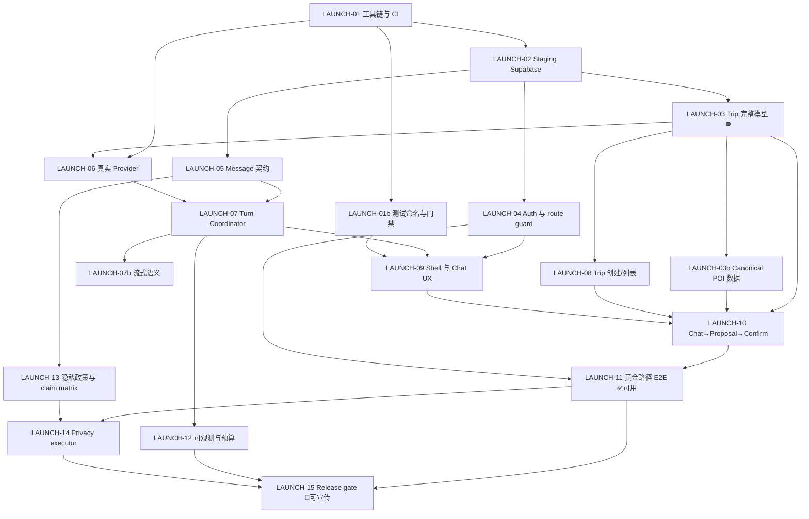

# VP-V4 Closed Beta 上线计划（第 2 版）

> 历史方案／2026-09-05 起退出当前执行入口。产品、分期、价格及任务队列以 [VPJ 总体规划](VISEPANDA-MASTER-PLAN-2026-09-05.md) 和 [VPJ Program](program/2026-09-05/README.md) 为准。下文保留历史证据；有效安全/数据合同继续沿对应ADR适用，不因方案归档而作废。

> 更新日期：2026-08-29
> 基线：`main@594821cc9ebc76b488c7feb65d1421ed26a3651e`
> 目标：**可用且可对外宣传的 closed beta**
> 当前状态：`preview / engineering scaffold` — 差距是确定的、可枚举的
> 方法：完整克隆源码逐文件核实，含 22 个页面、19 个 API 路由、21 个 migration、17 个数据库函数、26 个 e2e 文件、3 个 workflow

---

## 本版相对第 1 版的变化

| # | 变化 | 影响 |
|---|---|---|
| 1 | **产品决策：不走最小化路径，Trip 模型一次做完整** | `LAUNCH-03` 从 4–6 天扩到 2–3 周；新增 `LAUNCH-03b`（地点数据）；总工期 +3.5～5 周 |
| 2 | **Staging Supabase 已建**（`vp-restore-drill-20260829`） | `LAUNCH-02` 从「等操作者」变成「等 migration 执行」；但本会话网络无法直连该实例，执行方式见 §7.2 |
| 3 | **资产 ledger 6 条 hash 已确认并校准** | PR #167 |
| 4 | **CI 的两层红已定位并修复** | PR #148 + #167；顺带发现 `check:assets` 依赖完整 git 历史，CI 浅克隆使其必然失败 |

---

## 0. 先说三句最重要的话

**第一句：这份文档是路径，不是产品。** 按 §6 的 Issue 执行完 `LAUNCH-01` 到 `LAUNCH-11`，才能开 closed beta。

**第二句：最大的障碍不是「没接 AI」，是「没有行程」。**

四处互相印证的同一个事实：

> **VP-V4 的 Trip 目前只有一个内容字段：`title text`（最长 160 字符）。**

RLS、不可变 Proposal、CAS 版本控制、幂等键、append-only 审计、版本快照、回滚——这一整套精密机械，目前服务的是**一个字符串的重命名**。「Trip Canvas 的 Diff」在界面上就是 before/after 两行标题文字；「修改 Proposal」的表单是一个 `maxLength=160` 的单行输入框。

一句「第 2 天上午 9 点去故宫，步行 15 分钟到景山」，在当前 schema 里**无处可放**。

安全和并发的地基打得很扎实，那是最难补的部分。但一个 AI 行程规划产品，核心对象是「行程」，而这个对象还不存在。

**第三句：既然决定把产品做好，就要接受这件事的真实体量。**

操作者已决定不走最小化路径。这个决定是对的——数据模型是最贵的返工，砍小了将来要改表、改 RPC、改 Diff、改所有契约测试。但代价必须说清楚：

> **到内部可用：单人 11–15 个工程周（原 7.5–10 周）。**
> **到可对外宣传：单人 14–19 个工程周（原 10–13.5 周）。**

§8.2 给出了一个不牺牲模型完整性的分期方案。

---

## 1. 已经做好的部分

这些是真资产，不该被推翻重来。

### 1.1 安全与并发地基（最有价值的部分）

| 能力 | 证据 |
|---|---|
| owner-scoped RLS | 21 个 migration，每张用户表都有 `auth.uid() = owner_id` 策略 |
| 不可变 Proposal | `trip_proposals` 表 + 六态机（pending/applied/rejected/expired/conflicted/superseded） |
| CAS 并发控制 | `confirm_and_apply_trip_proposal` 里 `head_version <> base_trip_version` 直接判 `version_conflict` |
| 幂等 | `trip_idempotency` 表；同 key 不同 digest 抛 `IDEMPOTENCY_KEY_REUSE` |
| append-only 审计 | `trip_audit_events`、`trip_events`、`trip_version_snapshots` |
| 权限收紧 | `revoke update on public.trips from authenticated` — 用户**不能**直接改 Trip，只能经 RPC 原子应用 |
| 事件写入隔离 | `append_chat_turn_event` 只授权 `service_role`，客户端无法伪造 assistant 事件 |
| 失败分类 | `lib/server/identity/failure-response.ts` 统一失败码 + 五语文案 |
| 同源变更保护 | `isSameOriginMutation` 用于所有变更类路由 |

这套东西做对了很难、做错了要命。它是 VP-V4 相对于任何「能跑但不安全」的原型的核心优势。

### 1.2 前端

- Next.js 16 / React 19 / Tailwind v4 / strict TS，构建通过
- 五语（zh/en/es/ru/ar）+ RTL 文案体系完整（`lib/i18n.ts`）
- 首页、长版 Homepage、登录页有独立视觉表达
- 320–1440px viewport 测试通过
- **6 个组件接了真 API 且写得规范**：`ProfileWorkspace`、`CopilotMemoryWorkspace`、`TripCanvas`、`TripPlaceView`、`TripActionsView`、`ChatThreadWorkspace`
- `unavailable` 状态表达诚实——没有用假价格、假 POI、假 provider 冒充成功。**这是很值得肯定的工程操守**，也是能诚实宣传的前提

### 1.3 登录

`/auth/sign-in` 存在，密码登录/登出闭环已实现，五语文案齐全，明确标注 invitation-only。

### 1.4 本轮已修复

| 项 | PR | 说明 |
|---|---|---|
| `test:unit` 时间炸弹 | #148 | `handoff.lastUpdated` 被钉死为固定日期，`main` 因此常红 |
| 6 条资产 ledger hash | #167 | 23 条里 6 条与文件不符，全部 `internal-brand` |
| CI 浅克隆 | #167 | `check-assets.mjs` 需读历史 commit tree，三个 workflow 加 `fetch-depth: 0` |

---

## 2. 阻塞 closed beta 的九个缺口

按修复顺序排列。每一条都给了可复现的证据。

### 缺口 1：Trip 没有内容模型 ⛔ 最高优先级

**证据链（四处互相印证）：**

1. `supabase/migrations/20260825052328_ai14_actor_rls_fault_probes.sql:2` — `trips` 表全部字段：
   ```sql
   id, owner_id, head_version, title text, created_at, updated_at
   ```
   内容字段只有 `title`。

2. `confirm_and_apply_trip_proposal` 的核心语句：
   ```sql
   update public.trips set title = next_title, head_version = head_version + 1 ...
   ```
   而且它开头就校验 `jsonb_typeof(proposal.patch->'title') <> 'string'` 判 `invalid_patch` —— **patch 里除了 title 什么都不看**。

3. `components/canvas/TripCanvas.tsx:13` — Proposal 的类型定义：
   ```ts
   proposal: { ... titleDiff: { before: string; after: string } ... }
   ```
   界面上的 "Diff" 就是这两行字符串。修改表单是 `<input id="proposal-title" maxLength={160}>`。

4. `lib/server/trip/patch/contract.ts` — 内存契约支持三种操作
   （`set_title` / `upsert_day` / `delete_day`），`TripSnapshot.days` 的元素是 `{id, date}`
   ——**day 里没有任何内容**，而且这个契约与数据库**完全不通**：DB 的 RPC 不解析 `operations` 数组，也不存 days。

**这意味着：** 就算 AI 明天就能返回完美的行程 JSON，也没有地方存它，没有 Diff 能展示它，`confirm` 会当 `invalid_patch` 拒掉。

→ `LAUNCH-03`（本版已扩展为完整模型，见 §6.3）

---

### 缺口 2：没有创建 Trip 的入口

`app/api/trips/` 目录下**只有 `[tripId]/`，没有 `route.ts`** —— 即没有 `POST /api/trips`，没有 `GET /api/trips`。
`user-data-adapter.ts` 导出 24 个能力，其中**没有 `createTrip`**。

数据库 17 个函数中没有 `create_trip`，也没有创建**第一个** Proposal 的函数——
只有 `revise_trip_proposal`（改已有的）和 `create_trip_rollback_proposal`（回滚已有版本）。

死锁：**Trip 要靠 Proposal 才能改，Proposal 要挂在 Trip 上才能建，而两者都没有创建入口。**

**好消息**：数据库权限已就绪——
`grant insert on public.trips to authenticated` + policy `"trip owner inserts"` +
`after insert` trigger 自动写 v0 快照。**不需要新 migration**，只需接线。→ `LAUNCH-08`

---

### 缺口 3：Chat 有两套页面，一套不连后端，一套不能输入

**`/visepanda`**（首页 CTA 的落点）：`components/VisePandaChatWorkspace.tsx` **全文 30 行**。
`textarea` 的 `onChange` 只写 `setDraft`，提交只写 `setSubmitted`，全文件 `fetch` 出现 **0 次**。
用户以为自己发出了消息，实际上什么都没发生。

**`/visepanda/ask`**：`ChatThreadWorkspace.tsx` 确实连 `/api/chat/**`，但——
创建 thread 的 body 硬编码为字符串 `"{}"`；启动 turn 只提交
`{turnId, idempotencyKey, digest: "chat-state-control-v1"}`。**没有任何 message 字段，界面上没有输入框。**

→ `LAUNCH-09`

---

### 缺口 4：没有真实模型调用

`lib/server/model-gateway/` 六个文件里，`deepseek` / `qwen` 只作为**字符串字面量**出现在 profile 元数据和路由判断中。全仓没有任何一处 `fetch` 指向 provider 域名。

全仓环境变量引用只有 7 个：
```
NEXT_PUBLIC_SUPABASE_URL, NEXT_PUBLIC_SUPABASE_PUBLISHABLE_KEY, SUPABASE_DB_URL,
VISEPANDA_PUBLIC_ORIGIN, NODE_ENV, VP_ARTIFACT_ISSUE, VP_CI_SUITE
```
**一个 provider key 都没有** —— 连变量名都还没定义。→ `LAUNCH-06`

---

### 缺口 5：没有后台执行载体，turn 在数据库层面就是死链

`lib/server/turn/` 只有 4 个文件，其中一个叫 `fake-coordinator.ts`。
没有 `supabase/functions/`，没有队列消费者，没有定时任务。

更关键的是权限设计：

```sql
grant execute on function public.append_chat_turn_event(uuid, text, text, text) to service_role;
```

推进 turn 状态的权限**只给 `service_role`**。这个设计是对的（客户端不能伪造 assistant 事件），
但它的前提是**必须有一个持 service_role 的后台进程**。这个进程不存在。

**结果：** `start_chat_turn` 能把 turn 写成 `accepted`，然后**永远停在 accepted**。→ `LAUNCH-07`

---

### 缺口 6：SSE 协议冻结了，但一行流式代码都没有

Issue #8 已关闭，migration 里也硬编码了 `schema_version = 'turn-sse-v1'`。

但 `app/api/chat/turns/[turnId]/events/route.ts` 的实现是 `NextResponse.json(...)`——
返回 `application/json`，没有 `text/event-stream`，没有 `ReadableStream`。
客户端 `ChatThreadWorkspace.tsx:78` 也是普通 `fetch` 靠 `afterSequence` 轮询。

**文档说 SSE，代码是轮询。** → `LAUNCH-07b`

---

### 缺口 7：登录页存在，但周边接线全断

| 断点 | 证据 |
|---|---|
| 没有路由保护 | **全仓无 `middleware.ts`** —— 未登录可直接访问任何 product route |
| `returnTo` 不生效 | `lib/navigation/workspace-entry.ts` 实现了安全白名单，但**全仓零 import**（死代码）；`PasswordSignInForm.tsx:140` 登录后固定跳 `/visepanda` |
| first-run 永不显示 | `PasswordSignInForm` 接受 `showFirstRun`，但 `page.tsx` 不传，默认 `false` |
| `notProvisioned` 无人触发 | 该状态在 UI 类型和五语文案里都有，但**没有任何代码会设置它** |

→ `LAUNCH-04`

---

### 缺口 8：26 个 e2e 里 16 个是读源码字符串

`tests/e2e/` 下 26 个 `.test.mjs`，其中 **16 个** import `node:fs` 的 `readFileSync`——
打开 `.tsx` 源文件，用正则断言里面有没有某个字符串。真正启动浏览器的只有
`tests/e2e/frontend/web-10-viewport.spec.mjs` 的 3 个 Playwright 用例。

最需要注意的一行在 `tests/e2e/chat/v4-08-ask-route.test.mjs:20`：

```js
assert.doesNotMatch(workspace, /textarea|TripPatch|.../);
```

**「Chat 工作区里不许出现输入框」是这个测试的通过条件。**
而它对应的 Issue #93 标题是 `[V4-08] Durable Chat Threads、History、Reconnect 与 Cancel`。

这条断言会在 `LAUNCH-09` 加输入框时**直接把 CI 打红**。→ `LAUNCH-01b`

---

### 缺口 9：对外宣传的法务前提缺失

既然目标包含「宣传」，这些是硬前提：

| 缺失 | 现状 |
|---|---|
| 隐私政策页面 | **不存在**（`app/` 下只有 `api/privacy`，没有面向用户的政策页） |
| 服务条款页面 | **不存在** |
| 对外 claim matrix | 未定义——哪些能力可以宣传、哪些不能，没有依据 |
| 资产权利 | 9 个 `blocked-release` 资产仍在 public 输出 |
| main 分支保护 | 未配置 |

→ `LAUNCH-13`、`LAUNCH-15`

> ✅ 本缺口中「`check:flags` / `check:assets:release` 未接 CI」一项，其根因已在本轮查明并修复：
> `check-assets.mjs` 需要读 quarantine `sourceCommit` 的 tree，而 `actions/checkout` 默认浅克隆，
> 接进 workflow 必然报 `fatal: not a tree object`。三个 workflow 已加 `fetch-depth: 0`（PR #167）。

---

## 3. 成熟度评估

| 维度 | 完成度 | 依据 |
|---|---:|---|
| 视觉与响应式外壳 | 65%–75% | 首页/登录/产品壳/五语/RTL 完整 |
| 安全与并发地基 | **70%–80%** | RLS/CAS/幂等/审计/权限收紧都到位，缺 staging 真实验证 |
| 核心交互前端 | 15%–20% | 22 个页面里登录后真正有用的是 2 个 |
| **Trip 领域模型** | **10%–15%** | 只有 title 字段；patch 契约与数据库不通 |
| 后端生产运行时 | 5%–10% | 写路径四个入口全部不存在 |
| 发布与合规 | 10%–15% | 无隐私政策/条款；CI 门禁本轮已修复两层 |
| **可用 closed-beta 整体** | **15%–20%** | 架构准备远多于用户可用能力 |

---

## 4. 数据保留策略（已定）

| 数据类别 | 保留期 | 理由 |
|---|---|---|
| **用户消息 + 助手输出** | **90 天滚动删除** | 对话是敏感度最高的数据。90 天足够用户回看和工程 debug；再长只是在无谓地扩大泄露面。用户可随时导出。 |
| **Trip / 版本快照 / Proposal** | **用户主动删除前长期保留** | 用户的产出物，是产品价值本身，不设自动过期。 |
| **Memory / Profile** | **用户控制，随时可删** | 已有 consent 机制，保持用户主权。 |
| **审计事件** | **24 个月** | 安全取证与合规需要。**只存事件不存内容**。 |
| **运行日志 / telemetry** | **30 天** | 默认不含 prompt 内容、不含 JWT、不含密码。 |
| **账号删除 SLA** | **7 天可撤销 → 30 天内完成** | 7 天防误删和防盗号后的恶意删除；30 天在常见法规上限内。 |
| **备份** | **35 天滚动自然过期** | 备份技术上无法单条删除。**必须在隐私政策里明示**——含糊其辞比说清楚风险大得多。 |

**两条约束：**

1. 删除必须是**真删除或不可逆匿名化**，不是加个 `deleted` 标记。
2. 隐私政策上线前不得对外宣传——`LAUNCH-13` 是 `LAUNCH-15` 的硬前置。

---

## 5. Trip 领域模型设计（本版新增）

操作者已决定：**不走最小化路径，一次把模型做完整。** 本节是该决定的展开。

### 5.1 目标模型

```
Trip
 ├─ 元信息：标题、日期范围、目的地城市集合、旅行者构成、预算档位、节奏偏好
 └─ Day[]  （日期、所在城市、主题、节奏）
      ├─ Item[]  （序号、时段、类型、标题、地点引用、时长、备注、预算、预订引用、证据引用）
      │    类型：景点 / 餐饮 / 住宿 / 购物 / 休闲 / 自由时间
      └─ Segment[]  （交通段：起止 Item、方式、预计时长、距离、备注）
```

横切关注点：

| 关注点 | 现状 | 本模型的要求 |
|---|---|---|
| 地点引用 | `trip_place_references` 已存在，但 `canonical_pois` 表**只有 `id` 和 `created_at`**，且 `authenticated` 无读权限 | Item 的 `placeRef` 必须能显示名称、地址、坐标 → 见 `LAUNCH-03b` |
| 预订/票务 | `trip_action_references` 已存在（只读投影） | Item 可关联，无需新表 |
| 证据来源 | GroundedClaim / EvidenceReceipt 契约已存在，无数据 | Item 可携带来源引用；closed beta 阶段允许 `not_recorded` |

### 5.2 这个决定的连锁影响

**必须一并处理的：**

1. **`canonical_pois` 是空壳。** 它只有 `id` 和 `created_at`，而且 `revoke all ... from anon, authenticated` ——
   对用户来说，一个地点引用就是一串无法显示任何信息的 UUID。
   Item 有了 `placeRef` 却显示不出地名，模型就是残缺的。→ 新增 `LAUNCH-03b`

2. **模型输出 schema 复杂度大增。** 让 LLM 稳定产出多层嵌套结构，需要更强的 schema 校验、
   失败重试和局部修复逻辑。`LAUNCH-06` 因此从 3–5 天扩到 5–7 天。

3. **Diff 语义复杂化。** 跨天移动条目、调整顺序、修改时段——这些的差异展示与冲突检测
   都不是「两行字符串对比」可比的。`LAUNCH-10` 从 4–5 天扩到 7–10 天。

4. **契约测试量级上升。** 内存 `applyPatch` 与数据库 RPC 的对拍测试，需要覆盖每一种操作组合。

**明确不做（即使走完整路线）：**

- 实时价格、库存、可订性 —— 需要 provider 授权与数据地域决策，属于 closed beta 之后
- 地图几何与路径规划 —— 需要地图 provider 授权
- 多人协作编辑 —— 不在 closed beta 范围

### 5.3 为什么这个决定是对的（尽管更贵）

数据模型是**最贵的返工**。砍小了，将来要同时改：表结构、`confirm_and_apply` RPC、patch 契约、
Diff 渲染、模型输出 schema、以及所有相关的契约测试和安全负例。而这些改动会横跨已经上线的用户数据，
需要数据迁移——那时候的成本是现在的数倍。

**一次做对，比做两次便宜。**

---

## 6. Issue 规划

### 6.1 标签体系与关单铁律

| 标签 | 含义 | 可以关单吗 |
|---|---|---|
| `maturity:contract` | 契约/测试存在，用户路径未闭合 | ❌ |
| `maturity:runtime` | 运行时代码写完，未在 staging 验收 | ❌ |
| `maturity:staging-accepted` | 真实 staging + 真实账号验收通过 | ✅ |
| `maturity:production-observed` | 生产观察窗通过 | ✅ 已上线 |

**铁律一：release gate 判定为 `blocked` 时，Issue 必须保持 open。**
过去 96 个 Issue 关闭而产品不可用，根源就在这里。

**铁律二：不得宣传 `maturity:staging-accepted` 以下的任何能力。**

**旧 Issue 全部保留 closed，作为 contract/security 证据，不重开。**

### 6.2 可信工程基线

#### LAUNCH-01（#150）：钉死工具链并恢复全绿 CI — M（2–3 天）

pnpm 9.15.9 强制；修 Nightly；正确 `outputFileTracingRoot`；开 main required checks。

其中两条已由本轮 PR 完成：`test:unit` 时间炸弹（#148）、6 条资产 hash + CI 浅克隆（#167）。

⚠️ **required checks 必须在 #148 与 #167 合并之后再开**，否则所有 PR 会被卡在已知的既有失败上。

#### LAUNCH-01b（#151）：测试命名与门禁诚实化 — S（1–2 天）

16 个源码断言测试移出 `tests/e2e/` 到 `tests/static-guard/`；删除「禁止功能存在」的断言；
把 `check:flags`、`check:assets` 接进 PR gate，`check:assets:release` 接进 RC gate，
`test:e2e:frontend` 接进 Nightly。

> 本轮已扫清一个障碍：`check:assets` 之所以接不进 CI，是因为它需要完整 git 历史，
> 三个 workflow 的 `fetch-depth: 0` 已在 #167 加上。

#### LAUNCH-02（#152）：Staging Supabase 与数据库验收 — L（3–5 天）

✅ **项目已建**：`vp-restore-drill-20260829` @ `https://bycsftgjpybxnpmzcsay.supabase.co`

剩余工作：应用 21 个 migration、配置 auth URL、建 invite-only 测试用户、验证三条连接路径、
跑 RLS / RPC / rollback / backup-restore smoke。

⚠️ **执行方式见 §7.2** —— 本会话的出站网络策略拦截了对该实例的直连（`curl` 返回 `000`），
migration 必须由操作者在 Supabase SQL Editor 执行，或通过有网络访问的环境用 Supabase CLI 推送。

### 6.3 领域模型（最高优先级）

#### LAUNCH-03（#153）：Trip 内容模型、Patch 契约与原子应用统一 — **L（2–3 周）**

> 📌 **本版已按操作者决定扩展为完整模型**（原计划 4–6 天的最小化方案已作废）。
> 模型设计见 §5.1，连锁影响见 §5.2。

**Scope：**

1. 落地 §5.1 的完整 Trip / Day / Item / Segment 模型（追加 migration，新表或 jsonb 内容列，二选一写进 ADR）
2. 扩展 `lib/server/trip/patch/contract.ts` 覆盖 Day / Item / Segment 的完整操作集
3. **让数据库 RPC 真正解析 `operations` 数组** —— 目前只读 `patch->>'title'`
4. 重写 `confirm_and_apply_trip_proposal`：同一事务应用完整 operations，
   保持现有 CAS / 幂等 / 审计 / 版本快照语义**一字不改**
5. 重写 Canvas 的 Diff 渲染为按天/条目的结构化对比

**不要做：** 不放宽任何现有安全约束（`revoke update on trips from authenticated` 必须保留）；
不引入实时价格/库存；不做地图几何。

**验收：**
- 一个 Proposal 能新增一天、插入多个条目、调整顺序、添加交通段，确认后 Trip 快照与之一致
- `expectedVersion` 不匹配返回 `version_conflict`，Trip 不变
- 重复确认幂等
- Canvas 显示「第 2 天 新增：09:00 故宫；调整：午餐 12:00→12:30」这种可读 Diff
- **内存 `applyPatch` 与数据库 RPC 对同一 patch 产生逐字段相同的结果**（专门的对拍测试）

**风险：** 核心写路径，必须在真实 staging 事务和 RLS 下验证，契约测试不能代替。

#### LAUNCH-03b（新增）：Canonical POI 数据模型与试点城市数据 — **M（1–1.5 周）**

**背景：** `canonical_pois` 表当前只有 `id` 和 `created_at`，且 `revoke all from anon, authenticated`。
Item 的 `placeRef` 指向它，但用户看到的会是一串 UUID。完整 Trip 模型要求地点能显示。

**Scope：**
1. 扩展 `canonical_pois`：名称（多语）、地址、城市、坐标、类别、来源与许可、有效期
2. owner-safe 的读投影（`authenticated` 可读已审核、未过期、许可允许的记录）
3. 一到两个试点城市的最小 reviewed 数据集
4. 用户自填地点（`reference_kind = 'user'`）与 canonical 的并存与升级路径

**不要做：** 不接实时 POI provider（版权/地域/TTL 需单独决策）；不做评分、评论、图片。

**验收：** Item 的地点能显示名称与地址；跨用户不可越权读；过期/未审核记录不出现；
无数据时诚实显示 `unavailable` 而非空白。

### 6.4 登录与 Chat 主链

| Issue | 标题 | 估算 | 关键点 |
|---|---|---|---|
| #154 `LAUNCH-04` | closed-beta Auth、route guard 与 onboarding | M（2–3 天） | 新建 `middleware.ts`；接线零 import 的 `workspace-entry.ts`；`beta_allowlist` 表驱动 `notProvisioned` |
| #155 `LAUNCH-05` | User Message、Assistant Output 与保留策略契约 | L（3–5 天） | 落地 §4 保留策略；不写 raw payload / reasoning |
| #156 `LAUNCH-06` | 接入一个真实文本 Provider | **L（5–7 天）** | ⬆ 因完整模型导致输出 schema 复杂度上升 |
| #157 `LAUNCH-07` | 生产 Turn Coordinator 与后台执行 | L（4–5 天） | 先决定执行载体并写 ADR；让 `CHAT_RUNTIME_ENABLED` 真正生效 |
| #158 `LAUNCH-07b` | 落定流式传输语义 | S–M（1–3 天） | 实现 SSE 或正式改契约，二选一 |
| #159 `LAUNCH-08` | Trip 创建、列表、选择与空状态 | S（1–2 天） | 数据库权限已就绪，不需新 migration |
| #160 `LAUNCH-09` | 合并 Product Shell 与真实 Chat UX | L（3–5 天） | ⚠️ 硬依赖 #151，否则被自己的测试挡住 |
| #161 `LAUNCH-10` | 闭合 Chat → Proposal → Canvas → Confirm | **L（7–10 天）** | ⬆ 因完整模型导致 Diff 语义复杂化 |
| #162 `LAUNCH-11` | 真实黄金路径 Staging E2E Gate | M（2–3 天） | ✅ **通过即内部可用** |

### 6.5 可宣传的前提

| Issue | 标题 | 估算 |
|---|---|---|
| #163 `LAUNCH-12` | 生产可观测、预算与 kill switch | L（3–5 天） |
| #164 `LAUNCH-13` | 隐私政策、服务条款与对外 claim matrix | M（2–3 天） |
| #165 `LAUNCH-14` | Privacy Export/Delete Executor | L（4–5 天） |
| #166 `LAUNCH-15` | Production Release Gate、canary 与观察窗 | L（3–5 天）+ 72h 观察窗 ✅ **通过即可宣传** |

### 6.6 closed beta 之后

`LAUNCH-16` Knowledge · `LAUNCH-17` Explore · `LAUNCH-18` Today · `LAUNCH-19` 文本翻译 ·
`LAUNCH-20` Guide Import · `LAUNCH-21` Offline

> `LAUNCH-03b` 已把 `LAUNCH-17` Explore 的地点数据前置条件解决了一部分。

---

## 7. 需要操作者亲自做的事

### 7.1 已完成

| 项 | 状态 |
|---|---|
| 域名 `go2china.space` 绑定 VP-V4 | ✅ 已绑定并确认可用 |
| Staging Supabase 项目 | ✅ `vp-restore-drill-20260829` @ `https://bycsftgjpybxnpmzcsay.supabase.co` |
| 资产 hash 校准确认 | ✅ 已确认，PR #167 |
| 数据保留策略 | ✅ 见 §4 |
| 测试用户开通方式 | ✅ 手动开通（allowlist） |
| Trip 模型路线 | ✅ 完整模型，不走最小化 |

> 📌 **命名提示**：项目名 `vp-restore-drill-20260829` 读起来像是「恢复演练」专用。
> 如果后续 `LAUNCH-15` 要单独做备份恢复演练，建议再建一个专用实例，避免 runbook 里两个用途混淆。
> 当前这个用作 staging 完全可以，只是名字会让人误会。

### 7.2 下一步：把 21 个 migration 应用到 staging

⚠️ **本会话无法直连该 Supabase 实例** —— 出站网络策略拦截了它：

```
https://bycsftgjpybxnpmzcsay.supabase.co/rest/v1/       -> 000
https://bycsftgjpybxnpmzcsay.supabase.co/auth/v1/health -> 000
```

所以 migration 必须由你执行，或在有网络访问的环境执行。两条路，任选：

**方式 A：Supabase SQL Editor（不需要装任何东西，推荐）**

1. 浏览器打开 <https://supabase.com/dashboard>，进 `vp-restore-drill-20260829`
2. 左侧点 **SQL Editor**（图标像一张纸带 `>_`）
3. 点 **New query**
4. 按**文件名顺序**逐个打开 `supabase/migrations/` 下的 21 个 `.sql` 文件，
   把内容粘进编辑器，点右下角 **Run**（或 Ctrl+Enter）
   - 顺序很重要：`20260824101500_v4_baseline.sql` 开头，`20260829191000_v4_14_...` 结尾
   - 每跑完一个，看右下角出现绿色 **Success**，再跑下一个
   - 如果某个报错，**停下来把报错截图发我**，不要跳过继续
5. 全部跑完后，左侧 **Table Editor** 应该能看到 `trips`、`trip_proposals`、`chat_threads`、
   `turns`、`memory_profiles`、`user_profiles` 等表

> 我可以把 21 个文件按顺序合并成一份可以一次粘贴的 SQL，减少重复操作——需要的话说一声。

**方式 B：Supabase CLI（如果你本机有开发环境）**

```bash
npm i -g supabase
supabase login                       # 浏览器授权
supabase link --project-ref bycsftgjpybxnpmzcsay
supabase db push                     # 按顺序推送 supabase/migrations/
```

### 7.3 接着：把连接信息放进 Vercel 与 GitHub

⚠️ **不要把任何 key 贴进聊天窗口。**

**Vercel**（Settings → Environment Variables，Environments 只勾 **Preview**）：

| Key | 值来自 |
|---|---|
| `NEXT_PUBLIC_SUPABASE_URL` | `https://bycsftgjpybxnpmzcsay.supabase.co` |
| `NEXT_PUBLIC_SUPABASE_PUBLISHABLE_KEY` | Project Settings → API → anon / publishable key |

改完记得去 **Deployments** → 最新那条 → `...` → **Redeploy**，环境变量不会自动生效。

**GitHub**（Settings → Secrets and variables → Actions → New repository secret）：

| Secret | 用途 |
|---|---|
| `SUPABASE_DB_URL` | 供 `pnpm db:verify` 与 integration/security 套件连库 |

> `service_role key` 只在后台 worker（`LAUNCH-07`）需要，那时再配。
> 它等于数据库管理员密码，**绝不能进前端 bundle，绝不能进仓库**。

### 7.4 Provider Key（`LAUNCH-06` 前置，约 15 分钟）

**只申请一个。** 建议 DeepSeek（中文旅行场景表现好、价格低）。

1. <https://platform.deepseek.com> 注册 → **API keys** → **Create new API key**
2. `sk-` 开头的字符串 ⚠️ **只显示一次**，立刻复制存密码管理器
3. **充值小额**（10–50 元足够跑通测试阶段）。不充值会返回余额不足，容易被误判成代码问题
4. Vercel → Environment Variables → Add New：Key 填 `DEEPSEEK_API_KEY`（大小写敏感），
   Environments **只勾 Preview**
5. Deployments → 最新那条 → **Redeploy**

### 7.5 GitHub 分支保护（`LAUNCH-01` 的一部分，5 分钟）

⚠️ **等 #148 和 #167 合并、CI 确认全绿之后再做**，否则所有 PR 会被卡住。

1. <https://github.com/JTCAO515/VP-V4> → **Settings** → **Branches**
2. **Add branch protection rule**，Branch name pattern 填 `main`
3. 勾上：
   - ☑ Require a pull request before merging
   - ☑ Require status checks to pass before merging → 搜 `deterministic-pr-gates` 勾上
   - ☑ Require branches to be up to date before merging
4. 底部 **Create**

---

## 8. 依赖图与工期



### 8.1 里程碑

| 里程碑 | 范围 | 单人全栈 | 2–3 人并行 |
|---|---|---:|---:|
| **M1 可信基线** | 01、01b、02 | 1.5–2 周 | 1 周 |
| **M2 领域模型** | 03、03b | **3–4.5 周** | 2–3 周 |
| **M3 主链贯通** | 04…10 | **5.5–7.5 周** | 3–4.5 周 |
| **M4 内部可用** | + 11 | 0.5 周 | 0.5 周 |
| **M5 可宣传** | + 12、13、14、15 | 2.5–3.5 周 + 72h | 1.5–2 周 + 72h |

**到 M4（内部可用）：单人 11–15 个工程周，2–3 人 6.5–9 个日历周。**
**到 M5（可对外宣传）：单人 14–19 个工程周，2–3 人 8–11 个日历周。**

相比第 1 版增加约 3.5–5 周，全部来自完整 Trip 模型的决定（`LAUNCH-03` 扩容 + 新增 `LAUNCH-03b`
+ `LAUNCH-06` 与 `LAUNCH-10` 的连带扩容）。

### 8.2 建议：完整设计，分期实现

「不走最小化」不等于「所有能力必须一次做完才能验证」。建议这样拆：

| 阶段 | schema | 实现 | 可验证什么 |
|---|---|---|---|
| **3-A** | 完整落地（Trip/Day/Item/Segment 全部字段） | Day + Item 的增删改查与 Diff | 黄金路径可以跑通 |
| **3-B** | 不变 | Segment（交通段）+ 地点显示（含 03b） | 行程有了空间与时间的连续性 |
| **3-C** | 不变 | 预订引用、证据引用的填充 | 可追溯性 |

**与最小化的本质区别**：schema 一次设计到位、一次建表，永不返工；只是某些字段在 3-A 阶段
暂时为空。这样既拿到了「一次做对」的收益，又不必等 3 周才知道链路通不通。

风险最高的从来不是「功能少」，而是「做了 3 周才发现模型设计有问题」。3-A 让这个反馈提前到第 1 周。

---

## 9. 必须停止的做法

1. 不再以「页面存在」「PR merged」「contract test passed」关闭用户能力 Issue
2. 不再把 unavailable 页面计为同名功能已开发完成
3. 黄金路径通过 staging 之前，不新增大规模架构/研究 Issue
4. 不同时接多个 LLM provider——先证明一条真实路径
5. 不把源码断言命名为 E2E
6. 不让 deployment success 代替 release acceptance
7. 不为了让页面「看起来能用」而恢复 fixture 回答、假 Trip、假价格或客户端直接写 Trip
8. **不再写「禁止某功能存在」的断言** —— `assert.doesNotMatch(/textarea/)`
   把「暂时没做」固化成了「不许做」，下一个 Issue 想做就得先改测试，而改测试看起来像放宽标准
9. **不在冻结协议后不实现就关 Issue** —— `turn-sse-v1` 冻进了数据库 schema，却没有一行流式代码
10. **不宣传 `maturity:staging-accepted` 以下的能力**
11. **（新增）不把「检查脚本没接 CI」当成疏忽就直接接上** —— 本轮发现 `check:assets` 接进去必然
    失败（浅克隆读不到历史 commit）。接门禁之前先在本地用 CI 的同等条件跑一遍

---

## 10. 下一步

**你的下一个动作（约 30–45 分钟）：** §7.2 把 21 个 migration 应用到已建好的 staging。
它阻塞 `LAUNCH-03`、`LAUNCH-04`、`LAUNCH-05`，也就是后面几乎所有事。
需要我把 21 个文件合并成一份可一次粘贴的 SQL，说一声。

**可以立刻并行开工的（不依赖任何人）：**
- 合并 #148 与 #167 → CI 恢复可信
- `LAUNCH-01b`（#151）测试命名与门禁诚实化 —— 它是 `LAUNCH-09` 的硬前置
- `LAUNCH-03`（#153）的模型设计与 ADR —— 设计阶段不需要数据库

**在 `LAUNCH-11`（#162）通过之前，产品对外状态保持：**

> `preview / engineering scaffold / not usable as a real AI travel product`

**在 `LAUNCH-15`（#166）观察窗通过之前，不做任何对外宣传。**

---

## 附录 A：核实过的关键文件

| 文件 | 核实结论 |
|---|---|
| `supabase/migrations/20260825052328_ai14_actor_rls_fault_probes.sql:2` | `trips` 表内容字段只有 `title text` |
| `supabase/migrations/20260828170000_v4_10_trip_version_snapshots.sql` | `confirm_and_apply_trip_proposal` 只 `update trips set title`；`revoke update on trips from authenticated`；`after insert` trigger 自动写 v0 |
| `lib/server/trip/patch/contract.ts` | 内存契约的 `day` 只有 `{id, date}`；与数据库 RPC 不通 |
| `components/canvas/TripCanvas.tsx:13` | Proposal 类型只有 `titleDiff: {before, after}`；修改表单是单个 `maxLength=160` input |
| `app/api/trips/` | 只有 `[tripId]/`，**无 `route.ts`** |
| `lib/server/identity/user-data-adapter.ts` | 导出 24 个能力，**无 `createTrip`** |
| 21 个 migration | 17 个数据库函数，**无 `create_trip`**，无创建首个 Proposal 的函数 |
| `components/VisePandaChatWorkspace.tsx` | 全文 30 行，`fetch` 出现 0 次 |
| `components/chat/ChatThreadWorkspace.tsx:104,120` | thread body 硬编码 `"{}"`；turn 只提交固定 digest |
| `components/product-shell/` | 只有 `ProductShell.module.css`，**无组件** |
| `app/api/chat/turns/[turnId]/events/route.ts` | 返回 `NextResponse.json`，**非 SSE** |
| `lib/server/turn/` | 4 个文件，含 `fake-coordinator.ts` |
| `lib/server/model-gateway/` | 6 个文件，provider 名只是字符串，**无 HTTP transport** |
| `lib/flags/registry.ts` | 两个 flag 全仓仅 3 处引用，**运行时零消费者** |
| `lib/navigation/workspace-entry.ts` | 实现正确，**零 import** |
| `middleware.ts` | **不存在** |
| `supabase/functions/` | **不存在** |
| `20260828153000_v4_08_durable_chat_threads.sql:137` | `append_chat_turn_event` 仅授权 `service_role`；无 worker |
| `20260828180000_v4_11_trip_place_references.sql` | `canonical_pois` 只有 `id`+`created_at`，`authenticated` 无读权限 |
| `tests/e2e/` | 26 个文件，16 个用 `readFileSync` 做源码断言 |
| `tests/e2e/chat/v4-08-ask-route.test.mjs:20` | `assert.doesNotMatch(workspace, /textarea/)` |
| `scripts/check-assets.mjs:44,50` | 需读 quarantine `sourceCommit` 的 tree；CI 浅克隆下必然 `fatal: not a tree object`（#167 已修） |
| `docs/licenses/asset-rights-ledger.json` | 23 条记录中 6 条 hash 与文件不符（#167 已校准） |
| `app/` | **无隐私政策页，无服务条款页** |
| `docs/architecture/v4-01-demo-parity-registry.md` | 40 个动作，`implemented` **0 个** |
