# VP-V4 正式产品功能等价 Issue 拆解草案

> 历史方案／2026-09-05 起退出当前执行入口。产品、分期、价格及任务队列以 [VPJ 总体规划](VISEPANDA-MASTER-PLAN-2026-09-05.md) 和 [VPJ Program](program/2026-09-05/README.md) 为准。下文保留历史证据；有效安全/数据合同继续沿对应ADR适用，不因方案归档而作废。

> 状态：published to GitHub；implementation not started
> 日期：2026-08-26
> Parent：[AI-00 Program #2](https://github.com/JTCAO515/VP-V4/issues/2)
> 来源：`vp-v4-production-feature-parity-report.md`、`vp-v4-ai-trip-canvas-product-logic-upgrade-report.md`、`vp-v4-agent-rag-memory-tools-context-engineering-report.md`
> Tracker：`JTCAO515/VP-V4`

## 0. 规划结论

在现有 AI-00～AI-50 之后新增 V4-01～V4-31，共 31 个工作单元。它们不重复已有模型、RAG、Explore、翻译或外部数据 Issues，而是补齐 Context Engineering、Tool Policy、ConstraintEngine、RoutePattern 研究以及正式产品层的 Chat、Canvas、Memory、User、Today、Tools、Import、Offline 和全量验收。

本草案沿用现有 R0–R5 milestones 和 `phase:R0`～`phase:R5` labels，不新增 R6。最终产品等价验收作为 R5 的末端 Gate。

每个实现 Issue 目标为 `XS/S/M/L <=5 focused days`。任何开工前仍需在 `docs/agents/issue-execution-contract.md` 添加实际 GitHub Issue 编号对应行。

## 1. 当前事实与创建前门禁

- 创建收尾时 `origin/main@d46a4e4`；现有 Program #2 仍为父 Issue。
- #3～#14、#16、#48、#50 已关闭。
- 当前 ready frontier：#49 AI-45、#84 AI-51、#87 V4-01；#15 等待 #84。
- #17 是 R1 Gate；#23、#31、#36、#43 分别是 R2～R5 Gate。
- #55 已关闭，遗留 `status:in-progress` 已 re-triage 为 `status:ready`；历史和交付范围未改写。
- #49 AI-45 的文本/native 依赖 #3/#9 已关闭，已 re-triage 为 `status:ready` + `ready-for-agent`。
- 规划基线已提交为 PR #83；V4-01～V4-31 已作为 Program #2 sub-issues 发布。2026-08-26 创建时检测到并发 AI-51 编号冲突，因此采用独立 V4 namespace。

### 1.1 Published Issue mapping

| Plan ID | GitHub Issue |
| --- | --- |
| V4-01 | [#87](https://github.com/JTCAO515/VP-V4/issues/87) |
| V4-02 | [#85](https://github.com/JTCAO515/VP-V4/issues/85) |
| V4-03 | [#88](https://github.com/JTCAO515/VP-V4/issues/88) |
| V4-04 | [#89](https://github.com/JTCAO515/VP-V4/issues/89) |
| V4-05 | [#90](https://github.com/JTCAO515/VP-V4/issues/90) |
| V4-06 | [#91](https://github.com/JTCAO515/VP-V4/issues/91) |
| V4-07 | [#92](https://github.com/JTCAO515/VP-V4/issues/92) |
| V4-08 | [#93](https://github.com/JTCAO515/VP-V4/issues/93) |
| V4-09 | [#94](https://github.com/JTCAO515/VP-V4/issues/94) |
| V4-10 | [#95](https://github.com/JTCAO515/VP-V4/issues/95) |
| V4-11 | [#96](https://github.com/JTCAO515/VP-V4/issues/96) |
| V4-12 | [#97](https://github.com/JTCAO515/VP-V4/issues/97) |
| V4-13 | [#98](https://github.com/JTCAO515/VP-V4/issues/98) |
| V4-14 | [#99](https://github.com/JTCAO515/VP-V4/issues/99) |
| V4-15 | [#100](https://github.com/JTCAO515/VP-V4/issues/100) |
| V4-16 | [#101](https://github.com/JTCAO515/VP-V4/issues/101) |
| V4-17 | [#102](https://github.com/JTCAO515/VP-V4/issues/102) |
| V4-18 | [#103](https://github.com/JTCAO515/VP-V4/issues/103) |
| V4-19 | [#104](https://github.com/JTCAO515/VP-V4/issues/104) |
| V4-20 | [#105](https://github.com/JTCAO515/VP-V4/issues/105) |
| V4-21 | [#106](https://github.com/JTCAO515/VP-V4/issues/106) |
| V4-22 | [#107](https://github.com/JTCAO515/VP-V4/issues/107) |
| V4-23 | [#108](https://github.com/JTCAO515/VP-V4/issues/108) |
| V4-24 | [#109](https://github.com/JTCAO515/VP-V4/issues/109) |
| V4-25 | [#110](https://github.com/JTCAO515/VP-V4/issues/110) |
| V4-26 | [#111](https://github.com/JTCAO515/VP-V4/issues/111) |
| V4-27 | [#112](https://github.com/JTCAO515/VP-V4/issues/112) |
| V4-28 | [#113](https://github.com/JTCAO515/VP-V4/issues/113) |
| V4-29 | [#114](https://github.com/JTCAO515/VP-V4/issues/114) |
| V4-30 | [#115](https://github.com/JTCAO515/VP-V4/issues/115) |
| V4-31 | [#116](https://github.com/JTCAO515/VP-V4/issues/116) |

V4-02 使用 #85，V4-01 使用 #87；GitHub Issue/PR 共用数字序列，因此 URL 编号不要求与 Plan ID 顺序一致。

## 2. 去重裁决

| 产品能力 | 继续使用已有 Issue | 本轮不重复创建 |
| --- | --- | --- |
| Canvas Confirm/Reload | #15 | 不另建第二条 Trip writer |
| RLS/fault | #16 | 不在 User/Memory Issue 中重建 RLS 基础 |
| ModelGateway | #18/#19/#47/#51/#52 | 不创建新的 provider router |
| Retrieval/RAG/Cards | #20～#22 | 不在 Chat UI 内实现检索 |
| Knowledge/Explore | #24～#31/#54 | 不导入 Demo POI seed |
| Media/OCR/Voice | #32～#36/#53 | 不创建第二条媒体生命周期 |
| External evidence | #37～#42 | Tools/Today 只消费统一 Resolver |
| Failure/Flags | #48/#49 | 新 Issue 只注册自己需要的失败态和 flag |
| Hardening | #43 | 新增 Full Parity Gate 以 #43 为前置，不替换它 |

## 3. 依赖总图

```mermaid
flowchart TD
  existingR1["#15 + #16"] --> gateR1["#17 R1 Gate"]
  gateR1 --> parity["V4-01 Agent and Parity Register"]
  parity --> context["V4-02 ContextPlan"]
  parity --> toolCore["V4-03 Tool Gateway"]
  parity --> constraints["V4-04 ConstraintEngine"]
  existingRag["#21 Hybrid RAG + #31 R3 Gate"] --> routePattern["V4-05 RoutePattern Spike"]
  constraints --> routePattern
  gateR1 --> auth["V4-06 Auth Session"]
  parity --> shell["V4-07 Product Shell"]
  auth --> shell
  shell --> chat["V4-08 Chat Threads"]
  chat --> chatUx["V4-09 Chat Result UX"]
  context --> chatUx
  toolCore --> chatUx
  constraints --> chatUx
  shell --> canvas["V4-10 Timeline + Versions"]
  canvas --> place["V4-11 Place View"]
  canvas --> actions["V4-12 Actions Projection"]
  parity --> memoryContract["V4-13 Memory Contract"]
  memoryContract --> memoryUi["V4-14 Copilot Memory"]
  memoryUi --> memoryImpact["V4-15 Memory Receipts"]
  context --> memoryImpact
  auth --> profile["V4-16 User Profile"]
  profile --> privacy["V4-17 Export/Delete"]
  canvas --> today["V4-18 Today Base"]
  constraints --> today
  today --> liveToday["V4-19 Live Conditions"]
  today --> externalRecovery["V4-20 External Recovery"]
  today --> travelerRecovery["V4-21 Traveler Recovery"]
  toolCore --> tools["V4-22 Tool Surface Health"]
  tools --> safePack["V4-23 Safe Phrase Pack"]
  tools --> ride["V4-24 Ride Assist"]
  tools --> visa["V4-25 Visa Tool"]
  tools --> network["V4-26 Network Tool"]
  tools --> handoff["V4-27 Handoff Pack"]
  parity --> import["V4-28 Guide Import"]
  import --> conflict["V4-29 Guide Conflict Proposal"]
  safePack --> offline["V4-30 Offline Pack"]
  context & toolCore & constraints & routePattern & chatUx & place & actions & memoryImpact & privacy & liveToday & externalRecovery & travelerRecovery & safePack & ride & visa & network & handoff & conflict & offline --> finalGate["V4-31 Full Parity Gate"]
  existingR5["#43 R5 Gate"] --> finalGate
```

## 4. Proposed Issues

### 1. `[V4-01] Agent Runtime Adoption、Demo Parity Registry 与 Fixture 处置`

- **Phase/Priority:** `phase:R1`, `priority:P0`, governance/documentation。
- **Blocked by:** None；读取已关闭 #5、#48、accepted ADRs。
- **What it delivers:** 为 Demo 每个动作冻结 owner、maturity、source、failure、flag、observability、rollback；记录 thin TypeScript、AI SDK、Workflow、LangGraph/Chain 的采用门；将 Fixture 分类为 reuse contract/test、port behavior、rewrite 或 retire。
- **Estimate:** M。
- **Acceptance:** 31 个新 Issue 的 execution-contract rows 有 owner/allowed paths/commands/artifacts；框架选择有 paired baseline/trigger/rollback；Demo 数据明确不可生产导入。

### 2. `[V4-02] ContextPlan、ContextAssembler、Validator 与 Trace Receipt`

- **Phase/Priority:** `phase:R2`, `priority:P1`, governance/enhancement。
- **Blocked by:** #17、V4-01。
- **What it delivers:** task/risk-aware `ContextPlan`、Trip/Memory/Evidence/Tool source budgets、最小 Context 装配、provenance manifest、summary/version 和 injection boundary。
- **Estimate:** L。
- **Acceptance:** full-history baseline 对照；cross-user/draft/expired/prohibited Context leak 为 0/N；关键约束不因 compaction/position 丢失。

### 3. `[V4-03] Tool Contract、Policy Gateway、Executor、Receipt 与 Idempotency`

- **Phase/Priority:** `phase:R2`, `priority:P1`, governance/enhancement。
- **Blocked by:** #16、#17、#48、#49、V4-01。
- **What it delivers:** model tool intent 与 server execution 分离；task-specific allowlist、schema、actor/scope/license/risk、approval、deadline、retry、output screening 和 receipt。
- **Estimate:** L。
- **Acceptance:** Function Call 不能直接执行；no-tool/clarification/timeout/replay/injection/approval digest 测试通过；Trip 仍只走 Proposal/Confirm/Patch。

### 4. `[V4-04] ConstraintEngine、Feasibility Checker 与 PLAN-EVAL 基线`

- **Phase/Priority:** `phase:R2`, `priority:P1`, enhancement/governance。
- **Blocked by:** #13、#17、V4-01。
- **What it delivers:** hard/soft/assumption/missing constraints、预算/时间窗/转场/开放/预约/同行人可行性、tradeoff candidates 和 deterministic final-state scorer。
- **Estimate:** L。
- **Acceptance:** 模型只抽取/解释候选约束；硬约束、预算和时空结果由代码裁决；不可行/unknown 可见。

### 5. `[V4-05] RoutePattern RAG Feasibility、Rights 与 Spatiotemporal Eval Spike`

- **Phase/Priority:** `phase:R4`, `priority:P2`, governance/research。
- **Blocked by:** #21、#31、V4-04。
- **What it delivers:** 对 reviewed RoutePattern/trajectory candidate 的 source rights、schema、applicability、hybrid retrieval 和时空收益做 paired spike；不建设 GraphRAG。
- **Estimate:** M。
- **Acceptance:** 相对 POI/Guide baseline 有分层 Eval；当前 route matrix/Fact/Constraint 仍重新校验；无权利或无增益则 reject 并不实现 runtime。

### 6. `[V4-06] Authenticated Closed-Beta Session 与 Product Route Guard`

- **Phase/Priority:** `phase:R2`, `priority:P1`, enhancement。
- **Blocked by:** #17、#49、V4-01。
- **What it delivers:** 真实登录 session、受保护 Product routes、未认证 preview boundary、expired session 恢复和五语错误态。
- **Estimate:** L。
- **Acceptance:** anonymous 无 durable Trip/Turn/Profile；owner JWT + RLS 路径通过；preview 不声称保存。

### 7. `[V4-07] Product Shell、Deep Link 与 Capability-Gated Navigation`

- **Phase/Priority:** `phase:R2`, `priority:P1`, enhancement。
- **Blocked by:** V4-01、V4-06、#49。
- **What it delivers:** Today/Ask/Copilot/Tools/Explore/User 六面导航、deep link、desktop/mobile shell；未就绪能力隐藏或诚实 unavailable。
- **Estimate:** M。
- **Acceptance:** 五语/RTL/390×844；flag off 不绕过 route auth；不迁 Early Access 全屏壳。

### 8. `[V4-08] Durable Chat Threads、History、Reconnect 与 Cancel`

- **Phase/Priority:** `phase:R2`, `priority:P1`, enhancement。
- **Blocked by:** #17、V4-02、V4-07。
- **What it delivers:** 多轮 thread、linked Trip、可恢复 event sequence、history 状态、reconnect replay 和 cancel 传播。
- **Estimate:** L。
- **Acceptance:** reconnect 不重复模型调用/成本；terminal 后无业务事件；刷新后线程一致。

### 9. `[V4-09] Chat Clarification、Result Types 与 Feedback 闭环`

- **Phase/Priority:** `phase:R3`, `priority:P1`, enhancement。
- **Blocked by:** #22、#23、V4-02、V4-03、V4-04、V4-08。
- **What it delivers:** needs_input/answer/card/proposal_ready/unavailable/conflict 六类结果；another option、inaccurate、reject reason 和 user correction 审计。
- **Estimate:** L。
- **Acceptance:** unavailable 无执行 Claim；反馈不自动改 Fact/Trip；每个 chat 至少支持两轮真实状态。

### 10. `[V4-10] Canvas Timeline、Node Inspection 与 Version History`

- **Phase/Priority:** `phase:R2`, `priority:P1`, enhancement。
- **Blocked by:** #15、#17、V4-07。
- **What it delivers:** 持久 Trip 的 Timeline、节点详情、origin Turn/Proposal、append-only versions 和 rollback-as-new-version。
- **Estimate:** L。
- **Acceptance:** Chat/Canvas 同一 head version；rollback 不改写历史；reload 一致。

### 11. `[V4-11] Trip Place View 与 Exact POI Scope`

- **Phase/Priority:** `phase:R4`, `priority:P2`, enhancement。
- **Blocked by:** #30、#31、V4-10。
- **What it delivers:** Canvas Place View 只投影 TripPlaceReference/UserPlaceRef；点击地点把 exact ID 带入 Chat scope。
- **Estimate:** M。
- **Acceptance:** 不从标题重猜 POI；Fact 过期保留 Trip 节点并 recheck；无 map provider 时显示 schematic。

### 12. `[V4-12] Reservations & Actions Projection`

- **Phase/Priority:** `phase:R5`, `priority:P2`, enhancement。
- **Blocked by:** #22、#39、V4-10。
- **What it delivers:** 用户票据、预约要求、官方渠道、准备事项和状态投影；替代误导性的 Bookings。
- **Estimate:** M。
- **Acceptance:** 不产生订单/支付；过期或 provider failure 可见；行动状态来自唯一 Trip/Artifact source。

### 13. `[V4-13] MemoryProfile Contract、Consent、Hard Constraint 与 RLS`

- **Phase/Priority:** `phase:R2`, `priority:P1`, governance/enhancement。
- **Blocked by:** #16、#17、V4-01。
- **What it delivers:** explicit/confirmed/inferred/rejected/paused/deleted 状态、source receipt、consent、owner access 和 hard-constraint precedence。
- **Estimate:** L。
- **Acceptance:** inferred 不能成为 hard constraint；跨用户泄漏为 0/N；暂停后不检索。

### 14. `[V4-14] Copilot Memory Confirm、Reject、Pause、Forget 与 Impact UI`

- **Phase/Priority:** `phase:R2`, `priority:P1`, enhancement。
- **Blocked by:** V4-07、V4-13。
- **What it delivers:** Copilot Memory 可见来源、更新时间、影响记录和完整用户治理操作。
- **Estimate:** L。
- **Acceptance:** 每个动作 durable/reload 一致；删除不只改变前端；五语/RTL/mobile 通过。

### 15. `[V4-15] Memory Receipts 在 Chat 与 Canvas 的影响追踪`

- **Phase/Priority:** `phase:R3`, `priority:P1`, enhancement。
- **Blocked by:** #22、V4-02、V4-09、V4-10、V4-14。
- **What it delivers:** Chat 回答和 Canvas change 显示具体 MemoryReceipt；用户可回到来源并否定。
- **Estimate:** M。
- **Acceptance:** 暂停/否定后新 Turn 不引用；硬约束覆盖普通偏好；审计可追溯。

### 16. `[V4-16] User Profile、Preferences、Locale 与 Units`

- **Phase/Priority:** `phase:R2`, `priority:P1`, enhancement。
- **Blocked by:** V4-06、V4-13。
- **What it delivers:** 账户资料、显式旅行偏好、语言、货币、距离/温度单位和默认出发时间的真实持久化。
- **Estimate:** L。
- **Acceptance:** explicit setting 与 inferred Memory 分离；owner-only；五语和 RTL 正确。

### 17. `[V4-17] Privacy Data Export、Delete 与 Retention Evidence`

- **Phase/Priority:** `phase:R4`, `priority:P2`, enhancement/governance。
- **Blocked by:** #53、V4-14、V4-16。
- **What it delivers:** Profile/Memory/Trip/Turn/UserArtifact 导出和删除流程、retention/backup 边界、可验证 receipt。
- **Estimate:** L。
- **Acceptance:** 删除失败不显示成功；backup exception 可见；C0–C4 策略与 audit 通过。

### 18. `[V4-18] Today NextAction 与 Trip Check Registry 垂直切片`

- **Phase/Priority:** `phase:R3`, `priority:P1`, enhancement。
- **Blocked by:** #22、V4-04、V4-10。
- **What it delivers:** 从当前 Trip、时间和一条 eligible Fact 确定性生成一个 NextAction 和 9 类 CheckResult。
- **Estimate:** L。
- **Acceptance:** 不调用通用 LLM 猜关键值；每一步显示 why/evidence/missing；无资格时 unavailable。

### 19. `[V4-19] Today Live Conditions、Freshness 与 Recheck`

- **Phase/Priority:** `phase:R5`, `priority:P2`, enhancement。
- **Blocked by:** #37、#38、V4-18。
- **What it delivers:** Weather/AQ/alert/closure observations 进入 Today，带 TTL、stale/unavailable 和 Canvas recheck。
- **Estimate:** M。
- **Acceptance:** 缓存不冒充实时；provider failure 保留安全 Trip；RL-04/RL-06。

### 20. `[V4-20] Transport Delay 与 Place Closure Recovery Proposal`

- **Phase/Priority:** `phase:R5`, `priority:P2`, enhancement。
- **Blocked by:** #37、#38、#39、V4-18。
- **What it delivers:** 延误和闭馆触发有证据的 Recovery Proposal，用户确认前 Trip 不变。
- **Estimate:** L。
- **Acceptance:** 两类扰动均覆盖 accept/reject/conflict/recheck；不自动取消或购买。

### 21. `[V4-21] Queue、Unwell 与 Safe Human Handoff Recovery`

- **Phase/Priority:** `phase:R5`, `priority:P2`, enhancement。
- **Blocked by:** #48、V4-18。
- **What it delivers:** 排队和身体不适的受控恢复，紧急渠道优先，普通帮助不伪装救援。
- **Estimate:** M。
- **Acceptance:** 医疗高风险无证据即 unavailable/official channel；恢复仍走 Proposal。

### 22. `[V4-22] Tool Surface Health、Degraded 与 Offline UX`

- **Phase/Priority:** `phase:R5`, `priority:P2`, governance/enhancement。
- **Blocked by:** #36、#48、#49、V4-03、V4-07。
- **What it delivers:** 消费 V4-03 Tool contract，统一每个 Product Tool 的 provider health、failure copy、offline behavior、Card/Proposal presentation 和 kill-switch UX。
- **Estimate:** M。
- **Acceptance:** Tool 不自建 Trip state；healthy/degraded/offline 一致；flag 不是授权。

### 23. `[V4-23] Bilingual Address、Direction 与 Allergy Safe Phrase Pack`

- **Phase/Priority:** `phase:R5`, `priority:P2`, enhancement。
- **Blocked by:** #22、#35、#36、V4-22。
- **What it delivers:** 中英地址卡、问路卡、过敏说明、屏幕/TTS 同文本和 offline eligibility。
- **Estimate:** M。
- **Acceptance:** 高风险文本 deterministic；TTS == displayed text；来源/有效期可见。

### 24. `[V4-24] Ride Assist：Pickup、Chinese Destination 与 Provider Handoff`

- **Phase/Priority:** `phase:R5`, `priority:P2`, enhancement。
- **Blocked by:** #22、#37、V4-22。
- **What it delivers:** 用户确认上车点、中文目的地、车型/预估状态和外部渠道 handoff。
- **Estimate:** L。
- **Acceptance:** 不代叫、不支付、不声称合作；敏感位置最小化；失败保留地址卡。

### 25. `[V4-25] Visa & Regulations Scoped Policy Tool`

- **Phase/Priority:** `phase:R5`, `priority:P2`, enhancement。
- **Blocked by:** #24、#37、V4-22。
- **What it delivers:** 按护照、停留、地区和时间解析 scoped Policy Fact，显示 authority/recheck/official channel。
- **Estimate:** M。
- **Acceptance:** 不构成法律保证；scope 不足不外推；expired 返回 recheck/unavailable。

### 26. `[V4-26] Network、eSIM 与 Local Number Preparation Tool`

- **Phase/Priority:** `phase:R5`, `priority:P2`, enhancement。
- **Blocked by:** #24、#37、V4-22。
- **What it delivers:** reviewed connectivity Guide/Fact、是否需要本地号码、准备清单和 truthful coverage boundary。
- **Estimate:** M。
- **Acceptance:** 不显示未审核价格/覆盖；不直接写 Trip；可生成 Preparation Proposal。

### 27. `[V4-27] Human Handoff Pack 与 Official Emergency Boundary`

- **Phase/Priority:** `phase:R5`, `priority:P2`, enhancement/governance。
- **Blocked by:** #48、V4-22。
- **What it delivers:** 当前 Trip/城市/问题/已尝试步骤的可复制交接包，官方紧急渠道优先；不接入虚构真人客服。
- **Estimate:** M。
- **Acceptance:** 无 operator capacity 时只生成 pack；不发送消息；紧急场景不延迟官方渠道。

### 28. `[V4-28] Private Guide Import：PDF、Link、Image Extraction 与 Correction`

- **Phase/Priority:** `phase:R5`, `priority:P2`, enhancement。
- **Blocked by:** #22、#32、#39、V4-01。
- **What it delivers:** 用户攻略作为 private UserArtifact 接收、解析、字段置信度、人工纠错、prompt-injection 隔离和 TTL。
- **Estimate:** L。
- **Acceptance:** 无自动事实升级；失败字段可手工补充；source/ownership/purpose 明确。

### 29. `[V4-29] Imported Guide Conflict Check → TripProposal → Canvas`

- **Phase/Priority:** `phase:R5`, `priority:P2`, enhancement。
- **Blocked by:** #15、V4-09、V4-28。
- **What it delivers:** 导入字段与当前 Trip/eligible Facts 做冲突检查，生成可编辑 Proposal 和可见 Diff。
- **Estimate:** L。
- **Acceptance:** 原 Trip 在确认前不变；冲突理由/证据/unknown 可见；版本冲突可恢复。

### 30. `[V4-30] Offline Trip、Address、Safe Phrase 与 Expiry Pack`

- **Phase/Priority:** `phase:R5`, `priority:P2`, enhancement。
- **Blocked by:** #49、V4-10、V4-23。
- **What it delivers:** 离线读取已保存 Trip、地址卡、Safe Phrase、过敏卡和最近同步/过期状态。
- **Estimate:** L。
- **Acceptance:** offline 不显示实时；跨用户缓存隔离；登出/删除清理；390×844 真机测试。

### 31. `[V4-31] Full Product Parity、五语、Fault 与 Observation Acceptance`

- **Phase/Priority:** `phase:R5`, `priority:P2`, governance/documentation。
- **Blocked by:** #43、V4-02、V4-03、V4-04、V4-05、V4-09、V4-11、V4-12、V4-15、V4-17、V4-19、V4-20、V4-21、V4-23～V4-30。
- **What it delivers:** 对 Demo 功能目录逐项给出 implemented/degraded/hidden 证据和八维/L1–L7 验收报告。
- **Estimate:** L。
- **Acceptance:** 每个 Demo 动作有真实证据；五语/RTL/mobile/offline/actor/fault 通过；未跑项和观察窗明确。

## 5. 建议创建顺序

1. 先创建 V4-01，并取得实际 GitHub Issue 编号；
2. 按 blockers-first 顺序创建 V4-02～V4-31；
3. 将全部新 Issues 作为 #2 的 sub-issues；
4. 创建后补 `docs/agents/issue-execution-contract.md` 实际编号行；
5. 只把 V4-01 放入 ready frontier；其余按真实 blocker 标 blocked；
6. #15、#16 保持现有 frontier，不被新计划打断；
7. V4-01 关闭后再计算下一批 ready；
8. 不自动修改或关闭 #17/#23/#31/#36/#43；新增 Issues 作为独立依赖图并最终汇入 V4-31。

## 6. 创建时标签规则

- V4-01：`documentation`, `governance`, `phase:R1`, `priority:P0`, `status:ready`, `ready-for-agent`。
- R2/R3：`priority:P1`；R4/R5：`priority:P2`。
- blocked Issues：`status:blocked`，不加 `ready-for-agent`。
- 实现 Issue：`enhancement`；release/contract/acceptance：`documentation` + `governance`。
- 不新增 `phase:R6` 或 milestone；V4-31 归入 `R5 Controlled production`。

## 7. Operator 审阅问题

在写入 GitHub 前确认：

1. 31 个 Issue 的粒度是否合适；
2. 是否接受沿用 R0–R5，并把 Full Parity Gate 放在 R5 末端；
3. 是否接受 Human Handoff 首发只生成交接包，不承诺真人服务；
4. 是否接受 Ride Assist 只做准备与外部 handoff，不代叫和支付；
5. 是否先合并/发布三份报告、一份一手证据底稿和本草案，再让 GitHub Issue 正文链接它们；
6. 是否授权创建后对 #49/#55 做状态一致性 re-triage，但不关闭或改写其已交付历史。
